# 全新录制PMP项目管理零基础一次顺利拿到PMP证书 - P7：PMP精讲课项目干系人 - 北京东方瑞通 - BV1qN4y1h7Ja

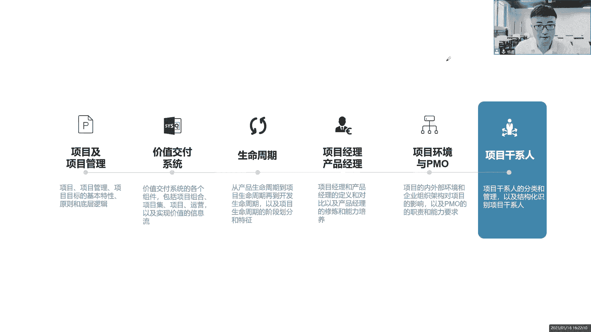

盐官格局来看这个项目的干系人，刚刚一直在讲啊，这个什么领导主管相关方案，干系人这些都是个啥，来我们对干性能做一个分类，第一类人能够影响我项目的这些人，群体和组织是干系人，那比如说我们的经理。

主管发起人客户，他给你钱，给你资源啊，给你做决策，这不能影响你吗，第二类人会受项目影响的，这是什么人，群体和组织一样的吗，还是这些人啊，主管经理客户，他们会跟这个项目是利益相关的。

他们受这个项目的利益影响，包括你的团队成员也是这样的嘛，会受项目的影响，第三类人自认为会受项目的影响的人，群体和组织，就这个干系人干性不一定是个不一定是一个人，可能是一群人，一帮人，一堆人都有可能。

是不是组织嘛，群体嘛，就这个意思啊，一个团伙都有可能，所以这么三类人那啥叫自认为啊，就这么理解啊，同学们说的简单粗暴一点哈，大家通俗一点容易理解，我们咱不用不用去搞这种话术，专业性的话术。

就说我们再看这个项目A我们在做这个项目啊，这些什么领导主管经理，经常过来和我们打成一片，打成一片，那另外一个项目组，这个项目经理他就眼红了，哎呀你看这个经理们总是喜欢和他们打成一片，和他们啊。

关键关系很好啊，是不是我这个项目不重要，是不是我不重要，是不是我们这个团队做的有问题，是不是当前我们这个项目要被解散了，要被合并呢，他认为会受到影响，我哪里影响你了吗，是说我这个组织。

我这个项目的战略优先级比你高而已，是你自己企业的忧天，你自认为受影响，那你也是我的干系人，我要把你管好，你不要多想，你这些多想我指不定你会干出什么事情呢，是不是，所以我得管理好这帮人啊。

那这些人都是我的干系的。

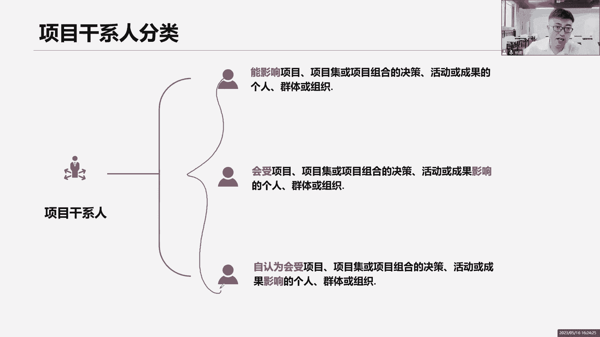

我得管理好他们，为什么要管理好他们，第一个你先把它们找出来，是不是找出来，然后呢管理好这些人的需求和期望，就是你的需求和期望是什么，你不要总是在那闷闷不乐的，不要担心，不要焦虑，不要犹豫，不要不满。

不要不爽，你跟我说，你哪里不爽，你哪里不舒服，你跟我说，我们沟通，我了解你的需求，了解你的期望，来我们看看我们这个项目，按照这个计划去推动的话，未来能不能符合你的需求，能不能满足你的期望，这是一点。

还有呢有的时候这些干系人啊，他们是利益有冲突的，为什么说这么说啊，一个财务部门的领导，他是我的心安信任对吧，因为我要花钱嘛，找他拿钱，他肯定是希望我省钱啊，哎呀这个项目我觉得300万就可以搞定了。

你一定要多省钱啊，一定要在300万之内把这个项目做完哦，好了，质量部门的领导，质量部门的经理又说小杨啊，这个项目啊，你们要做这个高质量啊，不要怕花钱多花钱，把这个质量给我搞高一点，500万。

你们应该可以搞定吧，那请问各位，我就是一个小小的项目经理，我到底听谁的，我到底听谁的，我是说这个项目在300万搞定，还是说在500万搞定，我听谁的，你们两个之间有利益冲突啊，我是不是得先平衡一下。

找到一个平衡点，让你们两个都满意，让你们两个都认可诶，我这个目标就确定下来了，所以项目经理你把这些人管理起来不容易啊，第一个你得先了解他们的需求和期望，第二个呢你还得平衡他们的需求和期望，达成一致。

形成一个目标，一个具备smart原则的目标，我才能够去开展工作，否则你一句话，我一句话，我听谁的，我都不知道呢，希望各位你们满意认可，提高干性能的满意度，对于我来说是项目成功的一个重要的衡量标准。

希望各位都满意，对我认可支持，鼓励帮助，这就是我管理干性的目的在这里面，所以我要尽可能多的去识别到这些人，那既然说识别干系呢，我问一个问题，问大家一个问题，大家思考思考。

现在我们比如说我们正在给我们企业，我们做一个什么项目呢，哎我们做一个物联网的项目很牛逼，我们做一个物联网的项目啊，举个例子哈，只是举个例子，不管什么项目，反正就这个这个类型吧。

那么请问这是我们企业的项目，我们公司的项目，请问大家，我们的家人算不算是这个项目的干系人，专家思考，我们的家人，父母孩子爱人亲戚，什么长辈啊，爷爷奶奶是不是我这个项目的关系，思考一下。

根据我们的干性的原则定义，我们的家人能不能够影响我的项目，或者说他们会不会受我这个项目的影响，如果是，那他们就是我项目的干系人，大家说是不是啊，必须是啊，同学们，这帮我们的家人一定是我向往的干系人。

怎么去理解他们能不能够影响你的项目，完全可以影响你的项目，而且非常的直接，简单又粗暴，怎么理解你这么思考，你天天996，你天天007，请问孩子，你管不管家务事，你做不做，好不容易，等到周末，你跟我说。

你要学习pp，你管不管这个家家人对你有意见，跟你争吵，跟你吵，影响你的情绪，你的情绪受影响，你的你的管理，你的工作就受影响，那你们的项目就受影响，项目受影响，部门受影响，部门受影响。

整个企业受影响是不是非常简单，又触发了直接影响你的工作了，那必须是你的项目啊，是不是啊，所以为什么说，有的企业对于我们的家人做了一些关怀，比如说有的企业我们定一个加家庭日，选一个日子嘛。

随便把我们选一个日子，家庭日，各位员工，你们可以带领你们的孩子，你们的爱人，你们的父母来我们公司参观学习，来玩游戏，做互动，哎我给你们准备各种游戏零食啊，各种玩具，还有什么游游玩的一些东西。

带领你们的家长来参观，让你们家人来了解看到你自己的企业，你的工作环境，让他们能看到我们企业是怎么对待，我们自己的员工的目的是什么，不是真的让他们去玩去耍，是希望他们能够支持你的工作。

996支持支持007，支持支持你看就这个目的，有的企业给你的父母，除了给你每个月发工资以外，也会给你的父母每个月发一个孝敬金，孝敬你的父母，可能钱不多啊，200或者300，意思一下嘛。

只是表示公司的一个态度而已，钱不多，几百块钱，每个月也发给你们校基金，给你，给你的父母，让你的父母支持你的工作，就这个意思，所以说我们的家人是不是干性都是，所以说识别干系人啊要注意哈，不光是持续识别。

还要尽可能多，尽可能广的去识别门口的保安大叔，我们每天的这个这个楼道的清洁阿姨，都是指不定哪一天他投诉你小心一点。

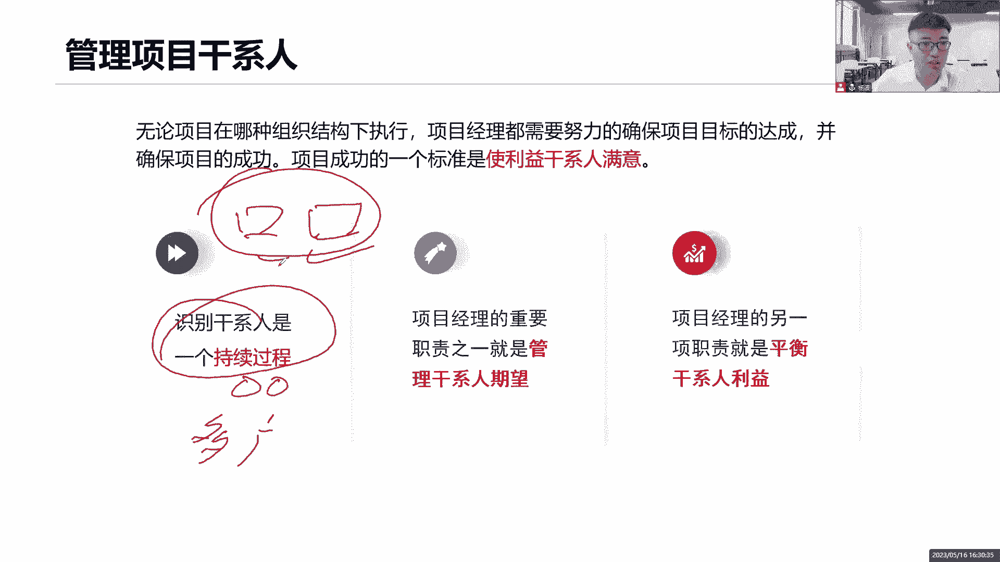

所以干性的识别我们结构化的去识别，注意结构化的识别，你不要东想一个西想一个，你怎么去结构化识别诶，上面有我的领导，下面有我的团队，前面有我的客户，后面有我的供应商，左边是我的职能部门的经理。

右边是什么行业协会组织前后左右识别，结构化的识别，这样才不会遗漏啊，你看这些这些人，是不是你能项目干系人全都是哪一个，不是啊，都是你的干系人，所以在整个过程中，你要去满足他们的需求和期望。

这里面是不是少了一个，少了个谁，团队是不是你的团队也是你的干系人啊，但是你没写是吧，你的团队啊，这些有有有血的话，这是项目团队，也是你们干系。

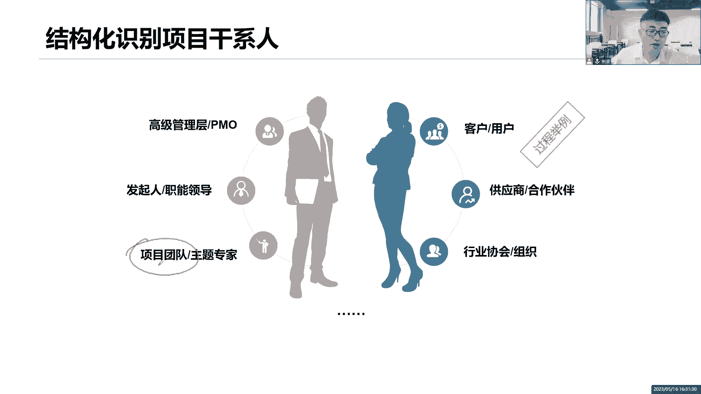

对啊，这帮人是来帮助你开展工作的，来我们说这位大佬发起人他是干嘛的，嗯这么理解啊，这个发起人啊，他是一个项目的发起者，倡导者，怎么说呢，我们一起来说哈，就我们前面我们说需求评估，有一个需求来了。

有一个业务需求来了，我们先做一个需求评估，这个需求评估谁做发起人啊，你来做虚哎，这个字写的太丑，需求评估评估，得到我的业务目标，搞清楚业务是什么，然后接下来我们做什么事情，是不是商业分析。

一个是商业论证，接下来还有一个呢是收益实现计划，你对我的论证做一个补充性的说明，这些事情都是发起人在做的，先搞清楚业务是什么，有哪些需求，谁提的一个业务需求，哪些市场的需求，这个需求值不值得做。

能够为企业创造多大的价值，怎么去衡量这个价值，那前期的各种商业分析，市场分析发起人啊，这是他的职责，他去做的，他去做好了，如果说分析完了之后，他发现我们发现这个项目值得做。

确实能够给公司创造十个亿的收入，哇塞做不做，必须得做啊，立项，那必须得立项，是不是好了，那关键是做个项目，那对方也花钱啊，得有资金，得有资源，所以说发起人你做完这些事情之后，你就应该向公司的高层人员。

CXO这帮人跟他们说，哎呦我们这个项目很给力，能够给公司创造十个亿的收入，而且这个投资回收期还比较短，啊说了各位CXO他们眼睛都红了，好这个时候他们是不是要给你们做决策，发起人这个事情很重要。

你得赶紧去落实来，我给你权利，我给你资金，我给你资源，也就是说CXO把这些权利资金和资源交给你，发起人给你，发起人，希望你拿到这些资源和这些资金，能够把这个项目落地下来。

但是大家知道发起的他是不做项目的，他不做项目的，我们怎么理解，发现就是一个部门经理而已，就这个意思，过了一个什么项目总监之类的人物，他们并非是公司高层，但是他们依然有权利，而且这帮人他们不做项目。

于是乎他们就要甩锅呀，怎么甩，通过一个立项文件给我项目经理授权，把他现在手上的权力资金资源，通过这个立项文件他一签发好了，全部交给我了，由我项目经理拿着这些权力资金资源，带领我的这一帮歪瓜裂枣开始工作。

已完成，我的项目目标就这么玩，发起人就这么玩的，很有意思是吧，好，现在知道了发起人干嘛来，我们一起来看看它的职能还有哪些哈，第一个给我们定目标，那必须得买，你这个做项目。

你前期做了这么一系列的什么商业分析，什么经济可行性分析，那我们这个项目的目标是什么，收益是什么，目标效益是什么，定下来得给我们定下来，成为团队的拥护者，你得拥护我们团队啊，既然说这个项目的话。

你是最终的受益人，那你也得保护我们团队啊，啊做出高层级的一些决策，你因为你毕竟你也是高层，你也是个领导人员啊，给我们获取资源，给我们提供资金，都是由你的职责啊，确保目标和商业目标保持一致，对了。

因为如果说项目经理你发现了，而这个发起人或者说有些其他的相关方，其他的干系人提出了一些异议，你要和我们的那个发起人沟通，以确保当前我们项目的目标是否和商业的目标，战略的目标保持一致的，好清除障碍。

因为有的时候项目经理他不一定有权利搞定，你得帮助我们项目经理清除一些障碍，解决我们团队职责职权之外的，因为你有权利啊，你的权力是很高的，而我们团队的权力是很小的，你帮助我们搞定一些事情。

尤其是超出我们权利范围之外的事情啊，然后呢注意一下我们出现了一些机会，希望我们能够把握住这个机会，以及项目结束之后也要关注什么，我们最终的收益，所以说这一点很重要，大家注意话是这么说哈，很好理解。

但是呢教会了我们一个道理，什么道理，未来我们做项目通常来说都比较稀缺，缺资源，那么这个时候你项目上每天996，大家加班，缺资源，是不是能够加一些资源，能够缓解缓解大家的压力呀，可以呀，多拍些人手进来吗。

那这个时候你要去找找资源，你找他要资源，怎么找他要资源，你跟他说发起人哎呀，你看我们现在项目团队每天忙的要死，天天加班，是不是那个工作人工作绩效每天都不是很好，希望能够加一个资源，缓解我们团队的压力。

让我们项目能够更好地开展工作，你要是这么跟他说，我敢保证你百分之百的要不到资源，绝对要不当志愿，那你应该怎么说，发起人，你看现在我们这个团队哈压力比较大，这个工作比较多，大家每天加班加点干活。

而且也完不成，项目有延期的风险，这个项目一延期，它会直接影响我们最终的收益，你影响我们最终的收益，这个话一说出来，他眼睛必然就放光了，诶因为这个收益是直接影响我的，这个收益是跟我绩效挂钩的。

你要是这么说，发起人就会多问几个问题，哎怎么影响收益了，影响多大的收益啊，是什么情况影响的，你进一步的分析啊，你进一步的沟通啊，你进一步把这个话题打开呀，是不是就有可能获取到资源。

不要站在项目层面去讲问题，你应该站在整个业务层面，业务的收益层面，发起人的立场上面去考虑，然后以获取资源，这才有助于帮助我们去拿到资源，一旦跟业务跟收益挂钩了，要是影响收益放心，这个事情我帮你搞定。

你交给我，我来给你获取资源，这不就搞定了吗，所以大家注意啊，未来工作当中我们的工作方式，我们的这个沟通沟通的方式，这个见人说人话，见鬼说鬼话，你得知道这个鬼话怎么说，你不能够鬼话连篇，你这个鬼话得找准。

找准什么切入点。

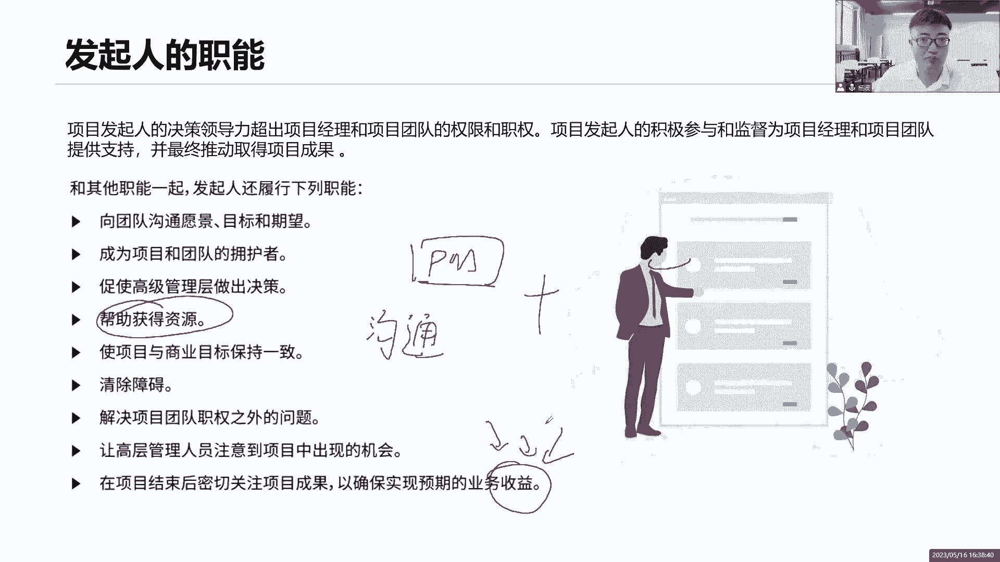

找准这个人的利益关系点，诶学会怎么做事情很重要，所以发行的给我们提供很多的支持，给我们定目标，定愿景，定我们的商业目标，要确保和商业目标保持一致，然后呢关注我们这些各种优先级的工作。

帮助我们做出一些超出权力范围的决策，鼓励大家一起朝着更好的方向去发展，发起人通常对项目的成果担责，也就是对项目的收益担责，这个成果不是可交付成果，不是最终这个什么APP的成果哈。

是说这个成果它背后带来的收益，因为这个收益是他的绩效，而项目经理呢，你是对这个项目的交付负责的，这个项目怎么交付，什么时间交付，交付的质量好不好，由你来负责，但是交付之后最终的收益有发起人担责的。

所以说发起人会给你提供更多的支持和帮助的。

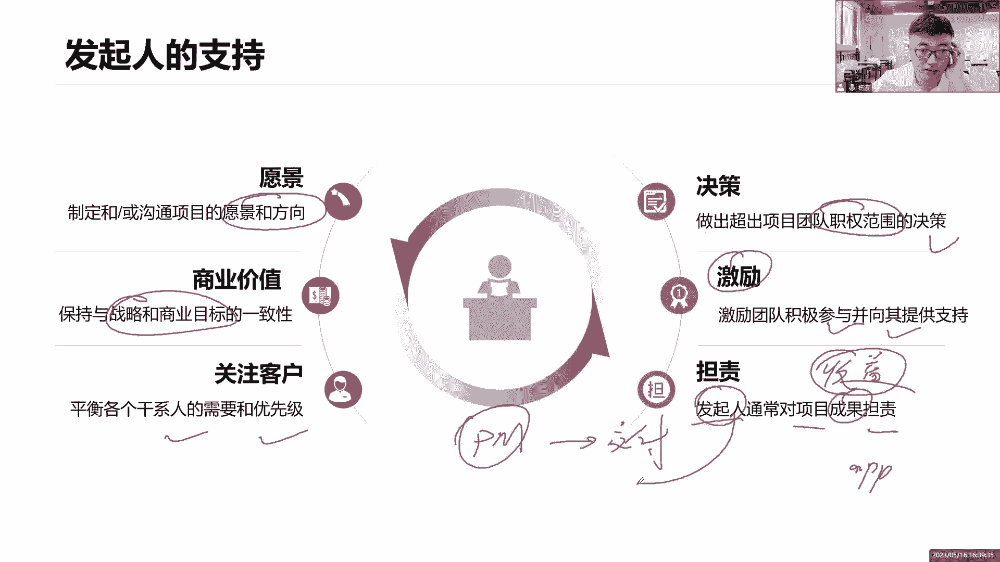

但是就看你怎么不说话了，团队团队也是很重要的一帮干系人团队，我们尽可能希望他们是专职的，全职的，百分之百的投入这个工作，不要玩兼职，玩兼职就意味着什么，大家的精力会分散，哎你既在做我项目的事情。

又在做他项目的事情，或者说你是一个外包人员，有的企业就是专门找外包人员去干活了，因为节约成本啊，但是大家知道，这个外包外包团队的凝聚力是没有的哦，很难形成凝聚力的，因为我们根本就不属于你这个企业是吧。

然后呢有两种，有两种办公的方式，一个是集中办公，大家在一起在一个办公室啊，在一个楼层，然后呢有可能是虚拟团队，我们不在一起，不不在一个地方，不在一个城市，甚至不在一个国家，都有可能我们是一个跨国团队。

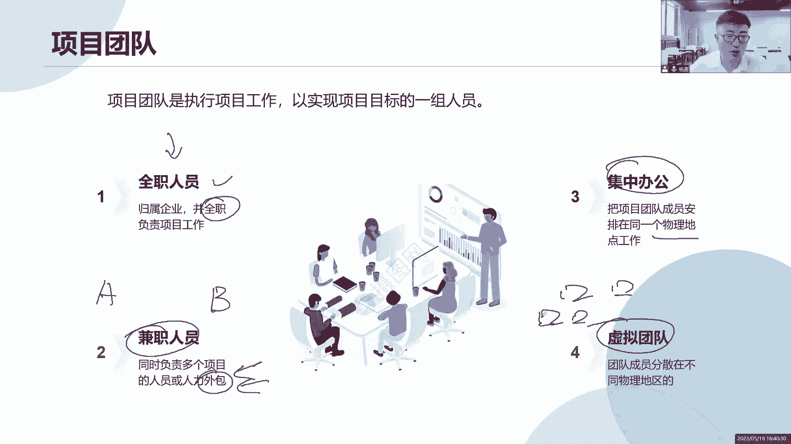

有可能啊啊最后客户和用户，什么是客户买单的人，什么是用户使用使用过这个产品的人，就是用户给我买单的人，提供资金的人，他是客户啊，用户呢就是直接使用这个产品，这个可交付成果的人啊，这帮人。

所以在某些环境下面，你看客户或者最终用户会参与到项目里面来，确实因为有些项目需要，尤其是敏捷项目啊，我们要不断的去产出成果，敏捷嘛，要快速适应变化，快速适应变化，快速调整。

那就需要你们客户给我提出需求啊，给我提出反馈，包括用户也是一样，你在用的过程当中，你们的体验是什么，一个提出一些你们的反馈，你们的反馈其实就是需求，我需要把这个需求纳入进来，我要去澄清需求，梳理需求。

然后呢以便于我去开展这个工作，做完之后我还要找你们来给我审查，是不是到位了，你给我一个反馈啊，如果不到位我改，而如果做的很到位，那么就说明当前我这个成功是可以交付出去的。

需要你们频繁地参与到我的项目里面来啊，其实任何一个项目咱都脱离不了客户和用户啊，脱离不了，只不过我们说预测性的项目，可能他们参与的频率会比较低，而我们适应型敏捷的项目呢，因为你两到四周就要发布一个版本。

所以希望他们是需要，频繁地参与到我的项目里面来开展沟通，有规律的开展审查，有规律的给我提供一些反馈，这些反馈要么是变更，要么是新的需求，总之都是有价值的东西，这些价值是希望我未来融入到我的产品里面。

其实也就是给你们创造价值，给你们提高客户的什么市场竞争力，提高用户的用户体验满意度好了，关于我们第二章的一些项目管理的知识体系，的一个整个的基础概念就讲到这里了，其实我们在这里可以做一个总结哈。

做一个总结，什么总结呢，就是这我们整个第二章需要哪些内容。

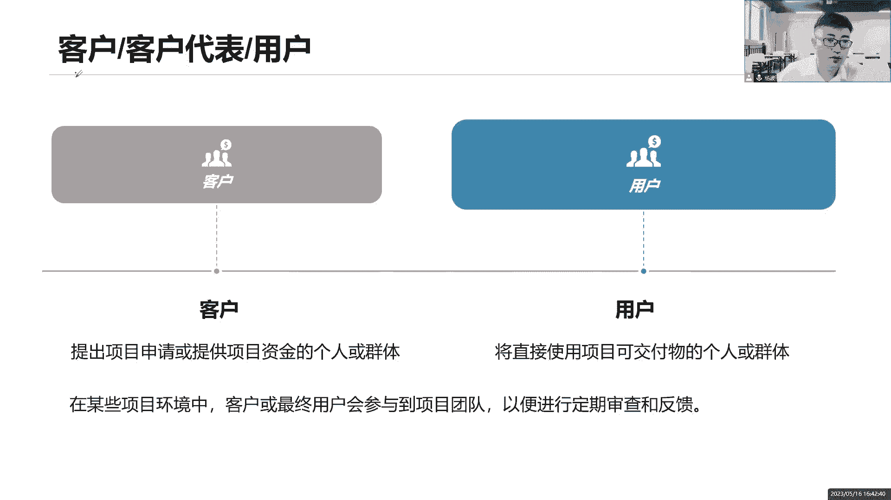

那你找一个比较白一点的页面来跟大家去做作，新建一个页面吧。

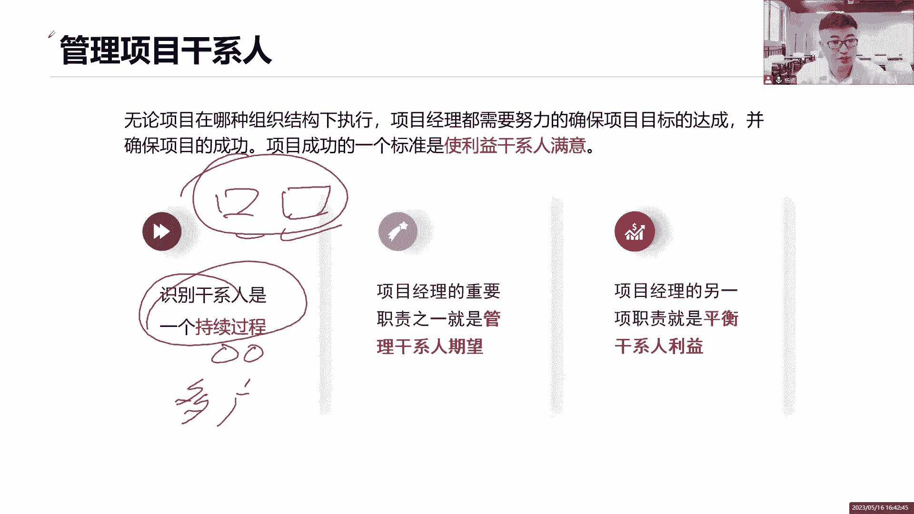

这样吧。

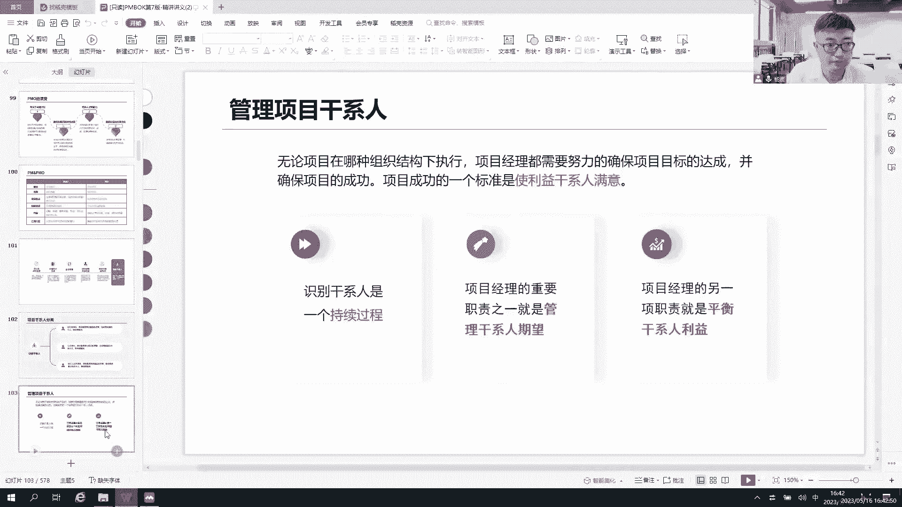

我们新建一个页面来跟大家做一个总结。

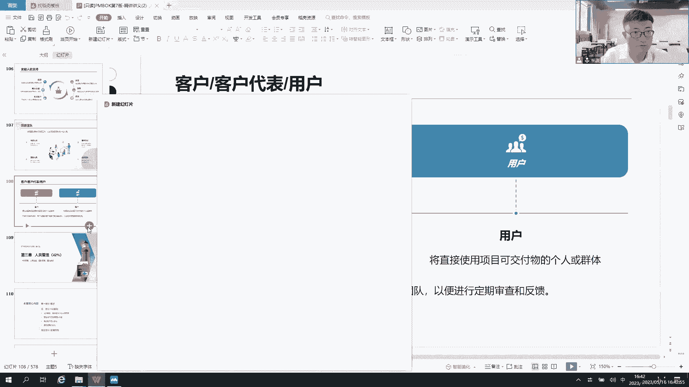

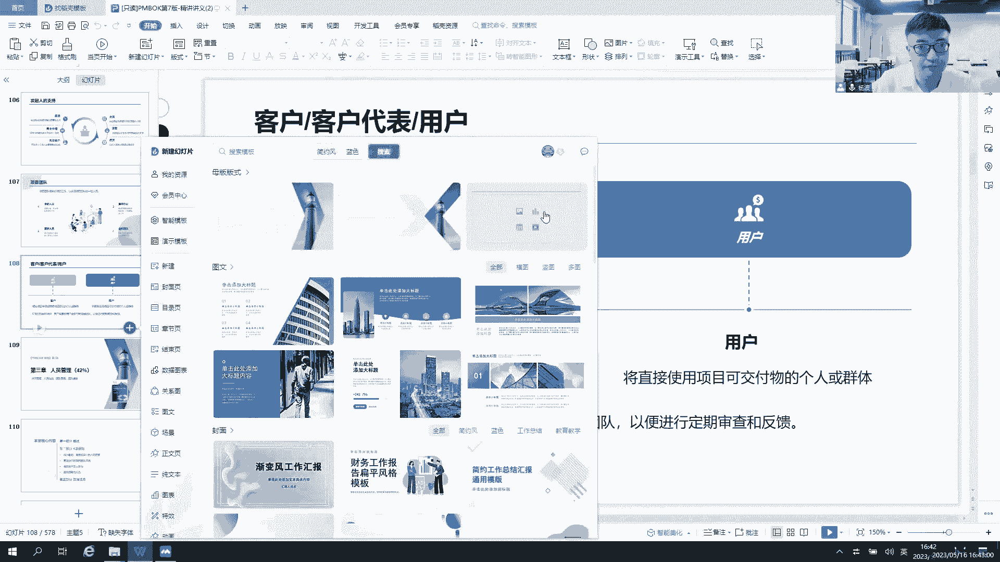

好就这个吧，在这一章里面我们怎么去总结呢，首先第一个我们搞清楚了什么是项目，什么是运营，对吧，搞清楚项目的三个特性，项目的独特性，项目的临时性，项目的鉴定明确性，以及我们什么是运营，运营的标准化。

持续性，标准化，还有重复性，好了，对于项目来说，我们是希望为企业创造价值，也就是说当前企业有了自己的一个组织战略，基于这个组织战略啊，我们只希望当前这个状态推动到未来的状态，因为通过这个战略啊。

要让存活起来，要让我的企业存活下来，所以我们要把这个企业，从当前状态推动到未来状态，这也是一个战略，那怎么推动啊，不是说靠人力推动啊，是靠项目来推动项目才能够产出可交付成果，才能够产出我们的服务往技术。

我们的成果，我们对这些服务产出，那这个项目只有一个吗，我们的项目有太多太多的项目，项目具有相关性的，我们把它纳入到项目集来管理，剩下的包括运维运营，我们都可以纳入到整个组合里面去管理，没问题吧。

好没问题，那么项目做完之后，是不是我们要把这个成果移交给运营，交给运营好了，运营怎么做交接给运营交换我们的交叉点啊，把我们的这个产品移交给运营，运营运营好了，引入期，成长期，成熟期。

还有呢我们的衰退期在这里面，在各个阶段啊，我们都有可能会产出一些新的项目，也就意味着在一个产品生命周期里面，我们可能会有若干个项目生命周期，这些项目有可能他们是纳入到一个项目集。

有可能是纳入到一个项目组合，在这里面来一同开展的是吧，那说到这个生命周期，有的玩了，首先第一个产品生命周期刚刚已经说了，接下来就是项目生命周期，在一个项目生命周期里面，我把它划分成了多个阶段。

每一个阶段后面都有一个阶段关口，等着我们进行检查的，怎么检查，拿着我的商业文件，商业论证，收益实现计划，项目章程，项目管理计划，来验证当前我的绩效，我的目标，我的需求是否有实现。

我的目标收益是否已经达到，是否可以进入下一个决策点，是否可以进入下一个阶段，还是说我整改之后再进入，或者说我直接取消这个项目都有可能啊，这是我们项目的阶段，如果在这个阶段里面涉及到了开发，开发生命周期。

第一个预测性的开发生命周期告诉我们，当前前期需求必须得明确，中途不会有大量的变更，我们用预测型啊，最后一次性的交付，第二个呢迭代和增量型，那么迭代加增量是啥意思呢，当前我们这个产品啊。

我们说最后我们产出是，但是我们的迭代周期会比较长，我们会重复的开展前期的设计设计开发测试，设计开发测试设计开发测试，一轮一轮的迭代，这个迭代周期会非常的长，好几个月，甚至一年。

我们的目的是为了去学习优化改进，调整调整我们的解决方案，优化解决方案我们不强调速度慢一点，慢慢来迭代，加增量增量交付，持续的增量交付，在上一个阶段基础之上增加功能优化性能，第三个呢适应性。

适应性也叫做敏捷哎，也叫做敏捷，在这个敏捷项目里面，我们主要是什么特征向的快速适应变化，两到四周就要交付出来一个产品，我们要快速的响应这个变化，这就是适应性非常的快啊，适应快到两周好。

这是我们的开发方法，在这里面，那么敏捷，我们会在后面会专门给他去解读，敏捷项目管理的内容，那么项目管理是不是有三条曲线，第一个曲线，项目生命周期风险很高，项目早期之后呢风险降低了。

项目早期变更的影响很小，随着时间的推移，后面变更影响非常大，所以我们应该第一个阶段划分第二个项目，相关方尽早地参与，那说到这个相关方，我们刚刚讲到了，有三类人，第一类人能够影响我们项目的。

第二类人是我项目影响的，第三类人自认为是项目影响的，这一帮人都是我的干系人，这些干系人我们要尽可能多的，尽可能广的去识别的，并且管理好，管理好他们的需求，管理好他们的期望，如果他们之间有冲突。

我们要去平衡，这样也实现他们对我们项目的一个支持，是这样吧，那么在项目早期我们做了哪些工作呢，项目早期有一个事情，它叫做需求的评估，是不是需求的评估，告诉我当前我的业务目标是什么，基于这个业务目标。

我们发起人来确定下一步的工作，做商业分析，商业分析首先会拿出我的商业论证，把这个目标抄过来，然后呢告诉我们当前有哪些备选的方案，基于这个备选方案，我们来做一个成本效益分析，来选出一个性价比最高的方案。

得出我们当前的目标收益，那你凭什么说能够赚出一个亿呢，于是乎我还需要写一个文件，什么文件，我的收益实现机械化，对它做一个补充说明，把这个目标超过来，告诉我们当前谁在什么时间用什么方法来测量。

并且确保这个目标，和我的战略目标是保持一致的，已形成我的收益实现计划，对我这个一个亿做一个解释和说明，当前面这些工作做完之后好了，如果说发起人你认为这个事情可行，那你就找公司高层去要人，要资源。

要钱要权利，然后呢，接下来我们要做一个事情，就是要去立项了，立项我们会写一个文件，叫做项目章程，这个项目章程的签发代表了项目正式启动，同时也代表着发起人，你把你手上的资源资金权利都交给我，项目经理的。

给我项目经理授权，让我带领团队去开展工作，以实现我的项目目标，唉这是我前期的一些逻辑，早期的一些分析在这里面好，接下来还知道作为一个项目经理来说，当我们到了一家企业里面去啊，我们要去关注一下。

有哪些因素会影响我们项目的开展，是不是第一个事业环境因素啊，还有呢我的组织过程，资产事业环境因素分为内部的，外部的，那不管是内部还是外部的，他们总是会影响我的项目，通常我们只能遵循。

因为他们会限制我的工作，而我的组织过程资产分为两份，第一部分是PO给我们定的过程政策和程序，第二部分是项目经理带领团队，我们一起去更新的组织知识库啊，经验库，数据库，教训库，什么配置库，文档库，各种库。

带领团队不断去更新，总结经验教训在这里面了，然后还强调了到了一家企业，我还要关注我们的组织结构，有可能第一个是我们的职能性的组织结构，这个时候我权力很小，我基本上说不出话，我只能找职能经理帮忙。

第二个呢是弱矩阵，若矩阵是能够帮助我们做一些跨项目沟通的，但是实际上我还是做不了主，依然是智能经理做主，我做不了主，第三到了平衡性的举证，平衡性举证意味着我有权利了，我可以做一部分的阻挠。

我们项目经理和职能经理，我们权力相当有冲突，我们达成一致协商就可以了，再进来是什么强矩阵，强举证我就非常强了，这个时候是不是应该听我的指示啊，职能经理，你不要打扰我的团队啊，再往上呢。

再往上就是项目型的组织结构，项目导向性，那我就是非常非常的强势了，完全由我自己一个人独立承担工作的工作，但是大家有可能会什么忧心忡忡，因为万一没有下一个项目怎么办呢，因为我的上头是谁呢。

我的上头有可能就是我的PO这个层面了，那说到这个PO是他是他的职责是什么，对上负责组织战略，对下负责跨项目的协调沟通，还有呢它帮助我们去定义我们的模板，定义我们当前的项目管理的方法，定政策，定流程。

定义方法，给我们提供支持，再往上就是他还有权利要求我们去用，再往上他直接下发指令管理项目，再往上走到组织战略级层面，但对于敏捷来说呢，就是价值交付办公室，或者叫做敏捷能力中心啊，敏捷卓越中心。

这是我们pm那些概念在这里面好了，关于我们整个这个第二章的一些核心内容啊，其实也就这么多，大家有没有发现都讲的这些概念，是不是啊，什么是项目，什么项目管理，什么是目标，什么是smart原则。

什么是事业环境事务组织过程资产，什么是什么组织结构，PMO什么，什么是项目商业论证，什么是收益实现计划。

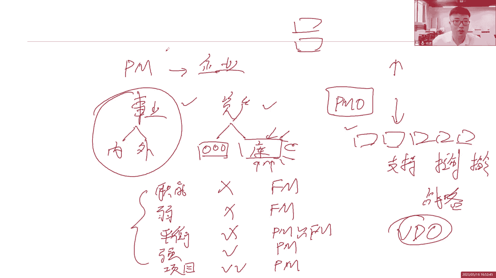

全都是概念，没错，我们讲的都是概念，那么基于这些概念之后，接下来的内容大家就注意了，跟考试是密切息息相关的，而且重点内容都在这里，我们说考试它分为三个领域是吧，第一个是人怎么管。

第二是我们的工作怎么去管过程，第三个就是我们的商业分析，每个领域它的占比是不一样的，那么基于下面的后面的工作，大家就要认真去结合着，我们前面所说的一些基本概念，以及我们项目管理所需推崇的12项原则。

和我们的八个绩效预来，一起来关注后面的工作该怎么去开展，那是接下来我们后面的课程，好感谢各位同学们的一个聆听，我们第二章的内容，后面接下来会马上进入到第三章的一个学习。

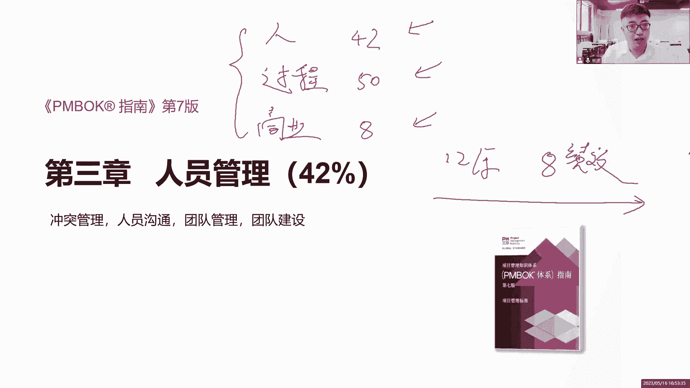

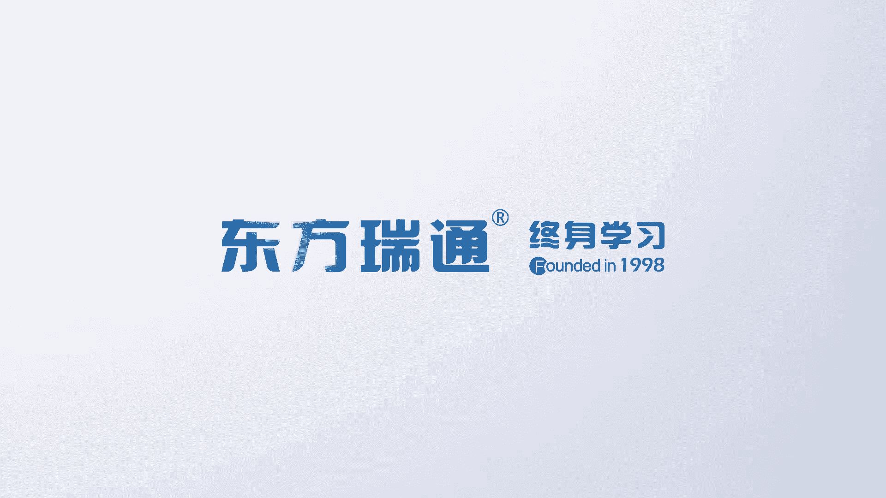