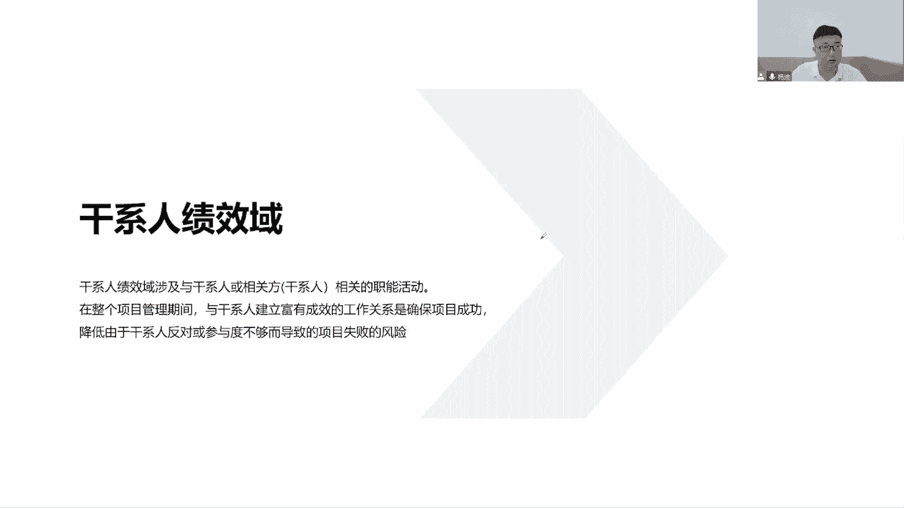
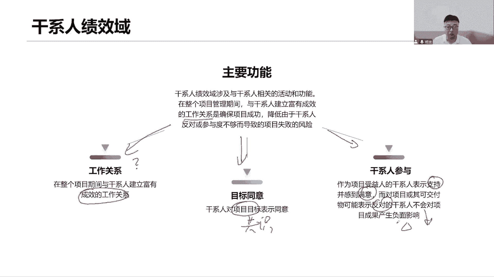
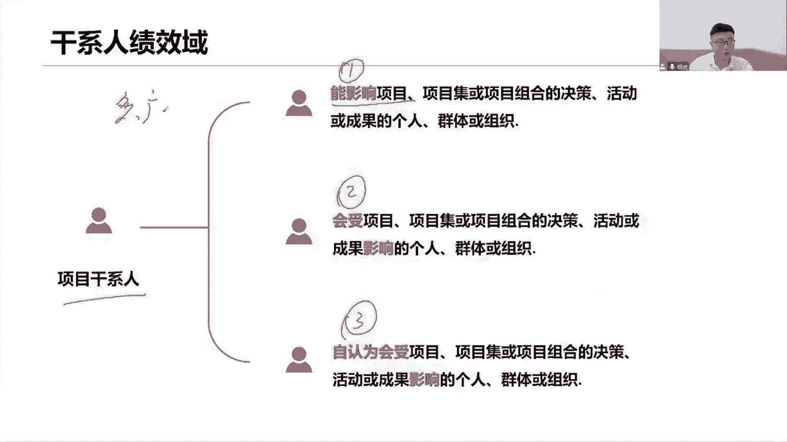
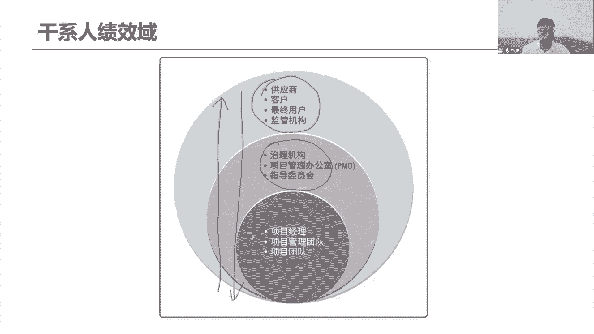
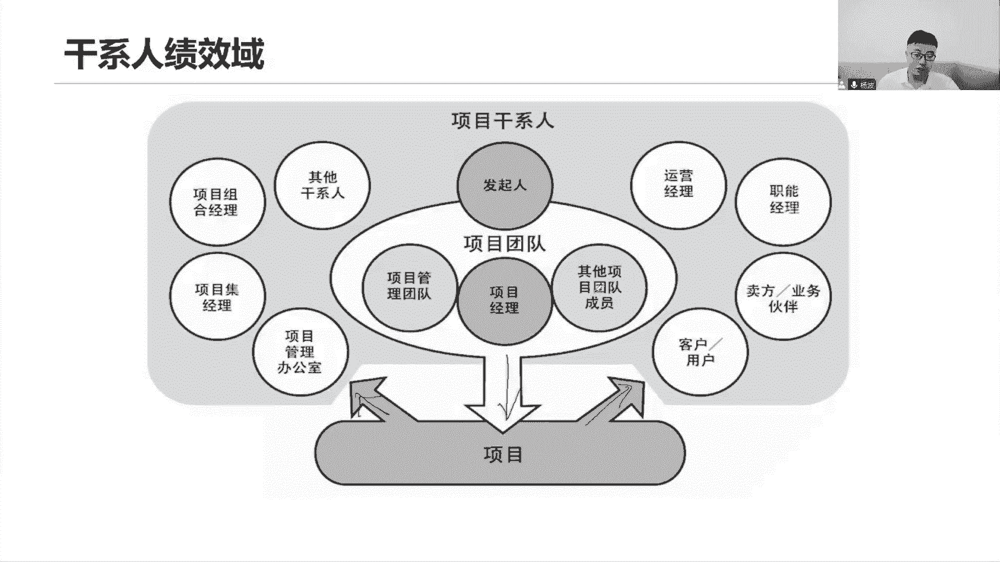
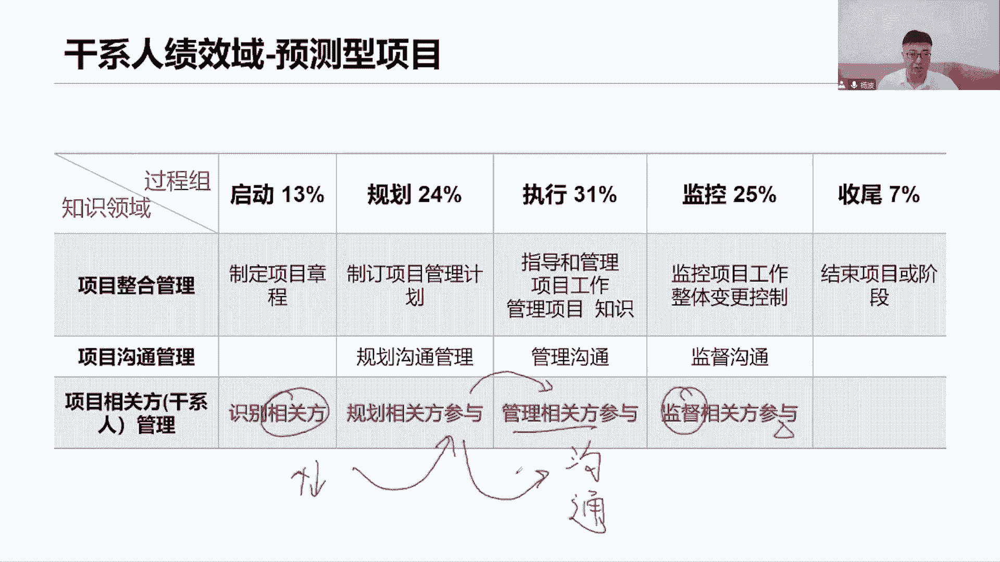
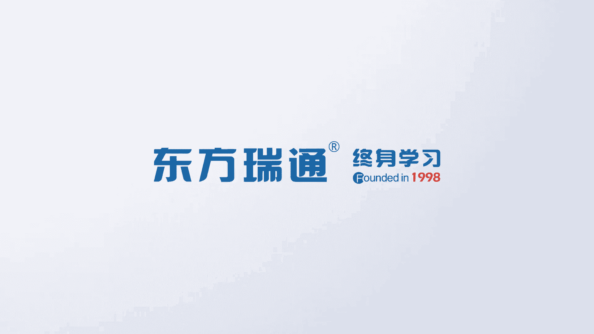

# 全新录制PMP项目管理零基础一次顺利拿到PMP证书 - P9：PMP精讲课干系人示例2 - 北京东方瑞通 - BV1qN4y1h7Ja

有效的引导干系人参与，那么结果如何，如何评判这个结果，在整个项目期间，我们都要去看它的工作，因为一直以来，我们都是希望你能够和干性的开展，有效的有效的沟通协作，在这个工作建立好这个工作关系之后。

我们如何去把控好当前项目的节奏，如何去看我们的结果，如何去评估当前干性的对我们项目的态度，是支持还是反对，如果说是反对，我希望你们能够降低对我项目的影响，对我项目产生什么影响，一些威胁的影响。

要降低这些影响，那肯定要提高能够支持我的一些印象，把握住这个机会啊，拓展这个机会啊，所以我说干线机效率，重点关注干系人对我项目的态度，以及干系人如何去开展有效的管理。

沟通好干性的计算运面，主要第一个，我们说一定要建立一个良好的工作关系，看这里提到了，那既然说工作关系，我们就单独拿出来说一说，这个工作关系要怎么去建立，如何建立一个有效的工作关系，那工作关系指的是哪些。

是不是我们的人际关系技能，以及在工作当中如何去帮助我们去推动工作，支持我的工作，那既然说我们要建立关系，意味着当前我们要对目标达成共识，对目标达成共识，我要获得各国干性的你们的认同。

承诺就按照这个共同的目标往前推进，工作达成共识，然后呢希望各位感谢你们对我的工作表示支持，表示满意，就是指当前我最了解你们的需求和期望，按照你们的需求，我们推进这个计划，把这个计划能够有效的推进起来。

就可以满足你们的需求，符合你们的期望好，而且对我们的项目或者可交付成果表示反对，这些干系人他们不会对我们产生影响，就是大家注意一点啊，我们做项目管理，不可能满足所有感性人的需求和期望，这个做不到。

很多时候，我们只能满足大多数人干性的需求和器官，那这个时候如果还是有一些对我们表示，持反对意见的，那这个时候希望他们能够我们通过自己的努力，降低当前他们对我们项目的一些影响，尤其是一些负面的影响。

好就这个来看一个关于肝细的肝细胞，肝细胞拿什么样的肝细胞，它分为三类，第一个我们说能够影响项目的人，这次干线，第二个呢会受项目影响，第三个是自认为受项目影响，这种前面都介绍过的哦。

前面我们在讲项目管理的基础的时候，基本知识基础概念讲到了关于该系三类人，他们都可以称之为我们干系，所以我们要尽可能多尽可能广的去识别。

结构化的识别好，然后呢希望我们去扩大自己的影响力，你刚刚讲的要领导力啊，充分发挥着我们自身的领导力，影响他们积极主动的推动工作，所以干性能我们内部的干系人，要我们的高层。

要以及我们组织企业外部的一些干系人，其实都希望他们能够积极地参与到项目里面，有效参与，我要通过我自己的影响力，领导力，让你们来参加组织，大家一起来积极的参加，参加之后呢，你们得给我一些什么积极的反馈。

支持我的项目。

这就是干性能的影响，它的一个图内部的外部热战都得去影响，所以我说干性能啊，就是希望他们能够，所以说这帮人积极地参与到我的项目里面，来，让你们了解我们的项目是可以满足。

可以反馈于你们所有人的利益和和期望的。

让你们能够支持我的工作，那么我们来看，作为一个以前传统的预测性的项目来说，我们的肝性能怎么管呢，他说通过四个维度，通过四个过程来管，第一个，首先咱要把这个人找到识别出来，并且对他们做一系列分析。

分析他们的需求和利益，分析他们的一些什么态度，还有来分析我们的这个什么权利啊，还有什么资格，以及他的一些对我们项目的影响，好做好，做到这里去分析分析之后，才能知道当前怎么去对我们的干系人。

做一个排序和分类，因为要知道这么多这么多的干系人怎么去管好，他们如何管，是不是所有人都得重点管，每个人都得制定一个管理策略，那不一样，那肯定不行，那这样太累了，我们就要对每一类人，不是每一个是每一类的。

我们要制定一个参与的策略，如何参与啊，如何叫做有效参与，这个参与就是有可能比如说开个什么会议，是开什么会呢，是需要我每天来一起开早会，还是说每周五开个周会，还是说双周会，还是月都会，还是各种什么评审会。

或者说参加什么团建吗，有哪些团队需要他们来参与，或者有哪些其他的活动，工作相关的一些其他活动，这就是让他们参与，那么就要形成一个参与计划，这个参与计划一定是取决于当前，我们对这些干系的相关方。

他们的一个分类和评估和排序，那既然有了这个参与计划之后，我们就可以按照计划去管理好我们的干相关方，那么怎么管理啊，其实大多数情况下，我们都在做一个视频，和我们的代行人做好沟通，传递信息。

然后呢在整个项目生命周期里面，不断的去监督相关方，他们的参与程度有没有发生变化，因为啊在这个相关方，我们说在参与项目的过程当中，他们的这个权利利益或者影响力，以及他们的需求期望态度是有可能发生变化的。

那这个变化的过程中，我们要重新去考虑对他们做一个分组和排序，重新去制定我们的参与计划，按照新的参与计划去开展沟通，目的是希望我们在整个项目生命周期里面，持续的保持一个较高的参与水平。

持续的让我们的干线能够支持我的工作，持续的让他们能够充分的发挥在领导力的作用，来引导我们的团队，支持我的团队。

