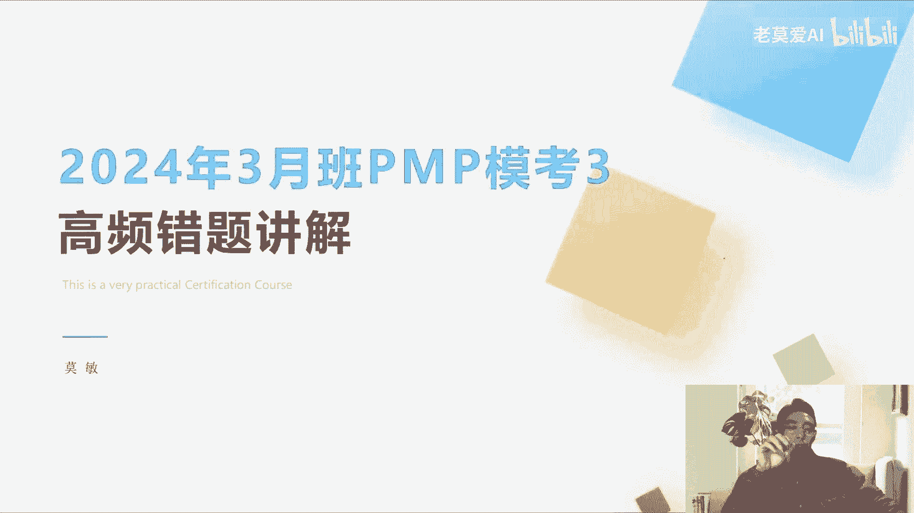
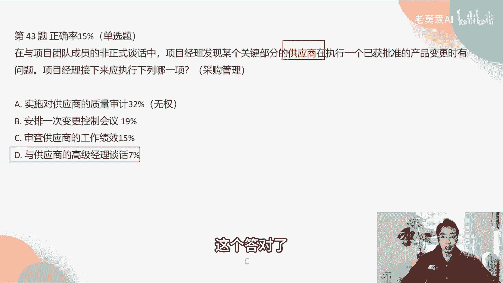
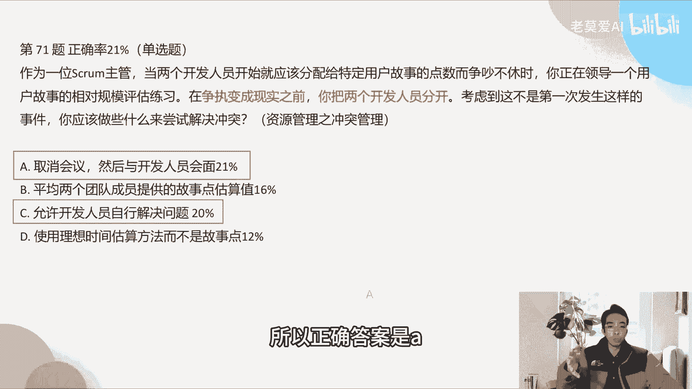
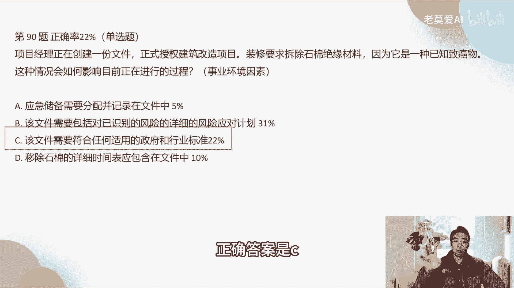
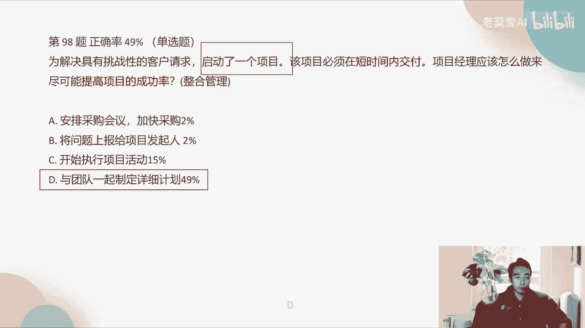
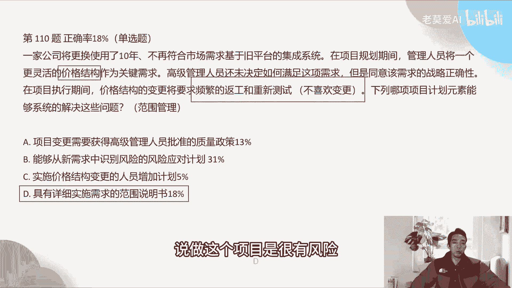
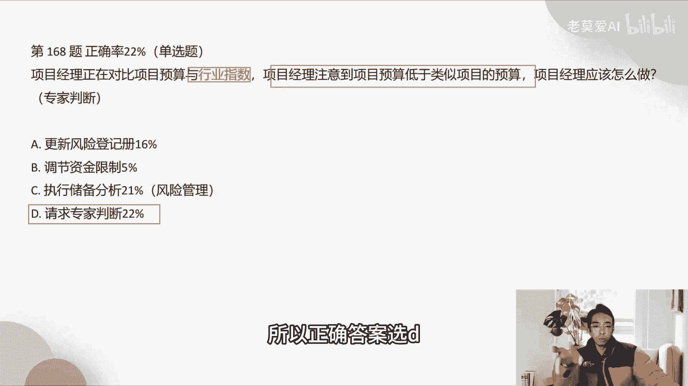
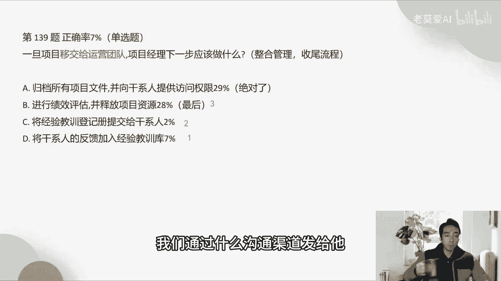

# 全网最好最新的PMP模拟考试题3解析上篇 - P1 - 老莫爱AI - BV1px421f7zS

好时间来到了晚上八点啊，现在开始好解题，重点其实还是一个你要找到出题人的出题习惯，我发现很多同学都是在看这个选项的时候，他说这个选项为什么选错了，我每次一看选项的时候，我发现这个选项其实没有用到。

项目管理知识点啊，比如说开会讨论啊，比如说他要我去上报，我就上报，这种是没有用到任何的项目管理的技能，所以这种选项一般选就会错了啊，所以这个选项里面，你要你要你要看到底考什么东西啊，比如说考风险管理的。

他肯定不会，风险管理价并不管理一起考，那么考风险管理，你抓住了关键字是风险管理，那么变更管理的那个题一定是错的，对不对啊，这样子讲，因为出考题啊，我我之前也跟出题组交流。

我自己也本身跟出题组的关系也不好，他们那个老师他出题的习惯是什么，它是反向推来的，跟我们不一样，他是反向推，反向推是怎么推啊，他是先找上找，找到一个知识点，比如说我找到一个变更管理。

比如说这个老师是专门出变更管理的题目的，就负责那个题库里面变更管理的题目的时候，老师是先从这个变更管理的知识点里面去找啊，哪些点它是变更管理，再去思考怎么样的场景，把这个场景的框架搭出来。

然后让大家回答这个是变更管理的12345，所以它是反着来，所以我们做题的思路也是这样啊，一个题目，你要看到老师到底是想考虑跟还是想考风险，要反着来对。

跟上老师的思路也好，同时我这个就不说了，跟上个一样的冲刺材料，大家一定要看完这个，特别是适应型解题思路和预测型的40个套路，大家要看这两个东西，跟大家说一下这两个东西。

这两个东西大家一定要看啊，好啊，宠粉题还是猫团团，我看猫团团今天来猫团团是不是喵爷爷哦，呦猫团团来了啊，他在群里跟我说，他说明天讲题里面可以包含四十三六十八的好，那我就把你的题目放在第一哈。

可如果群里面也有同学让我去讲哪道题目的话，我也会你把题号给我，我会给你去讲啊，可第43题啊，43题，在与项目团队成员的非正式谈话中，项目经理发现某个关键部分的供应商。

在执行一个已获批准的产品变更时有问题，那项目经理接下来应该执行下列哪一项，这个属于什么问题，你看这个关键字有什么，供应商，供应商自然而然的会第几章会考到供应商，采购管理，对不对，采购管理，那么这些东西。

答案里面肯定就是跟采购管理相关的，我们才会选对吧，那么跟采购相关的有哪些啊，第一个是A，第二个是CAC是跟采购管理相关的，第一跟采购管理，他说虽然与供应商的高级经理谈话，但是这个谈话他并没有用到。

项目管理的任何技能，你出现问题，我就谈话，那四个人都会做这种事情，所以这个选项第一肯定不用选，就是ABAC，那么AC是什么意思，A是实施对供应商的质量审计啊，质量审计是什么。

请问质量审计审计的是什么过程，我们和供应商其实是不同的公司，其实你没有权利直接去审查人家过程，做的对不对，如果人家没有去，请你说你帮我看一下我的过程，你是没有权利去公司看他们的过程的。

你只能看他们的结果，他们给你的东西符不符合质量标准，这就好比什么好比我们是一个做手机的，比如说做手机啊，手机的摄像头很多都是索尼提供的，那你看到这个手机的摄像头有问题，你不可能说哎呀。

索尼我们去你的公司去看一下，你们做手机的这个过程是怎么样的，为什么会出现问题，做的好不好对吧，我们要查找根本原因，你是没有权利的，你是手机商，它是公共供应商，那么你能做的是什么，你出的这个手机的摄像头。

它不符合我的质量标准，我不买就行了，我不能够去审计你的过程，因为我没有权利，所以A是错的，只有审查供应商的工作绩效，审查工作绩效是对的，因为审查工作绩效审查的是结果啊，绩效就是他做出来的结果啊。

所以正确答案是C啊，这个答对的好。

第68题，随着项目的进展，偏差分析表明，与绩效测量基准相比，实际的项目绩效会恶化，因此对成本进度和范围的估算不再有效，团队确定大量的新功能变更，请求和缺陷修复是差异背后的主要原因。

那么项目经理要确保在实际进展的基础上，对剩余的对项目的剩余工作进行进一步的估算，最好的行动方案是什么，其实这个是考的什么东西，考的是生命周期的选择，你看为什么是考生命周期的选择，他想最好的行动方案。

对不对，先放一下，最好的行动方案其实就是给给出几个生命周期，生命周期我们在选择生命周期的时候要看什么，他的需求变动多不多，如果需求变动非常频繁，我们更加使用这种敏捷型的这个生命周期，来去适应，对不对。

我们可以看到啊，关键字里面团队确定有大量的新功能变更，请求和缺陷修复，那么如果有很多这样的东西出现，说明什么，它的变更非常频繁，应为了印度啊，为了应对变更如此频繁的这样一个场景。

我们倾向于使用敏捷的方式是吧，所以正确答案SA，将产品开发方法转化为，通过短迭代来适应和两进度，这个是典型的使用敏捷的方法，对，而不是对启用自上而下估算成本和进度计划，估算技术以及三点估算范围。

这三个东西，它跟生命周期选择是没有任何关系，我们考的并不是估算它，整个题目里面没有让你说你要估算的更准确，如果他说估算人需要更准确，我们可以选择C，他是说最好的行动方案。

所以啊选择我们的A作为正确答案好。

第71题，作为一位矿主管，当两个开发人员开始就应该分配给特定用户，故事的点数而争吵不休，时好，你正在领导一个用户故事的相对规模评估练习，在增值变成现实之前，你把两个开发人员分开。

考虑到这不是第一次发生这样的事，你应该做什么尝试解决，说明什么，这两个人的矛盾他以前怎么样自行解决，但是没有解决过，他俩的矛盾已经是不可调和啊，而且每一次都在争，所以C是不对的。

允许开发人员自行解决问题是不，如果他是第一次发生这种事情，那么选C是对的，如果他不是第一次发现发生这种问题，那么现在要做的方法其实是回避，就先取消会议，然后单独与他们进行界面去沟通这个问题啊。

所以正确答案是A。

OK好，第90题，项目经理正在创建一份文件，正式授权建筑改造项目，装修要求拆除10年绝缘体绝缘材料，因为它是一种已知致癌物，这种情况会如何影响目前正在进行的过程，这个题目其实做错。

很多时候是因为阅读理解，就是没有真正理解题目的意思啊，创建一份文件，正式授权建筑改造项目，那么这个文件其实是什么，就是正式授权书，那么这个正式授权书它是在项目的哪个阶段，其实是启动阶段。

你想你要去授权去做这个项目，那说明这个项目怎么样还没有开始，所以它是一个启动过程当中的，或者是说它是概念阶段，就是在启动那一块，或者比启动更加全面的阶段，所以在这个阶段里面，我们考虑的是什么。

职业环境因素，就是对项目会产生影响的东东啊，所以事业环境因素是在，该文件需要符合任何适用政府和行业标准，这个正式授权里面，这个授权的需要符合法法律法规或者行业标准，所以是C那很多同学说老师为什么B不对。

该文件需要包含对已识别的风险的，详细的风险应对计划，请问风险应对计划是什么时候开始，是启动阶段过后，我们在做计划的时候才有风险计划，对不对，风险计划做完之后才会才会有风险应对计划。

那他的这个计划已经是很后面的，但是现在我们还是在正式授权，这个授权文件当中，说明是很早，远远没有达到D的那一步啊，所以D直接排除，正确答案是C好。

第98题，为解决具有挑战性的客户请求，启动了一个项目，该项目必须在短时间内交付，项目经理应该怎么做，来尽可能的提高项目的成功率，那么这里面他其实考的是什么，考的是第四章老项目的整合管理。

整合管理考的是为什么在考的是整合管理呢，因为这个里面他明显给出了一个信号，是在项目启动阶段启动了一个项目，说明这个场景其实是在启动阶段啊，那么在启动阶段我们怎么样做，可以提高项目的成功率。

接下来我们如果在短时间内交付的话，应该制定详细的计划去做OK了，很多时候我们选C选C，也有不少同学说开始执行项目活动，开始执行项目活动，这个事情其实没有用到任何的怎么样，项目管理能力和技术，对不对。

就是执行嘛，开始执行就这个事情，那执行第一个是没有用到任何的，比第二个是还早，你至少要先定计划，有了好计划以后，我们执行是执行什么东西，是执行计划，你的东西首先要有计划才有执行，所以我们有一句话。

你们可以这样记一下，做这种题目的时候，我们要想到一句话，就是项目做计划你就成功了一半啊，不做计划就大概率会失败，做计划就成功一半是这个，所以你看PMBOK6的时候，项目管理的五大过程组的时候。

它是有49个子过程，49个子过程里面计划占了11个子过程，也就是说计划的比比重是啊在里面是最多的好。

第110题，一家公司使用了10年，不再符合市场需求，基于旧平台的集成系统，在项目规划期间，管理人员将一个更灵活的价格结构，作为关键需求，高级人员还未决定如何满足这样的需求，但是同意该需求的战略正确性。

在项目执行期间，价格结构的变更将要求频繁的返工和重新测试，下列哪项项目计划元素，能够系统地解决这些问题，OK这个里面大家陷入了一个误区，因为看到一个更灵活的价格结构，就认为这是一个什么问题。

并认为它是一个变更啊，他认为一个价格结构就是作为一个顶，其实他这个里面很简单，它其实考的是一个范围管理，他想想的是什么东西，想的是一个更灵活的价格结构，它其实不是在说价格这件事情。

你可以把它理解为管理人员在项目规划期间，管理人员提出了一个需求啊，但是还没有没有说怎么样去满足这个需求，但是这个需求又很重要，在项目执行期间呢，你去做这个需求，你不要把它看成什么需求，你就做这个需求。

你要频繁的去返工和重新测试，那说明什么，说明这个需求很复杂啊，而且从他的这个场景描述来看，他其实不喜欢怎么样不喜欢变更，因为他说频繁的返工和重新测试，说明做这个需求的代价会很高。

所以我们怎么样去防止这个问题，怎么样降低他做这个需求的代价啊，范围说明书啊，你把需求怎么样拆的更细，其实在说这个事情，需求一旦拆的越细越详细，那么它怎么样不解决问题，所以正确答案是D啊。

而不是说能够从新需求中识别风险的风险，应对计划，很多人看到这个新需求，为什么要要做这个风险应对计划了，因为更灵活的价格，结果他陷入到价格结构这个词里面啊，所以他认为这个是风险啊。

其实你就把它当成普通的一个需求就好了，并不是考你的风险，所以你说识别风险应对计划，这个是不对的，这里面只字未提，说做这个项目是很有风险的。

对不对，那么150题，你负责管理某新品开发项目，高级管理层已经签发项目章程，批准项目计划，项目进度和预算都十分紧张，质量要求很高，在项目执行阶段，项目干系人一直通过沟通计划所规定的方法，了解项目进展啊。

项目的范围进度，成本和质量都符合项目计划的要求，突然你得知整个项目可能被取消，因为开发的产品完全无法接受，出现这种原因是什么，你看项目的范围，进度成本都符合，这个是关键字，都符合说明什么。

一基准完全满足，说明项目的整个绩效是没有任何问题的，那项目的绩效如果没有问题，会问题出现在哪里，那么这里有个解题的定式，如果项目整个做出来没问题，最后项目失败了，一定是干性，就是人的问题。

所以这个题目其实考的是什么干系人管理，所以干系人管理里面，我们其实正确答案就是，A没有识别出某个干系人啊，就这么简单，OK那么C是高级管理层不再支持该项目，其实这个地方你说C也是对的。

对A也是有可能的啊，C也有可能，但是呢A的可能性肯定是更优的，为什么，因为他并没有说什么高级管理层的事情，你怎么知道一定是高级管理层，你再支持这项，在项目的这个里面，它并没有出现任何的关于这个蛛丝马迹。

但是我们知道肯定是干性人出了问题，所以我们在A这个选项上比C这个选项要更好，OK这没有用到项目的知识，对不对对，也是这样的啊，他没有用到项目的管理知识啊，也没有用到，你看所有的项目里面。

我们正确的选项都是怎么样识别干系人啊，这个就是什么项目管理的知识，识别干系人，分析干系人，更新关系人手册，这个都是专业的词汇啊，所以C它其实没有用到这样的会啊，所以出题人他一般是反着这道题。

我要出刚性人，比如说我要出十道干系人的题目，我就比如说识别干系人，我出五道分析干系人，我出两刀，是这样的一个东西，他先把这个题目建立在这里，再去思考，说这题干我们怎么样去出这个场景。

出完题干以后才把另外三个可能的选项，它把它放上去啊，所以他的思思维逻辑是这样的啊，它是倒着来的，所以我们在思考的时候，一定也要说循着他的思路来去看啊。

OKD啊，我觉得DAVID说的很好，第168题，项目经理正在对比项目预算与行业指数，项目经理注意到项目预算低于类似项目的预算，应该怎么做，这个里面其实是什么，因为我们的关键字里面有啊行业指数。

行业指数一般是指行业内的专家啊，所以这个题考的是啊专家判断题的作用，专家判断用在什么时候啊，我们可以用在估算的这个上面啊，或者是说你当项目这些问题啊，需要别的领域的人进入的时候。

你们会用到的一个东西叫专家判断，那么这个里面其实就是估算的事情，就是估算低于同行的估算的时候啊，这个时候你不要去请专家进行估算，OK好吧，这个里面所以我们是估算的专家判断的技术啊，这考的就是这个事情。

所以我们请求专家判断，就是这个里面很多人说C啊，有很多人选C说执行储备分析，执行储备分析是什么意思啊，储备分析我们一般是分析风险，风险管理，但是这个题目里面考的其实是估算的事情，还没有涉及到风险。

因为储备风险是风险，风险是什么，当我发现这个风险很大，我们要看风险应对计划里面说，假如这个风险要变成问题的时候，我们就执行储备啊，把钱拿出来用啊，这个叫执行储备分析啊，是这样的一个事情。

但是从这个题干里面看不出来任何风险的事情，你的项目预算低于低于类似项目的预算，就一定有风险吗，不一定啊，所以正确答案选D。

那么就进入到我们的常规错题啊，刚才重复题已经做完了。

常规错题里面，我们首先从正确率7%的开始啊，一旦项目移交给运营团队，项目经理下一步应该做什么事情，这个里面其实第四章啊，你们看PMBOK6的第四章收尾流程就会讲，那么收尾流程里面去讲的什么东西。

我们先看A啊，归档所有项目文件，并向干系人提供访问权限，这个题目太绝对了，这个答案太绝对了，你归纳所有人项目文件，这种所有的项目文件，都要向干系人提供访问权限吗，因为你知道别人有，我也不敢写。

你向外部干系人提供访问权限，看项目文件，比如说你向客户提供访问权限，那你不疯了，对不对，那我们项目内部的事情，所以这个A选项它是绝对的，就很绝对，所以不要选，就直接pass b选项。

进行绩效分析并示范项目资源，跟大家说的是，示范项目资源一定是最后在收尾流程里面，一定要放在最后不到最后你能不要释放出来，因为你还要有人去做收尾的事情啊，所以人事发是最后一个啊，这个大家要注意了。

所以正确答案是这个第一啊，将干系人的反馈加入经验教训库，接下来应该做事情啊，反馈这个经验教训库完了之后，再怎么样将经验教训登记册提供给该系统啊，在释放资源啊，所以正确答案正确答案的它的步骤应该是什么。

C1第一其实是第一步，第二步才是它，最后一步是它应该是这个这个选项啊，应该是这样的，所以大家要注意一个顺序好，第167，第176题都需要经验教训库啊，提交给干系人是对的。

如果是说提交给所有干系人是不对的，经验教训部有部分干系人啊，你可以提交给他，但是也要看权限啊，只要看权限在哪里去看待权限啊，在沟通管理里面啊，不是是从该系人登记册里面去看待权限。

是沟通管理里面去看他有没有这个权限啊。

