# 全网最好最新的PMP模拟考试题3解析下篇 - P1 - 老莫爱AI - BV18x421f7gU

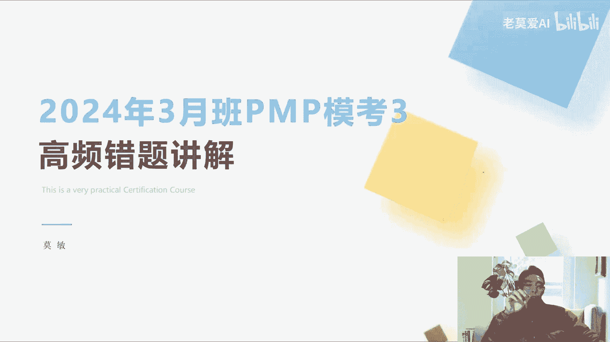

过了十个人，那我们其实是算什么团队扩充了，因为我们资源更多了啊，这个是人力外包的事情，所以这个题目是有些超纲的，这个是人力，这个其实是讲的是人力外包，所以这个正确答案是选这个团队过程啊。

并不是固定价格增量，固定价格增量，也就是说我给100万给到动画做动，做宣传片的公司，你你可能做你赚不到100万，也不管我的事情，反正我只要给100万给你就行，这个叫固定价格增长，整理好压实主题。

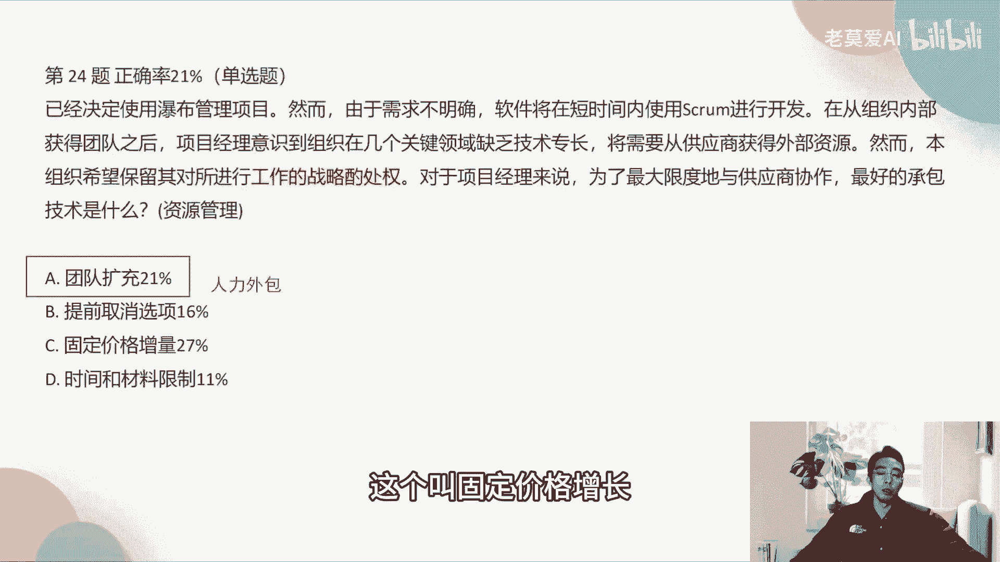

一位项目经理被分配到一个大型的银行，公司的敏捷软件开发项目，在项目刚刚开始的时候，项目经理已经了解了一些新的黑客技术，黑客战术，这些战术对于项目的合法合规性，构成了潜在的威胁，项目经理应该做什么。

潜在的威胁，只要看到威胁两个字啊，我们就认为它是一个风险管理啊，因为只有威胁风险管理会出现什么威胁机会，对不对，好，那我们就已经知道，其实这个题目要考的是风险管，那么风险管理里面是考什么估计啊。

第一个是审查项目回归，审查回顾期间的风险，项目回顾期间，回顾期间是我们的回忆会，回顾会议这个题目里面并没有提到，回顾会议有哪些分析，那我们来看一下A啊，提交变更请求，已更新这个风险管理计划。

我们只要看到更新风险管理计划，我们就觉得这个题目是很坑的，他如果是说风险管理计划是什么，是风险的级别啊，风险定义什么叫风险，我们的风险高中低级别是管理计划，都是一个很空的东西。

变更请求是不会去更新这些大而空的东西，它一般是更新这些很实的东西，而且变更更变更请求一般都是不是去应对风险，它其实是应对问题的，因为你这个东西已经影响到三大基准，这是个问题，已经不是个风险啊。

所以C是直接被排除，可以制定累计流程图，跟前面一毛钱关系，所以正确答案是B啊，分析不合规的后果，不合规的后果的分析其实是做了定性风险风险，所以这个题目考的是什么，风险分析里面第一个是识别风险。

第二个是什么定性风险分析和定量风险分析，第三个是什么，分析完以后进行风险的应对，就是这样的啊。

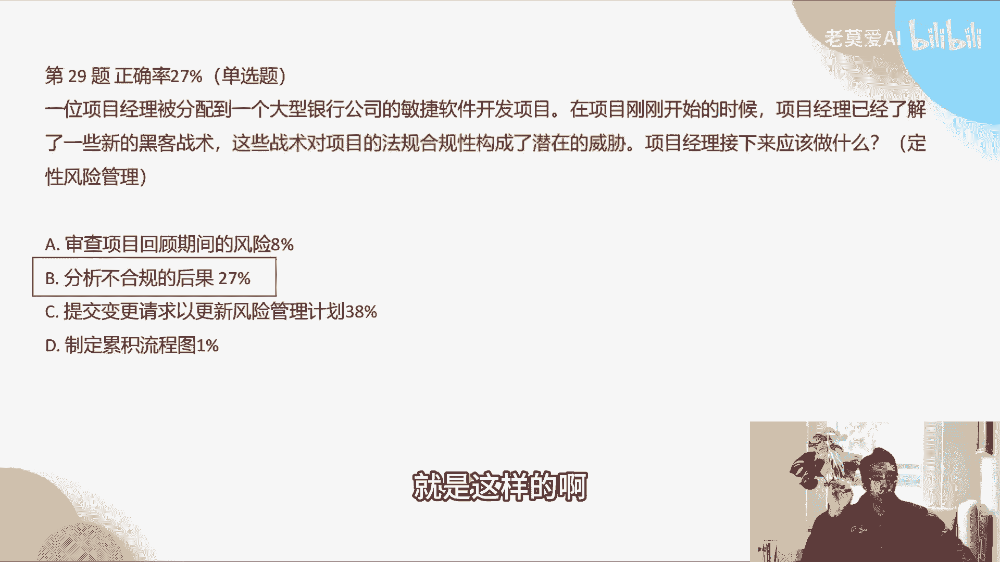

所以正确答案是B，第30题，传统管理的项目使用com来开发项目，可交付成果，敏捷发布规划，要求将最近完成的MVP部署到生产中，然而质量保证QA部门拒绝了MVP，声称部门的政策和程序没有处理。

中期可交付成果的实施，将问题记录在障碍版之后，项目经理应该接下来做什么，这个里面考的是什么敏捷的一些变故，你看他以前使用这个传统的项目，使用com，就说明他其实是一个从传统转向敏捷的。

这样一个转型的一个过程，可那么转型的过程他拒绝了，拒绝了MVP啊，拒绝了这个事情说明什么，说明我们其实要借助其他的力量啊，我们将这个问题记录起来之后，我们发现质量保证的问题。

这个部门的问题我们其实是怎么样解决不了，解决不了，所以这个时候我们应该去请求发起人帮助，去获得必要的批准，一旦会涉及到说其他部门的人对我们有阻碍，这个时候我们就应该怎么样，怎就应该去找到我们的发起人。

这个时候就应该是发起人的事情，因为这个我们搞不了，因为项目经理他是属于执行产市场，所以提交变更请求，已更新更新这个结果啊，提交变更请求并不会解决这个问题啊，如果这个里面说质量部门拒绝了什么东西。

是因为你有一个范围没有做啊，比如说有一个需求没有做，这个时候我们会要提变更需求，变更请求，比如说有一个他觉得有一个需求没有做，你做完这个需求，我才能让你通过，那这个时候其实是一个范围变更。

所以才要提变更请求，但是他直接拒绝，他说程序里面没有中期可交付的事实啊，他并没有说这是一个变更的问题啊，所以跟变更没什么关系，所以我们就直接发起必要的批准啊，如果答案有培训质量保证部门帮助他们转型的。

可以去选啊，这个其实也不好选，为什么，因为其实你还不知道质量保障部门，他这个东西它有没有过这样的培训的经历啊，你可以去分析说，我们去跟质量保障部门一起，去分析后后面的这个问题，假如题干当中已经给出了。

说我们传统的使用com来交付开发项目，可交付成果，然而质量保证部门之前没有接触过敏捷转型，或者他们没有接受这样的培训，那么我们在这个选项里面，如果有你刚才单位说的有培训质量保证部门，帮助他们敏捷转型。

这种培训，题干当中一定要提到，说他们没有类似的一些经验。

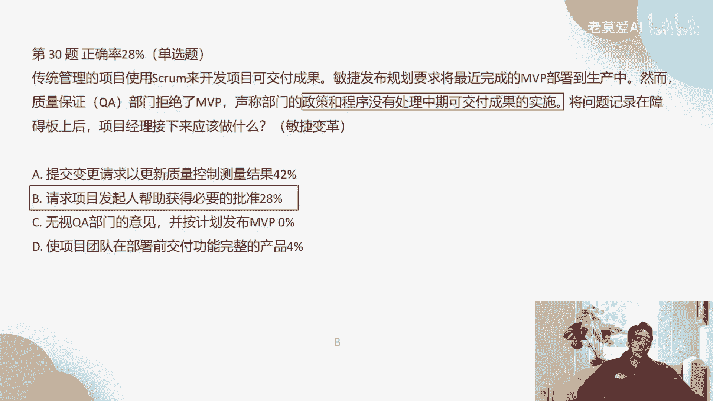

这个时候可以可以可以给他们培训，第35题项目质量项目，第35题，项目负责人反复抱怨称，开发团队的开发的功能似乎与原始设计不一致，什么做法有助于解决这个问题，对吧好，OK那这个地方是什么问题啊。

开发的功能与原始的这个设计不一致，那么这个题目考的是什么，回顾会议，为什么考虑回顾会议功能与设置不一致，它通常体现在结果还是过程，它通常是啊过程出了问题，原始设计你可以想象啊。

他们提出来一个说我要做一个杯子，我这个杯子是这样设计，你最后出来给我的是一个白色的杯子，不一致，通常不是在结果的问题上，通常是过程的问题上，中间到底出了什么过程，这个杯子没有上漆，变成了白色。

所以这个问题考的是啊，回顾会议，回顾会议他们应该是什么，跟回顾会议有关的，A肯定不是对吧，一回是回顾会议中安排时间，讨论所有的纠正措施，要求项目负责人参加会议，这个D才是对的啊，让项目经理。

那如果是说A这个东西参加下一次迭代，就会以此了解产品的开发状态，这个就算他了解开发状态，其实怎么样也解决不了问题对吧，而且了解产品的开发状态，这个东西是什么，这个也是一个过程，产品的开发状态。

比如说开发中进行中还是什么，它是一个过程过程的问题，我们通通要丢到什么地方，丢到我们的这个会啊，所以还是不会有问题，项目负责人会等同于产品负责人，这是不是一个点啊，项目负责人不等同于产品负责。

这个也是一个点啊，因为它只是项目经理去跑去抱怨，没没有产品经理负责人从事，等到回顾会是不是太晚了啊，如果回不会，你觉得太晚了，那么我们可以从哪里去看，如果选项当中有啊，我们在账户中提出来这个问题。

这个可以，那我们比如说一选项，说账户中我们提出来这个问题，那就可以，因为站会它是很及时的。

但是这里面啊没有站会好，第56题，用领导啊，你的你领导的两个独立的团队，在同一个项目上工作，可交付成果的性质要求一个团队采用预测法，另一个团队使用，由于两个团队之间的依赖性和放团队输出，可变形。

预测团队需要用尽可能短的反馈，来确定他们对com活动的理解，你的最佳方案是什么，其实这个题面考虑考的是什么，就是你刚才说的及时反馈，那么及时反馈最可能短，所以这个里面是一啊尽可能短的房子。

让预测团队参加每日换会，这个是对的啊，好很多同学选要求团队使用信息发射源，信息发射源是一个很好的东西，但是信息发射源不会带来反馈循环啊，机器发热源是我放在那里，但是你放在那里，你能保证每个人天天都看吗。

对不对啊，那他们还是预测团队，所以两个团队一个是预测，一个是FM团队，这两整个团队参加同一个项目，那其实这个项目是什么啊，混合型的项目，所以你不要说预测团队，他就不完全不参加这个账户。

因为它是混合型的项目，像我们什么时候是混合型项目，我们很多这种做手机的团队，他都是混合型的项目啊，比如说做手机的，他的这个操作系统更新和它的应用系统更新，和它的硬件部门，它的硬件部门一定是预测性。

那他的软件部门它就是敏捷型的，所以这个手机团队以这个项目的这个结果来看。

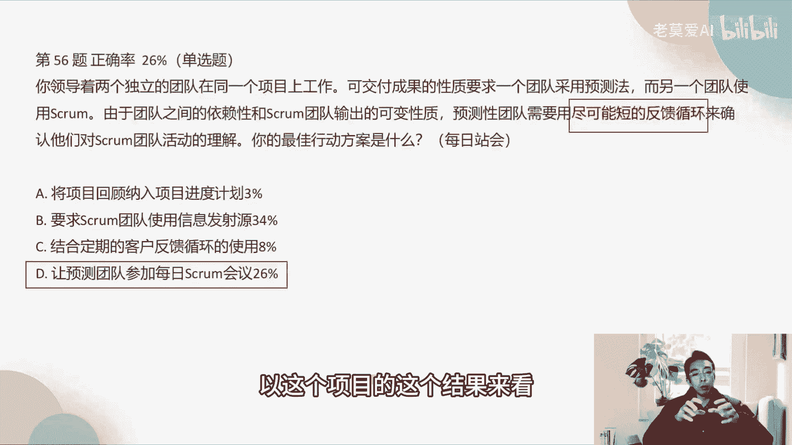

这个手机这个项目它就是混合性，所以正确答案是D好，第62题，为了满足正在制定的政府税收新法规，然后一家公一家组织启动了一个项目，来修改其企业资源规划系统，在制作管理这个项目的时候。

项目经理应该做什么东西，为了满足正在制定的政府税收新法规，你看正在制定的政府税收新法规说明什么东西，说明这个风险非常大，这个法规其实我们在这里面啊去看了东西以后，我们看其实考的都是合同。

因为后面讲的是合同合同，所以都是跟关于合同相关的问题对吧，所以我们风险非常大的时候，应该是公钥合同，我们会请一些专家，为什么会请一些专家，他的法规都还没出来，你看正在制定的时期法法规还没出来。

所以你这个风险非常大啊，所以我们要去拉动资源去处理这个事情，拉动资源去请专家，这个关键字就是公钥啊，而不是自制定一户，把很多同学写制定一份灵活的工作说明书，明确规定退出的条款。

那首先你要知道这个法规里面，会不会有这么重要的影响，对啊，所以公钥和在这个里面是最适哦。

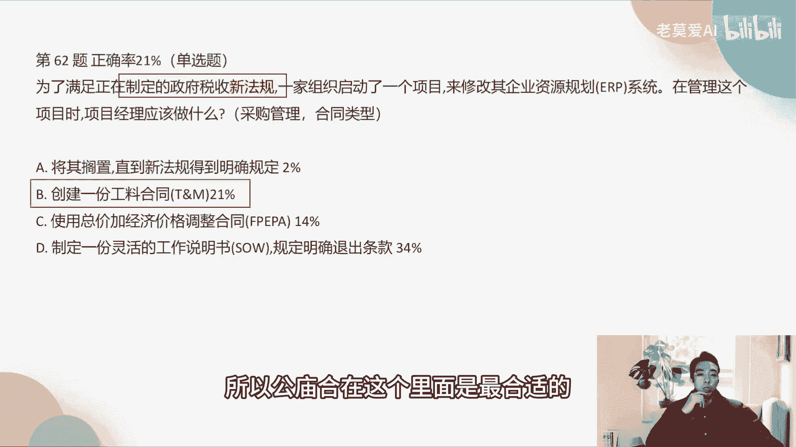

第81题，项目及经理要求更新计划下项目的进展情况，除了一个项目之外，所有的项目都使用传统方法进行管理，说明他也是什么混合型的项目啊，这是一个项目集，仅仅说明是多个项目啊，但整个项目是使用混合型。

你啊除了一个项目之外，所有的方法都有传统项目及经理指出，在规划中有太多的范围变更，并希望看到这个变更是如何，影响各个各种项目的总体进度，说明要满足最好的行动方案，是这个考的是定时发射源。

你可以从各个项目当中去看，他们对于总体的项目带来什么样的影响，那么这个里面考的是发射员发射源相关的啊，这个建议让项目基金参与每日每日商户，这个是错的，跟发射源没有任何关系。

邀请项目基金经理去参加迭代审查会议，迭代审查会议是什么，是某一个项目的这个评审叫做迭代生产规定，那项目经理不太可能会参加某一个项目，因为他是个项目，管的是N个项目，所以这个里面错就错在参加迭代式。

他更关心的是整体情况，所以一是对的，定期将发布燃企图送给项目基金经理，发布燃起图，发布燃企图给项目及经理是对的啊，如果是燃起图，如果没有没有发布的，那么给的是现金啊，这个要注意的啊。

项目集经理看的是发布，燃起项目经理看的是什么迭代软件啊，项目经理看的是迭代软件七七，这个大家要注意，所以你C也是错的啊，让项目及经理去审查迭代软件，这是错的，他更关心的是发布软件，所以正确答案是D。

发布和迭代什么关系呢，迭代它不一定发布，但是发布它一定是迭代的结果，迭代是包含在发布里面的，就比如说我我可能发布这个版本是1。2版本，那么这个1。2版本，可能是我迭代了三周时间才出来的好。

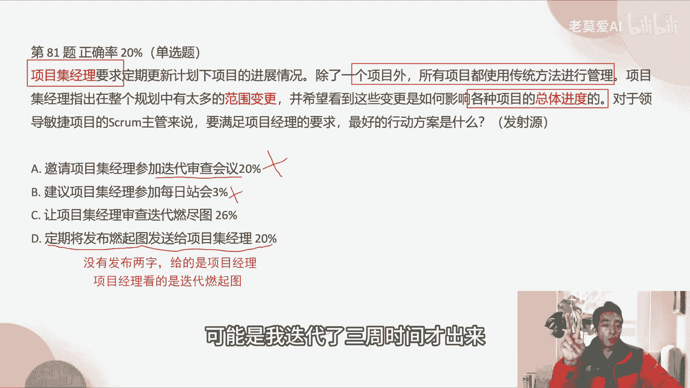

第八十四题，产品负责人与敏捷团队负责人去接触时，会担心团队在最后几次冲刺中进展缓慢，产品负责人怀疑从最近的这个会上，对疲惫和外表无精打采的状态看，他们可能是金币基金了，在这种情况下。

团队采取的最佳行动方式，这个是敏捷团队啊，那么敏捷团队，而且你还是可能精疲力竭的，敏捷团队最重要的要做什么组织啊，是组织的特点是什么，大家一起讨论，有什么问题，大家一起讨论，讨论过后再做决策。

所以B是正确答，很多同学选Z啊，觉得我跟你说，只要做团建这个项目，十有八九做团建这个选项大家就不要去选，虽然我们因为如果我去出题，我作为出题老师，我也会经常去出这种大家常识性的问题。

你在公司里面你会经常做团建，对不对，我就会拿团建来去去迷惑你啊，肯定要做团建啊，对不对，那团建以后啊，凝聚力就上来，但是为什么会这样啊，你要去分析为什么为什么会这样，才说假如做团建能不能怎么提升啊。

所以关键是结果，它不是分析的过程，我们第一步其实不应该做的，第一步应该把这个问题提出来，团队讨论，如果团队讨论出来说，我最近确实是好久没做团建了，我们要做一次团建，我们才来去做团建，OK啊。

所以正确答案是B好。

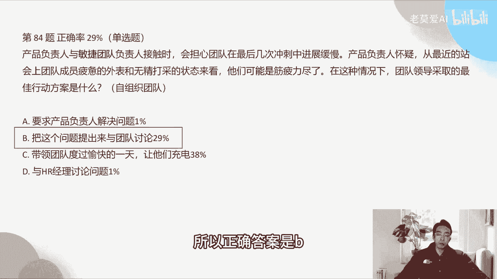

第97题，项目的混凝土供应商通知项目经理，材料将比预定时间晚三个星星期交付，项目经理更新了进度计划，并通知项目团队，在这种情况下，哪种合同类型的承担的风险最小，诶，我以前跟大家说过。

我们签合同的时候要注意什么双赢，特别是我们要重视乙方，就是我们的合作方，我们一定要给他最大的利益，但这件这个题目刚好相反，他问的是哪种合作类型的承担的风险最小，他并没有说你要选择哪种哪种合同。

承担的风险最小，应该是固定总价合，那我甲方承担的损失越小，风险越小，这个是正解，但他如果换一种方问问法说在这种情况下是吧，你怎么样去签订这个合同啊，你现在要签订这个合同，你怎么样去签订合同。

那么这个问题一旦问了，你换了一种方式，你就应该考虑到乙方的利益，那你可能会选总价加激励合同啊，因为你要避免它的损失，要做到双赢，我能赚钱的同时，我想带着大家一起赚钱啊，这个项目才能持久啊。

所以还是可持续发展的思路去做这个题，但是这个完全不一样的。

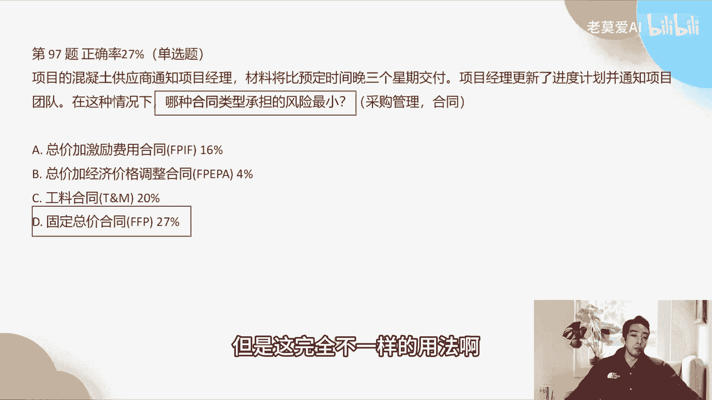

用算法啊，所以我们这个题目就选D啊，第99题，在一个公路施工项目当中，最近出现了返工的情况，导致项目经理非常担心项目的不一致性成本，项目经理来寻求帮助，你能给他最好的建议，反复再提啊。

质量成本一定会考不一致，成不一致性，成本和一致性成本这个关键字一旦出现，一定是质量成本的问题对吧，那么质量成本的问题怎么样，我们就应该开展质量审计，为什么开展质量审计。

因为质量成本它本质上来说是一个过程问题，它不是一个结果问题啊，比如说做测试啊，比如说我我为了一致性成本做更多的测试，购买更多的测试的设备，花出的钱他都是为了让我们的过程做的更好啊，过程做得好。

导致我们的结果好，OK所以我们要开展什么样，最好的这个建议是开展质量审计，所以开展质量审计它就是一致性成，也就是说我们如果能够把一致性成本做得很好，那么我们不一致性成本就会更低，它是一个此消彼长的过程。

就像你说诶，我前面那个车子要自然的事情，我少做一点事，自然的测试自然率，它到了最后这个结果它呈现的不一致性，成本这个自然率可能会提高，那如果我去在测试上面多花点功夫，是不是他到了结果到了交付给客户以后。

它出现的问题的概率就更低一些，所以它是一个此消彼长，就是质量成本的不一致性和一致性，它是此消彼长的过程啊，正确答案是C1好。

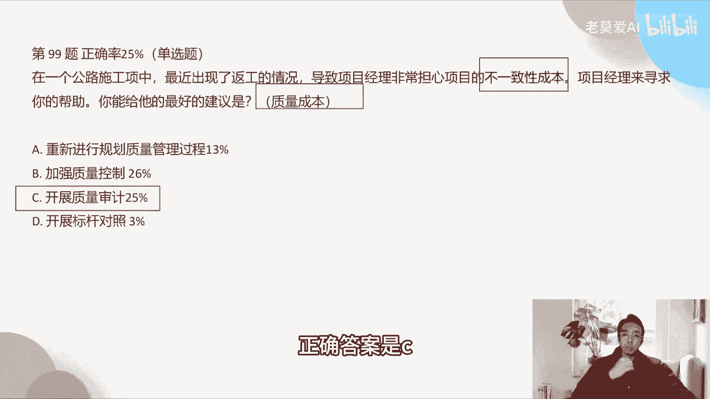

第111题说，一位新的开发人员，在项目执行过程中加入了一个敏捷团队，在参观工作区域的过程中，com主管简要概述了团队使用的敏捷实践，并将开发人员介绍给团队成员，在这种情况下。

ROM主管下一步最合乎逻辑的步骤是什么，这个题目考的是什么，考的是敏捷团队的长自主任，你看这里面的关键的关键字，是将新开发人员介绍给团队，其实成员和成员之间的沟通啊，所以是自主执行团队。

那么自主执行团队，最合乎逻辑的步骤应该是什么，让团队成员向新开发的这个人员去介绍项目，让他们自己自己组织起人和人之间啊，你让他们自己去沟通就好，而不是说让开发人员阅读团队基本规则和过程。

这个其实很不敏捷，敏捷团队他不是这样做的啊，不是说我甩一个文档给你就好，面面俱到的文档，不如什么面对面的沟通，对不对。

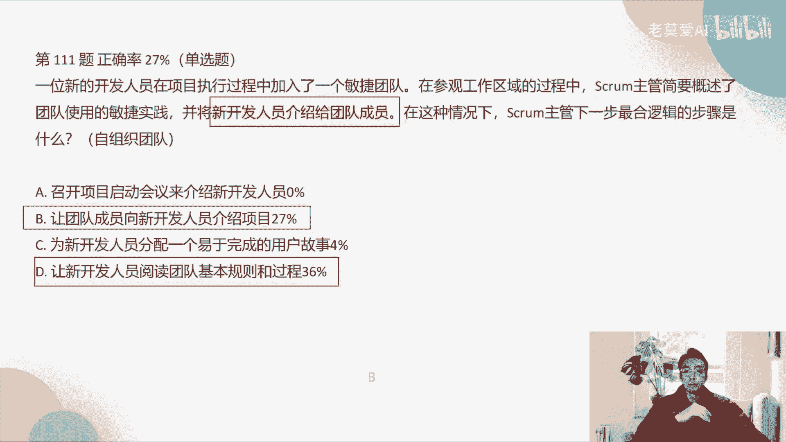

这个是111题。

