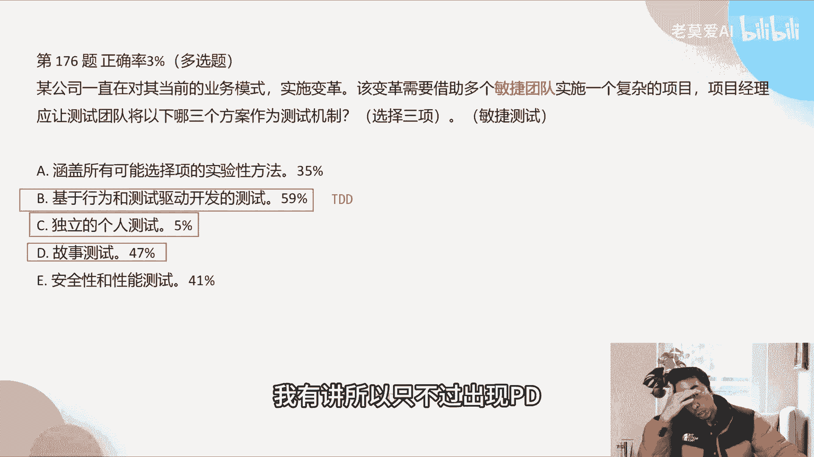
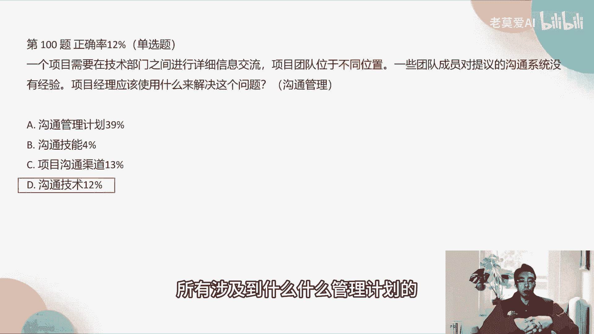
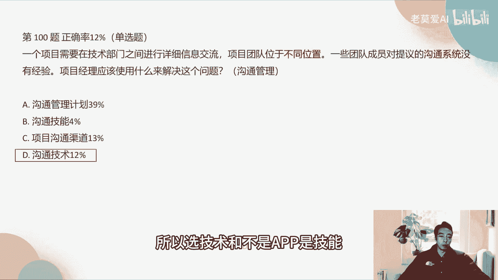
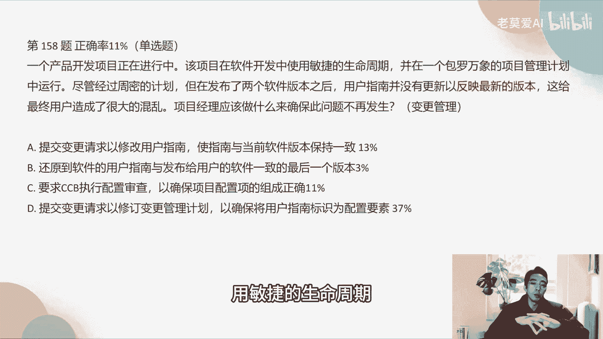

# 全网最好最新的PMP模拟考试题3解析中篇 - P1 - 老莫爱AI - BV1qz421X7i9

OK木简阳说的这个问题啊，值得注意好，第176题，某公司这个正确率只有3%了，某公司一直在对其当前的业务模式实施变革，该变革需要借助多个民间团队，实施一个复杂项目，项目经理应该让测试团队。

以哪个三个方案作为测试机制。

这个里面考的是敏捷测试啊，你的测试我们没有聊过啊，没有聊过这个事情，但是考试题里面基本上也不会考到这个东西，考到这个东西只能说明我们运气不好，因为这个东西是属于超纲的哇，有一点超纲的题。

那敏捷测试是什么意思，敏捷测试跟传统的测试不一样，首先它是测试用户故事啊，所以故事测试它是对的，对不对，因为敏捷他需求写的是用户故事啊，独立的个人测试。

敏捷测试里面它会有什么啊，单元测试，所以单元测试就相当于独立的个人测试，还有基于行为和测试驱动开发的测试，测试驱动开发我以前提到过TDD啊，这个是敏捷特有的测试驱动，你可以不知道行为基于行为的测试。

但是你一定要知道测试测试驱动开发的测试啊，这个是在敏捷里面的内容，这个以前我有讲，所以只不过出现TT那就是对的了。

A涵盖所有可能性的实现方法，为什么A不对，A其实是一个通用，它放到它不是敏捷专有啊，它是预测型里面也有安全性和性能测试，这个也是通用测试，所以这两个是通用的。

它不是敏捷测试啊，这两个是通用测试，安全性和性能测试。

这个一般都不会去做，对不对啊，好所以啊回来啊。

正确答案是BCD好，第42题，敏捷教练协助团队召开会议。

对团队刚刚完成的迭代进行反思和调整，那么看到这里我们就想到什么，这是凯考的是回顾会议反思和调整，对不对，教练和团队成员为讨论设置了阶段，创建了迭代过程中发生的事情的共享图片，评估在前一步中生成的数据。

并决定如何讨论过程怎么确定的问题，这次会议的下一步应该是这个题目，其实在这个群里面聊过这个事，OK那下一步是B啊，结束会议，为什么是结束会议，因为其实他反思和调整已经做完了。

并决定如何处理过程中确定的问题，这个也做完了，所以下一步就应该是结束会议啊，很多同学选53%的同学都选执行决策，为什么执行决策不对，执行决策不是会上的要做的事情，执行决策是回顾会议做完之后做的事情啊。

就像我们说啊，我们我我以前跟大家讲敏捷的回归的时候，会说过，我们在回顾会议里面，我们需要怎么样去改进我们的过程，三当中top3的问题对不对，那top3的问题我们要去跟进，我们有一个角。

比如说跟进负责人和完成时间，那么我们只要有跟进的表格就行了，那接下来我们跟进跟进就是什么，跟进其实就是执行决策，就是这个事情，这个人张三我已经列好了，他在3月1号要做完这个事情，好这个会议就已经结束了。

接下来执行这个决策，是我去跟进张三到底有没有做完，3月1号有没有做完这个事情，这个叫执行决策，所以执行决策这个事情是会后，由项目经理去跟踪去做这个事情，推荐大家去做这个事情啊。

所以这个这个题目大家要注意一下，这个题目是比较多，所以正确答案是B哦。

第100题，一个项目需要在技术部门之间进行详细的，这个信息交流，项目团队处于不同的位置，一些团队成员对提议的沟通系统没有经验，那么项目经理应该使用什么去解决这个问题，不同位置的团队我们说是虚拟团队。

对不对啊，虚拟的，所以这个里面考的是虚拟团队的沟通管理，正确答案是D，就是沟通技术啊，而不是沟通管理计划，我跟你们说，很多时候我们在做题目的时候，要记得一句话，沟通管理计划没有，沟通沟通管理计划没有啊。

我们在沟通里面看什么人用什么样的沟通方式，一定是我们的沟通的表格啊，沟通的一个登记表，它不是沟通管理机，所有涉及到什么什么管理计划的。

都是一些大而空的一些战略层面上的东西，他没有具体的沟通的方式和具体的沟通渠道，他一定不会写啊，所以很多时候管理计划和计划，大家有点分不清楚啊，管理计划一般是大而空的东西，很多时候大家会比较混用。

比如说风险管理计划里面有没有风险，风险管理计划里面不会描述具体分析啊，他只是把风险进行一个分类啊，什么高中第一是哪，哪些就没了啊，沟通管理计划其实也是一个大的分类，那么沟通技能和沟通技术有什么区别。

沟通技能是个人的个人的一些针对个人，这沟通技术它针对的是整个团队的啊，所以选技术和不是，而不是技能好。

第108题，在高科技产品开发中，为了保证产品成功，在产品最终定型之前，通常需要做大量的测试工作，这种做法被认为是高科技产品开发项目，风险管理的有效办法，尽管会增加增加测试，会增加项目成本这种风险。

这属于哪种风险应对策略，这里面考的就是风险管理，因为反复在提风险，风险风险对不对，那一定的风险，那么风险里面，我们看风险应对计划里面有哪几种，一个风险接受风险接受是什么意思。

风险接受一般就是如果发生火灾了是吧，那实在是发生火灾了，我们就打什么，打119对吧，这个是风险接受计划，该赔的赔活和那个我们之前买了保险啊，就去保险去赔，那么保险赔它是属于风险转移，如果起火了。

我们又买了全险啊，就像车一样是吧，买了全险以后，这个全险是由保险公司来赔的，所以保险公司赔这个叫风险转移，风险转移是什么，就是这个风险我们不用承担，全部由别人去承担，这个叫风险啊，风险转移对不对。

所以风险接受就是我们接受了，我们用钱去搞定这个事，风险转移就是买保险啊，用第三方，而风险规避是啥意思，风险规避是把风险的其中一个因素引起风险，这样一个其中一个因素给咔嚓了，这个叫风险规避。

风险规避完了之后，它能够保证这个因素至少咔嚓了以后，百分之百不出这个问题，所以爬山不能带火种，我们平时去爬很多什么大南山的时候，有时候说爬山不能带火种是吧，每个人要注意，你只要不带火种。

它就没有这个风险，没有说带火放火烧山，这个风险对不对，至少打雷起火算不算一个风险，那肯定算风险，但是不是正确规避里面的，他只来规避这个问题，所以风险规避它能够也能够去解决风险啊。

这是另外一种风险环节是什么，风险缓解是这个因素，你不能你没有去去掉某一个引起风险的因素，你只是降低了它的影响，或者降低它，降低它发生的概率好，那首先我们看一下关键字，通常要进行大量的测试工作。

请问各式工作他能不能够把这个风险完全去掉，不能它只是让风险出现的概率更小，或者它的影响更小，比如说啊我们一部汽车是吧，汽车里面如果这个汽车我进行了大量的测试，它是否起火自燃的，这个工作。

是不是这个汽车起火自燃的概率会远远降低，因为我前面进行了大量的测试，但是你说我做了大量测试以后，这个汽车是不是就不自然不起火了，不是所以这个只是风险缓解啊，所以缓解规避转移和接受这四个概念啊。

我在这里跟大家讲一讲，大家要掌握了啊，给正确答案是一啊。

风险抛第126题，一个成本控制敏感的项目团队分布在三个位置，存在时区啊，语言沟通的问题，如果要解决这些问题，项目经理应该怎么做，这个考的是什么，考的是虚拟团队是吧。

一般的三个位置就是分散起来叫做虚拟团队，那么虚拟团队很多人选A啊，A召开定期的视频会议啊，这个事情是不是可以去做，视频会议有哪些缺点啊，第一个它的成本哪个高，比电子邮件高。

但是它恰恰又是一个成本控制敏感的团队，那么成本你说电子近期的视频会议，其实也没有多大成本，对不对，但是它是确实是比电子邮件它的成本高，那很多人就比较纠结，你再看后面的东西，你就不会太太去纠结了。

比如说它存在于时区语言沟通的问题，那么如果你存在这个问题是证明什么，我们语言沟通上是不是有障碍存在这个问题，比如说我是中国人，我跟美国人啊，我们一起开会，我们是不同的团队，既然存在于语言沟通的问题。

就说明我不会英语，他们其实也不怎么会中文，才会出现这种问题，假如我英语很流利，他们中文很流利，就不会说存在时区语言沟通的问题，对不对，好，那视频会议能不能解决啊。

你说现在AI的视频会议在一定程度上也能解决，这是后话了，但是在这个PP的传统观念里，这个题目这个里面其实没那么好解决，因为要实时的去沟通，我们语言不通文怎么实施股东，所以最好的方法是B啊。

B其实比A好啊，为什么，因为它是电子邮件，电子邮件它没有那么强的及时性，没有那么强的及时性，也就是说我可以用别的方式去来翻译，我们的理解，比如说他发发出英文啊，我们可以在百度去搜一下。

他的这个英文是什么意思，我们再去用百度的英文去啊，这个回答，或者是说我们统一用中文去沟通，这个其实都是用翻译工具，翻译软件去做，他的这个选项会更加合适一点，而且它的成本是极低的。

所以这个方式B的方式是更适合，正确答案是B，所以在B上图这道题就没有用到项目管理知识，对是常识，电子邮件，那这个里面其实你说完全没有用到，其实也不是啊，沟通管理考的是沟通管理的机制。

他的沟通工具大家可以看啊，沟通管理里面有几种工具啊，几种工具会提到，比如说邮件沟通，视频会议的沟通，它分别有哪些这个利和弊啊，这个里面在沟通管理也有啊，OK好。

第130题，说一个为期两年的项目完成了50%啊，进度绩效指数1。051，和成本绩效指数为1。02，其实这个东西你只要看一下，你就知道这一点几一般都是比较乐观，比较好，这个项目说明这个项目比较好。

一个项目进入投资组合，新的项目被视为一个优先级，并且高于这个当前的项目，所以目前项目失去了三个关键资源，尽管资源紧张，但是高级主管仍要求项目按时完成，而且按照预算不会有额外的供给啊，资源补给。

那项目经理应该怎么做，其实考的是什么，考的是成本怎么样。

这个项目现在现在进来，你现在这个项目比较乐观，但是砍掉了三个人。

考掉了三个人之外，我们要不要立刻立刻，家人在项目管理的考试里面经常会考，这个是一个非常我们值得注意的问题，一般的突然从你的项目拉到几个人，你不要着急，马上去跟我们的常识是不一样的啊。

我们常识可能认为项目我缓了30个人，这30个人就一定要在，比如说这30个人突然走了三个人，离职了三个人，那么我在平时的工作当中，我的做法是，这三个人既然离职了，或者调到其他项目了。

那领导一定要给我补三个人，不然我没法干活了啊，我就是这样的，那其实在项目管理这个领域里，他认为你这样做并没有用到，项目管理的任何技能啊，是觉得你这个人技能不行，丢掉三个人以后。

你应该考虑到我怎么样去极大程度的去利用，剩下的这些话，你应该是考虑这样的东西啊，这个叫成本管理思路啊，就是这样的，所以这个时候我们先分析一下，分析一下什么东西，去掉这三个人以后，我们干的这个事情啊。

是不是影响了整个项目是吧，先分析一下，如果影响我们在做进一步的事情啊，你要考虑到哪方面的影响，我们能不能自己去做一些事情，比如说自己去做资源平衡，比如说我们26个人，那26个人能不能拧成一股绳。

把30个人的工作给做了，这个是项目经理应该考虑的问题，所以第一步我们应该实施偏差分析，有了这三个人之后，我们现在项目正常走了之后，我们是不是整个项目还能正常，所以先做分析，这是第一步啊。

好那做完第一步以后怎么样，如果这三个人我们可以，我们知道这26个人可以顶30个人，我们在做第二步应该是找这个顺序，所以正确答案是，项目经理应该首先做的是实施偏差分析。

对第134题，在收到一个关系稳固的客户签署协议之前，项目经理假定项目具有激进的完成日期。

项目经理下一步应该做什么，这个时候考的是什么。

你看我们的关键字已经搞了啊，关系稳固的客户签署的协议之前。

请问签协议之前，这个项目有没有启动，没有启动，项目是要建钱之后才启动啊，你不给钱，我肯定项目不给钱，所以这个项目是在最初的阶段啊，我们顶多只能算作项目启动阶，那么项目既然是启动阶段，那A就直接被排除。

为什么启动阶段根本没有资源参与，怎么让更多的资源参与进来，肯定不对啊，创建应急储备，允许对进度计划赶工，项目启动阶段我都还没有进度计划。

没有进度计划，我怎么样去，这后后面的事情就没有了，第一次获得发行人授权，已开始该项目在启动阶段的时候，这个才是我们启动阶段应该做的事情啊，第一与客户开会，加快项目协议的谈判。

这个加快项目协议的谈判里面没有，并没有用到任何的，还是那句话，没有用到任何的项目管理知识啊，你没有用知识点去推进它，你只是说开会谈判啊这个事情啊，所以第一次不选，所以正确答案是C。

你要知道启动阶段要做一些什么事情，就是项目授权，就是发起人去授权项目经理去做这个事情好。

第147题，只要口水啊，总共期五个月，项目最初拨款费用总额为二百三万万美元，三万万，目前项目处于第三个月，那么项目前三个月的总支出为这么多钱啊，项目完工部分超前与进度符合预算，项目的成本差异是什么。

那么这个题目考的是成本差异是多少，所以它是成本啊，记得成本差异是多少，那么成本差异我们只要看一句话就行了，符合预算说明成本差异为零，没有差异啊，所以正确答案是C啊，很多人说大于零，也有很多同学说小于零。

这个项目属于超纲项目啊，混得好，这种考试反而一般不会考，如果考的话，其实这个题目非常简单啊，这个其实是送分题啊，项目完工部分超前于进入，你想如果他考的是项目进度差异是多少，进度差异是什么。

实际的进度是不是比预计的进度要快啊，项目网格部分超前于进度，说明什么，要完成的更快，所以大于零，如果这个题目考的是项目，比如说啊这个题目考的是项目的进度差异，那么我们应该选A啊，进度差异。

硬度差异应该是选A啊。

但是这里面说成本差异，我们就只要看符合预算就行。

就是你啊，OK所以好，第158题。

一个产品开发项目正在进行中，该项目在软件开发中使用敏捷的生命周期。

并且一概包罗万象的向管理计划中运行，然后经过周密的这个计划。

但在发布了两个软件版本之后，用户指南并没有更新，以反映最新的版本，这跟用户造成了很大的混乱啊，项目经理应该做什么，确保此事不再发生，只要出现版本不对，我们第一个考虑的是什么，配置管版本不对。

是配置管理问题，对这个题目跟配置管理相关的啊，就只有这个东西配置审查，以确保组成正确，第一其实也有说到，以确保以用户指南标识为啊，配置要素，第一前半段句话其实是有问题的，提交变更请求。

变更请求是什么时候，提交变更请求是在影响的三大基准的时候，比如说啊影响了这个范围，影响了进度的时候，但是这里面并没有，他只是说用户指南没有更新，用户指南没有更新的话，那我就检查一下是不是有问题啊。

有问题好，那选C啊，因为他是知道是什么，确保问题不再发生，确保问题不大发生，意思就是假如回到以前还是。

所以我们要看啊，好多题目是什么，最后一句很关键，怎么确保什么事情不要发生啊，什么避免什么东西啊，防止什么东西啊，其实都是在吃后悔药，吃后悔药的时候，你就要往前面的步骤里面想。

一般吃后悔药的事情都是过程问题啊，都不是说接下来要做什么事情，都是过程吧，我们要往前面去看，比如说过做一些过程审计啊，做一些过程检查啊，后面就能防止这种问题啊。

这种事情正确答案是C好，172题。

项目经理刚刚从组织辞职的另一位项目经理，那里去接管一个正在进行的项目。

在项目在审查项目管理计划时，项目经理意识到成本偏差和进度偏差，主要是负向的，项目尚未解决，还未向供应商支付已完成的工作，并且减轻自身风险，正迅速耗尽预算，本该使用哪种啊，三三种措施来避免这种情况啊。

这个是属于风险，因为一直在说风险是吧，减轻自身风险什么东西，所以这个里面出现了这个风险，质押一般是考的是风险，那么既然是风险问题，那么我们怎么样避免这种情况，避免这两个字，我们一看到我就要往前面去看啊。

比如说我们在之前的这个过程当中，有没有做好这些东西啊，比如说A项目章程明确实施明确的假设，其实明确的假设在项目当层出来，其实就是什么，就识别风险啊，比如说假设领导给我100万，我就去做这个项目。

假设没有100万，这个项目很大概率会失败，这其实就是一种风险，就是识别风险啊，所以明确的假设其实就跟风险有，所以A是对的啊，B在项目章程中啊，增加应急预算能不能避免这个情况避免不了啊。

避免它成本偏差和进度偏差是负面的。

避免不了，他只是说出现这种问题之后，我用钱能解决，所以他不是避免这种情况，其实B选项它是应对这种情况，如果写的是应对这种情况，那B就是对的啊，但是在这里B是不对的。

C确定项目交接的程序，项目交接程序虽然也是一个过程，但是项目交接并不会引起这个偏差，成本偏差和进度偏差是负面的，这个问题啊，并不是并没有提交我们交接的时候出来啊，第一确保项目治理控制得到批准和实施啊。

也就是说项目治理是什么，项目治理是高层次的高阶段的一个计划是吧，他控制如果控制的核弹，那么怎么样项目的啊，质量就很好，就比较难出现这个问题啊，一是在项目规划阶段确定高风险和对策。

也就是说我们一开始就能够把风险探出来，这个就不会有问题是吧。

所以正确答案是D1，第24题已经决定用瀑布管理项目，然而由于需求不明确，你看他决定用了瀑布，但是需求不明确了啊，项目将在短时间内一哦，对第一应急预算解决不了进度偏差，戴维说。

这对这个角度也是一个思考的角度啊，这个角度也是对的啊，好第24题，已经决定用瀑布管理项目，然而由于需求不明确，软件将在短时间内使用框进行开发，再从组织内部获得资源之后，项目经理意识到。

组织在几个关键资源缺乏技术专场，就要从供应商获得外部资源，然而本组织希望保留其对所进行的工作的战略，这叫什么，左主权，对于项目经理来说，为了最大限度地与供应商和协作，最好的承包技术是什么。

这个里面考的是什么，资源管理，资源管理，以前我没有说到一个叫做团队扩充的东西。

这个题目其实也是超纲题啊，这个题目他其实是想考的是，资源管理组的团队啊，那么团队扩充它为什么叫团队扩充，其实你可以从这个信息里面，我们得到了一个什么样的信息，我们这个项目其实风险很大。

所以我们使用了一些外包，一些外面的供应商，但是外面供应商来了之后呢，我们又希望什么，能够它能够按按照我们的战略来去做问题，做东西，所以在引进外包供应商的时候，我们其实外包有两个管理方法，为什么叫超纲了。

其实这个这个是属于，我们其实在外包管理上有两种策略，一种是叫什么叫做资源外包，一种叫做人力外包，资源外包是什么，资源外包，我把东西分给你，你要做我的工作的一个部分，比如说我可能会做主教，资源外包。

叫项目外包，项目外包，对我把东西给到你去做，比如说我们做游戏的，经常有一个叫做做这个动画，因为游戏的时候通常有很多这种宣传宣传动画，比如说王者荣耀，他有时候会做一些什么宣传片。

这个宣传片一般都不是我们工作室做的，而是请一些供应商公司来去做，我们只要把需求提给他，然后他们按照我们的需求做，我们最后的验收就行了，这个叫项目外包，就把项目的一部分包出去，还有一种外包叫人力外包。

人力外包出现在什么时候，我们在这个王者荣耀的工作的时候，我们有一些项目是需要测试的，但是我们的测试人员不够，我们需要获得更专业的这个测试人员啊，我们其实会跟外包公司去签约，他会有一部分的人力。

一些外测试专家会来到我们的项目组，这跟前面的动画外包不一样，动画外包通常是在其他的公司，他在自己的公司办公就好，但是这种人力外包他是跟我们一起工作的，跟我们一起工作，我们的所有的他们做的所有的事情。

我们都清楚，我们在这个合作的过程当中，我们团队做的所有东西他们也清楚，所以我们的大家的整个过程是透明的啊，所以他们做的事情也很符合我们的工，工作的一些战略。

是这种情况。