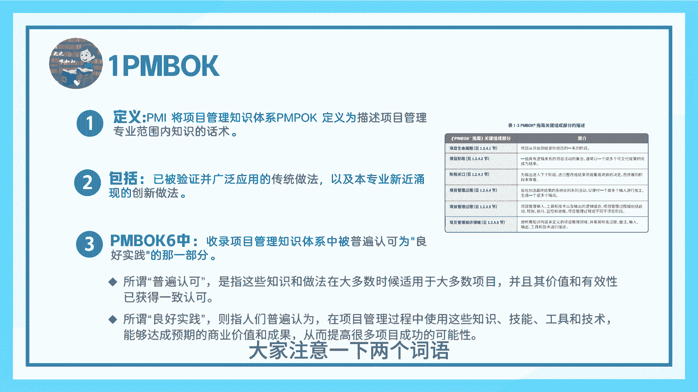
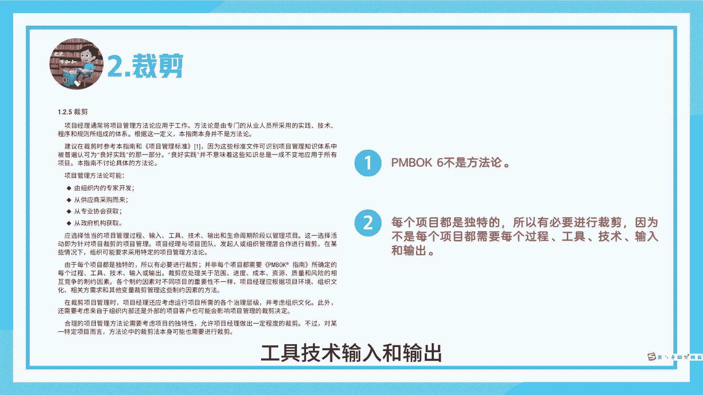
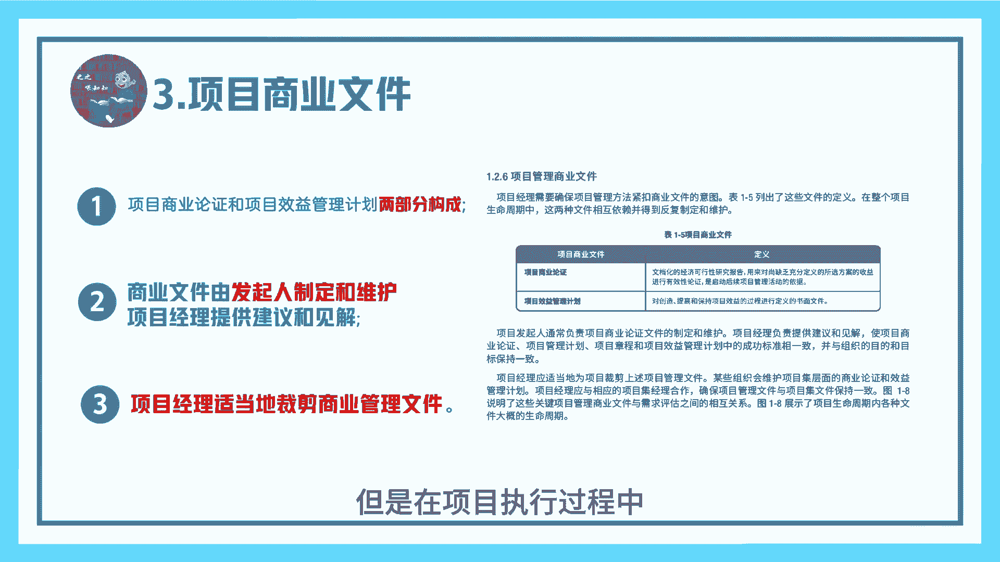
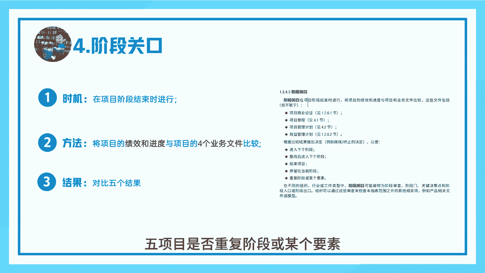
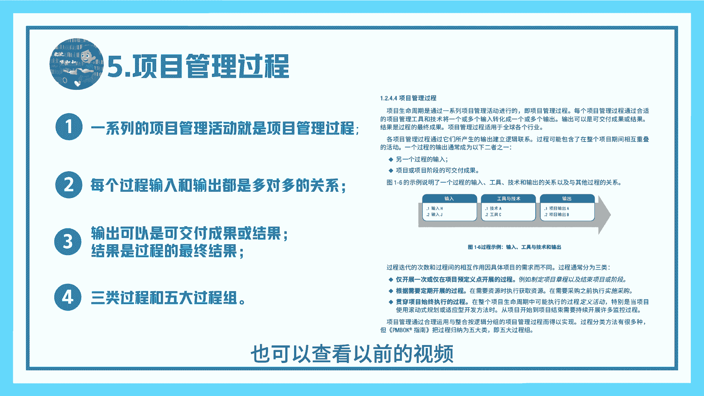
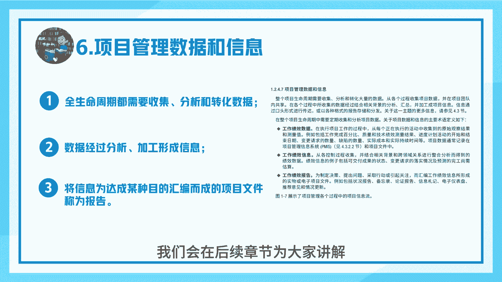
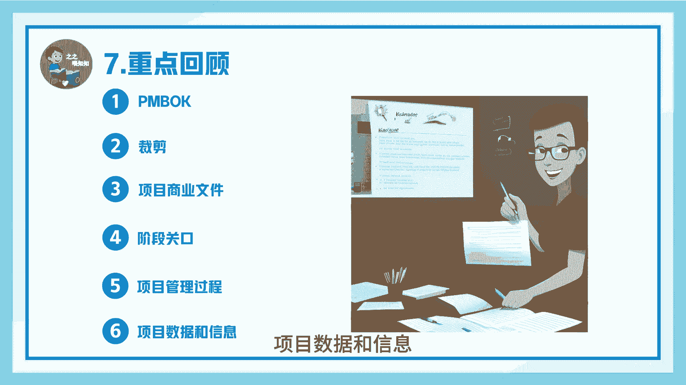

# 几个术语-PMP系列第九讲-之之喂知知 - P1 - 之之喂知知 - BV1U8pnepEP7

海上的晚霞像年少的画铺在天空，等海鸥衔走它，遥远的帆，大家好，今天开始我们PMP系列第九讲，为大家介绍几个术语，我是吱吱魏滋滋，先来看一下第一个术语，Pon book，pm不可定义的话。

是描述项目管理专业范围内知识的话术，它包括已被验证并广泛应用的传统做法，以及本专业新涌现的创新做法，聘用book，第六版收录的是项目管理知识体系中，被普遍认可为良好实践的那一部分。

大家注意一下这两个词语。

普遍认可良好实践，再来看一下第二个术语裁剪，首先pm不可定位板，它不是方法论，方法论的话，它是专门有由从业人员所采用的实践技术，程序和规则所组成的体系，方法论来源有四种，第一有组织的专家开发。

二从供应商采购，三从专业协会获取，第四从政府机构获取，由于每个项目都是独特的，所以我们有必要进行裁剪，因为不是每个项目都需要每个过程工具，技术输入和输出。

所以请大家在项目中使用裁剪技术，再来看一下第三个术语，项目商业文件，项目商业文件的话，由项目论证和项目效益管理两分构成，项目文件的话是由发起人制定和维护，项目经理的话只提供见解和建议，这里请大家注意。

项目经理是不能制定和维护商业文件的，但是在项目执行过程中，项目经理他是可以适当的裁剪项目查询文件。

再来看一下第四个术语阶段，关口阶段，关口的话通常是在项目阶段结束时进行，请大家回忆之前我们讲到的四个阶段，这段关口的话是将项目的绩效进度，与项目的四个业务文件进行比较对比，得出五个结果。

这四个业务文件包括商业论证，项目章程，项目管理计划，效益管理计划，不过结果分别是指，一是否可以进入下个阶段，二是否整改后进入下个阶段，三是否停留在当前阶段，四是否结束项目，五是否重复阶段或某个要素。

第五个术语，项目管理过程，一系列的项目管理活动，就是项目管理过程，每个过程输入和输出都是多对多的关系，也就是说一个输入可能有多个输出，一个输出可能对应多个输入，项目的输出可以是可交付成果或结果。

项目的过结果是过程的最终结果，项目根据过程迭代次数和过程之间，相互作用都不同，通常将过程分为三类，第一仅开展一次或仅在项目预定点开展的过程，二根据项目定期开展的过程，三贯穿项目始终执行的过程。

我们PMP考试有五大过程组，请大家自行回忆，也可以查看以前的视频。

再来看一下本小姐为大家准备的最后一个术语，项目管理数据和信息，我们项目全生命周期都需要去收集，分析和转化数据，数据经过分析加工形成信息，我们将信息未达成某种目的，汇编而成的项目文件成为报告。

请大家关注工作绩效信息，工作绩效数据和工作绩效报告三个术语，我们会在后续章节为大家讲解。

来回顾一下，我们本节主要为大家讲解了六个术语，分别是PMBOK裁剪项目，商业文件阶段，关口，项目管理过程。

