# 制定项目章程（上） - P1 - 项目管理陈老师 - BV15x4y1u7JQ

接着往下放啊，接着往下上，接下来我们来讲项目整合管理的第一个过程，制定项目章程，那么制定项目章程呢它属于启动过程组，在启动过程组里面我们有两个过程啊，大家很好记，一个呢就是这个制定项目章管理章程啊。

在这里我们会碰到啊，然后呢另外一个呢叫做识别相关方啊，这个在我们第13章最后一个领域，相关方管理这个领域的吗，我们会碰到，所以呢启动就是一头一尾，各有一个过程是在启动过程组。

那么制定项目章程它的一个定义啊，干嘛呢，就是很明显，顾名思义就是我们要编写一份正式批准项目，并授权项目经理，在项目活动中使用组织资源的文件的过程，哎这么一个过程就叫做制定项目章程。

那么我们从这里面就可以理解，那么项目章程它就是一份什么呀，正式批准项目，并授权项目经理，在项目活动中使用组织资源的文件，这份文件就叫做项目章程是吧啊，所以很清楚这个做过程的一个作用呢。

就是要明确组织战略跟项目之间的直接联系，确立项目的正式地位，并展示组织对项目的承诺啊，或者说对组织对项目的授权怎么来理解，项目是通过项目章程来实现，与组织战略之间的一个目标呢。

大家看我们说组织战略是在高层的，对不对，在高层的，那么高层涉及到我们之前讲过项目组合，对不对啊，它通过项目组合来实现，我的各种各样的一个目标，各种各样的战略优先级排列，那么项目组合下面呢。

可能是一个个若干的项目或者项目集，或者这个项目指指指指项目集等等，所以呢项目它其实就是在这个地方对吧，它是在我们的组织战略下方的，那么组织战略我们要证明说我们这个组项目啊，它是符合组织战略的。

那这个时候我就要你上头给我一份什么呀，文件啊，来证明我是符合你的战略，那为什么要证明呢，就是为了什么呀，我能够使用组织的资源，组织资源是有限的，不是随便都可以用的，但是呢只要你项目是符合我的组织战略的。

我就可以给你用资源，你就可以用我的资源啊，所以项目章程就相当于这样啊，好比一张啊明媒正娶的是吧，明媒正娶的结婚证书，哈哈结婚证书啊，你要说我这个是你这个明媒正娶的，你怎么证明啊啊我怎么到你们家去住啊。

啊怎么给你们加这个管管钱管资源呢，哎我需要有一个证明，这个证明就是项目章程是吧，确认我的地位啊，所以这个作用就在这里，他明确了项目跟组织之间的直接联系，确立项目的正式地位啊，展示对他的承诺啊。

比如说结婚证书上面也承诺了，是不是哎你要对我忠诚负责等等等等啊，所以这个就是项目章程，大家可以给他理解为像一张结婚证书一样啊，然后制定项目章程这个过程啊，有几个注意点，这里面的知识点就比较比较多了。

大家以理解为主啊，理解为主，首先项目章程在执行组织跟需求组织之间，建立起伙伴关系，好项目的执行组织是谁啊，就是项目团队，对不对，项目团队以项目经理为首的项目团队，然后呢需求组织是谁啊。

就是我们的组织是吧，我们的组织，那这个呢针对内部呢的项目呢，就是组织，针对外部呢就是项目的什么呀，发起方或者是业主对吧，诶我们要通过这个东西，把这几方面的关系建立起来，不然本来我们是脱节的。

我们是没有关系的是吧，相互团队跟组织的高层有什么关系呢，那就是一种什么呀，一种上下级关系，但是通过项目章程，我们是建立起一种合作的伙伴关系啊，你提需求，我帮你完成。

第二经批准的项目章程意味着项目正式启动啊，所以项目章程要的一个一个落地，意味着项目的立项正式的完成啊，立项正式完成，第三项目由项目以外的实体来启动，如发起人项目及或项目管理办公室。

项目经理跟项目团队成员呐，你是无权没有权利来发起项目的，你不能说我今天心血来潮，做项目经理，我想要发起一个项目，你怎么发起啊，需求在哪啊，只是你的需求吗，组织会为这个需求买单吗，不可能对吧。

所以通常是由项目以外的实体，比如说委托的甲方，我们做乙方，委托的甲方或者发起人或者是pmo来启动，由外部启动，项目经理应该参与项目章程的制定，这句话大家要注意啊，这个是个考点。

以便对项目需求有基本的了解，所以项目章程这里面这句话大家也要看清楚啊，应该参与制定，而不是负责制定啊，大家不要误会，项目章程不是由项目经理来负责制定的，他可以参与，可以提意见啊，比如说我章程制定之前呢。

我已经及时把项目经理找好了，找好几个人了，那你这个人可以参与一起来制定项目章程，以便他对项目需求有更深的了解，最好也必须在规划开始前啊，再一个呢通过制定项目章程，来确认项目符合组织战略和日常运营的需要。

唉项目章程里面就会有一条我们的终止，这个项目的目的终止是为了什么哎，为了实现我们什么什么什么的目标，大家都经常看到，对不对，我们公司有公司的什么呀，公司章程，所以这个章程啊他其实就是强调了啊。

我们在某种使命或者在某种战略的需求下面，我们制定的这个东西啊，它是一个高层级的文件，是一个纲领性的文件啊，所以通过项目章程，能够来确认它符合组织战略的需要，在执行外部项目时呢。

通常需要正式的合同来达成协议，哎，做外部的项目，这个时候是怎么样呢，比如说我们的项目经常会出现有几种来源。

第一种呢就是在我们组织的内部是吧，我们公司啊，比如说我们要修要装修装修办公室。

装修办公室，我们要装修办公室。

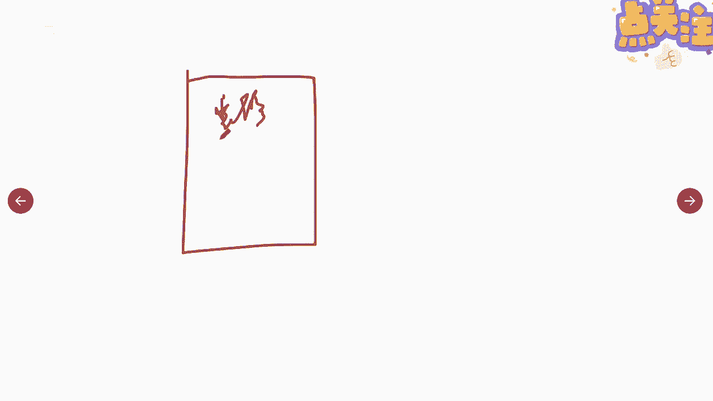

这是我们组织高层的需求，好完了装修办公室，这个事情呢就交给了我们的项目团队。

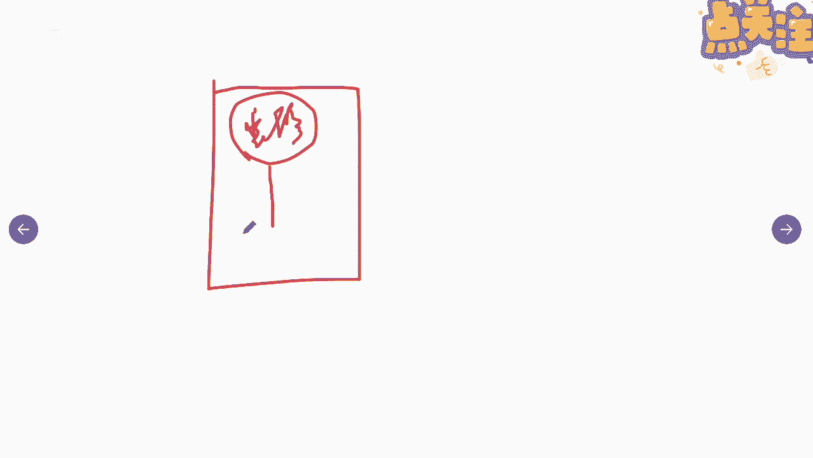

你们来负责啊，你们来负责这个项目团队啊，然后呢通过制定项目章程确定启动是吧，你可以从组织里面去调用资源啊，这是内部通过章程，但是呢有一些情况呢是这样。

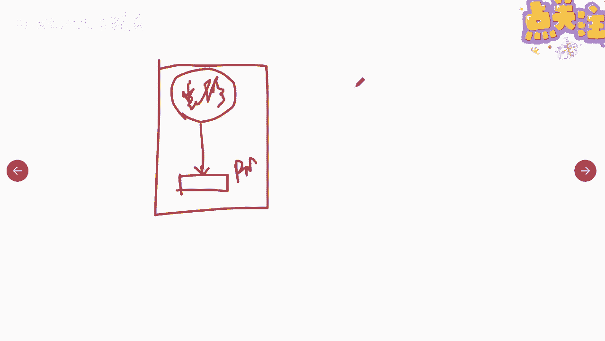

这种要什么呢，我是一个服务提供商诶。

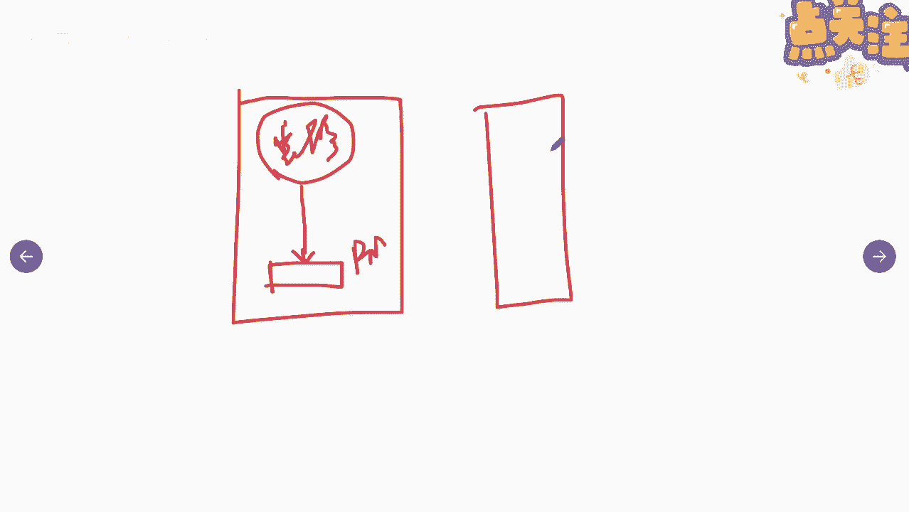

我受到了甲方的委托，比如说这个是甲方。

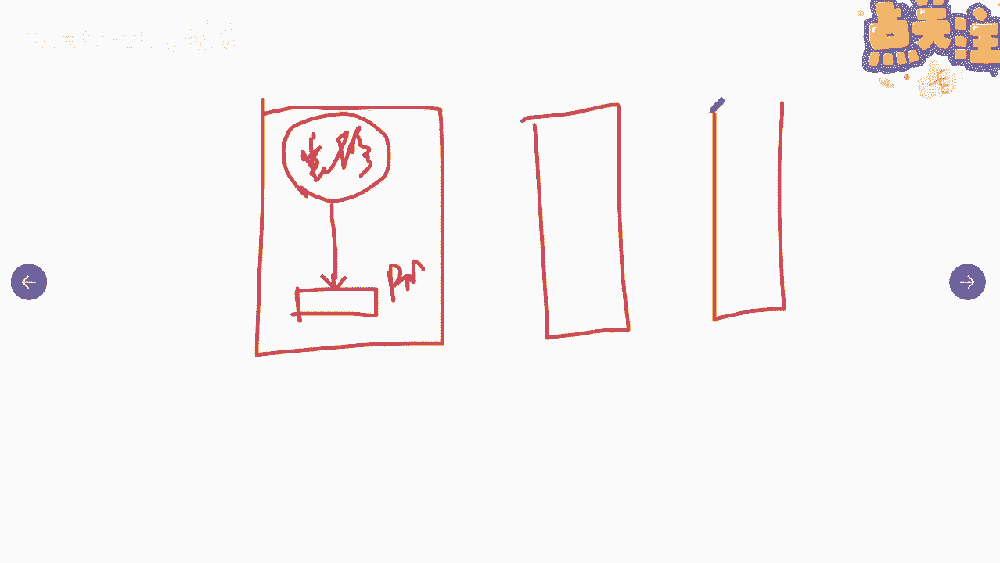

嗯甲方他要开发一套信息管理系统好。

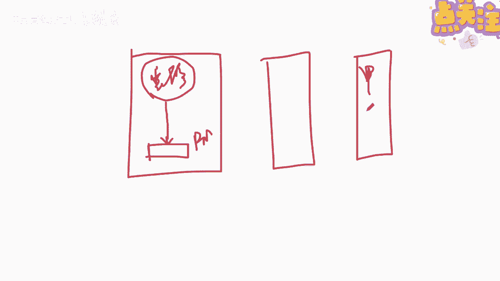

然后呢需求在甲方需求从甲方提到了乙方对吧。

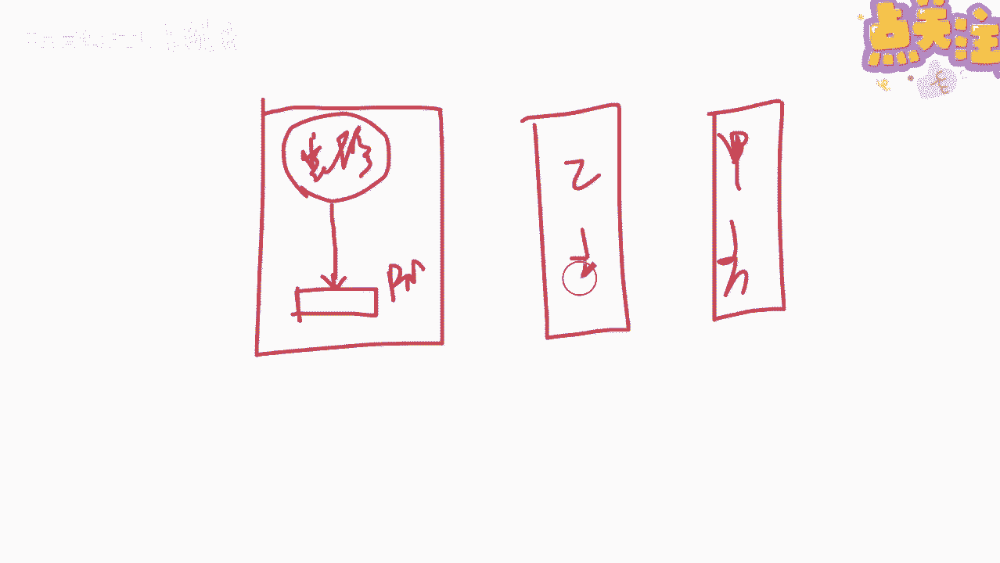

那乙方呢我就成立一个项目团队啊，来进行什么呀，项目好吧，进行一个项目，那这个时候呢需要什么东西啊，需要甲方跟乙方，你给我签订一个什么啊。

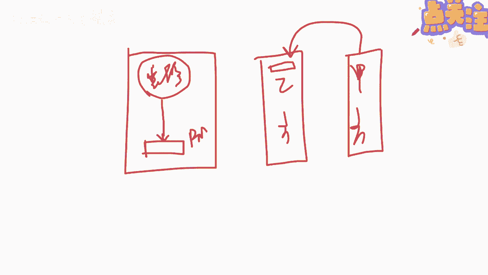

合同是吧，把我们的这个委托事项理清楚了啊。

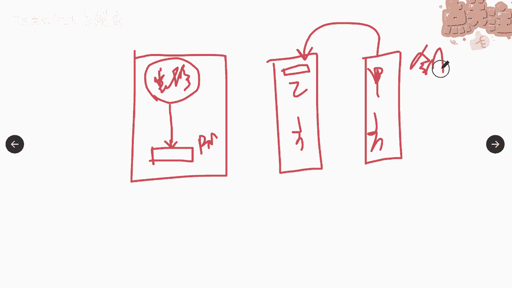

合同签好了好，那我组织呢照样的从高往从高层往下。

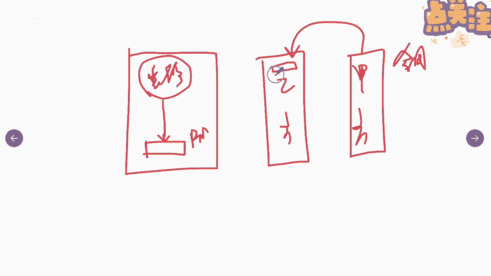

我要制定一个项目章程，拿把项目来启动，那么要制定这个项目章程的前提。

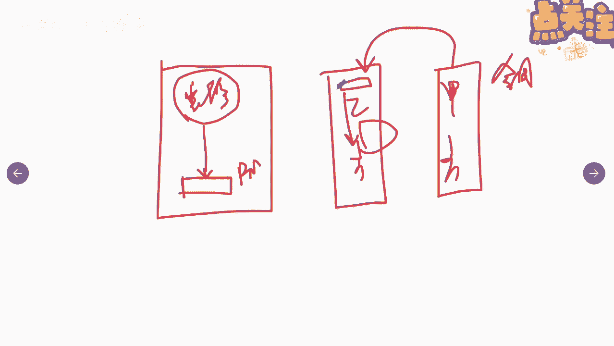

就是我这个合同已经签了，因为有外部的需求，所以呢导致我们要做这个项目啊。

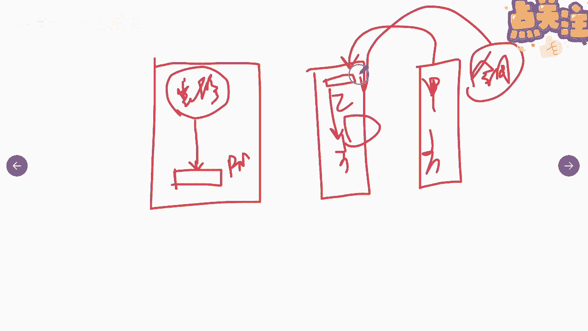

这是从内部和外部两种情况啊。

会都会产生相应的这种项目，所以运行外部的时候呢，需要正式的合同来达成合作协议，那么这个合同和协议呢，也是会作为制定项目章程的其中一个输入啊，然后呢最后一点不要把项目章程看作是合同。

因为呢其中未承诺报仇或金钱，或用于交换的对价啊，所以项目章程跟章项目章程跟合同是不一样的，合同有明确的双方对吧，明确的合同，相应的合同条款啊，我要跟你做什么，你要给我什么，有承诺的报酬，有价值啊。

那项目章程里面没有可能有高层级的预算，但这个呢并不是作为承诺的报酬或者是金钱啊，所以这是制定项目章程的几个注意点，那么项目章程的内容有哪些啊，我们来说一说项目章程的内容有哪些啊，一般来说可以这么来看啊。

四下三人三高跟三种啊，那这种这个了解这个的作用就在于什么呢，就在我们在考试的时候呢，经常会有一种题型而出现了某种某种情况，完了之后我们应该去看哪一个文件啊，然后去看项目章程里面有没有记载。

我们想要的东西啊，所谓的四项指的是什么呢，项目的目的唉，我们为什么要做这个项目啊，为什么要做这个项目，你要明确的说出来，还有呢，你项目的这个，这个是为了实现组织的某一种需求对吧，或者某一种目的啊。

项目的目的，再一个呢可测量的项目目标，我们这个项目目的是要做什么，那我们怎么样来确认，我们达到了这个项目的目标，怎么样来测量嗯，比如说刚才说的装修办公室的项目，最终的目标是什么呀，在多长的时间里面对吧。

我们完成了这个办公室的一个装修，同时可以进驻啊，硬装软装全部完成，有相应的成功的标准啊，再一个呢项目审批的要求对吧，是经过了什么样的一个审批，怎么样才能才能够呃谁能同意来做这个项目。

还有呢项目退出的标准啊，什么时候我们能宣告这个项目是结束的啊，比如说我们所有人已经交付了，达到一定程度，我们就就达到了退出的标准，另外呢三人要我有有有哪种三个角色啊。

一个呢是发起人或批准人员的姓名和职权啊，笔下最最最底下签署批准人，发起人谁谁谁谁谁签字，还有呢委派的项目经理，还有关键相关方的名单，我们也可以附在整个的项目章程里面啊，这些跟人有关系的。

另外还有三高跟三种啊，三高指的是高层级的需求，高层级的项目描述，高层级的战略和运营资源因素，什么叫高层级呀，所谓的高层级我们可以理解为模糊的，相对于模糊的啊，比如说我们经常会看。

我们政府里面提的一些要求，比如说高层级的接手，要把我们的城市建设成为一个什么呀，产业优良，环境优美的这么一个城市，这个就叫高层级的需求，没有续，具体的是吧，这就叫高层级的需求，那比如说我们这个项目。

他高层级就是什么，为了实现提升我们产品的竞争力啊，啊这这个是一个高层级的需求，另外呢还有什么呢，高层级的项目描述啊，我们要通过这个做一个什么样的一个东西，完了之后达到我们这个高层正确需求，也是模糊的啊。

比如说政府报告里面这样写啊，通过建设1~2个开发区或者经济园区，来实现我们的经济产业的带动是吧，这是这是建园区，这也只是高层级的边界定义啊，园区怎么建呢，面积多大呀，规模多大呀，都没有。

要不没有细化对吧，还有呢高层级的战略和运营假设因素啊，这也是高层级的啊，所以三个很高的三个种呢叫做整体的项目风险，总体里程碑计划以及总体的预算啊，所以我们说这个项目啊是要怎么样啊。

哎要应对总整体的风险就是在什么，比如说啊我们的整体的风险就是呃环境啊，在疫情当下的这种背景下面，我们这个项目可能会遭遇很多的风险，这种是高层级的啊，总体里程碑呢，就我们这个项目的进度呢是预计啊。

什么时候开始，预计什么时候达到什么程度，预计什么时候达到什么程度，中间为期多少年啊，维系多少年，这就叫做总体的里程碑进度啊，没有细化的时间轴，还有呢总体的财务预先批准的上啊。

项目的预总体预算大概是十个亿啊，唉这就是高层级跟整体的一个概念，所以呢大家会发现说我们的项目章程里面呢，它不会很详细的去列出我们项目的很多的信息，它只是在高层级。

在总体的概括层面呢提出到了项目的需求范围，进度成本风险啊，具体的细化就要等着谁来做呀，就要等着委派的这个p m项目经理你来做啦啊，所以项目章程我只是把我的这些东西提一下，然后你就要接下来开始干活啊。

这就是项目章程的内容啊，四项三人三高三种啊。