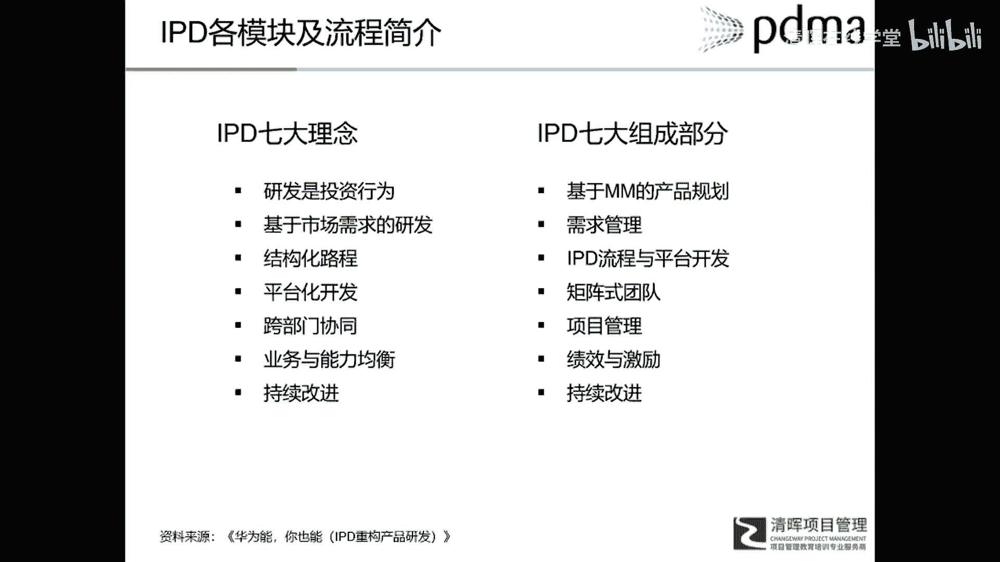
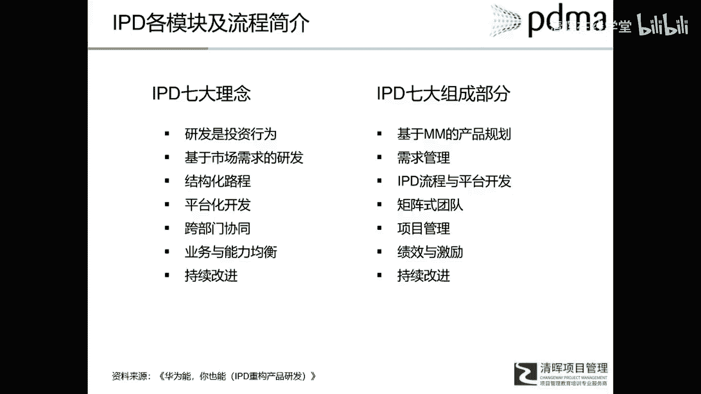
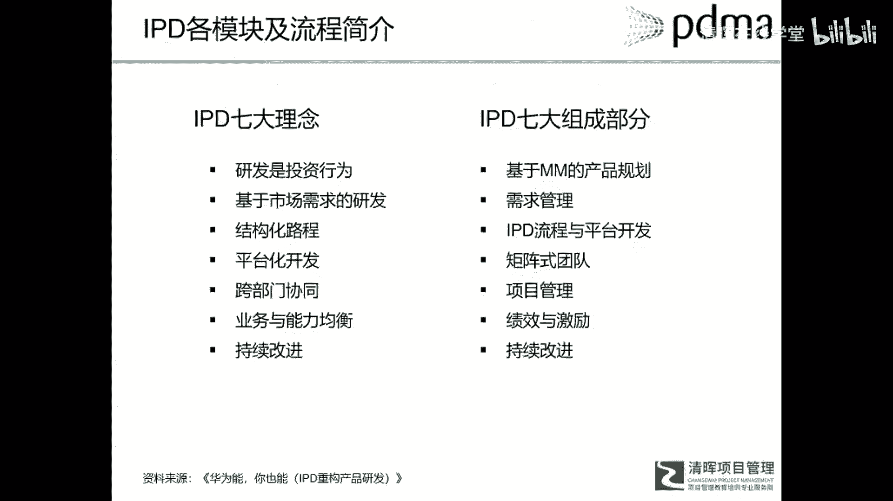
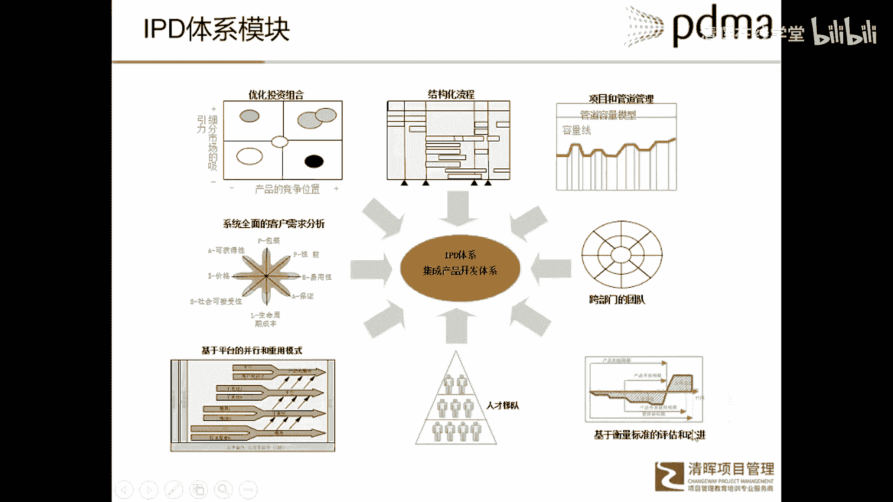

# 华为IPD各模块及流程介绍 - P2：3.IPD整体运行框架 - 清晖在线学堂 - BV1Zz421a7Lj

我们看一下这个IP地。

就是今天我们所熟知的IP地到底是什么样子呢。

呃有一点要强调的是啊，你像Python它是有一本理论。

就是PRTM有一本理论著作，所以成为大家学习的一个资源。

但是RPD呢至今为止啊，在学术界或者说理论界。

还没有一个权威的理论来进行呃。

把IP地上到理论的高度，今天我们所能接触到的IPD的资料有两部分。

一部分是什么呢，就是从华为出来。

很多当年搞IPD流程的人，他们成立了一些咨询公司。

在给别人进行IP的培训和咨询，所以从他们手里流出来很多IP的资料。

但那些资料呢都是和华为的具体生成贴表格啊。

表格和流程啊，和华为的都是高度高度相似的。

也就是说它基本上是华为的，那个原原汁原味的东西啊。

这是一个，另外就是这些咨询公司呢，为了自己开展业务的方便。

有了很多，有些人啊就是自己写的啊，介绍RPG的书或者介绍华为的书。

就这是迄今为止，我们能够接触到IPD这些资料的呃。

主要来源啊，所以这些资料的一个局限性存在哪里呢。

它其实我们说IP地址。

今天我们能接受的IP地啊都是华为的IP地，就是华为RPD呢，它的局限在于它是华为自己本身的东西。

我们知道一个呃。

是符合华为具体实际状况的东西，那么大家在把这个具体东西如果照搬。

照抄到自己公司的时候呢，可能就会碰到很多的问题啊。

这是目前的一个情况，所以我们再来看看IPD到底有哪些东西啊。

所以RBD呢他也强调了七大理念，七个组成部分。

第一个理念就是研发是投资行为，第二个基于市场需求的研发是第三个。

结构化流程是个错字啊，是结构化流程。

第四个是平台化开发，然后第五跨部门协同。

第六业务与能力均衡，第七持续改进。

然后相对应的这个七大理念IBN，它有一些组成部分啊。

有的地方称之为七大组成部分，有的地方可能是八大组成部分，就是表述不太一样。

但是其实内容都是大同小异啊，所以第一个组成部分呢，我们叫做基于市场管理的产品规划。

也就是我们前进前面介绍pass什么。

产品战略规划流程，第二个就是需求管理额。

我们现在特别强调什么用户导向或者市场导向，所以用户的需求是什么。

这一定是我们研发的一个起点，第三个IPD流程与平台性开发。

IP流程就是结构化的开发流程啊，矩阵式团队，也就是项目团队或者叫核心团队。

项目管理，因为在啧在pass出来的时候呢。

那时候项目管理还不是那么呃广泛啊。

或者不是那么普遍，所以但是到IP到华为时候呢。

项目管理已经成为一个重要的工具和手段了。

这里要解释一下，项目管理和产品研发的一个关系啊，因为在很多情况下呀。

呃你说研发项目或者研发产品。

产品和项目在很多情况下，这两个概念呢几乎混在一起，不做区分。

那么如果我们从产品开发本身来看啊。

产品开发这是企业的一个开发活动，或者企业经营过程中的一个重要活动。

那么项目管理是什么呢，项目管理是一种管理方式和管理方法。

所以在研发项目里边。

研产品研发方面，我们经常用项目管理的方法和手段。

来管理整个产品研发活动，所以产品研发产品开发是一个企业的一项活动。

那么项目管理呢是一种管理方式，所以项目用项目的方式来管理产品的开发活动。

是一个非常有效的啊，已经被证明了非常有效的一个方式。

那么第六部分就算绩效和激励啊。

绩效和激励，所以第七个持续改进。

这个绩效机呢就和那个什么呃，KPR的一个测量人员的一个几率有关系。

持续改进，就是那个一个产品的成熟。

成熟度或者一个体系的程度如何，我如何进化，是这么一个。

跟前面说那个path4个阶段，也是类似的一个概念啊。

这里我们看一看这个IPD的整体框架，我们看啊，在左上角啊。

主上点就是产品战略，我们说任何一个产品开发都是从战略出发的啊。

支持公司战略的，所以只有产品战略作为一个总输入。

那么最上一层加入集成组合管理团队，这个集成组合关层呢是因为对应的什么。

对应的一些，特别是一些大公司有很多很多的项目。

很多很多的业务需要一个什么，一个整体的宏观的管理。

额这里介绍一个组合的概念，组合概念我想可能嗯就顾名思义啊。

就是望文生义组合什么。

我们有很多业务，很多项目不同类型的不同呃性质的。

我们把它组合在一起，变成一个什么啊，整体这就是组合的概念。

它跟项目集和项目的概念是不同的啊，然后有那个组合的概念。

有集成组合管理，从宏观上进行进行一个组合管理，然后呢往下有一个市场规划流程。

市场国外领域有什么帮助我们理解市场。

进行市场细分，市场定位就相当于呃市场管理这一部分。

那么有了这市场的管理和产品。

市场细分市场定位，有了市场计划。

我们会有一些什么针对性的，会一个产输出，一个产品开发计划或者产品计划。

有了产品计划之后，我们就会生成什么一个个的单个的项目。

项目成立之后就是遵循这个结构化的产品流程。

同样的在这个IP地里，他也强调平台性技术。

平台与技术开发就是技术开发和项目开发分开，同时呢这个技术开发呢。

我们要运用平台化的观念来进行开发啊，剩下就是些什么项目管理子流程啊。

技术评审流程啊等等等等，也包括会提出很多工具和什么额。

绩效管理的体系。

这是i pd这个系统架构，那我们再看看他的一些模块啊。

模块就是一个组合管理，组合管理呢其实会组在发展到今天啊。

组合管理除了我们讲的一些整体的一个。

宏观管理之外，它会包括如何把呃，公司的战略通过一个组合的形式来进行落实。

也就是说我有一个战略战略作为一个方向指引。

我有这么多种类型的业务和项目。

我怎么样去进行组合，才能够更好地支持我的战略实现呢。

这是一个组合管理的一个目标之一，另外一个就是什么。

资源分配和这个管道管理啊。

都是这个组合管理的内容，一部分结构化的流程，刚才我们讲了很多项目和管道管理。

项目和管道管理人，他会把管道管理跟那个组合管理。

就这个内容啊，就是path里边管道管理内容在这里会分成两部分。

一部分在组合里，一部分在管道管理里边啊，他同时跟项目管理，是因为项目我们会有一个重要资源管理。

可以和那块进行结合。

这跟Python不同的是，他把需求管理单独拆分出来了啊，这里有个需求管理。

然后跨部门的团队，也就是核心团队呃。

平台化开发啊，技术开发，然后人才梯队和什么绩效标准的评估和改进。

