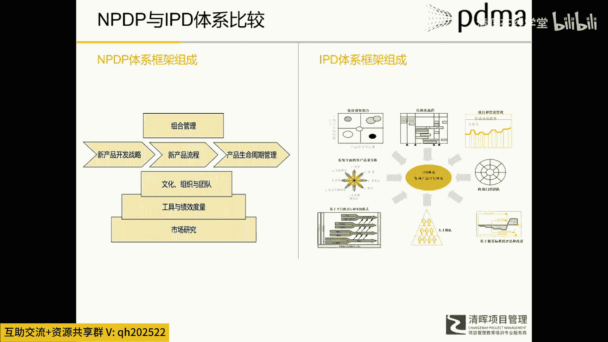
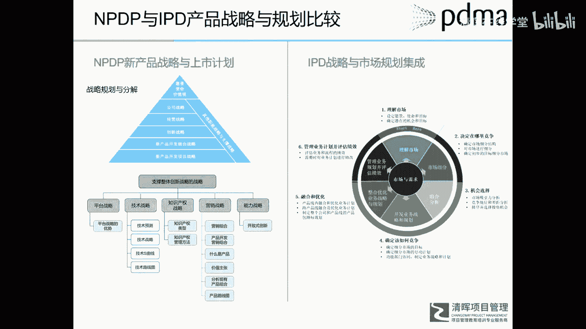

# 华为IPD各模块及流程介绍 - P9：10.NPDP与IPD体系比较 - 清晖在线学堂 - BV1Zz421a7Lj

所以我们介绍了path就是IPD，就是MPTP，大家其实嗯也可以看出来吧。

基本上怎么样逻辑框架，甚至模块理念都是大同小异。

或者说核心思想是一脉相承的。

只是它所表述的方法，或者说呈现的面貌不一样而已。

所以我们可以把它放在一起进行直观的比较啊。

我们先看这个NPDP的体系框架，和IPD的体系框架。

我们看啊，这里边NBDP它有七个体系，对不对，七个模块，新产品战略流程组合。

重生命周期与文化组织绩效。

市场研究对应的IP的体系框架，我们看有投资组合，也就是组合管理。

然后结构化的流程就对应的新产品开发流程。

项目和管道管理对吧，这这是组合管理的一部分。

然后需求管理，这个需求管理呢在这个NBTP里面呃。

属于呃市场研究的那一部分，也相当于进行市场需求的一个分析和研究。

然后有跨部门的团队，这个是相通的。

然后平台开发，平台性开发呢在NPDP里，它属于新产品开发战略的一部分。

有平台战略人才和绩效管理。

这个也都是相通的啊，你看这里做了一个对应。

就是i pd的模块优化图的组合对应的呃。

他这里呢就是既包括产品，市场管理的这几个步骤。

又包括什么要输出那个新产品战略。

这个呢就属于新呃NPTP的产品战略部，它包括营销战略。

产品路线图在里边，结构化的流程直接对应新产品流程。

项目和管道管理对应的什么一个项目管理，项目管理在NPTP里面呢属于工具部分。

管道管理呢属于主格部分呃。

全面的客户需求分析，它对应的是市场营业的需求管理部分。

也就是客户自身那个平台管理，属于平台战略啊。

这里可以每一个都可以找到对应的关系，所以这里呢我就把只有一个总结表啊。

有个总结表，所以RPD的模块。

但这些模块就是每家方法是不一样啊，但是大同小异，i pd的模块和NPDP的模块对应关系。

以及有一本书叫做华为的。

你也能里边那本书所介绍的，IPD的一个对应关系。

所以这里面都有非常额，几乎可以找到一一对应的关系啊。

所以他们基本上呢是还是大同小异，大同小异啊。

这个流程部分额就更加几乎是一模一样的啦。

只是名称叫法稍微有点区别。

哎新产品战略与上市计划。

跟IPD的战略与市场规划，集成在NPDP里边。

他的战略进行了层级分解，然后呢在支撑战略里又有平台战略。

技术战略，营销战略和能力战略。

所以这些战略上都会什么，在IBD的那个六个市场管理步骤里面。

你都可以在这个市场营销战略呀。

产品路线规划图，在那边都能找到相应的方法和步骤。

然后组织与团队，所以这个呢几乎是完全一致的啊，就是不管是path也好。

IBD也好，ABD也好，他们对这个跨部门团队结构的一个设定。

或者说推荐都是一样的，只是在NBDP里边呢。

它不仅介绍这种跨职能团队，他就像项目管理一样。

把职能式结构，轻量级矩阵，重量级矩阵以及自主型团队都介绍了啊。

所以他是一个理论，它是更加的通用，更加的啊普适性。

所以最后呢我对这个IBD和NBDD，进行了一个总结啊。

所以我们讲MPDP，它是一个什么一套完整的理论体系。

知识体系和实践体系，所以他的这套呢是更偏向学术性的。

所以它整合了，如果你学习这个APT段。

你会发现他的所有的理论知识来源都是分散的。

各个就是企业管理各个方面的权威理论。

就是那个颠覆式创新。

企业创新的窘境，那本书里解了，然后有科特勒营销管理的理论。

然后有迈克尔波特的战略理论，所以他呢是呃把和新产品开发管理相关的。

一些管理理论。

就是整合到一起，变成了一个体系，所以它是更加理论。

更加偏向知识的，所以他是一个我们称之为什么知识体系。

我们讲了i pd是IBM和华为这样的特定企业。

运用了Python这样的方法所形成的。

自己独特的一个实践体系，所以IP地是什么。

它是一个具体企业的具体实际体系，那个NBT面是个知识体系和理论体系。

所以如果把他们三个放在一起比较呢。

是什么呢，呃BDB是理论和知识。

path是应用经验的总结，i pd是特定实践，是特定企业的具体实践。

额我们在讲一个理论和实践关系的时候。

是这样子啊，理论是怎么来的呢。

首先呢我们说很多理论，特别是管理理论啊。

都是从实践中来的，这首先会有大家在实践中呢，会形成一些不成文的体会和实践对吧。

这是知识的第一步。

然后这些不成文的体验和实践呢，会总会有人把它形成一个什么呃文字。

比如说那个经济思想。

是在丰田考虑到生产体之后对吧，他的创那个大爷那英就写了一本分庭生产系统。

这个就是把什么不成文的实践和体会。

变成了一个文字或者一个实践的总结。

有了这个实践总结呢，可能就会引起一些理论研究人的注意。

他们呢就会把这种实践的总结啊。

作为更为广泛的研究和收集，最后归纳总结成一套理论。

那么归归纳总算理论之后呢。

他又会拿着这套理论去进行实践。

在实践中呢不断的修正自己的理论，使其实理论更加什么更加的通用性。

更加的正确，所以这就是理论和实际的一个关系。

那么如果放在这里，我们看呃n p DP path IP的话。

那么i pd就是企业的成文的具体的实践体系。

path呢是在很多企业这个具体实践的总结出来。

一套的应用，或者以经验经验总结的方法体系。

那么NPDP呢就是一套理论知识体系了，所以这三个是这样的一个关系。

比现在很多企业呢都直接去学R华为IPD。

有很多企业呢就是没有成功，所以G的问题是什么呢。

就是IBD是华为那一套原原本本原汁原味的，它一定和华为的具体的情境相结合的。

所以当你把IPD华为IP拿过来用的时候呢。

如果就是你没有能力把从他的实践体系。

总结出他背后的理论和内在逻辑，直接照搬照抄的话。

很可能就发生那种什么不实用的情况，所以我们说我们既要借鉴他人的一个具体实践。

又能够理解背后的内在逻辑和理论。

那么在我们具体应用这些或者借鉴这些时候呢。

会不会觉得更加有效一些呢，这个呢我想也是大家学习NPDP。

这一个一个一个一个作用。

可能华为的时间IP地，但是没有人讲清楚他那套表格，那套流程背后的逻辑是什么。

那么IPD呃，MPDP就可以告诉你来帮助你解答这些东西。

当你如果真的想再去借鉴IP的时候。

你会发现你会有不同的理解，会有更深的理解啊。

这是最后i pd path和IP，DNPDP关系的一个总结。

那么NBDP呢我们说的是也是外传举。

经过广泛调研之后，就是做出一个慎重的选择，引入到中国的。

他一个是赢，契合的就是未来中国创新呃。

转型升级这么一个趋势，另外一方面，也真真切切是满足了很多企业的需求。

所以从这个数据分析啊，我们也能看出来这个趋势。

这是外专局提供的一些数据啊。

我们从17年开始，就是这3年来看啊，他每年的报考人数几乎都是指数级增长。

你看这是成倍成倍的成倍成倍的在网上额增长。

所以这个我相信啊。

现我相信现在额，咱们中国企业现在什么不缺市场。

不缺资金，不缺人才，但是我们的创新。

为什么搞的就是不如国外企业呢，就是差异什么。

我们觉得在这个创新方面，我们的理念，我们的方法体系还没有更达到国外这个成熟度。

我们先抛开这个方法体系到底好和不好。

但是至少有一点。

当我们用同样的方法，就是国外这些优秀企业或者领先企业。

用同样的方法做产品研发的时候，我就和他站在同一个平台上去竞争。

对不对，然后结合我们自己的心情，这么努力勤奋对吧。

我们这么就这么的聪明才智，当我们在同样的游戏规则下。

我相信我们的企业啊，一定是能够像华为一样。

打遍其实行业里的对手的，所以这也是为什么呃。

中国加入WTO之后对吧，我们在同样的游戏规则下。

在同位偏上协和这些西方国家竞争。

到了今天，他们已经不得不什么，用一些非正常手段来遏制我们了。

所以这也是华为引入RPG之后，能够之所以成功，我认为是一个原因啊，我们先不管方法好和坏。

但至少能够跟国外同类竞争对手用同样的方法。

然后再加上我们中国或中华民族，特有的勤奋和聪明才智。

一定能够什么让我们的企业，会让我们的未来能够在和他们竞争中。

具有什么更加一个强势或者优异的地位。

额这里边呢其实就是星辉的一个课程介绍啊，这个他自动跳。

不好意思，呃清辉治理他的课程呢是呃。

除了这个我们正式说面授课。

或者那个政客之外啊，在这个正课之前，他们会有一个特有的呃系统。

能够什么督促大家，或者说能够帮助大家每天就是每天学习一点点。

然后累积下来A发现有很大的学习，同时他们有每天都有一个小程序打卡。

然后呢在每次上课之前呢。

会有老师给大家做一些直播预习，就是帮助大家对接下来上课内容。

有一个熟悉程度，这样就是有些同学可能有些学员了，在上课时候可能没有看书或者不了解。

就上课效果也会大打折扣，那么有这个直播预习呢，可以帮助你们节省一些时间了。

那最后就是你在一旦报名的清辉的课程之后呢。

就是每年都会有什么很多次的那种免费的一个。

分享啊，沙龙啊等等等等，所以这是清给清辉去做个广告啊。

