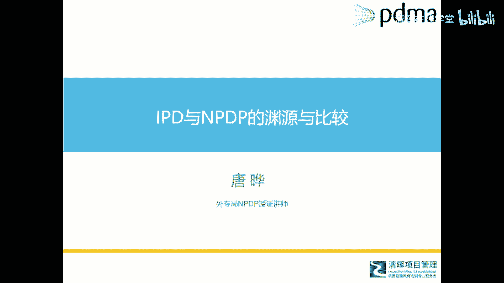

# 华为IPD各模块及流程介绍 - P10：导言 - 清晖在线学堂 - BV1Zz421a7Lj

好了大家晚上好，现在07：30，我们开始今天的直播分享课程呃。

非常高兴在这个特殊的时候，通过网络和大家交流一些。

IPD和NPDP方面的知识和经验，那也非常感谢清晖组织这次呃公益上课啊。

今天呢我们的主题是i pd和NPDP的渊源与比较。

i pd是一个非常热的话题。

我相信随着这个华为的崛起，以及今年从去年开始的美国对华为的打击。

华为额举世皆知啊。

那么伴随着华为举世皆知的，或者说中国最额在中国这边啊。

大家最为呃知道的。

也就是啊跟华为学有关的IPD，我相信很在很多场所或者很多地方会听到。

I p d，而且很自然的会会和华为公司关联起来。

那么这个IPD呢主要是来自于企业。

或者说我们称之为来自于民间，这是一方面，另外一方面呢大概是从2017年开始。

就是官方，也就是中国呃。

国家外专局，现在呢并入了科技部，他们引入了一个叫做NPDP的知识体系。

在对外翻译上就是中文翻译的。

翻译成国际产品经理认证。

其实NPDP它的英文缩写就是N就是new p呢。

是product d是development呃，Professional，就是新产品开发专业人士这么一个知识体系。

其实他说的是新产品的开发和管理。

那么从官方引入这个NPDP以来呢。

呃像当年PMI，PMI的PMP被这个外专辑引入中国一样。

就是在短短两三年内获得了一个爆炸式增长啊。

有点像病毒式啊，我们不能这么形容它。

但是它的确获得了一个爆炸性的增长，也引起了很多企业管理者从业人员那个关注。

大家常常会问这个问题。

是怎么NBDB贴上去和IPD差不多呢，连子之间到底有什么关系。

这个在前几期我们和清辉上课过程中。

也经常有学员会问到这个问题，所以今天呢我们就围绕这个主题。

和大家一起探讨一下，交流一下。

先自我介绍一下，我目前呢是从事这个项目管理，主要是聚焦在新产品研发这个项目管理啊。

也我也是这个外专局额正式授权的。

可以有资格讲授这个NPDP课程的一个老师。

今天我们会围绕会把这个主题，分成五个小小主题来一起探讨。

第一个呢就是IPD的历史和发展历程。

我们弹RPD，弹NPDP，可能我们需要先回到它的原图。

来了解它是怎么来的，它是经过了怎样的发展过程。

然后到今天被我们所熟知，第二个部分呢是关于RPD。

它本身这个体系到底有哪些模块和流程。

这里呢我们会做一个简单的概要的介绍，因为它本身是一个非常庞大的一个知识体系。

或者说管理体系，所以只能说在今天短短的两个小时内。

做一个简要的介绍，第三部分呢我们会介绍官方引入的ABDP。

它到底是个什么东西，它又有哪些和框架模块和流程在里边。

介绍完这三个部分之后。

我们把IPD和ABDB放在一起比较，看看到底它们有哪些是相同的。

有哪些是不同的，以及它们之间到底有一个什么样的关系。

最后我们就是给大家分享一下，NPDP引入中国来之后。

他这个发展的一个脉络，今天我们会围绕着五个主题来呃。

分享中间呢如果大家有什么问题或者疑问。

请发那个文字到讨论区里，在会后额。

本次课程大概最后我们会留个20分钟，到30分钟和大家一起互动一下啊。

那么现在我们先进入第一个主题。

IP地的历史。

