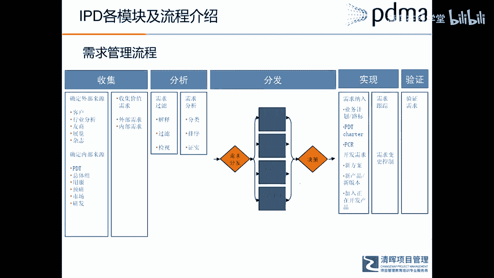
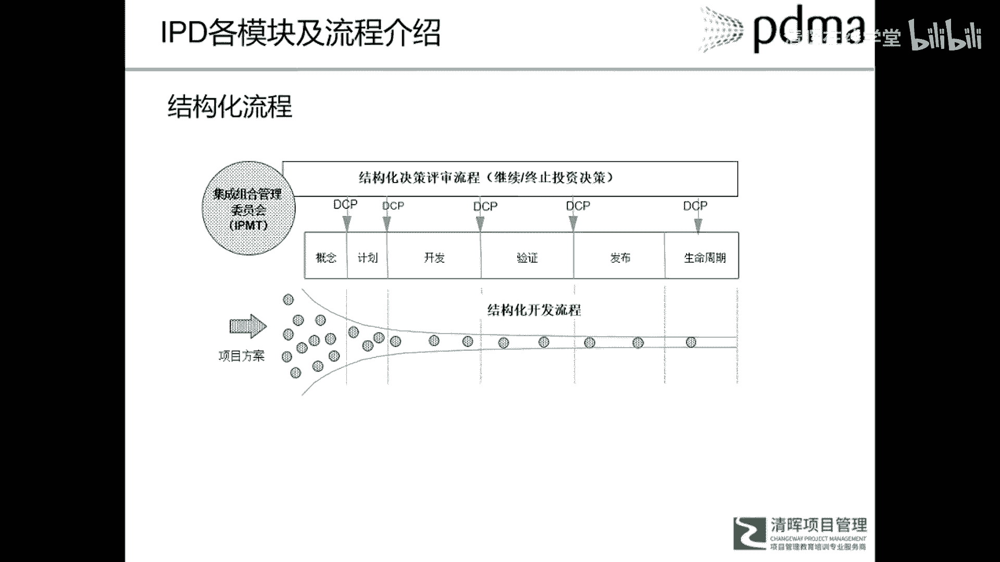

# 华为IPD各模块及流程介绍 - P3：4.IPD各模块及流程介绍 - 清晖在线学堂 - BV1Zz421a7Lj

我们再来稍微就是每个模块再看一下啊，第一个就是市场管理，市场管理就是什么，这里有几大步骤啊，比如说第一步他是什么，从市场细分开始，其实这一块的内容额，市场管理内容，你们去如果有兴趣的话。

去找一下科特勒的那个市场营销管理，大部分的理论或者说理念，都是和那个是一样的啊，首先我们还有理解市场，比如说我们要去这个市场到底什么样，我们要有个初步的理解，第二步是什么。

市场细分就是market segmentation嗯，在市场细分的过程中呢，我们会什么啊，会找到很多很多的一个机会，具有吸引力的机会，对这些机会我们要进行什么综合的组合的分析，到底哪些机会。

虽然你看上去很好，我到底适合不适合我呢，是跟我的公司战略是匹配的吗，跟我的能力是匹配的吗，他的竞争的强弱怎么样，这些都是要在组合分析或者机会选择里，需要回答的问题，当我们选择出呃这些市场机会之后。

我们要制定什么详细的市场计划，包括产品发布计划，市场进攻计划等等等等啊，那么有了计划之后呢，还要把什么呃，不同的产品线或者整体的进整，各种不同产品线进行融合，还跟公司的整体战略进行呃对标和融合。

最后怎么样，在这个执行过程中，我们讲PDCA循环，在执行过程中要不断的评估业务和流程的绩效，适时的对这些业务计划，战略计划进行修改，所以这是呢市场管理的几个步骤啊，他呃对产品开发来说。

在这个市场管理之后需要输出一个什么，也就是产品路线图或者产品业务计划，这些呢是直接和我们新产品开发项目，是密切相关的，也就是说所有的新项目立项的时候，都应该去对照一下诶，是不是符合我的产品业务计划。

是不是在我的产品路线图里面，所以这是市场规划的输出，对新产品项目立项的一个指引作用啊。

所以这是产品规划的一个部分，那么第二部分是需求管理啊，需求管理就是单独拎出来的，已经提高到一个非常重要的地位了，所以需求管理呢首先对，这是i pd的一个需求模型哈，它把它的缩写什么啊。

appears就什么就完整的从几个维度来定义需求，应该怎样去描述，所以这个呢是华为这个做法啊，你也所以我们坚信他的思想不能照搬照抄，如果你的行业跟华为有很大的不同，你不一定一定要按照他这个来定义。

你可以从自己的实际出发来定义。

到底需要从哪几个维度来定义，一个产品的需求啊，所以这是需求模型，那么需我们定义了一个需求如何去描述之后呢。

接下来就什么就是去收集需求，那这里还有一个完整的一个需求管理过程。

所以它也是一个完整的流程啊。

不是说呃非正式的或者几场客户访谈。

就算是一个很好的需求管理啊，所以他们把整个需求管理分成了收集分析。

分发实现和验证。

当然这是指也只能供大家参考，你可以结合自己公司的实际啊。

结合自己公司的实际进行一个流程的一个设定。

所以这是需求管理过程啊。

那么结构化的流程呢，其实和path的结构化流程几乎是一脉相承的啊。

但是这里呢他的阶段划分就比那个path更进步了。

比如说他自己分成六个阶段，有的公司呢可能有三个阶段。

五个阶段，七个阶段都有的啊，但是思想是一脉相承的。

有概念阶段，计划阶段，开发阶段，验证发布和生命周期呃。

有很多公司把生命周期呢，呃因为到进入生命周期维护阶段。

已经进入什么运营阶段了。

所以对新产品开发来说，当产品成功的发布到市场。

把新开发的项目转移给运营团队，这个产品开发项目就算是结束了啊。

这是i pd的结构化流程啊。

那么平台化开发，所以平台在这个进化到，因为一个公司什么产品性越来越多。

或者说产品越来越复杂的时候。

所以平台化的概念就是越来越重要了，所以就是强调了平台化对一个产品开发。

或者整个公司的一个竞争力的重要影响，所以这个平台化一个什么概念呢。

就是它有几个要素啊，第一个什么我们叫共用模块。

就是尽量的什么呀，尽量比如说我一类似的同类产品。

或者一个家族产品，我尽可能的设计或开发出一些能够通用的。

零件呀，模块呀，子系统啊等等。

这个我们叫做共用共用物理，物理那个层面的一些设计啊，就物理共用物理系统。

那么还有一个那个概念就是技术概念哎。

可能他的物理物理上看着不一样，但他背后的那个技术啊，所谓的基础这些知识和经验了。

他都是一样的，都是同一个平台上的。

这是一个技术概念，还有个什么平台性的概念，就是很多在软件行业。

它会有一个平台性的概念，一个一个软件开发平台或者一个底层代码呃。

作为一个平台的基础啊，所以这个呢是对平台化开发的一个好处。

就是什么在同一个平台上，你可以快速的推出一系列的新产品。

就大大缩短了一个新产品开发的周期。

同时也大大节省了投入的资源。

另外就是在产品运营和维护的过程中，也可以帮助提高效率。

节省成本，这是平台化对新产品开发或对整个公司来说。

一个价值和意义，那么另外一个就是矩阵式团队啊，矩阵团队和这个核心团队也是同样的概念，这里边你看他在核心团队呢，有一个叫核心团队的leader，它是对整个项目发挥直接的或者综合性的影响。

也就是说这个项目要往哪个方向去，项目做决策，这个人呢发挥了一个主导性的作用，然后每一个额职能代表呢，它是代表相应的职能部门，但代表这个职能部门什么意思呢，并不是说哎他就是呃代表那个部门的一个，怎么说呢。

额利益呀或者怎么样，他所谓的代表是代表那个职能的一个，能力，我们现在很多情况下把职能部门定义为什么嗯，我们叫做呃company center，就是能力中心，他从那个部门来。

他代表了那个部门所掌握的一些知识和技能，或者说这个项目所需要的知识和技能，但是在这个项目里，这个组员他的核心目标就是这个项目的目标，他有一个目标，同时他要对这个目标要负责，并不是说诶他是代表别的部门。

当这个目项目目标和职能目标冲突的时候，他这样说，哎对不起，我不忙，不是这样做的，所以我不同意，这个就是不是一个啊，这种团队设计设计的一个理念啊，不是不是这样的组员啊，所以职能部门更多的是帮助这些。

解决一些技术问题，提供一些技术支持，而不是项目一个日常接触。

日常的决策啊，最后最后属于跟那个pass也是一样，什么这个体系也需要不断的进化和演进，那么在RBD呢，他又把这个成熟度分成了五个阶段，第一个阶段我们称之为叫基本工具的使用，有些有些公司还没有完整的。

或者成熟的一个体系和流程，但是他已经在使用一些产品开发的一些工具了，所以这个呢我们叫做工具使用阶段，那么第二个阶段呢就出大家开始什么，进行跨部门协作了，组成的项目型组织，就是按项目化运作这个产品开发。

这是叫第二个等，第二个程度就第二等级，这时强调的是项目与团队，跨职能团队和项目管理，同时呢我们会更多的考虑什么，设计的时候可制造性的设计就是设计DFM，这是第二个阶段，第三个阶段呢就叫客户聚焦了。

或者说客户呃新生的一个研究，我们说市场导向，需求导向，这时候呢我们要更加的重视，聚焦于收集客户的需求，去分析客户的心声，以基于客户需求进行设计，这个进化到第三个阶段，第四个阶段就是我们有组合的概念了。

就是我们有一堆一堆的项目，我要把它组合起来，从宏观上进行管理，这样能更好的跟我的战略进行结合，所以呢这是组合这个概念，最后阶段怎么就变成一个标杆性的企业了，我们已经进化到一个什么。

以知识技能创新和知识管理这么一个阶段，知识管理能力开发和一个文化的额竞争力了，就是公司发展到一定程度啊，他的文化以及文化理念，已经成为他什么核心竞争力之一了，所以这是IPD体系演化的一个路径。

或者说成熟度模型了。