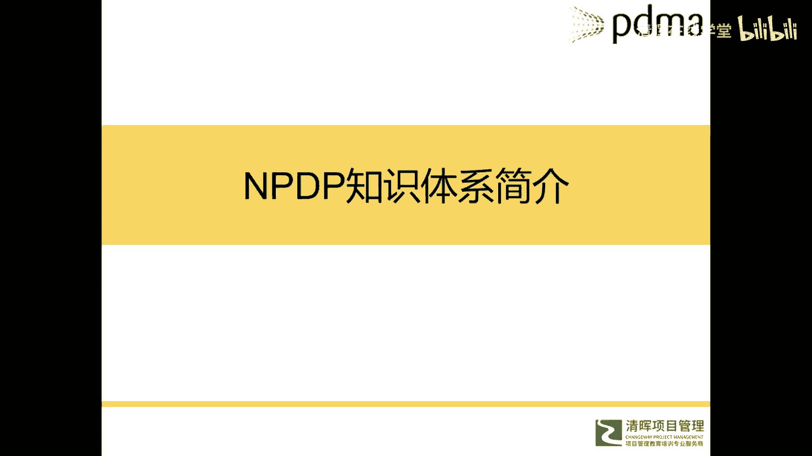
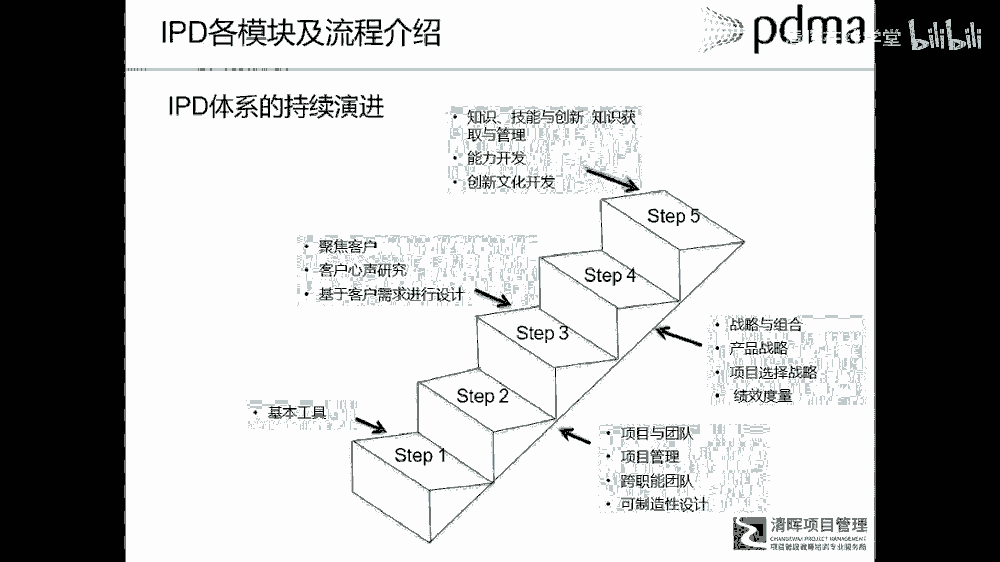
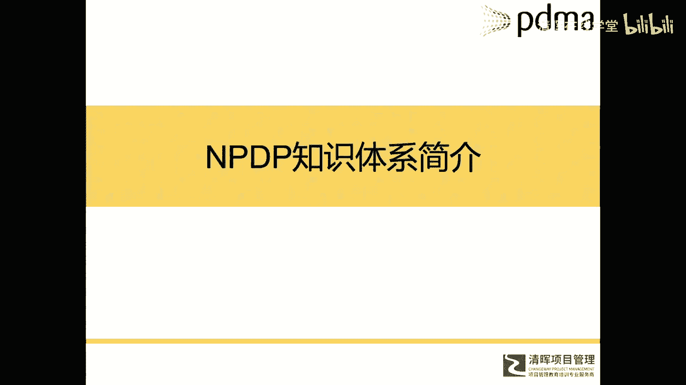
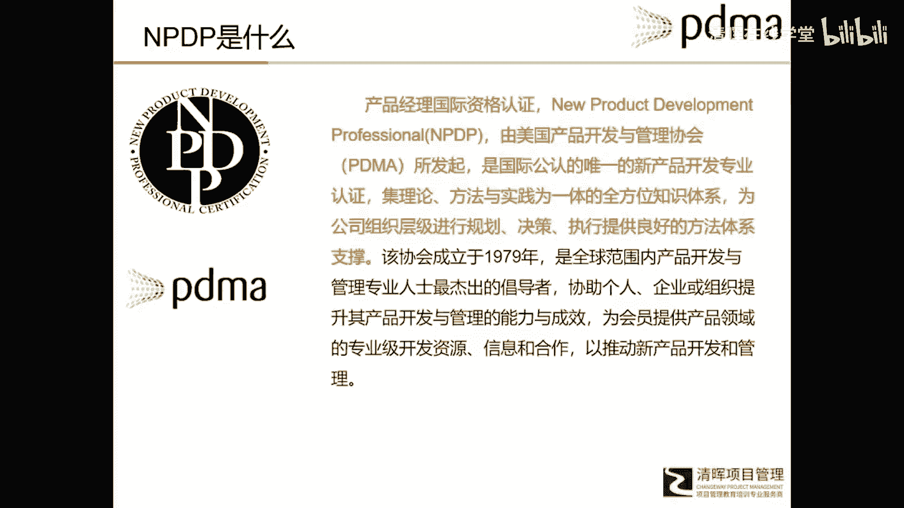
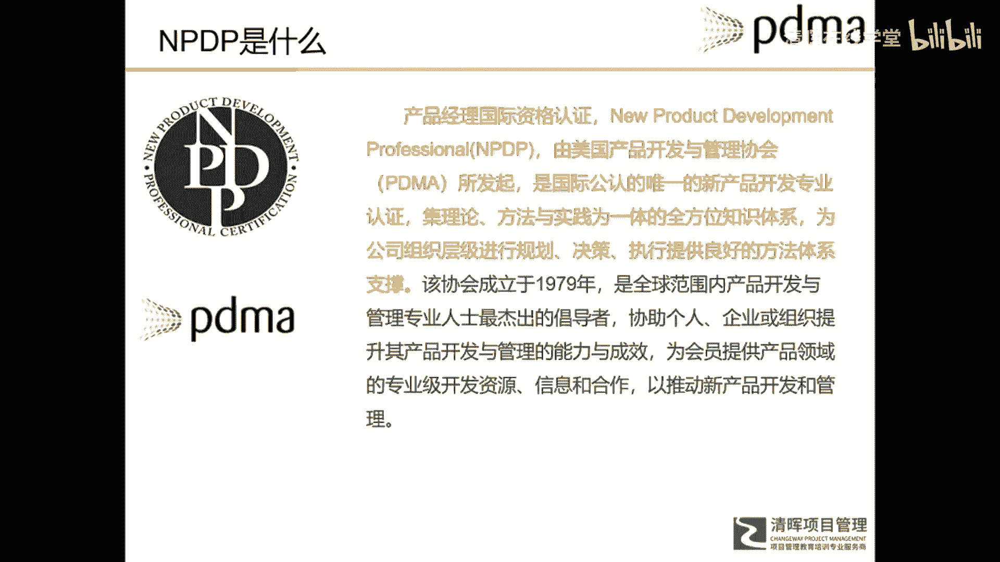
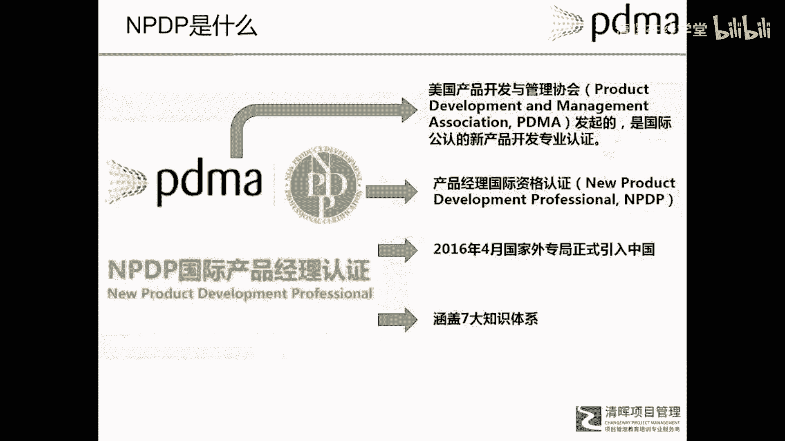

# 华为IPD各模块及流程介绍 - P4：5.NPDP是什么 - 清晖在线学堂 - BV1Zz421a7Lj

那么刚才介绍了i pd的模块和它的体系啊。

所以接下来呢我们再看看，今天我们讲的主题是什么，是IPD和NPDP的渊源，那么今天我们介绍第三个体系叫做NPDP。

那么什么是NPDP呢，他呢相对来说比较新啊，引入中国也就3年左右，它的全称叫做new product developer professional，就是新产品开发专业，它是由美国产品开发与管理协会P。

叫做pd ma所建立的，在那个裴斯的力量这本书啊，你会在他的序言里找到，当年就是他们在构建那个pass的时候呢，那个创始人特意提到，他们在研究说，如何去跟那分田的那套以准时制为嗯。

标志着这个生产体系的竞争，来研究如何从开发角度去竞争，他在探索这个产品开发流程过程中，他们也提到，估计是他们自己在研究嗯，很多别的人啊，包括他提到了PDMA，也提到了一些在创新领域的一个著名专家。

什么金克拉克这样的人，也同步和他们在，因探索这个新产品开发的相关的方法，所以BDMA呢是有很悠久的历史，它呢更侧重于一些理论和学术方面，因为PRTM他是一个什么啊咨询公司。

所以他更注重于一个商业和实际应用，所以MPDP呢就是由PPDMA，就美国产品开发与管理协会发起的，就目前为止是国际上唯一的一个，就是具有权威性的新产品开发专业的认证，对他这套知识体系呢。

我们称对知识体系啊，和这个path以及IPD，它是概率上还是有些不一样的，我们针对知识体系，这个知识体系呢，即理论方法与实践为一体的全方位知识体系啊，为公司进行组织级的规划决策。

提供良好的方法体系支撑，呃现在这个NPTP呢他有一本教材。

有一本教材，所以这个等一下会给你们介绍这个教材呢，它只是为了大家嗯或者这个认证呃，辅助用的，其实NPDP它对套知识体验有很多的书，很多的理论，所以它是一套非常宏大。

非常和宏观，也非常深度的，一个全方面的理论体系和知识体系，那接下来我会给大家介绍一些这些东西啊，所以这个NBDP这个体系呢，是由PDMA发起建立的，那么NBDP这个国际产品经理认证的啊。

当然也是由PDMA协会去发起的啦，呃中国引入呢也是16年的时候才引入，是国家外专局引入的，那么，外端局在引入这个NBTP认证的时候呢，他们也做过很多调研，就相当于他们引入的知识体系啊，也做过很多调研。

这个背景就是什么呢，和国家的那个创新转型啊，所以他们经过调研发现就是产品创新，产品开发这一块是非常啊，符合咱们中国未来二三十年这个实际需求的，所以经过多方的一个调研和考察呢。

他们最后把PDMA这个NPDP这个认证体系，就引入到中国了，这是一个背景啊，呃所以外端局现在并入那个科技部，也是有一定的额含义在里边，科技部其实也发挥核心作用在里面啊，所以外单局并入到这个，科技部里边。

所以相当于为什么为国家引入一套治理体系，也是帮助中国的企业创新升级。

