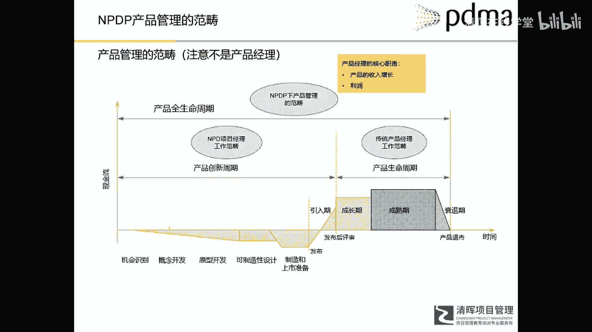
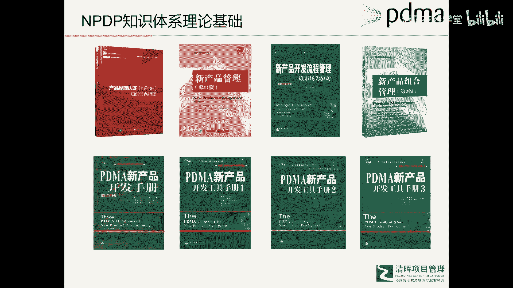
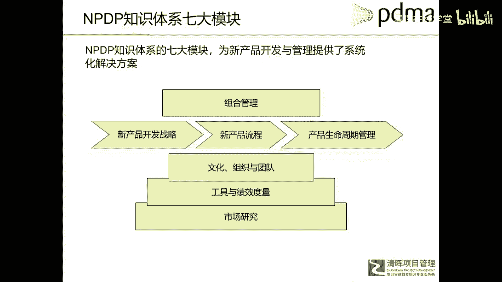
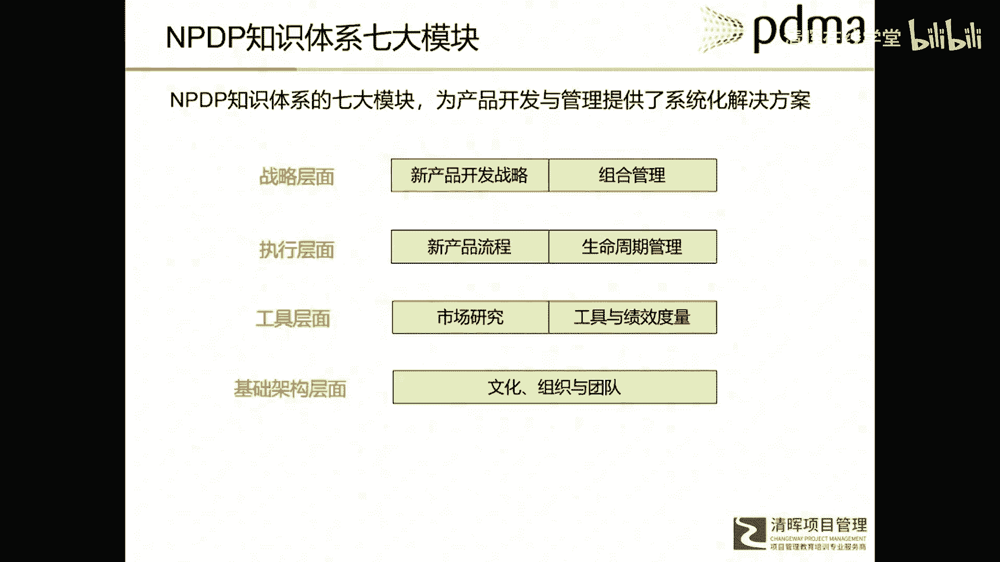

# 华为IPD各模块及流程介绍 - P5：6.NPDP知识体系七大模块 - 清晖在线学堂 - BV1Zz421a7Lj

那么NP这个呢，因为NPDP它的发展说一直没有停过，所以更比PRTM甚至更早，所以他的理论呢更加的呃宏大，或者说更加的全面呃，如果说i pd是一个特定企业的具体实践。

那么path呢是很多公司实践的一个呃经验总结，那么NPD面就是一个庞大的体系了，我们说越是上升到理论的程度，它的适用性或者说呃需要更加的普普遍，对不对，所以在这里边呢他就是讲的非常全面了。

但是他也有个缺点，就是说越是全面实用性越好的理论，当和实际结合的时候就越是困难，就需要对人的能力要求就更加的高，所以在这个NPDP里面呢，他把新产品开发呃，称之为叫新产品管理了。

因为新产品产品不仅有开发，还有整个什么上市以后的一个管理，以及在正式立项前额如何去收集这些需求，把整个的新产品开发啊，作为一个完整的一个从头到尾过程，比如说从他没有孕育，就像一个孩子一样。

从怀孕开始一直到最后人的死亡，把整个过程都纳入到这个NPDP呃，这个体系研究有个范畴，所以在NPDP这个概念下，我们称之为中文，称之为产品经理认证，所以在这个体系下，这个产品经理啊，或者说产品管理。

我们用产品管理可能会更好一点，因为产品经理是企业的一个职位头衔，在不同的企业里，产品经理的职责定位是千差万别的，所以产品管理与产品管理呢会更加通用一些，因为不管你在企业里如何进行呃职职位的划分。

但产品管理这些事还是那些事，所以在n p dB这个体系下的产品管理，它是一个全过程，或者更加广于这个全额寿命周期管理，这个生命周期，也包括什么产品的创新周期和一个产品，传统的产品生命周期啊。

传统生命周期就是指的产品上市以后的引入期，成长期，成熟期和衰退期，那么在产品的创新周期内，就包括什么机会识别概念，开发什么原型设计制造上市发布等等等等，这是在NPTB这个体系下，新产品管理的一个概念。

所以这个新产品管理就包括产品开发的啊，我们已经从产品开发这一个额范围，扩大到整个产品的生命周期里边。

所以NPDP啊，这是NPDP的一些主要的一个出版物，这本红书呢就是我们考试的一个主要教材，所以其他的黄书啊，还有些书没有列出来，都是这个NPDP这个知识体系架构下的，一些理论书籍，由以理论为主要的。

有以工具为主要的主要的，所以还会提供一些更加实用的东西，所以它是一套什么理论知识和实践体系，使呃有道理的啊，咱们不能仅仅可能大家更多的会呃，看了一本认证体系指南，但那个仅仅是一个浓缩的吧。

它庞大体系是有这么多理论支撑的啊。

呃刚才讲ABDP这个知识体系呢，它是把产品管理这个范畴，从产品开发扩展到产品整个生命周期这个管理，所以在这个理念下呢，NBDP在这个教材里啊，这个教材里他也把知识体系分成七个模块，所以很有意思啊。

它也是有七个要素，七个组成部分，然后IPD7个要素，七个核心思想也是七个组成部分，NVDP呢它也是七个模块，那七个模块呢包括新产品开发，战略组合管理，新产品流程，产品的生命周期管理，文化组织与团队。

工具与绩效度量，市场研究我们也一样，我们来看看这个七个模块到底是哪些。

内容在里边，我把这七个模块呢进行一下梳理，所以从分成四个层面，所以第一个层面我们叫战略层面，就是把经营产品开发战略和组合管理，放在这个层面，因为新产品开发战略呢，它是呃战略会飞出很多的层级。

比如说从愿景使命开始到公司的整体战略，再到事业部的业务战略，然后到创新战略，然后到产品线战略，产品战略呃，项目战略等等，在这个战略指引下呢，我们会有一个项目宏观上的一个组合管理，所以组合管理呢更多的是。

如何确保我所有的项目组合，和我的战略是高度匹配的，对我的战略是有真正贡献的，同时我要监控整个战略的执行情况，所以我把新产品开发战略和组合管理，放到这个战略层面，那么第二个层面就是具体如何去做。

这个层面的模块，是新产品开发流程和生命周期管理，新产品开发流程就是确保如何从战略出发，有了产品战略，然后我收集客户需求，最后经过一个管道转化为一个上市的产品，这么一个过程，产品上市之后就进入传统的呃。

这是目前很多产品经理的职责范畴，就是产品的生命周期管理，在产品的引入期，成长期，成熟期和发布期四个营销组合，我如何的动态调整，所以这是执行层面的两个模块，在工具层面呢。

在这本书里他介绍了很多的市场研究方法，还有新产品开发过程中的一些工具，包括绩效如何度量，所以呢这是市场研究和工具效度量，我把它放到了工具层面，另外就是一个公司的组织架构，基础制层面。

比如说有什么样的公司文化，公司的组织架构如何来设定，以及他的团队模式是怎么样，这为整个产品开发或者新产品管理，提供了一个组织架构方面的基础设施。

