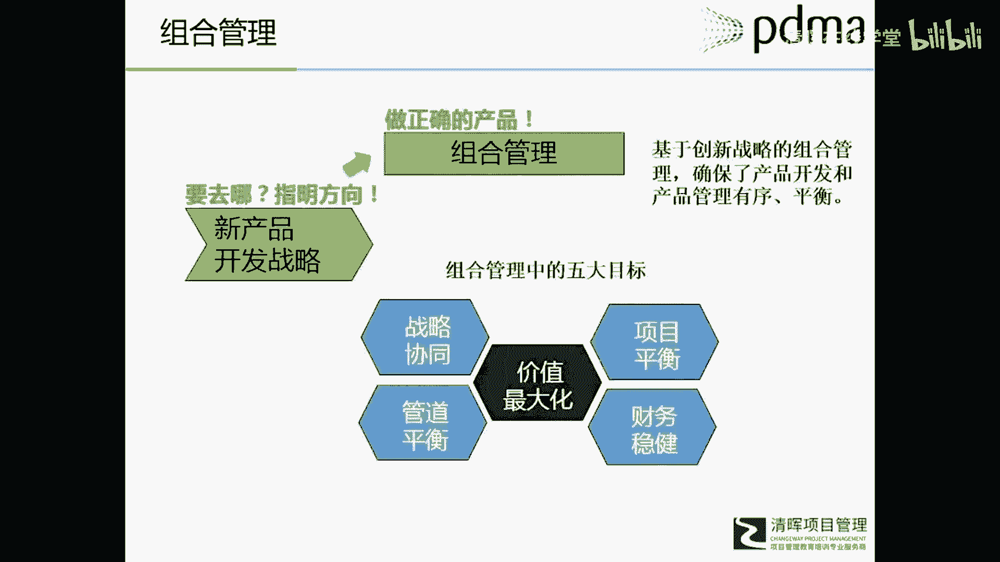

# 华为IPD各模块及流程介绍 - P6：7.新产品战略 - 清晖在线学堂 - BV1Zz421a7Lj

那么我们看看具体的这个模块的内容啊，第一个是新产品战略。

所以新产品战略呢，他就把额战略分成了很多的层级。

然后呢每一个战略都做了相应的介绍。

比如说什么是愿景，什么是使命，什么是价值观呃。

在创新战略里，这本书里介绍了很多。

包括迈克尔波特的嗯，细分市场战略。

还有迈尔斯斯诺的战略呃，克里斯登生的颠覆式创新战略等等等等啊。

我们看到很多有四个主要的创新战略框架。

会在这里边进行介绍，同时也介绍了一些支撑战略战略。

我们叫做辅助战略或者支撑战略，包括知识产权战略。

营销战略，技术战略能力战略等等等等啊。

这是新兴产品战略模块里的内容，所以战略对我们新产品开发来说。

它就是一个方向，就是一个框架。

告诉我们要去哪，为我们新产品开发和整个产品管理啊。

提供目标和方向的，所以战略为指引的新产品开发。

这个呢就是解决了很多什么问题呢，呃我相信现在还有很多公司。

他们在产品立项或者呃开发过程中啊，不太或者不知道怎么去考虑。

如何让我这个项目跟我的战略去关联。

或者说他的一个出发点，就是诶这个项目听上去很好诶。

我有能力做，然后就做了，那么他的战略方向在哪里呢。

我这个战略方向要求我聚焦在哪里呢，可能不知道对吧。

可能反正大家这个项目只能做书，还能赚钱，反正就去做了。

但其实对一些优秀企业来说，比如说华为吧，华为有很多额很多领域他们是不去碰的对吧。

经常大家在网上看到一些任正非的发言。

他就很明确的告诉那些企业高管，某某某领域绝对不能碰。

那不是为了战略方向，对不对，最著名什么房地产。

还有那个有些事业部门要做一些事情，被他给打回的，这就是战略聚焦。

严格的按照我的战略，按照我的战略方向去投入我的资源。

去额挑选我的项目，这是新产品战略对产品开发的一个指引作用。

第二部分就是组合管理，如果说产品战略告诉我们要往哪里去。

方向在哪里，那么组合管理来说有了方向。

有了指引，我到底应该做什么项目。

如何确保我做的项目就是我应该做的，或者我们称之为正确的项目。

我们说一个事情成功有两个要素。

一个什么，这个事情本身是正确的，比如说做正确的项目。

第二个我们正确的做项目，就是在做的过程中，我的方法是有效合理的。

组合管理就解决了一个什么问题呢，挑选正确的项目这个问题。

所以基于产品的战略进行项目的挑选。

组成为的组合管理，确保产品开发跟战略去匹配的。

去能够我的跟我的战略进行协同的。

而且能够什么，我们说如果把新产品开发作为一项投资来说。

我需要我的投入能够价值最大化。

同时我还要考虑我的项目平衡，管道平衡。

风险平衡以及财务稳健，这个是组合管理的五大目标呃。

具体这里不展开了啊，大家如果有兴趣可以去呃进步的学习。

这是组合管理的部分，也就组合管理，把战略和项目直接架上了一个桥梁。

第三模块就是新产品开发流程呃，这个因为NBDB它是一个全方位的知识体系，所以他就建设了各种各样的新产品开发流程，包括IPD的阶段流程，也就是罗伯特库博的门禁关口管那个管理流程，同样还介绍了I。

他在这里呢，他把IPD作为一个产品流程来介绍，其实IP地它也是一个完整的体系啊，还介绍了敏捷开发流程，介绍了精益开发流程，也介绍了传统的瀑布流程，就是把相关的产品流程都介绍了个遍。

这是新产品开发流程的部分，所以流程的部分呢，就是解决我们说正确的做事情这个问题，我们的组合管理，是确保我们做正确的项目或产品，新产品开发流程，就告诉我们如何正确的去开发产品，如何去正确去做项目啊。

这是新产品流程的部分。

第四个就是产品生命周期管理，这个生命周期呢就指的是传统的生命周期了。

引入成长，成熟衰退期，那么对于一个产品经理来说啊。

产品的价格。

产品本身的性能或者功能额渠道。

通过什么渠道去销售，以及如何去营销这个产品。

就是营销组合四个P了，在不同的生命周期阶段。

不同的市场环境下，这些什么都需要做动态的一个调整。

那么在产品生命周期这个模块里呢，就介绍了一些随着生命周期的不同。

我四个营销组合调整或者设定的一些原则。

这些动态调整或者生命周期管理的目的本身呢。

都是为了什么。

为了实现我这个产品的价值最大化，尽可能的什么赚取更多的利润。

获得更多的销售收入，这是生命周期管理模块嗯。

另外三个模块有文化，组织与团队工具和绩效度量，市场研究，在文化组织与团队里面就介绍了公司的文化，如何影响这个新产品的管理，在这个公司文化的一个营造构建上，各个管理层呃，不同角色的一个职责和作用。

以及公司的组织与团队如何来设定，更加适合去做新产品的开发与管理，这是什么文化主义团队这个模块所讲的内容额，另外我还有工具与绩效度量两分类，建设了很多的工具啊，包括呢把项目管理作为一个工具也在里边嗯。

介绍了有呃创意生成的各种工具，有财务管理的工具，有那个KFD，有需求管理的一个工具等等，包括决策树等等，有很多很多工具啊，后面会有一个大概的展示，还有一个模块就专门介绍市场研究的，就各种市场调研的方法。

以及它适用的情境，能够达到什么样的目标，都做了一个呃，相对比较细致的介绍或者系统的梳理。

这是NBDB7个模块的一个简要介绍，额现在大家看到这个页面呢，就是我们考试用这本教材，它的一些主要内容在里边，你们看新产品开发战略内容，战略的结束，角色组织的身份和方向，创新战略框架。

有波特的迈尔斯的战略框架等等等等，这个我们就不详细介绍了啊，有兴趣可以多花点时间。

