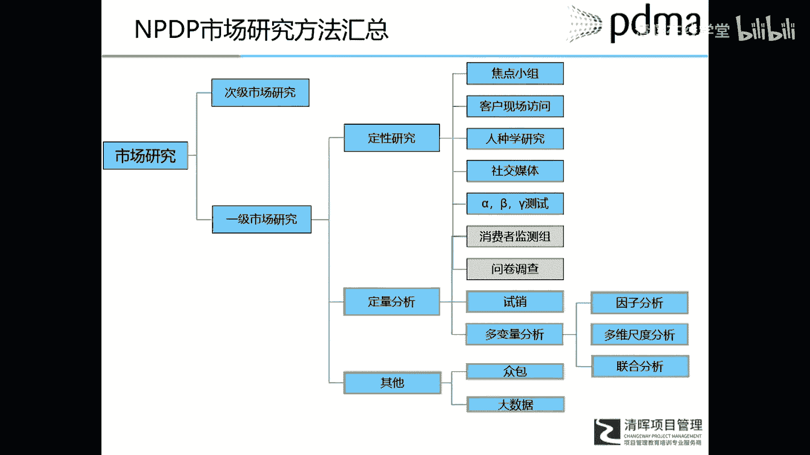
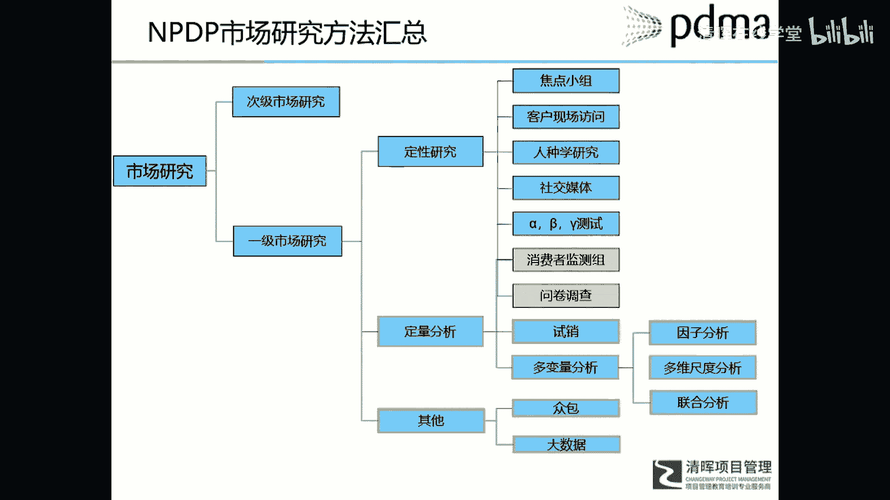
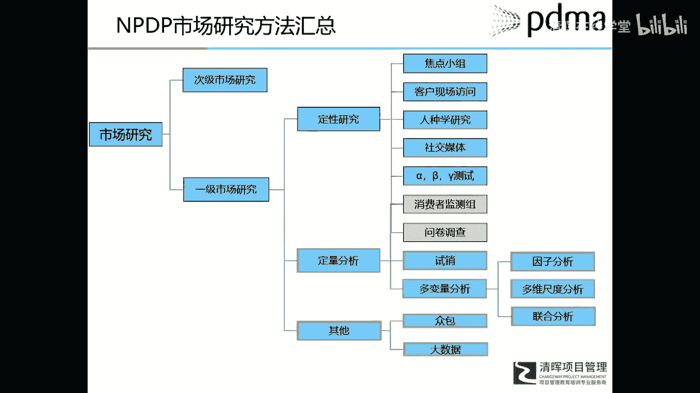
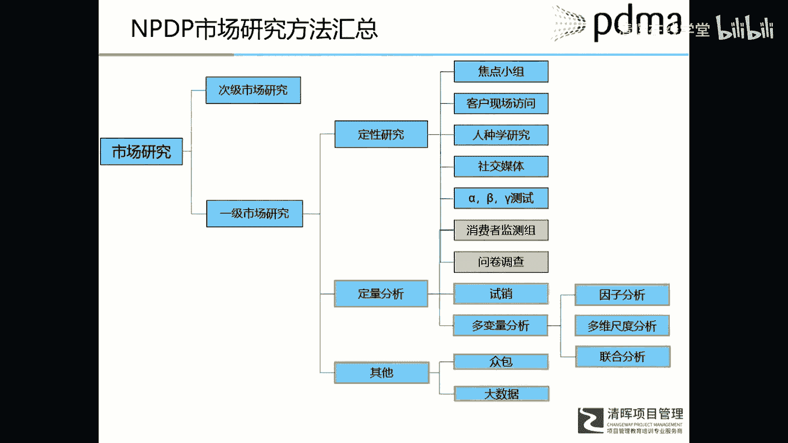
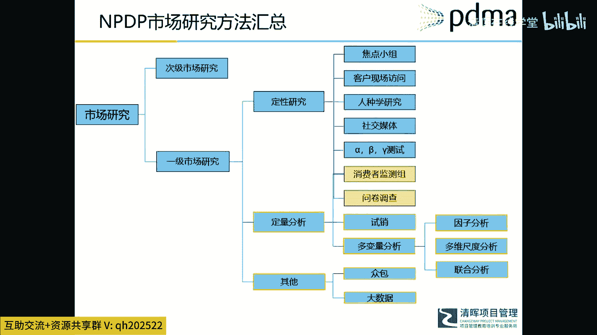
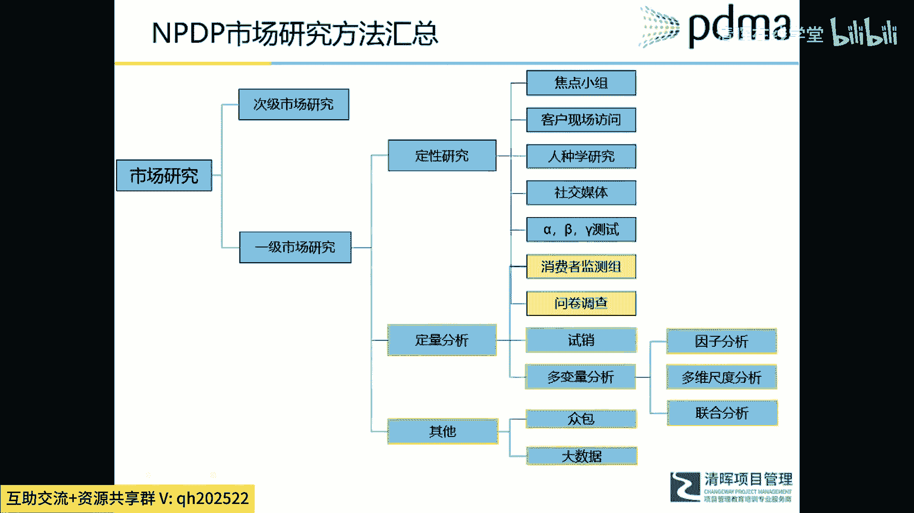
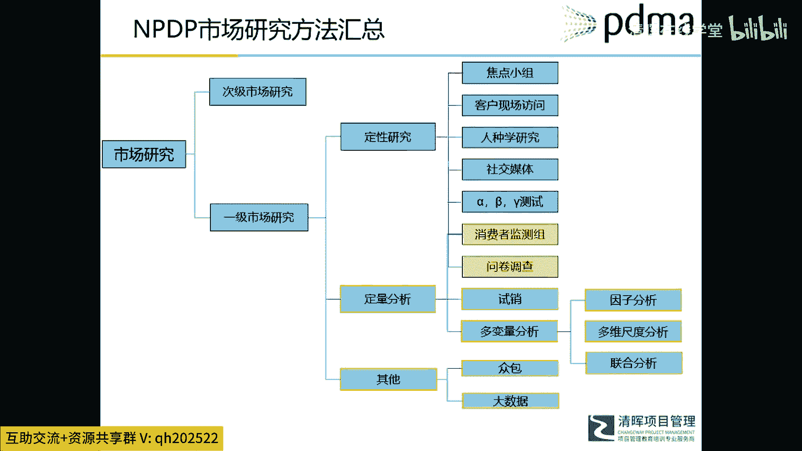
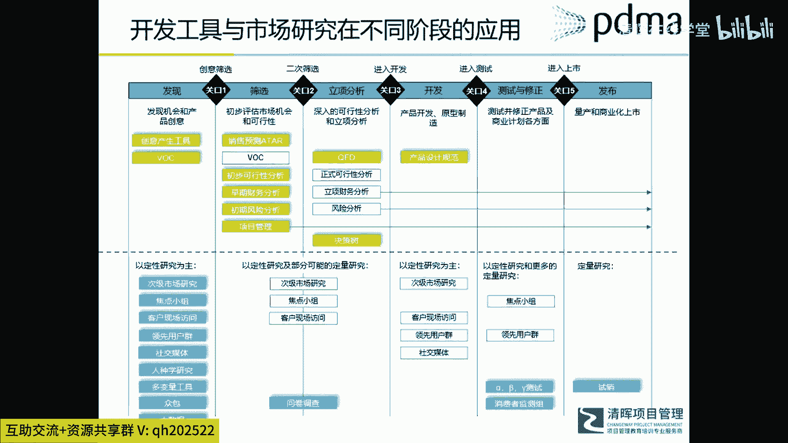
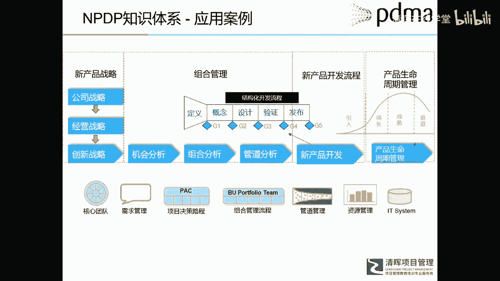
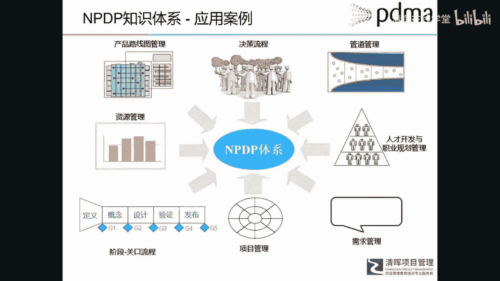

# 华为IPD各模块及流程介绍 - P7：8.NPDP市场研究方法汇总 - 清晖在线学堂 - BV1Zz421a7Lj

这就是这本书里，现在这个页面呢，是这本书里所介绍一些市场研究。

比如说市场研究，它分成次级研究和一级市场研究。

然后一级市场研究分类定性研究，定量分析。

其他等等等等啊，也介绍了当前互联网最流行的给众包。

这么研究方法，还有大数据方法等等，就技术性比较强了。

或者说是呃工具的实用性也比较强了。

所以这个书呢既有理论又有实践，还有工具。

你总能找到一些呃非常适合你的地方啊，这个页面呢就是我把这本书里所介绍的工具，以及市场研究，大概的一个应用场景做了一个梳理，所以如果我们按照这个阶段关口流程来看的话，我会看到啊。

在发现就机会发现阶段我们有创意生成工具，这本书里介绍大概十种左右的一个，创意生成工具，还有VOC，整个管理流程是什么样子，在筛选阶段介绍了呃，销售预测模型ATAR，还有可行性分析工具，财务分析工具。

项目管理工具等等，在逆向分析站，有一个可行性分析的一个完整的一个框架啊，市场营销部分，我们看有啊有焦点小组额领先用户群，社交媒体等等等等，阿尔法贝塔伽马测试等等等等啊，这个呢我相信嗯。

这些工具是实用性应该是还是比较强的。

所以他呢也不是把所有的工具都介绍了，他选用学就用的最广的一些工具做了一个介绍，呃这里呢我是指以某一个企业，就是这个企业呢也是请的PRTM公司，帮他设定了一个呃整个新产品管理，一个架构体系。

所以这个呢就是和NBADB所介绍的理论，完全契合了，我们看啊他这个体系里包括什么新产品战略，就有公司战略开始到经营战略的创新战略，然后有了组合管理，组合管理它不仅是项目，就是已经存在的项目组合管理。

还包括什么呢，包括还没有变成项目的一个商业机会，的一个组合管理，然后有了这些机会组合管理，最后什么把这机会转化成一个项目，就进入这个新产品开发流程这样一个管道里，那之后呢就是新产品发布之后。

有产品生命周期管理，它的支持模块包括什么跨部门团队与核心团队，需求管理，项目决策流程，组合管理流程等等等等啊。

所以他的这个就是这家公司的一个实践体系啊，基本上和IPD或者path，还有ABDB所介绍这些模块也是对应的，有产品路标管理与路线图管理，派克决策流程，管道管理，资源管理呃，人力就是人才开发。

梯队开发这种管理需求，项目阶段性流程等等等等啊，所以这个体系呢我们今天介绍比较概要啊。

比较概要。