# 华为LTC流程变革，加强各部门对客户界面铁三角的有效支撑 - P1 - 清晖在线学堂 - BV1vT411h7zg

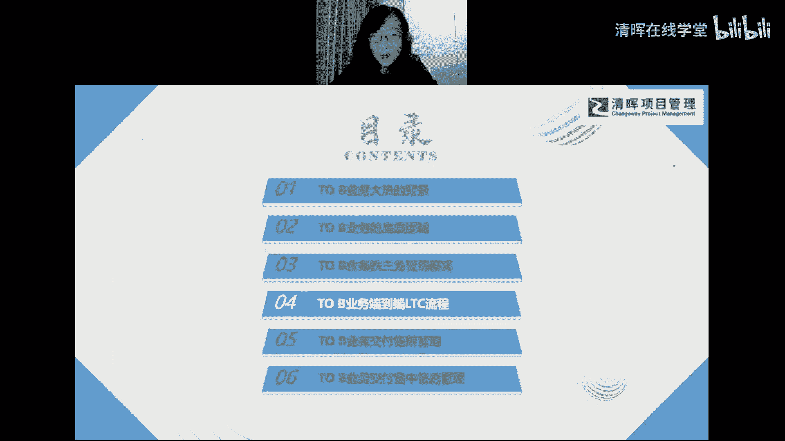

我们整个的l t c流程啊，那l t c流程呢，首先呢跟大家聊一聊ltc流程的缘起啊，那l t c流程呢是铁三角整体的运行经验，推广之后呢，然后大家看到是加强了各个部门对于，客户界面的一个有效支撑啊。

所以其实啊，这个l t c流程是为了支撑这个铁三角整个的，模式的一个落地的啊，大家知道这个关系就可以了，那华为是在06年开始推行的铁三角模式，然后从07年开始。

我们就开始进行了i o t c流程的变革哦，所以它就是1年的时间啊，1年之后我们就要推行ltc，因为你这个铁三角出来之后，那你马上l t c就要跟上，对不对，那在09年的时候。

09年又运行了2年的l o t c流程，这时候呢我们的任正非，任总就发表了一个关键的内部讲话啊，对这场变革给予了充分肯定啊，然后也进一步固化了这个l t c，对铁三角的支撑啊。

大家知道这个内部讲话是什么啊，也是一个特别有名的讲话，大家在很多的渠道或者报道上其实都看到过啊，然后刚才我其实也提到过这个讲话，就叫谁来呼唤炮火，如何及时提供炮火支援啊。

那这个讲话呢其实它透露出了两层含义哈，那刚才也给大家讲过了啊，第一就是说华为强调什么呢，第一个概念就是炮声啊，什么叫炮声，就是来自于市场一线的客户声音啊，这个是炮声，那谁能谁能听得见炮声的。

一定是铁三角的团队，就是真正贴近于市场一线团队，贴近于市场一线的这个客户需求的团队哈，他最能够听到最准确的炮声哈，那如果是靠后台相对比较，后台的或者中台部门啊，他可能就听不到炮声啊。

这炮声是传不到他耳朵里，对不对，这是炮声啊，那第二呢就是炮火啊，什么叫炮火呢，炮火是指的是我们的各种资源啊，就是这个给给资源对吧，才能办成事儿，对不对，所以你是不是要需要各种资源，才能把这个事情做成啊。

把这个交付成功落地，那么在这个整体的内部讲话啊，这个非常有名的内部讲话啊。

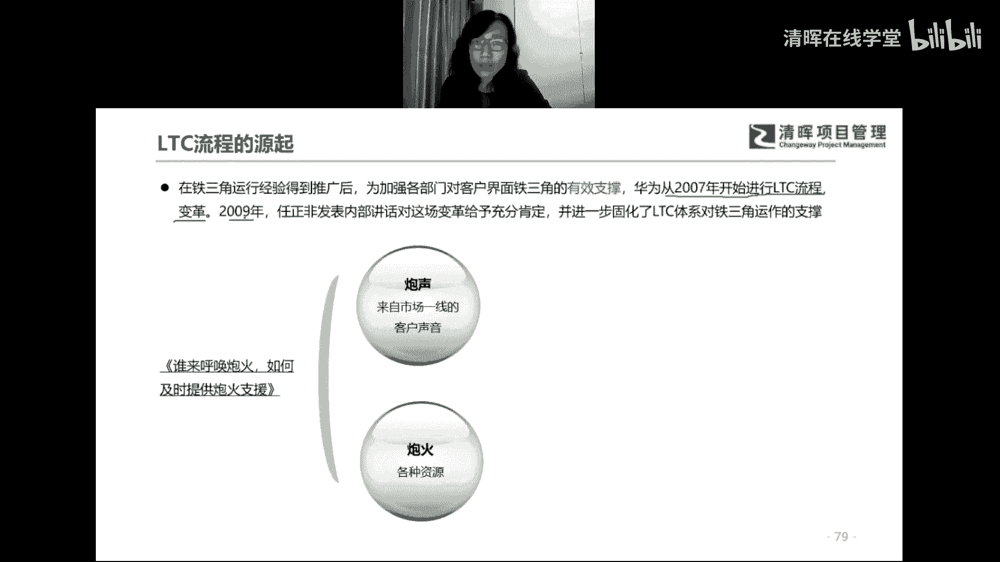

然后我们对这个内部讲话，其实可以做一个提炼啊，第一是什么，让听得见炮声的人来呼唤炮火，这是整体这场讲话的一个核心啊，核心就是听得见炮声的人啊，去呼唤炮火，听得见炮声的人，你才有权利去呼唤炮火。

对不对对吧，我们的铁三角团队有权利，在授权范围内去直接呼唤炮火支援，对不对，第一个基本点就是给予了我们铁三角团队，一个非常大的一个授权啊，所以这才叫真正的授权啊，就你要不你要你要只让他去干活。

你也只让他去担责，然后你如果不给他授权，什么都不给他，他其实根本就做不成这事儿，说白了就是对吧，所以一定要给授权啊，那第二是什么，那谁的，那他可以呼唤炮火支援呢，谁来提供这个支援呢对吧。

你看华为也非常明确啊，为一线业务提供炮火支援啊，是华为高层义不容辞的责任啊，也就是说提供炮火支援，我这华为高层都是他义不容辞的责任，那么其他的这个中层或者基层，你去提供炮火支援，那你就更更加义不容辞了。

对不对啊，所以大家会发现把这个炮火支援哈，提供炮火支援这件事哈，放到了华为高层的这个这个专项工作里啊，所以可见什么，可见华为高层对于铁三角团队，这件事情的重视和支持啊，一定要重视和支持，把支持给到位。

然后我们这个铁三角团队，是不是才能把事办成啊，所以大家会发现这两点是不是都特别重要，所以为什么这个简单来说，这个讲话其实也强调了一个啊，特别啊特别朴实的一个精神啊，我们管它叫什么呢，叫做用好老板。

为项目打工，哦大家想一想是不是这个意思啊，真的是用好老板为项目打工啊，就是我在用华为的高层啊，但是呢在支持铁三角团队啊，在这些铁三铁三角团队的呼唤，然后去帮助铁男给团队解决问题啊。

然后真的是用好老板没项目打过，所以大家会发现这才是真正的授权啊。

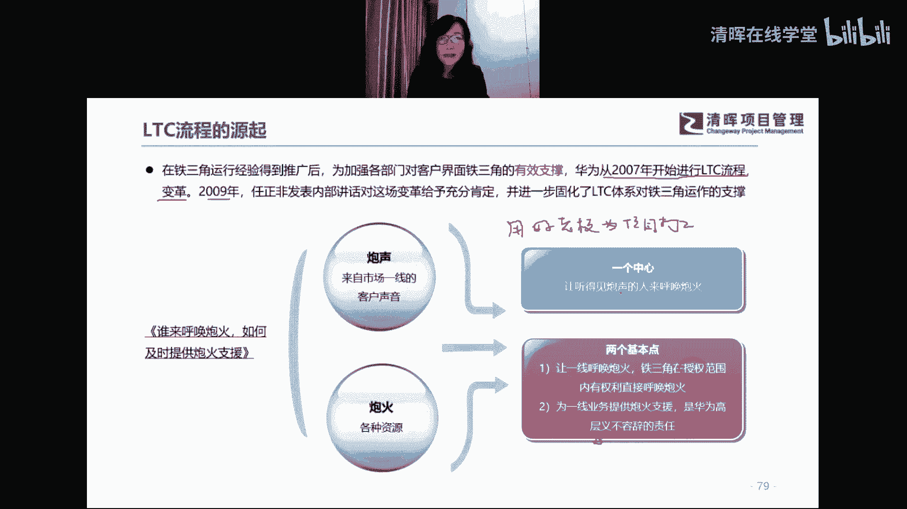

这才是真正的授权啊，这个讲话特别经典啊，然后呢，我们嗯了解了这个整体的l t c的一个来源的，一个背景的情况下呢，我们就呃再去重新去定位，或者重新去重申一下铁三角和ltc的关系啊，那铁三角的大家知道。

它其实是l t c的一个基础对吧，铁三角角是一种组织机制啊，它是l t c运作的一个基础，那ltc呢作为流程的保障，它其实也支撑了l t c是铁三角的一个支撑啊，所以他所以他也支撑了整个铁三角。

最终的一个落地啊，那ltc和铁三角之间的关系，我们可以打一个比喻是什么呢，就好像什么呢，我们可以把ltc流程比喻成一个什么，就刚才提到它可以是一条铁轨对吧，它是一个轨道对吧，这轨道上是什么呢。

轨道上一定会什么呢，它就会有各种各样的关卡，比如说这个地方有个桥对吧，然后这个地方有个隧道啊，然后这个地方又有个什么对吧，他一定会有各种各样的关卡对吧，然后我的我的这个关卡呢，你就要去设置各种各样的。

各种各样的这个这个机制啊，然后你能让这个车哈，这个轨道上一定要运行车辆，对不对，这车辆怎么去通过一个一个的关卡对吧，那这个关卡呢你设置的什么呢，就是相当相当于你要有一些，比如说交通规则对吧。

让大家去去去去，能够去遵守规则，对不对，那铁三角是什么呢，铁三角就是这个这个这个整个这个车辆运行啊，它一定会有一个小车，对不对，这小车上是不是有个司机呀，这司机就相当于我们的铁三角绝色，对不对。

那司机呢想从这个想从这个出发地啊，想从这个出发地啊，然后通过这个轨道啊，最终呢驶向它的目的地对吧，那他是不是一定要遵守，这个路上的这个交通规则，对不对，然后遵守了规则之后，这个规则才能去保证你什么呢。

保证你能够平安到达目的地对吧，保证你在过程中你不会发生交通事故，对不对，你不会撞车，你不会剐蹭，对不对，否则你就开不到目的地了啊，所以是不是，这就是铁三角和ltc流程的一个，比较形象的比喻啊。

也是说明了它们两者之间的一个关系。

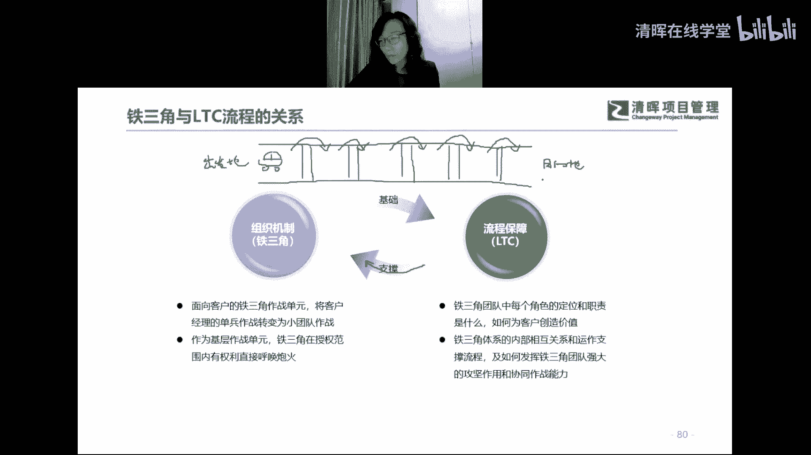

好，那最后呢给大家再聊一聊，这个to b业务的l t c流程哈，最后我们就来看流程的全貌了啊，然后呢，我们今天会把整个流程的全貌，给大家做一个通盘的一个讲解哈，然后下次课程呢我们再去拆解每一个关键点啊。

给大家做详解，然后这个流程的全貌其实就这一页ppt啊，这一页纸就把这流程全都画出来了，然后这个流程相对来说也是特别经典哈，特别经典的流程啊，然后应该大家都在，是不是大家都之前看到过这个流程啊。

这个明亮问到这个具体流程怎么运作的啊，这不就在讲吗，哦讲具体流程怎么运作的哈，这个讲了讲这个流程啊，讲到这个流程，其实我想知道大家对这个流程了解多少啊，因为相对来说这张图还是其实还是蛮经典啊。

大家能不能这个今天讨论，其实说话的同学特别少哈，大家都想静静的听我讲哈，大家能不能跟我聊一聊，就这张图你觉得你了解多少啊，比如说给我一个百分比，比如说你觉得你只知道20%，还是50%还是80%啊。

我看看大家对这个图的了解程度，然后来决定一下怎么来讲这个图好好，来我们的讨论区啊，可以回复我一个比例吗，你觉得你了解多少，哇斯巴塔同学，80%，我觉得你都不用来听老师讲课的，我可不可以请你给大家讲。

来讲一讲这个l t c流程，干脆你给大家讲讲算了，这斯巴达同学真的是我们优秀学员啊，我觉得你这至少这两次两次的课程作业，都给老师留下了特别深刻的印象，还有别的同学吗。

有没有别的同学回复一下这个图大致了解多少，这个只有一个同学回复我，80%，这个图我还是不知道怎么讲，80%，我觉得我现在是不是不用讲了哦，队长队长有队长了解50%是吧，好那我就不等了啊。

那我还是讲讲这个图哈，我们下次还会对对这个图去做详解，每一个点都会给大家讲，那这个图呢其实特别简单哈，其实也特别简单，就是一目了然哈，这图它其实分成三个部分对吧，大家能看出来哈，第一部分就是流程对吧。

第一部分是流程对吧，你看它会分成管理线索，管理机会点和管理合同执行，这三个主要的阶段对吧，然后每一个阶段下面呢他还会去下钻啊，就是每一个关键的一个关键点哦，比如管理系统有三个关键点对吧。

管理机构点有四个对吧，管理合同执行，这就不用说了啊，这就是整个交互过程的管理对吧，它会有相应的关键点，然后这个关键点呢对吧，每一个关键点他肯定就会针对每个关键点，就好像刚才说的轨道嘛。

把轨道它一定会跟针对每一个关键点，它去设置这个关键点的准入准出的规则对吧，什么样的情况下算是通过了啊，什么样的情况下就通过不了，通过不了，你就在这个地方就就停车吧，就不能再往下走了，对不对。

再往下走你就是违规的，对不对，你就是有风险的，对不对，所以他这第一部分就是流程对吧，就把这件事说明白啊，然后第二件事呢第二个层面就是他的角色哈，这三个就是铁三角嘛对吧，ars 2和f2 。

所以每一个角色呢，在每一个流程的这个这个时点啊，这个关键点它会以它为主，以他为主，他就会相对来说颜色比较深对吧，比如说管理线索呢就会以我们ar为主，然后慢慢的到标签引导这个环节呢，就会以sr为主。

然后呢我们的投标还有签订合同，又是客户经理为主对吧，然后到交付阶段就肯定是f2 为主了对吧啊，f2 为主，然后最后呢我们要关闭合同，肯定要cash，对不对，回款回款和缺收，然后去合同的整体的争议的解决。

最后kpi的达成对吧，然后又会以我们的a ar为主啊，所以第二个层面呢说的就是铁三角角色了，对不对，这个流程其实就把铁三角给融进来了对吧，第二个层面说的是角色，然后第三个层面大家会发现就是什么呢。

就是它的评审和评审和决策体系对吧，哦他这些措施你怎么去保证他的每一个节点，准入准出呢对吧，他怎么去流转呢，他怎么能够通过呢对吧，那你就要设置一些评审和决策点，对不对，那这里就是评审和决策点。

它会有有三种啊，菱形的这种就是需要什么，就是你要去决策的决策点对吧，然后这个三角形浅色的这个倒三角形啊，就是你的评审点啊，一般是评审之后呢，我才能决策，对不对，然后还有这个深色的倒三角形就是什么。

就是你要去做的这个风控点啊，相对来说哦，相对来说比较比较风险比较高的地方，我们都会设成风控点好，然后这个地方要行使相应的风险控制，然后去决定能不能去去真正去再过关啊，这其实就像闯关一样。

一关一关的去过哈，所以这个流程就分成这三个部分对吧。

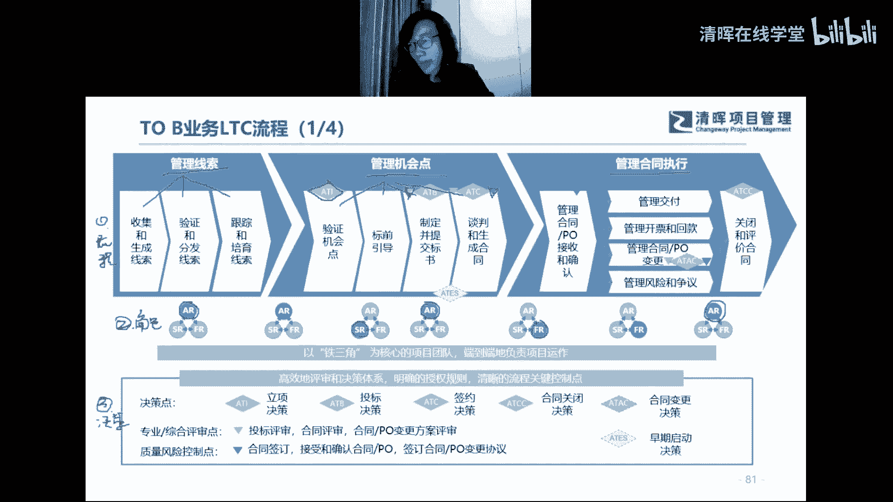

然后我们再详细看一看啊，这每一个部分啊，比如说先说流程啊，从流程开始啊，那流程开始呢就是从啊从这个管理线索哦，到管理机会点，再到管理合同执行啊，那具体每一个下算好，每个下算，首先什么是线索呢。

好首先我们先聊一聊什么是线索，什么是机会点啊，这个线索和机会点啥区别，现实的机会点啥区别啊，这个这个有知道的同学吗，我来考验一下那个80%的同学，还有50%的同学，你不知道线索的机会点什么区别吗。

考一考大家，这个80%和50%的同学，应该知道啊，呃可以跟我聊聊你们的想法吗，线索和机会点的区别是啥，答对的有奖啊，都不说话，答对的有奖啊，有没有知道的，真不知道吗，说一说自己的理解和看法，也可以。

嗯线索大于机会点哦，我觉得这个话呢看你怎么理解了，你是说线索的数量比机会点的数量大，还是说线索的价值比机会点的价值大，对不对，所以我觉得这句话有待有待商榷哦，线索不一定是机会，机会有可能承担啊。

线索不一定是机会，那么线索如果不一定是机会的话，那我们得把这个线索转化成机会点，对不对，线索啊，线索不一定是机会，也有道理啊，可能有一部分的线索不是机会，对不对，线索有可能不是机会对吧，线索啊。

我看看啊，线索有可能推进的商机，机会点是商机的关键描述嗯，这个好像好像有点文字游戏的感觉，线索是没有验证的用户信息，机会点是清洗过的线索啊，这个好像有点道理哈，线索是没有验证的用户信息，那你如果线索。

你这个线索如果不断的验证，他最后到了这个阶段，他就是验证过的，你看这个到了这个，比如说线索到了这个阶段了，他马上要转成机位点了，那你还能说是没有验证的吗，线索其实可以是验证的用户信息，对不对。

机会点是清洗过的线索哇，这个好深奥啊，线索成功率低，机会点是可能变成订单诶，我觉得这个赛啊，赛同学啊说的有点有有那么一点点意思了，这个线索离我们的，大家会发现线索离最终的名单，离生这个生成合同。

这个环境是不是稍微有点远啊对吧，他肯定是相对来说几率低呀，对不对，然后这个商机它的几率就高了，我觉得这个是一个线索和商机，的一个本质区别啊，这这其实真的是一个本质区别区别啊。

线索有可能你们刚经过加工培育，可能成为机会点啊，我我觉得我觉得大家大家的大家的想法吧，其实都是都是一个点啊，然后我我来我来讲一讲，我的这个想法是什么样啊，嗯就是就就是我我是这么觉得啊，就是什么是线索。

什么是机会点，这还真的是挺有争议的啊，我现在发现就是线索是什么呢，线索就好像我我还是打个比方啊，线索就好像我们我们那个我们看那个，比如说那些呃侦探小说对吧，然后他一定是线索，就好像是办案人员啊。

他就他就一定要找到一个一个线索，然后他就顺着这个线索顺藤摸瓜对吧，然后他就慢慢的去那这个揭发，然后最终的这个通往那个最终办案的那个，作案嫌疑人的那个轨迹对吧，然后他就顺着这个线索。

就能找到那个最终的最终的那个那个，办案嫌疑人的那个最终的那个证据，对不对，这就是线索对吧，所以你看那个侦探小说里的线索和，这个和这个我们l t c流量的线索，它其实是是一脉相承的线索。

你就是要不断的去培育，不断的去摸索，不断的去去跟踪啊，然后最终呢他才能够真正转化成什么，真正能够转化成那个那个所谓的那个那个证据，对吧，那个证据其实就是我们的机会点啊，那我觉得这里面呢我打了个比方哈。

简单来解释一下啊，但是这个线索和机会点的一，个本质的区别是什么呢，就是好像刚才刚才有个同学说的啊，线索相对来说成功率，成功率是比较低的，但是到了机会点这个阶段，它就相对来说比较确定了对吧。

刚才有个同学这么说，我们嗯啊赛同学啊，这个这个赛同学可以跟我们的青辉大宝老师，领一份礼品啊，领一份礼品啊，啊我比较认同这个观点哈，所以呢他会成功率会不一样，但成功率为什么会不一样，它的本质是什么啊。

大家知道它的本质是什么呢，本质什么叫机会点啊，机会点其实就是商机了啊，这个机会点我们可以用商机来替代啊，这就是商机的意思啊，那什么叫什么叫商机呢，商机和线索的本质区别是说，商机已经有了客户明确的预算。

然后客户明确的启动时间啊，然后有了客户明确的意向啊，这个时候才叫商机啊，这个是从定义上上机和线索的一个本质区别，好，行那这个这个我说明白了啊，那行，我们那我们来看看整体的这个这个，这个第一个层啊。

第一个分层啊，第一层呢首先是什么呢，就是我的线索啊，刚才讲了这个啊，其实大家就明白了啊，这线索首先就是它是相对来说没有那么高，成功率的那样的一个东西，对不对，所以我们首先要什么呢。

我们首先要升收集线索对吧，收集一大堆线索啊，收集这个线索，可能是各种各样的渠道去收集这些线索啊，这个线索相对来说它会成功率会比较低啊，所以我们先去收集线索对吧，收集完了之后呢，为什么成功率低呢。

就是这线索一定要什么，你一定要做一个工作，叫去伪存真，对不对，去伪存真就哪些线索是伪线索对吧，所以你要做这个工作，你就要验证验证线索和分发线索，为什么要分发呢，这个分发指的是什么呢，就是我们一定是分层。

就线索的管理和项目管理是一样，要分层管理要分分，然后你要把线索也要分分类分级，对不对，比如说哪些线索是是这个总部去管，哪些线索，总部去去去跟，然后哪些线索是我们的这个地区部部根。

然后哪些线索优势我们代表触根啊，像华为这种体制啊，肯定是分级的，对不对，然后呢你就把这个线索分发下去，然后大家就各自去更线索，对不对，然后这个线索最后的最后一步就是跟踪培育，对吧。

你会发现这个线索有有时候可能很棒的一个线，索，很大的一个线索，然后你不跟踪，你不培育他可能就黄了，对不对，你叫黄了哈，然后有时候呢可能是一个挺小的线索，一个不起眼的线索，那你就是什么执着啊。

不断的去跟着这个线索，就好像我们的办案人员，办案人员，然后你就要不断的去找到这个线索，就要去去跟一直跟啊，跟跟到最后他也许就是什么，也许就真的是那个作案人员的蛛丝马迹哈，他就真的是最后能找到证据。

对不对，所以他会有这么一个过程啊，这是不是就很形象了，大家就理解了哈，很形象，理解之后，然后我们就看到你培育线索啊，然后最后把这个线索培育成什么，培育成一个真正的商机，对不对，什么叫商机呢。

刚才提到商机的一个明显的一个定义和标志，对不对，那你商机也真正有了客户需求，有了客户的明确的启动时间，甚至有了客户的预算都有了，就是这个时候你就要怎么了，你就要去验证机会点，什么叫验证机会点。

其实就是你要去做一件事，叫商机立项啊，商机立项啊，验证记录点，那什么是商机立项呢，商机立项就是在这个阶段啊，我要向所有的所有的人官宣啊，官宣我找到了一个真正的一个证据啊对吧。

那我就要叫这个各方的人来帮我验证，我这个证据是不是一个真正的证据哈，所以这个时候你要去什么呢，这个立项它其实是一个决策点，对不对，他要让大家都过来帮你验证一下诶，你这个事儿是不是可行啊，对不对。

然后是不是有盈利呀，然后是未来是不是有市场空间啊，对不对，然后是不是符合公司的战略定位啊对吧，然后客户靠不靠谱对吧，然后竞争对手怎么样对吧，这个时候是不是要验证啊，这叫验证机会。

如果大家都验证这事儿特别靠谱之后，你怎么了，你就可以立项了，一立项之后呢，我们就怎么了，其实立项这是一个特别关键的节点啊，那为什么要做商机，立项就是大家验证完之后，立项决策之后，我们要决策什么。

我们要决策投入资源啊，这个时候就要投入资源了，你看铁三角团队这个时候才真正上场，就是前面基本上是以r为主，那这个时候呢就有sr了对吧，然后f2 也要上啊对吧，甚至我们的生态伙伴。

这个生态伙伴也要在这个时候上就全都来了，因为你的商机已经立项了，立项就要有资源去支持啊，我支持这个商机最终能够真正应担行政合同，对不对，所以大家就来支持了啊，所以这是一个什么，这是这是一个真正的投资。

对不对啊，投资了啊，然后呢我们就标签引导，标签引导这个环节就是解决方案啊，解决方案，什么叫标签引导这个词还还还挺晦涩的啊，简单来说，简单来说就是解决方案，他要去去跟客户去谈需求了啊。

他要去跟客户去摸客户的痛点是什么，要挖掘痛点，然后要去谈需求对吧，谈需求的过程中，他可能会带着生态伙伴一块去谈对吧，看看我们有什么能力，有什么产品，然后能够匹配你的需求啊，对不对，然后不断的去引导客户。

什么引导客户，就真正让这个客户能够能够能够买账哈，简单来说哈，那所以你看是标签引导之后，我们才会去投标，就不是投标，是招标啊，首先要招标，然后咱们才投标，对不对，所以这个招投标环节在标签引导之后。

说明什么呢，说明你标题引导是一个前置环节，80%的名单几率，其实是标弦引导这个环境就决定了啊，如果你标签引导做得好，以80%的订单进度就有了啊，是这样的啊，所以一定不是什么呢。

一定不是你招投标之后再去做相关的工作，那就满了，对不对，所以我们一定标写引导是在前面对吧，那标签引导的好，80%的营单几率有了，然后客户就正常招标，我们就投标啊，这个这个过程就是流程了。

就是就说白了走一个程序了对吧，这个事情肯定是我们都已经基本上定下来了，然后我们再走走一个程序的事情，对不对，然后最终呢我们去谈判和生成合同啊，啊这个过程就有了啊，然后呢呃呃这个前面的所有的这个啊。

这个虚线的前面我们叫我们叫售前环节啊，售前环节就是整体管理线索和管理，管理商机的过程啊，售前哦，然后管理合同执行就进入到受众和售后，受众加售后哦，是后面这段啊，所以你看受众售后呢。

这个就嗯前面做好了工作，其实瘦身后后，相对来说就是我们标准的项目管理的过程啊，首先要做的意见是特别重要，就是售前交界啊，授权交接就是我们的交付团队，要跟我们的授权团队去做一个。

前期的内容的一个接受和确认，好合同和p o的接受和确认啊，这个叫售前交接，然后呢也有也有也有的说法叫合同交底，合同交底啊，哦一样的意思啊，总之就是要跟寿险团队做一个交接啊，然后你把它顺利去过渡到交付侧。

然后交付尽力就开始去去管理交付啊，整体项目过程管理的过程，开票回款合同po变更变更风险争议，这个是特别重要的，这两个都特别重要，也是我们项目管理环节非常重要的两个环节哈，然后最后呢我们顺利交互完成之后。

就关闭和评价合同啊，所以这个流程就是这样啊，是不是就嗯串下来了啊。

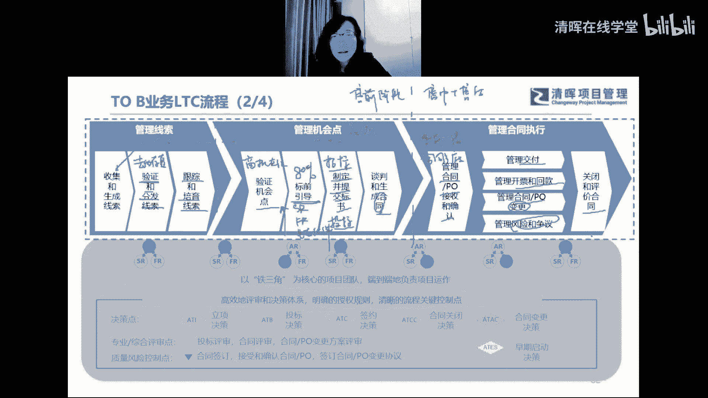

然后呢第二个层面就是刚才铁三角团队啊，体操团队跟大家讲过了啊，其实就是每一个角色会在不同的阶段，去以他为主啊，去做总体的统筹，然后去行使他的一个主要的一个职责，然后去统筹其他两个角色。

去把这个阶段的事情做好。

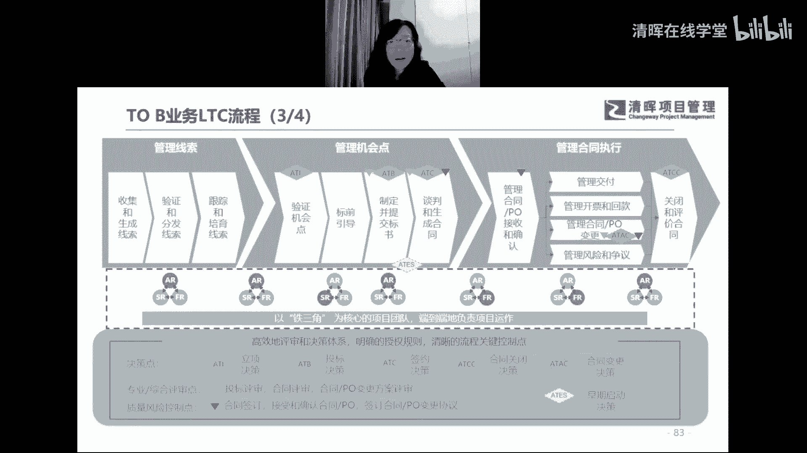

然后最后呢我们的我们的决策点哈，决策点平衡点和控制点啊，这个也来跟大家讲一讲啊，那第一个呢就是刚才提到提到商机立项哈，提到上帝理想，这个大家知道好，我再考察一个是大概有80%。

50%的这个a t i是什么意思呢，这a t i是啥意思，大家知道吗，就是这三个是这三个字母指的是什么，有知道吗，这三个字母是啥意思，啥叫ati，有知道的同学吗，等一会儿大家，好我来说吧。

有没有人回复我，我来说啊，这个api呢我先说一下它叫什么呢，它叫authorize，这个a指的是authorize，你看华为又加再次强调了什么，刚才提到授权，他再次强调了授权，所以你要知道。

华为的这个授权机制是特别特别呃，根本的一个关键，就是我们的铁三角和l t c能不能落地啊，所以它又是authorize，所以后面每一个都是authorize，第一个单词都是a a都是authorize。

授权什么呢，authorize to invest，你看刚才老师提到就是商机立项，它其实是要什么，是要投入资源的，我们商机立项决策之后，就要投入我们的sr和f2 ，还有以我们的生态伙伴，对不对。

所以一定是什么，这个a t i就是要决定什么，我要授权，你要可以被投资了，对不对，所以说authorized to invest，这是第一个点啊，然后第二个点呢。

第二个决策点我们先看决策点是所有的菱形啊，第二个决策点就是authorize to beating啊，我们要投标，authorise to beating啊，这是beating啊，然后第三个就是签合同。

authorize to contract，好签订合同啊，第三个决策点嗯，然后这里面是什么，我上回斯巴达同学说的那个案例，就是authorize to early start，提前开工，提前入场对吧。

但它是个虚线啊，不一定所有的项目都是提前开工，提前入场，那这个这个环节也是特别重要，就是在签订合同之前，我们有可能未签先执行，我们先去启动项目执行对吧，也叫无合同立项好，我们提前去启动无合同理想。

而不是在这，而而不是到这个阶段再去做，再再去做项目立项对吧，这是第四个啊，然后就是呃authorized to amman contract，变更好，变更是among，变更是很慢的对吧。

授权你去变更合同啊，都是授权啊，最后是authorized to close contract，关闭合同是不是就是六个决策点啊，然后呢啊有了决策点呢，我们决策点钱一般配着评审点，因为你是先评审在决策。

对不对，首先是投标评审，这个点是投标评审之后再必定对吧，然后你的合同评审之后再去签订合同对吧，然后第三个倒三角就是你的变更啊，整个的变更也要做评审之后才能去变更，对不对，才能去做变更的决策对吧。

那这是三个浅色的倒三角啊，最后还有三个深色的倒三角，就是我们的风险控制点哈，第一个拿出来非常重要的，风险控制点是签订合同，因为大家知道合同是什么，是具备法律效力的啊，所以华为会把这个合同。

作为一个特别过关键的一个点啊，作为风险控制点，第二就是什么售前交界，这也是个风控点啊，为什么呢，因为我们经常会发现，客户经常会抱怨和投诉什么呢，为什么这件事我跟你们的这个a同学说，过了之后。

还需要让我再跟b同学说一遍，难道你们内部没有协同，没有沟通吗，对不对，所以大家会知道，这种售前交接和确认是多么重要，防止我们客户跟客户经理说过的话，还要跟交付经理说一遍对吧，客户会疯掉的，对不对。

所以这也是一个风控点啊，这是真正的封控点，然后我们的变更也是一个关键的风控点啊，所以这个就说完了对吧，我们的风控点也都说完了，这就整体l t c的流程好了。

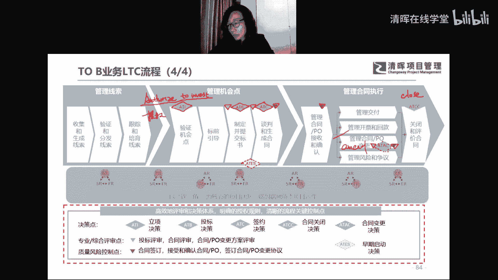

然后第四六证下次课给大家做详解哈，然后就进入到我们今天整体的回顾和总结了啊，回顾总结啊，那个好，大家来总结一下今天讲了什么啊，嗯今天首先我们讲了铁三角对吧，上次的to b业务铁三角我们提到了啊。

教授前铁三角或者销售铁三角，因为非会跟我们的交付体三角区分开对吧，我们讲到了他的核心职责对吧，每一个角色其实华为对它的核心职责定位啊，相对来说都是很综合很全面的，你会发现他真的是具备专业性啊。

这个角色是相对来说是很专业性，而且相对来说是high level的，对不对，那我们总结一下，这里面提炼一下他的核心职责对吧，客户经理要去做这个客户关系和盈利性销售，对不对，那么解决方案啊。

解决方案要去做技术和服务的解决方案制定，最后呢，好客户经理去做合同履行和客户满意度对吧，合同履行和客户满意度啊，好交付铁三角的核心职责啊，p m b a和tm这三个角色对吧，大家知道pm是1号位。

要统一对客，对不对，那b a呢是我们的business analysis，要做业务需求的调研，产品设计，业务分析，对不对，最后t m是啊technical manager啊对吧。

要做我们的技术架构设计啊，好铁三角复制的关键举措非常非常重要啊，这六点啊大家要想一想，这六点有没有有没有包罗全面，有没有有没有含有遗漏的地方啊，那这六点有没有在自己的企业里真正践行啊。

哪个环节出现了问题，就是我们铁三角为什么铁三角你学不会的原因，对不对啊，好了，那讲完了铁三角呢，今天我们就讲了l t c流程，对不对，l t c流程提到了任正非，重要的一个内部讲话啊。

让听得见炮声的人来呼唤炮火，这就是他的讲话核心，对不对，炮声是什么呢，是来自市场一线的客户声音，我们铁三角团队是真正能够听到一线客户声音，听到炮声的这样的角色，对不对，那么炮火呢就是各种资源的支持。

包括我们什么华为的高层啊，华为的高层来支持我们的铁三角团队啊，是什么，是华为高层义不容辞的责任，而是他们的责任啊，所以这叫什么，这叫用好老板为项目打工，对不对啊，我们也要用好老板为项目打工啊。

我们作为我不知道大家什么角色，是不是项目经理为主啊，如果是项目经理，真的咱们要用好老板，没想到，因为项目经理在项目现场真的太苦了，我们要解决的问题太多了，我们有时候可能不能及时去。

甚至我们有时候不能及时得到，我们的这个铁三角团队的及时的这个支持，对吧，这个时候怎么办呢，用好老板没想不打工了好了，最后呢，我们讲了l o t c流程的这个和铁三角的关系，对不对。

那铁三角是l o t c流程的基础，对不对，那l t c是铁三角支撑，对不对，一个是公路上驾驶车辆的司机，一个就是这条铁轨，这条公路好，我们会有相应的规则，然后让大家能够遵守规则，我们就能够什么呢。

把我们的车从出发地开到最终的目的地，然后通过各种各样的关卡啊。

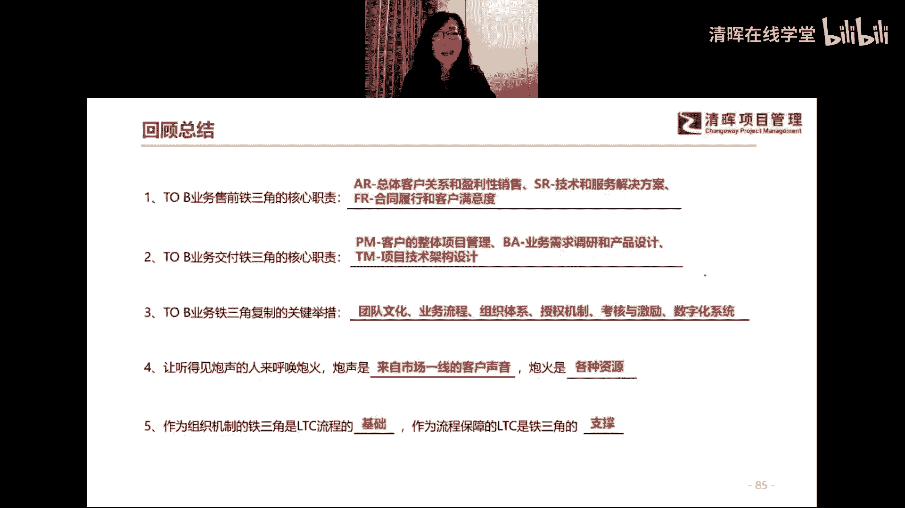

好了，这是不是就是今天我们的所有的课程内容啊，好了今天的作业啊，作业其实刚才已经讲过什么作业了，最重要的内容就是我们的作业哈，自查铁三角复制的关键举措，你觉得我们现在企业履行哪里出现了问题。

以及如何去解决啊，还有就是今天的内容啊，大家有什么问题啊，答疑好，有什么问题，大家现在也可以发到讨论区哈，可以简单做一个做一个答疑啊，或者大家就再再再思考一下。

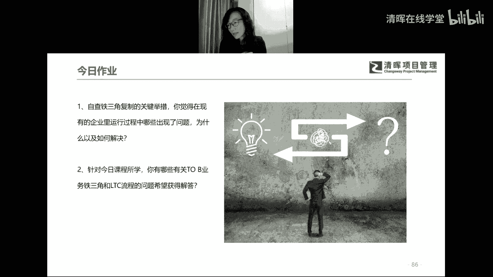

然后有什么问题我们就直接上传作业了好了，今天的内容就这么多了啊，然后预告一下下次课程啊，啊我们我们下一周正好是五一假期，所以下一周我们周末会停课停课一次，然后再下一周就是五一之后的啊。

五一之后的那一周的礼拜日啊，我们会开始第四次的课程啊，然后第四次的课程呢我们会啊，重点就讲ltc流程，再给大家做详细的一个拆解啊，每一个关键点都给大家点出来啊，然后这样便于大家去最后能够落地哈。

哦所以提前也预祝大家五一愉快嗯，然后我们的作业啊，我们的作业还是周二提交喽，哦大家就还是下周二啊，所以大家就是嗯趁热打铁，对不对，今天听完课程，下周二把作业交了啊，然后呢五一就可以舒舒服服。

踏踏实实休一个假期对吧，然后五一假期大家如果没有这个出游的，这个这个这个计划的话，也可以把我们的前三次课程好好听听回放，对不对，好好学习一下，然后这样的话呢我们五一之后呢，我们就可以新的课程的学习。

可以再上一个新的台阶，好大家，那呃是不是没有问题了，没有问题，我们今天就结束了，然后需要领奖品的同学，可以找我们的社区大宝老师，然后也提前预祝大家五一愉快好。

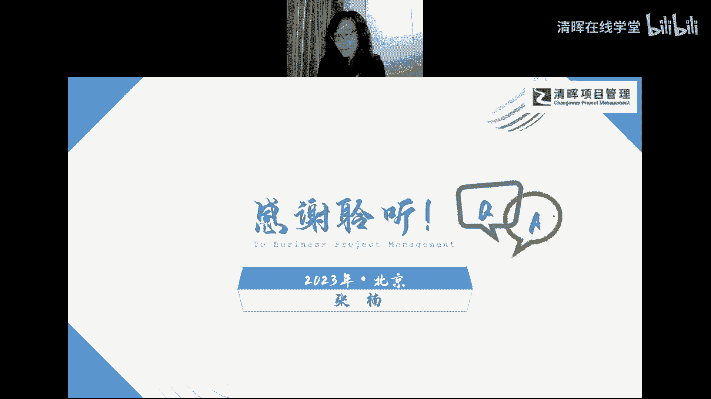

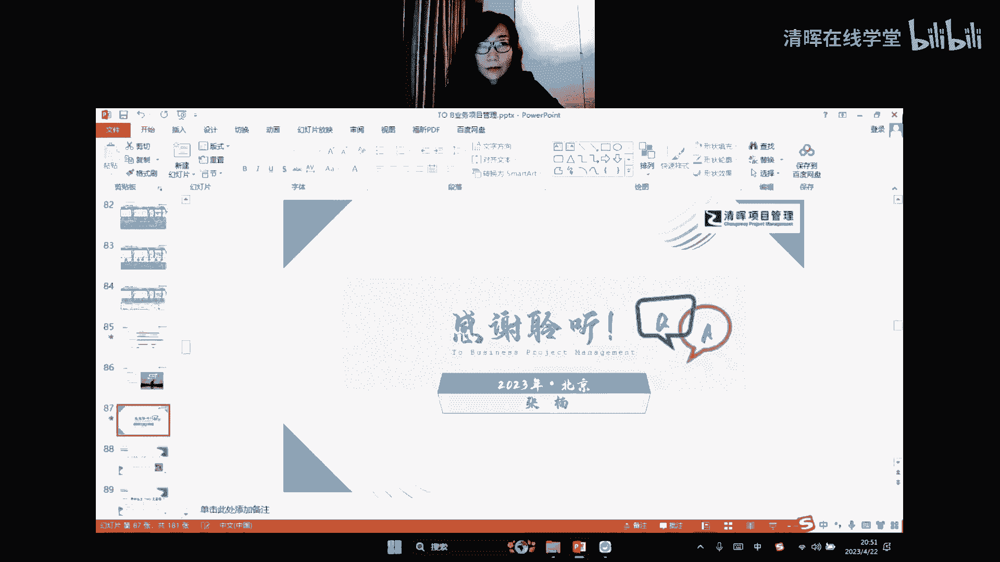