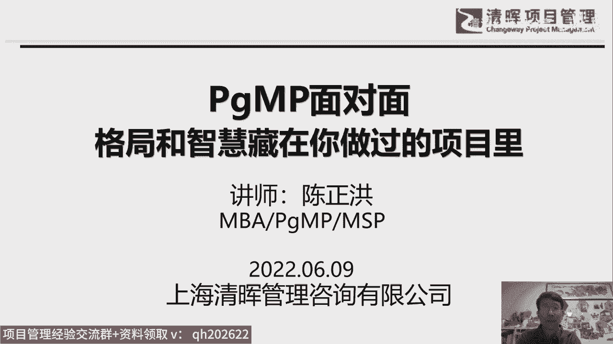
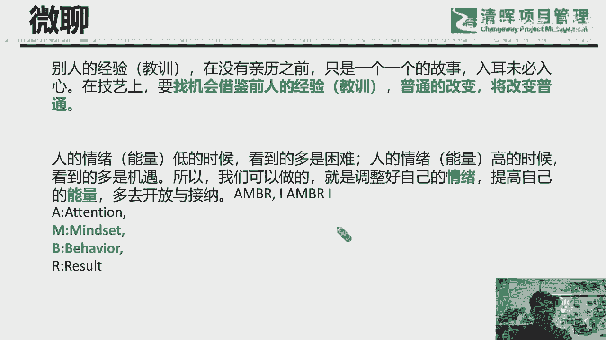
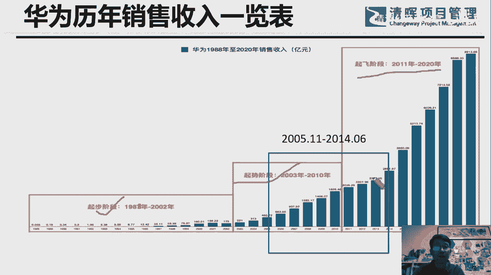

# 华为PgMP海外项目经验分享 - P1：1.导言 - 清清公开课分享 - BV1Vu411P72w

到07：30了哈，那咱们就开始吧，看看那个，看看同学啊，对，说一下啊，就是在我讲的过程中，他们是07：30到09：30嘛，两个小时，这中间如果有任何的疑问，或者说有任何的问题呢。

都大家把那个打在这个讨论区，就聊天区让我看见是吧，我看见的话，我觉得有些问题可以就是当时就可以回答的话，那我就会马上就会做及时的这个答复，好不好，两个小时，如果就说我我一个人咣当咣当咣当这样讲的话。

那就是可能差点意思是吧，如果大家都这样参与进来，再聊起来，就这气氛就好很多，那咱们开始哈，首先感谢星辉的傅永康先生啊，付老板，就是让我有次机会来咱们的这个清辉直播间，线上的各位朋友啊，就分享一下。

我在其实应该是2017年，当时被采访时候的那篇文章，再回顾一下，现在回想2017年时的那个采访，其实感觉又又有很大的不同，就有很多新的体会，所以我考虑再三，我觉得这个话题拿出来给同学，不是同学们了啊。

跟朋友们一起分享一下，还是很有意义的，很很有意义的，好我这篇，这个咱们这个话题就是当时我采就是项目，项目管理评论杂志，采访我所有的那篇文章的题目，叫他在专栏叫PGMP面对面啊。

他的题目就是格局和智慧藏在你做过的项目里，这就是当时那位美女记者，就是帮我设计了这样的这个一个题目，同时它问了我好几个问题啊，这几个问题呢我都以PPT的形式都会贴在这个，这是贴着贴贴出来贴出来。

大家倒是看看起来会更有感觉更有感觉好吧，主要讲的是什么呢，在采访里面主要讲的是我在华为的经历，我在华为的经历，我是在海外，在海外一直在海外做，华为海外做项目这个经历啊。

我相信大家这个因为新冠疫情的原因啊，对这个这个产业可能都变了对吧，大家工作后的产业也变了，工作的环境也会有改变，这个时候来听我呃，对我海外这个做海外工作期间的这个感受呢。

更体会呢同学们的感同身受也会更强一些，会更强一些。

你看啊，啊首先稍微介绍一下我自己哈，相识相知，相信吗，咱们相识都是在在线嘛对吧，同学们可以看到可以看到我是一个什么样的，一个一个一个一个形形象哈，那相知稍微还要相知一下，不然的话何来相信呢。

是不是我这个，我后后面啊后面根据他采访的过程中，我后面也会有我自己的背景，也会陆续的跟同学们这个交代一下，我画圈的这些资历都是我2012年，从海外当时在海外外派了将近7年，回来之后就获得的。

因为在海外一直在海外做项目，是没有任何的这个自我学习的机会的，一直扑在工作上面哈，这个所以说都是这相当于什么，我是194年参加工作的，现在在上面的这些title也好，这些就是那个成果也好。

都是2012年5月份调回华为总部以后，就业余的时间来获得的，业余时间获得的，没有在海外待过，那体会不到平时业余时间能够充电，是多么的幸福啊，多么的幸福，讲的那个今天要分享的内容呢，主要是是这一段经历啊。

在海外6年半，在国内将近两年的时间嘛，就8年在华为，我在华为干了8年半，8年半的时间，那个时间窗口后面会提到，其实刚好是华为高速发展的那个时间窗口，就特别的幸运，特别的幸运，所以项目特别多，项目特别多。

所以为什么我说我咱们自己的格局跟智慧，在咱们交付过的项目里面呢，因为你获得了非常宝贵的我自己号，非常宝贵的实践的经验，实践的经验哈，我说了94年参加工作啊，94年参加工作，前面11年是在卫星通信行业。

做到了休斯公司那个北京代表处的雇员，那后来，从那个微信通讯行业出来之后，就首选就去了这个电信行业，就是去华为，就以项目经理的身份入职华为之后，就就外派到海外去了，外派到海外去了，当时12年5月回国。

14年6月份就我就回到北京了，因为因为华为总部在深圳，所以为了家庭，我就回到北京，就相当于离开华为，就转型做顾问讲师，专门做项目及管理这个这个这个这个领域的，哎同学们在线在线的话，那边也打个一啊。

这看着，不看回印子怎么样啊，有老朋友挺好啊，欢迎新朋友跟老朋友哈，好的好的特别好啊，这几句话，这几句话是我昨天早上吧，昨天早上我一般每天早上起来，每天早上起来会会刷一下朋友圈。

就看看这个自己认识的这些朋友啊，他们都会早上的，这个第一个朋友圈是什么样子的，就看到了这两句话，这两句话呢其实是三个朋友的，三个朋友的跟同学们分享一下啊，记得口误啊，老师朋友同学们。

同学们应该是朋友嘛哈跟朋友们分享一下，他第一句话就是，就相当于说今天是我分享那个经验和教训嘛，是吧，经验的另一面就其实是教训，说是我，我这样可能哇啦哇啦哇啦，在在分享这个经验教训，如果你太忙。

那你可能未必能听进去，你如果不忙的呢，不忙的不忙的呢，朋友呢那可能就听进去了，就像我一位老师，前段时间好年初的时候提醒我们的那位老师，40岁啊，我50岁啊，我我50岁，但他也是我老师。

因为他在国学这方面比我厉害，那就向向老师学习，他当时提醒我们，说说什么呢，说身体哦，身忙身体很忙，身忙心呢闲对吧，这是对立面哈，身忙心闲死真忙，如果说身忙心忙，那那是假忙，那就忙死，什么意思啊。

就是适当的时候其实是做事情，你你在工作中，那肯定咱们很多像嗯在现在在学PGMP的，就项目及管理的这个这个同学，他们真的是就四个字表示就是越来越忙，事情是忙，学60一直是很忙的。

那他们为什么越忙能够忙越忙越好呢，绩效越来越好呢，那就因为他是心，就是其实就是他自己内心，是能把握住这个节奏的，他不让自己的心无谓的在忙，而这一点对我启发其实挺大的，这个跟我们学项目级管理里面的。

把握这个节奏有异曲同工之妙，异曲同工之妙，就像这个乐队的指挥是吧，就像乐团的指挥，那他的这个他是忙而不乱呀，他是井然有序的，井然有序的哈，所以说这个我是希望的同学们，今天这两小时或者一个多小时哈。

你可能有时可能会走开，这没关系，这时候的心稍微闲下来，弦是加双引号的哈，你闲下来的时候呢，那可能收获会更大一点哈，可能收获会更大一点啊，我们肯定是一直是在借鉴别人的，比较优秀的实践，这是毋庸置疑的。

同时也不断的在回顾自己的这个实践，这个实践呢不一定是加上优秀这个定语，是吧，因为你以前做的事情，但是你通过不断的这个回顾啊，不断的复盘，随着你自己认知的提高，你心里的收获是越来越大的。

因为你在不同的这个角度，可以得到不同的新的营养啊，新的营新的营养，所以说这个从这个角度上来说，就如另一位朋友所说的，普通的改变将改变普通，这我觉得也非常非常的有道理，非常非常有道理，贬低的积累是吧。

从量变到质变，那在那在讲到另一个方面哈，这这还有第三位朋友有一个分享，他当时想的是，他讲到咱的能量低的时候，后来我把能量前面加了一个情绪，因为这相当于又把什么挂钩了呢，就跟情商跟心智挂钩了是吧。

我们的情绪是带能量的，情绪绝对是能量的，但是能量呢可正可负，能量可正可负号，对自己啊，对自身而言，你爆发出来的正能量和负能量呢，可能对于别人来说，对周边的那个环境，跟你身处的环境。

也会发生正的或正面或负面的这个影响，那么负面的影响，所以我们身处一个一个多变的环境的话，我希望是他同学有同学们好，同学们和朋友们能够多去开放与接纳，再放一节了，这里面我特意备注了B。

是我们你看从心智方面的这个情绪的表达，跟这个行为的这个表现，能量表的表现，它的一上一下，它的上游和下游其实还是有一个上游，有你的专注的注意力的输入，还有下游的输出，是你的结果是吧，这是非常直接的。

是非常直接的，而这个上游的这个A可能就是冰山效应，下面的冰山下面的那部分你是看不见的，再深挖一步的话，再往上挖一步的话，还有一个分别，AMBR的左边跟右边分别有一个I，左边这个I是是什么。

是intention，是意图，那就更深层次的了是吧，更看不见了，那右边的这个I是IMPACTION，就你的结果的产生的这个冲击，或者说影响，这属于这样的话，你看一件很普通的事情，事情过来。

他其实经过了很多的环节，经过了很多的环节是吧。

下一个啊，因为我说要分享一下华为的经历嘛是吧，华为8年半的时间不长哈，但也不是很短，不是很短，大家从这里这个全景图里可以看到，这是一张从1988年到2020年的，那个华为的人销售收入的这个一览表。

这个图啊，一览这个图，这图的话，这个图我也是借用的哈，你看他分了三个阶段，分为三个阶段，他分了三个红框，第一个第一个是起步阶段是吧，从88年到02年，88年到02年到起步阶段，这个时候大家大家看。

其实大家多少也知道，2002年的时候，其实日子都很不好过，在日子不好过之前，其实华为是未雨绸缪，想到了拓展海外市场，2000到2001年的时候，就已经已经做这个做，已经做这个这个这个准备了。

做这个准备了啊，所以说战略前瞻性啊，这个是非常非常重要的，不然的话你没没有找到，即使找到第二曲线的话，就是如果华为当时没有拓展海外市场的话，可能华为早就不存在了，可能在2002年的时间就已经垮掉了。

是不是，那华为抓住了机会，在03年之后去拓展海外市场，就趁势又起来了，抓住了这个这个台湾的这个这个市场，当然这个市场非常的艰辛，开拓市场是非常的艰辛，特别特别难好特别特别难。

那后来呢到第三个阶段是就是起飞阶段，所以这个挺形象的对吧，同学们看挺形象的，从无到有啊，从少到多，从小到大啊，我呢刚好有幸在拿这个绿框，这里面就是从05年11月份进的华为。

以现以这个项目交付项目经理的身份进的华为，就进的是国际项目管理部，就是专门就就是要去海外的，说当时觉得自己英语好啊，这国内还不想不想在国内啊，那时候我那时候三十三三十四岁嘛，老想着去在外面看看啊。

这个结果干到2014年的6月份，好，刚好这段时间呢，同学们后面下面那张PPT可以看到，这段时间是真的对我来说，真的是非常宝贵的一个时间窗口，非常宝贵的事情很高，因为这个这一段大家同学同学们也看。

朋友们也看到了哈，就它的斜率刚好起来了，那斜率为什么能起来呢，其实在下面这张PPT多少可以看到一点一点痕迹。

