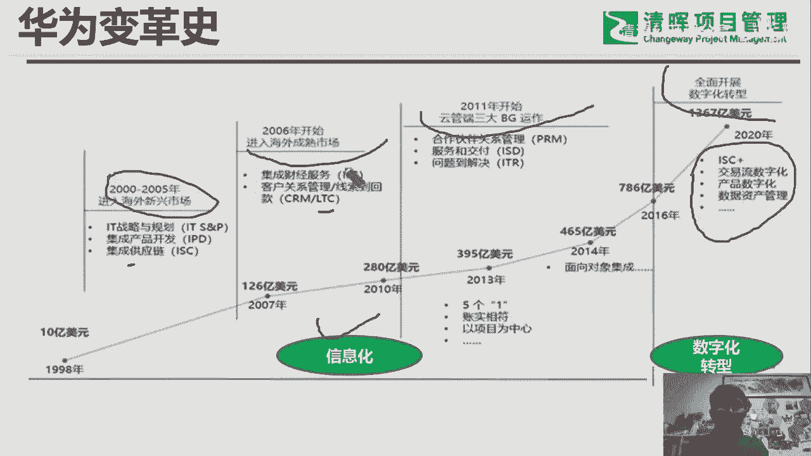
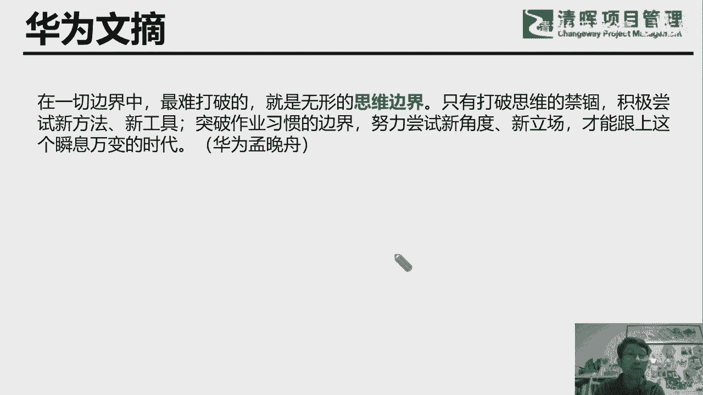

# 华为PgMP海外项目经验分享 - P2：2.PgMP 从华为说起 - 清清公开课分享 - BV1Vu411P72w

你看这个，这张命名是华为的变革史啊，这张也是有朋友画的啊，有朋友画的，我进来用了一下，就他，这张这个曲线图，也就是就上面的那个那张那张那个销售收入图，销售收入图啊，但就是单位不一样啊，单位不一样。

但这个趋势是一样的，趋势是一样的是吧，然后他这里面也是，但是这里面我们表达的是什么什么信息呢，其实是冰山脚下的那一部分，据说在一线市场，一线销售就前线打仗的那个，比如说销售收入的那个这个红红火火。

背后七是一个不叫变革，叫变革，变革史叫变革项目啊，其实是一个投资项目是吧，就不断的往里投资的过程，往里投钱的过程，投钱建什么呀，建流程，建能力啊对吧，建流程建能力啊啊咱们也稍微来看一下啊，稍微来看一下。

原来，你看我我0505年进华为之后，就一下就冲到海外去了，就在一线做项目，我所能感受到的这些都是我回来以后感受到的，我在前线的时候就体验到了什么呢，哎有些新的系统上来了是吧。

或者说我我用心去体会某一个某一个业业，业务流程的时候，我能知道诶华为这个流程已经走通了，因为那时候就已经是国际化的呀，都是在不同的国家之间对吧，从就一个中中国区到后面不断地拓展，到会后是168个国家。

几十个地区不是吧，原来是旧片区，下面后来反正它的组织结构是不断的调整，大家可以看到这里面为什么放这张PPT呢，就想让同学们同学们好，看，来咱们有缘哈，可能后面真的会成为成为这个，张三的同学哈啊同学。

那他这个，做些变革项目哈，这些变革项目，他要进入海外市场，新兴市场之前，或者说之后是一直这样做的，因为一个流程是要优化的嘛，在不断的接触业务的过程中打磨它，才可能越来越适应圈，就是国际化的这个环境。

国际化的一个环境，相信同学们对华为也不陌生啊，啊熟能详的，比如说IP地产品开发的对吧，集成产品开发IPD，还有集成供应链的ISC，这两个IPD应该是知名度应该最大，知名度应该最大哈。

其实我们在外面的时候，首先碰到的是ISC，首先就叫什么，我要订单履行吗，我们讲叫你要国际物流是吧，你要到那个中心餐，这个你要到货呀，是吧，这些如果说没有一套完整的这个系统，IT系统的话。

那是不可能实现的是吧，那不可能实现的嗯，对不对，所以说这个华为这些是，前面是做了基础设施建设的，基础是建设的哈，走出去一步一步走出去，其实都是有先后的，有先后的啊，那你看在后面06年以后。

其实是那时候应该是应该是定当井喷的时候，就因为前面几年的辛苦的耕耘，般都3年以上的耕耘，每一个成每一个国家陆续都都出单了，都出单了，那这个时候那交付时就成问题了，大规模的交付是吧，大规模交付就成问题。

所以说，陆续的又开始了，就特别特别有名的一个项目，继承财经服务叫ifs，我在华为8年半，我觉得我对华为还稍微还有点贡献的，其实就是觉得自己成就最最大的是，后面再回到总部周的这个两年中，有一年在总部。

其实就参与了ifs的这个项目及变革，项目集里面的某一个，子项目没有一个项目component的，这个相当于是这个调研，因为他们开发的那个财经开发的工程师，会找我们这些业务专家来调研。

当时是参与了一些事情，我觉得这个我觉得在华为的作用远比我在海外，做的这这么多的项目的贡献要大，就得这对华为的那个组织过程，资产的这个沉淀式，起到了那么一点点的作用和一点点的作用。

那后面当然还有非常熟悉的LTC，lead to catch是吧，这同学们和朋友们相信也是非常熟悉的，而且有的朋友们所在的企业，可能正在学华为的LTCLTC，那后后面我们叫云管端哈。

云管端就相当于就说了三个BG，原来只是运营商，运营商BG，后来是企业B级，再是中端B级是吧，那那这里面的话把什么提升运存，因为你攻城略地结束了，比如由于是运营商这个B级圈地，圈完了，圈完了之后。

那就是精耕细作出效益的，只有服务了对吧，服务的话是可以极化这个运维的嘛，跟交付的，这个时候才可能就是说以比较少的那个，人力资源的投入跟基础设施的投入，达到比较好的这个收益是吧，比较好的收益。

所以所以这个让他三个阶段，这这这前面这三个阶段啊，就那位朋友把它定位是信息化，相当于是从数据到信息是吧，Data dointimate，Information。

这样的一个一个一个一个it化的严格过程过程，到了现在这个阶段哈，因为借着数字化转型的东风啊，现在都讲数字化转型，那这里面就原来的数据变成信息之后还不够，不要变成什么，要变成intelligence。

the business intelligence是吧，bi其实是bi，就是就是什么，你说业务智能也好，或者说商业思呢也好，或者说其实叫intelligent intelligence。

最原始的那个单词的意思是什么，有情报就有用的那个业务的这个情报呀，就是你在竞争市场上，你是柯南可以用了，你先用用的好，你就你就先人一步是吧，那就占得先机，所以你看从前面上一页PPT，华为这么多。

就这么这个这个他的那个销售收入，这条曲线下面的冰山之下，埋着的华为这么多年这么久，你看这么多年不断的往你的投资，不断往你的投资，这个钱是海量的钱呢，这中间还不包括很多投资是失败的。

这个系统就没在上面写嘛对吧，因为失败了就投资，失败了就消失了吗，我记得当时我05年进去的时候，我就参与了一个项目的那个选型，一个IT项目的选型，这项目后来成功上线，但是又非常成功的下限，他用了一段时间。

一线的项目经理就就觉得不好用，就是说不切合这个一线的场景，相当于是什么，就是不是cost effective，这不合算是吧，投入产出不划算，所以就就下线了，那也是很贵的一套系统啊。

那所以这个你的华为能够走到今天这么强大，花进去的钱真的是不少，放心你的钱是不少啊是吧，哎还是但是就还挺幸运，就投进去的钱呢，这个信息化也好，数字化转型也好，他的这些系统都用起来了，学起来之后呢。

也都产生了它应有的收益，而且正在产生它应有的收益，这个就是华为之所以能够成功的，一个非常重要的一个因素，非常重要的一个因素啊，那这些项目，这些变革项目哈，一个一个的变革项目，举例来说，Ifs。

他从06年就开始，K就开始布局，一直做到14年基本上结束，这中间有23个component组件项目，陆续的启动，关闭23个，这个你如果说从管项目的角度来来，管这个这样的那个变革项目级的话，肯定崩溃了。

因为这中间人可能就说不是换了N波了对吧，换了N波了，所以说这个做能做成功不容易的，那不容易的，那为什么就华为花这么大的价钱，请IBM的顾问来来驻场是吧，来那个人家说这个，每天这其实都是这些变革项目。

都是花用钱堆出来的。

能堆出来的，那你看这系统其实就是那个基础设施建设，那华为建的还不错，建的不错，但是最先走在前面的还是高层的，这个高层的这个他的这个思路，高层的思路是吧，这些在我们当年其实是看不见的啊。

这些虽然大家看的是，比如说是人总在某年某月，某某年在什么什么会上的讲话，但其实这个也也是有适当的密集的，现在是解密了对吧，现在是这些公开的刊物，公开的出版物都有了，因为他过了这个时效绝对可以解密了吗。

很多很多文件其实我们当时是看不见的，我们当时只是在埋头埋头做项目哈，埋头做项目，埋头赶路，抬头看，天天也看不见这样子，这这些天本来应该能看见，但是你也没有这个机会看见哈，你要看见。

可能几年以后或者半年以后，或者其实是有滞后的，有滞后性的，那我们来稍微来回顾一下，他们稍微来回顾一下啊，当时可以感受出来，这个是三段啊，这这一页PPT3段，这是01年零一年的时候，后来一个什么事情。

欢送海外圈，海外将士出征，这是背非常悲壮的一幕，非常悲壮的一幕，但是喊出来的口号非常响，因为我们跟海外就跨隔着一个太平洋嘛是吧，最宽的是太平洋吗，那这个时候是非常悲壮的。

我们知道就领导们完全知道这个当地的辛苦，因为一穷二白啊，一穷二白啊，什么也没有啊，什么也没有，或者说客户在哪里也不知道啊，只知道比如说某个国家的某个首都是什么地方，买张机票，你可以去那里是吧。

你的你的下一步只能做到这一点，只能做一次，这点或者说几个人一般是三个人嘛对吧，一个客户线的，一个是采购的对吧，一个可能技术的这三个人都像小组一样的，就去举去洗盐碱地去了。

就是去去看看能有没有机会有没有机会，都是这样出去的，都这样出去的啊，这里面你看首先所强调的是人是吧，对员工派出去的员工要四海为家的胸怀，你的胸怀，而且调用这个本事，你真的不能被过几天就被饿饿。

饿着肚皮就就回来了，说哎呀没吃的了，我看不下去了，那不能这样是吧，那所以当时是比较悲壮的，但是还还有句口号是什么，还有一句口号，青山处处埋忠骨，何须马革裹尸皇，但是任总在这个上面讲话的时候。

这个其实是要是说是要做好，累洒五周的这个学习，啊泪洒五洲，这个这个是汉就是汗流亚非拉，就相当于武武松嘛是吧，这个其实是挺悲壮的，挺悲壮的，那你看到02年零二年又做了什么领导，02年。

国际化我们既然要走出去，我们自身的人员一定要国际化，国际化后就是全球化的对吧，你就必须变成全球化呀，因为往国内往外派的资源毕竟是有限的，毕竟是有限的，那就是我们派出去的人至少能活下来，要自我学习。

自我培养，所以在这过程中，当然公司做了，已经做了非常就化学本的基础设施的投资对吧，你前面讲的IPTRISC啊，就是这些最基本的是基础设施建设，其实已经是钱已经掏出去了，已经建起来了，就是软硬结合嘛。

软硬结合，那这里面的话那就是人呢本地的和中方的是吧，就一步一步来嘛，一步一步来，那最后到05年的时候啊，我就跳跃了一下，到05年，因为我是05年底进的公司吗，看到这句话，我就知道了。

我当时是在什么背景下被华为招进招进公司的，被招进公司的，我是技术服务部啊，GT就交付项目经理，归属于全球技术服务部和gt2，所以呢它是，为什么会招社招招这么多这么多领域的人啊，绝对供不应求啊。

绝对供不应求啊，就做种子是吧，这数量不一定多，关键是把他们的整体水平提升起来，通过他们就做种子嘛，金种子吗，整体水平提升起来，这就想明白了，当年我为什么能够能够被招进华为，被招进华为。

我当年是我记得04年的时候，04年10月份，11月份的时候，我接到过华为的电话，我也不知道他什么时候，什么地方拿到了我的这个电话，当时就问过我说愿不愿意去圈，就是那个国际项目管理部。

当时呢因为刚好又刚好是凑巧哦，我觉得时机好像不成熟就没去，结果是一年以后，一年以后机缘巧合去的同一个部门，就同一个部门，那可以想象就在这一年的过程中，肯定也想方设法招了很多的这个同行，很多的同行是吧。

因为这个人才的缺口实在太大了，实在太大了，所以华为就是在这样的环境下，去开拓这个海外市场的，开拓海外市场的，再来看看它是文在好发挥的，文在特别特别多，好像特别特别多，这个一转眼就到了我回国以后了。

我回国以后了，就是华为就我们出去，尤其以我以这个，以我这边这个相当于项目管理这条线嗯，gt这条线好做很窄的一条线，这个业务线来说，两从我们说不说从00年就开始出去吧，比如说像104年吧，好吧。

004年的时候基本上就陆续落单了，你看04年到13年将近10年的时间，4年时间总结提炼，总结提炼，因为有这么多的足够多的实践，中国的积累之后再提炼出来，提炼出来什么，13年的时候任总说的。

项目管理是第三季了，在华为，因为华为基本上所有的订单都是项目，从项目来的，那都是项目来的是吧，他说是是，项目管理是公司管理进步的基础细胞，基础细胞，你可以你可以当什么，你可以当，比如说你这项目经理。

项目项目基金，项目经理也好，项目经理也好，叫做pd吗，那你可以当一个连长哈，或者当一个排长小一点的项目，可能是排长大一点的项目可是连涨，但是你的级别可以到少将，我们的少将连长和少将排长，为什么呢。

因为你的实力在那里啊，你的实力在那里啊啊那，反过来说你如果如果说你项目管理做不好，你的基础细胞你都把握不住的话，你去管更大的那个职能部门，比如说代表出根地区部，那基本上是瞎指挥，基本上是瞎指挥啊。

所以这大家也可以看出来，项目管理还是挺有用的，挺有用的啊，这个是任总说的哈，任总说的，那后来在14年，2014年，华为在内部办了第一届的，项目管理的那个summit的论坛。

the program就是program management summit，就邀请全球的这些四级或五级以上的项目经理，为了研讨，那是第一届，因为你我知道，因为那时候我刚好刚好是在这个啊，这第二季了。

第二季了，我刚好刚好是就是在总部嘛，刚好在总部刚好是我们部门承办的，我们我们是GTSPMO嘛，PO就是预算管理部，项目预算管理部部门承办的，这个当时站在讲讲话是郭平，郭平是郭总。

是当时的轮子组轮值轮值董事长是吧，轮值董事长，他那个他当时说什么，就相当于官方的形式，就说出来华为提炼的这个项目项目管理，不是不是一个个的单独的项目管理，我们我们整合的是一个组织级项目管理体系。

主持级的项目管理体系，好吧，这是一个有机的整体，这是一个有机的整体，这这是华为的一个核心竞争力，华为的核心竞争力是吧，他能把前面这么多的积累，这么多的实践，这么多的这个从从数据到信息。

最后到intelligence嘛对吧，它能够通过系统整合起来，然后系统整合起来，不然的话，每年这个几万个的项目是怎么怎么能正常运转，能正常运转对吧，同学们有问题有问题题呀，有问题提，对了。

在华为我们的我们是以，你看我一直没有说项目管理不好，我一直说pm o p m o要澄清一下，我们原来也叫PMD，就项目管理部后来就地整编，就是集体相当于集体转为那个PO。

PO就是作为一个从总部到地区部到代表处，到办事处，就是一桶到底的，一个橙色的那个职能部门机构了，它也有各级的那个职能的领导的，篇目的各级部长啊，其实就是项目级。

就就就那个像叫program management office，我们叫项目群管理部，项目群管理办公室，其实是项目群管理部啊，但但这个PO比如总部的PO，它有很多的部门，很多很多的部门，很多的职能部门。

很多的职能部门啊，这是这是华为特色，这是华为特色啊，别的别的公司PO的配备没有这么强的，那他们因为我们是把整个像PMD嘛，这个都都都当成是参谋管理部，好项目及管理的架构啊，我们项目你指的是是是什么。

是华为的还是什么，架构组织架构，组织架构就是你就把它当成是一个当成是一个，它是我们在华为叫服务与交付，交付与服务交付其实就是项目叫服务，就是运营，服务就是你转为之后的服务，所以这个架构就是从上到下。

他那个哦哦OBSOBS，这你要组织架构讲起来的话就就复杂了，这就复杂了，到下来可以交流，因为这只是还是GTM这条线的是吧，后面还有还有PMCE到后面才设的，为了拉通这个解决方案的，就研发的。

还有还有那个还有三个BG，那这这这这这一说，如果说到目前为止，华为华为的整个的项目管理的这个架构，天目架构它也从来没有这样呈现过，它只是上面呈现上面一个PMCE，再就是这个BG下面自己的pm。

他没有从来没有放在一起过，没有放在一起过，对啊，华为以结果为导向啊，是的是以结果为导向啊，啊这这句话我听的不是很明白，是以结果为导向，他这么说就是为了以结果为导向，那他那个你看这这些话好。

有文章里面就讲到了这个非常关键的，我今天就是后面想讲的一个一个话题，就和我们自己我们的思维边界，我们的思维边界，我们只有不断地把自己的思维边界打破，维度往上升，才有可能通过新的角度。

新的视角来产生新的立场啊，这样的话你或者我哈我们，这个世界原有的这个，它原来应该有的这样的一种一种状况的认知，就把握的程度就能更大，然后程度就能更大呃唯有自强不息啊，这位朋友说华为绝对是以结果为导向的。

华为结果为导向，但这中间还要提到后面我要提到的，我们还有治理啊，我们还有治理啊，对这个导向这个结果导向不是谁都可以说，发号司令的说哎往左往左冲，往右冲，梦总大家知道对吧，是华为的CFO，那现在是。

商务商，这现在是什么，常务副董事长是吧。

常务副董事长，啊，这这个PPT呢，是是我当年在拉脱维亚做这个项目的，做这个项目的时候就是我们的同事啊，这是这是中方的同事，是中方的同事，就就各个产品线的都有，各个产品的都有哈。

那还有哎这边是这边就是客户的团队，就是联合团队了，我们就在这个地方，就在这一层楼办公办公了半年，就是客户的现场啊，这就是我们的作战室，这是我们做战士啊，这个这个这位是客户的CTO是西班牙人，西班牙人。

这是国际职业经理人啊，好CEO是加拿大人人高马大的加拿大人啊，这个这个是我当时忙里偷闲，跟被被同事们在放假的时候，放假的时候拉着去去西欧撞了一下，去西欧也一直没时间去，这是唯一的一次跟他们出去玩了。

玩了几天吧，以前都是在项目上，把机会留给别的别的这个同事，因为研发的同事一般都是趁放假，都是要出去赚的，去赚的话，那这个这就是我们这行，相当于我知道在东北欧，在东北欧做项目，做东北欧做项目的时候的。

一个很小的一个一个一个一个缩影，一个缩影，基本上每天都是在客户现场。