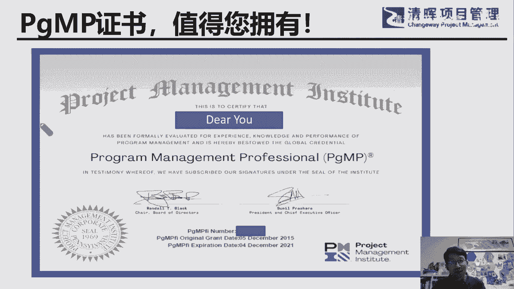

# 华为PgMP海外项目经验分享 - P4：4.华为海外项目经验分享 - 清清公开课分享 - BV1Vu411P72w

好这里面这里面就讲到了这个，这是采访的内容啊，采访内容记者问问了我问题，我回答的，首先，讲的是，就我在华为都首先去了哪里，后来陆续到了什么地方，做了什么项目啊，当年当年我是03年考取的p mp证书。

那还算有算比较早，这个证书是当时有个朋友来找我，他说那时候是老，那时候是小陈啊是吧，那时候还不是老陈，小陈，咱们去考个PMP，这后来呢他把我忽悠了，他不去，我去了啊，哎我呢哎还真是我考了证书。

而且还修了一个项目级，高级的研修班的那个结业证，那时候那是特别贵啊，03年的时候花了多少钱，花了将近3万块钱要加正，加上后面的那个同等学历的这个考试，一条龙的嘛，后来其实后面也考下来了。

后来又去华为没法做论文，你看06年一年的时间，在在苏丹就学籍保留一年，敲了就作废了，相当于是没写论文啊，这是，到苏丹以后，苏丹怎么去的救火，其实当时我进行华为的时候，不是安排我去书单的。

但后来才知道苏丹这个项目，苏丹是特级项目，两千两千多万美金的一个特级项目，其实轮不到我，那时候我34岁，这个资历还稍微差了点，差一个级别呢，但是后面，前面两拨人都不愿意去。

后来在现场顶的那个阿兰的那个资深，在项目经理说，你再不来我就离职了，其实他刚去，他去也才刚去了一个月，就去了一个月，因为当时确实是挺艰艰辛的，大家知道苏丹啊，苏丹是一个什么样的情况。

苏当时所有东西都是进口的，咱们就是中国的老板没有在那里建农场之前，所有的东西都是进口的，只有石油是出口的啊，这个这个这个是，所以说在那里做项目是非常难的，你如果说合同签的不好。

因为所有的东西基本上都海运，海运的话，一走就是一个半月到两个月，你等不起啊是吧，等不起人，那时候我在那里煎熬了十个月，当时其实我的老大是有心理准备的，我老大当时跟我说，因为我老大比我年轻啊。

他当时跟我说是挺客气的，因为华为的那个主管都很年轻啊，大家都知道是吧，我那时候我34岁，他可能才才不到30岁，他当时还尊称我老陈，我说老陈说请你帮个忙，因为他是我的导师啊，那他在华为十几年了。

这个他说这个我没有十几年哈，就是他是他，他应该是1万多工号，我当时5万多公号，我说老陈，你帮我个忙，这个你去说也许不到不到三个月，你也你也你也废掉了嗯，但是你帮个忙去一下，你如果说三个月。

你如果活下来了，他说说公司肯定有政策是吧，可以比如说后面去发达国家，后面有政策的，然后来一想他是我导师啊，那豁出去去了呗，去了之后，那真的去的时候，其实这一战基本算算走麦城是失败的，因为因为因为什么。

如果用前面的三角形来来套一下的话，我基本上只满足左边这一就第一条，第一条边就我觉得我自己有PMP证书是吧，还有十多年的那个卫星通信行业的，这个交互经验，仅此而已，另外两条边都缺失的，都缺失的。

为什么缺失，就是从那个影响力这条线来说，我前面不是特意强调了吗，要有政治要有政治倾向对吧，其实这一条就做的我就做错了，都意气用事嘛，因为是我的前任就对我影响挺大，我们是交付口的嘛，交付口是售后。

其实是其实我们的优先级是最低的对吧，我们是最后都要去包圆的嘛，那前面授权的是比较强势的，就签单的是比较强势的，那我们人为的就跟授权的就相当于对立起来了，因为他是这样的一个态势，但是我也就随了他这个态势。

这就错了，其实从我刚到苏丹的那一天，跟我们当地的主管见面了之后的那一刻，交跟他交交底的那一刻，其实就已经错了，我就觉得我跟他们是两派的，我们交付是一派的是吧，交互觉得交付是辛辛苦苦给前面的那个填坑的。

就这样的一个形态，其实这个就错了，再加上我总部的这位老大跟我说过的，老陈你不用怕啊，考评在我这里了，说你去他说你去几个月就就把你救回来了，他他说三个月吧，我心里想让我去三个月，那我六个月回。

我扛了六个月可能也能回去了，就没想到那个本地的主管跟我说，搞成因为因为华为本地，华为称赞起来的那个主管都非常年轻，那我说老陈你就留在书上代表出吧，我说不行，我是总部派来支持的。

我我只在那个三个月或者几个月，他听了肯定心里肯定呵呵一笑，他想得美是吧，但我不知道呀，我很天真的，我说他说哦，那我明白了，你是来临时支持的，他意思就是你是干不长的，是不是你不会好好干的。

这其实其实不是我的本意啊，也不是我的本意啊是吧，他其实是我TTS的主管，本地主管，那结果后来真的弄错了，到现在想想的话错的离谱，那我能借助的是什么，按照与我的项目管理，项目管理的这些本事哈。

就把日常的这些管理的工作，就各产产品线是这个这个特级项目，是所有的产品线都有，他说我在总部有没有接受过任何的产品培训，在总部就接收过十天的大队培训，规范培训就会拍到，就被派到一线去了，那可想而知啊。

可想而知，就是我能把项目组运转起来，但是我不能跟客户一起，就是把整个项目运作起来，因为这里面要牵扯到售前要改，要改合同，要改配置，要改发货太难了，前面签下当代的同事早就抹屁股走人了，去去另一个国家去谈。

就去开拓项目去了，所以说这个我就我就没有用到，这个这个五个绩效里面的治理这一条，这是我最大的失误，因为我错误的站了队对吧，我觉得好像我是人家的对立面，我很早就很快就能撤走的，这导致了我就没有用好。

这个最关键的那个干系人，就相当于是代表处的老大，这位老大后来还是成了中国区的总裁，回来之后非常厉害的一位一位一位配备老员工，我当时就没有用它呀，他是也门跟这个苏丹两个国家管，两个国家来回飞。

他也基本上不在苏丹，但我就没有抓住的机会呀，在开会的时候，我就我就没敢说话，我也就没说话是吧，因为我觉得我不是代表处的人，就最后我走的时候，这位老大，因为我们在客户的CTO家里吃烤全羊，能不能吃完之后。

他他就跟我当面说了一句，他说老陈要走了，他说了这一句，同学们这个其实是很难受的，其实很难受，后来是我作为我的老大，我总部的老大就把我给在，我们要全部下放到各个片区的时候，把我给捞回去了，那我回欧洲片区。

所以总部报道报道之后，全欧洲片区在欧洲片区之后，结果又又救火，本来要去，本来是要去德国的杜塞的，杜塞尔多夫是我们的那个片区的总部，结果中间又被截胡，又去了塞尔维亚，因为有一个那边有一个小兄弟说。

他在那里干了半年吧，他说我不想干了，我再干下去，我的未婚妻就要不跟我结婚了，他回来了，我就在那边去去救又救火，去了一救火呢，后来哎就在塞尔维亚就缠住了，缠住了两年，真的两年真的两年死也很难受。

因为大家知道塞尔维亚不打了很多年的内战嘛，对吧，他是他那个赛尔赛尔族，跟那个就是叫叫叫叫波黑，波黑战争嘛，那时候其实是男生特别少，基本上都是都是遗孀啊，这种就是女生特别多，所以他们那他们客户。

我们的客户呢跟我们交流都都是都是讲母语的，就不讲英语的，就这里面导致我们就就精心的培养，这个本地的员工，就开项目例会的时候，只能带本地员工去会议，纪要也是他们有他们写成英文的，就我们签字。

最后再跟客户那个去交流是吧，在这过程中，就很好的把华为内部的流程全梳理出来了，那时候就兼职兼的是工程经理，因为要辅导本地员工嘛，在本地的项目经理，拜在本地的那个所有的交付的这些员工，这条线的这里面。

在塞尔维亚长住两年之后，后来要去匈牙利做了一个特别特别难的项目，但是呢好在什么呢，我在苏丹做过这么难的项目，那就需要你这个项目就就不难了，就只剩中间的一个组件项目而已。

当时的我拿出来用前面的坑我填过了呀，所以我在匈牙利的时候，就很好的把这个风险全赢全，这个一个PSTN的网改项目特别特别难，但是因为有前面的这个积累，前面掉过这个坑的项目要做的也越来越顺，在挪威。

在挪威的时候，也是挪威的时候呢，因为是前面的也是特别难的，一个核心网的组网改善模组，是西门当年西门子交付的，而且跟华为签，而且客户跟他们签过NBA，就是不能给华为看一页的这个技术文档，一个参数都不能看。

所以华为在这个项目组完全是用黑盒子测试，全是研发的团队，三个三个三个同事吧，在那里办了工作，签测了半年多，就一条一条按照用例测出来的，一个一个场景测出来的做，做完挪威项目之后，我就到了。

最后到了这个波罗地海三国，在那干了两年，去的第一个项目就是我下面要介绍的项目，今天就契合我们的这个项目级，就五个绩效率契合度非常高的这样的一个项目，我们姑且称它为项目集，好吧，这样说。

这样比较这条线好梳理一点，这个项目集是什么个态势啊，跨两个国家，塞尔维亚和立陶宛，立陶宛现在名声不好哈，这政客这是瞎搞这个这个，这个风险没把握住啊，他们把立陶宛人民给害惨了，立陶宛人民其实在我的印象中。

是我见过了这么多这个当地的这个人里面，我觉得是最最nice的，最gentleman的这个这个国民啊，那这里面两个国家核心网在他总部，在这个立陶宛核心网也在立陶宛，就中心机房在立陶宛。

但是他们这个所有的基站的交付，跟传输设备的主干，主干的传输设备就放在拉脱维亚，因为它的子网在拉脱维亚，知网在拉脱维亚的交付难度挺大的，因为什么，因为是北欧北欧列强的这个地盘嘛，也是一公司的地盘。

一共的地盘，那他在那里深耕了多少年，深耕了15年是吧，虽然这项目是前期近5年前建的，但是一公司当时放的狠话，放了什么狠话，就说跟客户说不出半年，因为这项目是半年6月份到12月份，说不出半年。

你们乖乖的会找我们来续保，所以我们开的我们开的这个价格，我们会不会让你一分钱，这个是这很嚣张的哈，这个非常嚣张的这口气，这口气其实是憋着一口气的，那客户呢客户客户其实是客户很厉害的，他肯定不吃亏啊。

半年交付吗，你无限跟核心网，那我每个月我都给你定一个合同，里定一个里程碑，什么里程碑罚款，里程碑，每一个条款，就每每一个月的罚款都是几百万欧啊，都100万到200万欧不等，那他的意思就是我随时终止。

我都是都是不赔钱的，他随时拿着这些钱贴过来去贴给，比如一公司再去谈他的续保合同，他也他也是感叹的，就是说所以这个项目的话说起来挺难的，真挺难的，说这个这故事呢绝对是不平等条约。

而且客户连合同都没跟你谈完，直接把你关键条款弹完了，就说要求你哎呦，我要跟你做做项目了，就我们叫我们叫偷用，这关键才换，弹完了就法务认了是吧，就要执行了，其实所有的风险基本上都是对华为是敞开的，敞开的。

这里面的话这压力是挺大是挺大，而且因为是搬迁项目嘛，你只能在凌晨的一点钟到早上的六点钟之间，六点钟的时候，如果你如果说你在搬迁失败的话，六点钟应该是所有的包车都应该正常了，就是别人醒，就用户醒来的时候。

他一打电话应该是没有任何问题了啊，所以所以搬迁就这样的一个时间窗口，所以这个时候CTO科普的CTO，我们这西班牙人他就给我们起了个名字，专门起了个名字叫蝙蝠侠阿，就是联合团队，就华为的分包商。

华为的员工跟客户的这个运维团队是吧，我们是蝙蝠侠，就是只只有夜里出来活动的嘛，夜里上站点去去搬迁嘛，是不是，难度可想而知，因为大家大家应该有印象，波罗的海国家是波罗的海的，另一面就是北欧啊。

冬天是天寒地冻呢，天寒地冻啊，真的说那一年如果赶上是寒冬季节，冬季来的早的话，我们的搬迁项目就其实就失败了，因为风雪天是不能上塔的，不能上塔作业的，你怕打针也不行是吧，这时间窗口其实特别害怕。

我们就怕他，比如说国庆以后，国庆以后就一场大雪，那我们就我们就我们就死定了，因为你的作业的作业的时间，作业的窗口给你关闭了呀，然后关闭了，那这个时候，怎么做的，就是跟客户，就赢得客户的CTO的信任了。

他是这个项目客户这边项目的sponsor，他资历挺深的，他在沃达丰项目的捷克的一个公司里面的杰克，一个项目的项目经理，同时也是NBACEO呢，当时是在沃达丰捷克这个项目的总经理，加拿大人。

他们俩是原来在这学科就是打蛋，后来一起过来，一起被这个这个beat这个财团所属财团的，这个相当于董事会把他俩挖过来挖过来，就当时我很清楚，就是如果说CTO这一关过不了。

那相当于我肯定不是不能到不能到现场的，因为被毙掉了嘛对吧，那就再选人选呀，再选人选呀，那这里面，这里面就用到了一条，用到一条非常关键的一条，就是三角形的那个人，才，三角里面的那个影响力。

那条边跟这个五个绩效语里面的干系人，这个参与这条边，这非常关键的一条没有，我就用到了，这还有同学们可能问，陈老师不是一直在东北欧做项目吗，为什么独独在这个项目上面，发生了这么大的变化呢，是吧。

怎么可能问这个问题，其实这里面呢，刚好是找到了这个人才三角的这个第三条边，就另一条边就是三叶的这个敏感度，这条边我发生了变化，我先说这一条啊，因为我被空投到这个一个人，空投到这个波罗的海。

就其实是立陶宛的首都维尔纽斯之后，我们我的相当于两个三个主管跟我谈话，意思就是因为我年纪大，其实算是多了，都尊称我老陈说这个项目你如果做成了，你走不掉，因为我以前是一般半年做一个项目。

就可以到下一个项目，你就不能走了，你就只能待在这里，相当于就就转管理岗，因为后面有2737，而且这个是我们，而且这个项目是我们在波罗地海，突破的第一个项目，网络项目布鲁地下，还有这么多国家。

这么多运营商呢，这是窗口效应对吧，如果打开了，绝对是走不了的，是需要一个交付主管的，意思就是如果打开局面，你就就地就地被整编了，从专业岗就转到管理岗是吧，这摊子还是你自己的，这这个就把我给点醒了。

以前的话不用操这份心的呀，以前是半年交付完了就可以走人，是不是很轻松的，从这里面我的我的这个敏感度就提升了，而且我呢刚好是在他谈判阶段，就合同签订前一周让我到了现场，现场的环境我都熟悉了。

所以说从那里我就我就转变，我心里想我一期一期做不成，我肯定是滚蛋了呀，我就回国了对吧，我就不想干了，但是我是这样想的，如果干成了，那就27万1干成了呢，而且我评估了一下，因为我这么多年就是做。

那都是核心网，像无线无线没做过哈，核心网络，因为智商交付这个项目其实是核心网项目也，是吗，能听见吗，同学们，能听清能听清楚的话，帮我打个一啊，那我讲慢一点，那他这个他这个如果说如果说我这个做好了。

那我二期怎么办呀，这一下就把我的这个思想就正过来了，因为我想着我就踏踏实实，我就在赛丽陶这种波罗地国家，我再干了两年我就回国，当时我就说我定下来这一个自己对自己定下，定下来这样一个这个，目标目标变了。

心里的目标变了，他AMB啊对吧，前面提到的attention变了，attention变了，真的这心智真的变了，而且我自己评估过，以我这么多年的经验，江湖基本上还是有可能的，因为我变化的是什么。

在东北欧深耕这么多年，我自己华为内部的关系没问题，没问题，肯定比当年要强很多倍了是吧，所以回到的另外两条边影响力，这条边内部绝对没问题啊，内部没问题了，那时候就那时候，我已经成为一个典型的华为人了。

点进华为人了，业务也熟啊，产品线都熟，这些项目都交付过是吧，那现在关键就是外部那条，就客户CTO能不能拿下，我当时就就把它拿下了，我在挪威的时候，我还没到现场的时候，或者后来我到华为办事处或华为办公室。

还没有到客户办公室跟CTU见面之前，简历当然先发过去了对吧，他先看了简历之后，说允许我允许我到立陶宛对吧，还没有，但还没有说允许跟我见面，因为是投标阶段嘛，我就立马要到了他的那个邮箱，提了两条建议。

投资项目，两条风险，一条华为的人，就是交互资源可能聚拢不能及时是吧，不能空投到位的话，那可能会受不到延迟，还有一个两个国家交付，我绝对会成为瓶颈，你如果说要求我每次都要从立陶宛拉脱。

拉脱维亚开车到立陶宛，给你们每周汇报的话，那这项目就死定了，因为两个国家300km，只有120km是高速公路，其他都是70km，限速70km的那个一级公路，我说必须得解决一个问题，相当于电视会议系统。

我当时就提了这两条，他后来一看诶，好要跟你见面，他就跟我见面，因为他也很很文质彬彬的对吧，我只好也戴这个眼镜，一看我也笑呵呵的，一看一看，老陈也不像坏人哈，不像坏人，所以他就说那就是艾瑞克。

我答应你就这样子，就是我们财务办公室，就就我刚才拍照的那个那一层小阁楼，就是100多平米的，他说这个我全搬空都给你啊，相当于我们像像豆叫什么角斗士的那个角度，40在下面，我在上面，我说每天我派几个人。

当然我每天都去几个人到现场，当时看得一清二楚的CEOCTO，每周都会开车从立陶宛去拉脱维艾特，每天每次都去转一转，一看诶，人就多了，他就高兴了，所以这就把CPU拿下了，最后还是什么，他还不放心。

他要求华为给他找一个顾问，就是项目管理顾问，就是会说西班牙语的顾问，后来没办法，我们也给他配合，因为内部内部他那个顾问肯定都不熟啊，内部都归我吗，外部就先他就跟他那个客户先接口。

那那当然那那客户是其实是客户花钱，客户的朋友其实是他推荐的，一开始是替客户干活的，那我也没关系啊，然后呢，因为因为这个顾问他不懂华为的流程吗，那可能你得听我的对吧啊，所以这方面其实是可控的。

所以到后面我为什么能做成这个项目，就是因为我把住了这个影响力，这一条就成功的向上管理，首先是华为自己向上管理，把我上面所有的关键资源用到了极致，就获得了这些老大们的关键的支持。

包括地区部的副总裁叫副总裁，不然的话怎么可能成功啊是吧，我我在我项目管理的项目管理的课上，一直强调项目级的成功或者项目交付的成功，靠的什么，靠的是教整体的交付实力，就是说比如像这公司看这CPU跟我说。

在谈判的时候，你华为的交互实力我绝对百分百相信啊，你看我在捷克的时候就看到了你们的实力，你全球的交付实力你绝对是干对吧，呱呱叫，跟一公司比指挥是比他强，不会比他弱，但是他说了。

那波罗的海三国就空投了你一个陈正宏，你凭什么就跟我说，你能有华为的整体交互实力，这是他大打问号的地方，那我们就其实就成功地做到了这一点，就做到这一点，所以说如果没有影响力，这条边没有向上管理这么多。

就是大佬们大脑大脑，包括总部的研发，这个其实是所有资源的积累啊对吧，这么多年没有这条线的话，你是叫天天不应也做不成的项目的，你说就我带着下面的我，我项目组的这些人，我们拼着命干干不动的呀。

因为大家也知道核心啊，最难的是什么，这版本火车的把握呀，你版本的如期交付呀，版本如期交换对吧，无线也是一样的，我记得后面我们也卡过一个版本，因为客户的一个它的一个疏漏，它的标书上就有一个疏漏。

我们呢也有相应的疏漏，我们验证的时候也有疏漏，这样巧合出来一个bug，最后我们我们用临时解决方案，比如有解决方案的方案，有两种解决方案，再结合的方式，巧妙的很好的，在这个时间窗口内把它给把它给解决了。

把它给解决了啊，这个所以这个是还是这个项目的成功啊，这个还是挺我对我自己来说，我还是挺感动的，你的客户CPU也非常认可，他在最后的庆功大会上，就是华为的合作方，Who，还有华为双方是吧，当然华为掏钱了。

就请他在庆功会的时候，这个CPU很动情的说了一句话，说了一句impossible is nothing，这是发自真心的，他是真心的啊，那后来2737都是我自己主导下面，因为到期之后我就变成本地主管了。

交部主管了，是我去谈的，那时候我们就占有信息不对称的优势了，客户的谈判的那帮人，他们就商务经理来谈了，其他人不来谈了，那我这边呢，因为我我是参与过谈判的，但客户的法务他不懂，他不是第一次来谈的。

所以我们就抓住了客户法务的这个这个弱点，信息不对称的这个他的这个劣势，就把二期的时候就把条款很多条款都都完善了，商务也谈谈上来很多比这个慢慢的在那里经营，也很快，这个名声就华为交付的这个名声。

在当地的名声就不胫而走啊，里头就拉脱维亚的另一个运营商，相当于中国电信这样角色的，就找华为来要求再搬迁一个核心网站，立陶宛的那个相当于中国移动的视角，说的就说哎我们要搬迁3000多根这样的那个。

那么后面慢慢都谈下来，都给包围了，所以这是一个战略项目，这不是大项目，就像我在挪威的时候，就我们pm的老大去支持他，亲自去支持他，当时接跟我见面，我特意去见他，他说他说这个陈正宏啊。

他说你你不要老是在打游击战啊，对吧，你老是去救火的，是不是老是去接这个就难又小的，这个核心网项目，他你好好的跟那个当地的挪威的交通主管，说一说，你从那个项目出来，到我现在这个辅导的这个项目里面。

这个大兵团作战的无限搬迁项目里面，来挪威电信，咱们也一战成名是吧，当时当时他这么跟我说，但是没办法没机会，因为太多的项目要救活了太多项目就好，而且像我这样和新网交付的就不错的，基本上其实基本上没有。

因为这个是需要需要沉淀的嘛对吧，需要沉淀的，所以服从组织分配也是这么做下来，那这里面你看这里讲的都成功在格局，成功在格局，那就是我就打开了视野，打开了视野，什么内部的关键资源，我绝对服从分配。

就是跟资源分部门，我就是三两的三两的姿态，而不是像以前是硬抢的这个姿态，因为知道我们规模不够大，战略地位高对吧，但规模不够大，所以这个是一定是要协商的，跟主跟那个资源的主管是要协商的。

就他有他的难处是吧，他有他的优先级，所以是那个时候，其实我自己在影响力这方面跟沟通，就是团队就协同这方面是发生了变化，是发生了变化，同时同时那个什么他项目及治理呀，那项目及治理，我觉得是，非常成功。

就联合团队嘛，就就相当于是联合的那项目及治理委员会，每半个月一次的例会，要求双方的老大BER必须到场，他们也拍了胸脯的，他们也是这么做的，要要他们干嘛，用向上管理一样对吧，向上管理一样。

和关键资源要你决策，你看我们自己的这个sponsor就给我解决了，一开始就给我解决了什么问题，就我说两个国家之间，你看客户CTO给我解决了，他的那个出战士的问题，我们自己的老大给我解决了一个。

两个国家之间的那个视频会议系统问题，他刚好在瑞典代表处，就有一套现成的一套，它是赠送，因为他有这权权利嘛，就赠送给客户，因为也不用光马上就运过来，调试好就能用，解决了我大问题。

所以说项目集管理也是要基础设施建设的，指的是这个，尤其是当下哈，像那个新冠疫情的时候，是全属性女团队，虚拟团队是靠管理的吗，同学们哦，不是我的朋友们，虚拟团队是靠管，不是吧，是靠什么的。

两个国家之间在虚拟团队是靠领导的呀对吧，是靠领导的呀，那这里面就涉及到，你对他们是不是信任是吧，因为我下面我下面我有无线的，有核心网的，有网游的，有网管的，好多好多T，那这些其实都算是我组建经理。

都是有这个都是有授权的，都是有授权的，我当时跟他们约定一条，你们跟自己往上面的技术的这条线的，那个联络线，我绝对不干预，我唯一干预的是什么，就如果跟研发的PO，如果说有什么要要跟他们交涉的时候。

我需要我在场，因为那是电话会议，对不对，那时我必须在场，我就我就把握住了这一条，那相当于他们其实他们都是什么，他们都是工作才两年的工程师啊，但是一直在全球做项目是吧，就刚毕业两年。

也做过一个或两个项目的工程师，这所以说华为我特别佩服华为的hr，他们的招人的这个本事啊，还有一个就是华为研发的同事，这个是干活的这个干劲，这这两个部门是我我最佩服的，是佩服的。

因为我们在一周一线的项目经理来说，这感同身受啊，给力啊给力，你看他这里面这里面提到的都是领导啊，领导力了，战斗力了，这个是我们最需要的，这个是我们最需要的，因为你像我大部分的时间。

一开始的时候都在拉脱维亚，我根本就没法回去，因为我这个作战客户的作战室不能缺你缺我，除了我之后，人家可能一个电话就告诉那个，立陶宛的CTOCO了，艾瑞克没来啊，今天没来是吧，那人家就想了。

艾瑞克干嘛去了，是不是ERIC，人家说艾瑞克也没在我们总部啊，那我天那就乱套，所以我正在做证，立陶宛那边，我当时就，当时就空投了一味的无限的兄弟，他管着网络归网络网规网优的无线的核心网的。

这些人都由他一个人接口，同学们或者朋友们，他24岁小哥，人家每个人基本上都是在那里工作了，15年以上的，资深的老专家，都是45，40~50岁之间，人间一开始一开始是是接受挑战的，一开始我是隔着隔三差五。

我也就抽空就赶回去，就是怕客户这边的，他们这些专家有反弹，我就跟他们说，有问题就找我，就找我的，笑呵呵的，艾瑞克是吧，人家一看艾瑞克还可以，艾瑞克年纪还比较大是吧，有30多岁，看着也好像挺挺稳重的行。

而且好像CPU也发过话，对不对，那就给你面子，那个有问题找你对吧，那我说嗯特别好，有问题找我就对了对吧，那就那这位小兄弟就真的特别给力，我后来忙了一个月的时候，我跟他打电话，我说能不能顶住，怎么样。

有没有困难，他跟我说，老陈你放心，我能扛扛啊，哇那真的是这不是这不是说说假话吗，真的是热泪盈眶，因为当时在现场，就我们当时就空投的，是我们两个人，一边点一个，到最后陆续的各条线的核心骨干都到位。

他才专门做他自己，就是那个无线的对接这一块，他走的时候，这些专家每个人纷纷都送她礼物，跟他合影，我亲自给他们拍的照，那个成就感都特别大，而且客户也非常满意，这就是为什么这就是什么战斗力，打开了这战斗力。

所以我，我我回来以后啊，就是包括我做顾问讲师以后，我所领导力这方面有一个很奇怪的现象，同学们朋友们跟大家分享一下，原来我看不上的这些东西，现在我都在学这什么东西啊，领导力我原来看不上什么领导力啊。

不就发挥人家的对吧，战斗力吗，领导力看不上教练，教练跟我有关系吗，那现在这些这些人都拿了证书，都都都学了，领导力就专注于behavior，就行为的整两个门派的两张证书。

在这个高绩效教练的这个这个证书是吧，这个你会发现什么PMI的人才三角都变了呀，它都变到了那个最重要的两条边，那说明我们还是有前瞻性，那相当于到了哪个领域，OD这个领域组织发展。

这个领域稍微往里面的边界稍微碰了一下是吧，我们不可能深入进去，就是我们这项目机关里最强调的就是边界，就是boundary，就跟人家握手，或者说你的interface的这个这个强弱是吧。

你的boundary的那个这个这个程度大小，合适程度啊，这里面，所以所以我们需要打开的一定要打开，你看这一些领导力也好，就是发挥人家的积极力也好，这都是基于信任了对吧，领导力领略领导力是非常有名的。

他有五个原则对吧，同学们应该有同学肯定知道，这位同学肯定知道哪五个原则，同学们能不能打一下，这几天我正在看领导力的这个第六版，就是国内的领导力的那个权威推荐的，他说这是经典第六版了。

看你慢慢的也也继续往下走，继续往下走啊，因为这觉得这有用吗，这有用，我相信同学们和朋友们，也许已经早就早就在看这方面的书了是吧，因为你工作中，工作环境里面，你感觉到了，我们是领导团队。

往前深圳领导自己嘛对吧，自律嘛，这是领导团队，这是领导组织嘛是吧，这就是这三个层级，这是必经之路，必经之路，绕不过去的，你说我就作为专家自己一直是领导自己，那你就是那你就是不断地精进的一个技术专家。

这个的难度一点都不亚于你后面走管理岗的，这个难度是吧，因为你现在的更新换代太快了，可以换的太快了，这还有一个就是，难道说炉火纯青酿醇酒，这讲的啥意思，讲真是角色需要火候的，我前面这半年半年半嘛对吧。

其实我和中国区后来最后半年回中国区，也是在做公司的特级项目，是北京那个国际信息，移动信就是北北京，就是移动的北京信息那个国际感的这个项目，也挺难的，很难做的，因为IDC项目跟原来做的项目也不一样。

但是但这么多的项目都做完了积累，你看过了这么多年的，这次是几年不断的去复盘，这复盘才慢慢的品出来，当年其实是应该有应有的味道，应该是怎么样的是吧，当年就是吃掉了很多的味道，没查到。

那是因为当时的自己的认知受限了，觉得自己是一个是一个专业业的项目总监是吧，我是专业的，我是用PMP证书的，我是华为多少级的，这这这这这这样，那个项目经理觉得自己是专业的。

其实专业不等于professional，知道我们应该是职业的才对，太装了，意思就是你的语言，人家可能刚刚可能听不懂是吧，所以这也是为什么呃，项目集就是p mi的那个人才三角，把第一条边讲成。

把它换成了这个那个哪哪一条边就是工作方式，而不是项目级的专业技，项目管理的专业专业技能是吧，这其实它的变化是是有它的这个背景在里面的，背景在里面的，他非常的幸运，非常的幸运，回到华为总部之后。

相当于就真的是参与了变革项目，对我说的那个RFS项目群的那个其实叫PFM，叫项目财经项目财经的那个管理项目，财经管理的这个这个组建项目的，这个很多的业务支持的工作，因为是业务，因为是业务业务专家嘛。

所以财经的这个研发的人员就会来咨询，我们说这地方能不能往下装单数据啊对吧，那能不能萃取数据啊什么的，这有什么这么勾稽关系呀，那这里面也参与了一年多，其实收获挺大，收获挺大，那对华为的核算的。

整个整个核算的这个体系就非常清楚，这样的话就把原来在海外在一线做的项目的，所以就是更零散，很零散的一些一些一些东西都整合在一起了，都整合在一起了，所以说这个为什么，我说这个智慧就在原来中国的项目了。

如果说你没有这样的一线项目的积累，是没有这种感觉的是吧，是没有这种感觉的，所以所以这个这个也是说是要假以时日，要假以时日对吧，要假以时日，那你看大家总部的时候，这边左手供应链ISC项目。

右边这个FS项目，其实这其实是端端端要拉通的嘛是吧，端端拉通的嘛，它要数字化嘛，其实是数字化转型嘛，看这里面都用的都用到了啊，都用到了，这里面讲到一个太极思维，太极思维，打一个比方啊，不一定贴切。

比如说我们学了PB之后，还有这么多的过程中，这么多的那个过程特别好用，我是从03年到你看到15年考的证，用了十几年特好用，因为你只要对某一某一个这个过程感兴趣，你就可以用了，确实很好用，确实有效果呀。

确实有效果对吧，但是公司项目多了，公司给你的项目也多了，忙不过来了，忙不过来的时候，你就不能这么干了，因为我顶多就双手双脚对吧，那时候就要请人来干活的时候，那就要换思路了，换什么思路。

我们说过项目集和项目其实是不一样的，就项目经理和项目经理的定位是不一样的，项目经理是纵向的是吧，纵向的就一根一根纵向的，那项目项目级经理呢是横向的，它是横向拉通协同的，它起的是这个作用啊。

这个作用项目经理是顶梁柱，纵向的顶梁柱，项目经理是栋梁，是横向的主梁嘛对吧，我把这些有依赖关系的，有关系的这些组件项目都把它给很好的节奏，给他们联系在一起，把握住一个整体的接受。

但能够实现组织的基金的收益，所以这个从这一方面就可以结合，像PMI的人才三角，来看看项目经理跟项目的经理带着三条边的，他的力度也好，或者是权重也好，大家肯定会有自己的思考，肯定会有自己的思考对吧。

肯定是不一样啊，一个横的一个重的，一个横的一个纵的啊，那里面，所以说这里讲了，说这个唉你项目经理绝对是专家呀，绝对是交付的主力，你项目经理如果没有项目经理的这个跟你协同。

你项目的经理是作为项目管理的一个oppo pad，你这open的没地没地方用的，你的盖帽没地方盖的没用，这项目经理绝对是非常非常重要的，非常非常重要的是吧，那项目基金理呢能够让项目经理更出彩，对不对。

能够为组织实现更多的增量收益，或者说能够让非常重要的战略项目从做不成，要做成，这也是天壤之别呀是吧，这也是天壤之别，这也是组织里面必须需要的，这个一这一集需要需要人才需要的人才。

我说项目基金理项目基金是吧，因为他必须达到通盘考虑，节节贯穿呀，积极贯穿你的资源，是要按照上面的意思，你要通盘整合上面的资源好，当时，当时我为什么，为什么我后面从那个华为出来之后，会做那个顾问讲师。

那是因为项目管理真的是让我受益，就是我这第二段，第二段讲的就是我就运用了，我学了P也学了PINBOX，就PMP以后我用我就用了里面的风险管理，就把我老父亲的这个相当于大病手术之后的，这个这个命保住了。

但一点都不夸张，我如果说没有加以这个这个风险管理的话，就让他任其发展的话，结果绝对不是这样的一个结果，这一点是我，我非常庆幸我003年我学了PMP，还考了PMP，有用真有用啊，真有用，所以处于这起发点。

而且我通过前面这么多年，在华为海外的这个实践，我隐约感觉到项目及管理也是非常有用，也是非常有用，所以我就选中了这个这个点，我说我来积累做，做一些相当于是前期的积累，总得有这样的同行是吧，做这样的事情。

做这样的推广的工作，所以我就在这里面，一直这几年一直在深耕，他一直在深耕，我的理念就是人生就是一个特殊的项目经，我们每天会在我们自己会发起发起，发起这个组件，也会关闭组件，还是节奏是我们自己把握的。

所以你这样一想的话，你把你把这span打开，对吧的广度打开之后，我相信你的心态会平和很多，可以平衡很多，因为假以时日在一定的特定的节奏，你原有的组件，就现有的组件之间肯定会发生，连这样不那样的联系的。

会产生这个增量收益的，所以说项目项目及管理呢，就是有一个很好的好处，就是可以让我们自己啊，包括在学项目集管理的过程中，比如考PGM证书，这含金量非常高的这样一个证书的时候，我们的理念会变成什么。

从成本管理，从成本思维就说，哎呀我投入多少的这个沉没成本了是吧，从沉没，从那个成本思维会转移到会转到投资思维，跟这个赚钱思维，就从收益的角度来看，我不从分子的角度来看，不从分母的角度来看。

我从分子的角度来看，因为从人生的这个程度来看，我整体的收益来看，这样的话视角会会有所应该会有所改变哈，指甲会应该有所改变，那你看这就是那个BPCP的一个证书。

但我截的时候好像外面的一条特别漂亮的，棕色的那个边没放进来。

是新版的新版的。

我觉得还是值得拥有哈，国内的存量，现在现在也也就三四百张哈。

尤其疫情来之后，一年基本上考一次。

