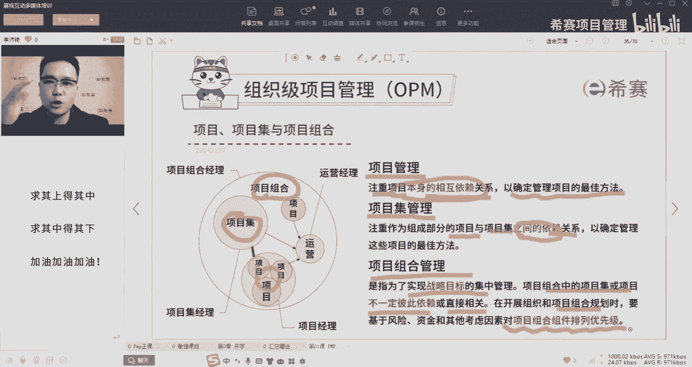
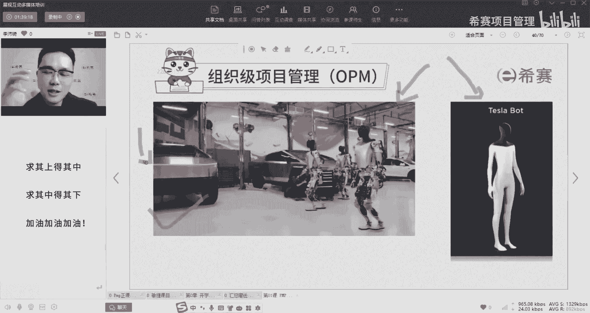
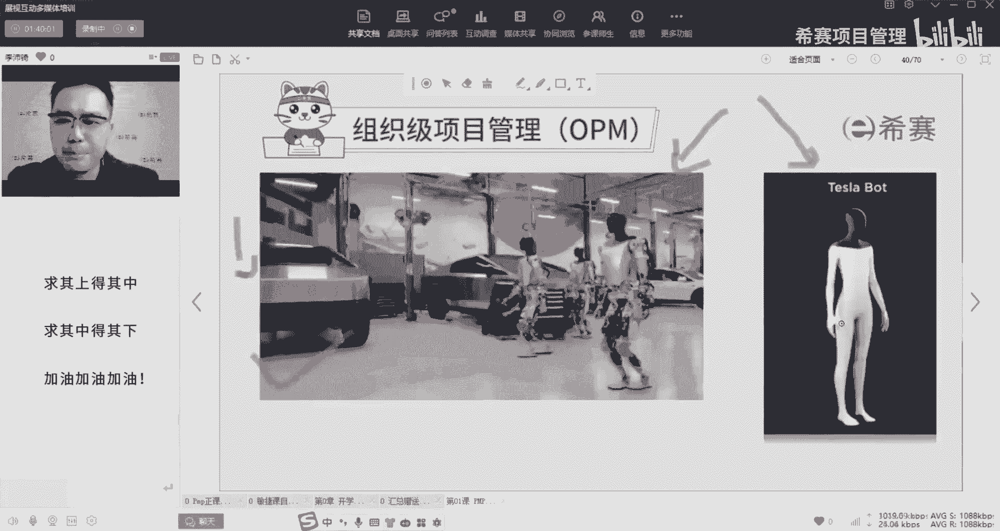
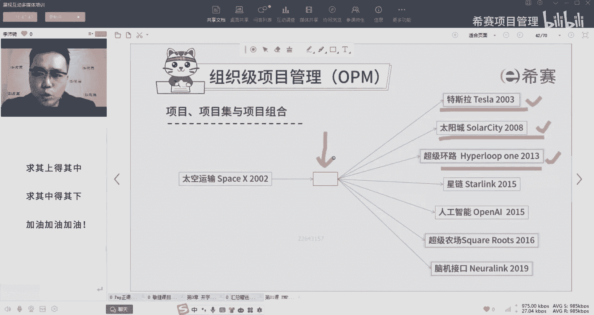

# 备考推荐！2024年PMP项目管理考试第七版考点解析直播课视频合集（试听精华版）！ - P12：项目项目集项目组合讲解（李沛锜） - 希赛项目管理 - BV1V1421i7dQ

刚才说的项目管理，它是注重项目本身的相互依赖关系，是不是那个蛋里面有范围，进度成本资源相关方啊，采购风险整合沟通等等这些东西，所以他只在乎自己的这些因素，把他们用最好的方式组合起来。

那往大里放一点叫相极啊，就说了这里啊项目集呢里面有好多很多个项目，为什么叫项目集呢，是因为这些小的项目集之间是有依赖关系的，这称之为项目集管理，那再放大一点，项目组合是为了实现组织战略目标而进行。

集中管理的这些项目，但是他们之间不一定彼此有依赖关系，但是有一个核心特点，在开展项目组合的时候，对于项目组合里的项目必须要排优先级。

那我举个例子好不好，项目项目及项目组合啊来说，这里这个火箭大家都认识吗，有没有认识的小伙伴对马斯克的space x，这不前两天又爆炸了吗。

刚刚发射上去，好像几分钟，10分钟爆炸了，对不对，我们再来看特斯拉的人形机器人，对不对，右边是它的概念图，左边上了原型机啊，测试测试机，生产测试呢对背后还有这个CYBERTRUCK啊，这眼尖哈。

俗称可以行驶在任何星球表面的皮卡。

右下角，这个图呢是这个机器人自己的视觉来识别环境，识别建筑物啊，怎么走。

哪些是路，哪些是草地不能踩，那我重点不是想说这个机器人，也不是想说这个track。

也不是想说这个火箭，我是想说的是马斯克，他有很多很多的公司，对不对，02年做了space x，03年做了特斯拉，08年做了太阳城啊，在美国的house上面装了那个太阳能板啊，咱们国内俗称光伏。

还有超级环路，超级高铁，高铁在真空管道里面，它的时速应该能达到1200km每小时，从美东到美西可能俩小时，那非常快了啊，咱们的高铁也就是才300多吧，啊现在是300多啊，以前还可能快一点好。

接着15年的新电发出的那个低轨的卫星，一共发射43万多颗啊，把地球整个包起来，人工智能OpenAI是当年马斯克投资的，他是合伙人之一，后面他退出了哦，还有超级农场，就说白了叫无土栽培，这是超级农场。

是马斯克大帝之前搞的好，还有脑机接口，你看这个是不是按时间顺序来的好，我在这想问一个问题啊，为什么03年他拿一个亿做了特斯拉来，大家要思考一下啊，好多小伙伴已经想出来了啊，因为我们的重点就是在解释项目。

项目集和项目组合，对不对，好我们先说特斯拉，特斯拉大家都比较熟，对不对，咱们俗称刹不住嘛，反正就是怎么都刹不住好，特斯拉最核心的除了刹不住，还有什么最关心叫自动驾驶，因为它基本上自动驾驶。

是现在全球最顶尖的自动驾驶的模型，那请问一下，如果说我买个特斯拉的车，自动驾驶系统里面有系统，就有那个软件系统算法，如果说我光做了这个算法，就交给我们的那个车主，他能不能用，肯定不能用啊，还要匹配什么。

还要匹配摄像头，因为他现在是纯视觉识别，咱们班里面肯定有好多小伙伴有特斯拉车的好，是不是这个算法要匹配到摄像头进行识别，这两个打包给到车主能不能用，是不是不能用，还要放到什么上。

是不是还要整车装到车上面去好，请问一下自动驾驶的算法，一项目和摄像头匹配的二项目，还有整车安装了三项目，请问他们是项目集还是项目组合还是项目啊，有同学说是项目组合呀，它们之间有联系，你不能单独交付。

他们叫项目集，你说光给你一个算法，光给你个摄像头，你说你怎么驾驶，你自己驾驶吗，没有车不行吧，你光有算法，光有车，没有摄像头也不行，所以它们之间是有联系，不能单独交付，这就是项目集的特点。

好这下清楚了吧，好接下来看为什么03年成立了特斯拉，为什么在03年不成立人工智能，为什么不成立超级环路，刚才有同学说了啊，特斯拉有现金流啊，它们之间有没有联系啊，特斯拉和太阳城有关系吗，没关系吧。

特斯拉和space x有关系吗，没关系吧，那为什么要先成立特斯拉，因为马斯克手里就那么点钱，现在只剩下一个亿了，他没有办法同时去拓展这么多项目，所以优先级最高的就是先把车搞出来，然后立马卖给鸣人变现。

因为资源有限，时间有限，所以是不是排序，虽然我们02年成立了space x，但是03年先搞特斯拉啊，有了特斯拉之后再去搞太阳城，完了后面陆陆续续的又基于项目的特点，那它们之间是什么。

是项目集还是项目组合，是不是很典型的项目组合对，所以项目组合是有优先级排序的特点，因为公司的资源资金时间都是有限的，我需要立马变现，你看这是这个是个项目啊，你可以说这是个大项目，对不对。

他们是一个大的最大的一个项目组合好，来请问一下中间这个红框，我是空。

