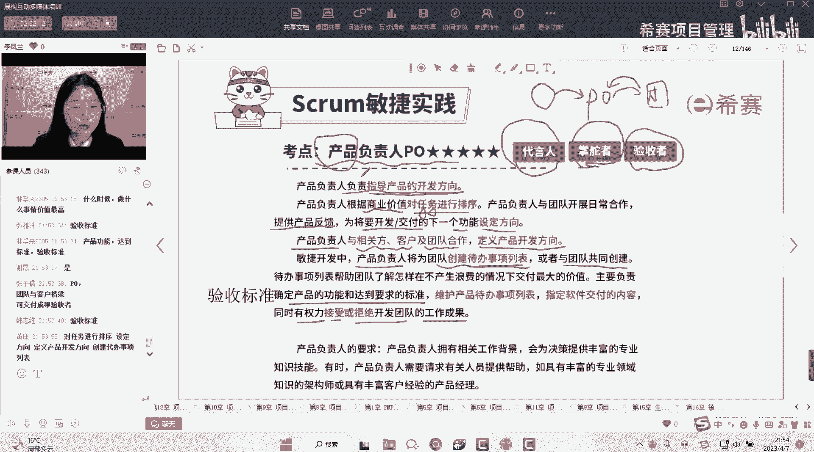
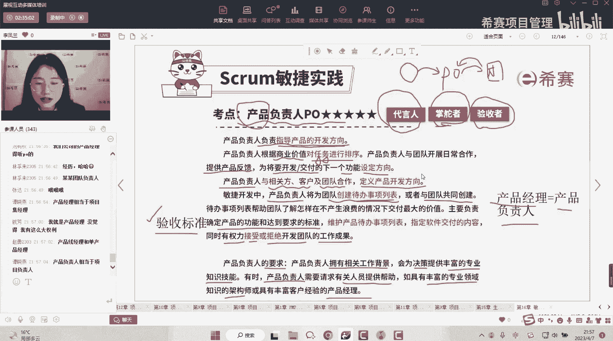
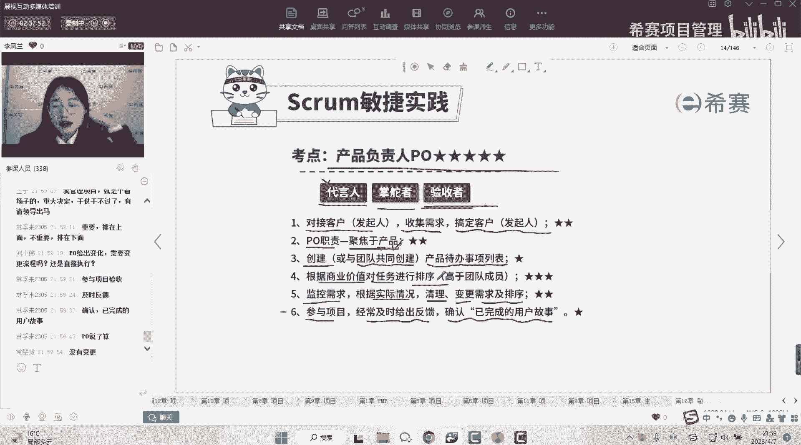

# 备考推荐！2024年PMP项目管理考试第七版考点解析直播课视频合集（试听精华版）！ - P2：产品负责人（李凤兰） - 希赛项目管理 - BV1V1421i7dQ

首先第一个产品负责人啊，那今天呢我们就只够讲我们的产品负责人了，产品负责人字如其名，负责产品的人嘛，对不对，负责产品的人，那怎么叫做负责产品呢，啊他就包括他会去指导我们产品的开发方向。

为什么它能够指导我们产品的开发方向呢，啊其实就是因为它跟关干系人关系很好对吧，我们刚刚说相关方的需求是对接谁，对接产品负责人，所以他知道相关方我们的干系人啊，他心里面想的什么，他的一些心里想说的话。

都跟我们产品负责人说了，那产品负责人当然就知道客户的需求是什么，那我这个产品怎么样去开发，他肯定就非常的熟悉，对不对，所以啊他跟干系人关系好哼，所以它也被称为我们客户的代言人，你看他们关系好到这种程度。

可以替他说话，对不对啊，就是我们客户的代言人了，那既然他是代言人，所以他能够指导我们产品的开发方向好，那我们说产品的开发方向怎么样去体现呢，我们的需求有这么多，那我的方向到底在哪里。

怎么样去体现我的方向呢，啊它其实就是说，那么在我们要做的所有的这个需求里面，要做的所有的事情里面，哪个是最优先要做的，那这个就是我们的方向，我在我要做的啊所有的事情里面啊，告诉你诶这个是最重要的啊。

这个就是方向，所以他要指导我们的方向，它就需要根据我们的商业价值，对我们的任务进行排序，告诉我们最重要的是什么，最优先要做的是什么，这个就是我们的方向，对不对，所以说产品负责人很重要的，他得有真本领。

它得根据我们的商业价值，对于我们需求，这里的任务其实就是我们要做的事情嘛，其实就是我们的需求来去进行排序，光排序还不够，他还得跟我们的客户一起去啊，跟我们的团队一起合作，因为他知道客户的需求是什么。

所以我们团队做的东西，跟客户的需求是不是一致的啊，他能够去给出他自己的说法，所以他要去反馈，然后呢，为即将要开发或者是交付的下一个功能，设定方向啊，也就是排序，所以说我们的产品负责人。

你会发现它就像一个桥梁对吧啊，我们的客户的想法啊，他知道他听到了PO，听到了之后呢，反馈给我们的团队对吧，然后团队做的东西做的怎么样呢，哎也要跟我们的PO去反馈，然后他们俩呢要经常的去沟通。

哎经常的去哎这样子，然后客户有新的需求呢，他也会哎反馈给我们的PO，所以PO呀它就像是我们的客户和团队，他的一个桥梁啊，非非常重要的一个角色，对不对，所以他说我们的产品负责人会和相关方。

客户以及团队合作，共同去定义我们产品的开发的一个方向，也就是唉去指导着我们产品的一个，整体的一个开发啊，像是一个领路人，所以我们称之为掌舵者啊，掌握着我们这个船该往哪个方向开啊。

是往直着开还是转弯还是怎么转，他都非常清楚，因为他跟客户啊关系好，知道客户的需求在哪里，那既然他知道客户的需求在哪，那我们团队做的怎么样，他也能够有发言权，所以他会作为一个验收者。

也就是我们团队交付的这个内容呀，啊到底做的怎么样，他可以说是OK的还是不OK的，也就是说啊，这里说的他会有权利去接受，或者是拒绝开发团队的一个工作成果啊，所以他是一个验收者好，那么产品负责人。

我们说他要去指导产品的开发方向，他要去进行排序，那么他再去排序进行指导方向的时候啊，就必须要有工具啊，对不对，那咱们这个能力越大啊，这个责任越大，那我肯定要有一个趁手的工具，让我来去进行排序。

我们对于任务进行排序，是不是就是对于对于需求进行排序，所以产品负责人他跟我们的需求池，跟我们的待办事项列表啊，基本上是息息相关的啊，因为他是指导产品的开发方向嘛，怎么样去指导呢，通过优先级来指导。

那优先级可以在哪里去体现呢，在我们的产品代办事项列表里面，所以说产品负责人，他会去创建这个待办事项列表，或者是和团队一起去创建啊，然后呢就去进行排序啊，帮助我们的团队去了解，就是哎呀。

我们什么情况下做什么样的事情是最划得来的，这个价值是最高的对吧，同时呢还会去确定我们产品的功能，和得达到要求的标准，好这句话要注意他说的是什么，确定产品功能达到要求的标准，他说的是什么。

是不是就是我们的验收标准啊，好啊，那么这一页PPT呢，这一页咱们就能够去总结一下产品负责人，他是一个什么样的角色，他跟客户关系很好，跟我们的干系人关系很好，所以他知道客户的需求是什么。

他知道客户的需求是什么，所以他能够去创建我们整个产品，整个项目的需求池对吧，所以它是创建待办事项列表，并且会对我的待办事项列表进行排序好，那么在做事情的过程当中呢，他需要啊是一个桥梁。

是掌舵者会跟我们的客户去进行交互，跟我们的团队去进行合作，提供反馈，那团队做完了之后呢，他还会去给出啊，作为一个验收者，去拒绝或是接受开发团队的工作成果。

同时一切的根源其实就是在于PO，他知道需求是什么，所以他也知道客户的需求要做到什么程度，才是OK的，所以他会啊指导我们的团队，或者说主导我们的团队，一起去确定我们的验收的标准。

所以这个就是我们的产品负责人，那你会发现啊，产品负责人其实是非常重要的，所以呢我们产品负责人呢，他就不能是一个就是啊绣花枕头，他得有真正的实力啊，他得非常的能力过硬啊，他需要拥有相关的工作背景。

能够去为决策提供丰富的专业知识技能，什么专业知识技能他要会排序呀，他要能够去根据商业价值来排序，对不对，有的时候呢我们的这个产品负责人呢，他可能需要请求有关人员的有关人员，去提供一些帮助啊。

所以说呢啊一般来说我们的这个产品负责人哈，它需要具有丰富的专业的领域的一些知识，它有的时候会需要我们的架构师啊，或者是产品经理去给出一点一些建议，或者是给出一些帮助好，那这里呢又会出现一个词叫产品经理。

首先跟大家说一下产品经理啊，但在大家做题目的时候，你把产品经理等同于等于产品负责人就可以了，在现有的PMP的考试当中，我们的产品经理其实跟产品负责人是等同的啊，在现有的考试当中是这个样子。

这个样子去理解呢啊省很多事，你不用去想太多，但是在实际当中，或者说在CP的领域，是可以有单独的产品经理，和单独的产品负责人的啊，只是说的是实际啊，实际不我们的实际的过程当中，我们的产品经理他的职责。

他的这个范啊，就是权利的范畴啊，它是可以高于我们的产品负责人的，他你想嘛，产品经理他可能是管理的是一个产品的团队，那这个产品的团队里面呢可能有产品的助手呀，或者是产品的负责人。

他一般来说是做多个产品线之间，多个产品线之间的这样一个市场的一个规划呀，还有就是我们啊这个多个产品线之间的，这个市场的调研呀，市场的调查呀，啊来去这样子的嗯，但是就现在的考试的这个偏僻考试里面。

你就把产品经理和产品负责人等同就可以了啊，对对对，有一点啊，产品经理有一点相当于项目级的一个经理，是的好。

那我们来哎小小的总结一下我们产品负责人，他的一个这个角色啊，重点他的一个重点，首先呢它的三个关键词就是代言人，掌舵者和验收者啊，跟干系人关系好，知道干系人的需求是什么，所以他能够去作为客户的代言人。

所以呢他需要去对接我们的客户，收集我们的需求，管理我们的客户，所以你发现啊我们的敏捷里面需求变化了呀，需求变动了呀，我要去收集需求了呀，我要去在客户那里了解他的一个需求了呀。

啊其实都是我们的PO在做的这个事情，而PO的职责呢就是聚焦于我们的产品的啊，他就是在这个产品上，你你要是让PO去唉，我这个代码怎么写啊，PO不做这个事，PO主要是聚焦于我们的产品，同时呢会去创建。

或者是和团队共同去创建我们的产品，待办事项列表啊，创建我们项目的一个需求池，然后呢需要根据商业价值对于我们的需求池，对于我们的任务进行排序，就是排序的这个动作，也是他自己本身的一个职责。

还有就是那我们的需求不是一开始就确定的呀，敏捷的需求它是会变化的，所以他会去监控我们的需求，根据实际的情况清理呀变更呀，然后呢及时的去进行排序，所以我们说在敏捷里面我们的需求变化啊，他不是随意变啊。

它那它是怎么变呢，那就是这个变化需要让我们的PO去评估啊，PO去进行优先级的排序诶，这个需求的变化啊非常的重要，那么它就排在上面，排在上面，也就意味着我们要及时的去处理，对吧啊。

如果说他们没有那么重要啊，排序它的重要的程度在下面，那我们可能就是以后再去做嘛，啊现在先不用变，先把它放到产品代办事项列表里面啊，等后面啊就是到了轮到他的时候，我们再去做。

第六个呢其实就是我们的验收他会参与的项目，并且呢他会及时的给出反馈，去确认我们已完成的用户故事，所以说啊，所以说呢，我们的团队做的这个需求做得怎么样啊，能不能是OK的啊，还得我们PO说了算啊，PO说哎。

根据我的这个验收标准啊，他这个是OK的，那就是OK的，如果在PO这里，他说根据这个验收标准，你做的东西是不合适的，那么他压根就不会放到客户面前去展示了，所以PO他会作为我们的一个团队的验收者。

先得在PO这过过关，过关了啊，你可能才会到客户那里去展示好。

