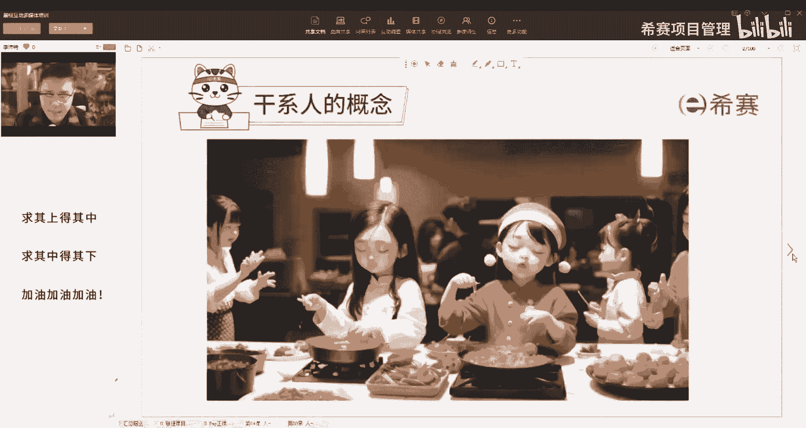

# 备考推荐！2024年PMP项目管理考试第七版考点解析直播课视频合集（试听精华版）！ - P5：干系人概念（李沛锜） - 希赛项目管理 - BV1V1421i7dQ

干性的概念，那这张图里面大家可以发现啊，这是一个聚会，好一般我们想下家庭聚会，我们会和哪些人产生关系，比方你要请你的亲戚朋友，不管是远房的还是近房的啊，可能邻居啊关系也不错啊，叫过来啊。

好像他们的孩子要不要叫过来啊，有同学直接总结了，能扯上关系的人都扯上了是吧，哦孩子是不是也得来哦，还有做饭的人吧，厨师还有什么家庭聚会，交什么朋友是吧，对家庭聚会你就做家庭的嘛，如果像国外的话。

是不是基本上开一个party啊，邻居啊什么的也都叫过来了，同学都叫过来了，好，那请问哈，如果说这里面有一个你的同学，他自己家里养了一只猫，或者养了一只一只狗，你要不要照顾你，是不是也得准备这个狗的饭。

狗粮，猫粮要是不是要准备好，如果对方家里呢有有好几只狗，他没带过来，他有一个二哈好，那他是不是又不能在你这玩的很晚，不能说在在你这聚会的时候要玩一通宵，因为他回去还得把这个二哈放回来。

要要不放出去溜一圈，那回家那个家里被造了啊，这个纸也被扯了，这个沙发也被咬了啊，到处全都弄翻了，是不是，那请问一下他的这只狗和你的项目有没有关系，有关系吧，请问这个狗是不是你的干系人，我们俗称干系狗。

所以这个干系人哈不是指的是人，虽然大多数情况下指的是人，但是有很多很多的关系我们就很清楚了，只要和项目相关的，或者说和项目不相关的，他认为和项目相关，或者你的项目会影响到他的，都称之为干系人。

所以识别干系人是非常非常重要的，我们做一个项目，如果说你没有识别清楚，我刚刚说的那个例子里面那个二哈好，这个人哎，中途要走了，而他是个非常壮的一个人，他走了后，这个气氛一下就散了，你那个项目是不是哎呀。

感觉好像意犹未尽的感觉，所以识别感情是非常重要的啊，比如说自以为是的，你做项目自以为是，他认为你这个项目吵到我了啊，你一问他在哪，他住在这个一公里之外，但是他又认为你这个项目吵到我了，你也没办法。

他也是干系人啊，还有我们媒体啊，金融啊等等啊，游说啊，环保人士啊，这些都是干写，那这里的我们来说下干洗人有两层意思，一个是广义的叫做跟项目相关的所有人，就包括了内外内部的，比方项目团队是不是干洗。

也是干洗，外部的商，那只狗也是干邪啊，这是广义的，但是我们为什么有单独的干弦这个主题啦，是因为要和咱们前面的资源做好划分，前面讲的资源特指团队，所以在这里我们讲干系人这个主题的时候。

指的是项目团队以外的人，称之为干先人，所以是狭义的，那做题的时候你要判断清楚哈，大多数情况下指的是团队以外的，跟项目相关的人叫干系人，但是有的时候也会指到团队，看题的时候，你要看清楚他的意思啊。

像这里发起人，你看脚踏两只船，又在项目内，又在项目外，他又说关键干系人，对不对，项目经理是关键干系人。

项目管理团队是关键。