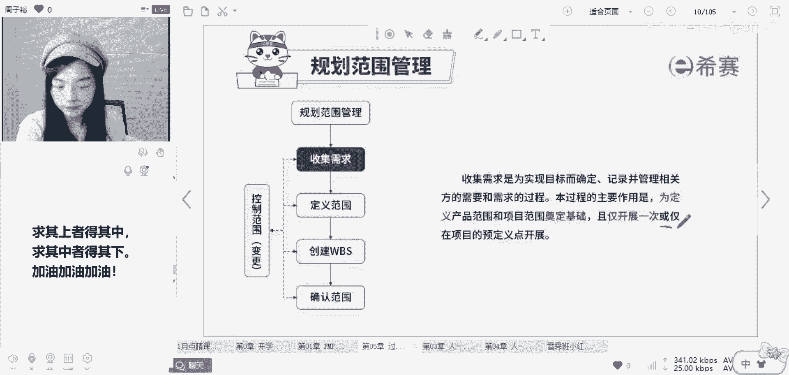
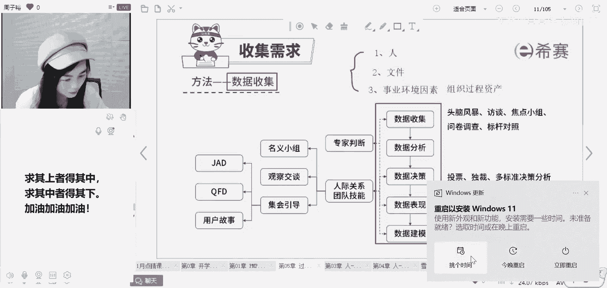
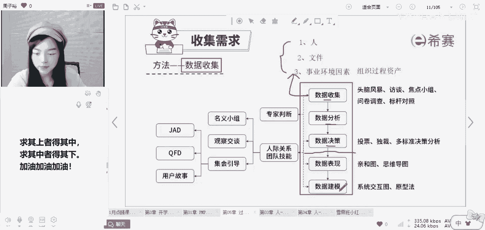
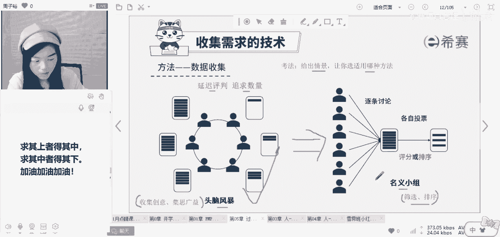
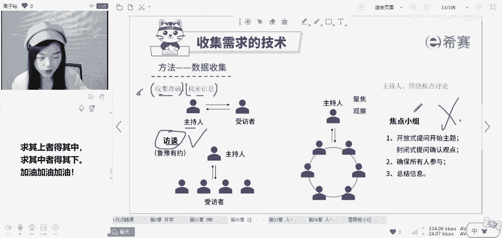
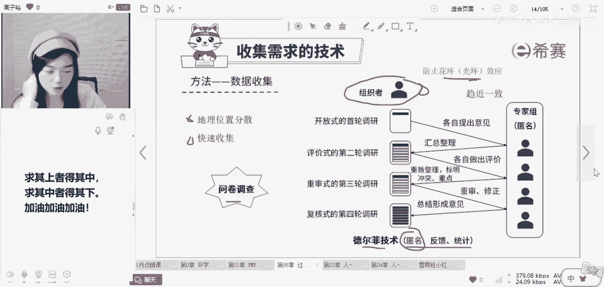
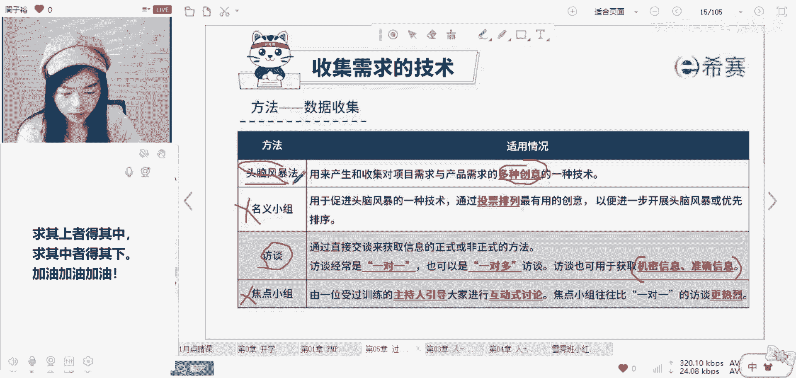
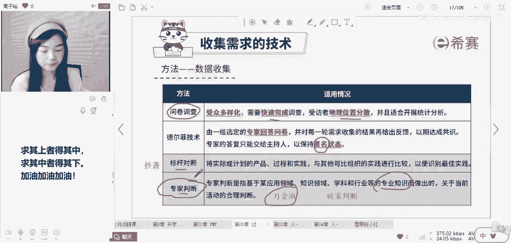

# 备考推荐！2024年PMP项目管理考试第七版考点解析直播课视频合集（试听精华版）！ - P6：规划范围管理（周子裕） - 希赛项目管理 - BV1V1421i7dQ

在我有了规划范围管理，针对于需求和范围模块，我都知道了如何做之后，产出了需求管理计划和范围管理计划，然后我的第一步是干啥，就是收集需求了，那么收集需求你得知道它是范围的前身呐，你只有知道客户想要什么。

才能做出来他想要的东西，而这件事情是不是只要做一次啊，你想这个时候是不是只要做一次，不一定，所以这里会有一个或字啊，我收集需求的过程是为了定义后期的产品范围，项目范围奠定基础，而这件事仅开展一次。

或在项目的某一些时间节点展开，这个主要就是看你项目的大小了，如果你这个项目比较复杂，比较的长，我可以去分阶段的收集客户的需求，但如果你这个项目很简单，我早期就可以啊确认清楚，那我可能就只要做一次。

所以看项目本身的需求明不明确，来决定你收集需求的频率，那么思考。

如果我要去收集需求，如果是你的话，你一般从哪几个维度去收集啊，给大家做一个会诊啊，一般而言你可以收集需求的维度有蛮多的，第一就是人这个维度，客户相关方，发起人领导，这些其实是一种典型的。

我可以去收集需求的维度，但除了人还有吗，还有吗，可以想到啥吗，同学们，文件我需不需要去参考，比如说你可以去看一下，以合同为代表的一系列文件，你项目的项目章程，还有一些规范性的东西，就比如说你要做项目。

有一些规则，你是一定要符合的，通关的标准是什么呢，就像咱们打打游戏一样的呀，这些东西你要思考到啊，章程也好，合同也好，你都要去看一看，还有第三个维度，就是我们大家有提到的啊，事业环境因素。

法律法规这些东西我也要去考虑到，还有没有还有没有，还有一个东西被大家忽略了啊，这个东西啊其实用的比较多，但是很容易被忽略，叫做组织过程资产，我可不可以以我们公司，或者是我可以看到的一些别的项目的。

这种历史为镜，以史为镜，我看看别人是怎么做的，别人有些好的东西，我能不能够去总结出一些经验教训，能不能够用在我项目上去避免一些坑呢，所以咱一般收集需求，你要考虑到的主要这三个方面，人你要去收集。

尤其是一些客户，一些领导，如果你的连他的需求都没有收集到位，你后期就别提你做出他想要的东西了，还有第二个就是你要考虑到相关的文件，第三个就是你要考虑到外部的血液环境因素，还有你有的一些组织过程资产。

有的时候你不需要从零开始，你可以去借鉴参考的，当然可以去借鉴，OK而这三个你了解一下就好了啊，而重点这块会考的是什么呢，可能会考到就是我如果真的要去收集需求，可以用到的一些工具技术诶。

大家看这一列就好了，可能会考到的工具我都列在PPT上面了，没有考到的工具你就不用管它了，当然后期如果你有时间，你可以去查查相应的资料，咱们教材上面呢好像也有这些东西，但考试从没考过。

咱就不会作为重点放在课堂上去讲了啊，好我们来梳理一下，如果你要收集需求。

如果你要收集需求的话，你得知道它是有一个逻辑顺序在的，首先第一步受数据收集，为什么第一步要收集，因为你不收紧，你怎么做分析，怎么做决策呀，所以收集我可以从我刚才讲到的人也好，文件也好。

组织过程资产里面去获取这些需求，你只有知道人家想要什么，你才能做出来他想要的东西，他是一个无中生有的过程，先把数据收集上来，但是不是我收集上来的数据我都要去处理啊，不是我要分析，我要去做决策。

我要去定下来，哪一些事情是我们要去完成的，哪一些是我们要优先完成的，哪一些我可以舍弃，哪一些我可以放到后头去做，这就是分析和决策，而数据表现和数据建模它又是一个维度的了，它其实通通都是在我决定了。

我到底要做哪些东西之后，再次呈现和印证的一个过程，诶，这就是它的一个逻辑，我们待会儿就会一个个的展开数据收集，你可以用到什么样的工具啊，决策可以怎么样表现可以怎么样，数据建模可以怎么样。

好一个个来看我们讲这些工具，技术休息啊，首先第一个头脑风暴，它是数据收集一个非常典型的技术呃，技术啊，而这里所有的工具它都是一种考法，什么考法呢，就是给你情景，让你选择在这样的情景下。

你到底应该用哪样的工具最好，那你就要知道这不同的工具，它都有不同的适用场景，但是现在其实我们把ITTO，这些工具就是弱化了啊，原来考的非常的多，现在没有那么多了，但是你还是得知道他不是不考，只是考的少。

首先第一个头脑风暴，看到这个名词想到啥，头脑人的脑子风暴，风卷残云的想东西，它是一个群体创新的技术，大家坐在一起一些新的项目，新的事情，创造一些想法，一起开会集思广益，这就是头脑风暴，集合大家的力量。

而它会有几个关键词啊，比如说在做这件事情的时候呢，咱们会去提到八个关键词，一个叫做延迟，延迟评判，还有一个是追求数量，延迟评判，追求数量是进行头脑风暴的时候需要注意的点。

也就是说你真的是把大家放在一起开会，集思广益去收集这些大家的想法的时候，你要去尽可能的多的收集，就这些想法我不会马上去打断，如果今天的主题是要针对于项目章程，或者是啊咱们的需求作为一个主题。

作为一个开会头脑风暴，可能有一些人，他真的就是提出了一些，好像和这个事儿不太相关，但是又好像有关联性的一些想法，你不要马上的去评判他，延迟评判，因为有的时候你打断一个人，旁边这些人他就不敢说话了。

这一点大家可能也会深有体会啊，他怕他说错，所以开头脑风暴会议的时候，你要遵循的原则就是延迟评判，先不评判，我先尽可能多的把大家的想法收集上来再说，这是第一个头脑风暴，如果你看到题目当中的侧重点。

是我呢就想要去收集大家的创意啊，创新的想法，我想让大家一起集思广益，那么考的就是头脑风暴，而他的做法往往是延迟评判，追求数量，我先尽可能多的收集上来再说，哎这是你要注意的一个点。

因为如果真的是大家都不敢想了，这想法是不可能凭空出来的啊，如果真的是要shy我怎么办呢，我尽可能多的收集上来大家的想法之后，我可以用民意小组这种方法来进行筛选排序，这是他的关键词。

比如说我收集上来的这些想法啊，数据其实是比较杂乱的，对不对，那这个时候呢我就可以对这些想法内容，逐条的进行讨论诶，然后评分排序，挑选一些大家都认可的四种呃这种想法，所以这两个往往是组合起来用的。

我先开头脑风暴，把大家的这些想法啊，好的一些数据收集上来，然后再通过民意小组进行筛选排序，找到一些比较重要的有用的东西，而这里面考的多的是头脑风暴，民意小组不怎么考到他。

OK而除此之外呢，我在进行数据收集的时候，也可以用到一些访谈的方法，下面写了四个字，鲁豫有约，大家有看过这个电视节目吗，这就是一种典型的访谈，有看过吗，它可以是一对多，也可以是一对一。

但是他往往是以主持人为核心啊，有看过吗，大家应该有看过吧，鲁豫有约啊，典型的访谈啊，我什么样的场景要用这种访谈的方式呢，比如说如果我想要收集对方准确的信息，我可以用它。

可能他要说的这些东西也涉及到一些机密，可能不适合在这些公开的头脑风暴会议上面，展示出来，那这个时候呢我们就可以搞这种一对一的访谈，那这个就是比较合适的做法，但是有同学啊，原来一直会问我哎。

为什么访谈他可以收集准确的信息呢，为啥因为它是一种面对面沟通的方式啊，诶你们有没有看过一部电影，还有电视剧叫做lie to me，美剧啊，别对我说谎，香港那边呢也有拍了一个叫做读心神探的片子。

有有有看过吗，Lie to me，别对我撒谎，就是有的时候人和人之间他没有面对面，但是你可以通过，就是说没有面对面的时候，你没有办法通过这个人的微表情，他的动作来感知到他真实的想法。

但是有些事儿面对面你就能知道，就比如说如果对面这个人呐，他跟你沟通的时候一直是东看西看，漫不经心，他一直啊在抖腿，你通过这些微妙的动作，你可以知道他到底是不是真心的，在回答你的问题，还是他在敷衍你，对。

所以你得知道这种访谈呐，他真的就是可以收集到最准确的信息，这个是比较受用的，可以通过微表情，动作语言，肢体语言来看出来，而机密信息就像我刚才说的，有些事情啊不好在光天化日之下去获取。

那你就可以通过访谈的方式私下来交流，OK额，所以收集准确信息，机密信息的时候就应该用访谈啊，这个是考的比较多的，大家要留意，还有下一个叫做焦点小组，不怎么考到他，简单了解他是怎么说呢。

简单来说就是它字面上的意思，围绕一个焦点来进行讨论，往往也需要有一个主持人进行把控，就是有的时候我们开会的时候，可能大家讨论讨论着就扯远了，尽量不要让它扯远了，所以这是焦点小组考的比较少。

还有下一个呢叫做问卷调查，问卷调查和访谈也有一点点的像啊，区别在于访谈呢他往往是面对面的，但是如果你要去收集信息的这些人，他地理位置分散在世界各地或者是全国各地，待会我会给大家总结一下。

这些工具技术的适用场景啊，先一个个的看，我又需要去快速的收集大家的想法，那我是不是就可以用问卷调查这种形式啊，所以他和访谈是有细微差别的啊，访谈他往往往是面对面的方式，但是如果大家地理位置分散。

就像是我们在座的各位同学，你们是来自于全国各地的，我没有办法面对面的去问你，你觉得我课上的怎么样啊，你觉得我有还有什么需要改进的，对不对，这个就难以做到嘛，我又想要快速的去收集大家的想法，那怎么办呢。

我们可能在每个月末或者是有的时候，我课上呢就会去收集一下大家的这种意见，一些想法，对不对，一次呢收他个几千份，这种时候呢是访谈做不到的，一个一个的聊，可能聊不完，所以待会给大家谈一个那个评价。

大家记得帮我打个好评啊，好感谢各位伸出你发财的小手，这就是问卷调查啊，它的适用场景就是地理位置分散的时候，我要快速的收集大家的一些信息，而最后这个呢叫做德尔菲，德尔菲，这是一个人名啊。

这种技术呢也是用的挺多的，但是现在其实我们考的并不是很多了，把我们前面这些工具技术有点大杂烩的感觉，三个关键词匿名反馈统计，其中匿名是一个要点，出现，这种做法主要是为了避免消除一些花环效应。

光环效应什么意思呢，给大家举个例子，大家就懂了，就比如说有的时候呢你会发现开会的时候，比如你们现在需要讨论去团建啊，团建你们小组成员可能在这里讨论去哪儿啊，啊我想去北京上海广东深圳玩几天。

大家呢各有各样的想法，但这个时候可能你们的领导组长过来了，哎领导过来了，推开门，你们不要再讨论了，我们就去本地玩，某一个人，他可能职权比较高，地位比较重，话语权重，他的意见一出来，别人就不敢说话了。

那如果我为了消除某一个人，他身上带的这种花环光环，两个意思是一样的啊，哎我要怎么做呢，其实匿名就是一种很好的做法，就像我们前两天嗯疫情嘛，那个时候也有很多专家，但是这些专家里面。

可能以钟南山院士的话语权最重，可能他有一个什么样的说法，下面这些大大小小的专家也都不肯，就不敢说话了，所以我们要防止消除这种专家的刮环，不好意思，我今天鼻子有点堵啊，有的时候有点语塞，就是这种光环效应。

我就可以用德尔菲这种技术啊，讲完这一点我们就休息啊，具体怎么做呢，比如说我如果真的是想要收集大家最准确，真实的想法，可以消除专家的话语权，哎我们组织团建啊，我作为组织者，我就会给咱们小组的。

比如说十个人发一个邮件，或者是指收集大家的意见，诶，我是组织者，我会怎么做呢，德尔菲具体的做法就是，我可能会给每一个人单独的发信息，然后你再把那个信息上面写上，你想去哪，因为什么什么什么。

然后反过来给我，那是不是咱们小组十个人的意见，都会汇集在我这，对不对，而我第二次我再返回给你的时候呢，我就会把别人的意见，别的九个人的意见也发给你，你就会看到了吗，然后你再反过头来给我。

但是慢慢的呢你就会发现，你看到别人是这么想的，人都有这种从众的心理吗，你会觉得哎可能大家都这么想，那是不是那也不错嘛，那我是不是也应该这样想呢，这样多过几轮呢，慢慢我们收集上来的意见可能就会改变。

就会趋近一致，所以德尔菲呀他最重要的做法就是趋近一致，这是我最终的目的趋近一致，通过这种匿名的方法消除这种专家的光环效应，OK当然从头到尾呢匿名才可以消除啊，但是你说它看上去是挺好的一种方法。

可以真的是收集到大家的意见，尽可能的让大家参与进来，但是你觉得他有什么缺点吗，是不是很耗时耗力啊，所以这是德尔菲，这是他的缺点啊。

优点是消除这种光环效应，缺点是耗时耗力，效率不高的好，我们来梳理一下啊，考试的时候呢，可能会考到的就是这些典型的数据收集技术，梳理一下要点，如果你看到题中的场景是想要大家集思广益，收集创意。

你就选择头脑风暴，民意小组呢不怎么考到他，他就是通过筛选排列的方式，把头脑风暴收集上来的想法来进行筛选，排序访谈考得多，它主要是用在这种获取机密信息，准确信息的场景，我可以用到它，焦点小组不怎么考到它。

所以这一页呢你要注意头脑风暴和访谈即可。

而问卷调查就像我刚才说的，如果我现在要快速的完成调查，大家的地理位置比较分散，咱们就选问卷调查，德尔菲技术，它的关键词是匿名消除这种光环效应好，还有两个简单的说一下啊，第一个标杆对照。

标杆对照看上去很高大上，但其实说白了你在旁边写两个字啊，抄袭抄一抄，咱们有句话啊，站在巨人的肩膀上，竞品分析大家做过吗，如果有件事你真的是不知道怎么做，那么你要知道每一个产品经理，项目经理的必备要素。

如果你发现这个事儿，咱公司可能没做过，又让你去做，你就可以去抄一抄，参考借鉴，抄袭嘛，他其实就是竞品分析的一种做法，比如我现在要搞一个新的聊天软件，我也没啥经验，咱们公司也没啥可以借鉴的东西。

你会怎么办，你会怎么办，你是不是去看一下咱们行业内最牛逼的企业，模仿一下，看一下QQ啊，微信啊怎么搞的，这就是标杆对照，但是你要知道不能照搬呢，要走带有企业特色的照搬，这就叫做标杆对照。

还有最后一个呢叫做专家判断，跟大家说一下，这个专家判断是一个万金油的选项，什么意思呢，其实就是你在项目上面遇到的，各种大大小小的问题，你不知道怎么做了，我想要去收集叙述啊。

收集这些数据遇到的一些问题咋办，我可以到外部去寻求一些专家的指导，所以他就是专家拍脑袋啊，但是你需要注意的是，这个专家判断他不是什么呃，白胡子老爷爷，传统意义上这种教授啊才是专家，什么是专家呢。

只要你在某一个行业，某一个领域，某一个学科有一些专业知识，你就叫专家啊，所以专家判断我一直把它称之为专家，判断这种选项，咱一般都不要首选，但是他哪哪都能用，所以如果你真的是觉得啊，你不知道到哪里去赚钱。

你不知道怎么发家致富，你可以找专家来判断一下，帮你看一下啊，指导一下，看你能不能够出租你的闲置房，看能不能把你的私家车跑出去开滴滴，所以呢这就是专家判断一个万金油的选项，其实哪儿哪儿都能用。

但是哪儿哪儿都不聚焦，所以我需要给大家提个醒，就是虽然专家判断它适用的场景很广，我只要是哪个地方呢，我可能有一些疑问，我就可以去寻求专家来寻求他的引导，但是这不是首选，先内后外的原则，你要运用上。

除非这道题没有更好的选项，你才去选它，明白吗，所以这个就是关于咱们的专家判断，也是我们现在讲到的数据收集其中的一些工具，技术啊，爱考的东西我都给大家圈出来了啊，头脑风暴啊，访谈呢，问卷调查呀。

还有这个专家判断，这个是在我们考试当中最最最最爱考的，其他的东西呃，考的会相对少很多啊。

