# 备考推荐！2024年PMP项目管理考试第七版考点解析直播课视频合集（试听精华版）！ - P7：集中办公和虚拟团队（张阳丹） - 希赛项目管理 - BV1V1421i7dQ

第二个重点集中办公和虚拟团队，那这两种呢它们其实就是两种不同的嗯。

公式团队存在的方式。

他们之间其实是没有好坏之分的，都有自己的适用场景。

所以我们在做题的时候呢，要结合它们的适用场景，他们的关键词进行判断。

那集中办公什么意思呢，顾名思义就是大家集合在一起都围在一起。

就是面对面的能看得见，彼此能看得见的。

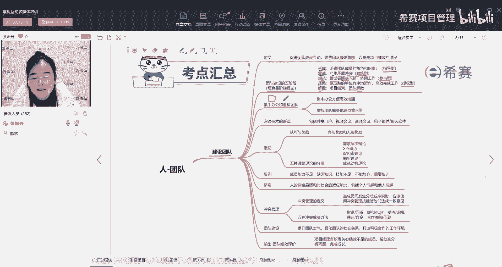

这种就叫集中办公，那虚拟团队呢就是我们在线上是可以看得到。

但是在实际中，实际的个体之间是有一定的距离的。

就是只能够虚拟的去面对面的。

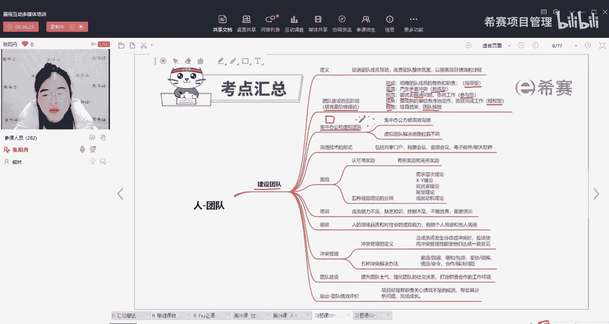

这种就叫虚拟团队好，那大家想一想，首先集中办公它的优点是什么。

对对集中办公，因为大家都在一起面对面。

所以沟通效率就很高，我想要问什么，我直接走到你面前。

跟你面对面的说，你有什么意见，有什么状态，怎么样反馈。

怎么样都可以及时的沟通对，所以这个就是集中办公的优点，沟通效率很高。

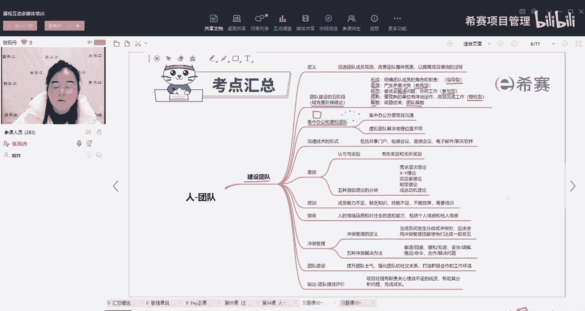

然后项目经理要管理起来是不是也比较方便。

一眼就能看到大家谁在座位上，谁没在，他没在的时间，超过多长时间。

就想哎他是不是摸鱼去了，所以是不是就是项目经理也方便。

更方便管理，集中办公，他的缺点有没有啊。

有同学已经说了，贵，成本高嗯是的。

因为集中办公首先就是什么，你要在一个地方。

就是你要有一个作战室，那就意味着大家都要在一起，你要租厂租这个办公室啊。

要买这些设备啊，各种的硬件呀。

软件都要配备，是的，所以它的成本呢会相对高一些。

还有呢对有区域限制。

因为我们比如说我的公司，像我们公司开在长沙。

那是不是我就只能招长沙区域内的资源，如果有一个资源。

他在深圳，他在广州，是不是我们就没有办法去把他要过来，因为他可能会说他家在深圳。

家在广州，不愿意有来长沙，嗯是的，所以呢就会有这些不确。

就是不太好的，会限制我们的一些情况好。

那相对应的虚拟团队集中办公解决不了的问题。

虚拟团队是不是就可以解决，可以搬家，那很好呀，那你其实就是也是为了更好的去集中办公对吧。

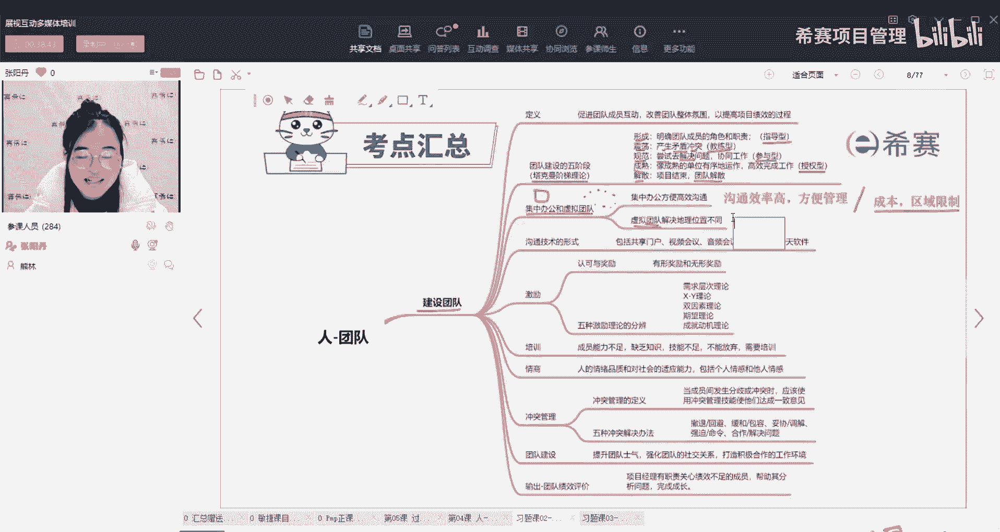

好虚拟团队他的优点是什么。

其实跟集中办公就是刚好是相对的对吧。

集中办公会受到地理的限制嗯，但是虚拟团队呢就不会。

就不需要受地理位置的约束。

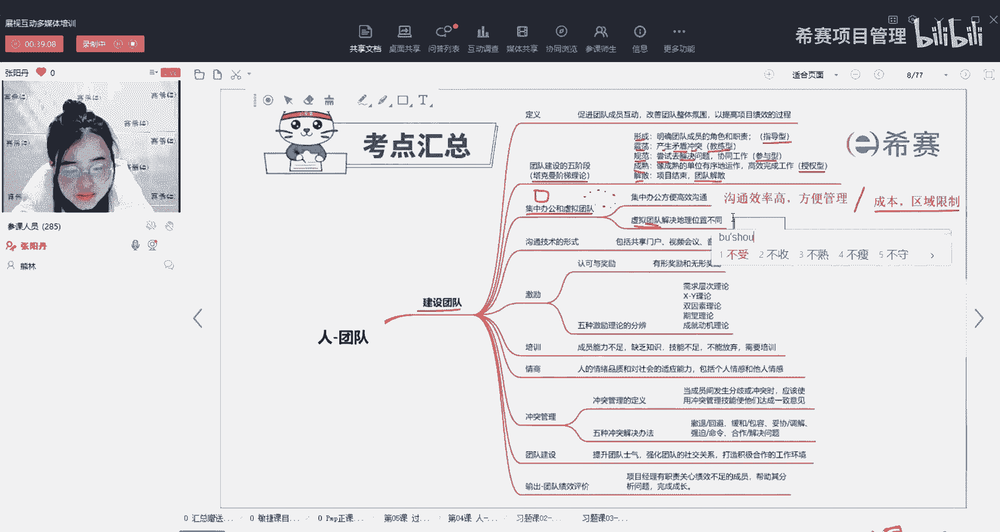

嗯还可以节约成本，是的大家都不在一起，只在线上，自己给自己装一台电脑就行了。

公司又不用租金，水电这些都不用考虑，所以成本低。

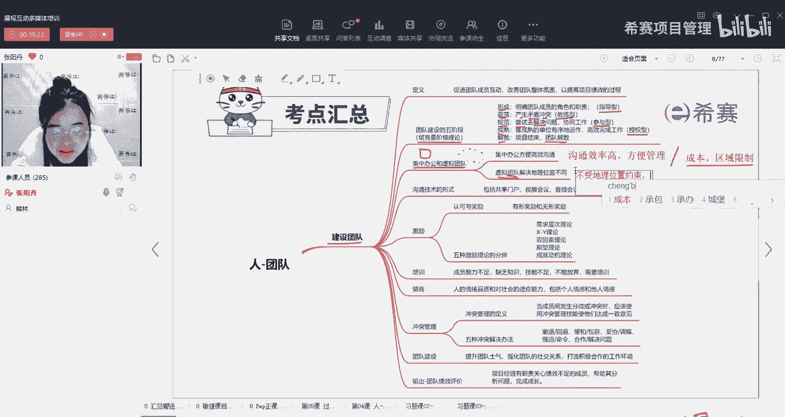

然后呢还有吗。

虚拟团队的优点还有没有。

我们什么情况下会考虑虚拟团队。

对有个同学说到点子上，人才多，我们不用考虑说我的人才在国外。

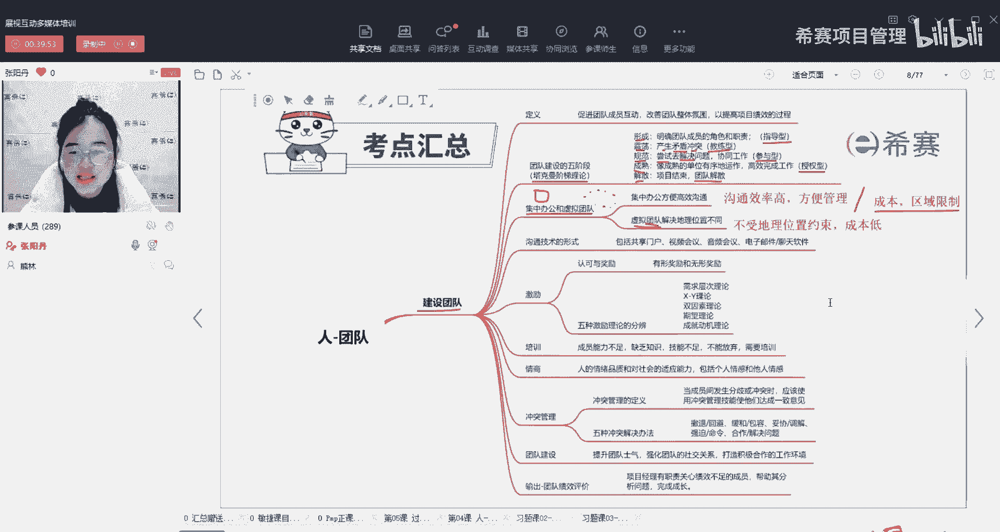

我得不到，你想要人才，想要哪儿的人才。

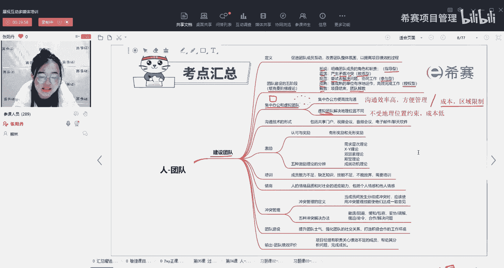

你一个虚拟一个视频电话就call过去了，他就可以快速的加入，所以资源资源丰富。

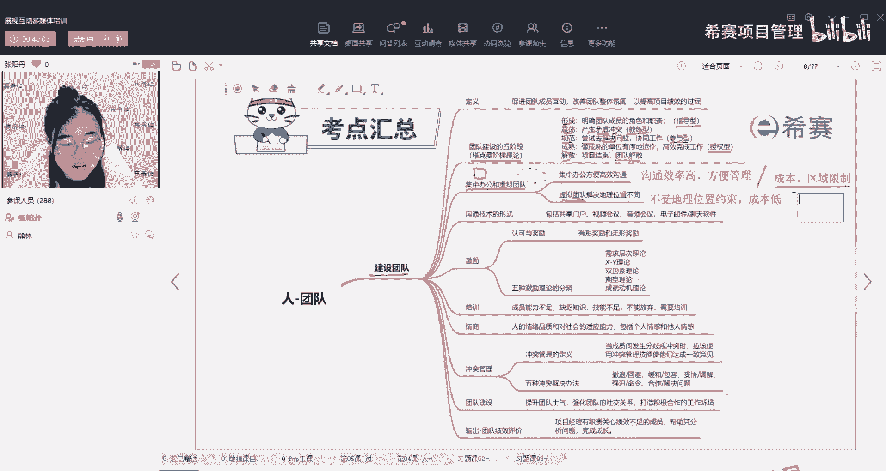

可选择的条件比较多，嗯那相对应的刚刚我们说了他的缺点。

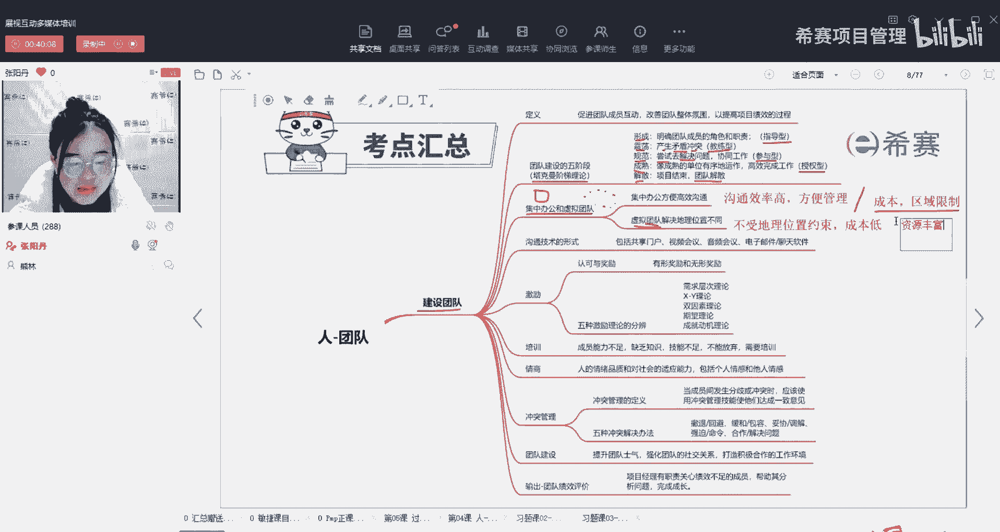

其实有同学已经说了，就是什么嗯。

没有归属感呀，沟通效率低呀，不好管理，这个就是他的缺点。

沟通效率确实会差，因为你发一个信息，你不确定他什么时候能看到。

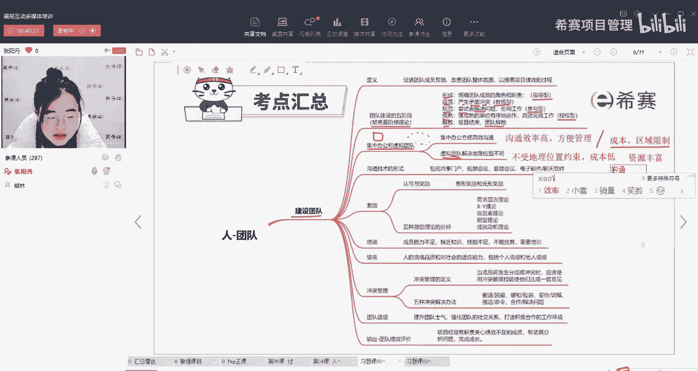

也不确定他有没有看，看到了，只是不想回你。

还有就是管理，就他摸鱼，你也不知道啊。

所以这个就是它们两者之间的，有一些优点和一些缺点，那我们在做题的时候呢。

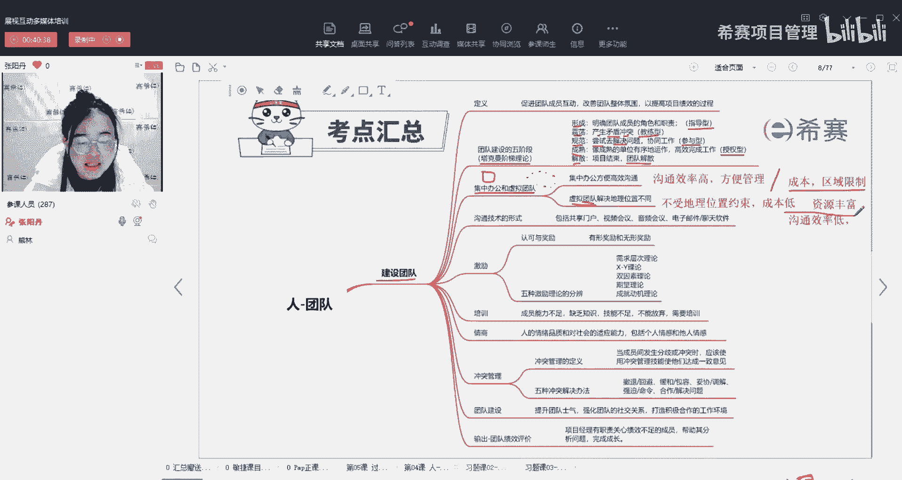

如果看到了他说他没有成本的限制。

那我们就优先考虑集中办公，如果他说他成本不够，我们就可以优先考虑虚拟团队嗯。

对。

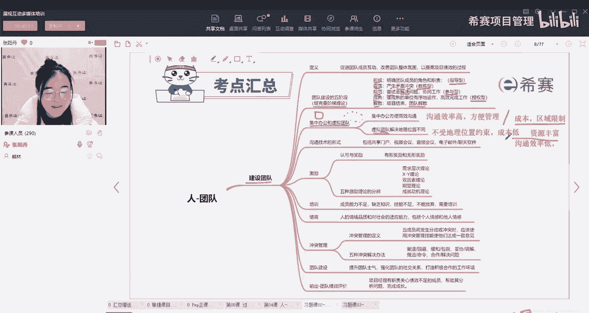

所以这个也是大家如果自己要去创建一个团队，就要考虑到这些团团队这种形式的优点和缺点。

来进行相应的管理，老师没在家。

老师在公司，你看我后面大大的西塞local，我在公司呢。

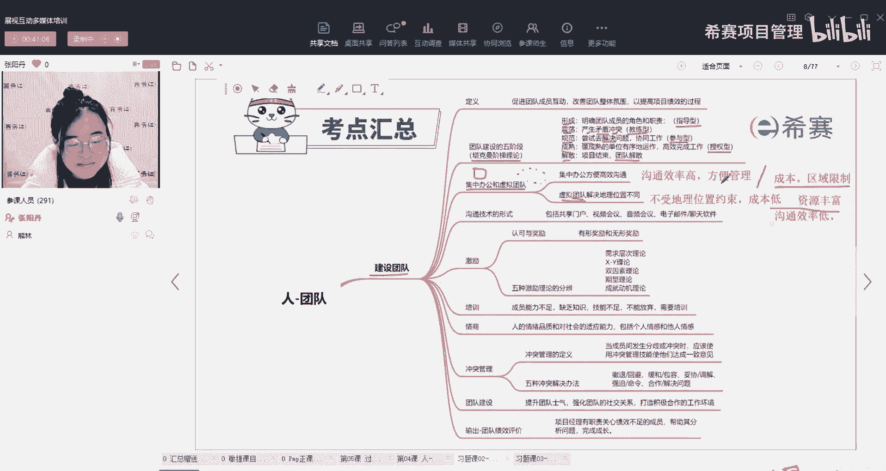

好这个就是我们的两种。

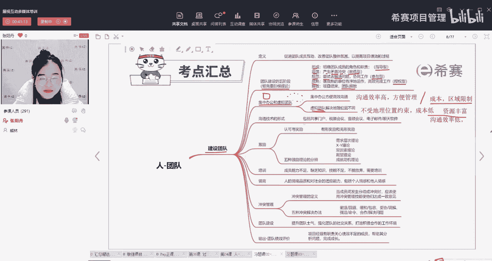

那所以这两种情况下，有哪一种是我们需要去加强管理，加强监控。

有哪一种情况。

我们需要加强对他的管理和监控呢。

对就是虚拟团队需要加强对他的监控，才能确保他更高效的工作。

