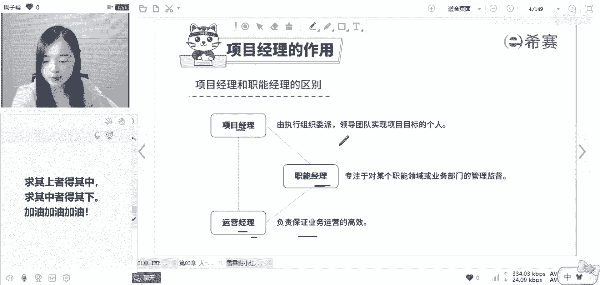
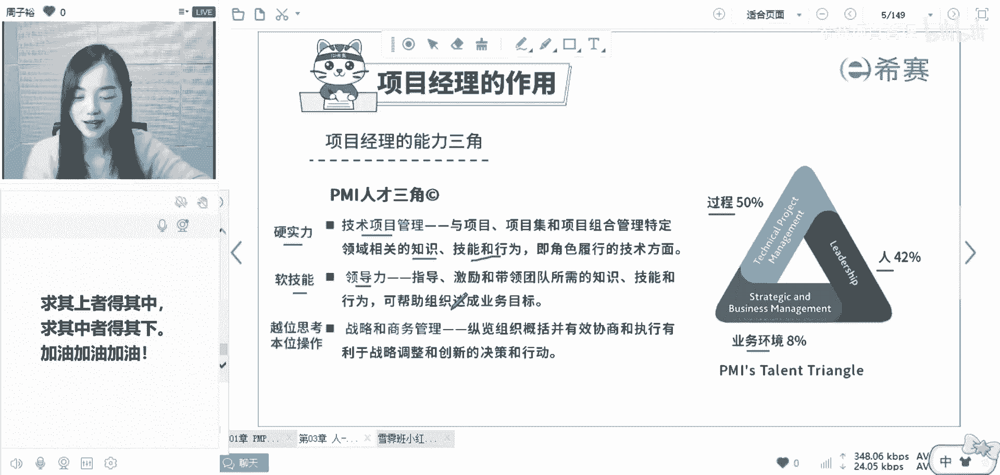
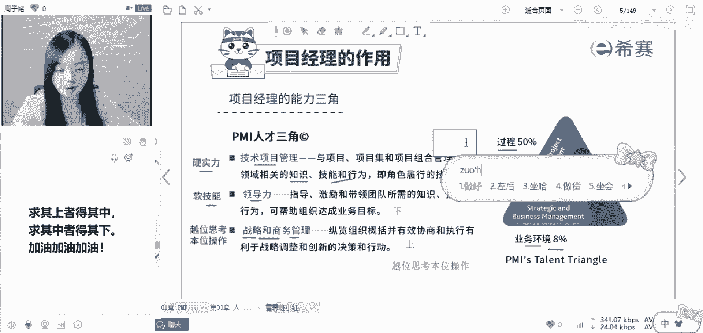

# 备考推荐！2024年PMP项目管理考试第七版考点解析直播课视频合集（试听精华版）！ - P9：项目经理的作用（周子裕） - 希赛项目管理 - BV1V1421i7dQ

项目经理要求的能力还是比较多的，而他至少需要具备的三个能力，比如说看右边这个三角形人过程业务环境，这三个能力是每一个项目经理都需要具备的，你看他熟悉不人过程环境，我在哪还提到过这三个词啊。

有多少同学记得，人过程环境熟悉，不是不是我在第一节课开学典礼给大家讲的，咱们要当3A大神，哪3A啊，就是在人这个模块，环境这个模块过程，这个模块，你都要做到至少80%以上的题目，你就是3A大神。

所以整个你想要做一个优秀的项目经理诶，人过程环境三个模块的能力缺一不可，而我们具体怎么去理解这三块呢，首先第一个技术型的项目管理，其实对应的就是过程硬实力，技术项目管理。

其实说的就是你一定要懂一些项目管理的技术，比如说PMP这一套的方法论，所以说啊你作为一个没有管理知识的小白，你的技能再强，也没有办法把这些人整合协调在一起，哎，让他们共同为这项目而奋进，对不对。

所以说啊硬实力是一定要有的，它指的就是与项目，项目及项目管理特定领域的相关知识哎，范围怎么管进度，怎么管，成本怎么管，还有一套基本的方法论，所以技术方面就是技术项目管理的能力，而领导力又是什么呢。

领导力他说的是对人的能力，俗称软技能，有一句这样的话，大家有没有听到过，叫做兵怂怂一个将怂怂一窝，呵呵兵怂怂一个将怂怂一窝，所以领导力软技能之一，和人打交道，项目不是你一个人做，是有一群人跟你一起做。

所以兵怂怂一个将怂怂一窝，说的是项目中啊，如果一个团队成员怂，那他一个人的事哎，但是如果领导怂，就会影响到整个团队的作风和士气，项目经理是一个以身作则的带头作用，就好像是我们班如果把我作为项目经理。

我怂大家就一起怂，我有领导力，我就会带领大家打败罗老师的班，打败佩奇老师的班，对不对，所以作为项目经理。

一定要有领导力，才能把团队带好，让大家呢形成一个更好的整体来工作。

所以这方面其实除了领导力，还包括情商啊，沟通能力啊，冲突管理能力等等等等，这是第二个和人相关的软实力，你得有好最后一个战略和商务管理的能力，它其实对标的就是环境，要学会越位思考本位操作。

这个能力很重要啊，大家可以写在旁边，越位思考本位操作啥意思呢，战略他其实就是要从公司的层面去思考，如果你的眼光永远只是在你自己的项目上，那你真的就是只能管理好自己的一亩三分地了，但你如果格局放大一点诶。

想要把事情做得更好，又不是领导要求的，你不妨站在领导的角度想一想，他为什么要这么做，所以管理学当中有一个非常经典的故事，叫做买土豆，啥意思呢，比如说我今天呢找到我的一个下属，有张三啊，我说张三。

你帮我看一下土豆的价格啊，他去了回来告诉我说，木木老师土豆三块钱一斤没了，然后呢，我同时把这件事情吩咐给了我的另一位下属，李四，我跟他说，你帮我去看一下土豆的价格，他回来这么跟我说。

他说莫莫老师是这样子的啊，这个土豆呢有两种，一种是本地的，一种是进口的，本地土豆适合做啥，进口土豆适合做啥，你买多少斤可以包邮配送上门，如果你买多少，还会给你一些配菜，给你送一些菜谱做法。

他把一些我想得到的，想不到的都被我安排的清清楚楚，你觉得张三李四这两个人做的事，哪一个会让我觉得更舒服呢，嗯肯定是李四啊，对不对，所以张三李四两个人站在不同的层面，张三呢他就是站在自己的层面里面。

哎买回来了，完了李四呢是站在我的角度，他会去想，我会拿来干什么，拿来炒土豆丝，还是拿来炸薯条，我需不需要优惠啊，所以领导给你安排任务的时候，哎领导问你要计划，你不妨站在领导的角度去思考一下。

这个计划他为什么要用啊，诶除了给他进度计划，我需不需要给他一些别的方案，让我的领导可以选择，所以经常我们说啊，针对于领导，你要学会让他做选择题和判断题，你不要让他做问答题，所以这实际上是一种战略的能力。

OK所以除了战略能力呢，也会要求有一些商务的能力，啥意思呢，他也跟战略很像，就是我们前面说的，我们做项目，你不要光想着通过你的硬实力把这个项目做成，赚不赚钱，跟我没什么关系啊，我做就好了呀。

你也可以眼光放大一点，看看怎么样能够帮助公司创造更多的价值，这样子呢，PMP大家知道还有一个另外的俗称PMP，除了是项目管理专业人员的认证，拍马屁，这个大家也要去学会它啊。

所以呢项目经理需要具备的三个三个角色啊，不是三个能力对上，你要能知道越位思考，本位操作就是战略和商务管理的能力，对上一样能做到位，对下呢你要有领导力诶，要用你的这些魅力，你的影响力。

情商来带好你的团队成员，而硬实力呢就是做好自己啦。

你不能是一个小白呀，所以我们给大家交付的就是一项技术，技术，没有善恶，这三个过程呢，现在啊不是这三个模块，现在我们考试当中考的不多，但是你一定要能理解。

