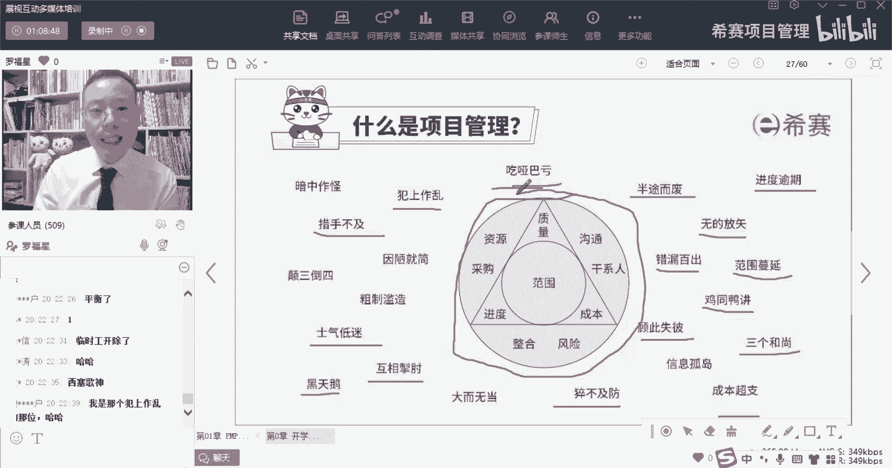
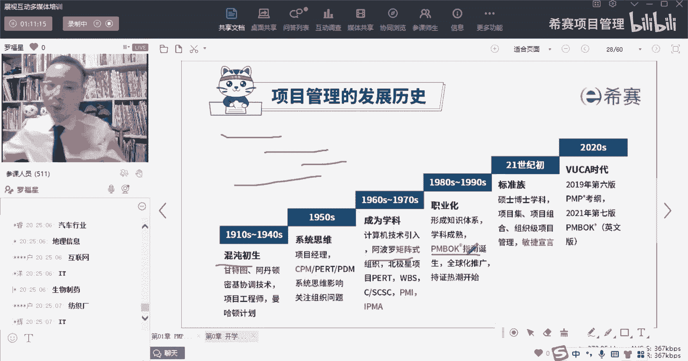
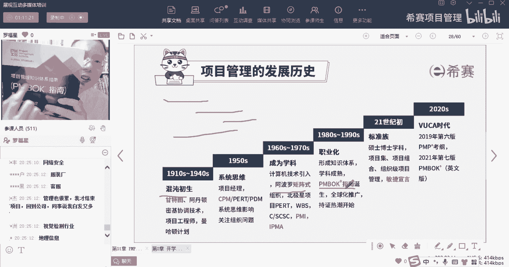
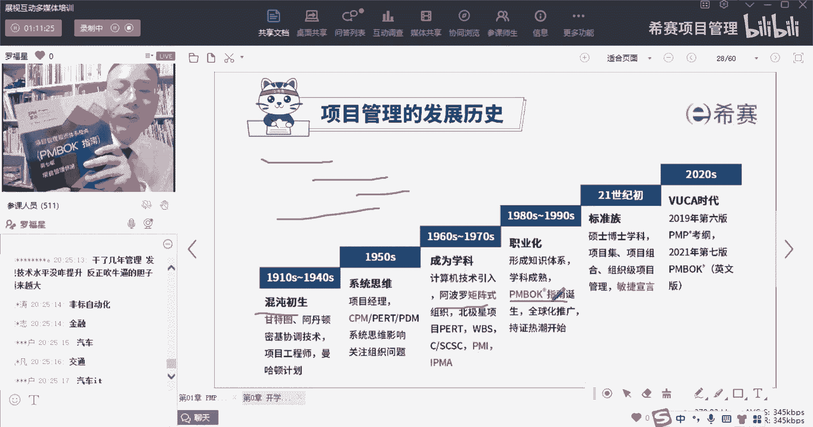
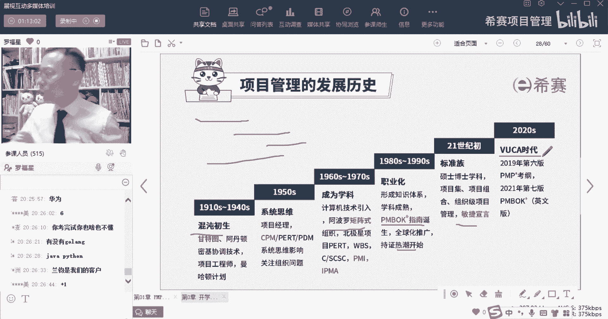
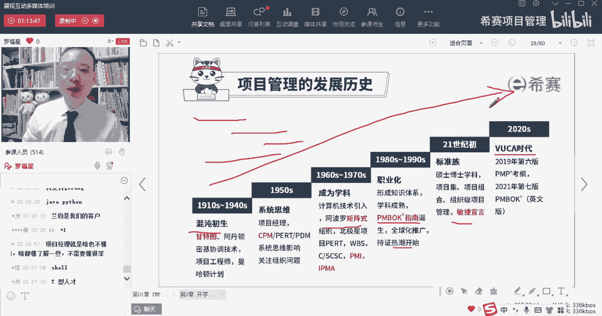
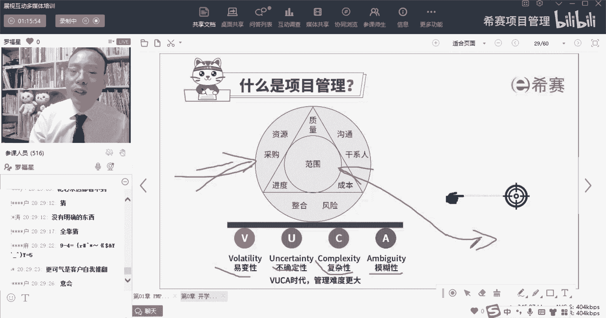
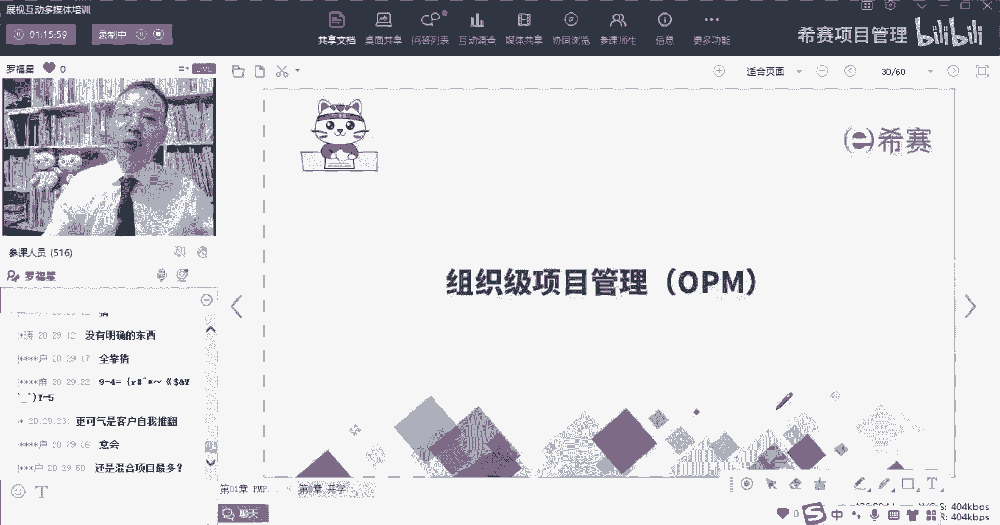

# 备考推荐！2024年PMP项目管理考试第七版考点解析直播课视频合集（试听精华版）！ - P10：项目困境与项目管理发展史（罗福星） - 希赛项目管理 - BV1V1421i7dQ

我开始有问过，我说没有学过项目管理，能不能做好项目，你其实发现是可以的，但是咱们在做项目的过程中，有没有遇到过这种情况，兄弟们，比方说进度有逾期啊，做项目的话不知道做些什么鬼，无的放矢，不知道做什么鬼。

做的半途而废呀，漏洞百出啊，范围蔓延呐，跟别人沟通起来真的是很费劲，鸡同鸭讲，有没有遇到过两个三个顾此失彼，猝不及防，总是突然之间，突然之间突然之间，然后相互掣肘，然后各种黑天鹅事件。

团队也没有什么士气啊，然后有经常有些通，有些东西搞得措手不及，还有就是那团队成员也不听话，还犯上作乱，总是让你背锅，让你背锅，让你背锅，还有就是有些事情没人管，没人做，三个和尚没水喝，成本还超支。

你会发现就是有各种各样的情况产生，对不对，所以几乎你所以那个那个叫什么，什么迈克尔杰克逊，有一有一句歌词是这样唱的，叫什么叫you are not alone，所以你不是一个人啊，大家都一样。

都差不多都差不多，有没有心理平衡一点，兄弟们，姐妹们有没有心理平衡一点好，正是因为大家都差不多，因为都一样，所以呢我们才要去学这套标准的项目管理体系，我们去学这套标准的项目管理体系。

他至少在一定程度上是能够去，解决一部分的问题，他能够在一定程度上能够让你知道，到了什么节点，该做什么事情，该安排谁来做什么事情，唉这是它一个最大的价值所在啊。

所以我们在做项目的过程中诶，你其实会发现一个很重要的一个点，就是说我们会不断的去通过这样一些，标准化的方式来去解决一些棘手的问题，把那些棘手的问题给给给处理掉，如果没有这一套标准。

很多东西它其实就是708乱的，就是乱七八糟的，所以我们来稍微认识一下，项目管理的那个发展史啊，这项目管理呢他最最开始其实是凭感觉，就每个人都去凭感觉，那后来在战争中有了一个叫甘特图的东西。

甘特图有没有同学画过啊，画过敲一个一，那你会发现你甘特图这个东西，就是我们在做事情的时候啊，他就说啊这件事情啊从什么时候到什么时候，第二件事情从什么时候到什么时候，第三件事情对吧，第五件事情啊这类的诶。

你画了甘特图以后，是不是能够去把这些东西就一目了然，就排的清清楚楚，明明白白，唉，所以就慢慢的就是在上个世纪的十一十年代，到40年代的时候，就有了这对有了这进度条的东西，能够把这东西给做一些安排。

然后再往后面走呢，然会有这样一些个系统项目管理的思维，能够去系统考虑一些事情，什么叫系统考虑呢，就是我们在做事情的时候呀，不再是头痛医头，脚痛医脚，你会去综合考量，你会综合考虑一些事情，然后再往后面走。

到了后面就是美国有一个叫阿波罗登月计划，那么这个阿波罗登月计划，它其实会讲的是说呃，动用了很多很多的这些个高校呀，科研院所呀去研究啊，能够把人类送上月球，而事实上这个项目最后是成功的，他好像是动用了。

就是有有200多个机构来做这种项目，那这里面就会涉及到大量的，把东西要去把它拆开呀，分解呀，同步呀，异步呀，要做很多很多事情，那么在这个时候，慢慢就已经有了这样一个项目管理思想，所以项目管理思想。

最开始是从这样一种军事这个方面来啊，再往后面走就到民用中，到了上个世纪80年代的时候，就开始有这个项目管理知识体系指南，那这个知识体系指南一出来以后，他就是把项目管理各行各业的项目管理，你们同学们。

同学们是在哪个行业把行业敲一下，您在生物制药行业，在电汽车行业，在it行业呃，在什么什么行业，你会发现各行各业它都有项目管理，那自从这个ping BO指南，项目管理知识体系指南，也就是这本书的第一版啊。

自从这个ping BO指南，OK就这个这个叫项目管理知识体系指南。

自从这个项目管理知识体系指南出现以后哇。

各行各业的项目管理的工作者，他就发现哇有了救星了，终于是有依靠，有参考标准，所以你会发现这个事情就变得更加容易一点，OK拼搏指南它还推出以后，就是一下就被全球热捧，当然了，其实不仅仅只是它啊。

包括欧洲的那套标准也非常好，欧洲那套prince two的标准也是非常好，那么现在最近呢，我们中国也在推一个推一个中国人自己的标准，对像汽车行业工业的标准呢，还有ISO的各种标准啊之类的，就很多。

这些把一些东西能够去做一个，标准化的方式来去做好，那么这种标准化的方式来去做项目，你会发现做的过程中啊，他也会遇到一些挑战，遇到什么挑战呢，就是越来越多的这种软件项目，它总是变化特别频繁。

当某一些软件类型的项目，互联网类型的项目它的变化特别频繁的时候，所以又有了新的方式，新的方式用敏捷的方式来去做，那敏捷的方式呢就是拥抱变化，那他就是用一种拥抱变化的，这种方式来去做事情。

OK好再往后面说，到了这个新的时代，到了一个叫乌卡的时代，乌卡是什么，就有很多的不确定性，有异变性，有模糊性，有复杂性对不对，那有了很多这些个各种乌卡以后呢，我们就有更新的方式，就有了这个第七版。

第七版就给了一个很重要的信息，叫什么呢，变成什么样都无所谓，来去辅助你来推进事情，推进项目，所以项目管理发展史。

你会发现，其实也是从以前是有点混乱到越来越清晰，当然了，这些内容呢它其实都只是西方科学啊，而我们的老祖宗在修万里长城的时候，你应该听说过，我们的老祖宗在修万里长城的时候，就已经安排了井然有序，对不对。

谁负责这个爻，这个爻的专啊，搬到哪个地方，哪个窑的砖搬到哪个地方，然后垒一批砖，哪个砖出了问题，你就可以回溯，可以去找到谁，所以其实项目管理这套标准，在没有这个西方的科学之前，我们中文其实是有的啊。

只是说西方人，他就把这个东西做成一个标准的东西，来去普及开来，而不像中国，我们古代的方式都是那种师傅带徒弟的方式，现在就是一个人可以去传播，OK写成文章去传播，做成课程去传播是这个意思。

所以项目管理本身并不是只有西方才有，其实公中国早就已经有了好，那么对于乌卡呢就是易变性，就是有太多的变化，变来变去，尤其是面对这种互联网的产品对吧，还有一个呢是很多的不确定性，还有就是很复杂复杂。

这个点很有意思啊，复杂这个点里面有一个词叫什么叫人性很复杂，人类很复杂，人类的迷惑行为，你们在做项目的时候，有没有发现有一些同事也好，或者有一些领导也好，做了一些迷惑行为，有没有来敲一两个。

让大家让大家觉得你不是一个人，感觉大家都差不多有吗，真的是有很多人，真的是有很多各种迷惑性的行为，他也会把这个事情搞得更加复杂，OK啊还有还有模糊性，那么整个这个乌卡它就会导致一个什么结果呢。

就本身项目管理，他其实就是我们相当于说这里有个靶心，那么在这里有个靶心的情况下，你想要去打中那个靶，PIU可以打中对吧，那到了五卡以后，这个靶子在移动，你要把一个移动的靶是不是难度变得更大，对不对。

你要打这个移动的板，你这个难度就变得更大，所以整个乌卡这个时代中，你想你如果能够打中那个移动靶，你的前提条件是什么，前提条件是他不移动的时候，你能够懂，当你能够他不动的时候，你可以懂，等到它再动起来。

你还有一套方式，慢慢的去慢慢的去习惯它的动，对不对，所以是这样一个情形，所以我们现在在学的这一套呢，会分到两块来进行，前面一半的课程是讲的预测型项目管理，OK讲的预测型的项目管理。

也就是这个靶子是固定的，而后面一半呢讲的是敏捷项目管理，那敏捷项目管理就是靶子在移动，板子在移动的，你先学好了这些固定的这些预测型项目管理，以后，你再去学那个移动的那个敏捷项目管理。

然后你再综合考虑他可能到底是动还是不动，我也不知道，我要去亲自判断，你再去用到你的工作中，你可能会发现哦，原来是有这么一回事，你就有一些应对的措施和方式了，你就能够去使用到一些些的工具和技术了。

是这样一回事啊，所以项目管理其实难度是会越来越大。

因为它在动，所以难度就很大。

