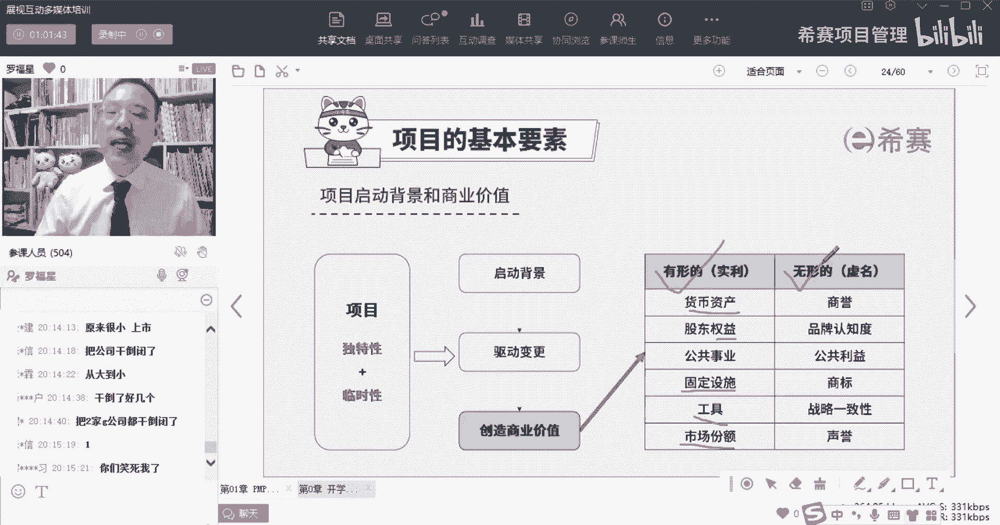
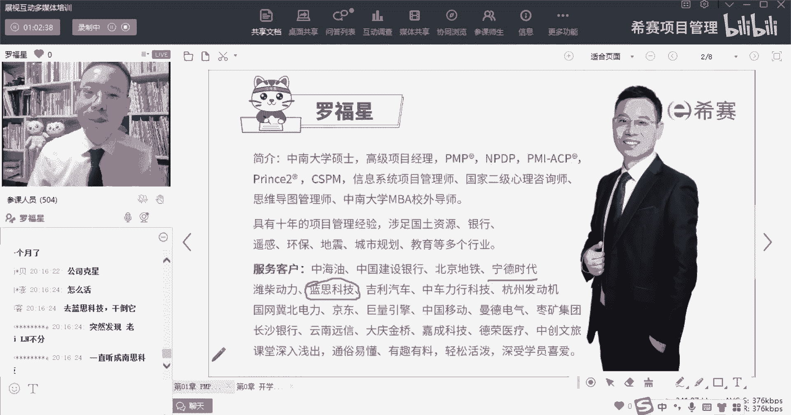
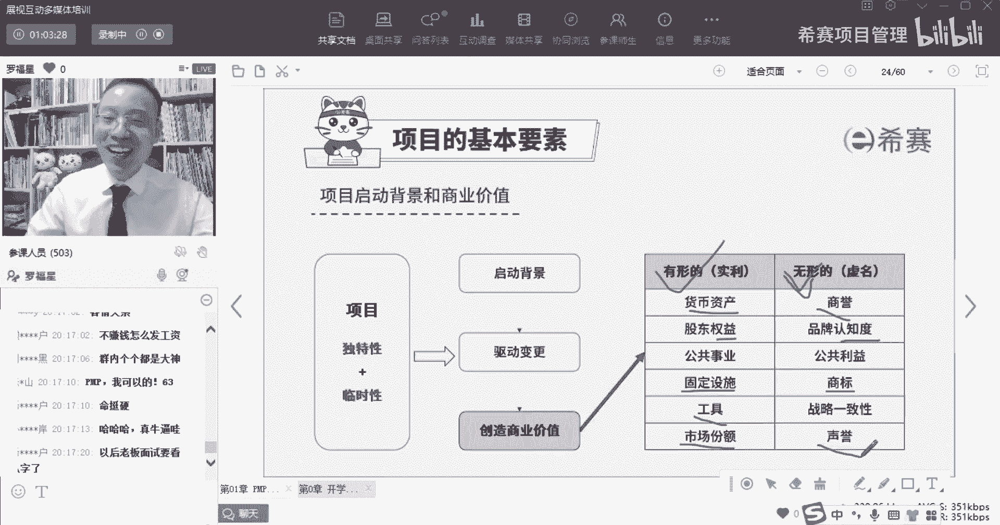
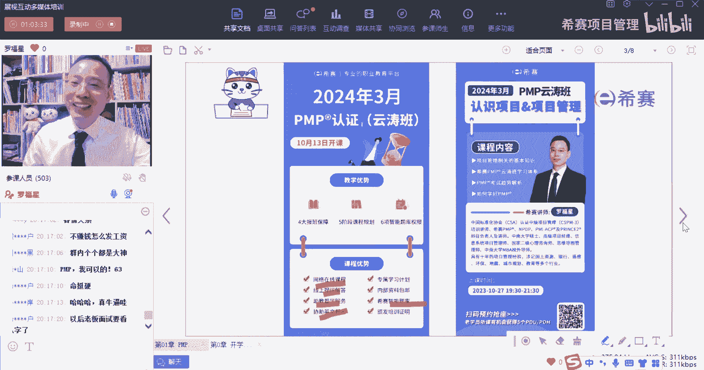
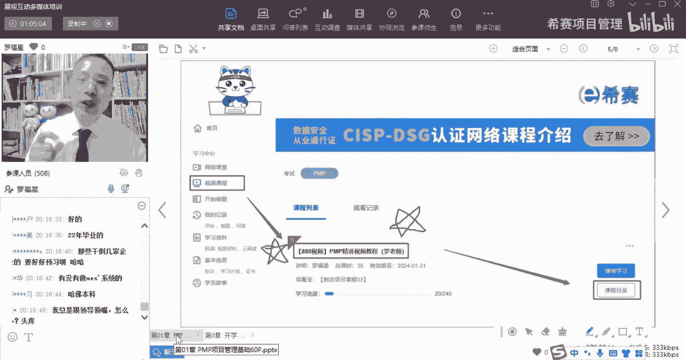
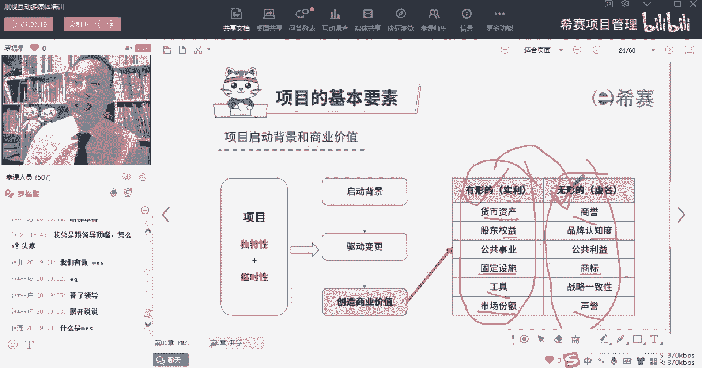
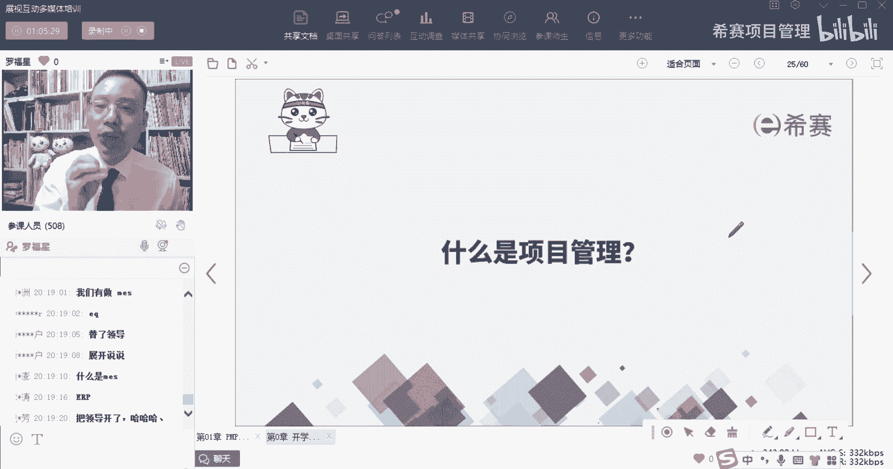
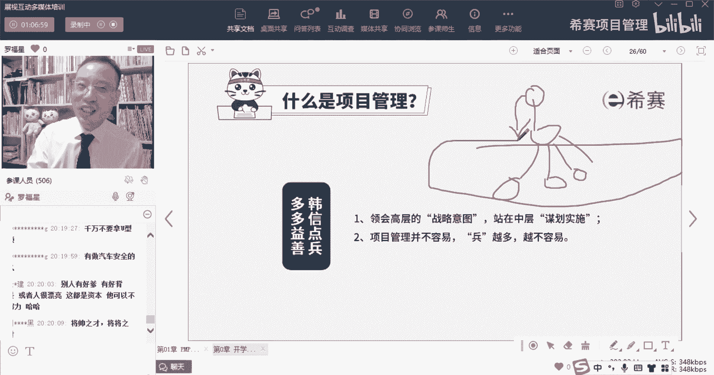

# 备考推荐！2024年PMP项目管理考试第七版考点解析直播课视频合集（试听精华版）！ - P11：项目启动背景和商业价值（罗福星） - 希赛项目管理 - BV1V1421i7dQ

项目是为什么会启动呢，兄弟们，是不是很多时候是因为有甲方爸爸他愿意出钱，所以你们就接了这个订单，是这样的吗，啊对有甲方爸爸有需求，是不是对于客户有需求，所以我们为了去挣客户的钱，所以我们就去做。

有没有同学做过项目，是公司自己开展的项目，就不是没有别的，甲方爸爸就是公司自己来开展的项目也有，对不对，就不一定非得有甲方爸爸自己的公司，来去开展项目，它也是有的对吧，那还有一些情况是什么呢。

还有一些情况是有可能会社会有一些需要，比方说你会发现就是社会的法律法规导致的呃，比方说像前几年雾霾很严重，那么就可能会有整治雾霾的行动，就可能会导致，把某一些工厂迁移到一些外外交的地方呢。

或者迁移到河北呀，迁移到天津啊，等一些不同的地方去对吧，所以你会发现就是有可能会是法律有需要，社会有需要，OK这也是一种方式来去启动一个项目，那也有可能呢是客户有需要，就是满足某些客户的需要。

客户他需要什么东西，他愿意掏钱来做，唉这也是可以的，还有一种可能呢就是老板有需要，老板他可能会定了一个战略目标，他觉得说我们想要在3年之内达到什么，什么什么什么对吧，我们在5年之内可以做到什么什么样子。

所以我们就开展什么项目，那可能公司的发展战略它有需要，我们会去开展一些项目，那还有一种情况呢，就是原有的项目发现已经是有一点点老旧了，有点过时了，我们需要去对他做优化改进做更新。

那如果说我们需要对它做优化改进更新的话呢，就是修复这些产品，有没有同学手上有这种项目，就是一个项目已经做了好多年，也不叫做了好多年吧，就是一个产品用了好多年，一直都在把原来那个产品改来改去，改来改去。

有这种情况吗，有的可以敲个一，就是曾经很多年以前的那个东西，然后现在依然在改来改去，在用改来改去再用，对这也是一种情况，也是一种情况，对这种就是旧项目深造升级改造，它相对来讲就比较简单一点。

它就没那么复杂，他的成功的概率也比较大，所以为什么会开展项目呢，有可能是社会有需要，可能是客户有需要或市场有需要，可能是公司有需要，战略有需要，也可能是项目本身，它需要升级啊，这都是有可能的啊。

这是启动项目，那么项目本身呢，你会发现它有一个很大的价值是什么，就不管说你们公司的愿景是多么，多么宏大的一个愿景，不管说你们的战略目标有多么的大，你会发现它需要靠一个一个的项目来达成。

所以项目是能够去辅助我们达成战略目标的，这样一个具体落实的工具，是辅助我们能够去，最终达到我们的那个那个愿景的这一个方法，所以项目本身它是能够去驱动组织发生变革的，公司现在是这个状况。

你随着你做了A项目，B项目，C项目慢慢把公司就变成这样一个情况，你们有没有同学在一个公司待了很多年，曾经他是一个很小的小公司，现在变成一个很大的公司了，然后你是那个元老那种情况，或者有没有有没有在公司。

曾经曾经待的时候很大，后来裁员裁的很多很厉害，然后人一下子变得少了很多，你会发现不断的可能会改来改去，变来变去，对不对，所以是有可能会从小到大，它也可能会是从大到小，那都是有可能的。

那事实上呢就是如果说他做一个项目也没做成，做第二个项目又没做成，第三个项目又没做成，很多项目都没做成，唉最后那就是公司就可能就关停了，或者变得就已经很小了对吧，所以其实在做项目的时候。

项目本身它是能够去驱动组织变革，他的这个情形，会导致公司的从一个状态到另外一个状态，其实这也是公司的发展的一个要要经历的，OK所以我们如果做好了项目的话，是能够导致这个结果的产生。

并且还有就是其实你会发现，我们在做项目的过程中，诶，项目它能够去产生很多的价值，它因为有价值，所以能够把公司赚大对吧，那么项目创造价值呢，价值又会分到两大块，一块价值叫有形的价值，也叫实力。

就是这个价值真的是可以看得见摸得着的，Ok money money，money是这个意思，所以是包括货币资产，股东的权益，然后一些固定的设施，一些工具，市场份额等，都是能够看得见摸得着的东西。

这是有形的价值，但除了这个有形价值以外呀，还有一些叫无形价值，什么叫无形价值呢，我给你举个例子，比方说我们去给某一些这种大的企业，去讲课的时候，那有些公司它就会砍价，砍得比较多，你知道吗，他们砍价啊。

就就就比方说就像啊像蓝思科技，那我们去给蓝思科技讲课，他就会砍价，那我们接受不接受，其实也会接受，为什么，因为你如果说是去蓝思科技去讲完课以后。

那你会发现诶，我们的那个系，那个客户里面就多了一条叫蓝思科技啊，就是这个原因明白吗，所以虽然可能说本来做这个培训项目，他不怎么赚钱，但是他能够导致有一些额外的这样一个，就是无形价值，无形价值。

包括我去给宁德时代去讲课，我在前年的时候，我就我就在想说，宁德时代什么时候邀请我去讲课，那后来您，那您那些果然真的是在今年4月份的时候哎，就邀请我们去讲课，然后就赶紧屁颠屁颠跑过去讲课，非常兴奋。

那么有一些有些时候你去一些地方，其实并不是说那个东西就能够赚到多少钱，其实也没赚多少钱对吧，但是唉你会发现这个东西它贴在这个地方，你就得哇哇，你还去了一个当红炸子鸡的那个公司去讲课，诶。

就这种感觉就不相同，你明白吗。

所以有的时候我们做某一些事情，其实包括你们在做项目的时候，也会有一些项目是不赚钱的，那些不怎么赚钱的项目，你也得要去，你得要去做，你的目的是什么，你是为了去放长线钓大鱼呀。

是不是你要去得到一些无形的价值呀，是不是，所以我们去做项目的过程中，除了去产生这个有形价值以外，还包括产生这些无形价值，包括商誉啊，信誉啊，知名度啊，商标啊，名声呐，地位呀这些东西他都是。

所以做项目的时候，对于那种客情关系，它都是能够去让你不赚钱，不是每一个项目都不赚钱，不赚钱是某些项目不赚钱，你做某一些不赚钱的项目是为了做二期工程，三期工程，四期工程来去赚钱呢。

这么看来是没有什么经验啊。

没经验的同学对我要提前再说一下，你我也会发现有同学问的问题，确实显得很没有经验。

如果特别没有经验的同学们，一定要认真的看880视频教程，提前预习一下好不好，因为其实我们的每一个学员，他的差别其实也很大啊，有些学员可能没有什么太多的工作经验，甚至连工作经验都没有太多。

有些学员可能是已经工作了20多年，有你们工作几年了，同志们，你工作几年了呀，把那个年数那个数字敲一下，所以你会发现这个工作经验差别很大，那么学历方面也差别很大，有的同学可能是专科，有的同学可能是本科。

有的同学可能是211，有的同学是985，有的同学是硕士，所以你会发现这种不管是学历，工作经验，然后工作城市各个方面都有很大的差别，如果说你碰巧是那个经那个经验比较少的同学，麻烦你拜托你。

请你一定要认真的去提前花一点点时间去看，你就880视频教程好不好，你提前看过以后，你再来去上课，你会有更多的收获，你要是没有看过，你这也不懂，那也不懂的话，你收获其实就没那么大，明白我的意思吗。

还有一点就是你千万不要去跟别人比较说啊，他也没学习，他都能够通过，那我也没学习，我肯定也可以通过，不是这样的，因为别人不学习，他底子很好呀，像有一些同学在外企，在外资企业。

他本身管理的方式就跟这个偏僻非常相近，明白他跟偏僻这一套体系很相近的，所以你不要去跟别人比，说别人也没学习，你只要跟自己比，如果说你发现这些东西你都听不懂，那一定是说明那种基础不够，需要加油啊。

这里我就解释了一下啊，好，那么这里就刚刚认识了一下，关于有形价值和无形价值，你要知道我们在做事情的时候呢，哎希望既能够产生有形价值，也可能会有一些无形价值，而我们会是希望他们两个相结合的东西。

是产生最大OK达到一个最大的一个状态，而项目本身我们已经认识了什么叫项目对吧，创造一个独特的产品服务或者成果。

而进行临时性的工作，那什么是项目管理呢，其实项目管理它就是能够把事情给做成，我们刚刚说过，其实就是能够把事情给做成的这一套方式方法，就算不管你用任何样的方式，那你知道你可能听说过有一个词叫什么。

叫韩信点兵多多益善对吧，那么韩信点兵点点名斗罗E3，这个案例中也很有意思，就是当时刘邦他就问韩信，他说哎呀，他说你看我可以带多少兵呢，然后韩信就拍老板的马屁，说老板你可以带10万兵哇，牛班就我这么牛逼。

然后他就问韩信说，那你可以带多少兵呢，韩信说韩信点兵多多益善，那你想一想，你比老板还牛，你是不是要翻天了呀，诶老板又说了一句，他说老板你是将帅之才，我是将兵之才，什么意思呢。

有差别就是大老板去管管领导们，大老板去管这些领导们，这属于将帅之才，是属于制制定战略，制定规则，而领导们去管团队，管项目哎，这属于将兵之才，是去管上，那我们的项目管理呢就是管项目，管事情为主。

是在这个层面，但是事实上，你要真的是能够去做到上面这个层面，你前提一定是底下的也会，你要是底下这套都不会，你去管下面零其实也很难，所以我们应应该说都会一些，但是呢目前我们这个课程主要讲的是。

底下这一板块，就是去管团队呀，管工作内容呢的这样一种方式，他也不容易啊，他也有很多事情。

他有很多种工具呀，方法呀，技术呀。