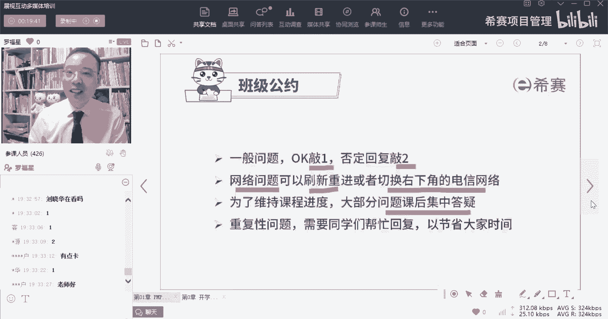
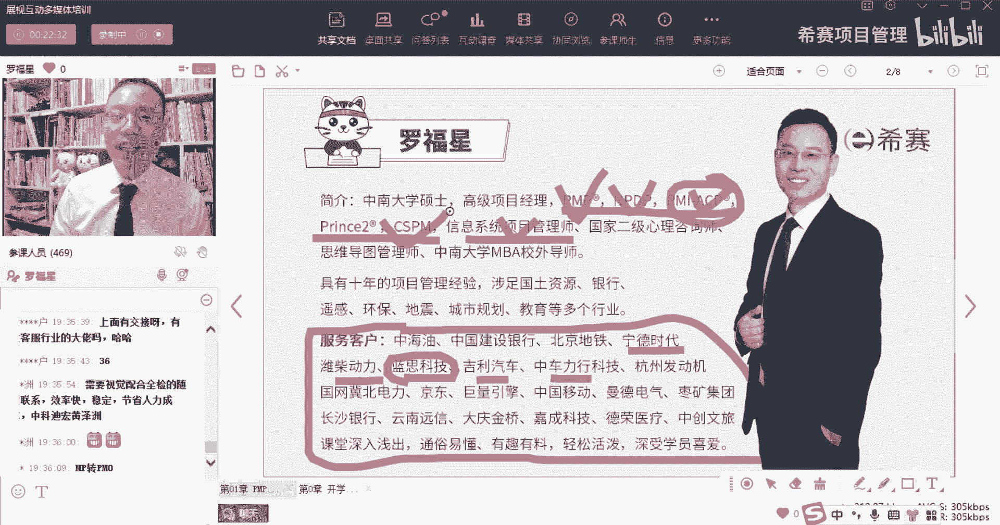
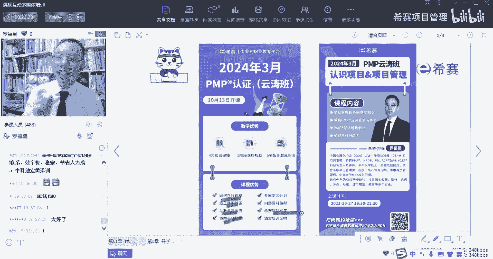
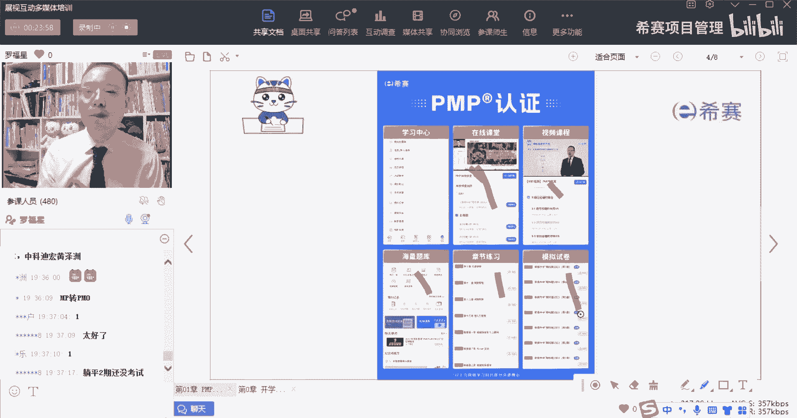
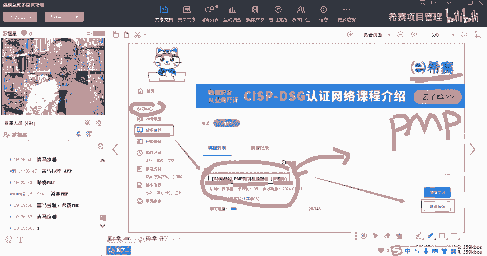
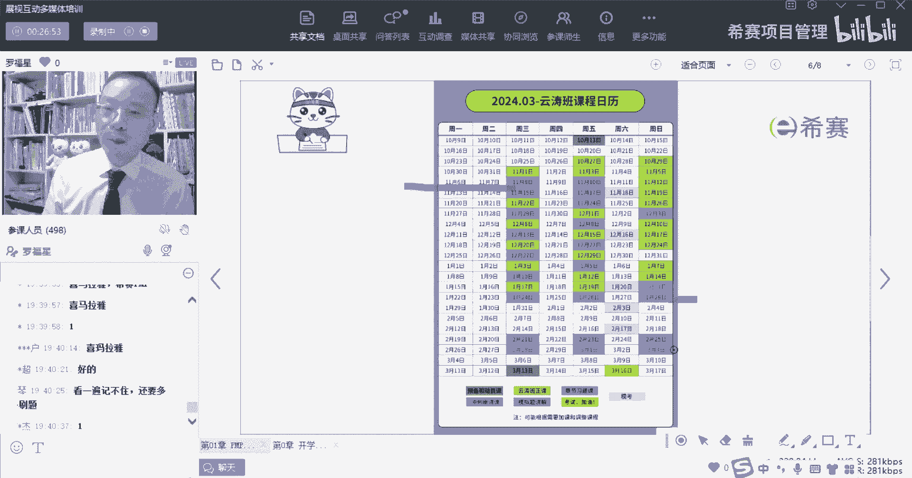

# 备考推荐！2024年PMP项目管理考试第七版考点解析直播课视频合集（试听精华版）！ - P1：PMP导学课（罗福星） - 希赛项目管理 - BV1V1421i7dQ

大家晚上好，欢迎来到西夏晚专业的职业教育平台，我是罗福星，那今天我们一起来分享的是项目管理课程，PMP的课程，对我看到有同学说又见面了，我们是在NPDP学过课程对吧，过来听pp的课程。

那我们今天课程刚刚开始之前，因为今天是我给大家上的第一节课啊，也是第一节正课，所以我会给大家去先同步几个重要信息，我们会有一个基本的班级公约啊，第一条呢就是我们在讲课的时候，可能我会问一些问题。

我在问问题的时候，如果问的是那种yes or NO的问题呃，如果你说的是OK，那你就是敲个一就表示是OK，这样比较简单，那如果说是你觉得是不OK，你就敲一个R，你就说不OK，这一条你听明白了吗。

听明白你就可以敲个一，OK包括我说诶有声音吗，你说有声音，你也可以敲个一，如果说没有声音，你就敲一个啊，用这种方式来去表示这是可以的，OK好，这是第一条啊，第二条呢就是我们可能在听课的过程中。

会有一些网络问题，那网络问题如果说是所有人都很卡，就表示应该是我这边网络有问题，如果说是大部分同学都不卡呃，一部分同学卡，那可能就是你那边网络有问题，那怎么办呢，首先就是我们在这个平台底下。

会有一个切换网络的地方，你可以在那个右下角的地方，可以去切换成中国电信的网络，你可以把它切换成中国电信的网络来学习，这样可能会比较好一点啊，这是一个第二个呢是也可以去刷新，刷新了以后再重新进来诶。

这样也是可以的，OK好这是第二个公约好，第三个呢就是我们在讲课的过程中，大家一定会有很多的问题的产生，对于有一些问题，如果说刚好是跟正在讲的这个主题直接相关的，那我就会停下来给大家去做回复。

那如果说就某些同学提的问题，跟当下正在讲的东西是不相关，那么可能我会暂时就不会回答你的问题，你可以把这个问题留下来，等到课程快要结束的时候，你把它或在提在了一个提问里面，我会在那个提问中再集中的回答好。

再有第四个就是说通常情况下，可能有很多人会问重复性的问题，比方说他会问说啊，今天有送PDU吗啊，或者说是大家卡不卡呀之类的，那先是讲到第几课呀这种问题，而像这种比较简单的或者一些重复性的问题呢。

我可能会需要大家帮我来回答一下，这样的话可能够节省大家的时间，因为我来回答的话就是耽误所有人的时间，如果是有人有同学帮忙回答，唉就可以去节省所有人的时间，是这样一个意思啊。

OK那么所以我们的这个班级公约，就先简单跟大家分享这样的四条，那接下来呢还是要简单介绍一下我自己呃。

人称罗帅罗叔，罗师傅，对我是罗叔啊啊我自己呢是中南大学毕业，我以前就是在研究生刚毕业的时候，就去北京工作了，有78年的时间，在祭祀行业就上一个单位是高德，就高德地图，高德导航啊，然后再回到湖南长沙呢。

就是做了专职的培训讲师，我做培训讲师以后，给很多企业做过培训，这里面有没有有没有你们的企业或你们的客户，就像中海油啊，中国建设银行的某分行呐，然后是宁德时代呀，潍柴动力呀，蓝思科技啊。

我明天会去蓝思科技讲课，还有吉利汽车呀啊中车啊等等，这些企业有没有你的客户或者是你们公司啊，对吧嗯，我自己呢因为以前在北京工作的时候，每一天上下班通勤时间大概是一个半小时左右。

所以我后来做了培训讲师以后，我会尽量用那种比较通俗易懂的方式，来讲这些知识，所以我会希望是你们可以能够听懂，然后因为每一个同学，你们可能是来自于各行各业，所以我们在举例子的时候呢。

嗯如果说举任何一个行业的例子，你可能发现都有人听不懂，因为都有人他不是从事这个行业，所以可能会更多的是用这种生活化的场景，来去表达这些信息，然后我自己呢在西塞，目前我是主要负责这样的几个科目。

就是标红的这几个一个是PMP的科目，一个是NPDP，一个是ACP，还有一个呢是prince two和cs p m，那这五个科目是我来管理的，我们团队目前是有22个老师，就是老师和助教老师有22个。

这几个科目中，如果说大家有什么问题，基本上你正常情况下，你找到我，我都会安排人来帮你做解答好不好，那我主要讲的课程呢目前是两个，一个是偏僻的课程，一个是NPDP的课程，NPDP呢是产品经理。

就像刚刚有同学说，自己是之前从NPDP产品经理这边过来的，对吧，那我之前呢还教过ACP的课程，以前还教过信息系统项目管理师，就是高校的这样一门课程啊，但是现在没有再教了啊。

现在就是基本上就不再去讲这个课程呃，平台上面会有我的这个视频教程，同时我在今年大概是11月开始，也就是下个月开始会教一门新的课程，叫CSPM，这是一个开局，刚刚开局呃，会尝试开始。

我自己对于心理学教育学会比较有兴趣，我也是有两个小孩呃，都在读小学，所以啊学了很多心理学的知识，也学了很多家庭教育的知识，以后你们如果说在育儿方面，遇到一些挑战和困难，也不妨可以来问我。

我基本上正常情况下，可以给到你一些有价值的建议和意见啊。

我是专业的好，这是关于我的建一个介绍呃，我们整个课程呢其实会有这些网络的直播，课程呢有线上的答疑，你可以在班级群里面问问题，你也可以是在平台上面来问问题，然后呢我们有助教督学服务，那么督学呢。

通常情况下是那些学习比较落后的分子啊，就是可能两个礼拜下来都没怎么学习的人，可能助教就会来联系你，如果你学的比较好呢，他就不会来骚扰你，他就不会来联系你啊，那如果说作家去主动联系你的时候，你要加油。

你要花点时间去弄，然后呢，我们还有另一个就是协助英文报名的服务，这是由班主任来给你完成报名，就是班主任会拉你进群，那你进群的那个老师就是班主任老师，他来帮你完成英文报名的服务，同时呢我们还会有智能题库。

就是平台上的题库，这个内容其实是西赛题库，一直都还可以啊，所以大家可以认真去学。

我们整个课程的话，就包括说有直播课呀，有这样一个是视频课程呐，有题库呀，有章节练习题，还有模拟试卷，我们学习的话都是会分到很多阶段，那每一个阶段该干什么事情，每一个阶段该干什么事情，你按照我们的节奏来。

因为我们在做这个领域，做这个行业已经做了好多年啊，并且呢已经是培养了应该有3万多的学员了，所以还是比较有经验的，你正常按照西塞给你的节奏，没问题。

没毛病，肯定可以的，O呃然后呢就是我们在学习的时候呢，有一个预习的课程，这个预习课程也叫880的视频，那800视频在哪里看呢，就是你登录到西赛平台以后，会有一个就是学习中心。

在学习中心底下有一个视频课程，在这个视频课程里面呢，你往下面翻，你就一定可以看到一个叫880视频，打了一个中括弧，叫PMP精讲视频教程，括弧罗老师版，对你可以去提前看这一个视频，并且事实上呢。

我们整个直播课程是不是必须要学，其实也不是说非得要去学直播课，只是说学直播课呢，你可能会对这个知识内容要重新再巩固一遍，如果说像有一些同学时间特别的紧张，那你其实看880视频教程可能会更直接。

因为880他是一个精讲，就是完全没有这种互动啊，没有这些个打岔的东西啊，全部都是在讲内容，全程干货，DANA听直播，它的好处就是我们可以去做一些互动，做一些交流，你有一些问题呢，你可以得到及时的反馈。

哎这也是它的好处，那跟这样一个880视频教程相对应的呢，我们还有一个音频，就是你上下班通勤的时候，包括你在洗碗呐，拖地呀啊睡觉之前呢，你可以听一个音频，那这样一个音频是怎么听呢。

就是有一个app叫喜马拉雅，谁帮我把它敲一下，喜马拉雅喜马拉雅这个app下面呢，你可以去搜搜西塞PMP希望的希比赛的赛哦，这个也重叠了啊，西塞PMP啊，就可以去收到我们那个第七版的。

对喜马拉雅这个app上面去搜西塞pp，你就可以搜到那个音频，那个音频就是跟我们这个视频教程，基本上是就基本上是相一致啊，对这样的话，你这样上下班路上可以听，当然我要告诉你，光是听呢。

它没有办法让你记住很多东西，只能说是起到一个磨耳朵的作用，就是你可以去磨耳朵，会让你更熟悉你真正要学内容，你可能还是需要看，甚至一边看还要一边写写画画，做一做笔记会更好一些。

这个是预习相关的内容，然后呢我们整个课程的安排是这样的，就今天是第一节正课，然后所有的这种浅绿色的都是正课，所以下一节正课呢是在周日的上午，我们一般上课是如果在工作日的晚上，就是由晚上07：30到09：

30，如果说是在周末呢，就是周末的上午九点钟到12点钟啊，一般是这样子安排啊，呃然后这种蓝色的呢是习题课，到后面还会有这样一个串讲课程，以及模考的课程等这些内容。

那么这就是我们整个这个班级的内容，然后这里面给大家提一个要求，我们的学习态度，学习态度我一直是推荐是这样啊，叫求其上，得其中，求其中得其下，求其下必败，也就是我们在学习的时候。

希望大家对自己要求稍微高那么一点点对，就像有一位同学说的说，呃目标是3A啊，你把目标定到3A就是定到了一个最高顶格去，这样的话呢，哪怕说你没有达到的话，你就要答一个2A，那也很了不起，对不对。

如果说你把目标只是定在及格，那万一没有达到呢，那就尴尬了。

