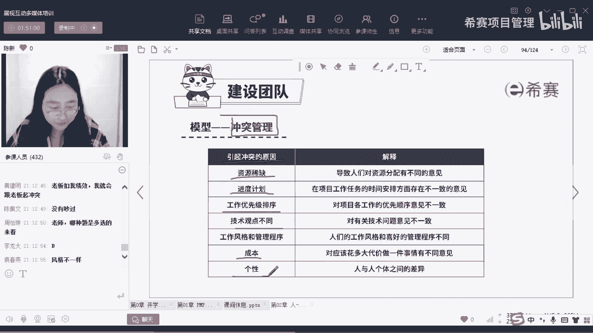
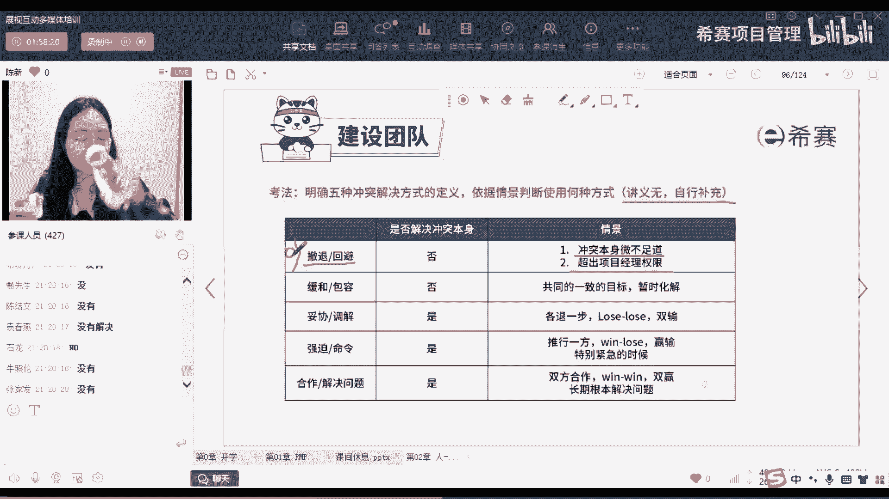
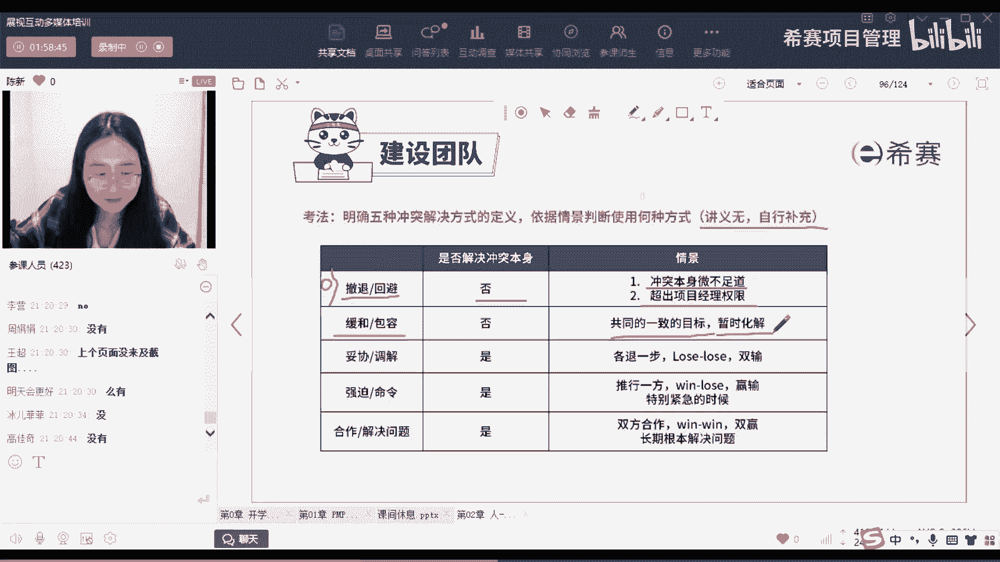
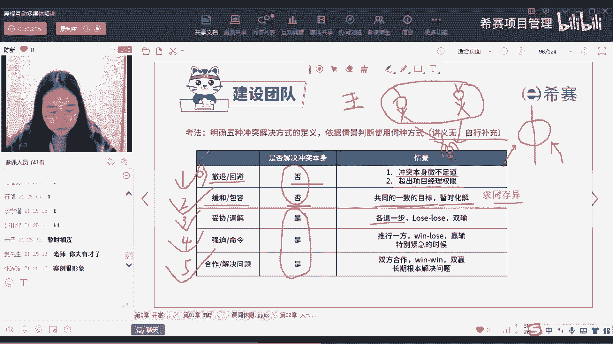
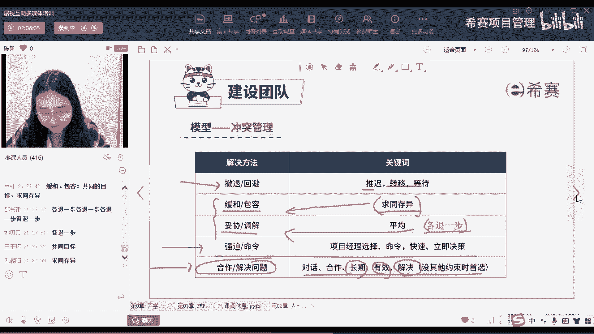
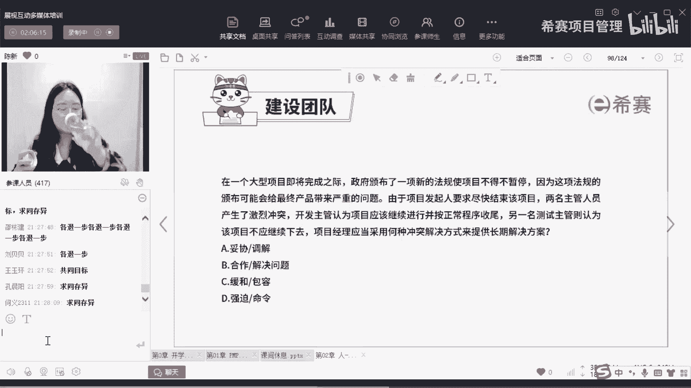
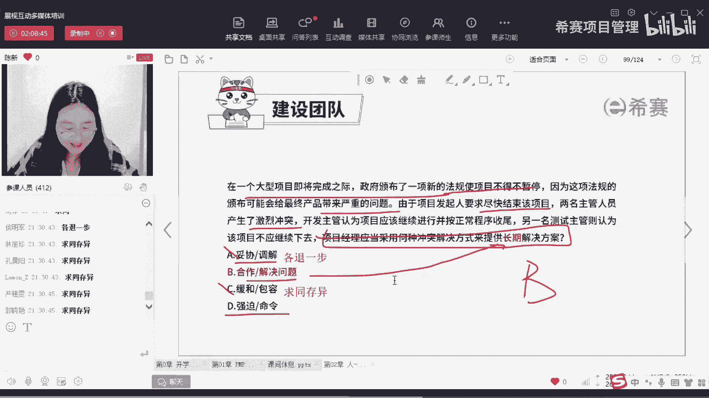

# 备考推荐！2024年PMP项目管理考试第七版考点解析直播课视频合集（试听精华版）！ - P3：冲突管理（陈新） - 希赛项目管理 - BV1V1421i7dQ

接下来我们就进入到来听清楚啊，我们都要进入到今天晚上的重头戏，就是我们的冲突管理，如果说你有提前做过，我们自认完这章的题目，你会发现有很多冲突管理的题目，对不对，所以你也要搞清楚啊，好那我们来看了啊。

首先第一个，我们引起冲突的原因其实有非常非常多啊，数不清，这里呢只是用了二八法则，帮大家列出来了一些引起冲突的主要原因，你们可以自己看一看，有没有你们日常生活中跟别人吵架啊。

其冲的原因比如说资源的稀缺啊，不是多选题啊，注意我们上课的题目只要是四个选项，都是四选一，是单选题好吗，都是单选题啊，都是多选题，好比如说你资源稀缺啊，这个人非常的高技能高人才是吧。

他分不到你的项目上怎么办，可能会吵啊，可能会有矛盾啊，进度计划，然后包括我们的工作优先级排序呀，包括每个人的观点不同啊，还有什么成本到底用多少成本，有的人是用便宜的，有的是贵的，包括个性呀，脾气呀。

想法呀，各方面都会引起冲突，对不对，所以这个呢你只需要了解一下我们的冲突，有可能是由于多种多样的原因引起的。

就可以了好那接下来就来到我们的重头戏，就是我们这张图，就是把这个图搞明白好吗，好，首先我先跟大家说啊，我们的冲突管理呢一共是有五种方式，这五种方式呢有十个名字哈，是不是看起来很懵，为什么呢。

因为每一种方式呢它都有一个对应的名字，比如说撤退叫回避，妥协，叫调解，缓和叫包容合作，也叫解决问题，强制比较命令，他们两个呢说法都是一样的，呃说法不一样，但是意思呢本质是一样的，所以呢听清楚啊。

今天下完课之后呢，你起码要把这五种它的名字能两个两个对上，好吗，这五种的名字啊，要两个量对上好的，家人们看这张图啊，这张图呢是从两个维度去讲，首先第一个是我们面向的是人际关系，也就是双方的感受啊。

冲突双方的感受到底是好的呢还是不好的呢，好然后呢还有一个维度呢使我们面向解决问题，这个问题到底有没有为我们解决，解决问题的程度如何，这是我们两个维度好，那接下来的话我们来看这张图啊。

首先呢我们从左下角开始，第一个就是我们的撤退回避，撤退回避能让你想到哪些词，我来跟大家说啊，撤退回避是什么呢，比如说这个会议先不开了，明天再开啊，以后再谈之后再说，暂时搁置，所以注意啊，这个撤退回避呢。

也就是说我这个冲突呢，现在这我就当做没看见，我先把他给他绕过去好，那我们来想一想啊，这其实不是一种很好的解决方式，但是为什么会有撤退回避呢，因为有可能出现你这一个冲突。

你这个矛盾本身他的情况比较的轻对吧，他没那么严重，他也不紧急，它也没那么重要，这是一个非常小的矛盾点，所以呢你可能就是事后不见了，把它忽略过去了之后再说，以后再谈，反正呢有的是时间，以后慢慢搞好。

这第一个就是我们的撤退回避好，接下来呢比这个撤退回避呢，刚才我们说了，你如果是不重要的啊，又不紧急的，我们就用撤退回避，是不是之后再说，以后再谈，但是如果是又重要又紧急的呢，他用的是什么呢，强制命令。

强制命令，也就是说我基于我是你的领导，我是你的上级，然后呢我用了一些某些职权，我要求你做什么事情啊，就是那句话，我我要我觉得我不要，你觉得是不是就这样的强制命令的方式，虽然说他也解决了问题。

但是你想一想双方的感受会不会很好，不会很好啊，你但凡被别人强制命令过，你就会觉得我心里面是对他有什么怨气的，对不对，有可能以后啊有个什么机会我就还回来了等等，所以注意啊，强制命令呢它在我们的工作中。

或在我们这里面呢，其实用的比较少，你只需要把它关键词是我们利用职权啊，利用一些这样的一个强力，然后呢就是你一个职权直立，然后呢去达到一些目的，OK好这是强制命令好，那接下来呢比这个强制命令稍微好一点的。

是我们的妥协调解，妥协调解，也就是我们的双方各退一步，各让一步，常见的例子，买衣服买菜讨价还价啊，你问他说啊，你这个雕多少钱，他说1万啊，你说500怎么办，加来开始磨嘛啊，他说什么8000啊。

你说1000等等，然后最后磨完之后发现哎2000块钱成交，是不是好，那这样的话相当于是什么呢，老板呢他从他的1万呢变成了2000啊，你从你的500呢变成了2000。

其实你们双方呢都是做了各退一步这个动作，你们双方都有自己的利益损失，但是呢最后还是达成一致了，所以这个是妥协调解好吗，妥协调解OK啊，对于你们说的平均平均这个词也可以好，再来再往后面走呢。

比我们同学小姐呢稍微好一点的是谁，是我们的缓和包容，缓和包容呢有一个词叫做求同存异，这个同是什么意思呢，也就是我们有共同的目标，我们有共同的利益啊，我们共同的利益，比如举个例子啊。

常见的夫妻双方感情不是很好，那这个时候他们为了谁忍让了不离婚，他们共同的目标就是谁孩子对不对好，那所以这种呢就属于我们双方的矛盾，双方的冲突，我们虽然暂时为了孩子，我们暂时化解了，但是你想一想啊。

缓和包容，他有没有解决他夫妻双方的矛盾问题呢，有没有解决这个冲突是被我们转移了视线，还是说这个冲突被我们解决了，没有解决，你夫妻双方的感情不好还是不好，对吧啊，你夫妻双方你有什么问题还是有问题。

那个考过不去还是过不去，但是呢你们只是把这个目光，把这个焦点呢更多的放在孩子身边，孩子身上相当于是转移视线了，所以说缓和包容呢它是没有解决问题的，注意啊，它是没有解决问题的，OK好再来最后一个。

你看这种问题，合作解决问题，它是什么呢，就是我们双方坐下来谈对吧啊，谈了非常久，然后呢谈完之后你开心我也开心，我们双方皆大欢喜双赢，这就属于什么合作解决问题，所以你会发现合作决问题。

它是一个最什么选最优选，他是一个最优选，听清楚了没有好，我刚才讲了这么多啊，我怀疑大家现在脑子里面呢，是有一个初步的印象，但是我帮你捋一下啊，我们这里面如果题干里面没有任何的限制。

问你我们最喜欢的方式是哪一种，题干里面没有任何的限制，那你选一个五个选项，五选一，合作解决问题对不对，它的特点是什么呢，是双赢啊，是长期性的，然后呢是这种彻底性解决方案好。

那接下来的话我们来看一下这张表啊，首先呢这个表格呢，我先说我们讲义上面是没有的，然后呢但是呢平时做题可能用的比较多，所以呢给大家拎出来了一下，大家可以截个图或等下做个笔记好吗，好。

然后呢利用这个表格我们来讲一些关键词，就是考试他会怎么考，首先第一个我们的撤退回避，也就是刚才我说的，你这个问题视而不见，避而不谈，把这个问题呢暂时搁置了，你把这个问题绕开了。

那所以常出现的情况是什么呢，第一个我们这个问题呢本身就微不足道，第二个呢这个问题呢本身你也管不了是吧，你自己管不了，你只能说我暂时搁置了，我放在这里，我不管好，但是你要想一想啊，我把这个问题放在这儿了。

我把这个冲突放在这了，我之后再说，我有没有解决冲突本身呀，我把这个坎给他绕过去了，有没有解决冲突本身，想想这个问题。

能跟上吗，肯定是没有的，对不对，所以注意啊，撤退回避呢它是没有解决冲突本身好，接下来下一个呢就是我们的缓和包容，缓和包容是什么呢，刚才举那个例子，为了我们共同一致的目标，也就是我们的孩子，我暂时放下。

我们的恩怨暂时化解，但是你要想他们两个人双方之间的矛盾。

之间的冲突有没有解决呢，对可以打一个字，在这啊，求同存异，这个还是没有解决，对不对，所以注意啊，在我们这五种方式里面呢，我们的撤退回避和缓和包容呢，他们两个呢都是没有解决冲突本身。

而其他的三种呢它多多少少都解决了一点，好吗好，那接下来听我说啊，我们有一个非常典型的案例，我们通过这个案例呢让大家来选一选，看你们现在听懂了没有，听清楚啊，等一下如果你要选撤退回避的话。

你就选一缓和包容就是二，这是三，这个就是四，这个就是五，好吗好，那我开始念题了啊，听清楚第一个，我们现在呢有一个抢橘子的案例，这个案例是这样子的啊，我们有两个人，一个呢是我们的罗老师。

就是我们班的这个大boss，还有呢一个是佩奇老师啊，是我们现在的男神，只有两个人啊，写在这，一个是一毛，一个是二毛，好来听我说，他们现在抢橘子呢，是为了把这个橘子呢送给他们都喜欢的，小龙女老师。

那请问这是属于哪一种，他们就想抢这个橘子，他们原因是什么呢，他们都想把这个橘子呢，送给他们喜欢的小龙女老师啊，扎这样的一个小辫子，打个比方开个玩笑啊，不是真实故事，你想清楚啊。

这是我最后没有得到这个橘子吧，啊作为罗老师，我没有得到这个橘子，对不对，最后配音老师我没有得到这个橘子，但是呢我们把这个角色让给了第三个人，也就是我们的小龙女老师，他是我们共同的目标。

那所以你想想这种属于什么呢，属于的是缓和包容，注意啊，属于的是缓和包容，这个很难啊，这个很难好，接下来再来一个，他们两个人抢着橘子的时候呢，我们的大boss出现了，我们的王总出来了，王总说罗老师。

你跟他一起抢什么抢，把这橘子给他，这种属于什么，唉非常好，这个属于四，对不对，也就是我不管你怎么样啊，我是你的这个上级，我是你的领导，我有权利对你进行这样的一个指令，命令你把句子给他。

你别问什么原因等等好，那所以听清楚啊，我们的强迫命令呢它就是这样的一个关系，好，再来再来嗯，他们两个呢抢这个橘子，对不对，好最后呢两个人他们决定一人拿走一半，这属于五吗，他们都想要这一个橘子。

但是最后呢他们都是拿走了半个橘子，各退一步是不是各退一步是什么呢，就是我本来想要一个，本来想要一个，但是呢现在我双方都各退一步，我把自己的肉割一点点下来，我损失了自己的部分利益。

但是呢我还是满足了我50%的需求，这个叫做什么，叫做各退一步，叫做妥协调解，注意啊，这叫妥协调解，就是我们说双输好，再来再来一个啊，他们现在两个人呢在这商量，商量了之后呢，他两个人都很开心说啊。

罗老师他要出门，他是这个去坐车，然后他就把那个橘子皮拿走，当那个晕车药啊，佩奇老师呢喜欢吃这个橘子肉，把橘子肉拿走，那请问这种属于什么，你想要橘子皮给你了，你想要橘子肉我也给你了，双方都很开心。

这属于什么呢，属于合作解决问题，对不对好，那最后一个了啊，来了两个人吵着吵着，突然发现诶快07：30了，要上课了啊，这是橘子嘛，哪里不是橘子，这是一个小事情啊，等下上完课，下完课之，上完课之后再说。

这种属于什么，属于撤退回避，对不对，好注意啊，这就是一个抢橘子的案例，我们可以通过这个案例呢，把我们五种方式呢给它串起来，然后等下做题的时候，你注意啊，我先说这个冲突管理。

我们第一次学所有的班级都会觉得非常难啊，都会觉得非常难，做题的时候自己摇摆不定啊，选不对呀，但是呢你可以多做题，多去总结他们的特点。

我给这里都总结好了啊，这个是我们讲义上有的好吗，我再给你讲一遍，我们开始做题，OK讲一遍，开始做题啊，首先第一个如果这个题干没有任何的限制，他就问你，我应该选择哪一种方案呢，那我们优先选谁。

一定是第五个合作解决问题，对不对好，那所以看到题干里面出现什么词呢，我们通过对话呀，我们通过合作啊，我们要寻找一种长期的彻底的有效解决方案，那我们肯定是优先选合作解决问题，因为双方都很开心。

双方都拿到自己想要的东西，双方是共赢的状态，是double win，OK好，这是第一个好，那接下来呢如果说出现一些事情，这个事情呢又非常的紧急，非常的重要，比如说两个人在会议上面吵吵打起来了。

那这种限于紧急情况的这种问题，我们应该怎么办呢，我们要去协商吗，要讨论吗，不要了啊，这个时候你作为项目经理，你就应该快速的做出决策，你跟他说不要吵了，不要打了，要打出去打，对不对，这种就属于强迫命令。

所以强迫命令呢，他一般都是表现在我们这个问题呢，又比较紧急啊，这个情况呢又比较严重，这个事情呢可能比较大的情况下呢，我们是强迫命令快速解决，对好，接下来这个问题又不紧急又不重要哦，我放在那也没事啊。

之后再说，以后再谈，容后再议，推迟等待，这属于什么撤退回避，好注意啊，这三种呢其实都比较好容易解理解，这都是比较好理解的，最难的是两种，一个是缓和包容，一个是妥协调解，好给大家举个例子啊。

首先呢我们的妥协调解，你除了刚才举的那个，我们什么讨价还价例子之外，你要知道啊，他指的就是什么呢，我们双方各退一步，我们双方是各退一步的，大家帮我打出来好吗，各退一步，就是我想要的目标呢没有完全达成。

你想这个目标呢也没有完全达成，但是呢我们可能达成50%，60%，70%，反正呢有部分利益呢是损失的，这个叫做妥协调解O好，那缓和包容是什么呢，我们为了共同的利益啊，为了第三方对吧啊。

为了这样的一个共同的目标，我们求同存异，所以就是两个词就可以了，一个求同存异是我们的缓和包容，一个就妥协调啊，一个是各退一步，这是我们的妥协调解好吗，好等下我们做题啊，我先说啊，会有点难。

但是慢慢的适应。

好这个题来看我最后一句话就可以了，前面是背景啊，虽然有一些词呢会影响你的判断，但是最后是要看问题问题，他问的是我们应该用哪种方式来提供，长期解决方案，那我问你应该选哪一个呢，好来看答案，选的是谁。

选的是我们的B选项，也就是合作解决问题好吗好，那我说到前面啊，什么大型项目完成之际，然后呢不得不暂停，然后什么严重的问题尽快结束，激烈冲突，好注意啊，这个呢可能会诱导你选D选项。

但是注意这个题干里面他没有说啊，基于这种完紧急的情况，我们应该立即做出解决方案，如果是这样的话，你就选强迫命令好吗，但如果这个题干换个方法，就换成说我应该采取哪种方式，去提供一个长期解决方案呢。

那我们说了他就是什么合作解决问题，OK所以要看清楚这个问题的问法，听清楚啊，相比其实说实话，你如果做错题目，你就会发现相比于我们pp这个背景的描述，这个问题的问法会更重要，OK好A和C就不用多解释了吧。

A妥协调解，请问它的关键词是什么，听清楚妥协调解它的关键词是什么，你只需要知道合作解决问题，他的确是长期的方案，具体他怎么合作，怎么达成这个目的呢，他不在这道题的考虑范围之内好吗，对，不要想那么多啊。

好注意，妥协调解是各退一步，是不是好来缓和包容它的关键词是什么，C选项缓和包容它的关键词是什么，求同存异。

