# 备考推荐！2024年PMP项目管理考试第七版考点解析直播课视频合集（试听精华版）！ - P4：干系人参与计划（陈新） - 希赛项目管理 - BV1V1421i7dQ

所以注意啊，我们家来讲些过程呢，都是围绕这一份文件来展开的，也就是我们的该选参与计划。

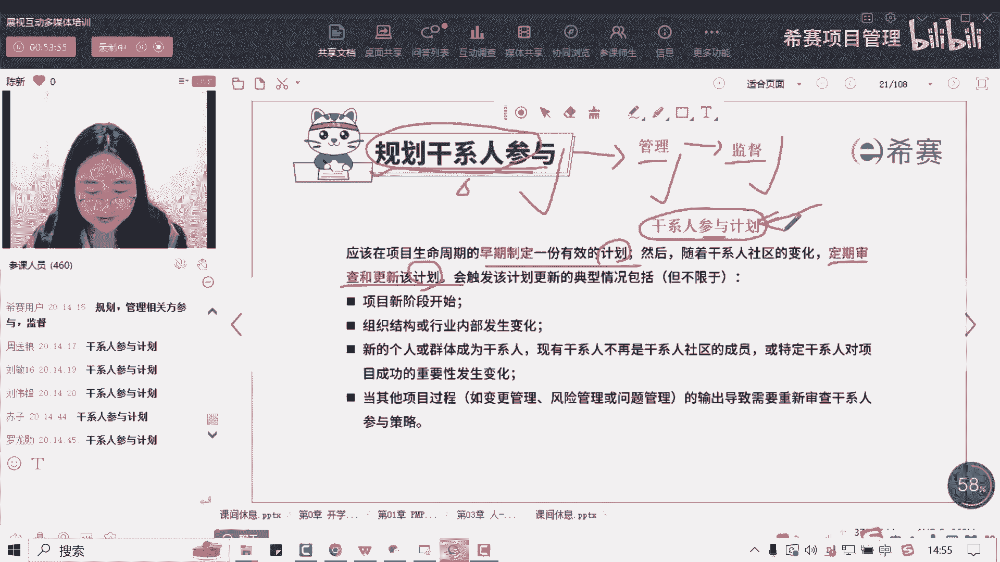

OK好，首先第一个我们既然要去制定这样的一份计划，我们要用到一些方法，注意啊，这是方法，第一个呢就要我们的干事人参与度评估矩阵，首先我们来看啊，我们是把我们的干系人，或者说我们的相关方。

把他们的参与水平呢分成了五种，注意啊，是五种，由抵制型，有不了解型，还有我们的中立型，还有我们的支持型，还有我们的领导型，好那首先我们来看它的字面意思啊，抵制型是什么呢，也就是我发现这个三官方。

我发现这个三官方，他是怎么样抵制我们的项目的，他完全站在我们的对立面，对不对好，然后呢中立型是什么呢，他可能知道我们的项目啊，但是呢他对我们的项目它是不痛不痒的啊，它既不支持又不抵制，他是一个中间派。

是一个中立型好，那不了解刑是什么呢，也就是说他可能连我们的项目，可能都不太了解啊，他可能不太清楚，不知道好，那知识行呢，就是说他非常支持我们的项目，比如说像我们的同学啊，很多眼熟的同学都是属于我。

只要上课大家都过来听课，对不对，那你这种人就属于支持型好，那注意比支持型更进一步的就是谁，就是领导型，领导型是什么，就是我不仅支持你上课啊，我不仅做这种口头上的支持，行为上的支持。

我更多是怎么样身体力行的，我去实践啊，我去领导着大家一起前进，所以注意啊，这个层级呢会比知识型更高那么一点点O好，首先呢你要了解啊五种类型，从我们的抵制型，不了解型，中立型，知识型到领导型。

它这样的一个层层对应的关系，好不好，好理顺同学那个问题，别着急呀，我们现在还没有讲到甘选参与计划，还没讲到那一块，等下会讲，等一下会告诉你他们的区别是什么，好不好啊，或者说你先把你的问题放问在列表啊。

问答列表不要刷屏好吗好，首先呢，我们先来看看我们的干线的参与情况，是什么样子的，我们先把它拎出来诶。

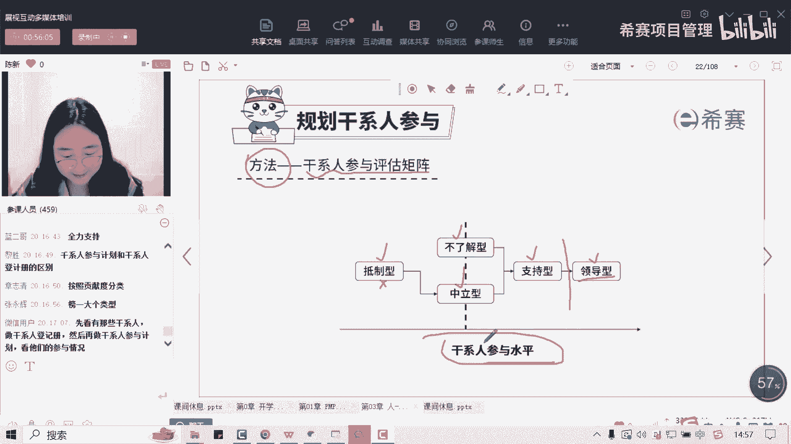

到底是哪一种类型，那接下来呢，我们这个时候呢会形成这样的一个矩阵，注意啊，你看到矩阵你大概理解为是表格的意思，好不好啊，就是这样的一个表格好，那我们来看一下表格上面会写什么呢，比如这里面有两个字母。

第一个呢就是C选项，还有这个C字母就是我们的current，指的是你当前也就是你实际的情况写在这啊，也就是你实际的一个参与情况是怎么样子的，这个是C好，然后这个D呢指的是期望的情况，也就是说我计划中。

你的参与程度应该是怎么样子的，所以你会发现在这个表格里面，我们这里面呢有三个干系人，我们来看一下啊，第一个干系人呢，我们希望他是怎么样支持我们的项目，结果呢他连我们的项目是什么，他都不知道，对不对好。

所以这里呢会有这样的一个差距，好第二关心人呢我们是支持我们，是希望他支持我们的项目，但是呢他现在对我们项目的是保持一个中立，好像我不既不支持也不反对啊，也不抵制好，既然肝气人呢，你看我们希望他是中立的。

但是呢他是一个抵制的状态，所以你会发现呢，我们再去制定这样的一个表格的时候，他们就会有两个参与程度啊，一个呢就是实际的情况是怎么样子的，还有一个呢是我们计划情况是怎么样子的，好。

那这样我们之间呢就会出现这样的一个差距，对不对，好，那我来问大家，如果说这个换成刚才我们说的那个项目，比如说你是一个男孩儿啊，你要去追这个小美对吗，好，我们还是以这个作为一个案例啊，你是一个男孩。

你要去追一个女孩，这个女孩叫做小美，那我来问你啊，这个单线一呢，你把它当成他的爸甘杏儿二呢，你当她妈妈甘姓三呢，当她的闺蜜好。

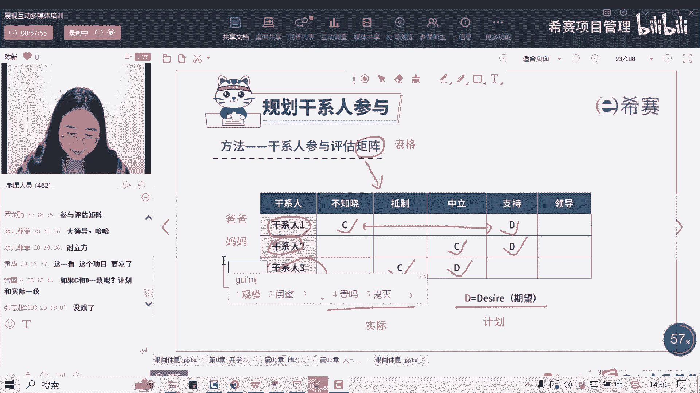

别着急啊，一个来好，那我来问你啊，你现在希望你这个叔叔是不是啊，希望这个女孩的爸爸呢，是支持你们两个在一起的，但是现在是不知道你们的关系，那我问你接下来你要怎么做好，这个时候没有男朋友了啊。

没有男朋友了，如果C和D1致呢，那就不用去管理它，那我这个时候就不用操心在它上面好吗，更多是有差距的啊，唉接下来你是不是第一步，杨先首先知道你啊，有可能你要去加他微信呀，啊跟他见个面呀。

上他们家拎点礼物啊，对不对，好，这首先是第一步好，接下来你怎么去攻克它呢，拿下你这个未来的岳父呢。

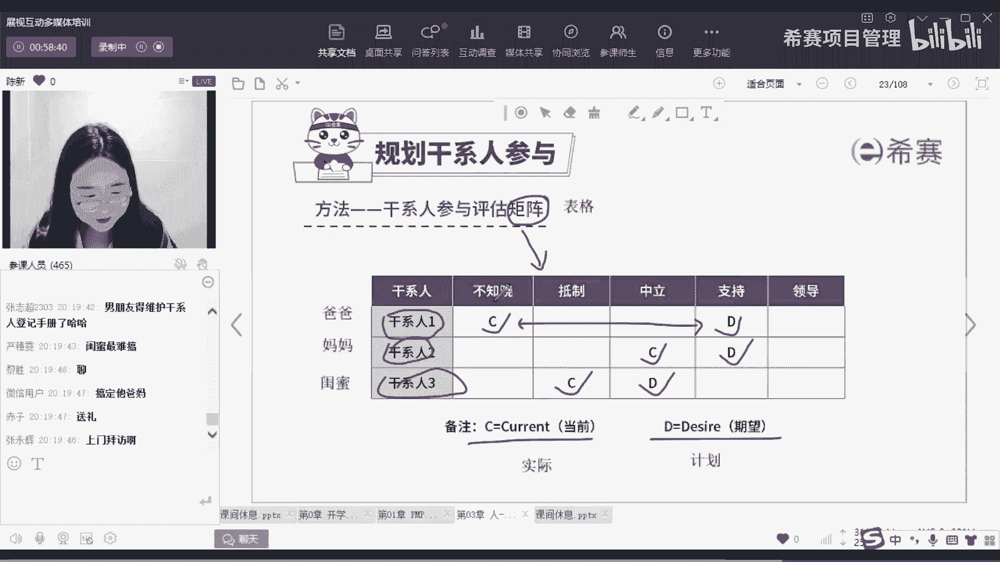

请他吃饭，请他喝酒，请他吃烟，带他钓鱼，对不对，带他开车等等好各种策略呢都有，那我的目的呢就是消除我们两个之间的差距，把它们变成一个格子里面，这是最好的，好再来第二个干弦调，妈妈好，现在它是中立的状态。

你想用什么手势啊，想用什么这个手段，或者用想用什么样的管理策略啊，让它变成支持的呢，带着个阿姨去美容院，对不对啊，给她买护肤品，给她买燕窝，给她买这种保保健品等等啊，发红包，发礼物等等，这些都OK好。

再来闺蜜，闺蜜就是我们的一个干系人，三，现在是抵制你们两个在一起，你只是希望他啊既不要抵制你，也不是说不支持你们，就是不要抵制你们怎么办，可能就是先去问问啊，这这原因是什么，然后呢我们再对症下要解决。

比如说他不喜欢你啊，太油了，怎么办，你变得干爽一点，清爽一点，对不对啊，对给她介绍男朋友也可以啊，她不想自己一个人单着，她介绍男朋友也可以好，那我们来想一想啊，我们这些去消除它的差距的这些策略。

请问这个策略等一下会把它记下来，记在一份文件里面，那请问这个文件叫做什么呢，叫做什么呢，我们这些都是逻辑关系的啊，你先是搞定了他啊，你先是想一些管理策略，要把这个策略都写下来，放到一份文件里面。

那这个文件呢就是等一下我们会讲到的，干系人参与计划好吗。

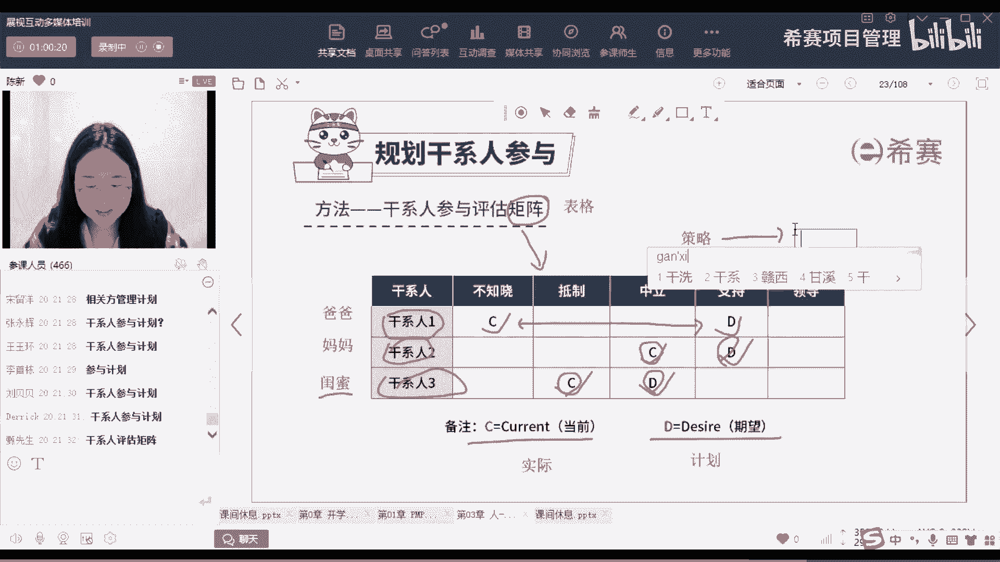

肝肾人参与计划，也就是说我们的肝肾参与计划里面，主要是什么呢，首先第一个它可能会有我们的一个参与程度啊，他会有这样的一个表格，它有可能你注意啊，这个矩阵呢它既是个工具，也是最后成为一个结果。

他有可能就是我们肝肝神参与计划，里面的一块啊，一一部分内容，这是有可能的好，第二个为了去弥补它，从这个C到这个D之间的差距。

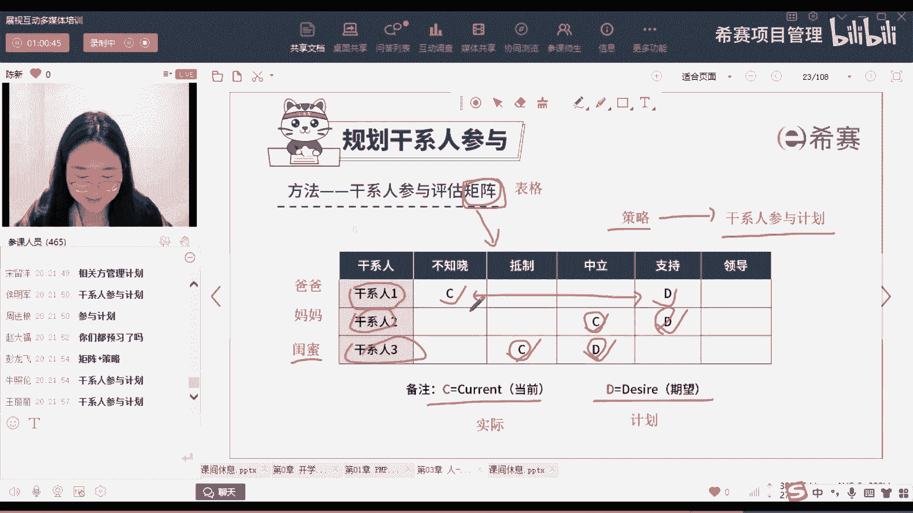

对不对，那我们可能会给他制定一份的管理策略，这些管理策略呢，它都会放在我们对应的干神参与计划里面，那这份文件呢就很重要了。

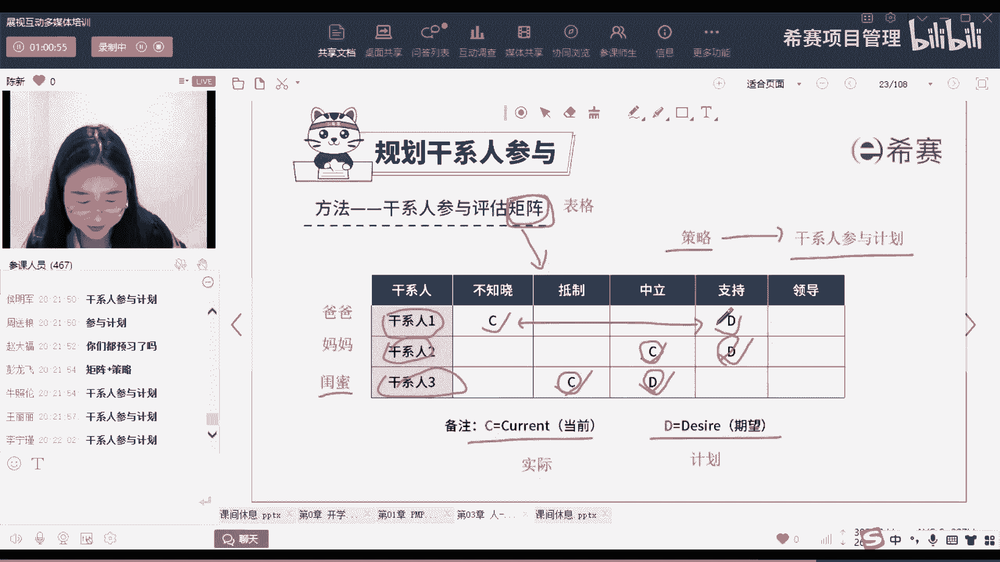

对吗O好，那接下来我们开始往下面走啊，先做一道题，好这个题呢有人选A，有人选D啊，因为这节课我们学了两个文件是吗，好刚才有人一直在问啊，说甘选登记册和干系人参与度评估矩阵啊。

还有那什么干系人参与计划有什么区别呢，我们先讲这道题啊，首先它这个题干很长，我给大家圈关键词，关键词是说，如果想要让关键干选人呢了解该信息，请问橡皮里呢首先需要向他提供什么啊，向他提供什么好。

首先我来问大家，我们现在了解的是什么信息呢，往前面找，该信息肯定是一个代词，前面有一个词汇，什么词汇确保他们的参与程度，对不对，看到了没有，也就是说我现在这个项目呢，有可能会出现质量问题。

出现这样问题是跟什么挂钩，是跟这两名资深工程师的参与程度挂钩，换句话来说，就是如果他们很好的参与了我的项目呢，可能不会出现这样问题，但是如果说他们不参与或他们抵制我的项目，他不知道我的项目。

那我有可能这个项目就会失败，就会黄了，对不对，好，现在为了获得这个参与程度这个信息，请问我们应该看哪份文件呢，我来问大家，干显能力测里面，他会有我们每个人的参与程度吗，并没有，它里面有三种信息。

还记不记得基本信息人是什么，电话是什么，加上地址是什么，怎么联系好，然后评估信息这个人的分析期望啊等等，还有什么就是那种权利利益高的，到底是哪一层的，但是注意啊，他并不是我们的参与程度。

A选项里面并没有这个参与程度，那我们参与程度在哪份文件里面呢，就是在我们的D选项，将我们的肝神参与度评估矩阵，它里面就会记录，对不对，刚那刚刚那个表格啊，你应该是有印象的，我就不会回头再看了，好。

然后B和C注意啊，都是质量相关的文件，我们现在暂时还没有学，另外这道题呢它跟质量呢虽然有点关系，但是你要看清楚这个质量问题呢，它主要是跟我们的参与程度有关，所以我们看的也是参与程度。

这份表格OKD不是工具吗，注意啊，D可以是工具，也可以是一个表格，它都是OK的，它都是OK的，好，那接下来呢讲完了我们的干线参与度评估指认，刚才我们说了，哎，你要消消除他们的差距怎么办。

你要去制定一份管理的策略，然后呢把这个管理策略呢放在一份文件里面。

这个文件呢就出来了，叫做我们的肝神参与计划好吗啊，肝神参与计划，首先我们来看一下啊，这份文件里面有什么呢，其实就是刚才我说的那四个字，把它记下来就可以了，就是我们的一些管理，他们的一些策略和方法好吗。

大家帮我把这四个字打出来啊，管理的策略。

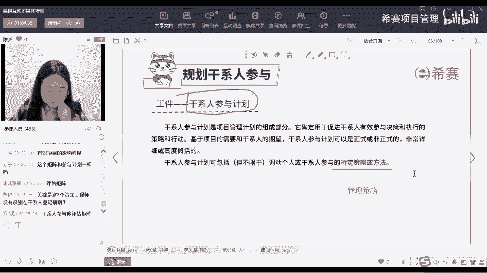

这个东西呢就在我们的甘神参与计划中，黄金同学，你可以把这个问题先问提到问答列表好吗，这个题我们先过了啊，好对就是我们管理策略啊，怎么让这个老板同意我们的项目，怎么让这个干系人支持我们的项目。

请他们吃饭啊，请他们唱K，请他们出去什么玩呀，给他们发红包啊，什么这些管理的策略呢，你都可以放在我们的甘神餐计划中，是这个意思啊。

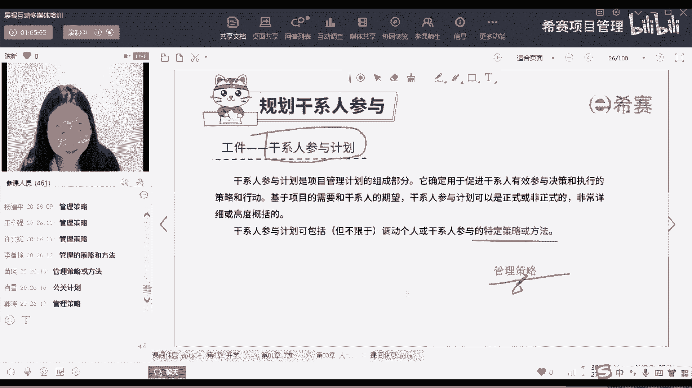

好接下来关于我们的干前餐计划里面有什么呢，有同学说想看一看这个模板，对不对，好，这个是我们的PMI啊，给的一个官方的一个模板，我们来看这份文件，首先这个文件里面就是刚才我说的，它可能有一块儿。

就是我们的相关方参与度评估矩阵，对它既是一个方法，它也可以是最后一个呈现的一个表格，放在我们的文件里面O好，然后呢接下来呢还有什么即将发生的干型变更，这个不怎么考啊，不需要管不需要管它。

然后呢还有什么相干线的互相关系呀，也就是说你要去探讨这个干线，它有什么样的关系，比如说啊这个担心人，他可能有一个儿子在你一个项目里面，对不对，是你的项目团队成员等等一些关系呢，你要理清楚好。

那接下来重点是这个啊，就是我们的肝神的参与方法，也就是刚才我们说的，你对于干性的一些特定的管理策略，OK这是管理策略，所以大家可以记一下，什么情况下需要查看这份文件呢，就是我们说的。

如果说他的参与程度不符，然后我们需要去查看管理策略的时候，我们这个时候呢，通常会指向我们的肝神参与计划，好不好啊，这是我们的肝神参与计划，等一下我们做题来体会一下。

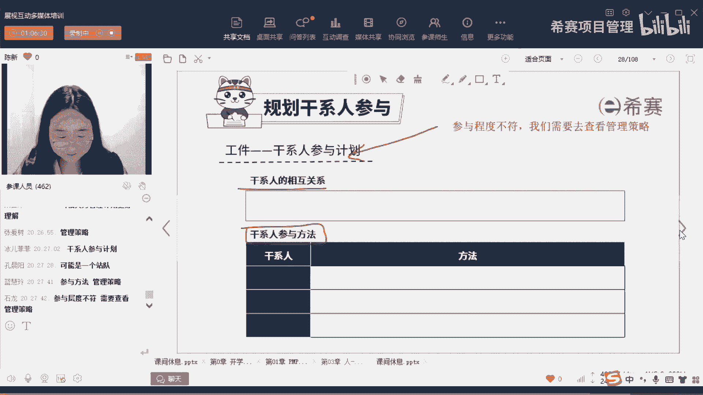

好这个题大家都选的是谁，都选的是A选项啊，做的很好，首先这个题干问的是项目经理应该事先做什么，来避免注意啊，问的是一个事前的行为，看清楚啊，是事前，不是事后好，那我们来看这个题干。

他说我们现在呢承接了一个客户的项目，然后呢我们的公司与客户呢已经合作过多次，项目经理呢负责管理该项目，在规划阶段，我们的项目团队成员呢告诉项目经理，在之前的项目中，客户呢总是不满意总结的项目绩效。

然后呢若要防止该项目出现类似的情况，请问我们应该事先做什么呢，我们来想一下，客户总是不满意我们总结的项目绩效，有可能是什么原因，有可能是他的利益也好呀，他的期望也好呀，在我们的项目中一直没有得到满足。

对不对，好，那问的是项目领事先做什么来避免，那我们就要怎么办，制定好我们的肝神参与计划，那我们来想一想啊，制定之前会做什么呢，一系列动作，然后呢去识别他的期望，识别他的利益。

然后做这样的一个适配性的干线参与计划，所以这道题呢选A是OK的，好接下来B选项注意啊，更新风险的预测，说实话，你前几个项目你不满意，这个项目呢的确有可能有不满意的风险，对不对。

但是注意我们这道题它考察的是风险这个点吗，并不是，而是说你事先做什么来管理好相关方，对吧好，所以注意啊，你当成风险来看待的话，太消极了，我跟大家说一个思路啊，除非这道题的题干背景。

你能明显看出来他是考风险的，我们一般不会把一些问题呢当成风险来对待，为什么，因为你要想啊，风险的特点是什么，给大家提前透露一下，风险的特点是不可控，就是具有不确定性，有可能会发生，有可能不会发生。

这个东西呢是你不能去控制的，所以注意，如果我们有一些东西呢，你是可以通过事先做计划，然后去执行，去监控，把这个问题处理好的，你都不会把它当成风险了对待，因为风险和不确定性太高了，所以不合适啊，B不合适。

好，C选项与团队成员讨论呢，解决客户不满意的问题，我来问你啊，这个是属于事先还是事后有好几个选C的，这个属于事先还是后，这个是不是属于事后的行为啦，你说你事后接下来怎么办呢，讨论啊，分析啊，解决呀。

当然没问题，但是我问你这个题干问的是什么，事先来避免，我再强调一下事先是什么意思，也就是说我这个题干问题没有发生之前，你提前做什么，可以让这个题干的问题不会再发生，是这个意思啊，所以注意啊。

选C同学一定看清楚题干的问法好，D选项更新沟通管理计划，注意啊，我们等一下就会学公款计划呢，它主要是针对我们信息的传递出现了问题，但这道题它属于不满意，它并不是说我信息传错了，所以这个D呢也不合适。

OK好再做一道题目。

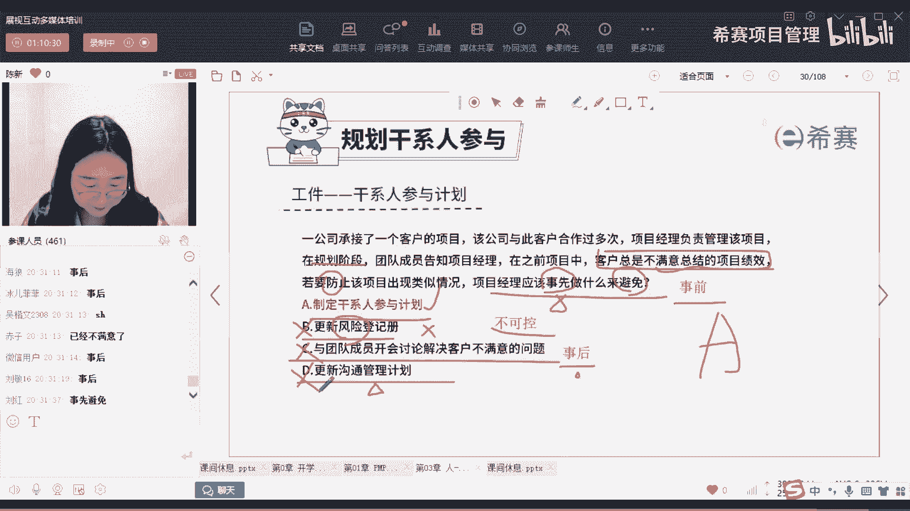

我们下课，石龙同学还是那句话，他不是事后，是事先事先做什么来避免事先就做好计划，做好策略就OK了，好来看啊，首先呢这道题他问的是，项目经理应该使用什么来管理干型的期望，注意啊，他是管理这个词。

而且题干里面他说的是一位项目经理呢，正在与众多干写人呢启动一个具有争议的项目，其中一些干写人呢未能支持该项目，那我问你，接下来你需要做的是什么，是不是我想尽办法把这些不支持的人怎么办。

通过一些策略把他变成诶支持的人，对不对，好，那我来问你啊，我们应该选哪一个呢，是不是应该选第四个，也就是我们的肝神参与计划好，那接下来看其他三个选项，A选项风险的一侧，还那句话，这个地方呢它未能支持它。

是已经发生了，是问题，不是风险好，B选项责任分举证，注意啊，这个责任分举证它更多针对是什么，给你写在这里，他更多真的是团队成员角色分工啊，就是我们的角色职责他不轻的时候，我们会到责任分配举证。

那这道题里面呢是我们的干系人，他不支持我们的项目，它跟这个呢关系不大好，再来C选项，有的同学选到了，注意啊，该选登记测，他是什么时候用，它是我识别新的相关方，或者是相关方发生了改变，对不对啊。

有这个信息发生了变化的时候呢，我需要去更新，但是注意啊，它不能让我们的干系人通过一些手段，从不能支持，去把它变成能够支持我们项目的那个状态，所以C呢它是不合适的，OK就是因为我们的管理策略。

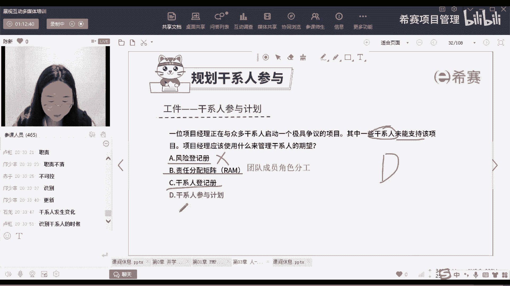

它在我们的甘神参与计划中。