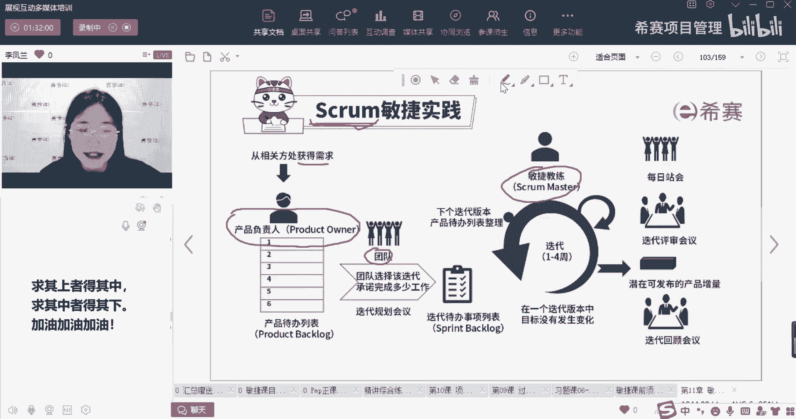
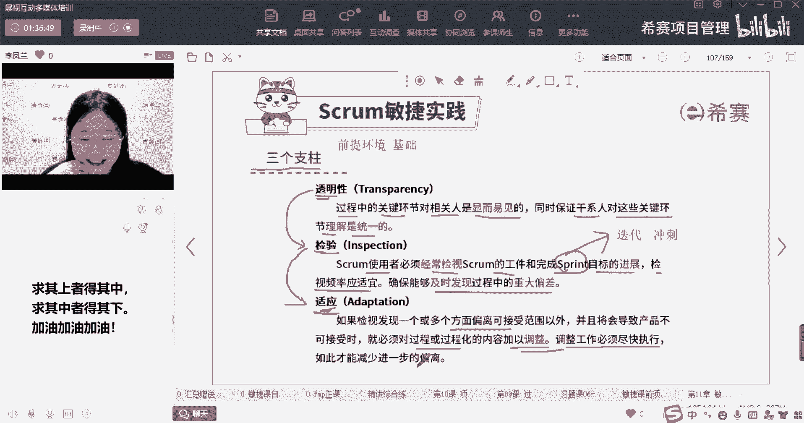

# 备考推荐！2024年PMP项目管理考试第七版考点解析直播课视频合集（试听精华版）！ - P8：敏捷三大支柱（李凤兰） - 希赛项目管理 - BV1V1421i7dQ

RM之前先说一下grown这个词啊，是不是感觉他好高大上啊，GROM哎呀，一听就是很高级的词，它是什么意思呢，它其实一开始的起源是我们的英式橄榄球，英式橄榄球里面的一个术语叫做征求啊，怎么样去征求呢。

就是我们双方的队员互相支撑着，就是我抵着你的背，他抵着我的背，后面的人抵着后面的背，然后呢我们互相支撑着来去争夺这个球，它的寓意其实就是团队一起去共同的协作，一起去达成某一个目标啊。

这个就是SCM实践它的一个词来源，那么在SCM实践里面，我们是怎么样去做事情呢，首先我们需要有三个角色，我的产品负责人他需要去获得需求，他需要去管理我的需求，然后呢我的团队要实现需求。

团队是实现需求的人，而敏捷教练是提供支持和帮助啊，和环境的人，这就是我们的三个角色，那每一个角色他需要做什么样的事情，各自又有什么样的职责，我们在迭代过程当中又要进行哪一些事件呢。

啊接下来就会给大家一一的介绍。

讲三个主角之前呢，要先介绍一下我们的一个前提，三个支柱，它其实就是我们的前提啊，就是一些前提的环境啊，前提就是基础嘛，如果你想要用敏捷的方式来去进行管理的话，那么首先你的项目环境呢需要是透明。

检验和适应的，那么透明是什么，就是我们所有的信息它都是公开透明的，在我们项目过程当中的所有的关键环节，对于我们相关的人员来说都是显而易见的，所以啊透明就是说所有的信息是公开的，是共识的。

每个人都能够知道，我们项目现在所处在什么样的阶段，每一个人他做了什么样的事情，我们的信息都是公开透明的，那么同时我们还要保证干系人，对这一些关键的环节的理解是统一的，就你不仅要知道，你还要理解诶。

我的这一个呃展示的这个信息，它现在是进度超前还是进度落后，我们现在团队的状态是好还是坏，你都要能够理解啊，能听懂，能看懂我展示的这些信息，所以这个就是透明，那既然信息透明了，它有什么样的好处。

那我的信息的传递是不是就更加的高效了对吧，你想知道什么信息，你其实都可以通过一些渠道，一些呃就是途径来去得到，那么我知道了这个信息，我就能知道大家现在的状态是好还是坏，我们的实际情况跟计划的情况。

是不是有什么出入呢，所以透明它就更有利于我去做检验，做检查了呀，对不对，所以SCM的使用者啊，包括我的团队呀，我的敏捷的教练，我的项目经理呀，我的干系人啊，都能够经常的去检查检视。

我们在这个项目过程当中的一些工具啊，和我们的一些进度，当然这一个检视的频率是适宜的，你不能一天给我打20个电话，你不能说一天啊，过5分钟你就喊我过去去，问我现在做的怎么样啦啊。

又过5分钟又喊我过去去问你做的怎么样了，这肯定不行，这对于我的工作来说是一种打扰，对不对，你肯定要有一个合适的频率，然后呢，他能够及时的去发现过程当中的重大的偏差，好同学说sprint是什么词呢。

sprint就是我们的迭代的意思啊，迭代冲刺就我们刚刚说了好多迭代的时间和啊，我迭代的交付，sprint就是迭代的意思，嗯好那么检验我发现了我过程当中啊，大家到底做得怎么样了之后，一旦有了偏差。

一旦发现了和计划情况有出入，我们就能够去进行适应和调整，所以我一旦发现了偏差，我就可以去对我的过程进行调整，而且这个调整的工作要尽快去执行，这样子才能够防止进一步的偏差，对不对，好。

那么这三个支柱它就是互相递进的，就好像大家的学习对吧嗯，大家的学习是什么呢，大家的学习情况对于我们来说也是透明的，每一个同学学了多少啊，看了多少视频，做了多少题目，你的正确率怎么样，你这一周学了多久。

对于我们的助教老师来说呢，都是公开透明的，那公开透明了之后唉有什么样的好处，我们的助教老师是不是就可以去检查，你的学习情况，是不是在一个合适的啊，是不是在一个合适的节奏上面。

比如说有的同学他就学的非常的快啊，他有的同学他就学的非常的好，是跟上了我们课堂的一个节奏，那有一些同学呢，可能啊今天已经是我给大家上的第二节课了，可能他每一节课都没有来听过啊，可能就没有学。

那没有学的同学呢，我们的助教老师呢就会发现啊，你的这个学习的进度，学习的节奏是比较落后的，他就会去找你了，他就给你发消息说哎呀要学习呀，啊同学最近落课了，对不对，所以说发现了有问题。

我们就要去进行适应和调整啊，助教老师就要唉去啊，提醒一下你要及时的去听课，对不对，一旦他发现你的学习的情况，不是很理想的时候呢，他就会去啊提醒你啊，让你去进行一些调整好。

