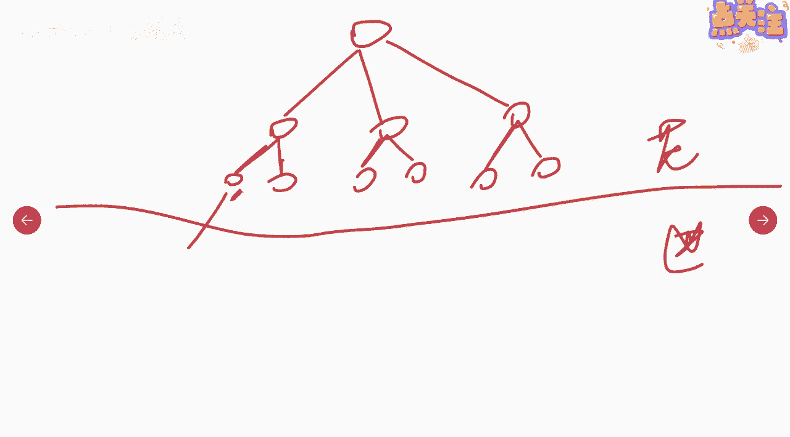
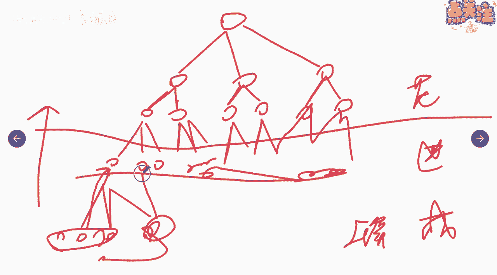

# 如何估算成本（3） - P1 - 项目管理陈老师 - BV1xA41167UA

另外一个呢叫自下而上的估算啊，自下而上的估算，那么它的一个特点就是估算个体组成汇总，这个是怎么回事呢，我们来说一下，大家记不记得我们在范围管理的时候呢，对于这个可交付物啊。

我们是把它通过w bs分解是吧。

分解成为易于管理的一个又一个的什么呀。

工作包对吧，大家还记得吧，啊比如说这个项目我分为这些啊。

分为一个一个的工作包啊，一个两个三个四个五个六个，到这个层面为止啊。

啊我们这些是范围管理里面在做的事情好。

那么到了进度管理这个过程，我们就是要找有一个活动的定义，活动这个工作包我要继续往下分解是吧，你需要做多少个活动。

是不是我需要做123是吧。

这个也一样啊，我也分三个。

123，这边也一样，每一个活动都是往下分解是吧，每一个工作包我要怎么完成它。

我都往它把它往下分解，那我这样我就得到了一个又一个的活动。

是不是很多的活动，那么这是在进度管理里面做的。

那么到了成本管理里面呢。

我们就要怎么样要做更进一步的这个活动。

需要多少的资源，需要多少人，需要多少物，需要多少的，这个是其他的一些东西啊，然后这个人这个洞人需要多少钱，这个物需要多少钱啊。

这个场地需要多少钱啊，一样的把它一个一个的估算出来。

这是我们讲到估算成本，这个过程大家清楚了啊。

好那么接下来我们在估算的时候呢。

就要采取之前是往下分解，接下来我们就要往上汇总对吧，这这些东西加起来唉。

这些成本加起来是这个活动需要的成本。

这个呢加起来是这个活动需要的成本。

这个加起来呢是这个活动需要的成本，好这三个活动相加。

它们的成本相加。

我就得到了这个子工作包，它需要多少成本对吧，然后呢这两个子工作包我再给它相加。

我就得到了这个大工作包所需要的成本是吧。

好把所有的大工作包都相加。

是不是就得到了我们这个可交付物，它需要多少的成本是吧。

就是这样，这就是一个自下而上，层层汇总的这么一个工具啊，叫做什么呀。

叫做自下而上估算啊，自下而上的准确性呢，来源你取本身所需的成本啊，通常取决于单个活动或工作包，的规模及复杂程度，也就是说你对某个活动的估算的越准确啊，那你物业网上汇总的这个东西就越准确啊。

否则呢又可能出现啊，这个估算偏差的一个情况啊，这叫自下而上的估算，也比较好理解，第四个工具呢叫三点估算对吧，p e r t考虑了不确定性与风险啊，提高估算的准确性，那么这个呢一样的，我们之前有讲到。

其实就是我们所说的什么呀，最可能成本啊，最悲观成本，最乐观成本，我们在讲进度的时候呢，讲到三点估算的时候呢，是数估算说这个活动需要的最可能时间啊，最悲观时间，最乐观时间。

那么在成本里面我们就把它换成最可能成本，所以悲观成本跟最乐观的成本啊，所以呢一样的公式也是一样啊，我们的期望值就是什么呢，最悲观加最乐观加上四倍的最可能除以六啊，它的标准差也是最悲观减最乐观除以六啊。

这是一样的，跟我们之前讲进度的时候呢是一模一样的啊，一模一样的，好好这个我们就不再强调，不再说了啊，之前我们也花了比较长的时间来说，这个下一个个技术呢叫做储备分析，主观分析涉及到的概念呢。

就是我们之前说的已知的未知风险啊，未知的未知风险啊，这里面呢对应了两个，一个是应急储备，一个是什么呀，叫管理储备啊，所以我们要对我们的这个应急储备呢进行分析，那这个也就解决了。

解释了为什么我们我们要把风险登记册啊，为什么要把风险登记册作为这个过程的输入啊，这个时候大家应该就很清楚了，对不对，为什么要把风险拿过来看，因为呢我们要来设定我们的风险储备是吧，也是应急储备啊。

那么一开始我们设定的这些应急储备，可能比较的多对吧，可能会留出比较大的一块，但是呢随着项目信息越来越明确，那么我们呢有些风险他已经明确证实了，不会发生或者已经消失啊，那我们就能可以减少或取消应急储备。

那当然如果这个风险发生了，你该动用是可以动用的啊，那么应急储备呢它是成本基准的一部分啊，也是项目整体资金需求的一部分啊，这等会我们有一张表会讲的比较清楚一点啊，讲的比较清楚一点。

所以这一点上面呢大家要清楚啊，储备分析它是来源于风险啊，然后呢我们要动态的调整储备分析啊，并不是这块留着我就不变了啊，为什么呢，因为有些风险可能是消亡了，但是呢也有可能会产生新的啊，其他的风险啊。

我们不断的识别嘛，因为风险登记册是一个动态更新的过程啊，所以这个大家要注意储备分析啊，储备分析，另外呢有一个叫管理储备的啊，管理储备管理储备我们也讲过了，他是来应对什么呀，未知的未知风险啊。

未知的未知风险就是这个风险我根本就不知道，也不知道他什么时候发生，那么这块管理储备呢，它就不包含在成本基准当中啊，但是它是整体资金需求的一部分，它但是它不包含在此，这个我们的这个成本基准里面。

也就是说项目经理呢他就无权动用管理储备啊，他有权动用应急储备，无权动用管理储备啊。