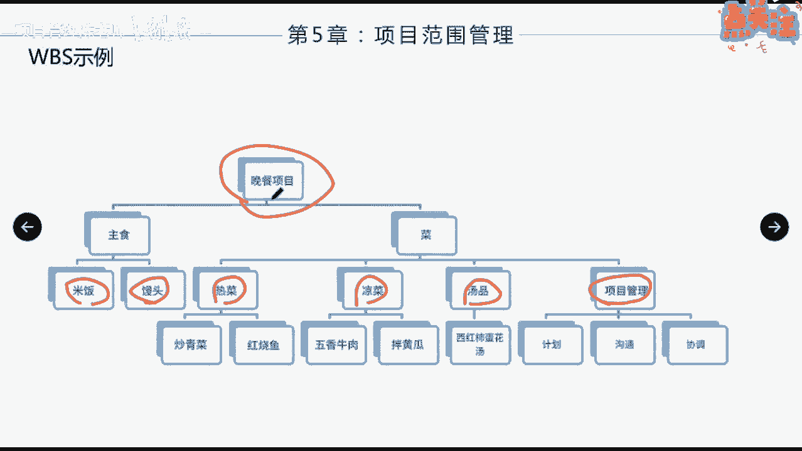

# 如何创建WBS（下） - P1 - 项目管理陈老师 - BV1YY411X7M5

那么WBS的结构呢可以采取如下的形式，一般来说可以把项目的生命周期的各个阶段，作为分解的第二层啊，产品和项目可交付成果放在第三层，什么意思呢，比如说我们说这个可交付成果啊。

它分它把我们先把它按阶段把它分是吧，生命周期的阶段啊，比如说在启动阶段，组织已准备阶段啊，执行阶段啊，还有那什么呀，这个收尾阶段或结束阶段是吧，那么在启动阶段我们不要得到哪些东西。

主至于准备阶段得到哪些东西，这个阶段要得到哪些东西，这个阶段得得到哪些东西啊，好比如说启动阶段，我要得到一个一个一个一个什么项目章程，或者立项审批的材料啊，一个什么许可证啊。

或者一个土地的一个一个使用的许可，在组织准备呢，我要有施工图啊，要有这个这个设计图啊，要有什么什么什么东西在执行阶段呢，我就要先要有要得到什么呀，先有地基是吧，再有什么，再有什么收尾阶段要有什么啊。

这是按阶段第二层，按阶段第三层，在每个阶段来能得到什么东西来进行分解，这是一种方法，当然呢，也可以把主要可交付成果作为分解的第二层啊，比如说我们刚才讲到了，你要请客户吃饭对吧，完了之后呢。

你介绍今天要有主食，要有菜，要有汤啊，还要有酒是吧对吧，这是你你你的，按照你的主要可交付成果，好的主食，我分解主食有哪些，米饭包子，馒头菜又又又可以往下分，比如说我可以分素菜，荤菜是吧。

素菜有哪些有哪些汤诶，我可以分一下有甜汤，还有什么汤啊，还有酒啊，分为红的皮的白的是吧，可以还可以继续往下分解啊，这是按照主要可交付物分解的啊，然后呢纳入项目团队以外，组织开发的各种较低层次的组件啊。

比如说你在这个分解里面，其中有一项说啊，刚才我们那个例子里面说要有人来拉小提琴，拉小提琴，这个呢我们单独拉一下啊，就是叫做什么呀，现场表演对吧，现场表演我要得到什么呢。

要要有哪些可教父啊啊你比如说要有小提琴，要有人啊，是不是还要有音响啊等等等等，这些就可以外包，比如说整个的这个工作包，我是可以外包的，我当时我也在WBS里面也要把它罗列出来啊。

把它罗列出来好，这是可以采取分解的形式，我们来看啊，这个例子就是刚才我所说的是吧，有个晚餐的项目分解成为主食和菜啊，那么主食呢米饭馒头菜呢我给它分为热菜，凉菜和汤品，还有呢我的项目管理工作。

我也把它罗列进来啊，我需要做计划沟通和协调啊，这是我应该做的啊，然后呢热菜有炒青菜，红烧鱼，凉菜有这个跟这个汤有这个好，所以大家往上看是吧，如果网上汇总的话呢，最终所有的东西加起来。

就是一个满仓的一个项目啊。

再来看软件产品，这是按照什么呀，这是按照项目的阶段了是吧，第二层是它的阶段，对不对啊，项目管理我们一般单列肯定是要列出来的啊，项目管理规划，会议管理我们分为产品需求，详细设计，构建跟集成。

在产品需求的这个呢，我们要对软件什么呀，进行一个需求调研，要有用户手册，要有这个培训材料，这些是可交付成果，完了在详细设计的时候呢，哎这个东西要进进一步深化啊，最终集成测试也是这样啊。

把主要可交付物作为下面一层。

还有一个例子呢，就是比如说我们考取PMP证书的WBS啊，我们把这个什么呀，把我们的几个阶段也分为第二层对吧，报名上课备考跟考试，那么在报名阶段呢，我要得到的一个就是什么呢。

要要确定培训机构要得到一个收据，是不是这是可交付，然后呢注册我能得到审核通过的邮件状态啊，课程看书要得到，可这个要得到这个啊，这个是吧，备考做题的记录，错题本小组学习记录，考试呢啊我可能还有薄弱点。

要得到准考性啊，最终有成绩单对吧，这个所以说中间这个呢是要做的什么事啊，我们可家夫妇应该是黄色背景的，这些是我们WBS分解的可教服务，那么告诉大家创建WBS要注意的四个方面。

如果是敏捷或者是适应型生命周期，我们可以将长篇故事分解成为用户故事，那这个长篇故事呢也叫史诗级的，大家知道什么叫史诗集吗，就是跨度很长，很宏伟，很壮观，叫史诗对吧，史诗级的故事呢我们不好去管理它。

我们不要把史诗级的故事呢，分解成为一个一个的用户故事，一个一个的用户故事完之后，再分为一个又一个的故事点，然后呢我们呢通过去完成故事点，把故事点罗列出来啊，那所有的故事点都罗列完了之后呢。

用户的需求也全部包含在里面了啊，不同的可交付成果，可以分解到不同层次，但并不是分解的越细越好，刚才我们也说了，颗粒度过细的分解会造成管理的无效耗费，资源使用低下，工作效率低，同时造成汇总的困难。

那里面呢这里面第四点比较重要啊，有提到了一个叫滚动式规划，也就是说呢，远期才完成的项目的可交付成果或组件啊，当前可能无法分解，就是这个东西可能在项目的中后期我们才会做。

那现在呢我没有办法对它进行详细的分解，不知道他到底到底是个什么样子的，那我可以把它列为一个规划包啊，等到了时候快做之前，我才来进行规划啊，这也符合项目渐进明细的特点，对不对啊。

那这种规划呢就叫做滚动式规划啊，远的先放慢慢向不断的滚动滚动啊，到了我再去分解，到了再去分解啊，或者是这样子也叫滚动式是吧，滚动式规划啊，未来的事情等快到了，我再来做相应的规划，所以这是个注意点。

另外呢还有什么呀，四个主要原则，第一个叫百分百原则，无遗漏，无多无多余，这个东西分解完之后再汇总起来，不多也不少，另外80小时原则啊，每一个工作包，最好是在80个小时内能够完成啊，80小时原则。

还有一个4~6层原则，不宜分解过细，再一个呢责任明确原则，每一个可交付都要有一个明确的责任人，来进行负责啊，这是写里面的四个主要的一个原则，那好接下来我们来看创建WBS的一个输出啊。

这个过程的一个输出主要的有两个东西，一个呢创建WBS肯定要输出一个WBS，对不对，还有一个可以说是他的附属产品，或者是他的这个呃一个一个一个搭档叫什么呢，WBS词典，WBS词典，说到词典呢。

WBS词典大家想一想词典的作用是什么，当你对这个词不理解不了解，或者想进一步去获取这个词的，更多信息的时候呢，你会去查词典，对不对，那么WBS也是一样啊，当你要对WBS里面分解完了这个工作包。

或者是规划包，或者是控制账户，你想要对他有更深的了解的时候呢，你就可以去翻阅WBS词典，因为里面记录了账户的编码，工作的描述，负责谁负责，需要的资源是什么，成本估算是什么，质量要求是什么等等等等。

都记录在WBS词典里面啊，那么WBS呢里面会记录了工作包，大家都知道了，规划包是远期的，那什么叫控制账户呢，什么叫控制账户呢，我们可以来往前看一下，假如涉及到一个多层分解的啊。

多层分解诶，那张图在哪，嗯对这里控制账户跟工作包，所谓的控制账户，它其实是一个什么呢，管理的控制点啊，那在这个控制点呢，你可以跟财务程序链接，比如说呃这个预算啊跟他相连接，那么在这个控制点上面呢。

你把范围预算实际成本的进度加以整合，其实也就是我们后面讲增值的时候会讲到的，你在某一个地方是一个控制点，然后呢来测量它的绩效，这个东西就叫控制账户啊，控制账户，比如说这个WFS分解结构里面。

我在这里设立一个控制账户，在这里设立一个控制账户，那么这个控制账户呢只针对它往往下的有用啊，比如说他可以控制在这个地方，这两个的技巧是怎么样的，这个呢它可以控制到这两个是吧。

那如果我在这里是一个ca控制账户，那么他就对这个这个这个，这个这个这个都有效啊，它只是向下不向上，大家清楚啊，就是在这个地方我设一个控制点来来来管理，来探测，啊易于我们管理，就好比我们在每一层。

大家都知道现在就光纤入户嘛是吧，然后呢在每一层，比如这一层有好多个房间，好多个这个住户，我在这一层会有一个主种的，一个集成的一个线路箱对吧，那这个线路箱就相当于是这一层的控制账户，对吧。

那每一个单元下来底下有一个控制箱，这个控制箱是控制的整栋楼所有单元的对吧，那整个小区有好多栋楼啊，我可能也有一个地方放这个控制的设备啊，所以这就是其实就是控制账户，大家可以这么去理解。

绩效测量的基准叫PMP啊，那么它由范围基准，进度基准和成本基准共同构成的，大家知道啊，绩效测量基准是以范围进度，成本的基准来共同构成的啊，他这句话，每一个控制账户可能包含一个或多个工作包。

但一个工作包只能属于一个控制账户啊，啊这个这个句话了解一下就可以了就可以了啊。

