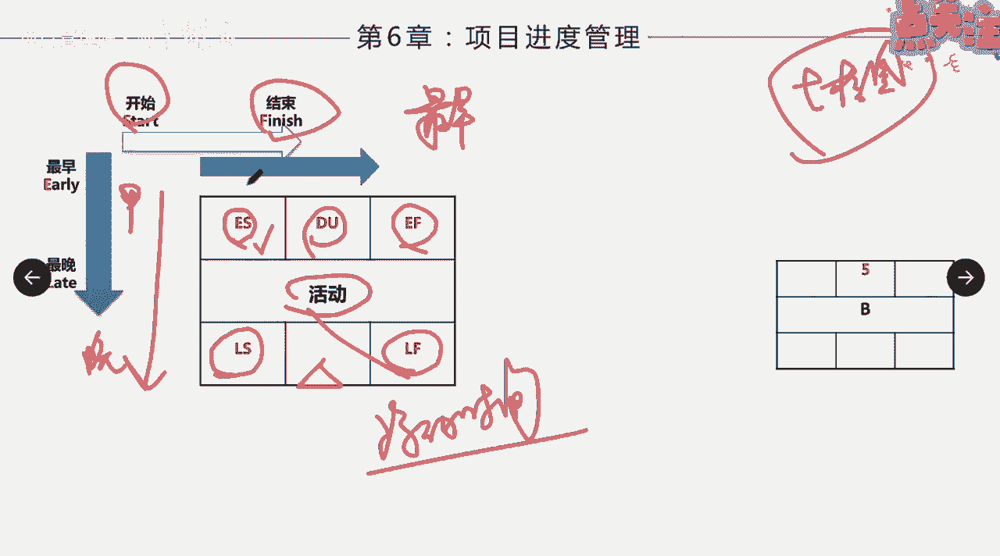
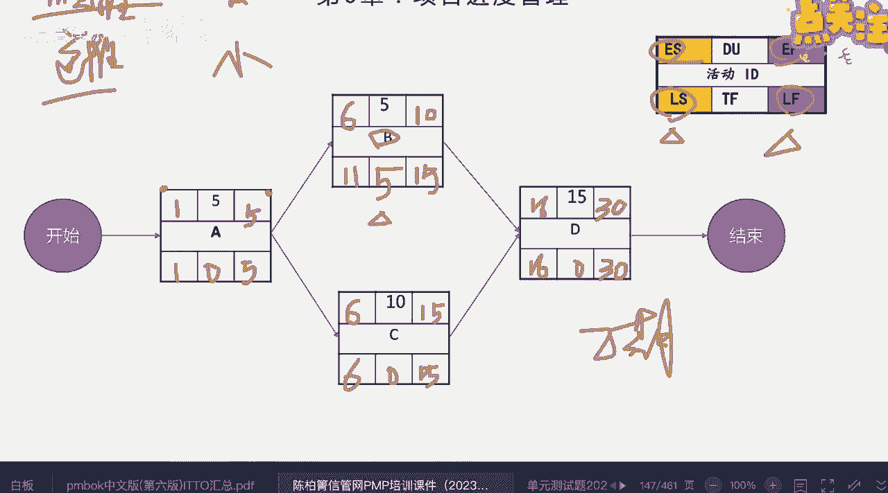

# 如何制定项目进度计划（下） - P1 - 项目管理陈老师 - BV1VM4y197oy

然后呢叫七格图啊，七格图，也是我们项目管理里面的一个术语，大家要会看这七个图啊，七哥图是什么意思呢，他把这个每一个活动啊，他的信息啊分别标在这七个格子里面，大家看1234567。

是不是1234567正好及格，那么每一个格里面代表的什么意思啊，大家其实可以看一下这条呢，横轴横过去的代表的是什么呀，开始和什么呀，结束啊，那么从上往下的这个呢，代表的是时间的最早和最晚。

那么这样一对应我们就知道了是吧，第一格里面按照矩阵来排列，第一格里面就是什么啊，项目的最早开始时间，对吧，最早开始时间我们就把它写在这里啊，然后后面这个呢就是什么呀。

最早跟结束就是最早结束时间就写在这里，那么下面这个呢就是什么呀，下面最晚开始时间跟最晚结束时间写在底下，这两个，那么活动的名称，这个活动叫什么，我们就写在这中间，活动的持续时间我们写在这一格里面好。

还有一个呢，还有一个我们会来写他的浮动时间啊，总浮动时间，哎总浮动时间好，总浮动时间会写在这个，所以这个七个图啊，大家懂不懂。

明白了吧，这个七个图我们来实际拿一张来看一下啊，这里面这个大家可以可以等会再来看啊是吧，这张标的更清楚，是不是es最早开始时间，它的简称就是early star，early finish啊。

这个是持续时间DU，还有呢late finish，late star最晚开始时间，然后这里面有两个概念，一个叫TF叫总浮动时间，也叫总时差，进度灵活性，也就是说这个活动它可以推迟完成的工期。

它不影响整体的进度啊，它能够有一个灵活的一个时间，那么什么叫自由时差呢，是针对于颈前和颈后活动来说啊，它能够延误的时间啊，这这样说大家可能不是特别清楚啊，那这里面也有一个公式。

这个公式呢我们可以等一下再来看，我们先拿一个具体的事例出来好吧，具体的事例出来来，我们给到大家这么一个信息，可能是一张表啊，然后告诉大家呢这个活动的网络图，还有呢它的持续时间已经告诉大家了。

那我们现在要学会呢来推算出他们的什么呀，推算出他们的呃这个这个工期啊，最早开始时间，最早看结束时间，最晚开始时间，最晚结束时间，我们要推算用推算怎么来推啊，我们有分为两种，一种呢叫顺推，一种呢叫逆推。

那么我们如果推算上面的这两个信息，最早的这两个呢，最早开始跟最早结束呢，我们用顺推推算最晚开始跟最晚结束呢，我们用逆推啊，那怎么推，我们来看首先项目开始，项目一开始，我们在这个最早开始时间就写什么呀。

就写一是不是项目的第一天啊，我们就开始做A这个活动，那么这个活动呢需要几天呢，工期也告诉五天，那么它的最早结束时间应该是几天，大家看做五天，第一天，第二天，第三天，第四天。

第五天是不是在第五天的时候就做完啦，嗯而且这里面大家知道第五第一天的上班开始，就开始做到第五天的这个时候，下班的时候就A就做完了，是不是这样，完了之后A做完我们同时做，要做B跟C这两个。

那么B要第几天开始做，这边要填多少，大家觉得，嗯大家顺着这个思路走一遍，后面就都会了啊，就都会了，来应该第几天我们说第一个活动的结束，已经是第五天的下班了，那么说明这两个活动啊。

都应该在第六天的上班开始做，对不对，所以这里应该写多少，第六天这个也是多少啊，第六天是不是这样，嗯是吧啊好，那知道了之后，我们来看B这个活动需要五天，从第六天开始做五天，那么第几天结束啊。

很多同学说6+5就是11天嘛，第11天结束嘛是吗，如果大家自己没把握啊，就就是最简单的一年级一样，伸出手指来算一下，第六天开始做啊，第六天六七，十第几天啊，第几天B活动做完，来大家说一下。

是不是在第十天的时候就做完了，是不是B活动就做完了是吧，好C活动做十天，那这样大家知道了啊，不能够直接相加，要相加之后减一，那么这个就是第几天啊，第15天的时候嗯，做完了是不是好。

那么接下来D这个活动呢，他需要B跟C完成了之后才能开始，那么这里面问题来了，大家觉得应该他应该在第几天开始D活动嗯，来大家说一下应该第几天开始，是第11天开始啊，还是第16天开始。

按照我们的原则是什么啊，应该是第几天，我们说顺推的时候一定要取大的啊，取大的在在这种这种叫做汇聚路径的时候，要取大的，要取大的，所以应该取的是多少，16对不对，第16天开始做这个，因为你这个做完了。

我这个还没做完呢，你要等我这个做完了才可以继续啊，所以这个应该是16，那么最终多久完成啊，31-1是不是大家都知道了，就30天啊，那这样我们就每一个的最早开始时间，跟最早结束时间就算出来了。

那么接下来我们要来求下面的这两个，要怎么求呢，来项目的结束时间，这是确定的了，对不对，啊那么它需要15天，我们往外一减等于多少啊，也是一样，第16天对吧，那第16天完了之后，我们就要把什么呀。

16写回到哪里呀，而且回到这两边，对不对，切回到这两边，那应该怎么写，这边应该写也是减一，对不对，15第15天可以开始是吧，最晚啊，那这边呢，这边应该是多少，最晚也应该在第15天的时候开始，是不是对吧。

你最晚也应该在15天的时候结束嘛，对不对，因为ti马上做这个了，那往前推我们就可以，这个可以最晚在什么时候啊，最晚的第11天开始，是不是，对吧，往前推嘛，往前推15-5加一是吧。

那这个呢往前推只能是第六天，对不对啊，第六天，然后逆推的时候碰到这种分开的人，我们要取最小的，用小的，那就是什么6-1，那就是第五天，对不对，然后呢回去了，第一天开始，那这样呢我们就把什么呀。

下面的最迟开始时间，跟最迟结束时间给搞定了啊，那这个什么意思呢，就是说你看这个活动最早如果是六，第六天开始做，第十天他肯定完成了，但是做完之后呢，他就得停下来啊，停下来他可以有延误啊。

那他最迟能延误到什么时候，他可以在第11天才开始做对吧，完了之后做五天到第15天，跟下面这个同时完成，可不可以，可以啊，它也不影响整个项目的工期，是不是这样，这个意思就在这边。

那么中间这一格就很好很好填了，我们就用最晚结束减去最早结束，这个减这个或者用最晚开始减，最早开始得出来的就是这个我们叫做什么呀，时差浮动时间啊，这个剪完是零，这个呢也是零，这个呢也是零。

那么这张图意味着什么意思啊，都都标完了，就意味着B活动可以延误五天，而不影响整个项目的工期，所以它这个的浮动时间是五，其他活动浮动时间为零，意味着它们都不能延误，一旦延误就会导致工期的变化。

那大家会发现了，这里面又有一句话叫什么呢，关键路径上的活动，它的浮动时间喂零啊，大家记住这句话，关键路径上我们刚才说找关键路径有几种方法，第一种呢就是什么呀，来找他的工期最长。

第二种呢我们还可以找他的活动的浮动时间，如果是零，就说明他是什么呀，他在关键路径上面啊，所以这个七格图怎么求怎么算，大家现在明白了没有听清楚了吗，清楚的打个一给我看一下啊。

这里面还有一个练习嗯，大家可以自己练习一下，看清不清楚啊，刚才我们已经已经已经给他算出来了啊，顺推逆推啊，这两张PPT大家可以回去自己再来看一下，然后公式都在这上面是吧，公式都在这上面啊。

顺推找最大是吧啊，然后呢逆推找最小啊就可以了，然后我们得到一些结论啊，关键路径是吧，各活动它的TF总浮动时间都为零啊，结论三个活动的FF啊都等于零，就说明什么呀，他的浮动时间就说明这个活动它可以延期。

延误五天而不影响工期啊，其他的活动都不能够延误，否则对工期就会造成影响啊。