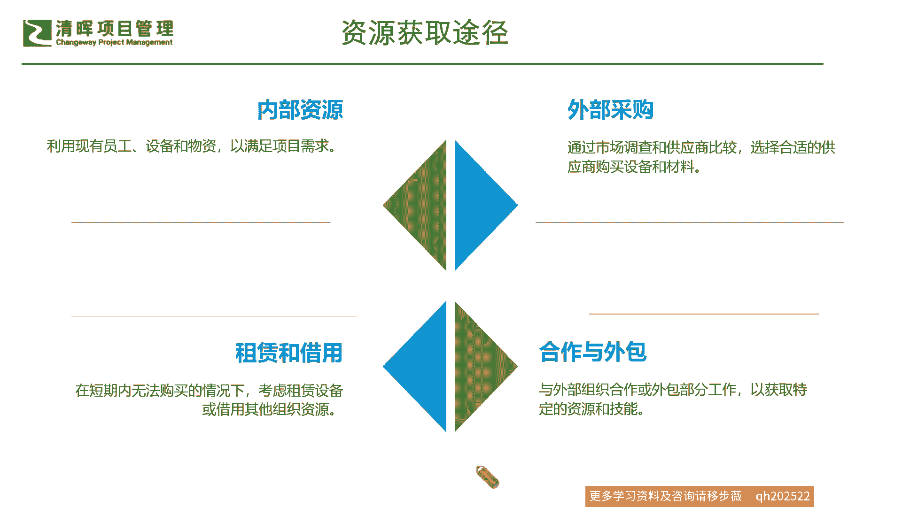
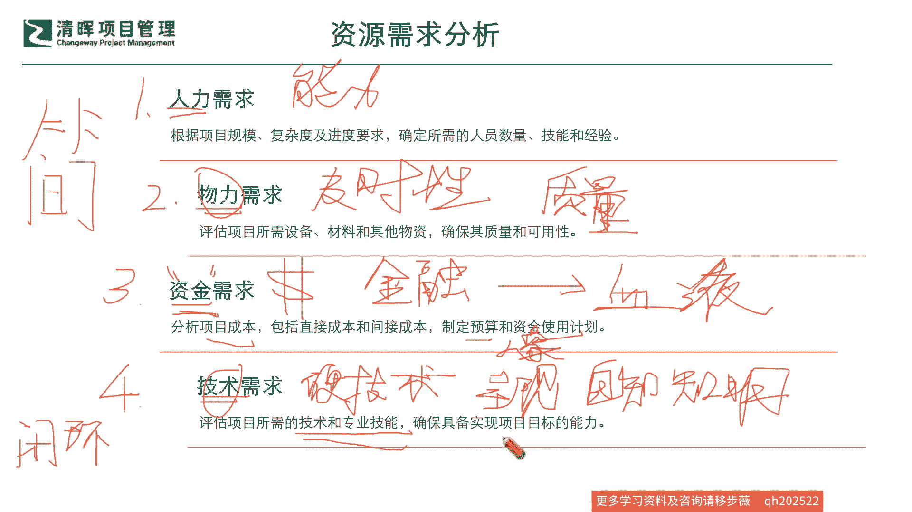
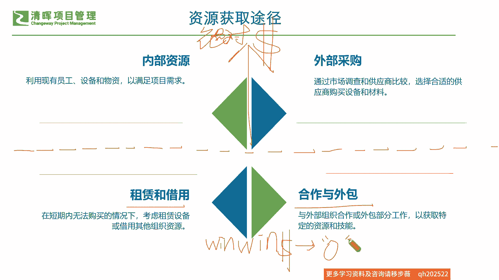
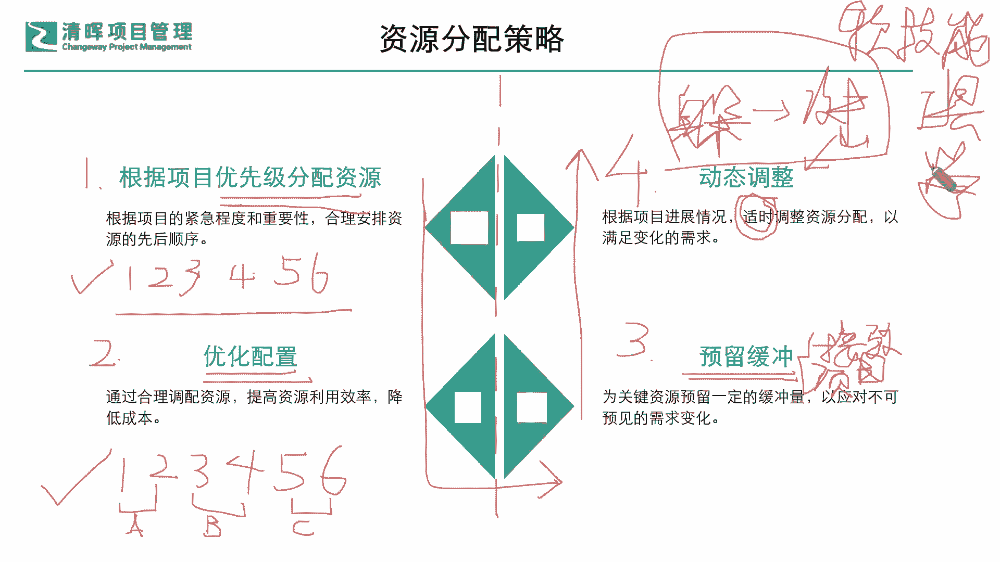

# 如何在资源有限的情况下，快速开展工作 - P3：3、资源分配策略 - 清晖Amy - BV1CEHseWEN8

我们从最初的这个需求分析上，我们需要去分析什么样的一些需求，核心聚焦在哪些方面呢，其实最大的就是什么，为什么资源是人的一个基因呐，就是命脉啊，就是跟人相关嘛，就是我们讲的人财物管理就管这些是吧。

这是非常非常关键的一个卡脖子的，一个一个这个因素是吧，就是人人力的需求，因为随着你的项目规模，随着你的一个复杂度，随着你的一些这个进度的一些不同的要求啊，可能会突突然出现这种增加复杂度，这个快速赶工。

甚至可能需要的一些人员的能力越来越高，这种现象是吧，这个很正常，所以我们首当其冲你需要去什么分析人啊，这是第一个资源需求分析必须要落实的啊，必须要落地，一定要搞清楚，知己知彼啊，不能模模糊糊说。

你只要给我凑个人头就行不行啊，你为什么要知道他的技能，他的经验，甚至他的工作的偏好，这些就恰恰造成了他是否什么，这个在这个互相匹配的时候，基因能够互相协调是吧，好那么这是第一个资源的来源。

那第二个呢就是我们的这个physical的东西，就是我们的物啦，就是我们讲人财物的这个物，那你物呢你有可能包含你的这个项目，需要的一些物料啊，设备啊，或者其他的一些这种物资啊，所以大家来想想看啊。

你的物的需求最大的一个什么要求是什么，如果我刚才我们说人的需求，它最大的一个就是什么能力分级是吧，能力的一个考核，那么我们物力的需求，它最大的一个点需要看什么物的一个需求，看什么，一个是啥及时性嘛是吧。

啥意思啊，今天我要用这个东西，现在有没有没有买的话，来不来得及，来不及，我们是不是要借，再借也来不及，我们是不是要外包是吧，及时性试剂，一个就是你手上有没有说要用的时候，立马就要用，你有没有是吧。

然后再一个是什么，就是你来的这个东西到底什么，符合不符合是吧，符合不符合啊，非常好啊，我们的这个韩君君同学说，这个可用性和及时性啊，非常好的做了这个总结啊，很好啊，那这个及时性和这个质量就很关键。

也就是说你这个东西虽然有可能提早就来了，但是有没有之前大家有发现情况，你根本就是不符合你的质量要求，不符合你的合同要求，不符合你客户要求的这种东西，就第一时间被NG了，被NG之后，他就不可以再用是吧。

不可以再用，那么我们看到这样的一个东西，它也是一个巨大的一个什么漏失是吧，巨巨大的一个这个这个bug，那么这是我们第二个要看到的啊，那我们第三个要看什么啊，非常关键啊，非常关键，资金啊。

资金为什么讲这个钱很关键呀，啊如果让严老师再来，咱们就借这个人体，我刚才说了，这个资源是我们的一个人体的基因，是不是啊啊那那我再把这个资金啊，这个钱啊，就是讲这个再再高大上一点，讲成金融是吧，金融哈。

金融现在其实就是钱嘛，对不对，那当金融或者是资金，它是人体的什么东西啊，他是什么啊，其实讲白一点啊，大家看到他的一个关系，它就是一个血液，就是一个血液是吧，你没有这个什么血液，没有资金，人就活不了啦。

缺血的时候，人就会各种的生病是吧啊，这个实际上就这么一回事，如果你自己不会造血，就像我们之前有一些血液病是吧，自己不会造血，你只能去输血的情况之下，这也是什么不长久的，是不是啊。

所以我们的资金呢它就是一个血液，你必须要干嘛，自己能够造血是一方面，而且必要的一些外力也是很关键的是吧，所以我们必须要去什么，严格把我们自己内部的项目成本啊，这些预算啊，它的一个使用的情况一定要搞清楚。

并且我们还要干嘛，让我们的血液要循环起来是吧，循环起来放不能这个不动了是吧，循环起来，而且要造就我们整个健康的一个体系是吧，我们在看到这个资金需求的时候，它也是非常重要的一个资源的一个来源方。

所以不不能轻易把它理解为就是什么啊，没钱咱就少吃，有钱就多吃，不是啊，你没钱也也许就可能什么，你这个资源就出现大的问题了是吧，因为我们都知道资源能够运作起来，能够活动起来是需要有这个什么血液储备的。

是不是啊，什么意思，就比如说今天我们讲一个例子啊，大家一直在讲到进度那里，项目的进度那里啊，我们在第六章项目进度管理里面说，提到我们突然之间有项目，它的一个进度变得非常的紧张，客户要求说。

我们现在已经需要抢在这个竞争对手上市之前，然后我们必须要上市是吧，那我们就要提早一个月把这个东西交付出来，这个时候如果我们的时间点变得短了，我们就会被要求干嘛，进度压缩是吧，进度压缩要么就是什么赶工。

要么就快速跟进是吧，那其实这个赶工是什么，同志们，你如果按照严老师举这个例子啊，这个血液是吧，资金是血液，那赶工啥赶工就输血嘛，是不是啊，赶工是输血，就是说你已经什么，你已经血力不足了，已经贫血了。

我就给你输点血，是不是能够快速回血对吧，快速回血，但是快速跟进是怎么个意思啊，没有血给你输啊，我就什么拆了东墙补西墙是吧，也就是说从另外一个角度来讲，这个快速跟进，其实本身它也是有很大的局限性的。

因为你自己本身已经资源不足够了，你如果什么，你如果用你什么其他地方，就像我们可能这个讲，你用膝盖的这个这个上面的一些这种这种血肉，去补足你其他地方的残疾，那你膝盖就会少一块肉一样，是不是。

其实血液也是一样，你全身是一个机体，你这里不足，其他在运作的时候就出现了这个卡壳，你再去拆东墙补西墙，有可能会造成新的各个地方的这种什么，到处的一个不足是吧，就会有这样的问题，所以我们一定要清楚啊。

咱们的这个资金需求，它其实就是血液必须要去考虑的，那么还有一个东西绕不过的，就是我们现在接在提到的啊，我们在软技能上，我们看人是吧，硬实力上我们看这个东西啊，物和技术，那在硬实力的时候。

我们就必须要去评估清楚，咱们今天所做的所去推动的这个项目，它到底需要什么样的一些硬技能啊，我再讲一遍啊，这是应技能什么样的应季呢，比如说你是做这个这个环境保护的是吧，你去做这个这个一些最新前沿的。

这个这个一些技术研究的，那你就必须能拿得出你跟其他人与众不同的，这种什么技术的价值点，你才能具备这个项目它的一个价值的一个什么，未来价值交付的一个什么，这种可能，我们看到的一个什么商业价值是吧等等。

但如果你从一开始对这个项目的认定，就知道它其实是一个需要硬核技术的一个项目，但是你没有这个资源，你也知道没这个资源，结果你就把这个项目说没，那就先上吧，反正有什么就搞什么是吧。

那你如果是这样的一种谋划的话，你其实一定会知道，你在过程当中会出现致命的一些问题，为什么过不了关呐，因为你的资源就是基因啊，你基因有bug是没办法，就是成为一个健全的人了是吧。

所以本质上来讲你必须要认清楚自己，除非说你知道这是一个什么，不需要有技术门槛的一个项目，我们只要找具备什么什么样的资源，基本上就能够过关等等啊，这样的情况你自己是不是有一个自知之明啊。

我在这里再去讲一个啊，就是大家把它变得更加白话一点啊，自知之明非常的关键，也就是说我们一定不能感觉上好像差不多，我们先去做做啊，先去做做，又落入到刚才那个三边的一个什么误区啦，就是边做边计划边调整。

大家千万不要有另外一个误区，因为之前我在这个讲公开课的时候，有同学问过啊，说这个这个当时问的是什么呢，就说闫老师这个是不是敏捷项目管理，它其实就是一种我们做边做边去规划，然后再去再去这个调整的这么一个。

这个这个就是快速的这么一个过程啊，他也许当时也也觉察到了这种模式是吧，他认为这种是不是就是敏捷的一个核心，但是切记啊，我也特别去提醒这个问提问题的这个同学啊，我说你仅仅是快速去什么做，快速去调整计划。

这不是敏捷，敏捷是什么，敏捷要闭环，啥意思，就是你从一开始，你先去减它最关键的那个什么因素，去进行这样的一个交付和开发，这个交付和开发也必须是最快的一个速度，让客户给予肯定和什么验收。

你才能去进行下一个功能点的开发，所以敏捷是一定要闭环的，所以它不可能出现，你这种就是因为你的基因缺陷造成的，说你这个这个项目不成功或失败短缺是吧，不匹配它不存在这种，它就是聚焦在一个个功能点。

必须要闭环，必须要拿反馈，但它是以这种最小的可用单元，最快的速度的情况之下，来去进行这样的迭代的是吧，所以我们在做项目经理的时候，你一定不要这个稀里糊涂胡子眉毛一把抓，一定要想明白这个道理啊。

那么有技术的需求的时候，务必把它搞明白，务必把它搞明白什么意思，也就是说我们在这里啊，再去返回到严老师举的这个人体的这个例子，是吧啊，如果说刚才说的这个这个这个资源是基因啊，资金呢又是血液，那技术是啥。

技术，其实就是我们要长成的一个什么人的，一个什么形状，就是我们人应该多高啊，我是什么性别，我应该长成什么样子，就是我们的一个什么啊，我们的一个呈现或者是一个表现是吧，什么意思。

也就是说我最终希望他是个什么样子啊，它的人像模式就出现了，如果你一开始就搞不清楚他是个什么样子，做做三三边啊，边做边计划边调整，他就成四不像了，是不是他不是个人啦，那不是个人的时候，你咋交付呢，是不是。

所以实际上我们就要一开始就像画素描一样，画人是吧，画皮先画骨是吧，你一定要先把他的这个核心的硬技术，这个骨架给它拎出来，让它长得像个人的轮廓之下，再去给它填这些什么血液啊是吧，给它填基呃。

这个这个基因呐是吧，然后让它去长成一个人形是吧，其实技术这个硬核的一些这种技术需求，它其实就是一个人像的模式，就是让你要知道你未来要变成什么样的一，个样子是吧啊，这个也是非常非常重要的一个资源的一个。

需求的分析，那么我们跟大家讲了这个化繁为简的。

四个资源的需求分析之后呢，我们再来看看我们在资源的获取途径上，我们其实也比较简化的，会有几个这个步骤啊，莫妮卡同学说的很对啊，就是结构框架，就是你必须得去搞清楚你要的是什么样子，对吧啊。

甚至我们有很多同学啊，这个这一点上我再补充一点啊。

我再回到这里啊，非常好啊，谢谢MONICA同学一个提醒，其实之前也有同学老是问，说，这个这个东西，就是不知道为什么就做着做着就跑偏了啊，就是可能很难去监督啊，其实在讲的不是监督，难。

是你从一开始就没有把这个什么框架给它收，敛正确，也就是说白一点就是你你如果东打一耙，西打一耙，你发现边界无法界定的那种监督，其实你会作为一个救火的人员，你会累累死的是吧，这个这个项目经理太难干了是吧。

那其实我们在一定的结构框架，就是我希望我这个东西，一定会变成一个什么样子，他这个也是一个就是叫如果放在公司里面，他就是个愿景使命，比如说未来几年对吧，小米会成为大家最受信任的。

什么性价比最高的这样的一个什么，我们的一个这个啊，这个生活的这么一个电子品牌是吧，所以我们看到大家本身给自己定的这个框架，其实就是自己想成为的那个样子，那如果你还一时半会儿项目经理。

你从一开始你在分析你资源的时候，你搞不清楚你想成为什么样子，你搞不清楚你你需要的硬技术是什么，你这个时候要要怎么做呢，你这个时候要怎么做，你一定要结合团队，结合更多人的一个视角。

大家来去把这个记这个框架要建立起来，不然你连自己未来这个交付出去的这个人啊，这个生的这个baby是吧，健不健康暂且不讲啦，看不出一下子看不出来啊，通过产检的这个不断才能检查出来。

但是他是不是长得像个人都不知道，这就不对了是吧，你肯定就是一开始最先的就是排基嘛是吧，我们其实就是不能去跑偏，跑偏就是畸形了是吧，所以我们就是一开始就把它要什么，收敛在一个我们想要的一个样子里面。

这才是正确，所以这是考验项目经理的一个极强的一个目标，框架能力的，那么在这个框架之下呢，我们就要去通过我们最简化的途径去获取这些，我们想要的资源，来补充我们的这个，让我们成为一个血肉的综合体。

一个健康的人是吧，那我们在这里就可以看到，最先我们想到的就是从内部去拿是吧，从现有的这个员工啊，设备啊物资，然后来去选来去筛，来满足这个项目的一些需求是吧，那我们进一步呢还要从什么外部，实在不行了。

才外外部去采购是吧，你可以去调研市场当中，具备这种性价比的竞争力的匹配性的，好质量的是吧啊，都可以去进行外部的采购，当然我们之前也了解到啊，我们进行外部采购的一些原因，有可能是战略性的。

有可能是财务性的，也有可能是一些什么，我们自己迫不得已的是吧啊，因为这个大家在学偏批的时候就已经学过了，我这里就不赘述了，所以这个也是我们必须要去考虑的一个点啊，这不是从一开始就进行取舍的。

而是你必须都要去考虑的基本点，那么再来呢，就是是否可以去进行一些低成本的一些操作，比如说什么呢，就是租赁和借用啊，首先啊来来来，我先画个分水岭啊，有很多同学这个经常啊爱跟严老师说。

哎这个课件能不能这个哪里能下载啊，怎么样，我是讲啊，课件下不下载不重要，你只要认真听了，你听明白了，其实这个课件没你自己也能画得出来啊，为什么我在讲的，我画一条线，你就明白他的逻辑了，上面这个部分。

内部资源和外部采购都需要用到什么东西，你去获取资源途径，你都要干嘛，绝对的要干嘛，付钱是吧，绝对的付钱啥意思，绝对付钱是什么，必须掏腰包，必须掏腰包，你不掏腰包就不行，就就就不能给你是吧哈。

绝对的掏腰包就是你必须要去付钱的，付钱出去的内部资源，你从这个设备你不管怎么去挪，你都要去平摊成本是吧，外部采购更不用说了，绝对的要掏腰包的，那我们这个横虚线以下的下面这个租赁和借用，合作和外包是什么。

它其实就是一个什么win win啥意思，共赢的情况之下，有可能你是部分的付成本，或者还有现在好多那个叫什么，像什么我们的合同合同能源管理模式，你都不用付是吧，你钱都不用付。

人家带着钱过来给你给你做这个事情对吧，那其实最终都是在其他的点上去，进行一部分的分裂是吧，所以这个win win就租赁和借用以及合作和外包，就是把你的成本转移了一部分，原来要绝对的付出去。

现在不要的付那么多，付一半也许就行了，或者是运气好的，弹得好的一半都不要付是吧啊，所以其实它就是这么一个关系，所以你你在考虑这个资源的获取的时候，你就要去把底层要想清楚，你在某一些情况之下。

或者某一些环节里面，你采用哪样的一个方式，其实是最为妥帖的是吧，最为妥帖的，所以可能我们知道了这几个核心的方式哦。

那我们再来看看你拿这个方式之后，你怎么来分配是吧，你怎么来分配，你就像我们刚才分级分层一样，你咋分配啊，你你知道了，这个说啊，我这个有了WBS，我知道这个任务了，他的任务肯定是有优先级，按时间顺序排的。

有优先级的，那我按照他的紧急程度和重要性先排呗是吧，这个是无可否认的，第一步按照你的优先级时间先后顺序去排对吧，那么还有一个是什么这个图啊，这个图我给大家从竖着分啊，刚才是横着分啊。

现在竖着给大家打个虚线啊，从竖着分左边，第一个根据项目的优先级去分配资源啊，这个无争议啊，他本来WBS就这么一个目的，那么第二个呢分完按优先级分完之后，你还得优化一下配置，啥意思啊。

也就是说本来你按照优先级分配资源，我举个例子啊，比如说你是123456，你每一个每一个步骤，你都进行了一个什么资源的合理的排配，来去让它这个步骤能够顺利，什么进行和交付出来是吧。

这是我们常规的优先级分配资源，就是123456，根据重要性就排就分嘛，对吧好，那么我们在优化设置的时候怎么办啊，其实你就会发现，也许啊，诶我出于我的一个什么资源的成本的一个考量，资源的效率的一个考量。

也许我发现一和二可以有一个共同的资源A，来完成，三和四有另外一个资源啊，B能够完成，五和六，有第三个资源C就能全权完成，那这个时候你就肯定资源效率上，你就比第一个这种按照123456这种。

要什么节约一半的效能了，是不是啊，所以实际上你就是一个非常非常明确的一点，就是你不能仅仅根据WBIS去排这，么一个资源计划，你就告诉大家说好，我们资源就这么分了啊，这个这个还没经过你的这个优化配置的。

这个思考，你就直接按这个给出去的，这都不是一个什么节约成本的一个方法，所以基本上你也作为一个资深的项目经理，你也不敢把这个东西第一下就交出去啊，你一定要想想这个第二步啊。

就是这个部分怎么样去合理的优化是吧，所以实际上在这样的一个优化情况之下，我们势必还会发生有很多的问题，那很多问题怎么弄啊，我们第三步啊到这里了啊，就是像一个这样的逆时针的循环是吧，逆时针的循环。

那我们来看看第三步到这里去要干嘛，就知道是吧，万事皆有变化是吧，万事皆有变化，我们一定会遇到一些什么，我们无法掌控的东西是吧，出现了一些异常，咋整啊，就是留点八分呗，所以这里的讲的就是预留缓冲。

这在我们的项目管理啊，在PMP当中我们有一个叫做什么管理，大家还记得进度那里，第一个叫做什么接驳缓冲是吧，接驳就是就是在我们的一些路径，汇聚这个关键路径，非关键路径是吧啊它有个接驳缓冲。

然后第二个有个什么缓冲啊，有个叫做项目缓冲是吧，想起来那个那个链条图了吗，啊，其实项目缓冲就是在我们的关键路径上，给给他再设置一个什么缓冲，那也就是说这个预留缓冲，不管你你多么按照优先级去排。

不管你再怎么优化必须要干的事情，我们现在留下的就是化繁为简，你就必须要去留这个缓冲啊，不是因为你过度自信，你说我这个计划，我跟你说，我一定都做了很十足的这个什么，这个这个研究了。

这个就是我想要这个我们一定能做到的东西，不要那么把话说的那么全是吧，因为你不知道这个环境，不知道这个基因哪一天突然就出，出现什么样的一些异常是吧，所以可能在这里呢，我们一定100%都要去预留。

这样的一个缓冲啊，那么最后一步啊，循环到这里来啦，我们就要做到一个什么动态的调整啊，动态调整是什么意思啊，其实说白点就是事实的变化，也就是说你会发现计划总赶不上变化快，那你这个时候即便留了缓冲。

也有一些无法应对的部分，咋整嘞，那你就需要去适时的来去调整，那动态调整最大的一个要求，和对pm能力的要求在哪里，我想请问大家思考一下，各位同学啊，思考一下，非常好啊，大家基本上我看很多同学都都在这个。

这个评论区留言啊，活跃起来了，那我们来再问一个问题啊，你来思考一下，如果你是个项目经理，你当然懂得你要适时调整了是吧，出现问题你肯定要调嘛，那什么会影响你去做这样的一个动态调整。

或者说你你你也知道要去做这个事，但是可能就是什么就是没做，或者是什么没及时做，你会发生什么样的事情就延误了嘛，或者出现一些问题了嘛对吧，所以动态调整，它对项目经理最大的一个能力要求在哪。

大家想过这个问题没，你都想实时调整，我们都想做变色龙是吧，我们都想是兵来将挡，水来土掩是吧，但是实际上我们在遇到了一些这种真实的一些，突然事件的时候，我们每一个人啊，我们团队也好，人也好。

他都是有一个应激的曲线的啊，他不可能那么完美的，就是我们讲一般我就举个例子啊，你一听就明白，一般啊我拿针扎你啊，就比如说我拿针扎一下，大家啊，你这个突然扎你一下，你的你的第一反应是什么，第一反应是什么。

躲是吧是吧躲啊，因为你这是疼痛反应啊，就躲呀是吧，第二个搞不好你还会有攻击现象是吧，啥意思啊，就是你感觉到受到攻击了嘛对吧，扎你一下疼了嘛，攻击现象你可能会产生一些这种情绪是吧，抵触是吧，这种现象好。

那么我如果说这个扎针他就是针灸针灸是吧，针灸针灸是来干嘛的，是来给你治病的是吧，那你就不能躲，也不能攻击了是吧，那你怎么办，那调整自己的心情呗对吧，接受嘛，忍吧对吧，但是忍住你就得去扎呀。

那医生如果说今天我项目经理，你就作为一个这个项目项目组的这个医生，你在监督和去给项目组治病的时候，你发现了这个问题，你开始要进行针灸，大家一开始的时候，最大的这个什么就是躲和攻击，所以对于项目经理而言。

你在应对这种现象，最大的一个能力需求就是什么软技能，软技能对吧啊，所以大家能听听明白的，你就能知道为什么现在这个像呃PMP第七版，这么强调这个项目经理的软技能啊，是吧啊。

其实就是你在遇到一些应激反应的时候，项目经理你想要做到这个实时的调整，这个动态的调整，你就必须要把你的软技能要练得，非常的炉火纯青，让大家不躲也不攻击，而是什么也不是忍啊，忍其实是始终都有爆发的时候。

就是要接受，知道就是为了大家好，都是为了要去把这个病治好是吧，大家甚至还一起来努力是吧哈，所以可能在这个当中，就是项目经理的软技能的考察时刻了是吗，所以一定要尽早去学软技能啊，我再次强调。

很多同学误以为软技能跟性格有关，什么意思，就是特别会讲话啊，特别会说话的一些这个人员啊，他会觉得这是什么，这是软技能非常强的人，但恰恰相反，不是啊，不是啊，所以我们的软技能它也是一种什么工具和能力。

它是需要大家去学的，越早学越好，所以大家一定要啊第一时间，尤其是技术转岗到pm，甚至可能原来带团队带的人员并不多啊，对于团队技能并不太熟练的一些，咱们的同学伙伴啊，一定要尽早去系统化的学软技能。

