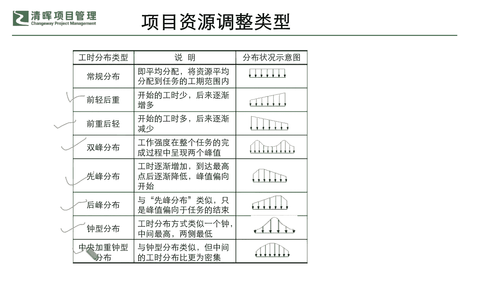
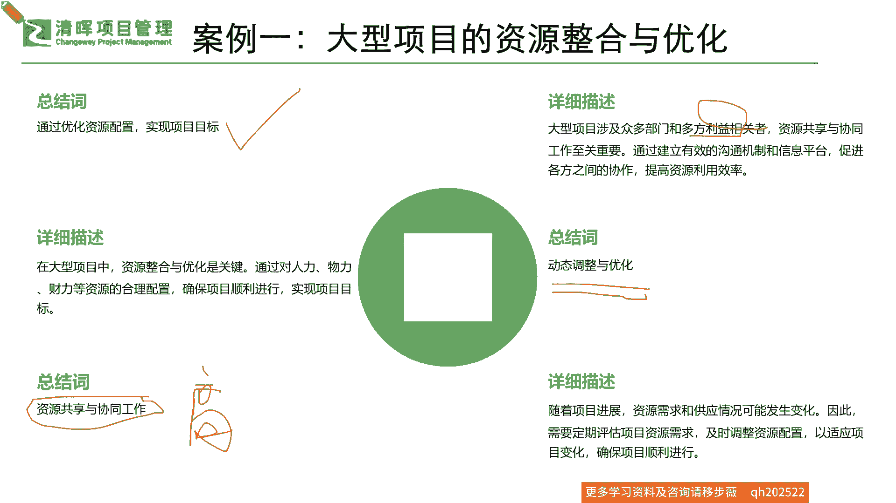
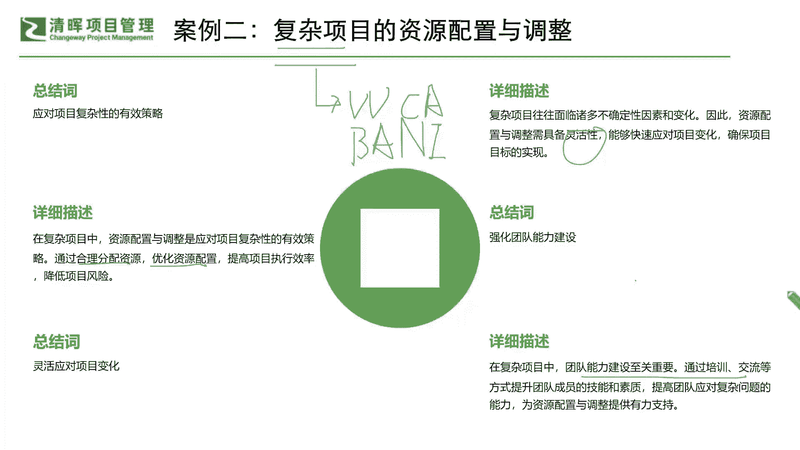
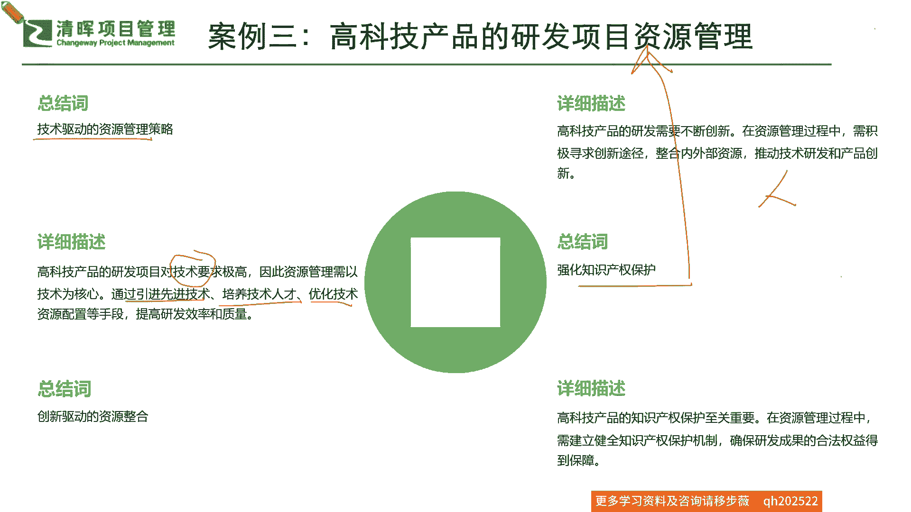

# 如何在资源有限的情况下，快速开展工作 - P6：6、案例讲解 - 清晖Amy - BV1CEHseWEN8

分享给大家几个比较典型的例子啊，第一个例子呢，你比如说有一些大型项目的，这个资源整合和优化的项目，他通过这个优化这个资源配置，要去实现这个项目目标是吧，那如果有这样的一个部分，那在大型的项目当中。

你可能会发现资源整合和优化是非常关键的，因为它永远是什么啊，项目复杂，然后人相对少，你必须得通过人物财的这个合理的分配，你才能使项目正确这个顺利，而且什么最大效益的一个这个这个落落地是吧。

那么在这个里面就特别讲究，我们的什么资源共享和高效率的协同啊，就是高效率的协同是非常非常关键的，这个效率一定要高啊，那所以在这里面你就要多花功夫去进行，资源的一个优化的一个分析，和它的一个配置的模拟。

来寻找这个高效协同的这种可能性是吧，那么还有呢，就是我们有因为大型的这种复杂的项目，它涉及很多的这种什么关键干系人相关方，所以我们的资源共享和协同，它在很多的这样的一个这个互相监督和沟通的。

机制上就非常关键，所以我们一定要及时的来去，时时抓住这些动态的问题，结构化的问题也好，具体的问题也好，来去把它优化掉，那随着这个项目的发展呢，来确保我们能够适时的来去应变啊，适时的来去应变好。

那么这是我们的大型项目，那一些复杂的嘞，你复杂性，你这个项目又比较多元，你资源配置和调整它又比较复杂，那你怎么办啊，你从一开始你就要去合理的去先分配它是吧，合理的先分配它，那么再来呢。

你需要有一个什么优化资源的一个配置的过程，也就是说你怎么样去更好的在复杂的过程当中，让我们的团队成员能够高效率的协同，来降低项目风险，你就需要知道大家怎么样啊，你的团队能力怎么样。

能够去适应这种灵活性是吧，复杂多样性其实复杂复杂无所谓，就复杂在什么，就是大家现在讲的要么就是VUCA，要么就是什么BENNY是吧，B a，是吧啥意思，要么就是特别模糊。

要不也是特别复杂兼模糊不确定性是吧啊，也就是说我们在不确定性之下，我们团队的一个灵活性能力就很关键，也就是说我们这样的能力啊，就是需要去通过我们的团队建设，通过我们的一个培训交流这种等等的方式。

我们去实现它的一个什么，实现它的一个这个这个成长和有力的一个，知识的一个提升。

那么再来呢我们就来看看，比如说你的科技产品的一个研发资源管理啊，现在大部分都是一些新的科技产品的一个，新产品交付，那这种技术驱动的资源管理怎么办啊，刚才其实提到了这技术，这个资源需求方有这个技术是吧。

有技术这个部分里面，我们就要知道你的高科技产品的研发项目，它就是有技术壁垒的，对技术要求极高，你这个时候你的整个的一个资源管理，必须就是以技术为导向，怎么为技术为导向啊，你必须要及时的去对自己的技术。

要有这个引进技术的时候，分析它的壁垒，培养能够去什么，处理这个技术和驾驭这个技术的人才，并且还要有一些高级人才能够优化这个技术，来，确保你的资源配置，始终处在一个以这个相对高效。

并且有效率解决问题的这么一个情况之下，你才能获得这样的一个成功，所以他一般来讲啊，你就是需要在技术驱动的这个资源管理里面，要去注重这种什么啊，我们的人员的一个技术的创新，能力的保护和提升。

在这个过程当中，我们就需要去不断的驱动这种什么技术，资源的这种整合啊，也去获得相应知识产权的及时的保护，也就是说你这个资源啊，资源资源啥是资源啊，你在技术项目里面的这种资源，它其实就是需要去干嘛。

及时去拿到你的一个什么，这种交付的一个人是吧，交付的人交付的一个能力是吧，交付人交付能力，所以我们一定要确保这种高科技的这种技术，可以被保护起来，并且这种情况之下，我们的资源管理能够及时的。

灵活的创新的去匹配起来，所以这就需要我们做好相应的，这种知识产权保护，它也是我们的资源呀是吧，人的资源嘛好，那么我们这是科技壁垒之下的一种情形。

那我们再来看看我们还有比较简单的，比如说我们就举啊，我这里举个建筑的，其实你举个生产制造的也一样是吧，你的一些物资采购物流管理好，那么我们在进行供应链管理的时候，多半都是想去这个降本增效的是吧。

就是我要降低成本啊，我要提高效率啊，那么在这样的一个情况之下，我们就需要这个从采购方面去进行，这样一个长期的稳定的这么一种合作关系，对于这个建筑系呃项目也好，这个生产性项目也好。

我们就需要去进行这样的一个什么，整体的一个沟通和协作，来，确保我们的这种什么，和我们合作方的供应商也好，我们的一些这种合作伙伴也好，大家可以实时来去沟通，并且尽可能的降低当中的沟通成本啊。

来去和加强我们的沟通效率，确保我们一个沟通的落地的一个有效性，也就是说，我们其实在当中，必必须要先制定一个合理的一个什么，你的一个供供应链的计划，采购计划是吧，你到底是追求这个价格低，还是追求方案好。

还是追求技术实力强，还是说可持续发展等等是吧，这些都是我们在项目的采购管理，那个里面都学过的啊，多重因素的一个影响，那我们就基于此来去选择这些优质的一些，合作伙伴和供应商来去实现我们在细节上的。

就是你在采购过程当中，和物流过程当中的，一个这个成本和措施的一个管控，来降低和缩短我们的成本和这个工期是吧，所以我们最关键的一点可以去做一个什么，就是我和我们的合作伙伴的一个关系管理是吧。

一定要互相深入到细节，你才能知道是吧，你才能知道这个管理的有效性，那么再来就是互相之间的这个信息啊，一定要实时，就是我们要通过一个更加紧密的协作，或者是更加智能的系统，能让大家第一时间看到什么。

最真实最完整的一些数据，这样子才能提高它的信息传递的一个有效性，和及时性，能让我们的整个的信息平台，其实采购供应链不就是信息差吗，啊不就是时差和信息差嘛是吧，所以我们就是拼这两个差。

它就能够产生更大的一些价值，那么在这几个例子之下呢，我相信啊大家都能够听明白啊，是怎么样一种情况，因为你在综合运用的时候。

