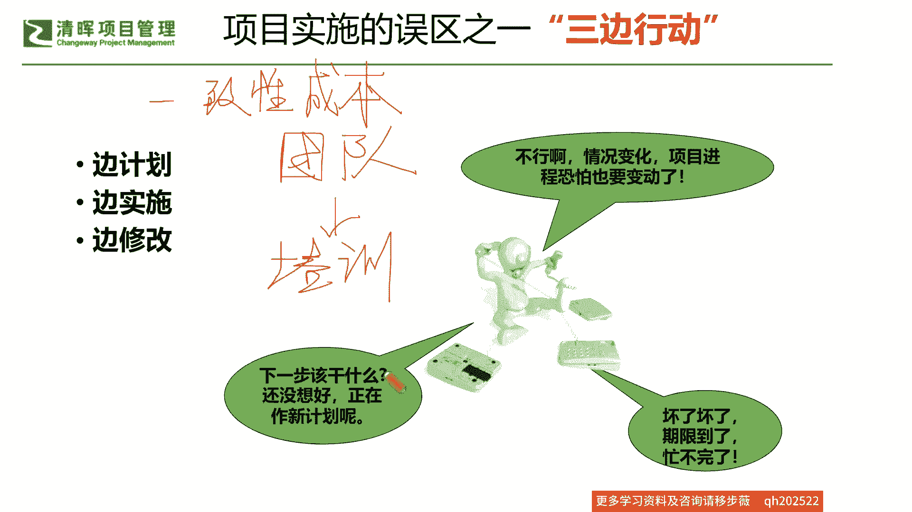
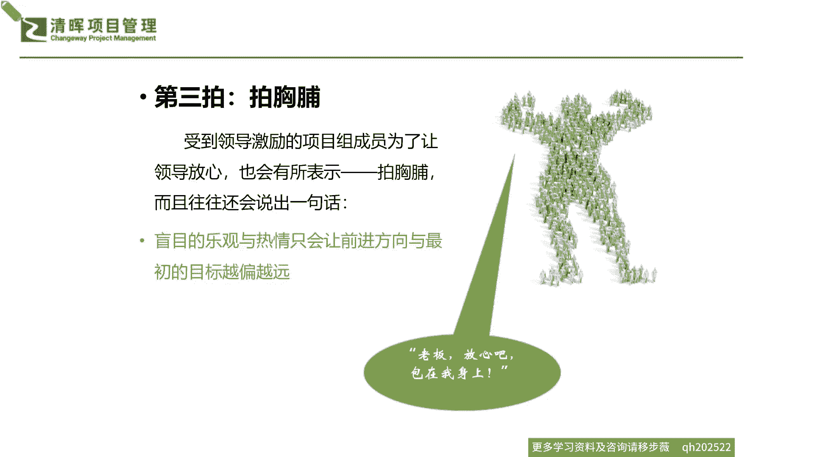
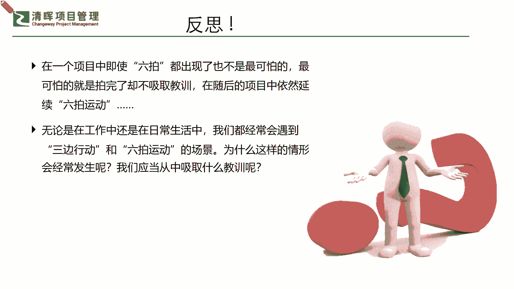

# 如何在资源有限的情况下，快速开展工作 - P1：1、项目实施的2个误区 - 清晖Amy - BV1CEHseWEN8

我们在项目这个落地的这个过程当中，我们会有一个重大的误区啊，叫做三边行动是吧，什么样的误区呢，首先第一个编计划是吧，啥意思啊，不行了啊，说这个情况变了，项目进这个进度恐怕也得要变了是吧。

这个就是被迫推着走的，那还有什么误区呢，就发现这个事情啊一直在什么啊，边计划还得边落地，还得干嘛，边调整是吧，啥意思，那下一步该怎么办呢，前面这已经进展就已经变了，那下一步该怎么改呢是吧。

但是还没想好怎么办呢对吧，你就开始又同步边做编规划是吧，那么规划的同时发现不对的，又开始叫对了，哎呀完了这个时间点快到了，但是这个这个事儿啊做不完了啊，因为基本上会随着。

当你没有这个详尽的一些合理逻辑的规划，你被这个变更推着走的时候，其实多半是什么没有办法去如期达成的，因为里面有很多的风险，你无法去及时的识别，就会造成解决一个问题，产生新的问题。

这种典型的这种困难点存在是吧，所以这是第一个，我们看到的三边行动的一个误区，这与我们的资源与我们的这个人员能力啊，其实人员能力啊，这叫什么一致性成本，大家还记得PMP时候学的这个一致性成本吗。

啊我希望大家啊，虽然咱们讲的问题都是比较实践性强的啊，但是我们也要理论联系实际实践，也要在追溯回去理论，大家把这个活学活用起来，加深自己的一些，这个对于项目管理体系的一个理解啊。

那么其实在讲到一致性成本的时候，我们知道资源人团队他们在进行培训，在进行这样的一个上岗的一个这种这种考核啊，Training，培训考核，其实它都属于这种一致性，成成本里面的一个重要组成部分。

这都是为了资源的有效性去服务的是吧，也就是说，如果你今天没有办法去让一个团队的能力，达到一个，基本能够正常运转下去的这么一个水平，你将会面临到的就是什么，你的资源的浪费，时间的延误和效率的低下是吧。

所以我们知道了这个逻辑，我们就知道，三边行动其实归根结底，就是你这资源团队不行是吧不行，那么我们再来看看还有什么误区呢。

我们在看到这样的一个部分的时候，我们还了解到，其实在咱们具体在执行当中啊，我们还有实施当中的这个很多个误区，我们简单先按照我们最为痛心疾首的，这个六个拍啊，我们先把它总结一下，什么叫六拍运动啊。

其实就是第一个大家最为熟悉，也最为痛苦的一点就是遇到事儿了，咱们就拍拍脑门儿是吧，资源有问题了，咱先不解决资源，因为资源不好解决，咱就是没人，我们也不想多花钱是吧，我们也不想培训，也不想招人是吧。

经常就是有出现这样的一些问题的时候，我们就会遇到有一些leadership，有一些领导就开始要拍脑门儿啦，那拍脑门之后呢，你作为一个项目的leader，你作为这个项目经理是吧。

那你就要对这个拍脑门儿的这个结果全权负责，那这样的一种误区，其实是你承担不了的一个结果，也就是说你根本没有办法在一个极为短，极为模糊的情况之下，知道你的资源怎么快速去重新部署。

怎么能让这些所有的团队成员迅速集合起来，变成一个快速而有效率的这么一个团体，那么其实第一个情况就出现的时候，基本上就掉断定了你后续项目不可能一帆风顺，甚至还能出现很多的掉链子的情况是吧。

那这是我们的第一拍。

那么还有什么经典的这个这个拍呢，第二个拍就是拍肩膀了，这种情况我们也不少见啊，比如说我们的离leadership，我们的领导拍完脑袋之后，为了去激励大家，为了去调动我们项目组的，所有成员的一个积极性。

他们大多会去采取很这个打鸡血的一些，激励手段啊，比如说过来就说哎呀这个小杨啊，真不错啊，最近就靠你了啊，这个项目能不能带好，就看你能不能这个全力以赴啊，把大家带出这个泥沼是吧，但实际上是什么情况。

光是领导给你拍拍肩膀行不行啊，我相信大家一定都会非常一致的讲出来，这肯定是什么不行的是吧，这叫PUA呀是吧是吧，大家现在都非常讲的很多的一个东西，就叫PUA是吧，我们这典型的是pa的一种结果。

但事实证明，其实领导的这种无根据不解决问题的，这种鼓励方式，比没有鼓励带来的后果可能还要这个糟糕是吧，所以实际上你简单的你发现有领导说，他也不解决这个这个问题啊，也不去跟你讨论这个具体情况。

就说哎我就相信你，你一定能冲出重围是吧，但是你看到这种情况的时候，你就知道什么啊，又被PUA了是吧，那遇到这种情况，你就没有办法及时有效的去采取一些，快速的行动，为什么其实你的问题没有被发现和解决啊。

甚至大家没有在想一些落地的一些，这种可行的方案来去尝试啊，是不是啊啊。

所以这是我们的典型的第二拍，那么还有什么拍呢，第三拍就是完全我们自己的一个问题了，叫做什么拍胸脯啊，拍胸脯这个大家都知道啊，一旦受到这个打鸡血的一个激励啊，这个领导说了，说小杨你这个项目全靠你了啊。

就是你的经验，你的你的这个这个团队领导力，就能带我们冲冲出重围啊是吧，那如果一旦被打了鸡血啊，你也确实是喜欢听这样的一些激励的话是吧，听进去了啊，这个时候你为了让这个领导表示放心，你也会干嘛。

做一系列什么，超出你自己承诺和能力的一些事情，比如说拍胸脯，你就会直接说啊，你放心吧啊这个老板啊，一般发起人会委你以重任的时候，你说放的方向和你的目标也许是越偏越远，因为你可能会误判了项目的所有整体的。

一些方向和风险是吧，所以千万也不要轻易的来干这种事情啊，那么在一个误区是哪里呢，第四拍啊，其实就是大家所讲的拍桌子啦啊啥意思啊，这个时候就产生矛盾啦啊，项目进行了一段时间之后呢，我们的这个领导啊。

忽然发现，项目进展情况和他想预期的那个状况大相径庭，于是呢他就特别特别生气啊，就开始了第四个拍就是拍桌子了，就开始去训斥这个项目组成员说怎么回事，一开始跟你们交代的好好的，现在为什么跑偏了。

做的完全不是我们一开始谈的这个事情是吧，结果也完全不是我们想要的是吧，出现这种问题的时候啊，我们是不是真正get到boss到底在发什么脾气，是不是到底在发什么脾气，我明明是按照一开始大家讲的这个去做了。

但是由于我们的团队的能力，由于我们的什么项目资源的缺斤少两，由于我们的这种去资源的不匹配，结果导致我们在项目进展和落地当中，我们出现了这种什么差池和偏差，那出现这样的问题的时候。

不妨啊大家可以冷静的去思考一下，看看我们到底是真的做错了，还是这只是可能boss针对什么项目交付的一个，表面的一个结果，他所认定的一个原因，但真正的原因其实是应该要让什么，要让这位boss来解决的。

就是什么我们的项目资源的一个，什么这种合格度的问题是吧，所以我们千万不要被以谋了是吧哈什么意思啊，千万不能这个你跟我拍桌子，我也跟你拍，咱们就杠起来，杠完之后呢，这个也没有结论是吧。

而且造成了更大的更深入的团队矛盾啊，造成这种协同的问题啊，这也是我们可能会遇到的这种误区之一，那么再来的拍呢，啊我们除了这个第四拍的这个部分之外呢，我们再来拍就要拍到我们的什么屁股了。

拍屁股也是个误区是吧，为啥呢。

你比如说你项目组的有很多的这个成员，也许你在被这个老板啊，被这个发起人严厉的批评之后，不少人往往就会干嘛，就会选择我就听你的嘛对吧，你说什么我做什么就拍马屁啊，一种是明拍啊，就是拍桌子不干了啊。

我这个你不承认我，你不认可我，那我也不认可你是吧，我们就不干了，直接直接我就离开你这个项目组，那另外一种就是什么安排，就是也没了热情了是吧啊，消极怠工啊，这这样子。

其实这样的一种这种情绪留在项目的组当中呢，什么意思啊，就是大家是一个耗能的过程，你就没有办法完全融入这个项目工作了，而且反而你会影响到其他人的积极性，所以实际上在这种拍屁股的这种误区之下。

其实是更深层次的一个什么，这种影响和伤害是吧，所以如果一旦出现问题，当初不把这个问题的根因搞清楚，是因为资源的一个问题导致的，大家往往就会最后最终怪罪在什么人上，那怪罪在人上之后。

发现就什么无解无解之后要干嘛，那就是该什么该骂骂，该拍拍，该走走，该留留，但留的人呢往往都已经受了极大的打击了，是不是啊，所以可能我们知道这也是一个非常非常多的情，况之下会发生的这么一种误区是吧。

拍屁股啊，那我们有了这个第五拍，那我们看看第六拍，这个拍大腿又是什么误区呢，实际上在前面五拍之后啊，项目结果一定是让所有人都，什么可能会非常失望的一个结果。

因为有了这五拍，有了这五个误区，其实你很难让项目再做成功，这个时候啊，你从这个决策层到这个项目经理这个层级，你再到传递到每一个项目组的成员，大家都有可能什么心里又特别不舒服，但是又没有解决的办法是吧。

就这么内耗着是吧，就耗着，那也就是好多人就会说哎呀早知如此，何必来这个项目组，早知如此，我就不应该接受什么，这个发起人给我分配一些什么，不合格的资源是吧，务必要去该招的招，该请的请是吧，该协调的协调啊。

早知如此，何必当初就开始拍大腿后悔啦，但实际上到了第六拍拍大腿的时候，再后悔都没有任何的帮助意义，也就是说对于你的一个项目的一个成败，已经没有任何的一个什么帮助了，那么可能在这样的一种情况之下。

我们不禁又有很多的这种什么反思，我们有着六拍的误区的时候，我们就开始仔细的去思考自己啦，那你在一个项目当中，你即使这六种情况都出现了。

是不是它就是一这个无药可救，最可怕的呢，其实最可怕的永远不是什么出现问题这件事情，因为我们知道变化才是永恒的不变，什么意思，也就是说我们所有的问题它出现了，它才是一个什么显性的。

我们能去快速甄别和解决的一个东西，如果他一直埋在里面，就像我们讲了，你又生了病啊，去医院你最好能被检查出来，提早预防，提早治疗，那也许不是什么严重的病，是不是我们不怕出现，怕的是什么，即便出现了。

你也什么没有办法解决，任由它发展，这是一种第二种情况，发现不了，自以为自己没有问题，但实际上在这几个六拍的误区当中，我们或多或少都已经撞到过这样的现象，但是自己没有去复盘啊。

没有去这个反思自己的这个团队当中，出现的问题，导致这些问题都变成这种隐性的，就我们讲的这种什么慢性的基因病，一旦发现就是无药可救是吧，因为它已经发展了好长时间了是吧，所以无论啊。

无论是在我们的这个任何的项目，管理的这个工作当中，我们只要出现这种啊这个三边行动啊，这个编计划啊，编排计划编去应对的啊，还有这个六个拍的误区的这种情景，我们就一定要从中第一时间吸取教训，那要怎么办呢。

我们既然知道这些都是误区，我们也去复盘，我们也去这个啊悟出了啊，我们也去知道我们要做很多的一些部署和行动，那我们要怎么去解决这个项目基因里面的，这种问题呢，我们怎么样去把这个资源能够有效的梳理。

