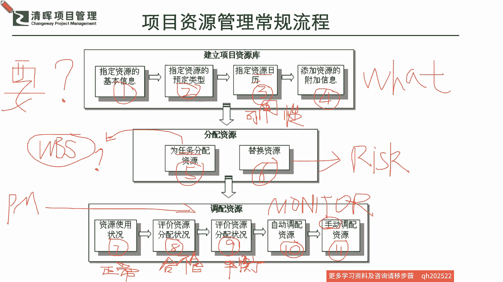
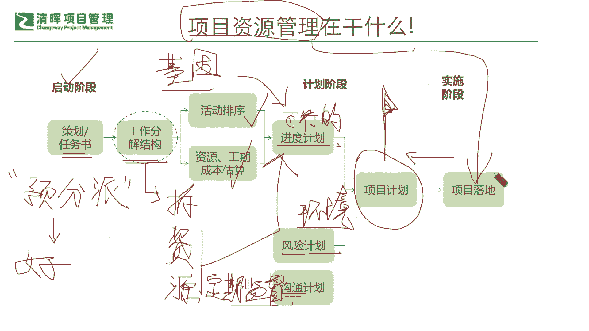

# 如何在资源有限的情况下，快速开展工作 - P2：2、项目资源管理常规流程 - 清晖Amy - BV1CEHseWEN8

我们先简单的来回顾一下啊，我们在PMP这个项目管理的体系当中，我们在管理项目资源的时候，我们一定是需要干嘛，一定是需要首先去干嘛，规划资源，建立什么项目的资源库的。

也就是说我们从一开始就要知道我们要什么，就是what是吧，就是一开始我们就知知道我们要什么，那要什么就是一个非常重要的点，那要什么从哪里来呢，其实就是从我们的分析里面来嘛。

你知道了这个这个项目他要做什么，有多长时间啊，有什么样的一些要求，那么我们就首先要去搜寻到需要满足这些需求，它的一个什么指定，资源的基本信息都有哪些是吧，这是首先他要分析匹配。

那么还要去进行进一步的什么梳理归类是吧，以防止这个漏洞，甚至可能还有一些什么全局的一些这种资源的，一个部署的这种分析需求，那么从而再去观察到每一项资源，它的一个什么可用性啊。

资源日历大家都在pp里面见过，资源日历主要就是来看可用性的啊，也就是说我也清楚，我也分析了我的指定资源的信息，我也进行了信息的一些再度的一个分类梳理，来避免一些漏失，那下一步我就要去逐个确认这些资源。

它的一个什么，我们的一个可用性，那么知道了可用性怎么办呢，我们还得把它什么，非常正确和实时的把它记录好，也就是说在我们的资源库当中，我们必须要添加资源的一些什么附加备注。

就确保它在某一特定的条件和情形和，时间点之下，可以为我们所用，那在这样的一个情形啊，所有都建立起来的时候，我们才知道它是一个项目资源库，必须要具备的几个关键要素，在这里我们指先放这四个是吧。

我们只先放这四个，那我们来看到建立了资源库之后，我们再往下去分配的时候怎么搞啊，一般来讲我们都会知道下一步第五步干嘛，你肯定就是你你计划怎么排就怎么分呗，就是你每一个什么任务都需要特定的资源。

那我们就按照你一开始规划的这个任务，进行这样的一个什么分配，那么在这里我想提一个问题啊，我们线上这个我们各位的同学啊，也几百位同学啦，我提个问题，看看大家平时有没有去回顾啊。

我们在这里讲的按任务去分配资源，这个任务是从哪里来，任务是从哪里来，大家在学习pp第四呃，第五章项目范围管理的时候，学过一个专有名词啊，学过一个专有名词叫做什么，你的任务是从哪里分解出来的。

你再从项目章程4。1出来到4。2，你要去制定规划你的什么这个项目范围是吧，然后你为了去制定那个基准，是不是啊，制定那个范围项目范围的基准，请问你也必须要出来一个什么样的，一个具体的一个结构呢。

大家还记得那个名词吗，叫做什么什么结构啊，我们把它拆到非常非常细啊，方便于执行，可以去指导执行的这样的一个结构啊，我们把它从上往下拆的非常非常的具体，非常明确啊，做到可以去细节的指导我们的执行。

这么一个结构叫什么结构啊，非常好啊，贾涛同学啊，谢谢你的一个回呃，这个这个第一时间的这个回答，说明非常的牢固啊，这个贾涛同学你可以啊，我们的线下联系一下班班啊，严老师要啊。

这个奖励你第一个踊跃回答问题哈，奖励你一本这个颜老师翻译的，最新的这个著作啊，我也希望你能够从里面找到相应的资源的，更多的战略管理的一些方法啊，相信能够帮到你啊，我希望大家也都能积极响应啊。

严老师也熟悉严老师专栏的和读书会专栏的，严老师都会实时鼓励大家的，当然我们不是这个刚才拍一拍的这种pp o a的，鼓励，我们是实实在在的这个鼓励啊，也希望大家能够切实get到我们学习的一个精要。

就是在于一来二去像打乒乓球一样是吧，我们一定要有反复的这种讨论分享和沟通，我们才能互相去赋能和成长啊，好那么我们刚才提到的就是一个WBS是吧，公做分解结构非常好啊，他就是从这个里面来去分配资源的好啦。

那有些很多同学说了，这不就分配资源就OK了吗，但是实际上并没有是吧，还有个第六步，我们一定要想的一个叫什么替代资源，也就是说你永远要有一个plan b是吧，为啥，因为可能在这个这个项目进展的过程当中。

你会发现你的这个什么项目管理的很多的，这个什么项目管理环境，他是没有办法第一时间变成你的一个什么，变成你的一个什么，变成你的一个就是随时可以去干嘛，百分之百完成的这么一种现象。

你总有一些意外和非常规的事件发生，是不是啊，所以你的这个替换资源其实为了应对什么的，简而言之啊，我们就是要抓到底层逻辑，各位同学，我们不是为了记概念啊，概念不要去死记硬背，一定要理解啊，不理解的东西。

背下来的东西你会发现很快就不是你的了啊，所以我们要理解这个替换资源，就是来对冲风险的，所以你只要记住，在所有的这些分配资源的一个里程碑里面，为任务分配资源，为所有的这个分配资源，你就会知道啊。

我们自己本身其实就是，一直在不断的在过程当中去对冲风险的好，那我们分配资源有必备的这两步，我们也知道了它的一个重要的一个理念啊，那么我们再往下我分配了之后，是不是可能会出现一些什么啊。

这个今天老李又生病啦，明天老王可能又着急离开项目组是吧，然后天这个，这个可能小羊儿又没办法当leader了是吧，各种各样的一些状况会发生，这个时候你就要知道你的调配资源的计划，永远是非常非常关键的。

一个叫什么监控的一个过程，就是monitor的一个过程，调配资源，我想再多问一个问题啊，大家来想想看啊，调配资源他其实应该是谁的一个主要任务啊，是谁的主要任务是是sponsored。

还是还是PM还是项目团队成员啊，啊调配资源是谁的主要任务啊，我相信大家应该会非常一下子就能想到啊，这这活儿绝对不能假手于人，谁的就是项目经理，你要去干，你要去监控这个过程当中发生的问题对吧。

所以你要监控什么呢，我们就会看到你第一个分配给你的这些资源，他的一个什么表现情况怎么样是吧，它的一个使用状况是怎么样，那么再来评价资源，你就会知道可能在过程当中，你就会发现虽然显性的问题没有多少。

但是逐步的隐性的问题一步步在暴露的时候，你能不能够第一时间把这个问题给识别出来，说这个资源不匹配是吧，这个资源不匹配，那你需要去进行必要的及时的这么一个调整，不然会导致项目的一些失败是吧。

那么有了这样的一个部分的时候，我们想知道啊，我们的评价资源分配这个状况，我们自己是不是一个能够去进行这样的一个，什么管理和落地的这么一种什么情况的，一个一个啊这个我们自己的一个评价。

那么评评估了前面两步，一个是基本状况，一个是合不合格，那我们就要干嘛，再去看看我们的资源的一个什么，它的一个平不平均，是不是还出现了一些什么，哎呀这个呃核心的这个关键路径上的不够了。

结果非关键路径上又出现很多冗余啊等等，这种不平衡的现象，我们会进一步再去看到，这些具体的一些情况是吧，那有了这些情况，我们接下来再往下走的时候，我们就会了解到啊，我们希望也许咱们的项目过程当中可以出现。

非常非常啊，这个可以自己去自动调试匹配，比如说前面的资源如果他已经完成了比较早了，他也知道他可以，也许去支持后面资源比较短缺的这个这个哦，这个缓解并且肯定是基于什么他的能力呀。

他的各方面一定是匹配的是吧，他就会自觉的去自动的一个适配，当然这是一个非常非常理想的一个状况，但实际上我们都知道啊，我们实际上都知道，我们的手动调配资源，是占大部分的一个情况是吧。

手动调配就是你什么叫手动，谁手动，项目经理手动嘛是吧，项目经理手动啊，就是你多半情况，他人家做完自己一亩三分地的东西，不太会主动的再去往前看，或者从另外一个角度来讲，他没有办法知道别人到底缺什么。

所以他也不敢贸然去支持别人，是不是要以以，要不然感觉是什么，他自己太闲了还是活太少了，是不是啊呵呵，是不是有可能是这种情况，所以他一般都会等着你项目经理，你来去分析完了啊，你说需要我去支持。

那我在我完成自己的任务情况之下啊，我行有余力的情况之下，我能去支持，我就去支持是吧，好那这就是我们的这个11步啊，这个SOPHIA同学在问八和九有什么区别啊，刚才其实讲了第一个评价资源分配状况。

他先是合不合格，就是cp qualify是吧，就是行还是不行是吧，行还是不行，然后呢他在后面一步的这个评价就是平不平衡，也就是说虽然这些资源也许它是一个什么，基本上六七十分吧，就也不能算太好。

但是基本上满足你的要求了，但是还是出现有一些这种资源的问题，你就需要进一步的去看看你的这个关键路径，和你的这个非关键路径上资源的一个平衡状况，其实简言之，从第一步啊，你的调配资源开始。

就需要去看它有有没有什么资源使用状况，是不是现在是正常在什么工作的，不然有些有些这个资源他可能分配过来就已经，什么就已经被咔嚓啦，什么意思就不合格嘛，你就用不了，他自己也没有动起来对吧，这就非正常状况。

所以第一步先看他有没有在正常的动作，第二步再看它产出的成果是吧，看你的产出成果，你虽然一直在很努力很努力，但是你做这个东西合不合格呀，你是不是能交付我们想要的东西合不合格是吧，你是不是匹配。

那再再去看的时候哎，能力也还可以，然后这个资源也没有明显的这个这个这个缺失，但是就是感觉这个整个的一个项目不协调，还是出现这种这种问题，那你就要去看关键路径和非关键路径，你这个资源平不平衡是吧。

所以这就是一个逐层深入的一个过程是吧，所以我们回顾了这么一个部分啊，我看索菲亚同学说持续评价没错啊，就是你一定是逐逐层深入的，你不可能一蹴而就，因为你资源的一个评估和管理，它其实这个工作也是比较的什么。

需要花费一定的精力时间去搜集，你不光是看他怎么做，你看看不出来的是吧，你肯定要去搜集一些过程文单文档，搜集它的结果文档，甚至还要观察它在过程当中他是用有用没用，这种符合合规的这种动作去做的等等。

它是需要耗时耗力的，所以为什么我在提醒大家，为什么有的项目管理里面，有的项目里面，他的这个资源管理，是单独批一个项目经理去管的，你有没有发现这个问题啊，一定有一些大型的项目。

或者有一些稍微复杂一点的项目，资源管理都是单独一个人去定的，就叫resource management或者叫resource planning，听过这个吧啊一定听过的啊，所以你不要小瞧了，因为它是什么。

就刚才我举那个例子就是非常典型，他是个基因病啊是吧，你基因的东西你不去把它，把你这个体检查个底朝天，你能查出来你有什么基因病是吧，就是我们可能很多的东西，你需要深入去刨到很深的地步。

你才知道你这里面出了什么问题，这是一定要有人去扎深入下去去看的，所以这个这个部分，如果项目经理你感觉到你其实忙不过来，你这个东西你没有办法去做，你一定要第一时间，你甚至可以拿着严老师这张表。

去找你老板去谈一谈啊，为什么，因为这个东西值得值得，一定要花时间专人去深挖，你就能解决很大的一些问题，当你天然你的基因都OK没有任何问题，你是一个健健康康的综合体的时候，你怎么可能是吧。

突然一下说哎我这走不动路了，我就要倒下，我就要躺平，不可能是吧，你是肯定是一个健康的人，一个健康的一个项目机制，你就一定能够常规流程下，你就能去交付那个成果的是吧，但是如果交付不了。

或者出现了一些病病殃殃的这种情况，你就知道你这在基因上去找问题，是一定能找到的啊，所以这里面我们就从前面的这些若干问题啊，回到我们这个PMP当中的项目资源管理是吧，我们就知道了我们怎么样逐层深入哈。

那当我们把这个项目资源管理，再从实践当中，再往往这个理论啊，往我们的这个思维底层逻辑上去剥离一下，让我们方便我们去总结复盘，去学习和升级的时候，我们怎么去看这个模型呢，其实刚才提到。

我们回顾PMP的这个项目资源管理，它分了很多个层级和步骤，那我们也跟大家讲了，他们之间的这个隐形的关系，那么我们究竟项目资源管理到底在干嘛，它其实就是从一开始啊，你的一个启动阶段，到你的规划阶段。

到你的实施阶段和你的落地，它就是一个什么资源管理，就是一个实实在在的项目的，一个什么教复的一个过程，如果用一个比较直接的话来讲，它就是什么，既然讲它是基因啊，我就不得不再去提到这个非常形象是吧。

如果它是基因的话，你是不是从这个一开始去孵化这个生命，去怀宝宝的时候，启动的时候是吧啊，你就要把你的这个什么戒烟戒酒是吧啊，各种不良的生活习惯是吧，各种这种不正常的这种这种资源的一个配置。

各种这种不合格的人员都要拉去回炉是吧，就一定要让它符合一个健康基金，应该有的一个项目，所以在这个时候启动阶段就是干这么个事儿，他就是来清除一些什么，你从前期就是觉得不太合适啊，不太匹配。

那你就要把你的这个策划任务书就得就得什么，把整个方向基调得定清楚，这样你在跟你的发起人，把这个项目章程界定的时候，我们在项目资源管理，大家还记得有一个有一个我们的工具，叫做预分派。

PMP里面还记不记得啊，啊不记得的同学一定要回去偶尔翻一下书啊，理论还是非常有大作用，为啥，因为这些PMP的理论，都是从实践当中萃取出来的，已经五六十年了是吧啊，接近50多年了。

他已经是一个千锤百炼的一些东西，所以它一定是能够指导我们的这个实际的，这个行动的啊，所以这里面就出现了这个预分派的工具，预分派就是来干这个事情，就是把你这个好的基因给我扎下去是吧。

就是你一开始就别给我把那些不对的资源，歪瓜裂枣的这个往往里面塞，我就提前要去预定是吧，什么样资历的，多少年的，什么背景的是吧，有没有相关的一些资历的是吧，这些我都要筛一遍对，所以在启动阶段。

项目资源管理就是来干这个事情，把你的基因要选好，并且要注重你各方面的一个什么这种啊，这种不好的这个摒除啊，一些这种排除掉我们的一些这种噪音，杂质啊等等，让我们可以更加优良的更加综合健康地往下走。

那么再往下走到计划阶段的时候呢，大家其实就非常熟悉了，就是我们刚才提到的这个这个WBS哦，我们开始把它规划成这个工作，分分解结构的时候，我们其实就知道他其实就来干嘛来了，拆工作的时候。

其实说白点他就在干嘛，拆资源呀，拆资源呀是吧啊，也就是说说白一点，今天项目经理这个项目绝对不是PM，你自己一个人能够愣头青是吧，就像我们刚才那几个拍一样，你去拍胸脯啊，又又这个拍屁股又拍桌子啊。

你再拍也不顶用是吧，你一定是需要一个什么专业匹配的团队，来跟你一起交付的，也就是说在工作分解结构这里，其实就是帮助你把这个资源给你拆了啊，拆完之后来看看你这个项目经理你需要去什么。

需要去做到什么样的一个这个支持是吧，什么样的一个支持，那么在这里面就会猜到我们的活动的顺序，拆到我们的资源工期成本是吧，从而进一步制定出我们可行的啊，请注意啊，一定要你的计划不是白拍出来的是吧。

不是白白拍出来的，他一定是需要制定出来一个可行的进度计划啊，如果不可行，你排的计划就是随时分分钟被挑战，被替换，这种都是属于什么非常极大的一个错，这个漏失啊，因为我们知道刚才三编的那个误区。

就是边做边改计划边调整，这是最可怕的啊，因为你永远被变化裹挟着走的时候，其实你根本就是什么，陷入了一个什么极其被动的一个局面，你就无法什么预知可能的潜在风险，是不是啊，所以我们知道了这个部分。

我们一定要制定可行的计划，这个可行的怎么弄呢，其实就从你这个资源的一个可用性来去制定，你的一个什么可行的计划是吧，好那么可行的计划之后，我们还要去把它有了好的基因还要怎么办，有了好的基因。

你还得要什么一个好的孕育环境，就是这个是基因是吧啊，资源是基因，然后你的风险风险它就是事业环境因素，就是你的一个环境，就是你在母体当中，你在什么样的环境当中，是不是能让你健康的孵化出来，这个生出来是吧。

这也很重要，所以你的风险计划要做做好，保证你能应对和这个看见预知啊，甚至出现了一些异常状况，你知道怎么去第一时间去保护好，你自己的一个项目交付的这么一个成果是吧，所以风险计划就是你的环境的因素。

除了基因，你想要生一个健康宝宝，还要还要有一个良好环境，那沟通是什么，沟通是什么，就是我们一直在讲的，你需要去定期的干嘛，这里讲了，刚才我们有同学说啊，这个索菲亚同学说监督是吧，监督靠什么监督啊。

同志们啊，其实我们讲的白话一点，这就是其实PMP非常非常，我觉得非常厉害的一点啊，各位同学们千万不要小看了理论，他很厉害的一点，就是他把一些学术的东西讲的很白话，其实就是来去监督嘛。

就是嗯就是我们讲的你要生宝宝，要产检是吧，是不是这个更接地气一点，就是你要你不仅要给他一个好基因，你还要给他一个安全的环境，你还要什么给他一个定期的监督，以防止中间出现一些基因的变异是吧。

或者是因为一些未知的情形，结果导致可能出现了一些不健康是吧，不匹配不合格出现啦，那你你你没有办法去及时监控到的话，这其实是一个很大的问题啊，所以这个沟通计划就是让我们来去定期监控，你看看啊。

基本上我们三点可行的基因啊，通过进度计划展现出来，风险计划，把我们的环境管得妥妥的，然后通过我们的沟通，良好的沟通计划，把这个定期监督给他落实到位，从而才会结合成为一个相对完整。

就是我们讲第四章叫整合管理是吧，相对完整的一个项目计划，直到我们最终在实施的过程当中啊，才可以去反向的去什么啊，通过我们立的这个flag是吧，这个flag才是可行的，才是看起来好像啊比较接地气的啊。

如果是通过拍拍拍出来的那种那种目标，肯定是不行的是吧，所以我们这个经过这个基因环境和定期沟，通出来的这个计划，他一定能够为项目落地啊，带来一个非常好的这么一个引导作用，甚至可能提前就已经。

预知和规划了一些这种风险，它可能出现的一些情况。

以及如何解决的这种问题。