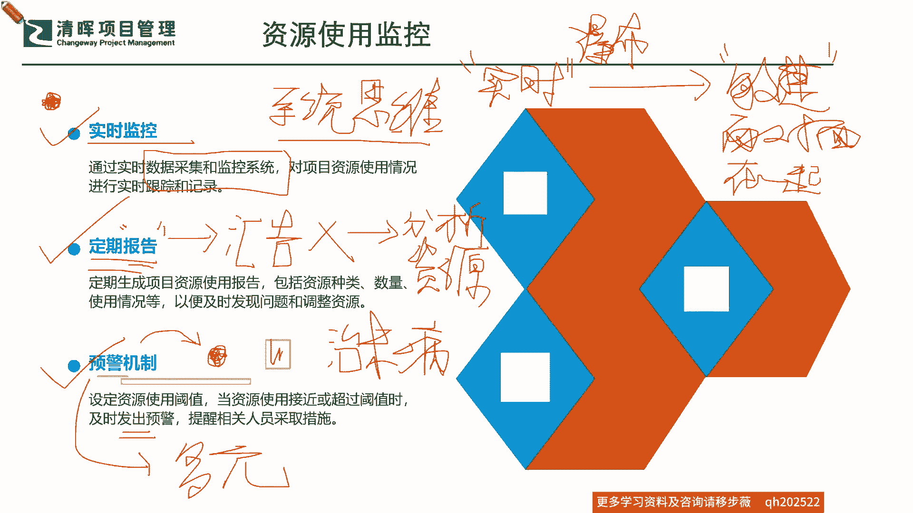
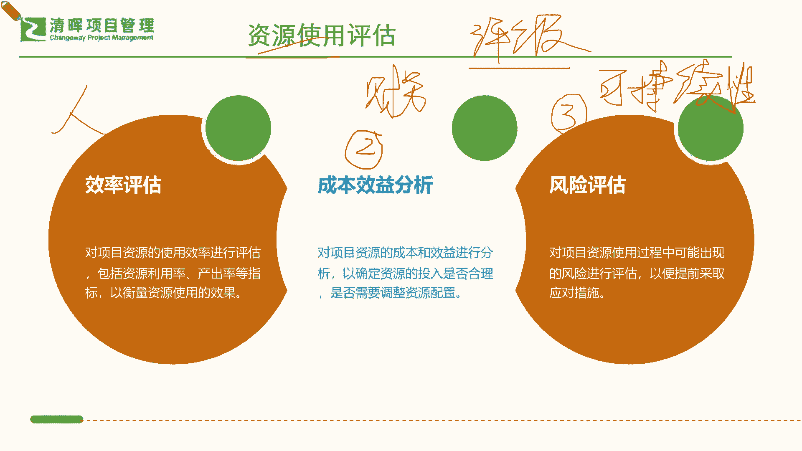

# 如何在资源有限的情况下，快速开展工作 - P4：4、资源使用评估 - 清晖Amy - BV1CEHseWEN8

我们再来看看资源使用的监控对吧啊，我们看起来字儿都特别简单，但是我给你一分析，你是不是又有点不同的思路是吧，那其实在这个资源的使用监控上也是一样的啊，我们都知道的监控吗，你无所谓。

就是要不然就时时观察着他是吧，有没有什么异常，再来就是什么定期打个小报告是吧，汇报一下再来，实在不行了，我比较忙，能不能提前给我亮个红灯，提醒我一下是吧，来预警一下，那么其实在这样的一个情况之下。

大家能够get到的资源使用的监控，他对pm的要求是有什么样的一个晋级的要求呢，首先第一个我想请问大家啊，请问大家这几个字大家都认识，也都能理解它的字面意思，想落地的话，项目经理要做什么啊。

如果你想把这几个字给它做落实了对吧，我也知道这么监控，那那怎么怎么做落实嘛对吧，你要想去把它推动落地的话，项目经理必须要学会什么样的能力，第一个先跟大家总结一下，简单总结一下，你就能get到道理。

虽然懂，但依然过不好，这一生的一个尴尬点是在哪里，字面光看得懂是没有用的啊，你得了解它背后的真正的那个能力要求在哪，我们需要补足什么，首先第一个实时监控，实时监控，需要项目经理要做什么样的事才能达成呢。

第一个啊一定要有系统的建设能力，系统思维什么意思，你光靠说大家请把你们的这个项目管理数据啊，给我通过邮件汇报上来啊，通过报表填给我们，结果一收集上来，一打开一看，你差点这个气吐血。

为什么各自填各自的里面的这个数字啊，这个错的错啊，不完整的不完整啊，这个离谱的离谱是吧，你完全没有办法基于大家的这种什么，这种实时的状况，来去进行这种有效的决策和判断是吧。

所以这种形式的监控就是无效的监控是吧，你别让人家给你写那个周报了是吧，我们之前就讲了，不要写周报，你这个在第二个点啊，我等会跟大家讲啊，定期报告这个东西，它也不是说让你写个周报啊这么简单。

所以在这里面我想跟大家去说的一点啊，务必一定要搞清楚啊，我们在所有的这么一个情形之下啊，我们必须要有这个系统思维，就是你要知道你必须什么叫系统思维，我再多问一个，大家都知道这个什么系统思维。

那系统思维就是要360度，我都要考虑到是吧，那也就是说这实时的嘛对吧，你必须要有一个实时性，但是实时你想去实时的去拿这个数据难不难，当然难了，人家边做还能边给你统计吗，如果如果暂时。

一个这个公司还没有上系统的时候，那怎么办，那怎么办，那其实这个事实啊，大家不妨去这么来了解啊，我们其实做一个思维的转变，你就能没有系统，也能做到实施什么思维啊，我这里暂且啊。

暂且我现在把这个从我们的传统型的，叫瀑布型的项目管理啊，瀑布就是123456789十，做完了给你一个东西是吧啊，那你监控呢就是一条线性linear的，这种去监控是吧，那我们把它变成现在这种敏捷的思路。

敏捷的思路敏捷什么思路好回忆一下啊，面对面，在一起是吧，在一起还要干嘛，还要有个wr room是吧，啥叫WARROOM，就是你找一间屋子，大家坐在一起，把那个白板上面都画上。

你的一些关键的一个交付指标是吧，这就是一个敏捷项目管理，的一个非常重要的理念，你们每天都早上开10分钟的一个什么每日例会，这其实也是实时的一个落地啊，是不是啊，能理解吗。

你不要去找借口说我们公司没有什么什么系统，我们没办法实施改变思维是吧，改变管理思维，你也能去做到事实是吧，所以可能在这个当中，当然如果你们公司已经上了一定的这样的，一个智能的系统，能去第一时间收集。

第一时间去实时的把这个数据，还能准确地要求大家填完整是吧，还能给你一些预测，那简直完美了是吧，但是我们更多的情况之下，咱们如果还没走到特别完美的那步，怎么办呢，那其实就是用敏捷这个思路来管理就可以了。

就能做到实时啦，就能做到系统思维，为什么，因为敏捷是要结果的，他是要快速有一个闭环的结果，你如果不是一个系统思维，你交付不了结果的，你只能交付过程能理解啊，所以各位同学，如果你们能够理解并且听明白的话。

你就知道，其实我们以往没有把这个事儿落实得，非常有效率，并不一定全赖我们公司不肯花钱上系统是吧，跟我们的管理思路也有关系啊，所以这是一个，那我们知道了实时监控，我们再来看看这个刚才说的第二个叫定期报告。

定期报告这里面就提到大家特别爱用，说我写个周报，写个月报，写个甚至写一个季度的一个汇报是吧，这个肯定多多少少，各个公司还是需要有这么一个总结的，但是呢现在这个报告啊，它更多是需要来干嘛的，请注意啊。

这个报告不是为了汇报的啊，我我我再把它这个这个一，一般之前都会习惯上，把这个周报当作给老板的一个，什么绩效报告是吧，就是让老板知道我干了多少多少活啊，多少多少成绩是吧啊，以彰显我的这个工作成绩对吧。

但是实际上现在不是这个汇报了，而是一个什么你的一个分析报告，分析啥呢，就是分析你的一个基因问题，分析你的一个资源的若干的维度的问题啊，什么问题呢，比如说刚才我们就介绍了你从哪里获取呀对吧，类型啊是吧。

你应该怎么样去有效地进行这样的一些，这个分配呀是吧，你怎么样去进行问题的一些解决呀是吧，这个汇报定期报告，就是来报告，你分析资源和解决资源问题的这么一个过程啊，所以这是第二个监控，一定要有结论。

非常具体的去把这个事情要讲出来是吧，第三个呢其实就是我们讲的warning啊，又红灯啊，亮红豆子啦，那我们讲的预警机制，预警机制是个什么机制啊，其实说白一点啊，这里当我们发现了我们这个工。

这个工作的过程当中，资源出现问题的时候，这个时候就已经是什么了，已经是过去式了，就是你资源已经产生问题了，对不对啊，已经产生问题了，所以我们并不是通过预警机制来，来发现那个已经红灯的地方是吧。

不是而是要干嘛，请问各位啊，而是要干嘛，预警机制是来去什么，发现黄灯的那个地方是吧，发现黄灯的地方啊，发现这个黄灯的地方，所以我请各位务必要搞清楚啊，我们预警机只是为了看还没有被发现的，那个问题。

不是已经发生的问题，是还没有被发现问题，但他已经什么，就像我们讲这个基因嘛，它孕育一段时间，那你要不去好好的作息不规律，它又衍生出新的病来了是吧，你要有一个就是我们在这样子来讲，我们在中医院啊。

我们就以人体这个这个举例到底了是吧，然后我们在中医院有一个科室啊，这一般的这个各个城市的中医医院啊，就我们的这个是吧啊，这个科室还经常挂号的人特别多呢，是吧啊，为什么大家从名字上就知道了，还没生病呢。

先给你治来了是吧，其实预警机制是干这个事情的，其实如果你知道他是来干这个事情，你就不会仅仅是让他来提醒你，哪里有问题，提醒你，哪里有问题是哪里，哪里有问题，在这里红灯就知道了。

第一步实时监控你就知道红灯了，对不对，不要搞错位置，好多地方好多这个我们的这个这个公司，咱们的团队的这个pm就都是通过预警来去看，红豆豆，不是这样的，你看预警机制，你是看这些黄色的，它即将形成问题。

但还没有形成一个真正问题的时候，这个时候你就要去进行这样的一个预警了，比如说他发现他哪些资源，比如说情绪哈，当然情绪很难监控，是不是啊啊，但是我们现在也通过一些人脸识别，通过他的一些工作时间。

你看现在有很多公司通过，就是时时在办公室里面扫人脸，是不是啊，扫人脸他就会发现这个人离开工位多久啊，比如说上洗手间多久去去这个去打杯水，去倒杯咖啡多久，你是不是有这个消极怠工的一些可能性，是不是啊。

有没有迟到早退，他来分析你的一些这种这种工作积极性是吧，其实都是有他的办法在搜集这些，那我们这个治未病的这个预警机制，其实它更需要干嘛，你怎么样才能去识别到真正那个有问题的，那个那个黄色的豆子啊。

去发出预警啊，它更是要考虑多元的因素的，所以我再次提醒各位呃，这个项目经理啊，你看看啊，你通过管理这个基因，你说你这个资源哎呀不好管是吧，资源要么不匹配，要么有限，要么就是就是老板整天要调动来调动去。

不停地变啊，其实更多的挑战不仅仅是外部的变化，你看看你自己的这个挑战，对项目经理这个挑战多么的什么综合，你不仅要了解你自己这个多元还要干嘛，就简单简单来讲，实时监控就了解你自己的健康状况，定期汇报。

就是分析你自己的这种实时的产生的，一些问题和一些情况是吧，他的根音，那么预警就是你要不仅看到你自己的问题，你还要去横向对比一下，比如说你像小孩子经常去体检的时候，人家就会横向对比一下。

说你这个你家孩子11岁长得这么高这么重，然后这个近视眼这么这么这么这么这么个情况，跟同期的孩子来比，你是不是有点落后啦，发育是不是有些问题啊，你是不是要提前去规划一下，比如说你给他一些干预啊是吧。

你其实都会了解到，你还得看到别人是吧，看到同期，其实你这个预警机制就需要去看到你的周围，看到其他的多元的情形之下，大家可能会在现行条件之下，会犯的一些可能的错误，或者有一些问题呃，以前的这种诱因啊。

之前没发生过，现在突然有了，你就得什么眼观六路，耳听八方，是不是啊，所以你看其实对项目经理这个要求挺高的是吧，所以我们先不要着急去抱怨这个公司给的，这个什么多么多么怎么样啊。

我们先把自己的这个什么软技能和硬实力，给他提起来，你才能真正把这个基因给它扎稳了是吧，好那么我们知道这个既资源的使用监控，我们再来看看，我们进行这样的一个综合评估的时候，也就是我们前面做了那么多工作。

我们去做了那么多分析，做那么多的一些落地。

那我们接着来看看，我们从哪些地方能去，给我们的这个整体的一个健康状况，项目进展状况，进行一个这个因素的一个评级呢，啊，我们今天现在特别行的一个一个一个词，叫叫评级啊，评级评级就是我们的一个啥。

就是你要给你的健康转打几分，就经常有一些同学，比如说你这个自己在朋友圈测一测，比如说30岁的人，你发现体检完，那这个测完之后一些现象，你你有一个60岁的身体，是不是。

甚至可能有一些这个这个稍微年上点年龄的人，结果一测呢，这个结果身体年龄非常年轻是吧，其实真正的这个资源使用的评估，他也一定是需要有一个科学的评级体系，来看到真实的现象，比如说这里面借也化繁为简啊。

化繁为简，我们来看看必须要去被评估到的几个点，能拿分的项在哪里，第一个呢就是我们的效率了，资源的效率，也就是说你资源效率，你的什么啊，人机比产出率，人均的一个这个这个这个效率是吧。

啊就是我今天雇了几个人，你到底产生了多小的一个这个这个营收是吧，人均一下是不是我能养得起，这个利润率还足够是吧，人均效率高不高，人头效率高不高等等，其实都有很多粗估和细估的方法。

但是首当其冲是要看效率的，也就是说不仅仅是他能够去做到，而且是以多快的速度做到，以多么好的质量去做到，这点就非常非常的重要，因为我们最担心的就是什么，以什么长周期，以低水平的质量去交付这个问题的时候。

它就会造成额外的一些什么资源的浪费，其实隐性的东西我们最难去侦测，侦测到的时候，你在这样的情形之下，它就会变成一个什么浪费是吧，好，那么第一个首先要看效率，那第二个看什么，看我们的成本效益分析。

这个成本效益分析来分析啥呢，就是对我们的项目资源的一个成本和效益，也就是说你投入这么多资源，你产生了这样的一个结果，他是不是合理投入了几个院士，结果做了一个东西，可能跟对方这个派两个程序员出来的东西。

没什么差别是吧，那你是不是要考虑到他的一个合理性资源，合理有效利用它的成本效益是不是合理，这个如果说效率评估，他还是站在人和资源的角度上去评估，那么成本效益，就完全是站在财务的视角来看事情。

因为我们所有的最终都会反映在我们，真金白银上面是吧，真金白银上面，所以我们在看到这样的一个情形的时候，我们就知道我们从财务上成本效益分析，我们也需要去调整和评估，我们资源的一个合理配置。

那么再来要看什么，我这里面啊，第三点，大家看到风险评估，风险评估它是啥，其实说白一点，现在我们的这么多的什么又是国际标准，又是国内的国标是吧，其实都是在干嘛呀，定期的派第三方集合。

去企业和公司进行外审是吧，我们企业自己也有内审部，不断地进行内审啊，再加上外审，这其实都在评估什么风险的一个评估，其实风险评估主要是看什么，如果我们说效率是看人财务啊，成本效益分析是看它财务价值。

其实风险评估是看什么，就是看资源的可持续性啊，这才是底层逻辑啊，也就是说你这个前面看起来做的还可以吧，这些人配合的是吧，团队成员，那么我就要看看你的这个整个的一个资源的一，个使用和搭配分配。

你是不是能够一直只保持这样的一个，好的人头效率，是不是能够一直产生这样的一个，财务的好的成本效益，那是不是能够一直这样子持续，这个好的KPI下去啊，这就是我们的一个可持续性的一个评估是吧。

所以你可以意识到啊，之前也有同学在问啊，因为前面有一段时间，我们啊这个专门严老师也是啊，我们国内首批PMI的这个风险管理，专业人士认证的，我们第一批种子的这个老师啊，那我们在进行这个那个叫R啊。

嗯这个MP啊，也就是我们的这个风险PMI的RMP啊，也会把它普及开来，那么其实这个为什么又在推行这个风险管理，专业人士认证呢，其实这个部分呢，他就是来培养我们的项目管理人员的。

一个可持续性的这个这个管理的一个能力，也就是说你就简而言之，你做一次好事啊，带一个成功的项目难不难，也许也挺难啊，但是你带成功了，我们给你绩效打A是吧，但是如果让你一辈子都是什么做好事，让你一一直下去。

都能带出来非常成功的项目，这就不是一个仅仅凭运气评团队成员好不好，评环境好不好的问题了，而是什么，你的个人的一个真真扎实干的一个能力，你能不能把你好的经验，这个最佳实践。

能够可持续性的把它什么这个延展下去，就是一辈子做好事是吧哈，一辈子都都被评为绩效A是吧，所以这是一个很难的事情啊。

