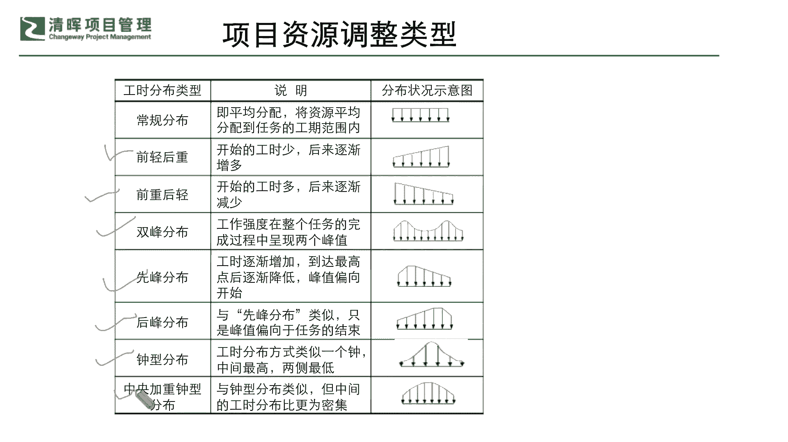

# 如何在资源有限的情况下，快速开展工作 - P5：5、资源调整策略 - 清晖Amy - BV1CEHseWEN8

返回到我们的项目管理的这个步骤当中，从我们启动规划啊，执行监控收尾这五个过程当中，大家都能清楚啊，我们的资源管理是贯彻始终的，我们的资源管理，因为它是基因嘛是吧，从一开始它就应该是一个什么健康的。

一个什么baby是吧，我们要一个健康的一个成功的产品是吧，我们的资源管理他从一开始从一个想法，从一个idea是吧，从这个立项启动就应该被规划在里面是吧，你要去想清楚你到底要什么样的一些什么。

这个这个我们的一些资源的一些部署，那么我们有了这样的一个部分的时候，我们是否能够进一步搞清楚，在这个当中还有一个非常非常关键的点，就是我们要做好我们项目的一个什么，监管和沟通。

这个就是的的确确就是特别重要的一个，我们刚才说的软实力的部分就是软技能啊，在这里也特别再带大家去回顾一下，你即便你的资源从一开始就发生了问题，也必须从一开始就进行一些，正确的一个调整是吧。

正确的一些调整和你的一些规划，也就是说你没有办法啊，大家说那个三边啊边做边看边调整不可以啊，所以我们从一开始你在启动这个项目，在进行这个项目的一些早期规划的时候，我们就应该去做到这部分的一个这个落地。

和我们底层逻辑的一个梳理，所以我们的资源基因是贯穿在自始至终的，这么一个重要的环节考量里面的。

那么同样我们在资源的整体的一个微调，调整的策略上，我们也会去考虑到我们比较务实的啊，如果一旦发生了这样的一个呃这个问题啊，我们也有这个解决问题的思路和这个模型啦，那我们就有问题解决问题是吧啊。

有框架调整的，我们就需要解决框架调整，所以在这里呢，我们就可以从我们的资源调整策略上啊，来去分清楚哪些是属于解决问题，哪些是解决框架的啊，刚才跟大家铺垫那么多，大家应该分得清楚这两个层级的问题。

所以我们先暂时先来看一看啊，这个弹性资源，弹性资源计划，这是调整我们的资源的问题，还是调整我们的资源的框架呢，啊我相信大家都一定清楚啊，这就是就是啥，这就是改框架。

就是原来想想什么想做个A产品做调整一下，不对不对，这个这个资源做不了那个A，我想想再搞个B是吧，只能生出B，那我们在就像我们在这个就孕育孕育这个宝宝，就是很多就在进行人工干涉的时候。

那你就需要比如说我想要一个男孩子啊，我需要去把他这个啊所有的这个这个呃基因啊，所有的这个这个呃，去把它把它能够充分试管出来，一个这个正确的一个，这个这个想要的一个这个这个性别啊。

才去让它继续发育是吧等等，那其实项目也是一样啊，你其实在这个根据你市场需求，它是一天瞬息万变的，他有可能今天想要A，明天想要B后天想要C是吧，那你根据这样的一个情况去弹性调整，你的资源计划。

它这个是属于你的一个什么结构面的调整，结构面的调整，就必须要根据我们刚才讲的那个，结构的系统思维啊，这种整个的一个这个监控啊，还有你的一些这种管理思维的转变啊是吧，这些就是比较综综合和多元化。

需要去考量的一个部分了是吧，不能单一去想，不能单一去想，那么第二个呢叫资源的替换，资源的替换，这个就是干嘛啦，这个就是来解决资源的问题的，它就是点对点解决问题的，所以你资源调整它有既有结构化的问题。

也有具体的点对点的问题的调整，所以自己一定要分清楚，这几个不同的层级和不同时间点，要采取的一些这种措施，哪个最有效率是吧，所以你在遇到一些结构化的问题，结构面出现的问题调整的时候。

你仅仅去替换资源是不足以解决问题的是吧，不足以解决问题的，就像我们之前讲的一个这个头痛医头，脚痛医脚不行对吧，因为有可能是你的整体的一个，什么气血两虚是吧，他就需要去给你整体要调养是吧。

所以可能我们讲的有些时候，你出现了一些这种这种非常急促的一些硬伤，比如说这里就是规格不合格了，我必须要把它变合格，那就像我们这这个身上哪一块被撞了一个口子，你必须要进行消毒包扎是吧，你要尽让它长好了。

它才不会去影响到其他的器官，如果你没有处理好，有可能它就会化脓感染，会影响其他的地方是吧，所以资源替换它其实就是一个问题，点对点的一个解决好，那这是我们第二个调整的一个一个策略。

那么第三个呢就是资源的扩充和缩减，请问大家这个属于结构化的问题，还是属于具体的问题啊，大家来思考一下，你的资源扩充与缩减是属于结构化的问题，还是这种比较具体的点对点的问题啊，啊各位同学。

你认为这个说我想要多去要点资源，和我现在发现哎我用不到这么多资源，我想缩成本，我能不能给把这个资源排出去一点是吧啊，挪给其他的团队啊，我现在想让他们来承担这些费用，我不想承担了是吧。

那这种情况是属于结构化的问题，还是非常具体的点对点的问题呢，啊我相信咱们的很多的项目经理啊，资深的项目经理，你一定会非常非常决绝的哈，毫不犹豫地讲，资源的增补和删减，一定是个什么结构化的问题是吧。

你一定会通盘去考虑对吧，才是才能确保你的项目能够顺利的进行是吧，顺利的进行，所以可能在这样的一个过程当中，大家就是要分清楚，其实我们永远发生的一些项目当中的问题，它有可能既有什么组织层面的。

也有执行层面的，既有结构化的战略方面的，也有我们的执行的问题点方面的，它都是错综复杂交交织在一起，但是我们解决问题的时候，不能胡子眉毛一把抓是吧，所以可能在这个部分，我们就需要请大家。

特别要关注到你自己的一些细项。

那么在这里呢啊我也在分享一些细项，比如说我们在进行这个项目资源的管理，因素设定的时候啊，我们大家可能在看到我们的属性名称啊，看到我们的这个属性的说明啊，举例的时候，我们在进行这样的一个资源的设定。

最早期设定的时候，我们就要非常仔细的去看到，里面的这些什么细节，也就是说这些细节如果没有被界定的清楚，你有可能后续的一些这种什么系统化和结构化，以及你在问题点上的一些解决。

就会出现一些这种问题和无法落地的这种现象，比比如说啊你的资源名称我们都讲了，你的project资源，它虽然不要求你的这个名称必须要唯一，但是从项目实施的角度，你肯定是需要让你的项目名称它可以简便易记。

防重复是吧，也就是说这是最基本的一个流程管理的一个点，但看起来很简单的一些部分，那包含你的加班加班费率是吧，包含你的一些这种这个单位的设定啊，资源类型的一个区分，这其实都是非常关键的。

我们怎么去衡量这个项目资源管理的，因素的一些点，那么有了这些点之后呢，我们也希望大家啊能够比较具体的，当然我在这里不去一一的赘述了哦，我们也需要请大家关注到啊，我们里面所有的这些细项好。

大家可以进一步的能去看到，我们自己本身的一个什么，这种合理性和一些什么啊，不同的这么一个啊帮助性，也就是说在我们所有的这个细项当中。

你的缩写，你的每次使用的成本，甚至你用的一些项目资源的一些编码规则，你的一些代码就是大家有没有发现，其实原本做文件管理做的最好的有一个啊，目前已经这个手机界已经消失的一个巨头，叫诺基亚是吧，诺基亚。

如果大家对他早期的这个项目文档熟悉的话，你会知道，诺基亚在项目文件上做的是异常的系统化是吧，非常非常好，它的文件体系清晰，可追溯性强，具体且明确是吧，就所有的一些license learn啊。

所有的一些这种组织过程资产，他都非常非常管理的非常的有效率啊，变成了他真正的一些这种什么过程资产是吧，所以其实这种资产呢，在我们项目管理的这个具体的实操层面，都是对我们的一些什么软硬技能的一个考核。

那我们在资源这个项目资源的一个因素设定上，其实也是有很多细项需要去这个界定的，比如说那我们可以看到啊，我们的这个使用成本啊，我们的一些这种成本累算你的比例，这些如果大家没有经过系统化的一个学习啊。

你不了解在这个当中，你是怎么去进行这样的一个资源的，它的一个单元的设定，进行资源的一些区分，进行它的一些量化的时候，你有可能就会出现什么这种资源的一个，排配的不合理。

甚至可能在量化的时候出现一些不匹配啊，不正确的这么一些现象，那么有了这样的一些前车之鉴，我们就必须要去花时间，在我们的项目资源管理的细项上，去做一定的这个部署和学习，来去做这样的一个落地和区分。

那么有了这些部分。

我们还需要去明确，我们有很多这种项目资源的，这种常见的调整类型，那调整类型呢其实比较常规的情况之下，我们都是希望大家可以非常平均的，有节奏的可以去进行这样的一个什么啊。

全流程的这么一个我们的一个资源的一个排布，但实际上我们会发现，要么就会发现我们也许有时候前轻后重是吧，开始的公式少，后面公式越来越多，还有前重后轻，开始的时候公式多，后面越来越少是吧。

那么还有有可能会呈现U型的双峰分布，或者是刚开始的时候啊，逐渐增加，到达最高点之后又逐渐降低是吧，这种先锋的一个分布以及后锋的分布，中型分布和中央加重的一个中型分布等等，那么我们不同的类型。

都会对我们有一个什么具体的一个措施。

