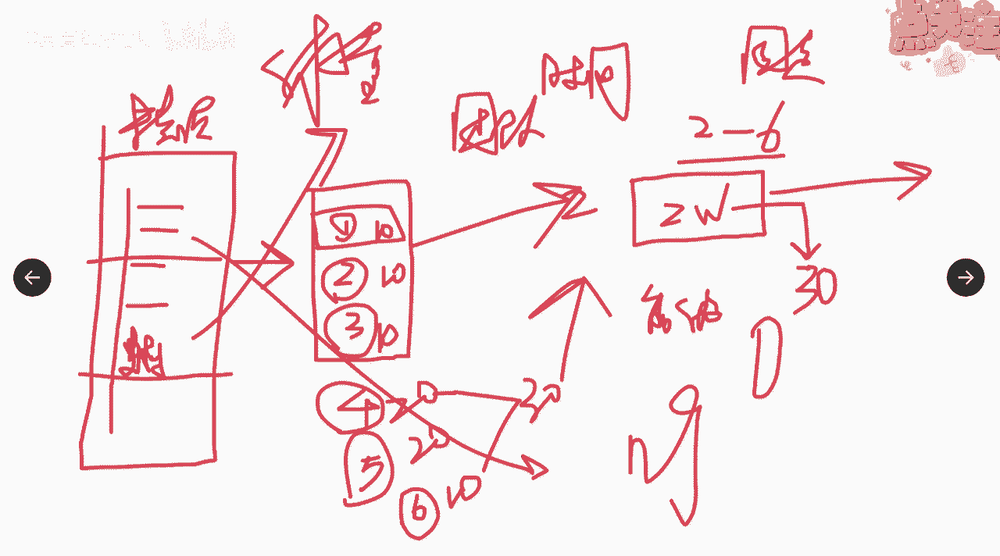
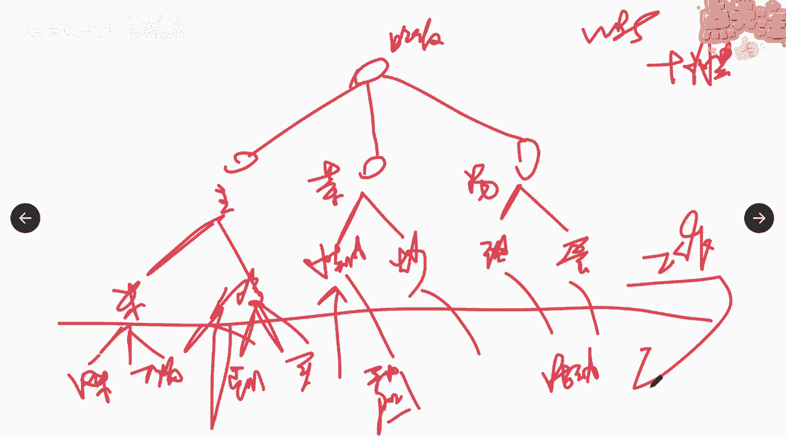

# 如何定义项目活动 - P1 - 项目管理陈老师 - BV1e841137G2

好的，那么完成了我们的这个进度管理计划之后呢，我们就马上进入到第二个过程，叫定义活动啊，这个活动开始就比较重要了，它也属于规划过程组，那么定义活动这个过程呢，它的作用是什么呢，它是将w bs分解为活动。

作为对项目进行估算，进度规划，执行监督和控制的基础，我们再来回顾一下工作包，w bs是最底层的可交付成果，我们上节课学过了，那么在这个过程当中，在定义活动的这个过程当中呢。

我们要把工作包进行进一步的分解，分解为更小的组成部分，也就是我们所说的活动，代表着未完成工作包所需要投入的工作，我们来看啊。

wbs，我们说把一个可交付，分解成为易于管理的小的部分对吧，分解成几个小的部分啊，我们如果说之前有举那个请客吃饭的例子，来说是吧，吃饭啊，我们还是吃饭对吧，然后呢我们这边分为什么呀，主食了。

是不是还有菜，还有什么呀，汤啊，分为这三个好主食呢，我分为米米饭，馒头是吧，菜呢我就安排了两个，一荤一素是吧，一个水煮肉，水煮肉，一个炒青菜好吧，炒青菜汤呢我就只有一只，也有两个吧，我们说一个甜汤啊。

一个什么啊，西红柿蛋汤啊，好分解完了，我们整个这个就是我们的什么呀范围，你这餐饭里面所有的菜已经全部在这边了，我们管这个叫w bs是吧，然后呢我们还配了一个w bs的词典，对不对啊。

来描述里面的这个w bs这个米饭是怎么样的，米饭好，这一步呢做到这一步的时候呢，我们是怎么样啊，是完成了范围，那么在定义活动里面呢，来我们继续往看哦，这个项目需要这么多这六样的可交付物。

加起来就能得到我们上面的好，接下来我们就要分解了，要得到米饭，我们应该做哪些工作啊，第一我们可以可以有几种方式对吧，可以自己自己自己煮，自己煮，你可以淘米是吧，完了下锅哈哈就煮饭是吧。

然后呢馒头呢要怎么做才能得到啊，而且馒头我不大会会做馒头，我就直接去买吧啊，外购好，我在这里面我就要去外出去买这个馒头，那走要几步啊，我首先要出门是吧，然后呢去买，然后完了之后带回来啊。

然后接下来这几这几个菜啊，比如说这个水煮肉片，我要得到的要要自己做，那我要先去买肉，对不对啊，完了之后回来还要加工啊，还要这个这个开始是什么啊，我不大会做菜啊，继续步骤啊，然后呢完了之后呢。

呃呃这个这个起火起起锅下油是吧，炒放调味料啊等等等等一系列的活动啊，然后炒菜炒青菜也是啊，这个里面一样的道理我就不继续展开了啊，然后呢这些活动通通的规划完之后呢，我们就知道做完了这个事儿。

我就能得到这个东西，是不是这个道理啊，我做完了买肉切肉洗肉，下锅翻炒啊，然后呢加调味料啊，出锅装盘，这些活动做完我就得到了我的这盘怎么样，水煮肉就得到了，是不是这个道理啊，所以我们说在这个过程当中。

上面这个呢叫工作包，我们上节课讲过，这里面的工作包指的是可交付物，它不是活动，真正的活动呢就是在我们这个领域里面的，真正定义的就叫活动，要做的事就叫活动啊。

所以这个概念大家先把它理解清楚好，所以呢这里面说了，它代表着活动，意味着呢，我们要为完成工作包所需的工作投入啊，然后这个活动一定是要分解清楚是吧，那它的一个输入输出，我们可以来看一下，首先输入什么呀。

我刚才说了，一定要输入范围基准，对不对，范围基准是肯定要输入的，因为范围基准里面有了有什么呀，有w bs，有可交付成果，有制约因素和假设条件啊，比如说刚才说的那个水煮牛肉，人家说要微辣。

它就是一个职业因素对吧，你要考虑到啊，所以这个范围基准，一定是要作为一个最重要的一个输入，输入在里面，那其他的输入呢还包括什么呀，还要输入哪些啊，还包括我们的事业环境因素跟组织过程资产，对不对。

你要考虑一下我在分解的时候，我们这个团队啊，它的环境是怎么样的，比如说你厨房完不完整啊对吧，如果连家里都没有厨房，你说你要做这些菜，这可是你的事业环境因素，你是不是就要怎么样啊，就要全部外面打包是吧。

那好那个组织过程资产呢，假如说你们家有个非常会做饭的啊，很厉害的，那我可以，这个是不是会影响到你对工作的分解啊，这什么菜我都不需要外面打包啊，叫外卖我自己就可以搞定。

那么这里面的工具跟技术呢就是叫分解啊，就是把项目范围和项目可交付物，逐步的划分为更小的，更便于管理的组成部分，把这个活动一项一项的列出来，那么每一个工作包都要分解成活动，哪怕这个工作包。

比如说你你要的这里面有有其中一个东西啊，你说是外购啊，从外面买，那这就叫涉及到了什么呀，涉及到了我们的采购管理，对不对，采购管理，采购管理呢，怎么采购，对方怎么完成，我们可以把它当成一个什么呀。

规划包啊，桂花包，因为这个不是我们组织自己做的，那油采购方把这个规划包再去分解啊，你是怎么样给我得到这个东西的是吧，那么以便通过这些活动来完成，相应的可交付成果啊，这个是活动的一个意义。

然后呢应该注意的一点，要让团队成员那参与分解的过程，有助于得到更好的更准确的结果，大家记不记得我一开始在讲项目经理的时候，有讲过一句话，项目经理呢在领导面前是专家，在专家面前是领导啊。

所以呢在分解的这个过程当中，定义活动的过程当中呢，一定要调动整个团队的人，大家来参与啊，团队的人大家来参与，而不是项目经理，你自己一个人啊，然后就在那边分解说哎这个东西应该怎么做，应该怎么做啊。

不要忘了你领导的是一群专家呀，他们在各个领域都是行家里手啊，都是他们是最专业的，所以要充分听他们的意见啊，让他们来参与整个分解的过程，听他们的意见诶，你觉得这个可教父要怎么来生产出来啊。

比如说我们在说信息化项目当中对吧，客户提了一个要求，要实现某种功能，实现某种功能，用户只会说啊，这里面我要实现这种功能，那么怎么来实现，要怎么去做，这个时候你就要请教你项目团队里面的专家，跟他讲。

我要做哪几步能够得到这个功能啊，第一步我要怎么架构，第二步是吧，逻辑的关系是怎么样的，第三步啊，我要怎么样才取什么样的一个编码，跟跟跟跟跟这个代码啊，所以你要问专家，他才能告诉你怎么样得到这个东西啊。

就好比你说要把大象装冰箱是吧，总共分几步是吧啊，你自己分，你可能就是分啊，把冰箱门打开，第二把大象放进去，第三啊我们把冰箱门关上对吧，这是项目经理，如果你不是这行业的专家，你就这么分。

那如果你这个行业的专家，你就会考虑是吧，是第一步我要上哪去找这么大的冰箱啊，第二呢我要考虑我怎么把大象掉进去，然后自己走进去还是怎么样啊，第三把怎么怎么把大象的这个门关上啊，把冰箱门关上是吧。

专家会去考虑更多的细节啊，所以要让团队成员充分的参与，那么另外一个工具呢叫滚动式规划，这个呢我们之前也说过了，在w b s分解的时候啊，就是说呢对近期要完成的我们做详细规划。

对远期呢要归要完成呢做粗略的远期规划，那么体现的是一种渐进明细，适用于工作包规划包，以及采用瀑布或者是敏捷方法的规划啊，因为在项目的早期阶段呢，信息是不明确的，工作包只能分解到已知的详细的水平。

要随着项目信息的不断的丰富啊，那么我们近期的实现了工作包，就可以即将做的这个事情就比较清楚了啊，因为你一开始，你对远期的东西根本就不知道对吧，比如说你到某个地方去旅游啊，你说当到了那个地方啊。

我们怎么去找吃的，这个时候你如果规划得很细不现实，因为你还没到那个地方是吧，那你就规划说哦，就到了这个地方之后，我们要上街上去找吃的，找好吃的，那等你到了那个地方之后呢，你再来规划诶，这边是我住的地方。

在什么地方，旁边是不是有商业街或是有夜市，那我再来规划我怎么去找好吃的，这就叫滚动式的规划啊，那么这个过程会输出几个清单是吧，第一个清单呢叫活动清单，活动清单就包含了项目所需的全部进度，活动的综合清单。

那当然也要给每个活动呢配置相应的标识，以及呢工作范围的详述啊详述，然后呢用滚动式规划的，这个时候呢，我们要定期的去更新这个活动清单啊，我们说w b s也是一个清单啊，也可以是一个清单。

但是呢里面的每一项东西，我们要做的任务事项啊，活动事项我们要不要列一张清单给他分配id，分配名称，然后呢历史描述啊，负责人是谁，他能得到什么备注什么，实际上活动清单就确保我们在工作的时候。

是能够涵盖我们所要的所有东西，而且这个活动清单会作为下一个过程的输入啊，下一个过程是什么呀，下一个过程是叫做呃确定活动顺序，是不是确定活动顺序，所以这个是详细的一个活动清单。

大家可以理解它就是一张纸质的清单，一个文件，另外一个输出呢叫里程碑清单啊，里程碑清单，什么叫里程碑，里程碑我们按照平时的一个理解啊，通常会说什么呀，通常会说哎某件事情啊具有里程碑的意义。

是不是说明它的意义很重大，意义很重大是吧，具有什么呀，在历史上呢，在整个项目的生命周期当中呢，它是占有非常突出的重要地位，嗯比如说我们说建筑工程封顶啊，封顶它绝对是一个里程碑的清单啊。

绝对是一个里程碑是吧，可以作为一个重要的事件啊，然后呢包括说我们这个信息项目啊，完成了初验嗯，我们也说他客户初步已经验收，绝对是没有问题了，这也是一个里程碑啊，所以他指的就是什么呢。

项目中重要的时点或者是事件，那么里程碑呢可以是强制性的，也可以是选择性的，所谓的强制性就是客户要求，你必须在某个时间点达到某个什么样的，一个一个效果或者一个事件，你必须要做啊，你必须要做这强制性。

那你也可以选择性的啊，比如说我自己来规定，所觉得说某个事情到到了这个程度，他是里程碑啊，那里程碑和活动有相同的结构跟属性，但它不是活动哦，里程碑不是一个活动啊，它可以跟活动有相同的结构跟属性。

但是它不是一个活动，它的持续时间是为零，只代表着一个时间点，也就是从一个状态到另一个状态是吧，比如说我们说这个楼封顶啊，从峰顶到未封顶，它就是一个一个一个一个一个一个节点对吧，它不是一个持续的一个时间。

你说封顶封了这个这个111111个多月，或者封顶封了一天，这不对啊，只有一个时间节点啊，出验包括初验通过是吧，他也只是一个时间节点，一个节点通过与不通过，对方张那么一盖通过了啊，没盖他就是没通过啊。

所以这个里程碑清单大家要理解啊，活动清单跟里程碑清单啊，那当然活动清单里面还包含了活动的属性啊，刚才我们看那个i t t o里面有说到，活动的属性呢，其实就是后面的这些历史描述等等等等等等。

把它全部的说清楚啊，它的标标识以及呢它的这个颈前关系紧后关系，这个我们接下去马上会讲，所以这张活动清单呢在这里，在这个过程里面产生呢，可能只有直到这是吧，直到前面这一版，我们把它标注i，标注id。

把它的名称标注出来，好在这个定义活动这个过程里面，我们仅得到这一部分，接下去我们要对活动清单进行更新，继续完善它里面的内容，那么还会说出另外一个叫变更请求嗯，大家奇怪，为什么在定义活动的过程当中。

会输出变更请求呢，因为大家想一想，我们在这之前呢是拿着基准来确定活动的，是不是没错，然后呢我们基准确定之后，我们将活动细化分解的过程，当中可能会发现原本不属于项目基准的活动，哎，有些活动呢。

诶好像根本不是不是不在项目基准当中啊，那这个时候呢我们就会提变更请求了啊，对变更请求的处理呢，也要通过实施整体变更控制的流程来完成，知道我们在细化分解的时候，更细的分解的时候会发现哎。

有些事不是我们项目该做的，那我们就要提变更请求，对记者进行调整啊，所以这里面也会输出管理计划的更新，包括进度基准和什么呀，成本基准，因为我们说整个的活动的定义，它是也是滚动式规划。

也就是在项目的不同的阶段，那我们可能都要进行滚动式的规划，并不是说在项目的开始，我把活动全部定义下来了，后续我就不再做了，不是的啊，不管在敏捷还是适应性生命周期当中，还是在啊这个预测性生命周期当中。

我们在不同的阶段，都很可能再要重新开展一次，定义活动的这么一个过程啊，所以它会涉及到计划的一个更新，计划的一个更新。

