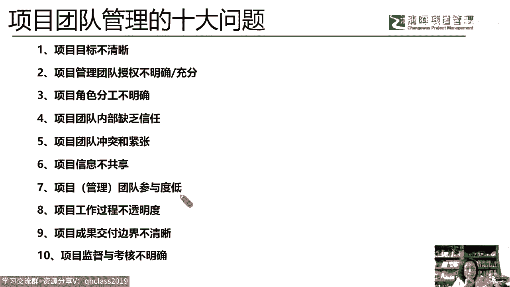
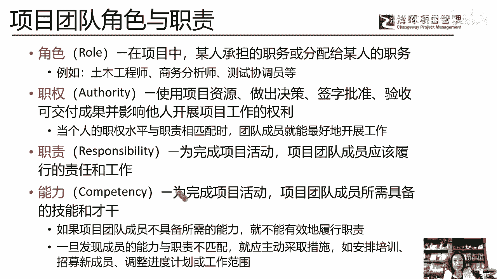
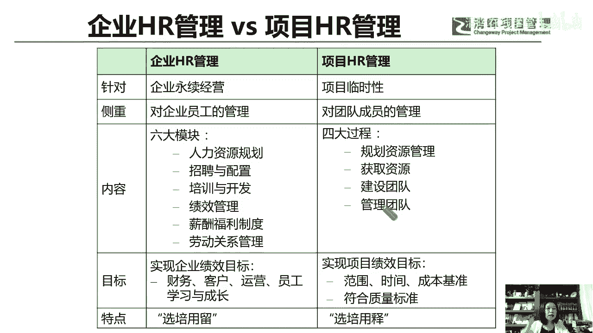
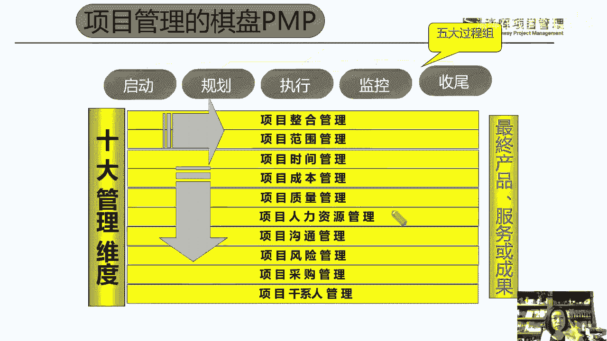
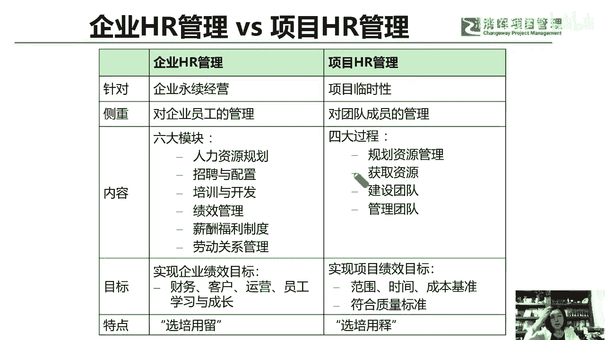
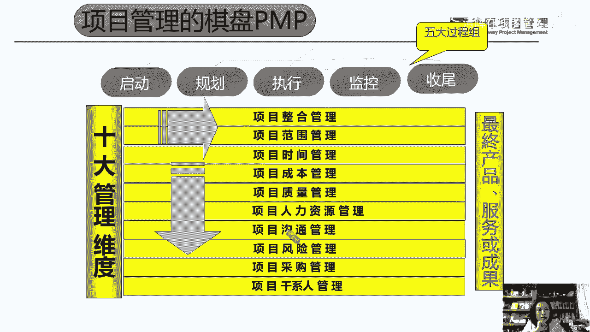
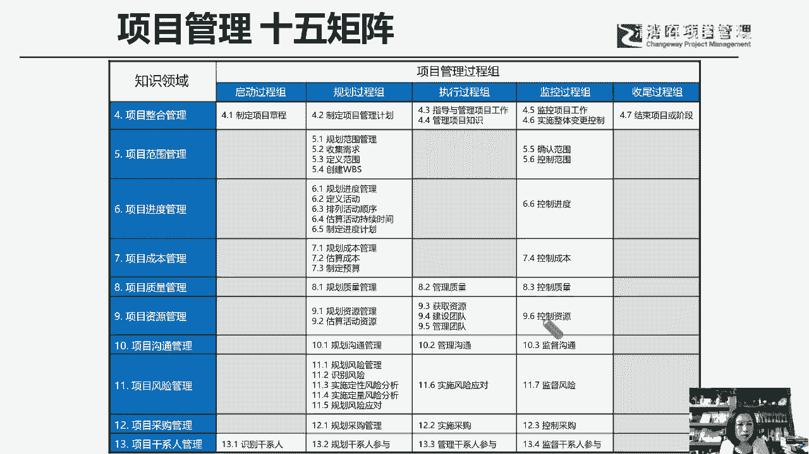

# 如何应用PRINCE2体系的管理方法打造项目管理团队 - P2：2.项目团队管理的十大问题 - 清晖在线学堂 - BV1F14y1d7ST

问题我不知道，大家看看在你们的项目团队管理中，有没有这十大问题，这是我们在为企业做咨询诊断和培训的过程中，唉那么从我们的这个数据库中，从我们的调研资料中抽取出来的，点击率高频的十个问题。

第一项目目标不清晰，有人说目标很清晰呀，嗯因为我们项目比如说有启动啊，有立项啊，对不对，哎我们项目有协议呀，他的目标是很清晰的呀，那么这种清晰是不是smart到了每一个角色，每一个岗位。

当我们去探讨这件事情的时候，这个目标是谁的目标在很多公司都不知道，如果这个项目出了问题的话，去找谁，想一想在你们公司有没有明确出来，这个项目如果出了问题去找谁，有人说老师你先说清楚问题是什么，问题好。

我们先来说一下，如果这个项目进度延误了，责任在谁，成本超支了，责任在谁，唉这个范围交付不好，责任在谁，质量有问题，责任在谁，这个项目亏损了，不盈利，没有价值体现干性人不满意了，这个责任在谁。

所以难道我们的进度成本质量范围，看起来在我们的协议里，在我们的项目立项文件里写的很清楚，但是这是谁的目标，有人说是项目的目标啊，好那是项目的目标，他就写在那个文档里，可是项目是要靠我们的人去交付的。

靠团队及交付的，在非常多的公司，你们的项目目标清晰吗，它不仅应该是数字，是边界，是需求，它还应该是人来承载的，那因为这个目标不清晰，所以我们项目经理就悲催了，大部分的项目经理就会提到了。

说我们最悲催的一个就是项目经理要去背锅了，对吧，唉当项目很成功的时候，不一定给你核算奖金，你还不一定能升职加薪，对不对，但项目失败的时候，有可能你就要去背锅了，所以在大部分的企业当中。

我们存在的问题就是项目的目标不清晰，那第二项目管理团队授权不明确或者说不充分，那实际上嗯很多项目经理都跟我讲到，说是在作为项目经理这个角色当中啊，在作为项目经理的这个角色当中。

我们说呢他对于自己需要哪些权利，承担哪些责任，不是很明确的，公司开了个会，通知了一下，唉老郭你这个项目的负责人也是项目组长，唉，发了个邮件，老郭你是这个项目的经理，爱，仅此而已，那我有哪些权利。

对于我的这种团队资源，我的权利边界在哪里是吧，不知道的唉，甚至项目管理团队应该只是一个人的战斗吗，应该只是项目经理自己的独孤求败吗，不应该呀，对不对，所以我们有管理团队吗，你们的项目中有管理团队吗。

大家告诉我有没有，是不是你一个人在明知偏有虎偏向虎山行呢，好接下来就是项目的角色分工不明确，那项目的角色分工不明确，除了我们说管理角色之外，还有我们的这种工作角色也是不明确的，好。

那团战团队内部缺乏信任，也就是说呢，大家的这种关系，并没有真正的变成有化学反应的团队啊，虽然我们是group，我们是一个组，我们是一个团队，我们是一个team，但是大家实际上可能在现代这种互联网时代下。

有些团队都是没有打过电话的，哎没有听过声音的对吧，为什么呢，有人说开过会啊，开过会可能很多人都是不讲话的，都不知道这个人真正的唉，叫叫托尼的这个老人长什么样是吧，可能写了很多邮件，可能发了很多及时信息。

但并不知道这个人在哪里，而且一旦出现问题的时候，可能就会个人自扫门前雪，甚至不扫门前雪来甩锅对吧，所以我们说团队内部缺乏信任，那还有呢团队出现了冲突和关系紧张，大家不协同，互相不服气。

甚至对于工作边界不明确，好项目信息不共享，那么项目信息的共享机制没有建立起来，然后项目的团队参与度低，因为大部分的组织架构，都像我们刚才说过的一样，是什么，是这种矩阵型组织结构啊，矩阵型组织结构中。

几乎我们的团队成员都是part time的，那么大家对于这个工作的认知度，对于这种工作的这种是不是owner，我是不是这个工作的owner的理解，有没有这种owner的意识，哎并并不强，明显并不明确。

所以我们说呢团队参与度低，甚至这个工作在我所有要交付的事项当中，那么他的优先级也是嗯比较低的啊，好项目工作过程不透明，哎结果呢我们说项目成果的交付边界不清晰，以及项目的监督考核不明确。

所以这十个问题呀真的是态度太常见了，太普遍了，甚至有项目经理还曾经讲过，说老师提起我们项目团队管理的问题，那叫罄竹难书啊，不是你，我不仅是你说的这十个问题，那我们平时总结出来的呢比较高频出现的啊。

那么点击率比较高的是这十个问题，那对于这十个问题，我们有没有一些什么解决方案呢，对吧，那么我们来看一下啊，我们建议的和希望的这个解决方案在哪里好，那么我们来看一个基本的管理原则。

就是在我们的一个项目团队中。

我们要想打造一个高绩效的项目团队啊，那么我们就应该去明确在这个团队中，从管理层到我们的这个什么呢，交付层他都应该有不同的角色，不同的职权，不同的职责，不同的能力，那我想问一下啊，在你们的项目组织结构中。

在我们的偏偏体系中，是不是明确了角色职权职责和能力呢，这个人是我们的项目主管项目经理吗，那么这个人是我们的这个嗯土木工程师唉，软件工程师对不对，那么它有哪些权利，他应该承担什么责任，他为了交付这个角色。

匹配这个权利和这个责任，他应该具备什么能力，在这一点上，在我们的偏僻体系中没有体，现，在我们的现实工作中，也没有给我们体现，那么是不是这些都被模糊了，都靠野蛮生长，唉，都靠自我积累呢。

并不是在这个世界上爱，有一种来自于英国的项目管理体系，他明确订立了项目的管理团队，项目的交付和每一个管理团队中的角色权利，职责和他的能力，甚至在他的计划体系里，在他的这种监督控制体系里头。

在它的交付体系中完全把它一一对应了，他明确地告诉你，为项目的成功负责任的人，不是项目经理，如果有人告诉你这句话，如果有这样一种项目管理的方法和体系，告诉你为项目经理，为项目的成功负责人，不是项目经理。

你会不会松了一口气，你是干什么，作为项目经理，如果你是项目经理，你只要去执行唉管理项目计划就可以了，谁来承担项目失败的责任，项目管理委员会，项目管理委员会虽然是个虚拟组织，虽然是一个我们所说的一群人。

但是他还得拉出一个什么出来，画室的人叫项目主管，在很多公司的这个职级岗位中啊，他会有什么项目主管这个说法啊，他会有这个项目主管这个说法，那么我们说呢这个在P2体系中，它是一个准确的标准的一个岗位啊。

虚拟的啊，它是一个兼职的虚拟的一个岗位，那么我们说呢，呃对于我们的这个嗯偏僻体系中啊，是没有这个体现的，是没有这一项的，但是对于我们的这个啊P2体系会明确出来，他呢承担了这个项目成功的职责。

和他的一个角色啊，和他的一个角色，所以呢我们说呢对于我们的这个朴素体系来说，它给了我们打开了一个新的世界，他帮我们去干什么呢，去评估了一个新的方法，那么我相信大家可能已经开始对他什么，有所感兴趣了啊。

已经有所感兴趣了，那么在这种情况下，我们也希望大家能够去对标，如果你已经考过了pp可以去对标，pp可以去对标，我们来对标我们那这个管理实践，我们的公司爱是怎样的一个定位。

那么pp two动这样一个管理模式是不可以去，你可不可以去借鉴啊，可不可以去借鉴好，我们来看看常规的。

大家一看这个好像还是偏僻的内容啊，我们会有一小部分对标，我们的主体是以prince to体系为准，那么大家呢看到我们所说的这个嗯，项目团队的管理，那么项目团队的管理，属于我们人力资源管理的一部分。

那对于企业来说，做人力资源管理，薪酬绩效对吧，选用预留哎等等，那么对于我们的项目来说呢，大部分情况下也提到的是唉，这个规划我们的资源怎么管，我们怎么去组建团队，建设团队，管理团队。

但是依然不能够解决我们刚才所说的，那十大问题啊，那十大问题。

因为这大部分，这是几乎是全球大部分企业，它的一个常规的管理模式啊。

常规的管理模式，那么这张图有人说我实在不想看到它了。

我会有点看腻了，对吧好，那么在我们的pp体型很快啊，我们pp体系内容并不多，只有这么几张，那么在我们的pp体系当中呢，它有一个模块叫我们的，什么叫我们的这个资源管理I，那么在我们这个资源管理中。

他给出了我们规划资源。

估算资源，组建团队来获取资源，组建团队，建设团队管理团队控制资源，实际上这个呢大部分我们说的这种资源，还属于项目经理向下的这种向下管理，但是我们提到了，就是仅靠项目经理自己的领导力。

哪怕你打造了项目经理的领导力模型，你把他送到各大商学院去学习对吧，唉各大什么企业大学去学习，那么依然靠他一个人，我们说独孤求败，对于这种项目团队的管理，对于项目绩效的交付也是有限的。

