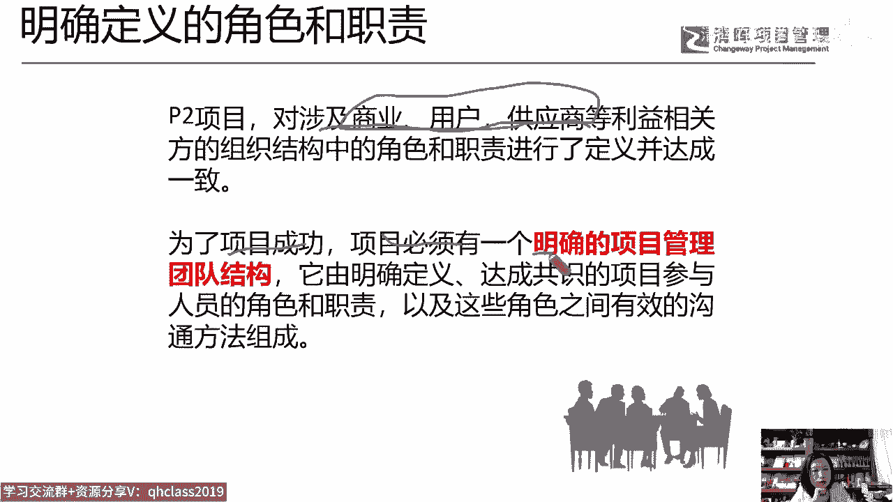
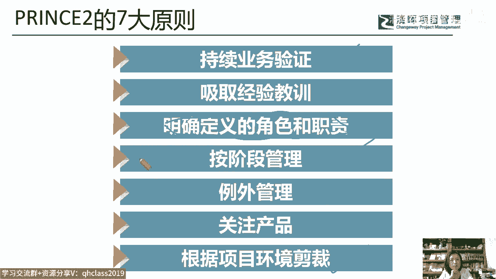
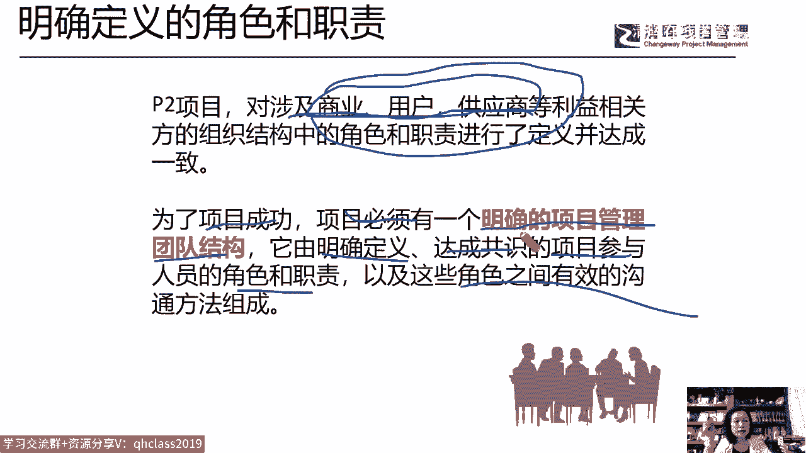
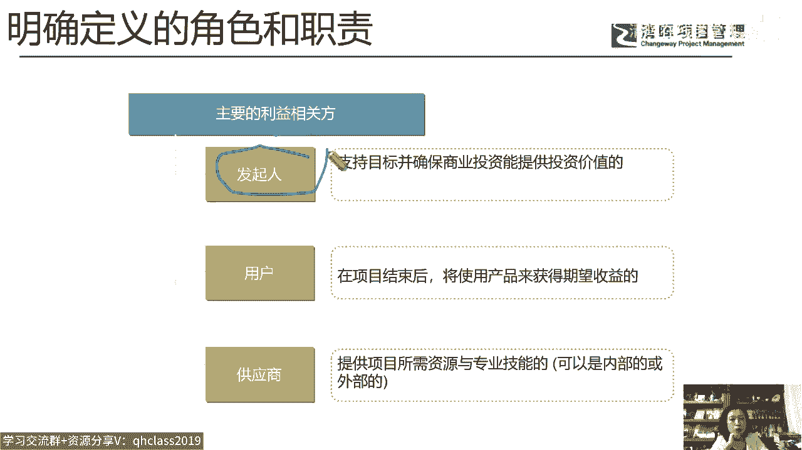
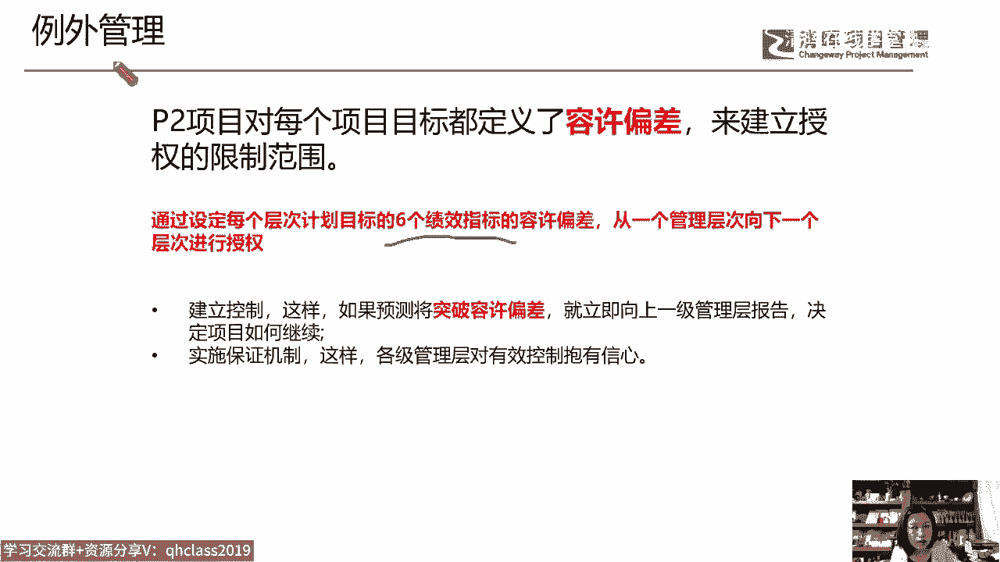
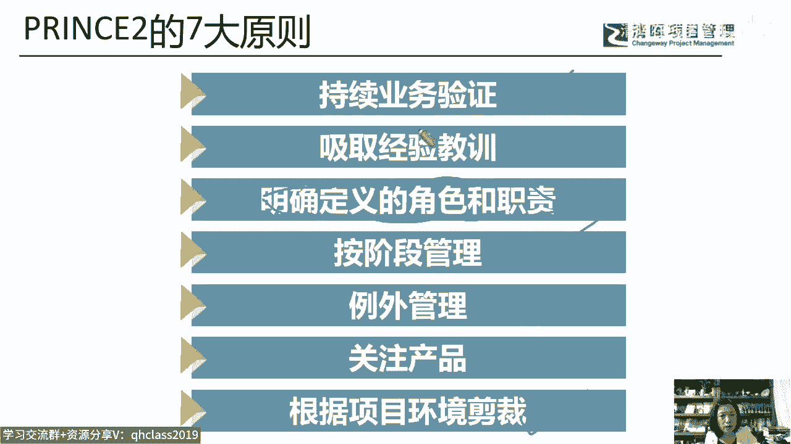
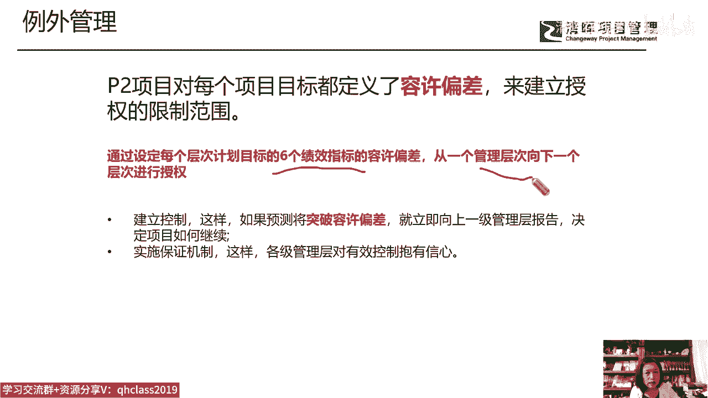
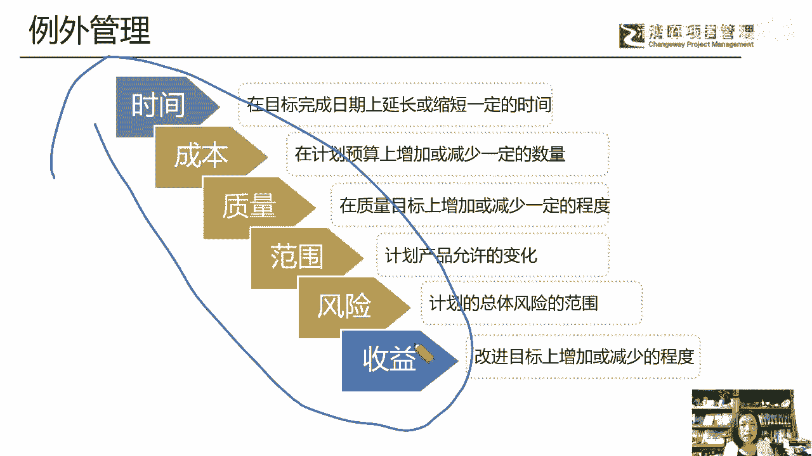
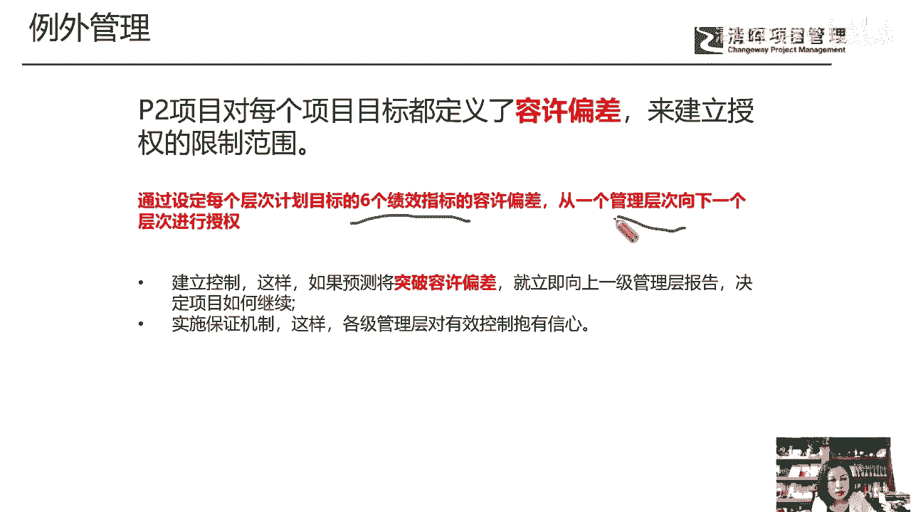
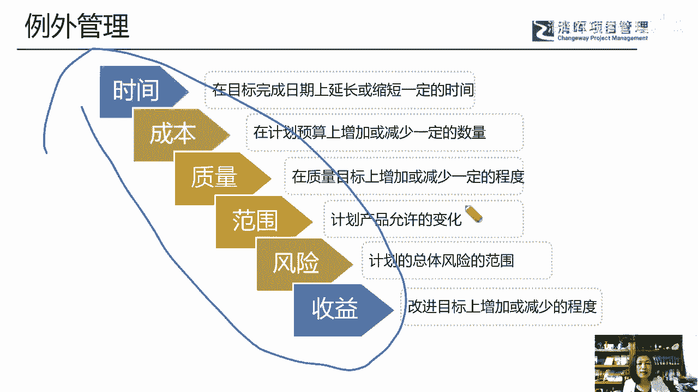

# 如何应用PRINCE2体系的管理方法打造项目管理团队 - P4：4.明确定义的角色和职责 - 清晖在线学堂 - BV1F14y1d7ST

环境中把它叫什么呢，叫我们的p two项目，那么在P2管理项目中呢，它会涉及到他把干系人做了一个，首先做了一个不同的划分啊，这个我在我的pp课程上也经常给大家讲到。

大家就是我们提到stay holder项目干系人，或者说你们更习惯的叫什么项目相关方啊，利益相关方这个说法的时候，在pp体系中它分为内部干系人，外部干系人是不是啊，唉但是在p two体系中。

他把stay holder干系人分成了三大类，一类属于投资方，类似于我们的sponsor，它叫商业干系人，就属于我们这个公司，然后他分了用户类，用户呢又不仅仅是我们的客户，也不仅仅是使用某个产品的人。

他把和使用这个产品的人，和这个用户有密切关系的人，也定义为用户类的干系人，我举一个例子啊，你比如说这个嗯我们有一个to c端的产品对吧，如果这个产品我们要卖给客户，当我把它卖给客户的时候，客户会买它。

买了它，当客户发现这个产品有问题的时候，这是一个什么，这是一个银的茶食啊，这个嗯茶勺就是去就嗯装茶叶的好，那么当用户用它的时候，发现他有问题的时候，唉有困惑的时候，他可能就会给公司反馈。

那这个反馈渠道是什么呢，比如我们的售后人员，比如说我们的400电话对吧，那么用户第一时间有问题，他会找售后，他会打400电话，那在print体系中，他把售后人员和我们的PRIN400电话人员。

也定义为是用户类的干系人，因为他们跟用户的关系非常密切，因为他们特别熟悉用户啊，所以供应商，那么这个供应商就是一个广义供应商了，凡是为我们提供这个呃，内部资源的和外部资源的都叫供应商。

那么他把他做供应商类的干系人，我相信这一点大家可能会觉得很违和，很不习惯，没有关系啊，如果有机会学P图的话呢，那么我们会就这个事来讲，今天我们就先不展开了，那么首先为了服务于这三类干系人。

或者是与这干C3类干系人打交道，那么他说最终是为了项目成功，我们的项目必须有一个明确的项目管。

理的团队结构，那么这就是尊重了刚才所说的这个原则，他一定要有个明确定义的角色职责。

为C3类服务，或者说与这三类安心人打交道，他有明确定义的，达成共识的项目参与人员的角色和职责，以及这些角色职责的沟通方法，爱权利，责任以及他们的能力都是达成共识的好。

那么服务于我们三类主要的相关方，我们的商业发起人，爱我们的用户，我们的供应商。

这是三类啊，好那么同时呢在它的整个管理架构上，我们刚才讲了一个词，就是说在p two，PP体系中没有出现过的一个词啊，叫什么呢，叫例外管理，那么我们在偏僻里可能讲到了项目的什么，计划里头有三大基准。

反时辰范围进度和这个省成本，那么我们也讲到了项目的什么呢，项目的成功标准，I进度成本质量范围，干系人满意度等等，这个不明确，至少在偏僻体系中没有被明确，但是在偏僻PRINCIAL体系中，他明确告诉你。

他说每一个项目都有一个六个绩效指标，而这六九绩效指标如果放在偏僻的环境中，谁管项目经理给我管好了呗，对吧，项目经理嘛去实现这六个目标，但是在P2体系中，它有一个例外管理的原则啊。

大家注意一下啊，我们刚才提到了例外管理这个原则。

也就是说，这六个绩效指标不是项目经理一个人的责任，那么每一个管理层次，都要向下一个层次进行授权，就这六个管理指标，那这六个管理指标是什么呢，我们来看啊。

是我们的时间成本质量范围，风险和收益，我们最近在为一些企业做这个微针，微诊断和咨询服务，那么希望提高他们的项目管理效能，那我们就说你们的效能评价是什么呀，对吧，你希望我们通过我们的这种咨询指导服务，唉。

通过项目经理团队或者整个团队的能力的提升，来增加我们的这个管理效能，那你先告诉你的效能是什么，然后他们说大部分是参照片批来的，我们的进度指标，我们的成本指标，我们的质量指标范围指标就可以了。

再加一个什么客户满意度，类似于我们的干系人满意度这五个指标，那么这就是我们的项目效能吗，然后我们说有没有可能唉是这六个呢，你这六个事都弄好了，你的干系人肯定满意度高啊对吧，唉进度成本质量范围。

风险和收益啊，哎大部分人说兽医没问题对吧，我们这个项目是这个这个盈利了还是亏损了，或者不明确它的盈利，亏损的话，那至少这个项目的成本唉，和我们的这个投入产出比，我们也是能评估的对吧，你把风险放进来。

我怎么去评估效能，效能啊，对不对，那不能吗，我们并不是说这个项目啊有风险，这个风险发生了，然后呢，你这个导致项目这个亏损了100万，你这个项目经理干嘛卖房子，卖地来赔这个钱，他并不是是你的项目风险管理。

你有没有把这个事情落到实处，唉比如说你的这个风险的管理规则，有没有风险识别，风险的评估对吧，风险的监控，风险的应对，爱风险应对后的这种影响，在评估审计有没有做大部分公司，这一点是不明确的。

所以当我们推荐说这六个指标的时候，我们的很多客户他接受了，因为你的风险管不好，风险不落到实处，你的其他指标就是就是撞运气的，就是开盲盒对吧，因为风险它包含了进度成本质量范围，还有收益的风险吗。

所以这是我们说在这六个指标上，在平时的偏偏体系中可能就是向经理的责任，那干好了还不一定给你发奖金，干不好了，你来背锅，但是在我们的PREVIE体系中，我们的各个管理层级。

都要为这六个指标去干什么去承担责任，所以它的例外管理，首先就是说针对六个绩效指标。

每个管理层次都向下去授权各承担各的责任啊。

