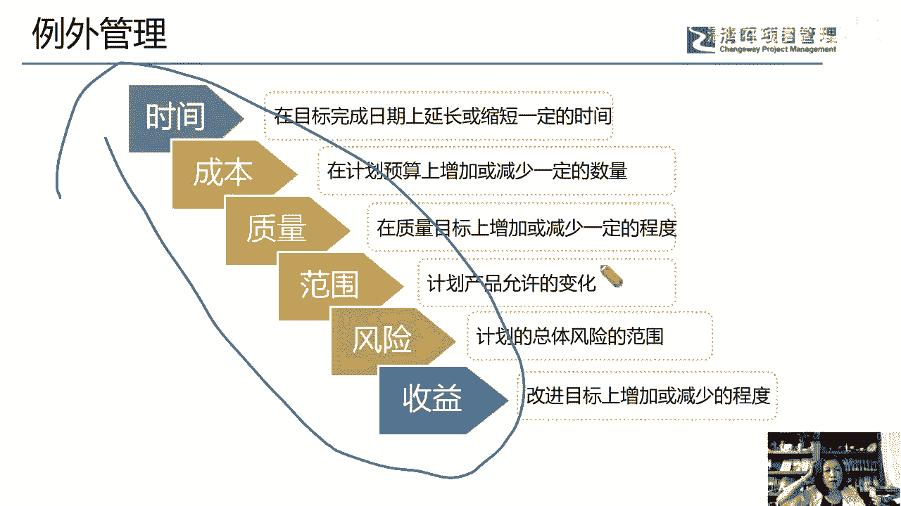
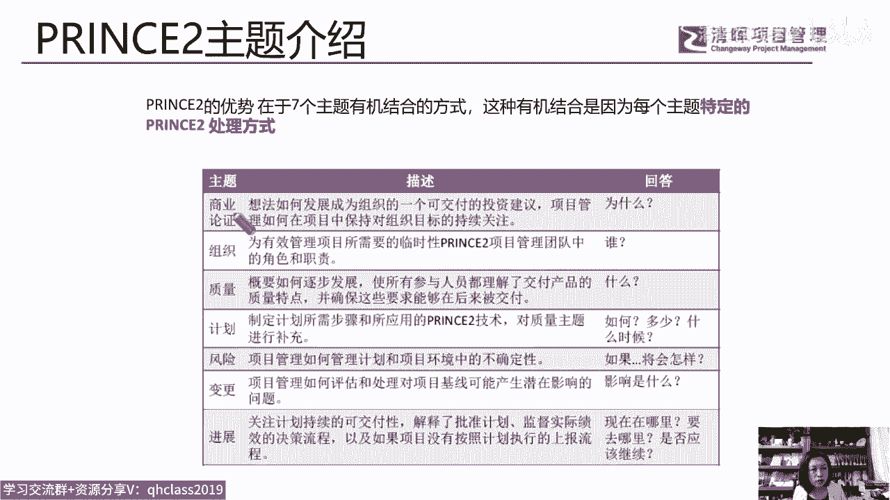
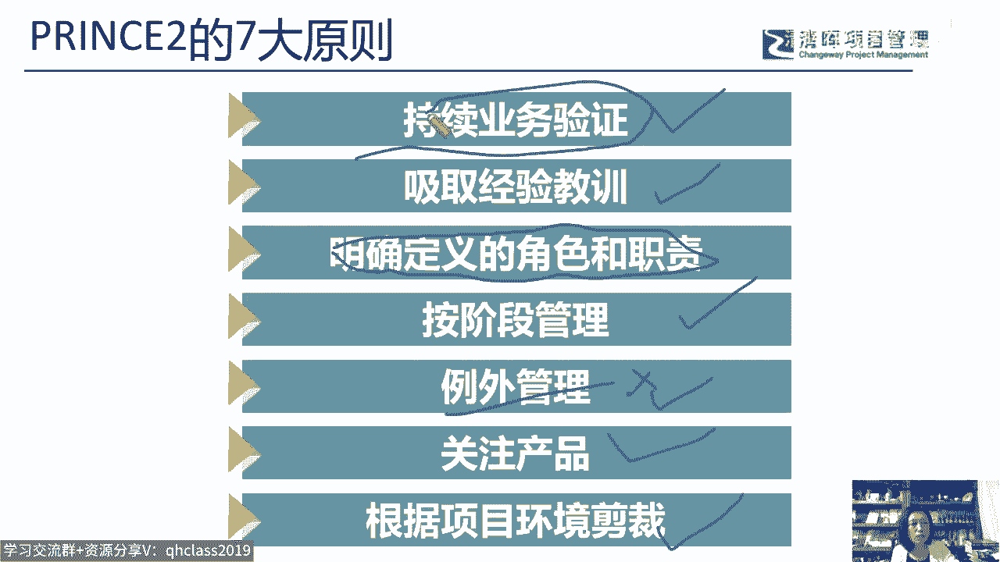
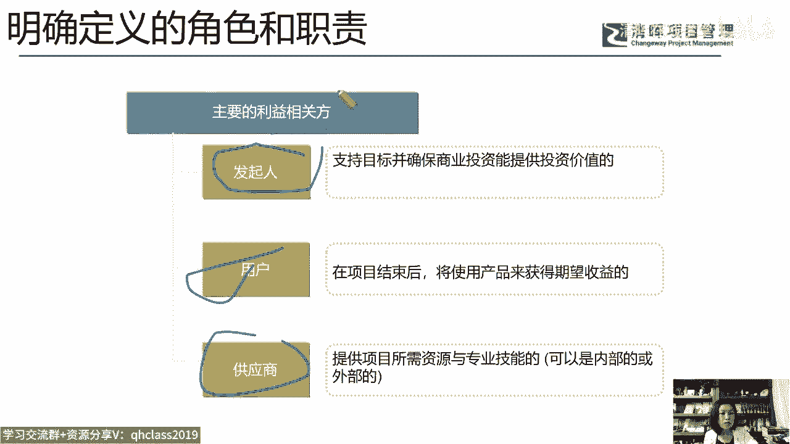
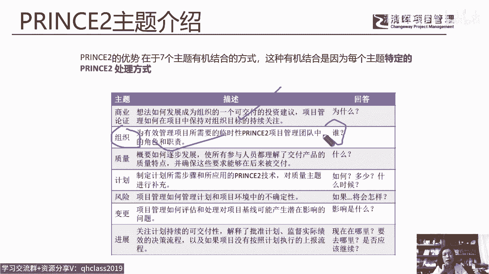
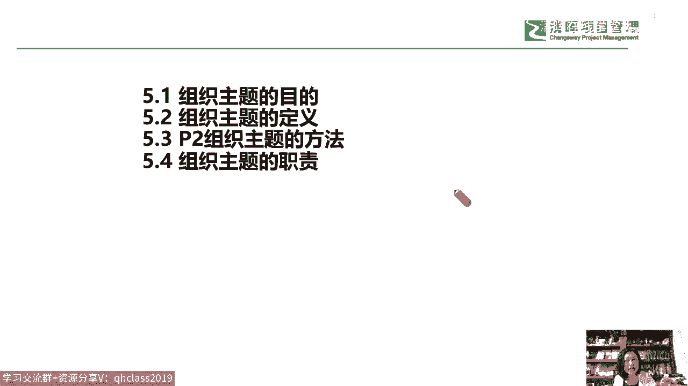
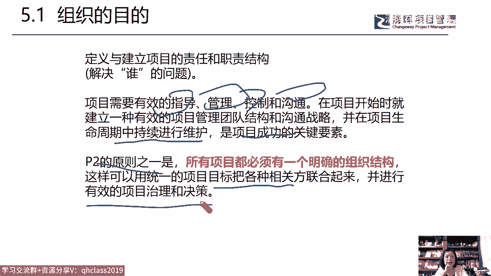
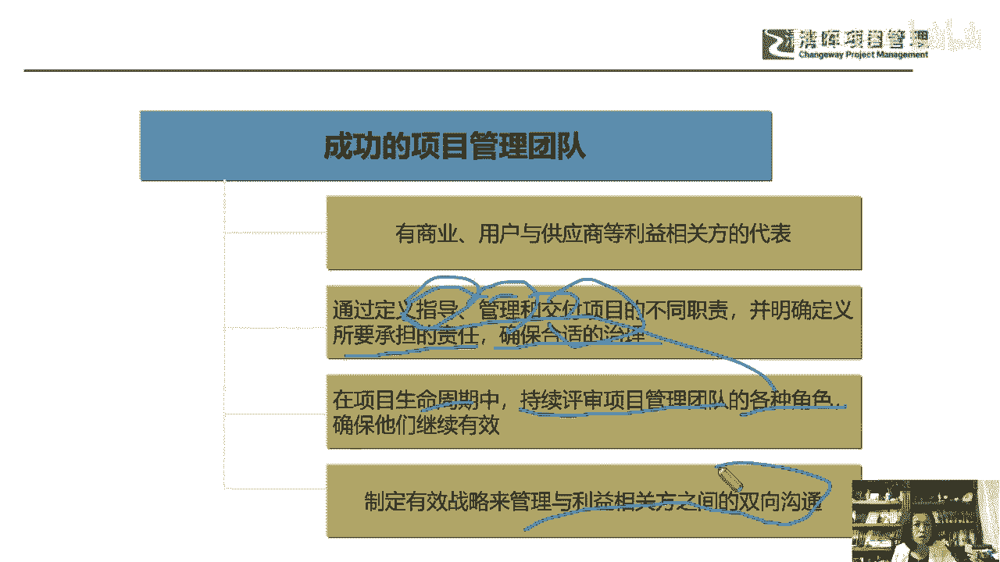
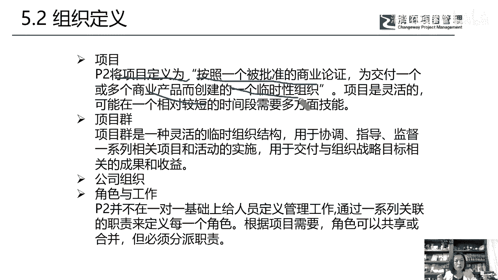

# 如何应用PRINCE2体系的管理方法打造项目管理团队 - P5：5.PRINCE2主题介绍 - 清晖在线学堂 - BV1F14y1d7ST

有关的内容。

所以我们来看看，在PP2的这个管理原则当中啊，它有六大原则，至少两大原则，一是明确定定义的角色和职责，二是例外管理，这两个原则中，就把各个不同层级的责任主体给出要求了。

以及对应到具体的管理内容里头去了啊，不是说虚的哎，这个领导是领导挂帅，但领导到底承担什么责任，他没有明确，这里给他明确出来了，那么真正的我们说把这种独特的矮像团队，要打造和项目的责任角色。

这个权利明确出来的，是在他的管理主题当中，在P2中呢它有什么呢，有七大管理主题，第一大管理主题就是商业论证，商业论证这个词在我们的偏僻体系中啊，是嗯重要又不重要的，你说它重要吧，它出现在项目启动I4。

1，制定项目章程作为输入输入项目文件对吧，有商业论证和收益管理计划，那么你说它不重要吧，从此以后基本就没有了，是不是基本上就不出现了，但是在整个P2体系中，商业论证这个词可是我们整个项目的灵魂。

因为p two，print two体系强调的是以价值交付为导向，以产品价值为较为为为导向的，在他关于项目的定义中，就说这么一句话，什么是项目，那么关于什么是项目，我们刚考完pp的学员。

是不是印象还很深刻呀，在PNP中，他说的是I这个一个什么呢，独特的临时性的爱成果质量和成果，产品和服务对吧，我们所要做的工作独特性和临时性，但是在P图体系中，他说一个被批准过的商。

也论证所要交付的产品成果，也就是说这个东西要去交付，他要干这个事儿，它哪怕具有独特性，它哪怕具有临时性，对不起他的商业论证要被批准过，证明它有价值，所以啊在我们整个的这个管理原则，管理主题。

那原则中商业论证体现在哪里。

我刚才说过了吗，持续也有验证，持续业务验证验证，就是你的商业论证存不存在了啊，你的虽然价值存不存在了。

不是说只是在启动的时候去论证了一次，那pp体系中，他就在启动的时候被输入了一下对吧。

去看了一下，然后去理想，但是在偏僻PRESSO体系中，你的商业论证要在项目定义的时候，要在项目立项的时候要有，还不仅次，那么在项目我们的七大流程，所以我们今天不展开啊，他的准备流程，启动流程。

他的这个什么呢，阶段边界管理流程，阶段控制流程，产品交付流程，收尾流程，这还有项目指导管理流程，这七大流程中，每一个流程都要去做一次商业论证的验证啊，所以我们说呢。

这就决定了商业论证作为一个主题的重要性，那么为了实现这个东西，这东西他不是说你去验证验证，验证什么，验证谁该干什么，谁该担什么责任，谁为他做了些什么，所以我们说呢商业论证唉需要靠谁，靠我们的组织唉。

为有效管理项目所需要的唉，我们的这个临时性的项目团队，他的角色职责通过组织这个主题来进行管理，他回答的是谁来管项目，谁来做什么的问题，就是我们刚才看到那个PPP我应该做什么，项目经理应该做什么。

当没有按计划交付的时候，我应该做什么，那我就不是一个人了啊，所以我们说在项目的print体系中，它通过组织这个模块来实现这个问管理管理。

落地管理聚焦，那么我们来看看组织这个管理主题，那么按照这是这是我们整个prince two啊，这本书大家注意一下啊，就是我们的这个偏僻是一本红色的书，那por two呢，这个就是我们的什么呢。

一本PRESU的教教科书，它有一半的内容是不是模板，我们经常在学pp的时候啊，学员最喜欢说老师有没有模板，那老师呢就得把自己总结提炼的一些，收集的模板给到你们，但是兔体系啊，它有思不能说一半吧。

1/3至1/3有了是他的模板啊，管理模板，那么这本书可能大家有时候也能看到我的背景，所以在我的身边啊，倚天剑屠龙刀就是我的两大护法，这是我们的偏bob，可能大家刚刚已经不想看到他了。

可能刚刚考过pp对吧，那这本呢就是我们的plus two，我们这本书的第五章专门讲的是我们的，它是兔体系下的项目管理团队的一个打造，他那包含了组织的主题的目的，它的组织主题的定义哎。

主题方法以及主题的职责，我们就来拆一下，那么我们为什么要有这样一个组织的。

这个管理主题呢，是因为我们要去定义和建立项目的责任，和他的职责结构，就解决谁的问题，在pp里简单粗暴的就是sponsor给你干什么，发起项目，然后剩下的就是项目经理自个儿干吧对吧。

但是PATO不是这样子的啊，他认为项目需要有效的去指导，要管理，要控制和要沟通，那么我们需要在项目开始的时候，就去建立一种有效的项目管理，团队的结构和沟通战略，然后在整个生命周期中去持续的维护啊。

这种指导管理控制，加上我们的这个过程沟通，是我们项目成功的一个关键要素，基于我们P图的管理原则，所有的项目都必须有一个明确的组织结构，那么能够把我们项目目标的各种相关方，或者说我们的干系人联合起来。

进行一个有效的项目治理和决策，所以他呢就没有把这个背，把没有把这个锅直接背到了我们项目经理身上，那么我想问一下大家，你们希不希望有这样一个项目环境，我相信我做过做过这个调研的团队啊，都是希望的。

真的靠我们项目经理太难了，是不是啊，唉太难了好，那么我们来看看一个成功的项目管理团队。

他一定不是项目经理的独孤求败，那么它是什么呢，他说是我们的这个管理团队，是代表了各类干系人的这个代表，它是我们的投资方，是我们的用户，是我们的供应商等这种单性人或相关方的代表。

那么他通过这样的几个职责管指导职责，管理职责和交付职责，那么明确定义不同的人所需要承担的责任，来确保适合的治理关系，那么在我们的项目生命周期中，还不能够说一开始I定义出来了，后续就干什么就失效了。

就瘫痪了，要持续的评审我们项目管理团队的各种角色，就这三种角色吗，知道管理和教交付，然后还得是由双方的这种双向沟通的啊，所以看到这个我们才叫成功的项目管理团队。

那么我们来看看，那么对于我们的p two，唉，刚才我们说过了，他把项目定义，为什么是按照一个被批准的商业论证，未交付一个或多个我们的商业产品，这个商业产品就是有价值的产品，而创建了一个临时性的组织。

那么对于我们来说呢，在我们公司也可能有项目。

