# 如何应用PRINCE2体系的管理方法打造项目管理团队 - P6：6.三种项目利益 - 清晖在线学堂 - BV1F14y1d7ST

群或者由我们的公司组织结构，但在这个过程当中，我们需要围绕聚焦于项目的三类人员。

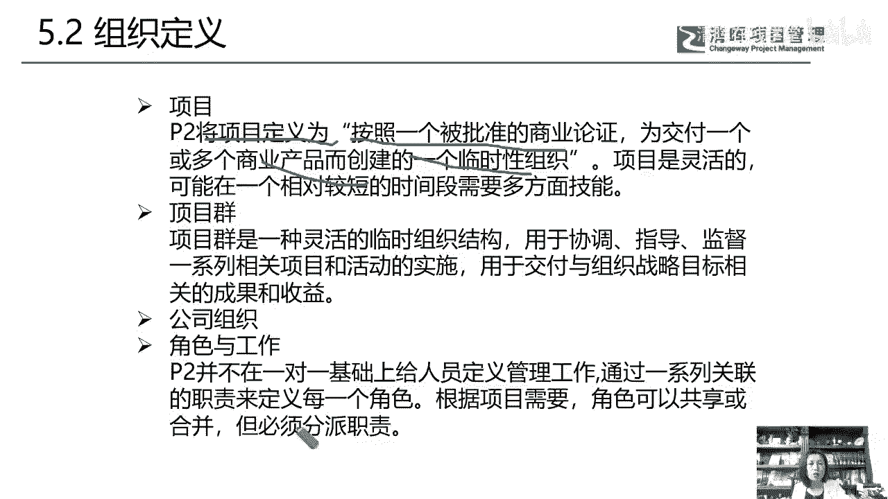

他的投资方。

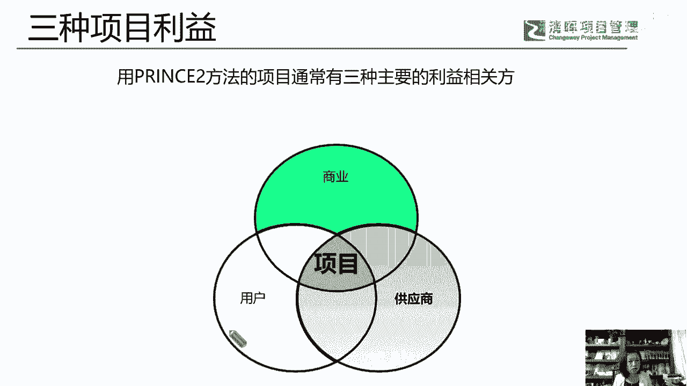

用户和供应商去打造我们的一个项目团队，那么我们说投资者，他要证明项目投资的合理性和投资价值，谁公司就公司不能盲目的去投资，不能盲目的去发起项目，但是在非常多的公司呢，这个就是大帮风唉，大干快上。

那么想想我们这些巨无霸，哪一个现在不是在卖卖卖对吧，最近呢有这个提出一个小目标的，本来奥以为度显成功了的，因为它几乎是我想一下2020117年吧，2017年应该说是在中国这一轮的最近5年。

67年的这个呃商业就是巨无霸的企业，危机当中，万万达是第一个，对不对，哎万达是第一个，那么嗯我以为都以为他转型成功，渡劫成功了，因为他是最早被银行收贷，唉最早应根紧缩，最早开始整合的。

记得大家看到过新闻财经新闻报道，万达把自己多少家文旅酒店，都卖给了这个富力集团对吧，然后富力集团去年还又又把它又卖又卖出去了，好像又卖给融创了对吧，那么实际上就是说万达海航，恒大苏宁唉太和院子对吧。

这些都是在暴雷的企业，那么这些企业他们当时我们说呢，他们做的是什么，他们做的最主要的一件事情啊，他们做的最重要的事情，我们所说的就是我们叫什么叫做这个嗯买买买，每一次的买买买。

我们说它都代表了一个项目啊，它都代表了一个项目，那么这些项目有没有人去证明它的合理性，和它的投资价值，那么有没有一个责任主体来做这件事儿对吧，有人说有啊对吧，王这个王老大对吧，张老大对不对。

黄老大是不是唉，这个王老大，我说的这些人都是这个万科的太和的对吧，还有黄老大是太和的吗，王老大是万达万达的另一个王老大，嗯对吧，是这个海航的，是不是等等，这些人，我们说呢。

他们被定义为是来负责这个项目的商业利益的，这样对吗，这样是不对的啊，这样是不对的，这些人都被什么，还有徐老大是不是少不了，他，都是我们所说的所谓的创始人光环，他们的决策过程是不科学的啊。

所以我们提到了我们项目上有三种利益关系，都要兼顾到投资者的利益，投资方的利益，投资主体的利益，要有人为此去承担具体的管理责任，那么用户的利益共商的这个礼也要得到保障的，那围绕这三大干系人。

三大类干系人啊。

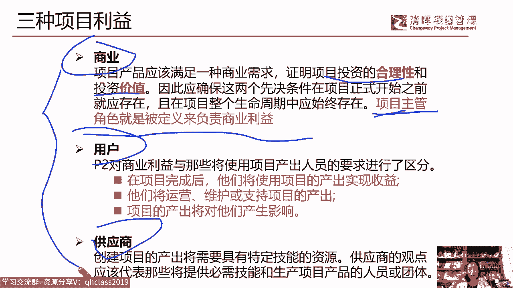

我说呢我们用PTO的方法来去做交付，那么print的方法呢，就是把这个指导这个责任管理，这个责任和产出给它分开I，而且重点在前边，那如果重点在前边，大家还记得我们在学这个啊。

这个偏僻的时候有一张质量管理，质量管理讲到这个质量管理大师，质量管理大师呢有一位叫戴明对吧，作名叫戴明环，那么有没有人注意到代明有一个很很重要的，质量管理的一个理念，在全球也是极为推广。

就是说在质量管理，这个质量管理包含了具体的某个产品的质量，也包含了某一件事情，某一个项目，某一个企业它的管理质量，那么有一个理念叫做，当管理出问题的时候，管理者的责任，当出现质量问题的时候。

管理者的责任承担百分之多少，有人记得这句话吗，就管理者要承担百分之多少的责任，大家告诉我有没有人记得，或者没考偏僻，或者不从偏僻的角度，在日常的管理模式中对的非常棒啊，感谢这位同学嗯。

这个还不是二八定律，就是85%就是代名提出来的，为什么不是83，反正不是八十四啊，这个默认接受他的一个说法，叫做不是二八定律，是我们的85%的管理责任，由管理层来承担，那么在我们这个P2里pp里。

把它放在质量管理提到了，但是在具体的这种管理中，项目经理你来管吧，唉管不好就项目经理的责任了，那没有进行，但是在P2里头，他提到了说一个项目我们要把它做好，得有指导的责任，管理的责任和交付的责任。

而重点是前者前者在哪里呢，前者我们说肯定是在指导和管理这个层面上啊，所以对于我们整个就是公司大平台，在公司这个大平台上，那么我们这三个角色指职责，构成了我们的项目管理团队。

我们的指导职责在我们的管理委员会，我们的这个管理职责在我们的这个什么呢，项目经理，我们的交付职责在我们的小组经理啊，所以说他在打造这个项目管理团队的时候，是围绕这三类该吸引人的利益关系。

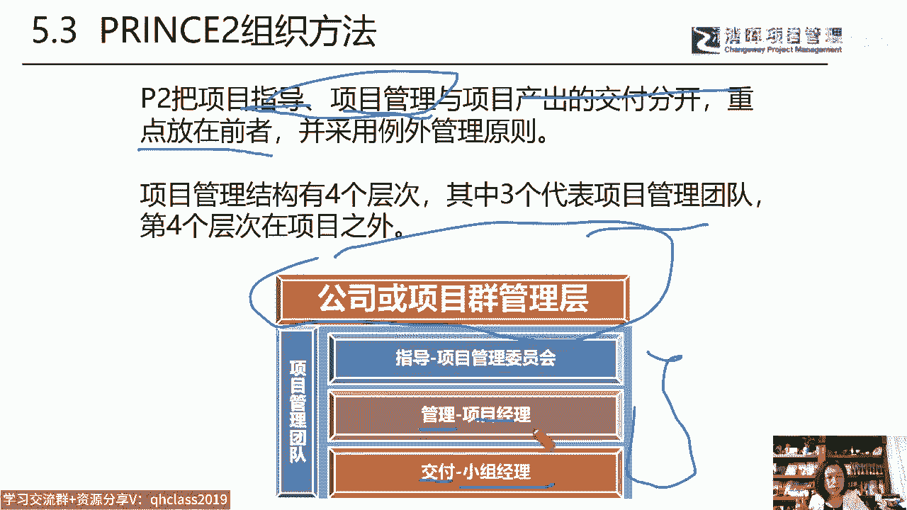

那么在我们的整个的这个项目管理的七大流程，我们的准备流程，我们的这个启动流程，我们的阶段边界管理流程，阶段控制流程，产品交付流程，指导流程和我们的收尾流程过程中，那么我们的三类角色都要发挥它们的作用。

唉谁输入什么，谁输出什么交互什么审批什么沟通关系，汇报关系是什么，都在我们的P图体系中给人一个明确的说明。

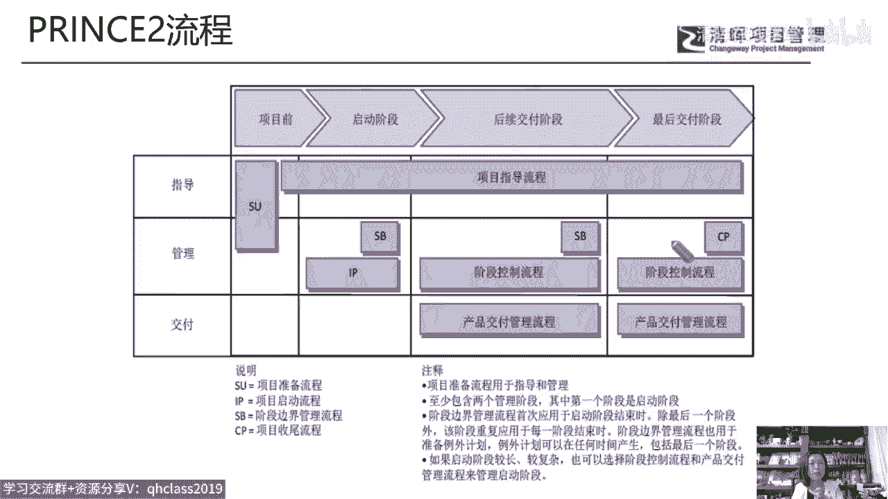

我们先来看一看啊，我们的项目公司层面，那公司层面呢它是在我们的管理团队之外的，他来负责正式的批准项目，所以你有没有注意到在偏批中，他说谁或是sponsor发起人去批准项目，但是在我们的p two体系中。

这个是我们的公司公司去负责批准项目，来定义我们项目允许的偏差，比如我们的利润在政策5%对吧，唉你的项目进度，你的项目成本，那么我们的管理委员会，在公司下一层来开展工作。

那么这是我们项目团队之外的一个层次，对于我们的项目来说呢，起到指导作用的是我们的项目管理委员会，他负责整体的指导和管理，他对项目的成功负有责任，这句话听了开不开心是吧，那么相当于我们所说的这个天塌了。

有个大个儿的人顶着，那么管理委员会对项目的成功负有责任，那有人就会说了，管理委员会又不是一个人，那会不会出现管理学上的另外一个问题，管理学中有另外一个一个悖论，叫做什么，和ICA中的A有点关系。

能不能想到就是法不责众唉，法不责众在管理学中还有一个理念，就是当每个人都觉得这件事情他可以做的时候，需要他做的时候，可能最后就没有人去做了，当每个人觉得每个人都要去做，应该去做这件事情的时候。

可能就没有人去做这件事对吧，法不责众那么好，Pm press two，它并不只是一个理念，它号称是最具有实践意义和实践价值的，一个管理体系，那他呢他说不是一个人，我们的项目管理委员会有一个代表。

这个代表是谁叫项目主管，所以项目主管在有些公司可能他是一个岗位唉，他是个title，他是你入职之后你担任的一个岗位，但是在PRINCI体系中，它是一个临时性的角色，这个项目自发发起了，在没有交付之前。

有一个人是项目主管，还是可以是兼职的，当然有些公司也可能是专职的，没有关系啊，那么作为项目管理委员会，批准项目所有计划和资源，授权任何超过阶段允许偏差的偏差，批准每个阶段的结束，授权下阶段的开始。

和其他与它对称的对应的肝吸引人去做沟通，我们再来看一看啊，刚才是公司这个大平台。

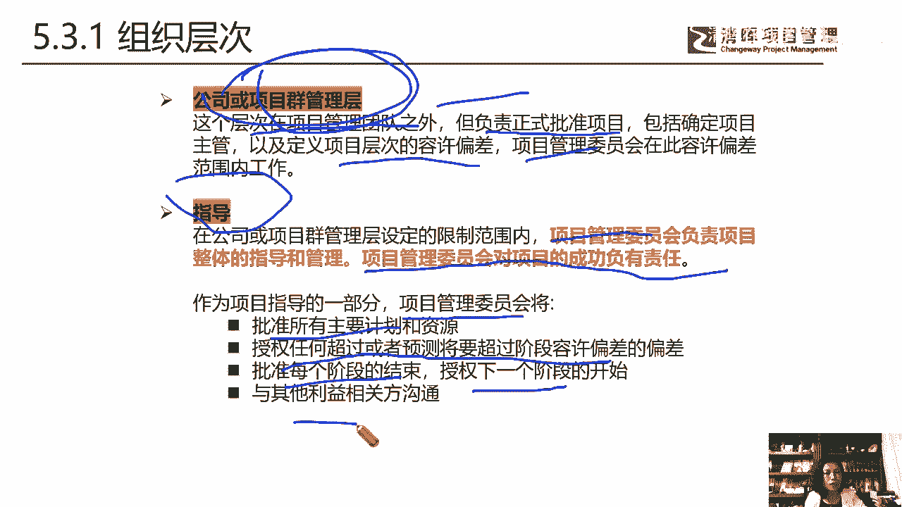

然后呢有一个指导职责是我们的管理委员会，然后我们的管理职责，在我们管理委员会设定的这个范围内，我们的项目经理负责项目的日常管理啊，那么项目经理负责的是日常管理，所以你看这句话。

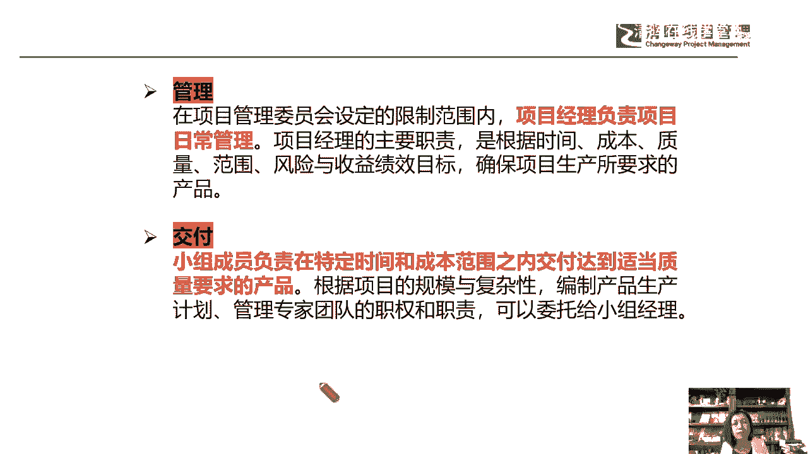

他说项目管理委员会对项目的成功负有责任。

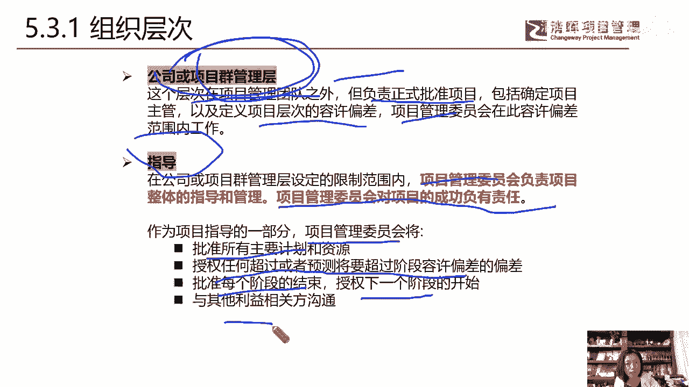

而我们的p two体系中，项目经理他负责日常管理，然后呢盯住我们的进度，成本质量范围，风险效益，避开与相关的计划，那么交付职责就是说我作为一个管理者，我有一个team，那么这些交付职责是我们的小组经理。

加上小组成员在我们约定的啊，限定的时间和成本范围内去做适当的一个质量，产品的一个交付。

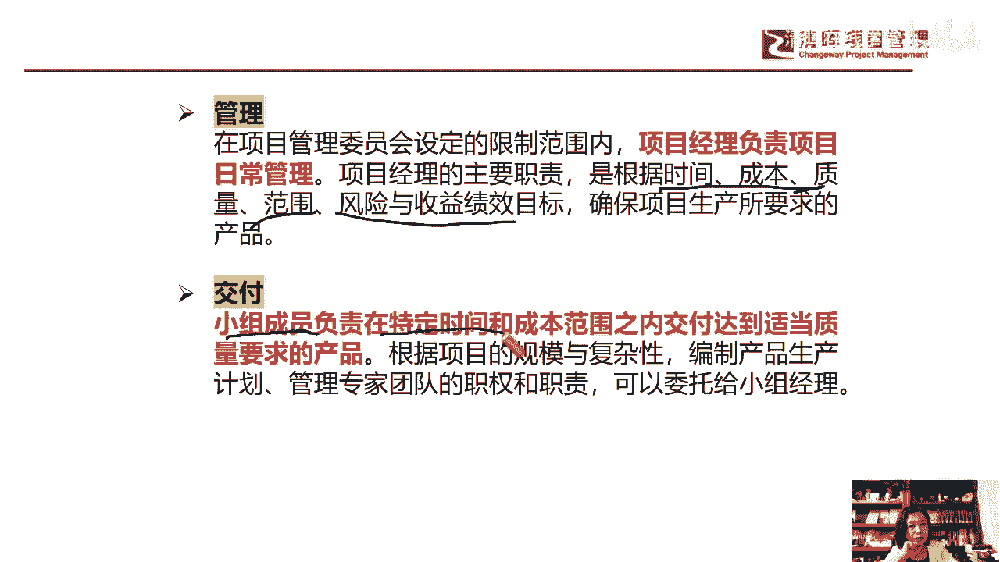

为此为了这三个职能，我们所说的指导管理和交付，那么它涉及了一个管理团队，唉，这是个临时性结构，为什么临时性呢，项目起来了，立起立项了，就有项目结束，那就结束了啊，那么它叫项目管理委员会。

它包含了高级用户，项目主管，高级供应商，唉，我们还有接下来我们所说的这个项目经理，小组经理，项目支持，以及我们的项保证和变更组织，这是我们整个的一个项目团队啊，整个的一个项目团队。

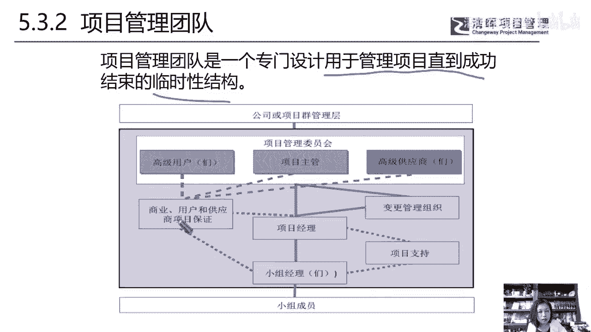

那么在这种体系下，他就设定了八个核心角色啊，当然还有我们还会提到影响，比如说这个叫卓越中心，卓越中心就相当于公司的一个知识管理部门呀，或者这种金融一种支持辅导部门呢。

有些人还是把它叫PO也有接近的地方啊，核心的就是基于项目交付的八个角色，对应了我们的原则的要求，是明确定义的角色和职责，那我们就一一的来拆解一下这八个角色好，那么我们说呢他有一个约定。

也就是说你不能既是这个裁判员，你又是这个什么呢，队员对吧，球员，所以项目经理和项目主管不能够兼职，那么项目主管不能担任项目经理这个角色啊，因为他是项目经理的管理者，它相当于一个裁判员啊。

是一个具有coach身份的教练身份，指导意义的这样的一个裁判员，那么我们来看一下这样一个，传说中的项目管理委员会啊。

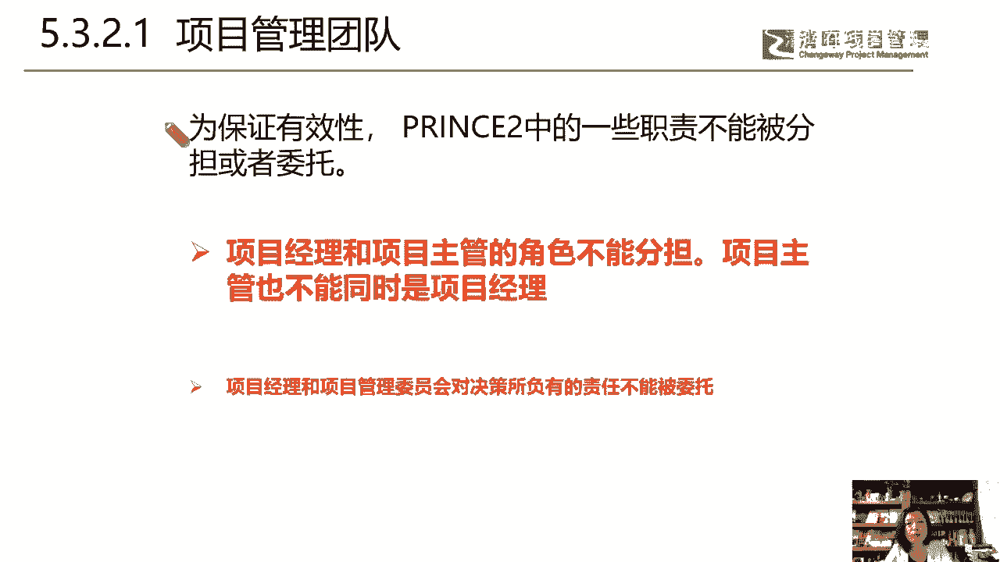

它代表了什么意思啊，它代表了什么意思，很多公司，那么有没有有些学员说，我们公司有它不发挥作用，贴在墙上，应对上级检查，日常他就钝了，隐形了没有了，那我们来看看这个p two体系中，它能不能盾，能不能引。

能不能没有啊，好那么项目管理委员会是由我们的项目主管，那么由我们的高级用户，和我们的高级供应商共同组成，我们的项目有管理委员会，有人说什么叫高级用户啊，高级用户是说这个人长得高吗。

I不是是用户那一类干线的代表叫高级用户，高级供应商是我们的内外部供应商的代表，来构成了我们的这个管理委员会，来看看啊，我们有学员说这个屁用没有，那么呃这个嗯，很多公司可能这个管理委员会形同虚设。

但是在P2里头，他是不允许你形同虚设的，我们来看看在责任上，首先在用P2的方法，他就把这个项目成功和失败的责任，就定义在压在了你这个管理委员会上，所以一旦你这个项目失败了。

打板子会打在什么项目管理委员会的身上，面对吧，所以我们说呢责任层面上，对于干性人来说，我们这个管理委员会承担了项目成功或失败，他的责任，那成功了肯定也会哎奖励你，那么失败了，你们是要承担责任的。

那么从管理方向上，我们说为项目所提供统一的方向，为项目经理提供方向哎，相当于我们的大海航行靠舵手，那么我们说这个授权唉，根据P2的管理模式对它进行有效授权，对他授权，他还要向下去做授权。

然后我们说呢在整合层面上，促进项目管理团队与参与我们的项目的，公司和外部组织职能部门的一些整合，那么从财务层面上，他要为项目的成功完成，提供资源以及相关的资金，那么决策上他要确保有效决策，在支持层面上。

为项目经理提供可见和持续的支持，在沟通上啊，他去做对应层面的内外部的这种沟通，那么我们说什么是一个好的有价值的，真正能够有担当的，发挥作用的这样的一个项目管理委员会呢，首先这些人他都应该有一些权利唉。

所以说他的成员唉，作为这个项目主管，作为我们高级供应商，高级用户，那么他在公司组织中的职位应该不够高，爱比部门经理，事业部老总能够对相关项目的需要，根据需要做出战略性的这个决策，他得有一种权利。

在这种情况下，还有呢它具有一定的可信度，唉在公司内部的这种可信度，也就这人的领导魅力啊，专业能力啊，决策能力呀对吧，那它具有可信度，那么另外一个授权能力，也就是说他懂得把这个授权这个度把握在哪里。

能够给玉向经理足够的空间，虽然我们的管理委员会在P图体系中，要为项目的这个这个什么呢失败承担责任，但是也不是说所有事情都自己的身体就行，那么你要给我们项目经理足够的这种授权空间。

那么可获得性这个可太重要了啊，这就是我们说的，一定不能让这些人形同虚设，如果他们没有时间参与决策，没有时间为项目经理提供指导，他他就没有价值，这个人就不合适，所以在我们的这个p to体系中呢。

他会要求啊，他会要求就是你要选出适当的合适的I，可以胜任这个角色的，其中一个就是我们所说的时间投入啊，就是我们的时间投入，那么嗯不是象形的象精灵啊，不是象形的，它实际上是依然是虚拟组织。

它的供应商就是你所有的资源嘛，他在管理要求上啊，他在这个管理要求上，那么实际上也是这样子的这个理念啊，挺有意思的，给大家分享一个另外一件事，就是上个月在嗯，我就是5月份，这个月。

我我们不是有个项目管理小书房的一个节目吗，也是我来主讲的，就是每月两次，也是每次两个小时啊，嗯一般是隔一周讲一本项目管理的书，我我我5月份讲的，我14号28号讲的这个呢。

就是这本叫哈佛商业评论的项目管理手册，那这本书的作者叫罗德里格斯，这个人还挺牛的，就我们考的pp都是PMI的这个认证了，那么他讲的这个项目和项目管理的那个手册，大部分是基于偏僻的模型。

但是他提到了这个项目的授权呀，管控的时候，它完全运用的就是p two的模型，在这本书里头，他完全提到就是他把那个模块叫项目领导力，他把这项领导力，不是说你项目经你自己的领导力。

是说你整个项目的领导力的一个构建，那么让这个项目能够有力地被推动和推进，其中就提到了，就是项目的这个类似于sponsor这样的人，他把他叫sponsor，发起人应该具有对项目来说应该具有可获得性。

因为西方呢他在谈到管理学的时候，他也喜欢量化，所以他在这本书里还明确的，特别有意思的提到的一个观点，就是说你作为项目的发起人，你要保证每周一天为项目去参加过，对项目工作啊，就量化到了建议到每周一天了。

这就是我们所说的可获得性，如果你不能够，那你就不适合担任这个项目发起人，哎这种这种说法，所以为什么我们说啊这个我们考天梯的时候啊，经常会看到什么项目管理委员会这种词，像什么主题专家这种词。

它都是脱胎于我们的p two体系的，甚至很多PMI的偏僻的题目的出题人，他都是能看出那种P2的那种管理痕迹啊，管理痕迹就是pm prt2，在欧洲美洲澳洲，他的这种落地应用性很强，很多公司用作基础的模式。

所以我们说他明确要求了，你作为你的管理委员会，你得具备可获得性，如果没有，你就不适合，你就不能干，所以我们说呢对于我们的管理委员会，第一作为他的成员，不是说只有三个人啊，是三个角色哎。

我们的主管主管是一个人，那么还有高级供应商，可以是好几个高级供应商嗯，高级用户可以是好几个来自于高级管理职位啊，那么根据另外管理，也就是授权，项目经理只能在他自己的授权范围内去做，超出授权就例外了。

例外呢需要向上去报告啊，这是我们提到的，那么管理委员会在我们项目过程中，他们怎么与项目做沟通，然后详细程度会在我们的沟通管理战略，在我们pp中有一个叫沟通管理计划，但是在我们的这个p two中了。

它叫沟通管理战略，哎他给的这个词都很大啊，都很大，也就是说作为管理委员会，你怎么去与项目产生这个交互关系，通过我们的沟通管理战略，把这个东西明确出来，明确出来，那么我们来看看项目管理委员会中的角色。

有成员。

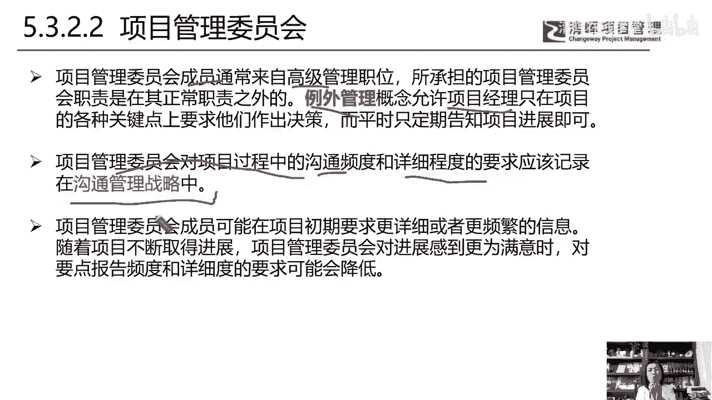

有项目主管，他是我们的这个什么呢，管理委员会的话事人是关键决策人，我们说项目管理委员会为项目的成功负有，承担责任，这个责任还要具体在一个人身上，就是我们的项目旅馆啊，然后呢。

我们的管理委员会虽然是由好几个人构成的，不同的角色，所以我们说呢它是一个什么，是当意见不统一的时候，相信你听谁的，听的是不是投票是项目主管的，那么这个人他要负责干什么呢，啊他要负责干什么呢。

我们来看一下，不好意思啊，最近有点干燥，他要确保项目自始至终专注于达成项目标，那么要去交付能够实现预期的收益的产品，我们的项目主管必须确保项目的投资价值，平衡这三者的需求。

那么我们在项目的这个准备流程中，就要去任命出一个项目主管，他是一个人，那么这个人他要去承担我们的项目责任，然后在整个项目中，我们的项目主管负责商业论证啊，有回放的啊，有回放的，那么我们说我们的项目主管。

他负责这个商业论证，但是不是说他自己写的商业论证，是说他要问商业论证的交付承担领导责任，因为我们说我们要关注我们的预期收益嘛，那么我们的价值，那么我们说要通过我们的商业论证，来去落落实啊。

他来负责我们的商业论证，好来看看，大家可能还暂时不能够快速习惯和接受的。

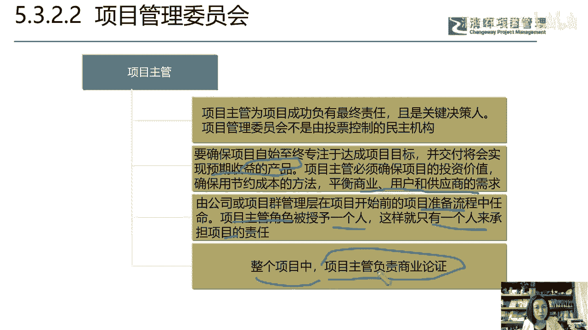

这个词叫高级用户，大家看一下啊，负责具体说明那些将使用产品的人员的需求，以及这个人作为用户的代表，他来负责说明需求，那么负责用户与团队之间的联系，以及监督解决方案在商业论证中的范围，质量的需求。

那么高级供应商是我们的供应商的代表，它代表了为我们做设计的，做开发的，做促进的所推动啊，做采购做实施的人的利益，这些人不仅仅是付出啊，他们也有利益的对吧，边界在哪里呀，我应该做什么呀对吧。

我需要什么输入啊，得有人替我讲话呀对吧，所以我们说呢高级供应商，那么它代表了那些在项目结束后，维护专业产品的人员的利益，所以你看P图的理念是非常的先进的，不是说我们的资源只有付出。

没有什么没有利益关系的对吧，你得总得给我创造良好的交互环境吧，你总得让我，你给我明确我的这个交互边界吧，对不对，这都是我的利益，如果交互边界不明确，你就没法衡量我的价值啊。

你就没有恒没法恒定我的绩效啊对吧，这是我们的项目管理委员会啊，这是我们的第一个角色，第一个子项目管理团队中的三个角色，那现在我们来看看我们的项目保证这个词。

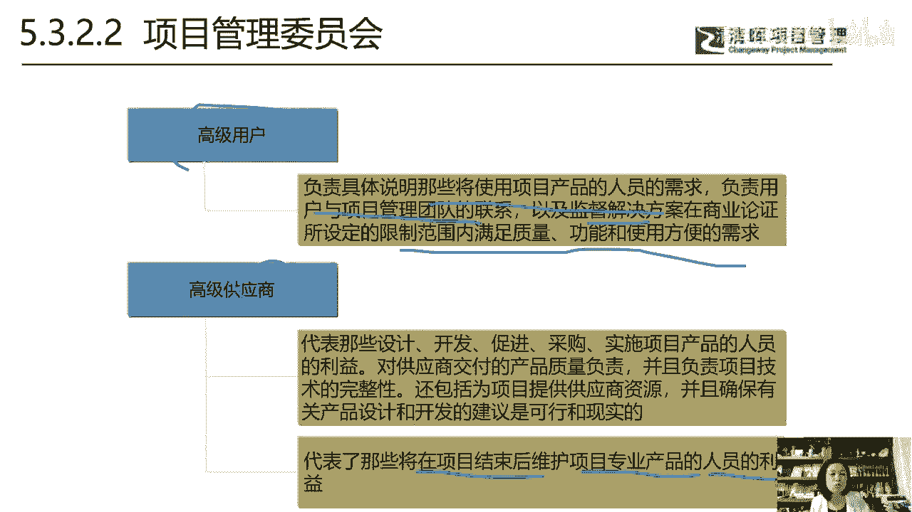

那么项目保证这个词啊，在我们讲P图的课程的时候，会给大家做一个详细的区分，我们要区分谁，区分的是质量保证，质量保证是专门针对于我们项目的，交付产品的质量的，是属于我们的项目的之外的，第三方可以是外部的。

比如审计机构啊，什么质量检测中心呀，或者公司内部的第三方，就是处于我们项目团队之外的啊，但是在P2体系中，他提到了一个项目保证，这个项目保证，第一个要求就是必须独立于我们的项目经理。

那么负责监督项目绩效和我们的项目产品，我们的管理委员会可以认命公司里的某一个人，在我这个项目上担任项目保证，他可以是专职的，也可以是兼职的，你可以把它理解为是什么呢，是我们的不，他不是天猫，他是一个人。

这个人他就他不是一个组织，他是一个人，我可以委托一个人，比如说我是这个项目主管啊，我代表项目柏林联会，我呢委托您来给我做项目保证，你可以是我们公司某个部门的某一个人，你也可以是我们的什么呢。

这个嗯外部都专门请了一个人，他有点像什么呢，有点是内部监理，就是当我们的项目产品被拿去，让质量保证审核的时候，那么我们自己内部请了一个内部的一个内测，内测师，你可以这么来理解内部的一个小监理。

就像开玩笑，像一个小小什么小妈妈一样看着你那种感觉，因为我们在后面学P图的时候，就他的七大流程中特别有意思，它不是质量保证啊，不是我们的这个唉，也不能说是这个QC，也不能说是QA不这么理解。

它不仅仅是独立的一个检查，他还给你提供什么支持，还给你提供建议，还提供指导，所以它就像你找到了一个就是咱们项目主管唉，找来了一个帮手，我平时忙，因为项目主管也是兼职的嘛，我平时比较忙，然后你怎么办。

你帮我看住，然后你还有点能力，他们不会说你在教一教他们，所以在我们后面这个流程的时候啊，在每一个流程上面他特别有意思，就是其中我们的一个，他把你看我们pp里头是不是提到了一个词，你还不能叫项目助理啊。

为什么一会有个项目支持，项目支持向项目助理，那个我们后面嗯讲到这个像P图课的时候，有一个特别有意思的事情，就是他有一个项目的什么这个管理活动，管理活动下面有个行动，在他行动里头呢。

就是项目经理每干一件事都要寻求项目组，保证了一个支持和询问，说我没弄，我是个项目经理，我没弄个啥，我都问问项目保证，你看行不行，先保证就行，没问题，好往下走哎，就类似于这样一个角色。

所以你看他还不仅仅是检查，所以还不能说是QAQC，他就是我们的管理委员会主管请来的一个人，替我们的主管看着大伙的啊，看着大伙的，所以我们说呢作为我们这个角色职能的一部分，它不能是项目经理啊，这就说了。

唉不能是项目经理，他不能兼职，他来监督相之相，那么他参与你所有的流程，他就站那跟个门神一样，看着你啊，门神还可以保护你，看着你还可以保护你，是不是，这是我们所说的这个项目保证，那么在我们的P2中呢。

也有这个项目的变更组织啊，我们说在项目启动的时候。

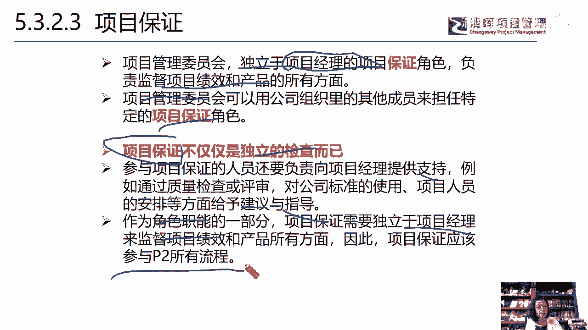

那么要考虑清楚谁来批准变更，那么变更这个词啊，在我们的批注中跟偏僻又不一样，偏僻呢有个词叫问题，问题分为变更，分为不合格项，唉还有呢分为关注点，特别有意思，你看同样的一件事，他的说法完全都不同。

所以呢在每个变更被批准之前，是管理委员会的批准，如果这个项目有大量的变更，那管理委员会来决定是不是要起一个拉一个，找一个我们的变更管理组织进行病是吧，你看又不一样了，所以说他不是说我们没有管理委员会。

在PMT中没有提到管理委员会，那么他有变更管理组织，但这些人他参不参与这项目，他懂不懂啊，他了不了解细节好，最了解细节的人，最关注下，为此承担责任的人，会在变更处理上他才会越慎重越深入。

所以说首先自个儿的项目，自个儿管自己的孩子，自己管，所以变更管理管理，项目管理委员会承担变更管理职责，然后如果太多了唉，变更太多了太复杂了，我再委托个助手成立一个变更管理组织，唉。

授权给我们的变更管理组织，来进行一个变更管控，那么我们的管理委员会的规模啊，根据我们项目的复杂程度大小来决定啊。

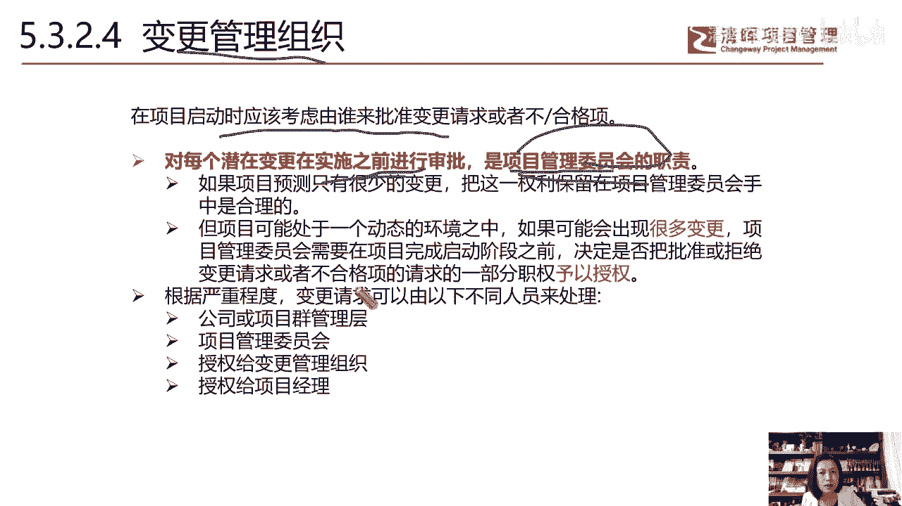

来决定，那我们的项目经理，我们说项目经理呢是我们日常管理的唯一中心，在项目管理委员会对他设定的这个限制范围内。

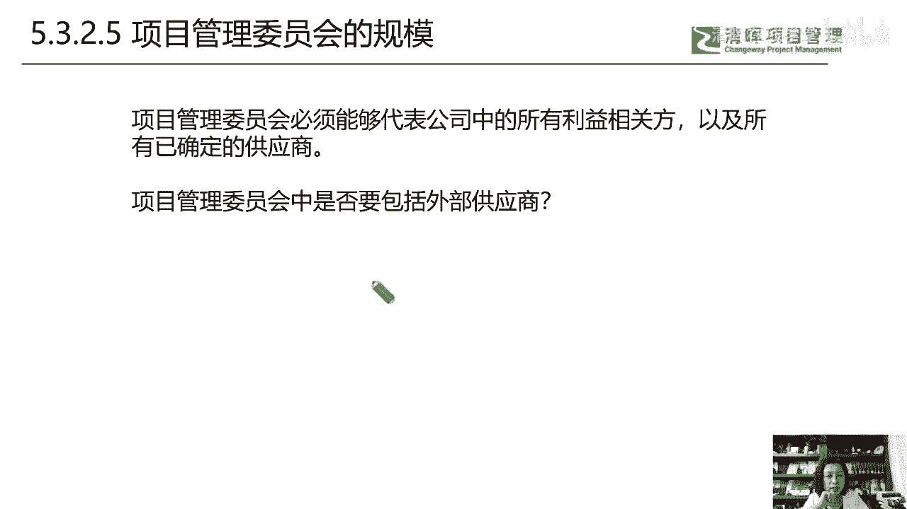

我们的项目经理，代表管理委员会行使管理职权啊，那么这是我们提到的好，另外我们的项目经理会把我们P图流程中，产品交付管理的职责委托给小组经理，委托给小组经理，可能是一个或者是多个我们的小组经理。

那么我们的这个小组经理呢，我们说他主要是负责完成向经理所分配的，这种具体的工作方，那么小组经理想向经理去报告并接受他的管理。

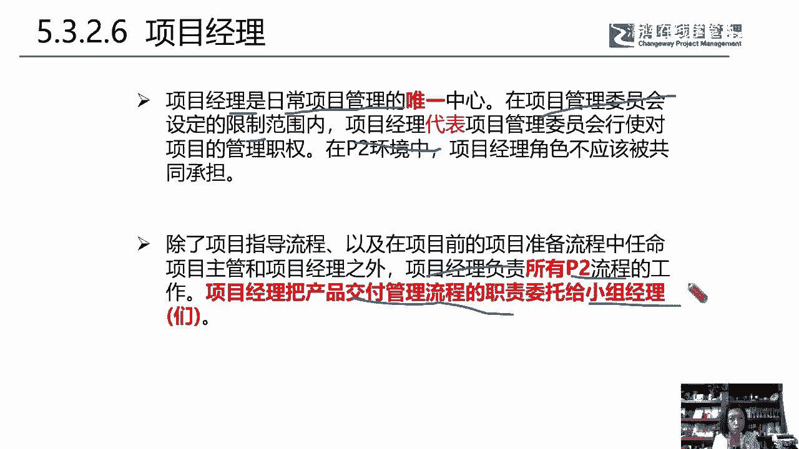

但是这个小组经理他可以有也可以没有啊，因为有可能我们项目经理这个项目，项目项目的规模没那么大，不复杂，它下面可能项目经理下面这三个人，两个人唉，那可能像小组件，你就类似像精自己了。

所以我们说它可以有也可以没有啊，这是一个可以有有没有一个岗位，所以你想规模，你们刚才不是提到项目助理了吗，看这个词它叫项目支持，项目支持是项目经理的职责，如果需要，我们可以把一部分项目支持的工作。

委托给这个项目支持的角色，也就是说他非常强调这个精进行啊，在人才的这个经济性的复用上，你比如说我们需要这个角色，但它可以是向经理来兼任的啊，我们需要项目保证，他不是全职，他是兼职，我们需要项目主管。

他不是全职，他是兼职的，当然他建议项目经理最好是全职啊，就要全职，那么有这个角色和有这个人他是做全职做兼职，这个关系是什么呢，也就是说每个角色都要承担，它所对应的这个责任和他的这个权利。

这部分工作必须要有，但这个人有一些岗位可以接着做，你就项目支持这种工作，那么我们谁来做呢，项目经理来做项目保证，这个角色就不能够由我们的项目经理来做。

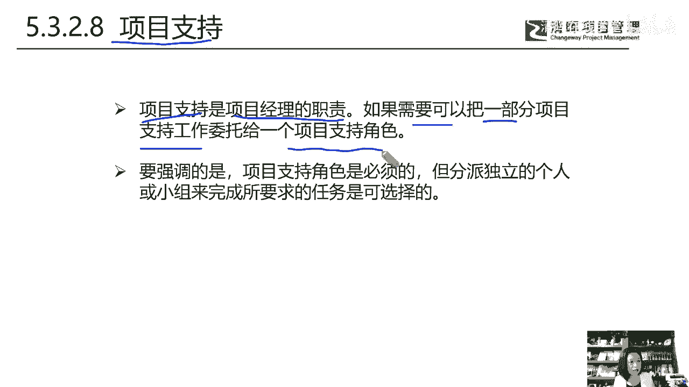