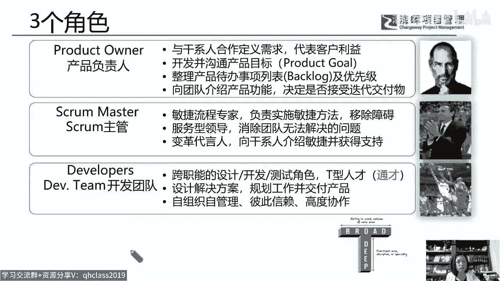
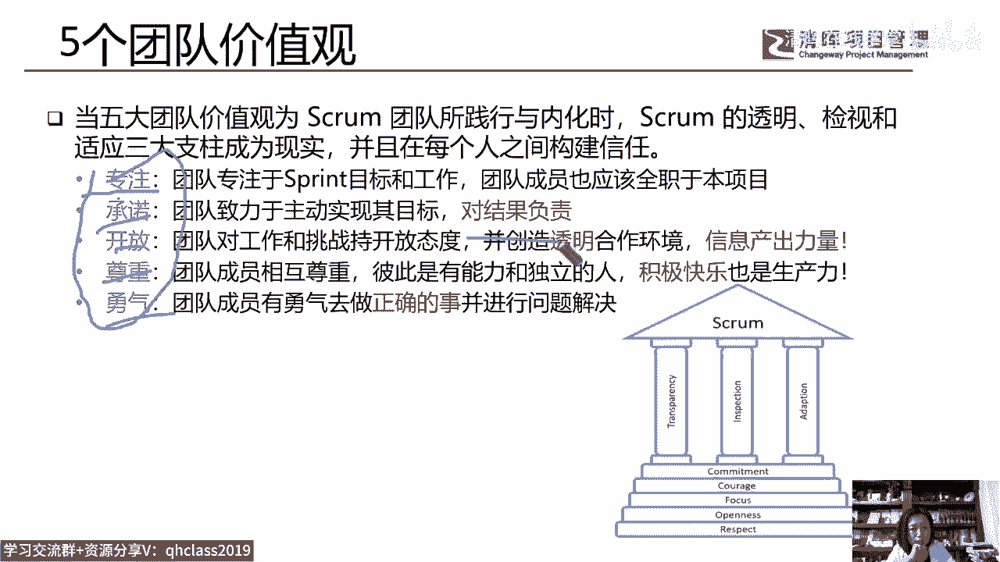
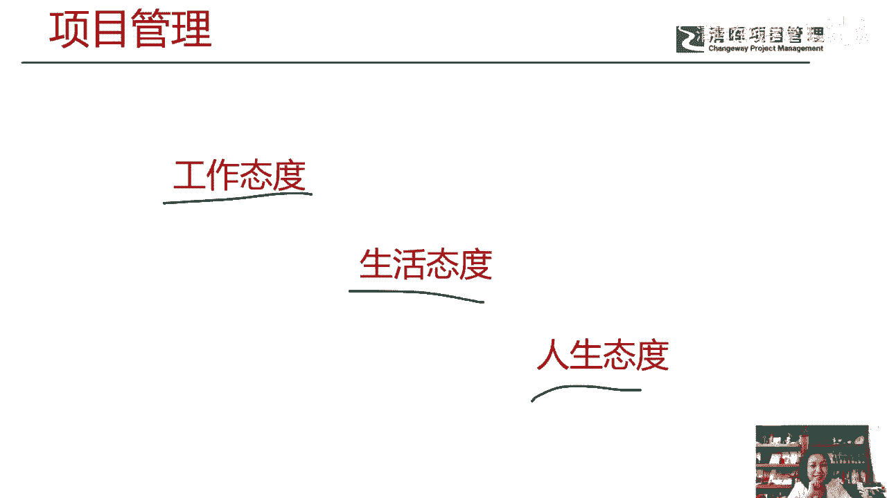

# 如何应用PRINCE2体系的管理方法打造项目管理团队 - P8：8.敏捷12原则 - 清晖在线学堂 - BV1F14y1d7ST

也就是对领导力的塑造也要敏捷起来，对于P图模式的应用也要敏捷起来啊，其实p two啊跟敏捷特别的接近，你比如说敏捷强调能尽早交付，可有有价值的产品，而P2是经过商业论证，认为它是有价值的。

咱们才理想才干，而且每个阶段你都要去评估商业论证，而敏捷不就是每个迭代，去评估我们的优先级的价值的产品模块吗，功能吗，对不对，所以有机会我们还会再去聊一聊，这个p two和敏捷的关系啊。

p two和敏捷的这个关系，那么在你我们今天不是讲了团队效能吗，敏捷中强调了要强化我们的各种互动，要去积极与客户合作，这也是我们所说的打造我们的项目团队绩效，一个重要的点，那么在敏捷的原则中唉。

他强调了要去选择那些富有进取心的个体，这叫做有积极性的，有挑战意愿的团队，然后最好的团队沟通方平面对面啊，那么也就是说有问题直接沟通，那么最好的架构需求和设计来自于字符团队。

这个类型就是说我们要激发团队的潜能，还有团队要定时的去反思，所以我们在很多企业为他们去打造了，这个P2的这个项目组的架构之后，然后人家说怎么能让他运行起来，火起来，火奥像流水不腐，户枢不蠹。

唉能够有勃勃生机，我们说还要从pp里去取经，还要从敏捷原则中去取经啊，因为在敏捷中他强调了这三个角色。

你看po scream主管和我们的开发团队，爱给了不同的分工，然后秉承我们这样的一个原则，这就相当于说主管这个角色了，把这个把舵，然后呢他负责去唉，按照这个路线领着大家前进，然后我们把事情做对。

那么五大价值观，如果有了P2的这种管理架构，然后整个从管理项目管理委员会，到我们项目主管到项目经理小组经理，向项目支持项目保证变更组织I高级用户，高级供应商都能够专注看，专注不仅是敏捷的理念。

在我们的项目柏林委员会的一个要求，就是一定要有可获得性，对不对，一定要有可获得性，那么专注承诺开放，那么尊重勇气，承诺对结果负责，所以不是向经理一个人去做事，是一个集团军在作战啊，一个集团军在作战。

那么这就是我们要带着大家去打造的，项目管理的价值链，它包含了项目管理的语言思维，项目管理的知识体系，项目管理的工具和技术，而我们学习更低，学习push to，学习VCP敏捷等等。

是甚至软考mp TP都可以啊，他都是在夯实我们的这个什么呢，像管理面对六要素的一个护城河，爱练我们的内功，那么最终如果我们愿意把这个项目管理，作为我们的工作态度，我们的生活态度，我们的人生态度。

那实际上我相信风险会降低，我们的职业生涯会嗯更有价值，是不是，人间正道是沧桑，那么读书永远是快乐的啊，感谢大家跟我一起来做了一个关于推特的一个，组织架构和他的管理模式的一个分享。

好那距离我们下课还有点时间，看看大家有没有什么问题可以提出来，好不好，我们有学员啊会问到说P2怎么考，那么经过被偏僻虐过之后的学员，考P图就很舒服了，第一呢我们考过偏僻的学员呢，不需要考偏P图的基础级。

它的基础级是35，75道题，单选题对35道就过偏僻，很神秘，不给你打分是吧，2007年之前的PP考试是打分的，结果呢，这个中国大陆地区的这个考试成绩太高了，分太高，因为中国人太会考试了，大家懂的啊。

大家都懂的，后来2007年之后就不公布分数了，只有过与不过的定性结果啊，或者几A啊，及六从6P到5A到到3A的一个定性结果了，不公布分数了，但是P2还是公布分数的，但是剧透的基础值是75道单选题。

然后35道题就过，然后呢就嗯就那个什么了，不需要考基础题，直接考从业级，从业级呢是一道案例模拟题，然后八一个案例八道大题80分啊，考过这个44分就算过，所以他给你打分的啊，考批注是打分的嗯。

开卷考试可以带着他的教材去考试的啊，所以通过率没有问题，但是嗯这就是学员更问，更问到说P图和偏僻的主要区别，就是偏批告诉你的是知识点唉，你要做进度管理，成本管理，你得有一个进度进化。

你得有一个呃是范围管理计划，沟通管理计划，但这个计划唉，这个计划怎么说呢，长什么样，他没告诉你，那么PPP2和PP的主要区别就是，p two是一个实践性的，他先告诉你，你要管好一个项目。

你得建立什么原则，这个原则1234567，然后你得管七个主题哎，商业论证主题，进度成本质量风险的主题对吧，你得搭建一个团队，这个团队怎么搭建，这些人具备什么角色，然后你按七个流程去管项目，项目准备流程。

项目的启动流程，我们讲到了PPP告诉你，你要项目要写个项目章程，然后启动项目，那就这么简单吗，不是的，他有个项目启动流程，这个流程的输入，这个流程的输出，而且这个项管理委员会项目经理，项目小组经理。

项目项目支持，项目保证在这个流程里起什么作用，他都给你写的一清二楚，这个流程上输出什么，有什么活动，有什么行动唉，需要一个什么工作环境，他都告诉你，而且这本书的后面啊，一共273页的一本书。

然后203页开始全部是模板啊，你看还有大量的这种什么图表啊，每一页都是有大量的这种图表的，大家看一下它的每一张都是以图表为主，这个工作是怎么干的，他给你分的特别清晰，所以他更强调的是这种叫什么实践啊。

实践能力，那么有人说KETO更适合哪一种组织结构，那么实际上对于我们来说，我们的一个建议是什么呢，就是嗯没有哪一个组织结构完全用pp，也没有哪一个组织结构完全用p two，你就包括作为啊。

作为这个这个什么呢，他都用的是什么，他都用用的是这个这个加了pp，加上P图的方法来写出来的，那么我们能做的是什么，就是我们有一大桶水，我们有一个大的工具箱，这个工具箱里有P2的方法，有偏僻的方法。

有敏捷的方法，有NPPP的方法，有软考的方法对吧，然后我们用的时候就舀一瓢水出来，我们用的时候就拿一个工具出来，我们单点应用它会更好，这是我认为的啊，嗯课件的电子版就不分享了。

其实我讲的都是我们的教材里的内容，偏僻里你们都学过了P2，如果有机会可以学，如果大家现在啊就是我们我听说啊，就是我们的考过在清晖考过偏僻的学员，报批注都是有优惠价的，优惠多少，我不知道。

这是我们的这个总教务长跟我说的，因为我今天要讲的课，他突然告诉我了，我也把这个信息传递给大家啊，叫做什么呢，叫做成功的项目管理方法论，看一下能看到吗，成功的项目管理方法论啊。

那么这个我们说呢它叫project in control environment to，受控环境下的项目管理，受控环境下的项目管理，它叫成功的项目管理方法论嗯，所以他很自信啊，对自己。

那么你像这本书的作者，哈佛商业评论项目管理手册的这个作者，罗德里格斯，他又担任过法国巴黎银行的首席项目观，史克医药的这个什么呢，史克医药的这个嗯首席项目关，那么那些欧洲的公司。

我们说大部分情况下都用的是什么，用的是我们的这个英国的项目模拟体系，8月份开课，昨天我有个学员，我自己的偏僻班上的学员，周二跟我聊完之后，很开心的说，6月7月好好休息一下，8月份开始学我们的P图好不好。

上四天课开卷考试，而且是预约嗯，考完了学完就马上能预约，有学员就是因为是开卷考试嘛，所以他有学员今天上完课，第二天就预约了，第二天就预约考试，就拿到证书了，看看大家还有什么问题，有什么问题都可以提出来。

我们把pp叫以偏见，我自己说的师父叫屠龙刀啊，培训费和考试费咨询我们的班主任啊，这个有优惠，我们轻微的学员都有优惠的，好看看大家还有什么问题，偏僻实战课啊，有啊，我我之前我我前两天刚讲过一个。

你也可以咨询咨询我们的小班班主任啊，我每个月都有啊，我们那个偏僻的这个实战课，有这种，我我线上就有，我刚讲完这个项目经理与PO的相爱相杀，56月份没有实战课，我7月份还有的。

7月份没学过PP也可以考P图，没考过偏to也会考成人P，什么叫没有偏僻，刻精彩，他们体系不一样啊，模式不一样，管理机制不一样，偏僻的软技巧课程和实战课都是有的啊，都是有的，太灵活了，指的是什么。

我没太理解好，看看大家还有什么问题可以填写我们的问卷啊，A必须选，因为你开卷，你以为答案就在你就能找得到啊，你连你如果不学，你都找不到那个词，你不懂他的意思呀，而且你你两个小时考试，他是两个小时考试啊。

你都不知道这句话在这书上哪哪个地方，而且开卷也不是只靠让你抄写定义的呀，他让你做案例分析，案例分析基于你的知识理念呀，哎呀我想问一下大家，你们曾经啊不是的啊，pm m8的是美国的这个P2学的是英国的啊。

对线上考试不抽象，他都明确告诉你了，这个人要干什么职责，他的那本书的附录里都把模板给你了，他怎么叫，他怎么能抽象了，他不抽象，它更具象啊，它更具体嗯，是英国的项目管理体系。

所以它不是美国的项目管理协会去发生的啊，其实在大学里头啊，开卷考试你们不觉得更难吗，反正我我读研究生的时候，我在香港，我们一听这本书是开卷考试，我们都很痛苦，反倒是闭卷考试可能还是客观性命题。

开卷考试是主观性的，但是我们P2没关系，我们P2是一道案例啊，80分一个大案例，80道题好，没关系啊，大家可以慢慢的去接受学习，认可度都挺高的，在我看来，都挺高的，你去应聘跟人讲，你有快速的证书。

可能他问你聊呢，可素从哪个角度去管理，你聊聊开了也挺好的啊，好感谢大家，看看大家有什么具体的问题可以咨询班主任，你可以这样来理解，但是我可以告诉你啊，他可是一点都不落后诶，就他的理念，如果你去上课。

我就告诉你他的理念什么，他的理念跟敏捷非常接近，不要太小看，其实p pp今天更新一下，明天更新一下，也没更新出什么东西来，比如采购管理，它六本六个版本，每个都不一样对吧，但是他没有什么新的东西。

它就是一个排列组合，你比如他把这个这个过程改进进化给删掉了，那确实这个东西就不应该存在吗，它是要存在的，就偏激的这种更新呀，价值和意义永不觉得有太大的变化，说实话，重要的是应用啊，重要的是应用。

任何一个道不远人，你说我们现在学的，我们现在的管理理念根本就没有超出春秋战国，没有超出古希腊，古印度，对不对，所以大家都有偏僻，但那就拼的是谁会用了是吧，大家都有pp，那你做个P图不就更牛了吗。

是不是啊，好不打扰大家休息了，明天还要工作，谢谢大家，感谢谢谢再见，我们下次课程再见啊，谢谢谢谢谢谢，好，希望有机会跟您一起来交流我们的P2好不好，如果感兴趣，可以跟8月份跟我们一起来学P图啊。

谢谢谢谢各位，辛苦各位。

