# 如何应用PRINCE2体系的管理方法打造项目管理团队 - P1：1.课程导言 - 清晖在线学堂 - BV1F14y1d7ST

大家晚上好，感谢大家来到清辉项目管理在线课堂，山水清晖，你我同行，嗯感谢大家在经过一天的辛苦的工作之余，来到我们的课程现场，今天晚上呢依然是郭郭老师来跟大家分享，pro主题的相关内容。

今天呢我们来聊一聊如何应用presto体系，项目管理方法来打造项目管理团队，我相信今天呢来到我们课程现场的很多学员呢，可能刚刚啊经历了这个偏僻的认证考试啊，那么呢也很感兴趣。

在自己下一站的项目管理的流程体系，标准和职业证书的这个打造和学习上，我们可以接受什么样的一个体系和方法，这两天呢我也接受了我的，收到了收到了我的很多这个学员偏批学员的。

或者是学过了CP的这个学员的一些咨询，说老师，如果我还想下一步啊，持续的去学习一个项目管理的方法和体系，您建议我学什么呢，我说那正好最近呢，我们也在唉，跟大家持续的推出我们的prince to体系啊。

嗯也就是说从实际上是从上个月开始，从4月5月六月，接下来每个月啊，7月8月也都会有，我都会唉，就我们的一个prince to体系中的某一个模块，结合我们项目管理中现实遇到的问题。

同时对标一些拼贴的做法来跟大家做一些分享，所以呢也感谢大家对我这个课程的支持。

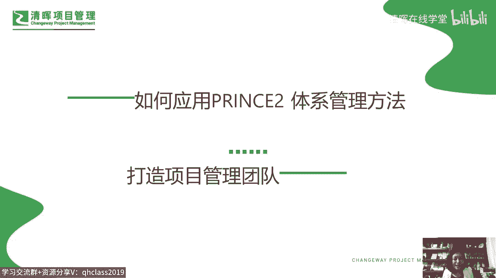

也对我的支持啊，那我我呢是我们清辉的专职老师，嗯大家叫我郭郭老师就可以了，这呢是我曾经的背景，我想呢其实背景呢倒并不重要，重要的是我们在今天晚上这样一个一期一会的，短暂的两个小时的时间里头。

是不是能够去来学习应用，了解交流，碰撞出一些思维的火花。

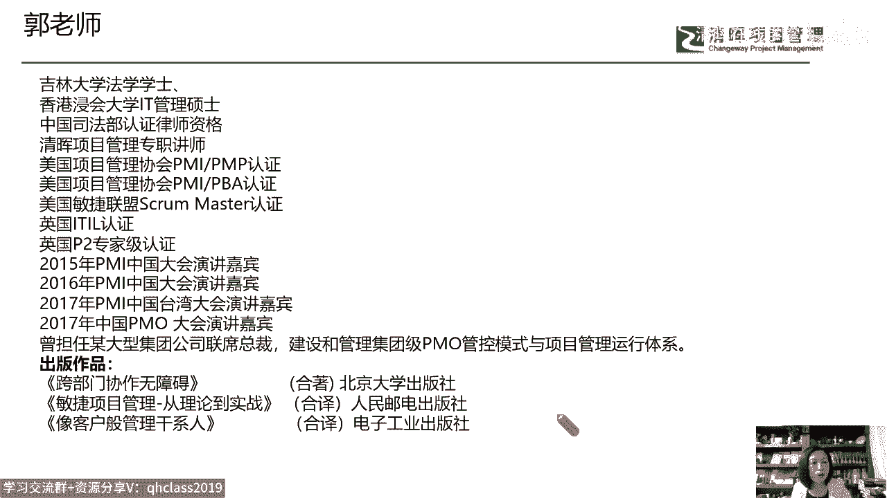

那么我相信也有一些是勾勾老师的粉丝和老，学员了啊，嗯看到我可能想到项目管理，就会想到我比较常说的这样的一个管理模型，就是我们所处的这个职场环境，就是这样一个项目管理的五行关系图，它包含了公司战略。

产品项目和我每一个你和我每一个个体，我们都在这样一个平台中，我们希望这五个元素能够干什么，相生相融，共创共赢是吧，那我们的路径是什么呢。

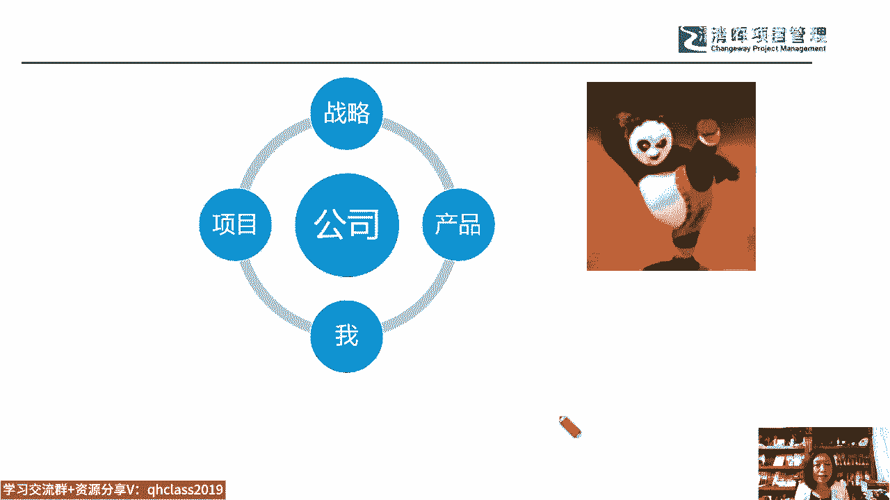

我们的路径有很多，其中一个路径就是郭老师特别喜欢的，我们的项目管理的价值链，我们让项目为我们创造价值，打造一个项目管理的价值链，那这个项目管理的价值链呢，我们说它又包含了六大要素。

它就是我们的项目管理的知识体系，项目管理的工具技术，项目管理的语言和思维，那么我们每一位学员都在我们的企业，都在我们的工作，在我们的这个生活，包括在我们的学习当中，不断的来夯实了自己。

基于项目管理的这个知识体系，工具和技术语言与思维，但是我们如何去应用它呢，我们如何让我们为自己唉构筑的这样一个，基于职业生涯的，基于项目管理的这个护城河越来越坚固，越来越有这样的一个壁垒和高度呢。

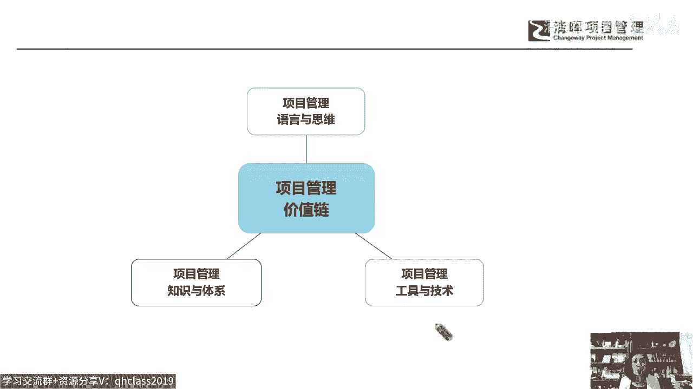

好，那么我们今天晚上来聊一聊，关于项目的这个团队的问题，项目的组织结构的问题啊，好我们说成功的项目啊，它都是持续的，以目标为导向的共识和协同的这样的一个过程，大家有没有注意到。

我在这个地方把持续两个词呢给它嗯涂黄了，highlight呢，为什么呢，因为我们想要证明什么呢，想要告诉大家，或者提醒大家，就是持续这两个词，在我们共识和协同的过程中是非常重要的，因为在很多公司啊。

就大家不是没有共识，大家不是没有协同，这种共识和协同是碎片化的点状的，或者说是嗯记嗯，某一个点有共识和协同之后就结束了，比如说项目启动的时候啊，项目开这个我们所说的这种开工会唉。

项目开这个事实会开动员会的时候，那么在我们这种持续的被需要的，共识和协同的过程中呢，它就变成了野蛮生长，有一些项目团队，项目管理过程能够持续的失去共识和协同，有一些不能，那么这种有可能不能和有可能能。

很多时候取决于我们项目经理的这种什么呢，叫我们所说的叫这个个人的魅力，个人的领导力啊，所以我们把这个叫野蛮生长，或者我们把它叫做项目经理的字体的，这种个体驱动能力，但事实上呢我们说一个有序的，可复制的。

持续的唉这种共识和协同，它往往离不开我们的一个组织驱动，那对于我们的这个项目组织啊。

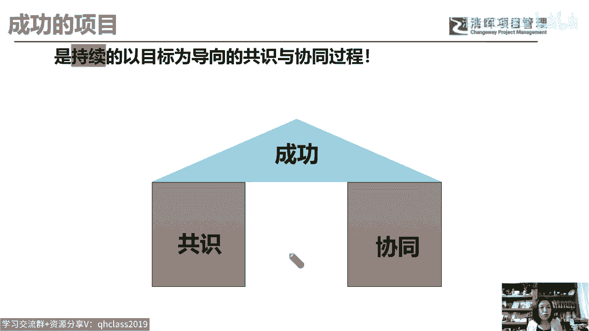

每一家公司都希望去打，打造这种高效能的矮向组织，那么它可能需要有这样一些特点，比如说我们这样的一个项目团队，我们这样的项目组织是不是能够快速应变，在应对项目中的变更，让也应对竞争环境的变化对吧。

是不是能够协作共赢，是不是能够把握关键事项，是不是能够迭代创新，那么是不是能够群策群力，这都是我们每一家企业，每一个项目团队，每一个项目经理梦寐以求的，理想的项目管理的桃花源，爱我们的高绩效团队。

那么大部分的这个管理理念啊，大部分的这个组织机构也把这样的一种压力，其实传递给谁了，传递给我们的项目经理了啊，在这个大家都可能会参与的。

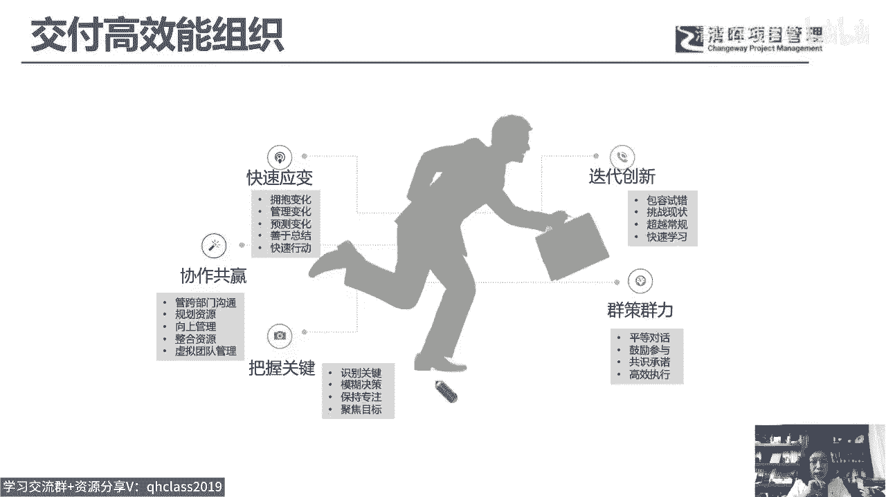

这个PMI的这个呃体系当中，PMI呢是美国项目管理协会，那么他呢一共发布了三个版本的，关于项目经理的人力模型，人才模型，这是他的第二个版本，在他的第二个版本中呢，有三个要素提到了项目管理的技术。

你得具备爱，然后你得具备战略和商业管理能力，同时作为一个项目经理，你要具备leadership i项目领导力，那个领导谁呀，咱们肯定是领导项目团队嘛，对吧好，这是他的第二个版本，那它的第三个版本啊。

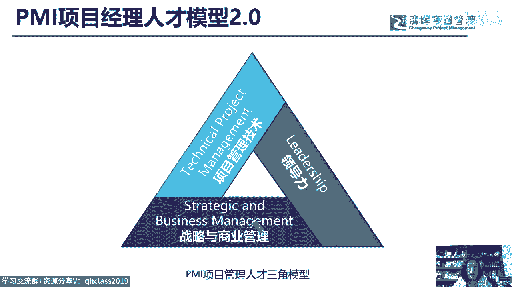

是在2022年发布的，那么它的这个翻译啊，我觉得很难苟同，他翻译的叫商业敏锐力，工作方法和强力能力，把这个power skills翻译为强力能力，我觉得这是一个笨笨的AI翻译出来的是吧。

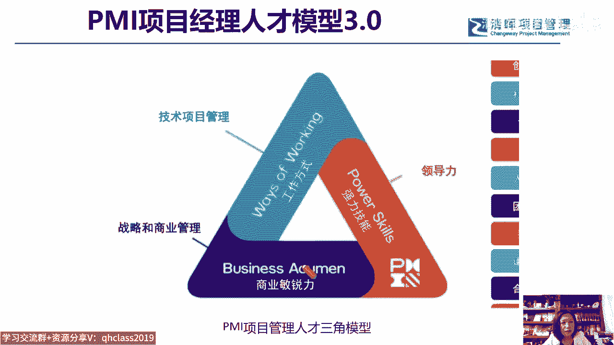

那么我自己呢调整一下，我认为可以把它定义为是交付力，敏锐力和我们的这个什么呢，这个领导力我们没有讲敏捷力啊，我觉得叫敏锐力啊，那么敏那肯定是要快，那么锐呢，那么你可能还要有这样一种能力。

唉瑞玛锐角对不对，哎，形成一种力量能够给它释放出去，所以我愿意把它叫敏锐力，那么交付力敏锐力其实跟我们第二个版本阶段，我愿意把power skills，我更愿意翻译为我们的领导力。

或者有时候翻译为这种驱动力啊，驱动力，那么这是项目经理的能力模型，也就是说不管怎么样，在非常多的这个啊标准体系哎，这个呃组织当中都要把这个高绩效的项目团队，高绩效的项目效能交付的压力。

传递给了我们项目经理，但事实上我们项目经理冤枉啊，我们项目经理太难了，是不是为什么呢，因为项目它不是一个人的战斗，他甚至不是本公司的战斗，很多的项目它涉及到了甲方，甚至涉及到了甲方的其他乙方对吧。

那么可能我们不仅要做好自己的内部管理，我们还要大量的协同和管理，我们的外部的这种所谓的stakeholder，我们的干系人，对不对，所以对于项目经理来说，只靠项目经理去做这件事情是很难的。

但是组织唉学科我们说的管理学科，包括我们的这个公司，对于我们项目经理的压力都特别的大，你看这是某一个公司啊。

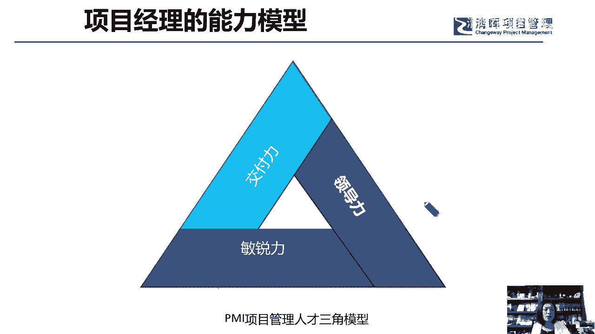

他们打造的叫项目管理领导力和绩效模型，就是某一家公司啊，我们来帮助他们去打造的，那么项目管理的领导力和项目的绩效交付，难道就真的只靠项目经理吗，或者靠项目经理就能把它做出来吗，但这家公司这么要求的。

你看项目经理，项目像高级项目经理，项目经理，项目组合经理啊，那当然项目组合经理就是属于高管性质的了啊，好，那么他们也认为，我们把这个项目管理的这个领导力唉，聚焦在我们的什么项目经理。

项目高级项目经理这样一些身份上，给他们干什么提要求唉，你在这个战略与方向上，你要具备什么样的能力，在人员和组织上，在操作执行上来围绕这三个维度，分别基于这四个层级给出了一些要求。

因为我们今天晚上大家可能不知道，能不能听得出来，我并不想把这种关于项目组织团队的管理唉，并不把项目高性能的交付，压在我们项目经理身上，所以我们就在这就不展开了啊，未来有机会专门聊一聊。

项目经理的这个领导力模型，和项目经理的这个呃，绩效管理的这个能力的时候，这张图我们再给大家展开，那么另外一家公司唉。

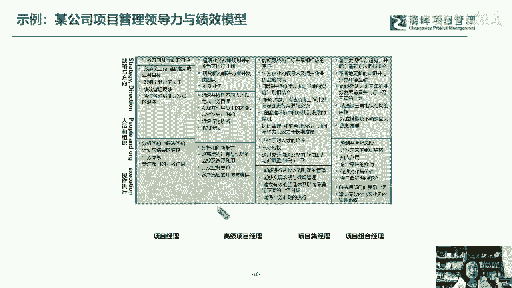

对咱们项目经理的要求是高素质，高绩效，高能力唉，高什么高潜力，那这些实际上我们也说它是一个完全正确的话，你看无边界协作对吧，哎利他父赋能这东西都是非常正确的，但是它的可操作性。

它依然定义在了和聚焦在了我们的个体驱动上，那么我们怎么去打造出一个优势团队呢，那么在我们来看看。

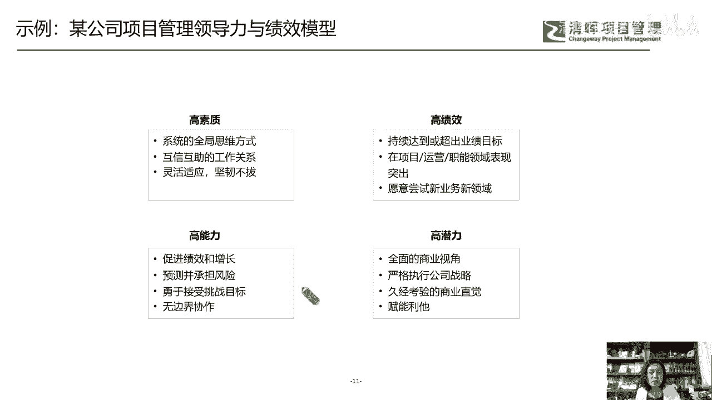

我不知道大家喜不喜欢看这个战争题材的，这个片子啊，这个我的团长我的团我是非常喜欢的，唉那当年这个我的团长，我的团，他们是这样一些看起来背景都不怎么光鲜的人，构成了这样的一个团队啊，那么通过共同的使命。

共同的这个愿望，爱甚至是有些是被逼的，对不对，无路可走了，那么依然组建了一个抗日团队，走得非常的好，走得非常的好，但是这样的成功它其实是需要去复制的，因为我们要完成一个使命，完成一个愿景。

我们要像当年在抗日战争中去实现，我们国家的这个抗日战争的胜利，他不能只靠什么，我们团队里的英雄，他要靠的是无数个我的团长，我的团能够被复制的，能够被传承的啊，那么我的团长我的团。

所以我们说呢他要靠的是一种组织驱动的力量，但是组织驱动的力量又很难很难去打造，你看我们的组织现状，在很多公司，这就是我们的组项目组织结构。

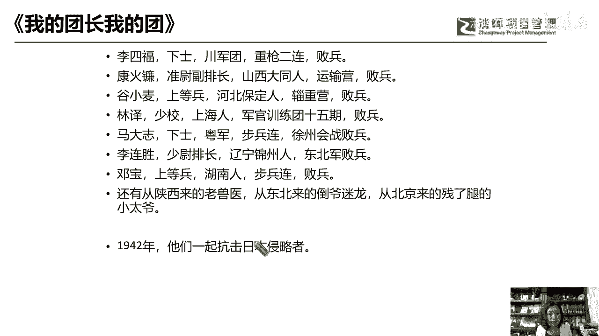

如果你刚刚考完PMP的话，那我相信你对这张图非常的熟悉，对不对，哎那么我们的组织结构，有些公司是职能型的，那么偶尔有项目项目经理或者项目负责人，这种说法，也没有明确的给到项目经理这样的一些权利。

职责能力角色的一些明确的定义，那么还有大部分的企业呢，可能是我们的矩阵型组织，那么这种矩阵型的组织中，有些项目经理能力强，有项目经理能力弱，那么那么我们说呢，还有一些可能和职能经理有一定的关系。

大家不用着急呀，关注一下我们的预告，我们今天晚上讲的这个三个模块的内容，第一个模块，我们要讲的是是当前企业管理的现状，我们正好借用了这张图，刚才我也说了，这是我们的现状对吧，那么我们基于这个现状。

我们要从pp2中给出解决方案，所以大家不用着急好吗好，那么还有一些公司可能是项目导向型的，那这个项目导向型呢，对于项目经理可能有比较哎充分的这种授权，和这个什么呢，我们所说的这种权利。

但是基于这样的一些管理现状，在我们的大部分的企业当中。

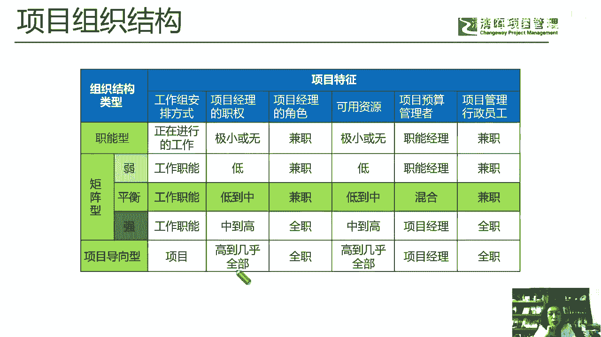