# 如何应用PRINCE2体系的管理方法打造项目管理团队 - P3：3.PRINCE2的7大原则 - 清晖在线学堂 - BV1F14y1d7ST

现在我们就来看看大家可能会更感兴趣的。

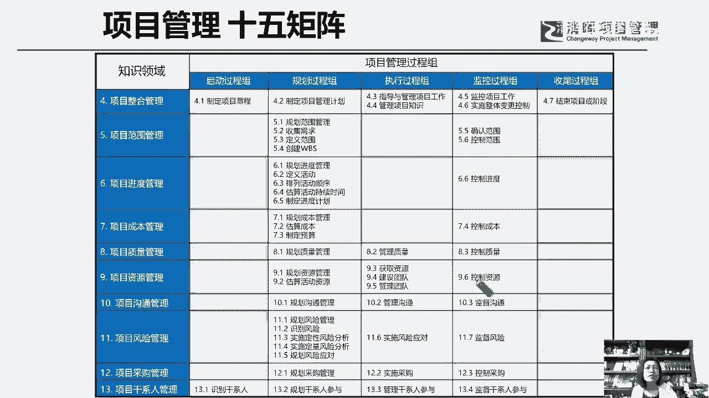

更希望了解的，从prince two的体系当中，我们怎么去打造项目组织结构，唉，怎么去打造我们的项目团队管理，这样一个模式好，那PRINSUIT体系呢可能很多学员已经了解过了。

它是来自于英国的项目管理体系，Project in control environment，如果说偏偏是5+10，那我们的prince two呢就是三七，二十一三呢代表了他的原则主题和它的流程。

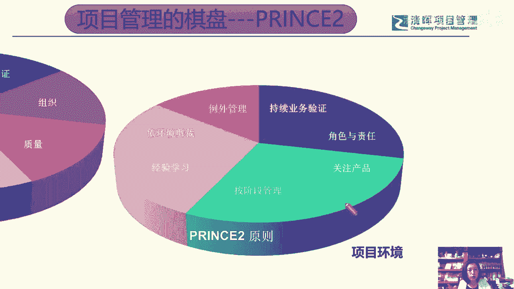

这是三，那七代表了什么，七是它有七大原则，七大主题和七大流程，那像我们今天晚上交流的这个主题，就是关于这个啊属性团队的打造，那么在他的理论原则里，有这样的原则体现在他的主题里，作为组织主题。

那么在它的流程中，又会围绕项目的组织结构中的各个角色来推进。

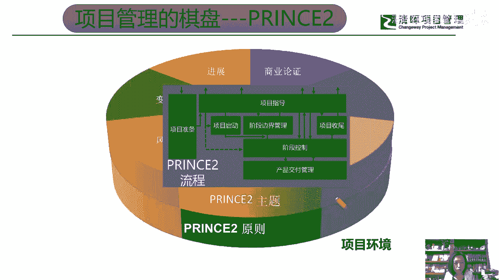

展开我们的项目管理的这个流程好，那么现在我们来看一下啊。

为什么我们说这个P2prince two啊，我们经常把P2是平prince的一个简称啊，那么为什么说这个p two，它更利于去交付项目绩效，更利于建设一个唉一个就说其利断金。

上下同意同心的这样的一个项目管理团队呢，我们先从就是plus to体系，在项目管理过程中，他的这样的一个价值体系，唉这样的一个价值体系，因为呢在我们刚要去学P图的时候，第一天第一堂课前10分钟。

我们就会看到这一页PPT，他会告诉你说P2他研究的是这样一个维度，也就是说我应该做什么，项目经理需要做什么，有人就问说这两句话不是废话吗，他不重复吗，我应该做什么和项目经理应该做什么，我是不是项目经理。

我包不包括项目经理，那么在print pp体系里，他就不会这样讲话，他讲的大部分除了sponsor，I除了sponsor发起人，大部分讲的就是项目经理在干什么，可是在P2里的第一天第一堂课。

如果大家去学P图，第一天第一堂课前10分钟就会聊到这个话题，就是我应该干什么，那很明显他不会讲废话，因为这也是一个在全球啊，就是在在这个行业实践当中，虽然在中国考偏P是主流啊，考偏T是主流。

甚至特别有意思啊，就是上周六不上哎，就昨天前天前天是周日刚考哎，这周六周六不是刚考完这个偏僻吗，然后在5月份再往前一点，我想是大概半个月左右吧，3月份的考试成绩出来了，然后考试成绩出来之后呢。

然后我们P2的学员，也拿到了自己的P图证书啊，然后特别有意思的，就默默的说了一句，说朋友圈里都在晒偏批证书，好大的阵仗，然后我的一个学员就在在群里嘛，大家就很开心的就说了一句话。

说这个事儿不要羡慕咱们都经历过，因为他们都是去年考过了PVP，这次来考P2，但是p two这个事情，因为它还相对在中国这个市场呢相对比较少众，但是我想说的是，在全球范围内，P2的管理模式和管理方法。

是全球应用最广泛的，就在企业实践应用中，这是最广泛的，这不是我的个人语言啊，这是官方官方说法，官方统计数据，所以说呢在P2体系中，他的我不是指项目经理自己，它包含了项目管理委员会，项目主管，项目经理。

项目小组经理，项目保证，项目支持，唉，还有卓越中心，还有变更管理委员会等等，这些不同的项目管理角色，那么在我们的项目当中，唉应该去做什么，不能说白考，千万不要这么讲，老师最喜欢说的一句话，今天没有说。

因为很多学员都听腻了，说老师你不要老说那个话，但是我觉得正确的话还是要说一下，就是偏僻和price two是我们的倚天剑和屠龙刀，我自己服务的很多企业，我们去帮他们去建立pp的是PO的时候。

他们希望我们去推荐一些as，在从你们的学员库里头啊，或者郭老师，你认识的向经理，有没有愿意做偏偏猫工作的人员，给我们推荐的时候呢，基本上他们都希望能找到至少拥有P2和pp，双从证书的这个学员啊。

一定不白考这两个体系，它不一样，它不一样，好吧嗯都有它的价值，那么学是学的回报，相信自己，那么我们刚才说我不仅是一个人啊，那么它还包含谁呢，它还包含了我们刚才说的这些角色。

同时我们还要明确项目经理要做些什么好，那么当像没有按计划做的时候，需要做什么，这个需要做又不是你一个人了，是我应该做出什么样的决定，那这个我又不是像经理自己是每一个决策角色，他都应该做出什么决定。

那么需要做决定的角色做决定，那么不需要做决定的角色，你必须或者你需要提供什么信息，还有在我这个角色上，我是项目主管，我是项目管理委员会成员，我是高级供应商，我是高级用户对吧，我应该从谁那里获得支持。

获得指导，然后怎么去运用它，所以这是我们提到的啊，这是我们提到的一个什么呢，我们所说的关于presume体系，在他这个体系搭建的过程中，他就没有远离，每一个人都要去奋斗，每一个人都要去付出。

就像我们最常见到的一句话，叫做什么呢，叫做什么，这个社区是我家爱，人人都要爱护他，类似于这样一种感觉，在项目中一定不能靠，或者也真的靠不住，我们的项目经理，一个人不是我们项目经理不行，是有这个理念。

它是不现实的，它是实现不了的，它就是一个什么呢，它就是一个撞运气的过程，做好了嗯，我们的项目经理也没有被评为英雄，装不好了，项目经理拉出来示众对吧，这就是我们提到的啊。

我们提到的那么plus two体系，从他构建这个管理模式的时候，他已经把这个角色责任，权力分工都已经安排好了。

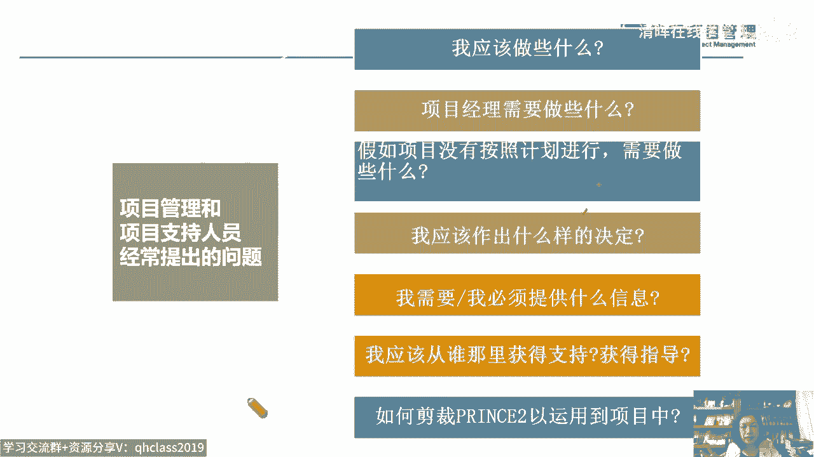

那我们再来看看这个项目朴素体系，关于项目的特点，那么我相信这张片子大家更熟悉是吧。

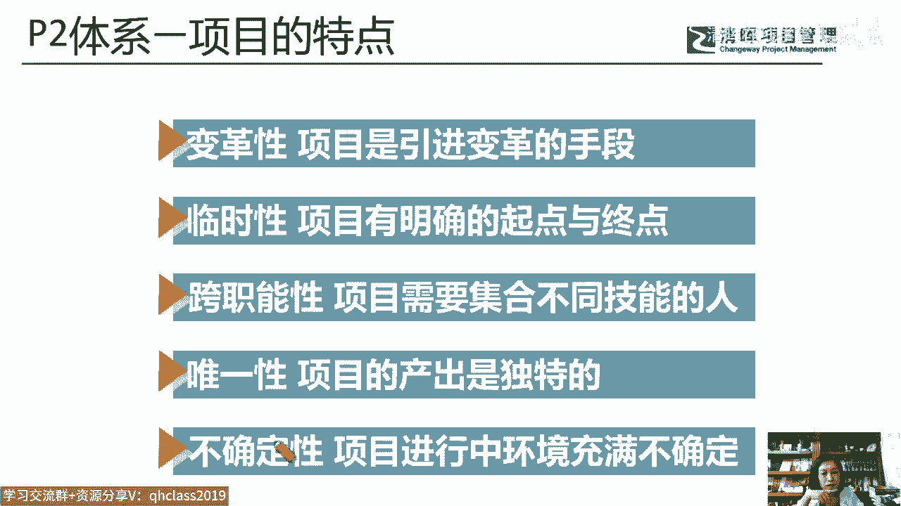

刚考过偏僻，那么临时性独特性，还有人说剑姬明细，这个够吗，并不够，对不对，唉在我们的pp体系中。

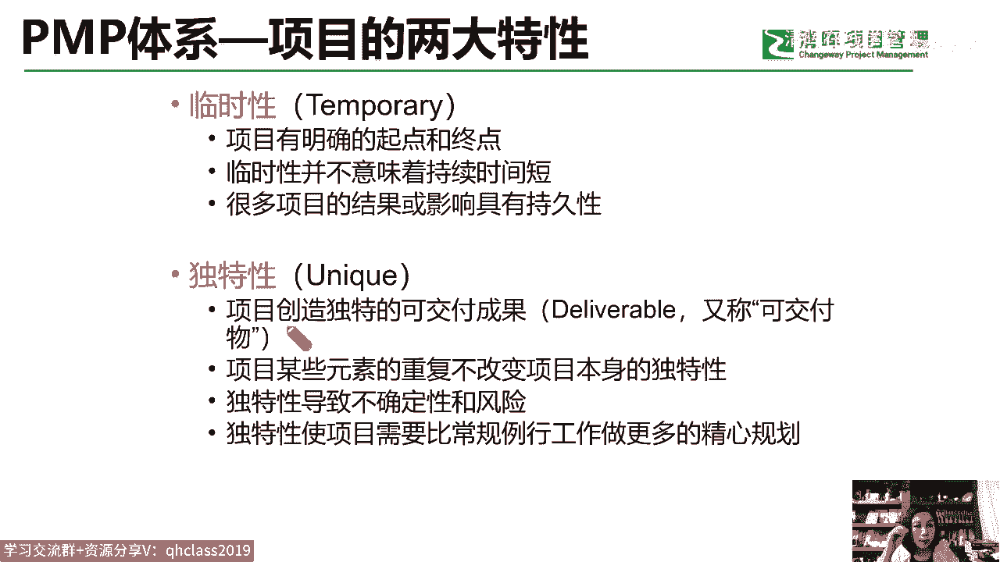

paper粗体系中也有关于这个什么呢，也有关于项目的这个定特点，那么它关于项目的特点就讲了项目的变革性，就项目一定会引发变革，有人说老师变革这个词太大了，好变化，变更变革都是我们项目的一个起因。

那么临时性好，这个我们知道的唯一性I不确定性，那就上代表了风险，但是这一点我们觉得他又讲的特别的好，我们想问一下你们的项目是不是跨职能的，是不是啊，唉基本上是大部分的项目都是跨职能的。

那么这个是一个很典型的特点，那这个特点我们得重视，如果我们不把它明示出来，我们可能就忽略了它，我们忽略它不代表它不存在，因为跨职能它就会是我们的管理难题，它就是我们的管理挑战，那我们怎么办呢。

我们就要给出管理方法，所以这就是我们所说的P2，为什么说它非常的先进，你看他在这个项目的这个项目，管理的这个模式和分工的构建上。

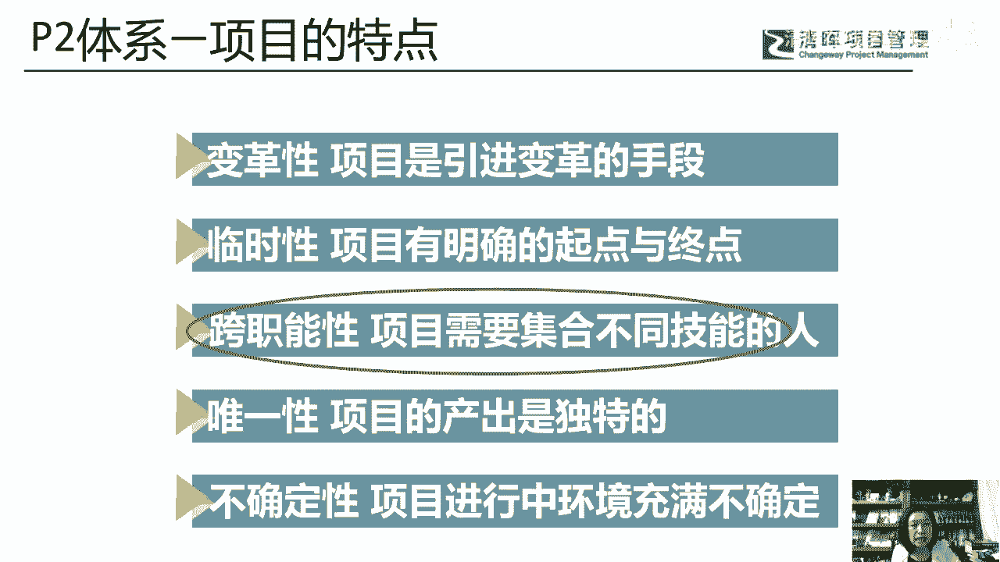

它就明确了，不是一个人在独孤求败，不是一个人在偏向虎山行，是大家都要做什么，是大家都要去承担责任，做决定，提供信息给予支持，获得指导对吧，另外项目不可避免的要面对我们的跨职能性。

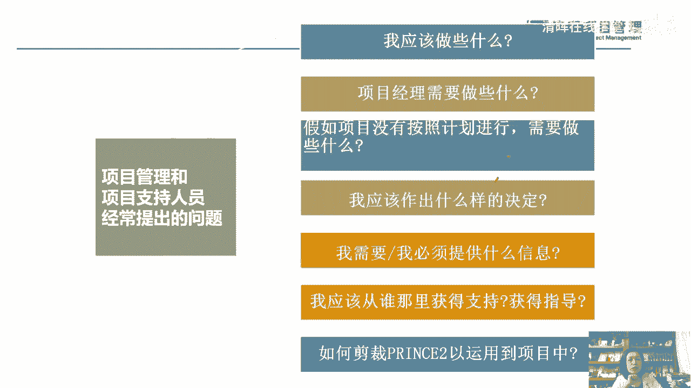

好面对我们的跨职能性，那么我们来看看关于项目经理的定位。

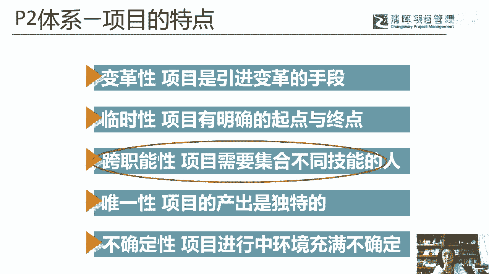

在P2体系里头，他说项目经理是管理项目计划的人，那么管理项目计划需要干什么，考虑到充分的授权，而像two的目的，就是要让正确的人，在正确的时间获得我们所说正确的这个信息，来做出正确的决策。

所以他不是一个人在战斗啊，在我们整个的项目柏林体系中，一定不是一个人在战斗，是一群人在战斗，是我们而不是我，是我们在战斗好，那么这是我们关于项目经理在体系中定义。

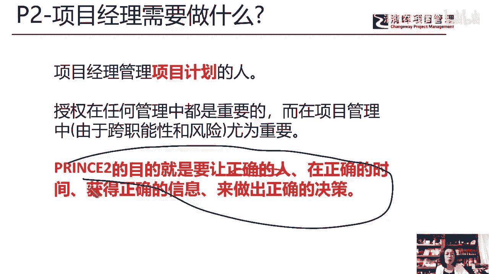

但是你看唉这个peter篇pet系列，他说的是由执行组织，委派领导团队来实现目标的个人项目目标，仅靠我们项目经理去领导，大家就能把它做好吗，太难了对吧太难了，唉所以为我们项目经理定义了这么多的角色。

可是最后项目的成果的交付真的像拆盲盒一样，拆盲盒一样，这就是我们提到了啊，关于当前企业中的项目管理的这个组织结构啊，团队问题的现状啊，以及在不同的管理体系当中，尤其是偏僻体系。

我们大家都学过的比较熟悉的爱，他在项目经理的这个要求上，那么在管理项目团队这件事情上给到一些说法，那么现在让我们正式的来看一看。

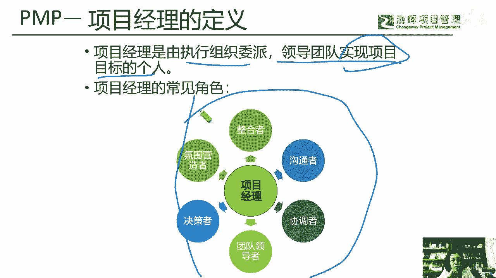

对于我们的项目团队的这个组织结构的搭建，对于项目这个团队的管理，那么P2给出了怎样的一个解决方案啊，也就是它的一个体系好，那么我们说呢，首先刚才我们提到了P2体系，我们把它叫做我们的这个屠龙刀。

那么他强调了我们的管理原则，我们的管理主题，我们的管理流程，然后基于你的项目环境，那么对七大原则，七大主题，七大流程却发挥作用而产生价值，那在这种情况下啊，在这种情况下，我们来看一看。

首先我们来找一下和我们的项目团队管理。

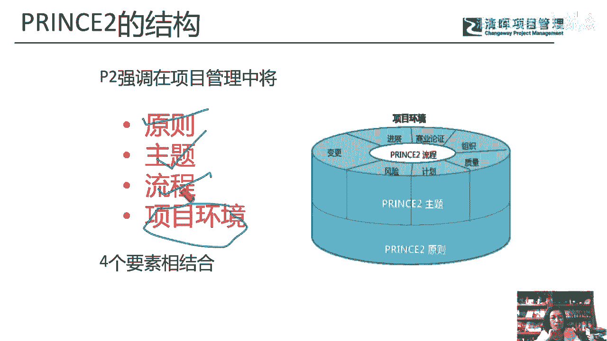

和项目的组织管理有关系的啊，有关系的这个什么呢，原则七大原则中它有持续业务验证，这个其实就是我们的商业论证有关系了，经验教训，组织过程资产有关系，我把它转转化为我们偏偏你们习惯的语言啊。

那么按阶段管理哎，这句话我们在偏僻的这个第一章里，是不是讲到了哎，另外一个管理这个词在没有提到的，那么关注产品这个词也没有提到，根据项目环境裁剪，这个又提到了啊，好那么和这句话，我们刚才没有讲。

和我们的这个项目的团队打造，和组织架构的这个管理，和项目高绩效效能交付有关的是这个原则，什么叫原则，是我们必须去遵守的，就像大家说我们现在学敏捷哎，考PMP都学了一部分的敏捷知识对吧。

还有一些公司呢开始做敏捷，做敏捷肯定要学习一下这个敏捷的原则，当我们接受或者接纳，或者引入了一种新的管理模式的时候，我们首先得知道它的规则，它的方法，它的标准对吧，那么敏捷有敏捷原则。

那么我们的prince to有prince to的原则，其中一个原则就是，你要为你的项目去明确定义角色和职责，好明确定义角色和职责，那么这个明确定义的角色和职责。

难道仅仅是PNP中提到的sponsor是干什么的，嗯我们的stay holder干系人是干什么的，以及我们的项目经理干什么吗，不这个太什么太不丰富了啊，您说的有什么区别，是什么意思，指什么呢。

什么有什么区别啊，我没没没理解这句话，欢迎大家随时提出问题互动啊，随时提出互动好，那么我们来看一下，什么是明确定义的角色和职责。

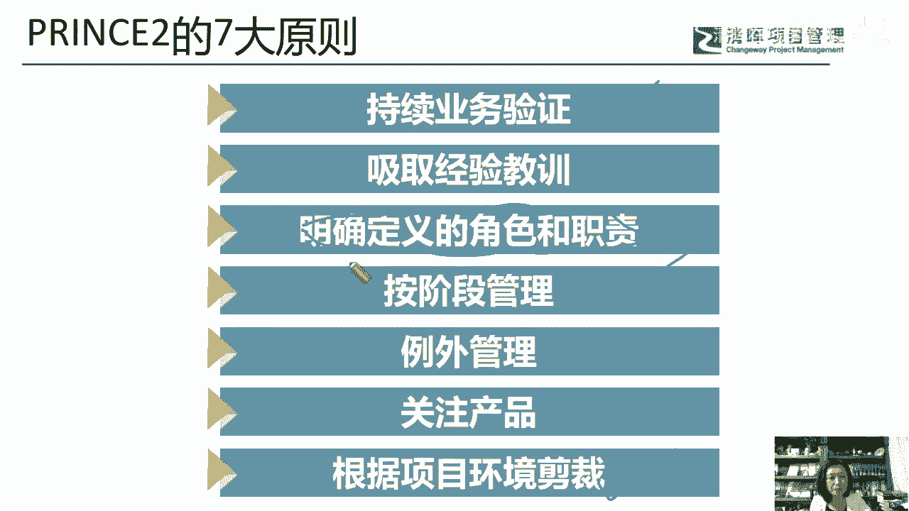

来看看，那么在P2用P图方法管理的项目。

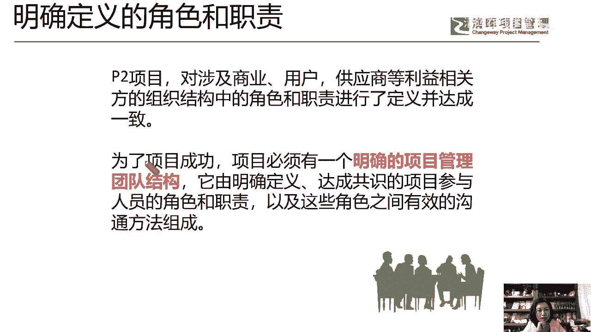