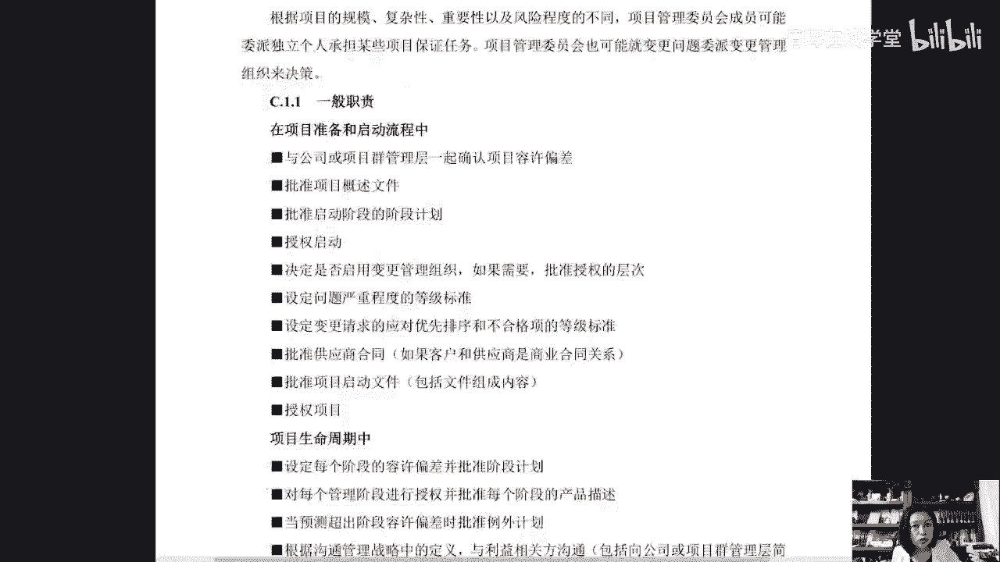

# 如何应用PRINCE2体系的管理方法打造项目管理团队 - P7：7.卓越中心) - 清晖在线学堂 - BV1F14y1d7ST

既是成员又是裁判员，但有人说老师，那如果我们项目总管有经历，他自己可不可以担任项目保证这个职责呢，是可以的啊，是可以的啊，我们的这个高级供应商是可以的，高级用户是可以的啊，他作为供应商代表，用户的代表。

嗯好这个是项目支持，那么卓越中心这个角色，它其实呢相当于我们类似于你说的偏猫了，我们看看啊，这是一个定义标准的，给许多项目在偏僻，这不叫多个项目提供技能培训，以及可能的爱独立保证功能的中央标准单位啊。

好我们给大家看这本书啊，这本书在我们清辉能买到的，咨询一下我们的这个啊班主任，或者是咨询一下，我们这个这个你自己的这个课程顾问，叫哈佛商业评论的单单行本就是项目管理手册，大家都知道哈佛商学院。

哈佛商学院有一本自己的杂志，还有中文版啊，叫哈佛商业评论，那么刚专门为项目管理出了一本书，这本书的翻译者呢是我们的付老师啊，罗德里格斯写的，还挺有意思的啊，我刚讲完这本书，145月14日28。

那个也可以看回放的啊，那个可以看回放的，如果感兴趣可以咨询一下好，那么我们来说，那么卓越中心服务于所有项目的中央文档系统，那么定义标准I配置管理系统估算，把专业知识计划的建议。

历史数据库向所有项目的综合报告，P图方法的专业技能，所以这个类似于你们所说的IPO了啊，PO这是我们提到的，这是我们讲到了这个组织角色，所以大家回顾一下，你们注意一下，在整个p two体系中。

基于我们的原则，他提到了一个项目，不是项目经理一个人独孤求败啊，不是我们所说的什么呢，不是我们的这个项目经理一个人，这个偏向虎山行啊，偏向虎山行，那么我们说他是由一系列的人，从我们的项目管理委员会。

从我们的项目管理委员会中的项目主管，我们的项目高级供应商，高级用户，他们是代表啊，然后从我们的这个项目保证项目支持，项目经理，项目小组经理变更管理组织和卓越中心，所以你看这是一个大部队对吧。

唉这是个集团军，他在作战，那这样你的项目项目结构像像像能不能保证啊，还是可以的，那么除此之外，在我们的这个P图体系中也提到了，就是有一些人员和团体，它可能不是我们项目管理团队的一部分。

但他们与我们项目存在互动，受到我们项目和成果的影响，我们把它叫stick，Stick holder，叫干系人，或者我们把它叫做利益相关方，那么这个呢是我们常规的啊，我们常规的这个利益相关方的这个管理。

是个人担心的管理，我们考过P区都知道，如识别它，分析它唉，定义单性管理策略，制定单行管理计划对吧，然后去评估管理的有效性，日常规的，那么嗯你说p two老师讲了一晚上了，说他这个先进，那么先进。

大家有没有注意到，我们刚才讲到这个事情的时候，他有一个点没有讲到，有没有人能想到他是一个集团军作战，他去挑那些适合承担这个角色，这个岗位，这个权利，这个责任匹配这个能力的人。

但能力在我们这个项目团队组织中重不重要，你担任项目主管要不要能力，你担任这个项目，这个项目经理要不要能力要的，那么这部分我们说呢他呢通过什么来体现它呢，通过这种在你的管理组织主题中。

每个人对这个事儿干什么，他就明确出来了，你比如公司在组织层面上，打造一个项目管理组织，你得干什么，你得正式任命项目管理项目经理，你得按照沟通管理战略的要求，向指向项目，向下释放相关信息。

项目主管被任命之后，由他来任命，向经理确认项目管理团队批准沟通管理战队，我们的用户在提供用户资源，定义和和验证我们的需求，那么我们的高级供应商提供我们的供应商资源，项目经理来制定我们的沟通管理。

战略评审和更新，共同管理战略评审小组团队，然后小组经理I项目保证项目支持，那么在我们的七大管理主题中，这些人就是一个集团军，这个集团军的每个人，在我们的商业论证还要干什么，在我们的计划这个主题上。

你要做什么进展，主题上，质量主题上，风险主题上变更主题上要承担什么责任，他都给明确说出来了啊，他都给明确说出来了，在哪里说的呢，在我给大家看一个，就是刚才不是说过了吗。

就说在我们整个的偏僻的print的这本书里头啊。

在我们print的这本书里头，那么他有半本书都是附录，我们给他看一下啊，这本书没有我们的天报和后，一共这本书273页，那我们273页的这本书呢，从我们的这个208页开始，I就是附录，附录A是产品描述。

它有二十九二十六个什么呢，管理产品。

这六是26，管理产品就是模板，从收收益评审，商业论证到沟通管理配置管理，那我们的项目计划它又分为了我们的项目计划，阶段计划和小组计划，然后我们的产品描述，项目的概述文件，启动文件，产品描述。

质量管理战略，风险管理战略，还有工作包，这个叫基准类的对吧，你看你在那个p two p p体系里，大家还记得偏僻，讲计划的时候，是不是讲了三大基准，还有九个支持计划范围管理计划。

进度管理和质量管理员分享管理教资，担心人管理计划，沟通管理计划是吧，资源管理计划，但那个计划长啥样，不知道，只是告诉你哎你要规划范围，规划进度，规划成本利率生成这个计划，这个计划长啥样，咱不知道。

但是在P2体系中，从从这本书的203页开始啊，就把所有的这个东西全部给大家体现出来了，这个叫基准类的，他把叫产品，这个叫管理类的产品啊，不是我们的代码呀，不是我们具体的这个产品叫管理类的动作。

生成了管理文档，叫管理类产品，还有记录类的，对不对，我们经常在偏僻中提到了一个一，在我们这个范围管理一章，我们提到了一页，而不是在这能在4。2这里，像管理计划里头提到的计划类的东西和文件。

什么这个文件那个文件，可那个文件长啥样，咱不知道，那么怎么办呢，在这里有它有什么配置项，记录长什么样，日志是什么问题，登记单，经验教训等，极端质量等，极端风险等极端检查，这叫记录类的文档。

还有报告类的什么检查点报告啊。

我们的检查点报告，竣工报告阶段报告例外报告要点报告问题报告。

经验教训报告，产品状态陈述，它都长什么样，后面就一个了，你看这收益平整计划，这个计划的目的是干什么，它由什么来组成，就是我们提到了整个的啊。

我们的这个一个附录，那这个附录我就不一给大家展开了，我其实想给大家看的是什么呢，后面这个东西啊，它的速度C我们来看一下啊，这个还比较多哦，快点压过，这个都不看了啊，你们到处学P图的时候，就会有这本书的。

后面它有26个魔法，第二这个模板后面呢我来给大家讲一下，我真正要说的和我们的组织有关的啊，和组织有关的内容，大家来看一下啊，这一页内容，对呀，这一页就是我们所说的夏目角色哎。

不光是我们刚才讲的这个内容啊，他有很详细的这个内容，你看对于我们的管理委员会得有吧。

他的一般职责在项目准备和启动流程中，他的职责是什么，在我们的项目生命周期中，它的职责是什么。

妈妈你还得具备什么，你还得具备的能力。

你不能说随便来个人家干这个事儿，是不是唉，那么成功的项目管理委员会你应该具备什么呢，对那C2就是我们的附录中，附录C就是关于角色的职责的，那么我们的项目主管唉，我们的项目主管，那么他对项目最终负责。

你看这是被约定出来的，对项目最终负责，那么他的角色是确保在项目在生命周期中，始终去关注我们的这个啊，实现向目标交付产品，获得我们的预期收益，同时呢他也约定了哎那个叫什么。

你的这个职责，还有你的什么呢，你的能力，那接下来是我们的高级用户啊，是我们的这个什么呢，他的职责，我们的高级供应商，他的这个职责，高级供应商他的职责，然后呢接下来是我们的什么呢，向经理爱他的一个职责啊。

他的一个职责，也就是说我们就不一给大家展示了。

我们想说的是什么呢，在我们学P图这本书中，为什么它在全球用的更广泛，你发现每一篇报它叫知识体系知识，它就是一些扁状的散的知识，那你今天要做这个事的时候，你要把它落下去的时候，怎么落呀，怎么干呢，对吧。

唉你这个项目管理团队怎么搭建呢，大家都承担什么责任呢，需要具备什么能力呀，以及在你具体的这个流程里头，对不对，在你具体的这个流程里头，你的启准备项目，准备你的项目，启动你的项目，这个项目这个什么呢。

产品交付边界管理阶段控制对吧，项目收尾，项目指导这些流程里，这些角色他都得干什么活儿，唉都是非常明确的啊，我刚才说的这本书是crystal的教教科书啊。

crystal我之前说的那本书是这个是哈佛商业评论，就咱们PP考试的这个这个鼻祖哎，这本书综合了plus two和偏僻的很多做法，来告诉我们怎么去管理好这个项目，蛮有趣的一本书啊，我们5月份刚刚讲完。

这本书也给大家预告一下，就是从2月份到12月份，我会给大家讲11本叫项目管理小书房，每个月一本书，一个月两次，每周一呃，嗯两周每周一次，两个，每次两小时啊，大家感兴趣可以咨询一下，可以可以单次购买。

也可以这个批量购买，就是很便宜了，就是我替各位太子读书啊，你咨询一下我们这个上面有链接，上面有链接啊，专门讲了这本书，这本书特别有意思，我觉得还是很有意思的啊，这是我们的一个系列课程，一年22期。

22期我们之前的回放也能看到啊，6月份我们会讲这个什么，6月份会讲这个新的课程好吧，感兴趣可以了解一下，这就是我们提到的，在P2体系这本书的附录里头，附录C他给我们讲了各个角色的职责啊。

各个角色的这个职责和他的一个管理关系，等等啊，这些内容，那么有没有人发现在批注体系中，他还是有一点小小的这个局限性的，我们说任何一个管理管理方法，管理原则啊，据我们既会说唉这个垃圾是这个什么呢。

嗯叫什么叫放错了地方的资源，我们会有这种说法，对不对，但是我们还有一个说法是什么，说任何一个管理理念管理方法，他也都会有它的什么局限性对吧，也会有它的局限性，那这种局限性在哪里，就是p two啊。

他很什么很自觉，他很很谦虚，也很务实，我给他找一找啊，大家说到他自己说到了他的一个什么呢，一个在他提出以后，他很明确的告诉你说我不干什么，就把自己干什么和不干什么，这个事儿他都给咱们说了，特别有意思啊。

我们来看看他不干什么，他不讲项目的什么领导力唉，他不讲领导力，所以他这里提到的就是说，我们P2不涵盖领导力的内容，领导力激励和人际交往能力。

在项目管理中也很重要，那么我们认为我们这本书我是不讲的，但这事儿重不重要呢，重要也就是说我们需要什么呢，我们需要驾驭这样一个管理模式，还是需要领导力的啊，他虽然明确了我们的项目计划，这是P图啊。

像P图计划跟偏僻的计划也是不一样的，偏激是我们的三大基准，加上我们的九个管理型辅助计划，范围进度成本质量风险，采购干系人沟通资源，然后加上五个支持性的计划，什么需求管理的管理计划，配置管理计划。

变更管理计划，过程改进行收入管理计划，过程改进计划是第四版，第五版的片报告中有的，那么这个收益管理计划，他在第六版新增的是作为正也像启动了输入，但是他没有放在计划里，我把它放进去了。

因为我们给很多公司来做这个咨询服务的时候，他要打造一个进化体系，我们是呃一横一纵纵的呢，就是p two的模式项计划，有些公司呢会把这个叫什么呢，叫一级计划啊，会把它叫一级进化，会把它叫一级计划。

那么二级计划三级计划，有的公司呢还叫A类计划，B类计划，C类计划就叫重，那横是什么呢，横就是偏低的，我们的范围进度成本质量风险才爆发器人，然后我们会借鉴一些偏偏僻更好的点，留下了过程改进计划。

虽然第六把它删了，但有些公司认为这是好的，还有收益管理计划也要加进来，收益管理和商业论证，价值分析这件事情在偏偏批中是被大大弱化的，这是偏激的一个什么，我们只看到一个一个局限性了啊。

那么他的计划是它的一个管理主题，他的计划管理主题中，它项目计划哎，这个责任主体在管理员会阶段性的计划，责任主体在向经理小组计划的，责任主体在小组经理，所以他这三个层级啊，不是说虚的，不是说不落地的。

是你的责任，你的权利，你的能力都是要匹配的，你你在哪个点上发力，你管什么事儿，你交付什么，他都是给明确出来的，另外呢在他的管理原则中有例外管理，那么在日常的工作中，在工作包层面上。

这是小组经理约定的管理的对象，对每个工作包的交付，你在你的允许偏差范围内，你来管理，超出偏差范围，你要通过检查点报告，还有明确的报告模式啊，这个有模板的，在我们的附录里，你有明确的报告向项目经理去报告。

那么项目经理在阶段内做管理，那么你的授权是阶段内的，超出允许偏差，项目经理去编制问题报告，然后向项目管理委员会去提交，那么我们的这个什么呢，项目这个层次，那么如果这个偏差被突破。

我们的管理委员会向公司去报告，作为一个例外报告去提交，所以你看它的管理原则和他的这个管理主题，比如计划主题，组织主题是一一匹配的，而这些匹配点又落地在了他的七大流程，所以这就是我们整个P2。

基于我们的项目绩效，我们的项目管理的这个什么呢，关于我们的这个项目，组织架构和项团队是怎么搭建的，怎么分工的，它的整个的一个模块，那么还有不足的地方，他虽然说了也要关注干杏仁，但是我们去天梯里捞一捞。

从敏捷里捞一捞，能够去加持p two这个模式的一些点啊，我相信很多学员都已经很熟悉了，这个图考过偏僻的学员都知道，只要担心参与度评估执政，那么虽然我们有管理委员会把职责分工了，把这个责任明确了。

授权明确了，但是我们这几个层级偏僻，你可以说没有提，但这个点特别好，就一定要明白啊，这个世界上人有千面，世有万象对吧，我们说见过世面，不是说一定要建什么奢侈品，是你见到了小麦子在下雨的时候。

如果不能及时抢收，它就会倒伏，它就会发霉，它就会烂在地里，就是这几天我们最不愿意看到的现象对吧，我知道这件事情，我知道我分得清有无骨，我可能也认识一部分生食品，这叫做我们所说的建国10年。

那么我们会知道有人支持我们的项目，我们也要想到有人可能不支持我们的项目对吧，那怎么办，我们就要去想办法让他们支持我们这个项目，所以要做干性参与度的评估和关注，那么在我们这个项目过程中，我们去捞一捞啊。

虽然plus two他没有讲这个领导力，但是这个领导力必须得存在，所以对于我们项目经理来说，在运用P图方法的基础上，在企业应用P图方法的基础上，还是要具备这个团队管理技能的，要善于倾听，要有冲突。

管理能力，要有文化意识，要有会议管理能力，人际交往能力，政治政治平衡的重要性啊，那么如果我们在P2的基础上，又能够掌握这些领导力，塑造打造领导力的点，比如说团队章程，基本规则的尽早制定啊。

能够知道一个团队必然会出现震荡的，必然会出现冲突的，必然会出现矛盾的，那么在我们需要去打造自己的领导力，那么基于p two的这种冷静的管理模式。

组织架构在加持上我们所说的这个领导力，那么再去取点经，取点什么。

