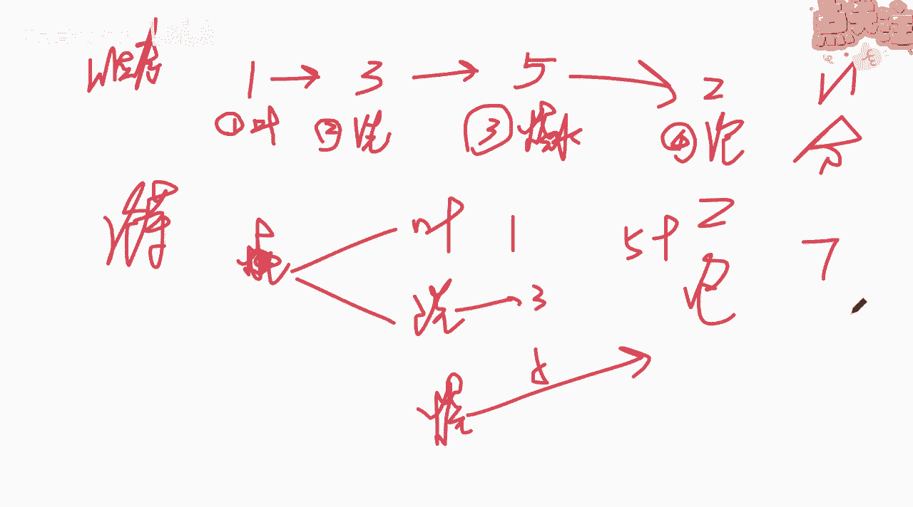
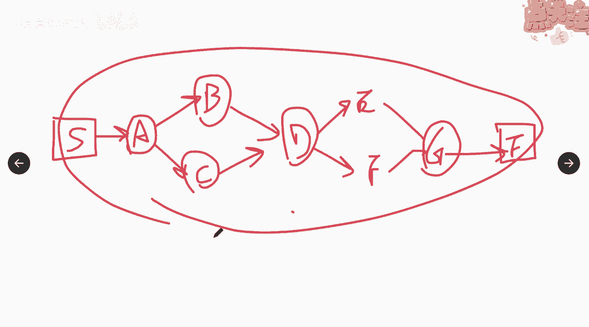
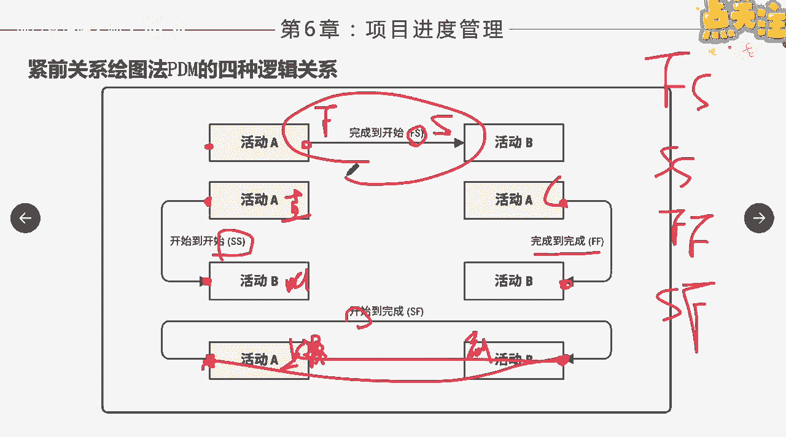

# 如何排列活动顺序（上） - P1 - 项目管理陈老师 - BV1HA411C7QZ

那得到了过经过了这个呃过程之后呢，我们就来到了第三个过程，第三个过程叫做什么排列活动顺序啊，项目进度管理的第三个过程，排列活动顺序，规划过程组啊，那我们先来再举一个例子来说一下这个事情啊。

为什么要对它进行顺序的一个排列，顺序的一个排列，我们说做事情啊都有一定的先后的顺序是吧，比如说我刚才我举的那个例子，泡茶嗯，泡茶好，一般来说我们有几种是这个这个这个过程啊，这个这个叫做顺序。

首先第一我可以拿拿出茶叶是吧，第二呢洗茶盘，茶盘很久没用了，我要洗一下诶，洗茶盘，第三呢我开始什么呀，进行烧水，水开了之后，我就开始什么呀，泡茶啊，好我们这边说拿茶叶需要一分钟。

洗这个茶盘我需要三分钟嗯，烧水我需要五分钟啊，泡茶呢我可能需要两分钟好吧，那么最终你得到的是一杯可以喝的茶，那么如果按照这样的顺序下来啊，大家看这样的顺序下来，你几分钟1+459。

你11分钟之后是可以喝到，喝早茶，你得到的可交付成果，但是呢如果我们按照第二下面这种方法来，我一开始我先烧水诶，烧水的过程当中呢，我就做两件事啊，拿茶叶同时洗茶盘，这个烧水啊，烧水同时这三个是同时开。

同时开始的啊，这边也一方面这个这个不能写在这啊，这个应该写在这是这三个事情呢，我一边在烧水的时候，让一边来进行哈，然后呢大家看烧水呢需要五分钟对吧，那你洗茶叶，你水放着让它烧，你就不用管了嘛。

你就可以去洗茶盘，对不对，三分钟是吧，完了这个茶叶完了之后呢，希望需要一分钟好，那你这三个活动呢，这两个活动在这五分钟里面就完成了，等于说你水一烧开，你就可以直接的什么呀泡茶啦，对不对啊，泡茶了两分钟。

那这样完之后呢，你等于是怎么样啊，等于这五分钟加上两分钟，等于说啥，七分钟你就可以喝到一杯茶了，是不是这样，是不是这个道理对吧，那所以说你看排列活动顺序啊，对于项目的进度嗯，影响还是挺大的。

是不是还是挺大的啊，所以我们要对活动进行一个顺序的一个排列，顺序的排列，那么它就是识别和记录项目，活动之间的关系的过程，它的作用是定义工作之间的逻辑关系，这里面的工作跟活动是同样的意思啊。

大家要明白活动跟工作一直一样啊，以便在既定的所有项目制约因素下，获得最高的效率，你看我们在这个过程当中就是要效率啊，比如说我们对于做做我们的泡茶是个小项目，那如果说对于做其他的这种大项目啊。

因为做做做工程还是做信息化项目，还是做金融项目或者是个广告项目对吧，他的逻辑关系就非常重要了啊，尤其是说比如说装修啊，很多人说装修呃，要急着要要要要搬家嘛哈假如是要搬家好吗，好他会怎么样呢。

办公室要装修，急着要办办公室，那么我们之间的逻辑关系就很重要了，你是把所有的事情全做好呢，然后再开始买家具，然后再雇那个还是怎么样，或者说你可以调整一下啊，装修地板硬化完之后啊，墙面做好之后。

我就可以开始进家具是吧，一个是活动是可以并行的，那这样我们的效率就会得到很大的一个提高啊，这就是这个过程的一个作用，那么在这个过程当中，我们还要输入哪些东西啊，要输入哪些东西啊，我们刚才有讲过了。

进度管理计划是吧，肯定是要的，你怎么来衡量进度的，第二范围基准也是要输入进去的，还要拿到上一个过程的几个输入的文件，叫什么呀，活动清单，活动属性，里程碑清单，假设日志你拿过来哎。

然后呢我们通过这些方法啊，所以这个过程最重要的是，掌握这些工具跟技术啊，比较重要，好吧，来首先我们第一个要讲到的是颈前关系绘图法，叫pdm，那么这个一定是确保大家都要掌握的啊，不难啊，很很很简单。

我觉得大家可能现在都会画啊，这个是一定要掌握的啊，因为在考试的过程当中呢，他不会叫你画图，但是呢他会需要你通过画图，去找出一些活动之间的逻辑关系，比如找关键路径啊啊啊推算他们的这个什么。

这个这个叫叫叫总浮动时间啊，总时差呀或者自由浮动时差呀，那你就必须要有这掌握这个绘图方法也很简单，这个这个绘图方法很简单啊，我们可以简单说一下啊，如果大家明白了，我们这里面只要掌握一种。

他这边说了好多种啊，有一种叫单代号网络图是吧啊，也有这种叫双代号网络图啊，它叫什么呀，叫p dm节点法a o n啊，也叫间线图啊，a o n间线图箭头跟线啊两个连在一起，间线图。

那么它的一个继续的伏画法是这样子的，一开始呢我们会先项目的项目开始，这边我们先画一个框是吧，项目从这里开始，然后呢，最终这笔项目在这里什么呀，结束啊，我们这个等会结束的时候再画项目，一开始啊。

假如说项目一开始我们先做一个活动，叫a啊，我们也用框给它画起来啊，这是线，这是剑a，做完呢我要做，c嗯这两个，bc做完我可以做什么，d做完我又做另外两个啊，比如说e，f，ef做完做多少，做句句。

做完项目结束啊，那这就是一个最简单的单代号网络图啊，然后呢等一下我们马上会讲到a活动跟b活动，a活动跟c活动之间，或者b活动跟d活动，d活动跟c活动之间呢，它们有一个关系，我们正是基于这种关系啊。

或者是逻辑的关系，我们能画出这样的一个界线图，或者叫单代号网络图，他们的关系有哪几种呢，第一种叫做什么呀，紧前活动啊，紧前活动也就是在路径当中呢，排在非开始活动前面的活动啊。

这句话非开始活动开始活动在这对不对啊，那非一开始活动，就是这个这个跟这个都叫做紧前活动，那么紧前紧后它是相对于相对来讲的啊，比如说a和b a相对于b来说就是它的什么呀，紧前活动是吧。

紧前紧挨着它的前面的活动啊，那么今后活动呢也就是说在某个活动之后，相对于a跟b来讲啊，b是他的紧后活动，所以紧前紧后它是相对的概念啊，相对概念，那这种相对呢并不一定是什么呀，并不一定是叫做什么呀。

一对一个一个活动对应一个活动，比如说我们看这张图对吧，相对于这个这个我们说h这个活动来说，它是c和f的什么呀，还有i的紧前活动，对不对，紧前活动是不是相对于他们来说，是他的金钱活动，那么另外也是一样。

或者说我们可以这么拍h的紧后活动，它其实就有三个紧后的活动，k的紧后活动有i和l是吧，所以紧前紧后看，它反映了之间的逻辑连接关系啊，表示实施活动的顺序谁先谁后，谁先谁后嗯，那么除了首尾两项。

每个活动和每个里程碑都至少有一项紧前活动，跟紧投活动啊，所以大家记住，除了a h k和这个e他们是首尾的啊，其他每一个活动都有一个啊，跟我这刚才画的这张图也是一样，除了a跟g之外啊。

每一个活动都有他的颈前活动跟紧后活动啊，所以这个叫建线图啊。

大家要掌握啊，很简单，应该是非常简单，紧前活动跟进活动，这个非常好理解啊，都能理解啊，好，那么活动与活动之间呢，他们通常有几种的逻辑关系啊，有几种的逻辑关系啊，一般来说我们说有四种啊。

我们用界限来表示啊，用头尾来表示啊，比如说这个是活动的开始啊，这个是活动的结束好吧，这个是活动的开始之后，就再把这个框的前面这一点点叫做开始，这个后面的叫结束，那么有哪哪四种逻辑关系呢。

第一种我们管它叫a活动完成，b活动开始，也就是从完成到开始，英文呢我们用finish star是吧，fs也叫fs的关系啊，前一个活动结束，后一个活动才能开始啊，那这种关系大家举个例子很多是吧。

比如说我们这个，生活当中大多数的例子都是属于fs啊，比如说我只有是吧，做好了饭啊，只是做饭菜结束了啊，我才能开始吃饭啊，饭做好了结束了，我才能开始吃饭啊，那么在工程当中呢。

我只有把所有的代码全部的编完了，我才能开始进行测试啊，这就是fs啊，我只有把地板砖全部铺好了，我才能开始进行，其他的，就是下一个领域的墙面的这个这个粉刷，就是fs，那么第二种呢，你看从开始到开始是吧。

第一个活动开始，下一个活动也就开始是吧，都在前面这个关系叫s，比如说今天开始上直播课啊，我上直播课，我上课啊，然后呢大家是听课是吧，一开始大家也就跟着就开始两个活动，这个活动开始这个活动就开始。

比如现在大家在上课是吧，然后另外一种呢就是这个活动结束，下一个活动也就结束对吧，下个活动也就结束啊，那也也很好理解，我下课大家也就跟着下课是吧，啊我下课跟着下课，就是从上个活动完成下一个活动。

另一个活动呢也跟着完成，叫完成到完成，那么这种还有一种呢叫上个活动开始，下一个活动就结束，另一个活动就结束啊，那这种是怎么样呢，比如说我现在也是在上课是吧，我还没开始上课的时候啊，大家呢都在刷抖音好吧。

大家都在刷抖音，刷抖音啊，我还没上课，大家都在刷抖音，没问题，但是呢我上课一开始，那么你的刷抖音这个动作就要什么呀，就要停止了，对不对，就要停了，就要放下手机了，开始来听课了，这是从我开始到完成啊。

所以呢有这四种逻辑关系，大家记住fs啊，s s，f f还有一个是什么sf啊，那里面我们说最常用到的啊，其他的大家掌握一下，最好最常用到的就是这个fs的关系啊，前一个活动开始，前一个活动结束。

后一个活动才能开始，我们在项目当中用到的最多的是这样的。

